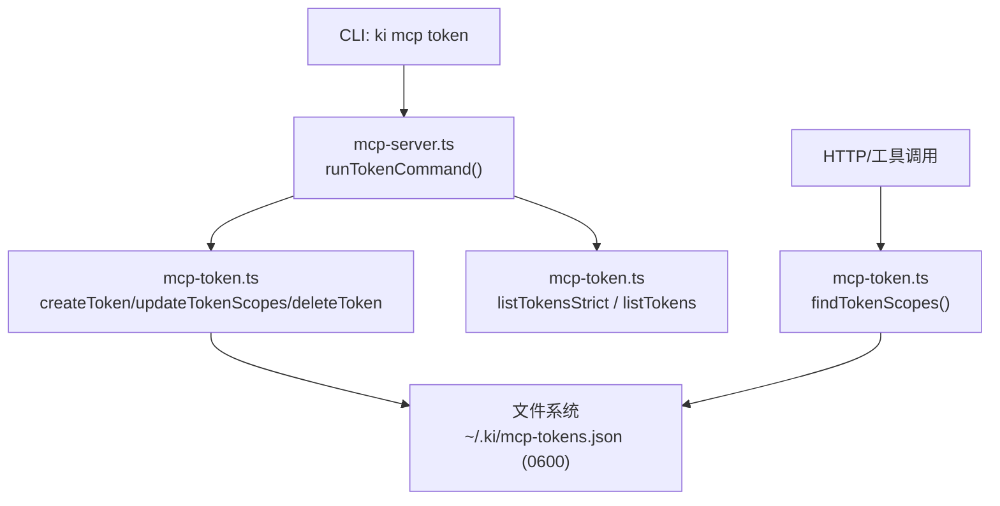
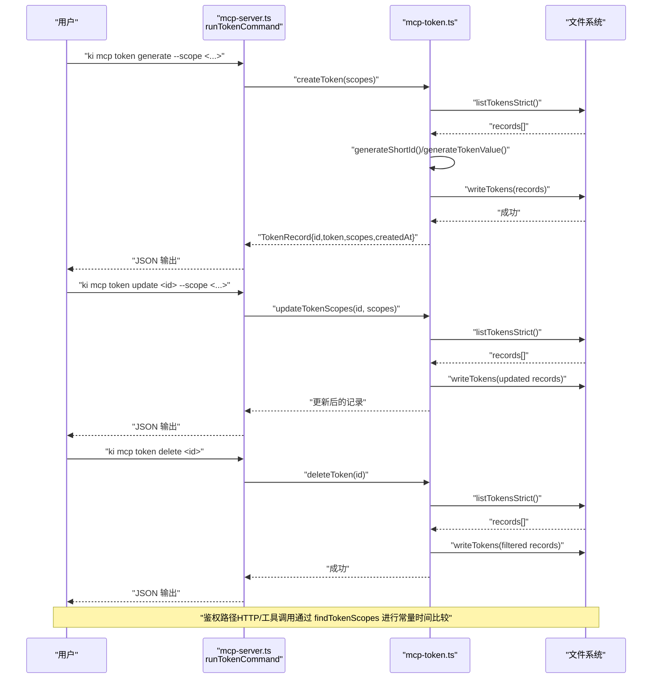
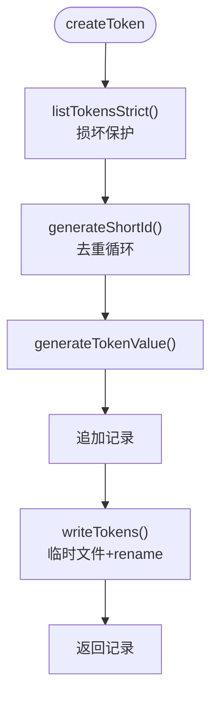
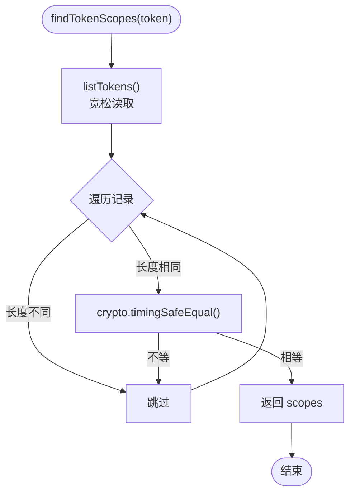
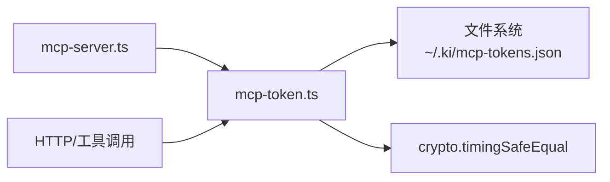

# Token 管理

<cite>
**本文引用的文件**
- [src/lib/mcp-token.ts](file://src/lib/mcp-token.ts)
- [test/mcp-token.test.ts](file://test/mcp-token.test.ts)
- [src/mcp-server.ts](file://src/mcp-server.ts)
- [docs/cli.md](file://docs/cli.md)
- [AGENTS.md](file://AGENTS.md)
</cite>

## 目录
1. [简介](#简介)
2. [项目结构](#项目结构)
3. [核心组件](#核心组件)
4. [架构总览](#架构总览)
5. [详细组件分析](#详细组件分析)
6. [依赖关系分析](#依赖关系分析)
7. [性能与安全考量](#性能与安全考量)
8. [故障排查指南](#故障排查指南)
9. [结论](#结论)
10. [附录：CLI 命令与输出格式](#附录cli-命令与输出格式)

## 简介
本文件系统性说明多 Token 管理机制，覆盖 TokenRecord 数据结构、Token 生成算法（32 字节熵的 base64url 编码）、短 ID 生成规则、完整生命周期（创建、更新授权范围、删除）、原子写入机制（临时文件 + rename）与权限控制（0600），以及鉴权流程（findTokenScopes、timingSafeEqual 时序安全比较）。同时提供 CLI 命令使用示例与参数说明。

## 项目结构
与 Token 管理直接相关的代码集中在以下位置：
- 核心实现：src/lib/mcp-token.ts（数据结构、生成器、读写、鉴权）
- CLI 入口：src/mcp-server.ts（ki mcp token generate/list/update/delete）
- 文档与契约：docs/cli.md、AGENTS.md
- 测试用例：test/mcp-token.test.ts（覆盖生成、权限、原子写、损坏保护等）

图表来源
- [src/mcp-server.ts:228-351](file://src/mcp-server.ts#L228-L351)
- [src/lib/mcp-token.ts:183-264](file://src/lib/mcp-token.ts#L183-L264)

章节来源
- [src/lib/mcp-token.ts:1-265](file://src/lib/mcp-token.ts#L1-L265)
- [src/mcp-server.ts:228-351](file://src/mcp-server.ts#L228-L351)
- [docs/cli.md:962-969](file://docs/cli.md#L962-L969)

## 核心组件
- TokenRecord 数据模型：包含 id（短 ID）、token（明文）、scopes（授权范围集合）、createdAt（ISO 时间戳）
- Token 生成：generateTokenValue 使用 crypto.randomBytes(32).toString('base64url')，约 43 字符
- 短 ID 生成：generateShortId 从自定义字母表随机取 8 位，避免易混淆字符；唯一性由 createToken 循环去重保证
- Scope 解析：resolveScopesArg 支持单个、逗号分隔多个、all（全部）；含 all 时归一为 ['all']
- 存储路径：getTokensPath 返回 ~/.ki/mcp-tokens.json，目录权限 0700，文件权限 0600
- 原子写入：writeTokens 先写同目录临时文件（0600），再 rename 覆盖目标，失败清理临时文件
- 读取策略：listTokens 宽松（损坏返回 []，fail-closed）；listTokensStrict 严格（损坏抛 MCP_TOKEN_CORRUPT）
- 鉴权查询：findTokenScopes 遍历记录并使用 crypto.timingSafeEqual 常量时间比较，命中返回 scopes，未命中返回 undefined
- 授权判定：isScopeAuthorized 支持 null（免鉴权）、['all']（通配）、具体 scope 列表

章节来源
- [src/lib/mcp-token.ts:25-58](file://src/lib/mcp-token.ts#L25-L58)
- [src/lib/mcp-token.ts:60-95](file://src/lib/mcp-token.ts#L60-L95)
- [src/lib/mcp-token.ts:97-147](file://src/lib/mcp-token.ts#L97-L147)
- [src/lib/mcp-token.ts:149-176](file://src/lib/mcp-token.ts#L149-L176)
- [src/lib/mcp-token.ts:245-264](file://src/lib/mcp-token.ts#L245-L264)

## 架构总览
下图展示 Token 从 CLI 到存储与鉴权的整体流程，包括创建、更新、删除与鉴权查找。

图表来源
- [src/mcp-server.ts:228-351](file://src/mcp-server.ts#L228-L351)
- [src/lib/mcp-token.ts:183-264](file://src/lib/mcp-token.ts#L183-L264)

## 详细组件分析

### TokenRecord 数据结构
- id：8 位短 ID，用于 update/delete 操作
- token：32 字节熵的 base64url 字符串，明文落盘
- scopes：授权范围集合，['all'] 表示全部；否则为具体 scope 列表
- createdAt：ISO 8601 时间戳

章节来源
- [src/lib/mcp-token.ts:25-35](file://src/lib/mcp-token.ts#L25-L35)

### Token 生成算法与短 ID 规则
- Token 值：crypto.randomBytes(32).toString('base64url')，约 43 字符，强随机
- 短 ID：从自定义字母表（去除 0/O/1/l/I 等易混淆字符）随机取 8 位；唯一性在 createToken 中通过 Set 去重循环保证

章节来源
- [src/lib/mcp-token.ts:55-68](file://src/lib/mcp-token.ts#L55-L68)
- [test/mcp-token.test.ts:43-65](file://test/mcp-token.test.ts#L43-L65)

### 完整生命周期管理

#### createToken 创建流程
- 严格读取存储文件（listTokensStrict），若损坏则拒绝覆盖写回，防止丢失现有记录
- 生成唯一短 ID（与已有 id 去重）
- 生成强随机 token 值
- 追加记录并原子写回（writeTokens）
- 返回完整记录（含 id、token 明文、scopes、createdAt）

图表来源
- [src/lib/mcp-token.ts:183-201](file://src/lib/mcp-token.ts#L183-L201)
- [src/lib/mcp-token.ts:149-176](file://src/lib/mcp-token.ts#L149-L176)

章节来源
- [src/lib/mcp-token.ts:183-201](file://src/lib/mcp-token.ts#L183-L201)

#### updateTokenScopes 更新授权范围
- 严格读取存储文件
- 按 id 查找目标记录，不存在则抛出 TOKEN_NOT_FOUND
- 更新 scopes 后原子写回
- 返回更新后的记录

章节来源
- [src/lib/mcp-token.ts:207-222](file://src/lib/mcp-token.ts#L207-L222)

#### deleteToken 删除操作
- 严格读取存储文件
- 按 id 查找并移除记录，不存在则抛出 TOKEN_NOT_FOUND
- 原子写回剩余记录

章节来源
- [src/lib/mcp-token.ts:228-238](file://src/lib/mcp-token.ts#L228-L238)

### 原子写入机制与权限控制
- 目录权限：mkdirSync(..., {recursive: true, mode: 0o700})
- 临时文件：在同目录生成 .mcp-tokens.<pid>.<random>.tmp，mode 0600
- 原子替换：fs.renameSync(tmpPath, filePath)，确保原子覆盖
- 异常处理：失败时清理残留临时文件，避免目录堆积
- 文件权限：最终文件继承临时文件的 0600 权限，仅属主可读写

章节来源
- [src/lib/mcp-token.ts:149-176](file://src/lib/mcp-token.ts#L149-L176)
- [test/mcp-token.test.ts:94-108](file://test/mcp-token.test.ts#L94-L108)
- [test/mcp-token.test.ts:153-178](file://test/mcp-token.test.ts#L153-L178)

### 权限控制与存储路径
- 存储路径：~/.ki/mcp-tokens.json（与 mcp-http.lock 同目录）
- 目录权限：0700（仅属主可访问）
- 文件权限：0600（仅属主可读/写）
- 安全约定：Token 明文仅落盘于该文件；list 命令按需回显明文（用户明确要求）

章节来源
- [src/lib/mcp-token.ts:20-23](file://src/lib/mcp-token.ts#L20-L23)
- [src/lib/mcp-token.ts:149-176](file://src/lib/mcp-token.ts#L149-L176)

### 鉴权流程与 timingSafeEqual
- findTokenScopes：遍历所有记录，将传入 token 与存储 token 做长度预检，然后使用 crypto.timingSafeEqual 进行常量时间比较，避免时序侧信道泄露匹配位置
- 命中返回对应 scopes；未命中返回 undefined
- isScopeAuthorized：支持 null（免鉴权）、['all']（通配）、具体 scope 列表

图表来源
- [src/lib/mcp-token.ts:245-259](file://src/lib/mcp-token.ts#L245-L259)

章节来源
- [src/lib/mcp-token.ts:245-259](file://src/lib/mcp-token.ts#L245-L259)

### CLI 命令与参数说明
- generate：必须显式指定 --scope（单个/逗号分隔多个/all），生成强随机 Token + 短 ID，落盘到 ~/.ki/mcp-tokens.json（0600）
- list：列出所有 Token（含短 ID、明文、授权 scope、创建时间）
- update：<id> --scope <scope>，按短 ID 修改授权 scope；id 不存在报错（TOKEN_NOT_FOUND）
- delete：<id>，按短 ID 删除 Token，立即失效；id 不存在报错（TOKEN_NOT_FOUND）

章节来源
- [docs/cli.md:962-969](file://docs/cli.md#L962-L969)
- [src/mcp-server.ts:228-351](file://src/mcp-server.ts#L228-L351)

## 依赖关系分析
- mcp-server.ts 导入 mcp-token.ts 的 createToken、updateTokenScopes、deleteToken、listTokensStrict、resolveScopesArg、tokenCount、ALL_SCOPES
- HTTP/工具调用通过 findTokenScopes 进行鉴权，依赖 mcp-token.ts 的常量时间比较
- 测试覆盖生成、权限、原子写、损坏保护等关键行为

图表来源
- [src/mcp-server.ts:39-47](file://src/mcp-server.ts#L39-L47)
- [src/lib/mcp-token.ts:245-259](file://src/lib/mcp-token.ts#L245-L259)

章节来源
- [src/mcp-server.ts:39-47](file://src/mcp-server.ts#L39-L47)
- [src/lib/mcp-token.ts:245-259](file://src/lib/mcp-token.ts#L245-L259)

## 性能与安全考量
- 性能
  - 原子写入避免半写损坏，减少恢复成本
  - 宽松读取（listTokens）在鉴权路径 fail-closed，避免崩溃
  - 短 ID 去重使用 Set，时间复杂度 O(n)
- 安全
  - Token 值使用 32 字节熵的 base64url，强随机且不可预测
  - 短 ID 去除易混淆字符，降低误输入风险
  - timingSafeEqual 防止时序侧信道攻击
  - 文件权限 0600，目录权限 0700，最小权限原则
  - 损坏保护：严格读取拒绝覆盖写回，防止静默丢失

章节来源
- [src/lib/mcp-token.ts:55-68](file://src/lib/mcp-token.ts#L55-L68)
- [src/lib/mcp-token.ts:149-176](file://src/lib/mcp-token.ts#L149-L176)
- [src/lib/mcp-token.ts:245-259](file://src/lib/mcp-token.ts#L245-L259)
- [test/mcp-token.test.ts:222-263](file://test/mcp-token.test.ts#L222-L263)

## 故障排查指南
- 文件损坏
  - 现象：listTokensStrict 抛出 MCP_TOKEN_CORRUPT
  - 处理：检查 ~/.ki/mcp-tokens.json 内容是否合法 JSON；修复或重建
- Token 不存在
  - 现象：update/delete 抛出 TOKEN_NOT_FOUND
  - 处理：使用 ki mcp token list 查看有效 id
- 权限问题
  - 现象：无法写入或读取 Token 文件
  - 处理：确认目录权限 0700、文件权限 0600，当前用户为属主
- 临时文件残留
  - 现象：目录中存在 .mcp-tokens.*.tmp 文件
  - 处理：通常自动清理；如存在，手动删除并检查写入逻辑

章节来源
- [src/lib/mcp-token.ts:132-147](file://src/lib/mcp-token.ts#L132-L147)
- [src/lib/mcp-token.ts:207-238](file://src/lib/mcp-token.ts#L207-L238)
- [test/mcp-token.test.ts:153-178](file://test/mcp-token.test.ts#L153-L178)

## 结论
多 Token 管理机制通过强随机 Token、短 ID、原子写入与权限控制，提供了安全、可靠、易用的授权体系。鉴权路径采用常量时间比较，避免时序侧信道攻击。CLI 命令简洁直观，便于运维管理。测试覆盖关键场景，确保稳定性与正确性。

## 附录：CLI 命令与输出格式

### 命令总览
- ki mcp token generate --scope <scope>
- ki mcp token list
- ki mcp token update <id> --scope <scope>
- ki mcp token delete <id>

### generate
- 参数：--scope（必填，单个/逗号分隔多个/all）
- 输出：{ ok: true, id, token, scopes, createdAt, hint }
- 说明：Token 已生成并落盘（0600），授权 scope 已设置

章节来源
- [src/mcp-server.ts:231-258](file://src/mcp-server.ts#L231-L258)
- [docs/cli.md:962-969](file://docs/cli.md#L962-L969)

### list
- 参数：无
- 输出：{ ok: true, count, tokens[], hint }
- 说明：列出所有 Token（含明文与授权 scope），损坏时报错（MCP_TOKEN_CORRUPT）

章节来源
- [src/mcp-server.ts:260-283](file://src/mcp-server.ts#L260-L283)

### update
- 参数：<id>（必填）、--scope（必填）
- 输出：{ ok: true, id, scopes, createdAt, hint }
- 说明：按短 ID 修改授权 scope；id 不存在报错（TOKEN_NOT_FOUND）

章节来源
- [src/mcp-server.ts:285-315](file://src/mcp-server.ts#L285-L315)

### delete
- 参数：<id>（必填）
- 输出：{ ok: true, deleted: id, hint }
- 说明：按短 ID 删除 Token，立即失效；id 不存在报错（TOKEN_NOT_FOUND）

章节来源
- [src/mcp-server.ts:317-344](file://src/mcp-server.ts#L317-L344)