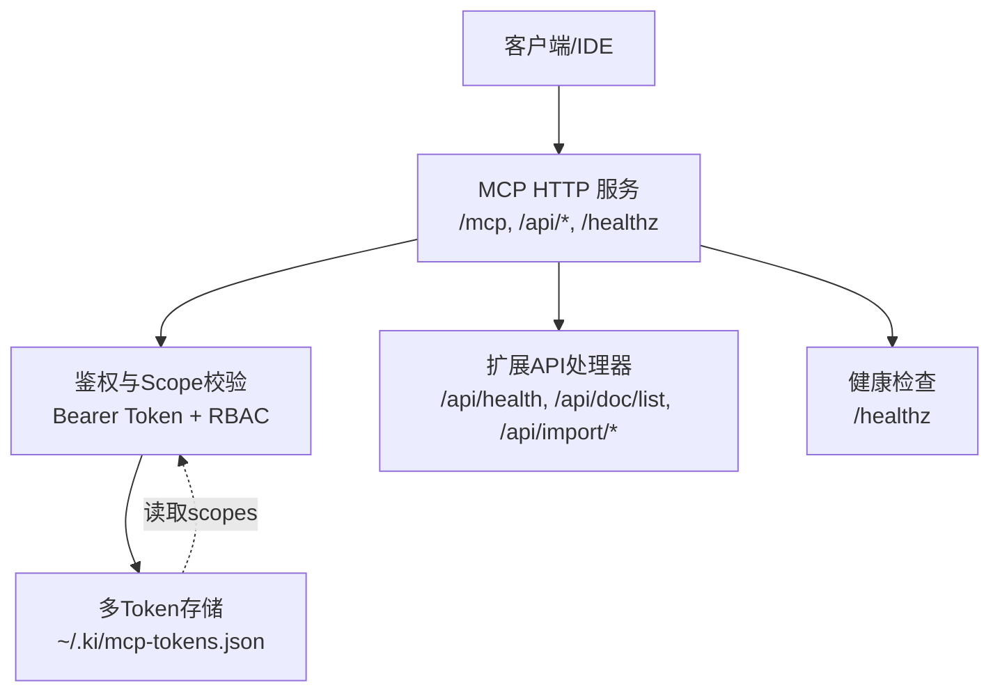
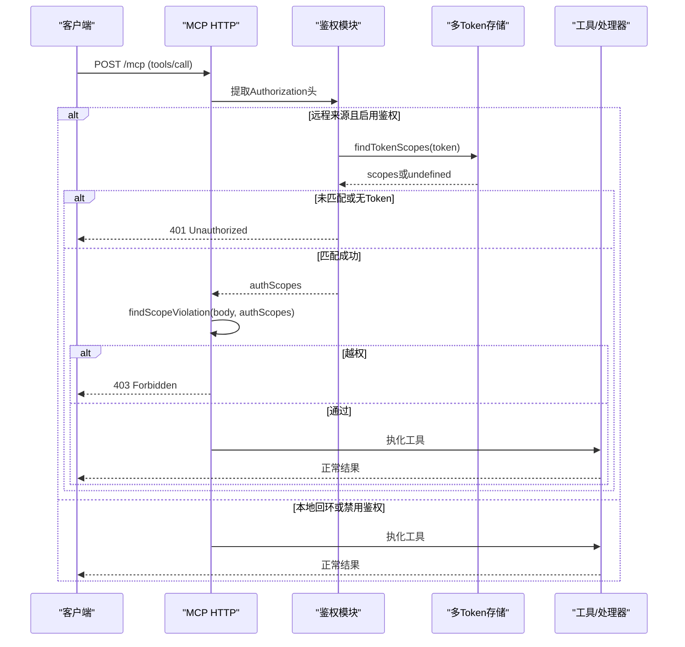
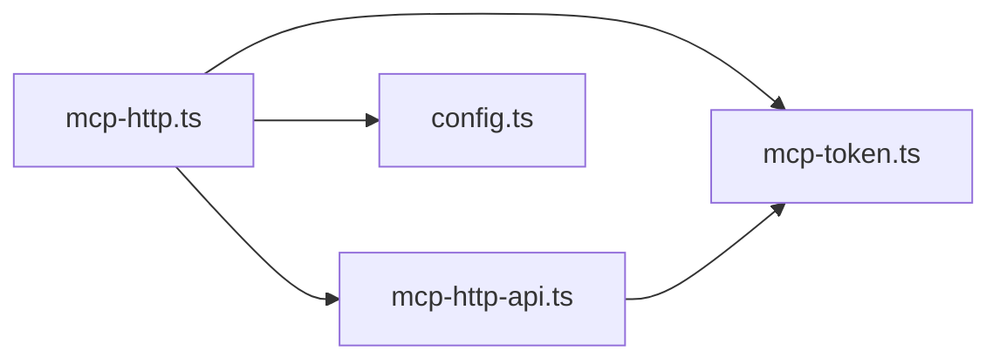

# 安全最佳实践

<cite>
**本文引用的文件**
- [mcp-token.ts](file://src/lib/mcp-token.ts)
- [mcp-http.ts](file://src/lib/mcp-http.ts)
- [mcp-http-api.ts](file://src/lib/mcp-http-api.ts)
- [config.ts](file://src/lib/config.ts)
- [scope.ts](file://src/scope.ts)
- [verify-auth-log.ts](file://.e2e-run/verify-auth-log.ts)
</cite>

## 目录
1. [简介](#简介)
2. [项目结构](#项目结构)
3. [核心组件](#核心组件)
4. [架构总览](#架构总览)
5. [详细组件分析](#详细组件分析)
6. [依赖关系分析](#依赖关系分析)
7. [性能与安全权衡](#性能与安全权衡)
8. [故障排查与应急](#故障排查与应急)
9. [结论](#结论)
10. [附录：监控指标与告警建议](#附录监控指标与告警建议)

## 简介
本文件面向生产环境的安全最佳实践，围绕 Token 生命周期、权限最小化、传输安全、审计日志、常见攻击防护、监控告警与应急响应展开。内容基于仓库中 MCP HTTP 服务、多 Token 存储与 Scope 授权机制的实际实现进行归纳，并提供可落地的流程与配置建议。

## 项目结构
本项目在 MCP HTTP 层实现了“默认回环免鉴权、远程强制 Bearer Token + Scope RBAC”的访问控制模型；Token 明文以原子方式持久化到用户目录，并通过常量时间比较避免侧信道泄露；所有越权与鉴权失败均记录到服务端 stderr，并在健康端点暴露累计计数，便于观测与告警。

图表来源
- [mcp-http.ts:413-521](file://src/lib/mcp-http.ts#L413-L521)
- [mcp-http-api.ts:216-272](file://src/lib/mcp-http-api.ts#L216-L272)
- [mcp-token.ts:245-259](file://src/lib/mcp-token.ts#L245-L259)

章节来源
- [mcp-http.ts:1-15](file://src/lib/mcp-http.ts#L1-L15)
- [mcp-http-api.ts:1-16](file://src/lib/mcp-http-api.ts#L1-L16)
- [mcp-token.ts:1-13](file://src/lib/mcp-token.ts#L1-L13)

## 核心组件
- 多 Token 存储与 RBAC：支持按 Token 绑定 scope 集合，'all' 表示全权；提供创建、更新、删除、查询等能力，并保证存储文件的原子写与严格损坏保护。
- MCP HTTP 鉴权：对外绑定（非回环）强制 Bearer Token；解析 Token 得到授权 scope 集合；对 tools/call 与 /api/* 的 scope 参数做统一越权拦截。
- 配置与 Scope 护栏：支持 strict/default 模式，strict 模式下必须显式传入已注册的 scope，防止未注册范围被隐式使用。
- 健康与可观测性：/healthz 返回鉴权失败次数；stderr 限流输出鉴权失败日志；E2E 验证了可观测性闭环。

章节来源
- [mcp-token.ts:25-50](file://src/lib/mcp-token.ts#L25-L50)
- [mcp-token.ts:156-200](file://src/lib/mcp-token.ts#L156-L200)
- [mcp-http.ts:476-509](file://src/lib/mcp-http.ts#L476-L509)
- [mcp-http.ts:543-561](file://src/lib/mcp-http.ts#L543-L561)
- [config.ts:470-485](file://src/lib/config.ts#L470-L485)
- [mcp-http.ts:437-447](file://src/lib/mcp-http.ts#L437-L447)
- [verify-auth-log.ts:38-40](file://.e2e-run/verify-auth-log.ts#L38-L40)

## 架构总览
下图展示了从请求进入、鉴权、Scope 校验到工具执行与响应返回的完整链路，以及关键的安全控制点。

图表来源
- [mcp-http.ts:476-509](file://src/lib/mcp-http.ts#L476-L509)
- [mcp-http.ts:543-561](file://src/lib/mcp-http.ts#L543-L561)
- [mcp-token.ts:245-259](file://src/lib/mcp-token.ts#L245-L259)

## 详细组件分析

### Token 生命周期与轮换策略
- 生成与存储
  - 使用密码学强随机生成 Token 值，短 ID 用于管理操作；Token 明文仅落盘于用户目录下的 JSON 文件，并以 0600 权限原子写入，避免并发半写损坏。
  - 列表命令仅在明确需要时回显明文，减少敏感信息暴露面。
- 轮换建议
  - 定期轮换：为每个业务场景/团队创建独立 Token，并按周期（如每季度）轮换；轮换时先创建新 Token，再切换调用方，最后删除旧 Token。
  - 最小权限：优先使用精确 scope 列表，避免 'all'；仅在临时调试时使用全权 Token，并缩短有效期。
  - 传输加密：生产环境务必通过 HTTPS/TLS 接入，避免明文 Token 在网络中被窃听。
- 失效与回收
  - 发现异常立即删除对应 Token；若怀疑泄露，应批量轮换受影响 Token。
  - 结合健康端点的鉴权失败计数与 stderr 日志，快速定位问题来源。

章节来源
- [mcp-token.ts:55-68](file://src/lib/mcp-token.ts#L55-L68)
- [mcp-token.ts:156-200](file://src/lib/mcp-token.ts#L156-L200)
- [mcp-token.ts:224-238](file://src/lib/mcp-token.ts#L224-L238)
- [mcp-http.ts:476-509](file://src/lib/mcp-http.ts#L476-L509)

### 权限最小化原则实施
- 按项目隔离 scope
  - 为不同项目/团队分配独立 scope（如 team-a、team-b），并在 Token 中只授予所需 scope。
  - 枚举类工具（ki_scope_list、ki_manage_index_list）走白名单路径，由工具层按 authScopes 过滤输出，避免越权枚举。
- 按需分配权限
  - 新增工具如需访问 scope，应在工具层维护 authScopes 过滤；新增无 scope 参数的工具需同步加入白名单清单并评估风险。
- 定期审计权限分配
  - 通过 tokenCount 统计托管 Token 数量；结合导入/运行接口日志与越权拦截日志，定期审查 Token 与 scope 的匹配度。
  - strict 模式下强制显式 scope 并限制在白名单内，降低误用风险。

章节来源
- [mcp-http.ts:101-139](file://src/lib/mcp-http.ts#L101-L139)
- [mcp-http-api.ts:249-258](file://src/lib/mcp-http-api.ts#L249-L258)
- [config.ts:470-485](file://src/lib/config.ts#L470-L485)
- [mcp-token.ts:43-50](file://src/lib/mcp-token.ts#L43-L50)

### 传输加密要求
- 默认监听地址为回环（127.0.0.1），本地免鉴权；对外绑定（如 0.0.0.0）将强制启用鉴权。
- 生产部署应置于反向代理之后，启用 TLS 终止，确保 Authorization 头在传输过程中加密。
- 可通过 allowedHosts 开启 DNS rebinding 保护，限制 Host 头白名单。

章节来源
- [mcp-http.ts:40-45](file://src/lib/mcp-http.ts#L40-L45)
- [mcp-http.ts:713-714](file://src/lib/mcp-http.ts#L713-L714)
- [mcp-http.ts:583-588](file://src/lib/mcp-http.ts#L583-L588)

### 安全审计日志实现
- 登录尝试记录
  - 鉴权失败（缺少或无效 Bearer）会写入 stderr，并附带来源 IP 与原因；/healthz 暴露累计失败次数，便于集中采集与告警。
- 权限拒绝事件
  - scope 越权拦截会记录请求 scope 与授权 scope 集合（服务端日志），但响应体脱敏，避免被用于枚举探测。
- 异常访问检测
  - 请求体大小限制（16MB）、静态资源路径穿越防护、上传扩展名白名单与大小上限，均在入口层拦截并记录错误。

章节来源
- [mcp-http.ts:377-391](file://src/lib/mcp-http.ts#L377-L391)
- [mcp-http.ts:437-447](file://src/lib/mcp-http.ts#L437-L447)
- [mcp-http.ts:543-561](file://src/lib/mcp-http.ts#L543-L561)
- [mcp-http-api.ts:135-143](file://src/lib/mcp-http-api.ts#L135-L143)
- [mcp-http-api.ts:33-42](file://src/lib/mcp-http-api.ts#L33-L42)
- [verify-auth-log.ts:38-40](file://.e2e-run/verify-auth-log.ts#L38-L40)

### 常见安全风险及防护
- Token 重放攻击防护
  - 当前实现未包含一次性 nonce 或时间戳校验；建议在网关层引入请求签名与时间窗口校验，或在上层协议增加防重放字段。
- 暴力破解防护
  - 鉴权失败日志已限流输出（间隔阈值），避免刷屏；建议在网关层增加速率限制与账号锁定策略。
- 侧信道攻击防护
  - Token 比较使用常量时间比较（timingSafeEqual），避免时序侧信道泄露匹配位置；Token 查找遍历也采用长度预检与常量时间比较。

章节来源
- [mcp-http.ts:194-200](file://src/lib/mcp-http.ts#L194-L200)
- [mcp-token.ts:245-259](file://src/lib/mcp-token.ts#L245-L259)
- [mcp-http.ts:377-391](file://src/lib/mcp-http.ts#L377-L391)

### 安全监控指标与告警建议
- 指标
  - 鉴权失败次数（/healthz.authFailures）
  - 越权拦截次数（stderr 聚合）
  - 会话数与空闲超时（maxSessions、sessionIdleMs）
  - 请求体大小超限次数
- 告警
  - 鉴权失败率突增：可能 Token 配置错误或遭暴力破解
  - 越权拦截频繁：可能存在配置错误或恶意探测
  - 会话堆积：可能客户端异常或未释放连接

章节来源
- [mcp-http.ts:47-54](file://src/lib/mcp-http.ts#L47-L54)
- [mcp-http.ts:437-447](file://src/lib/mcp-http.ts#L437-L447)
- [mcp-http.ts:571-582](file://src/lib/mcp-http.ts#L571-L582)

## 依赖关系分析
- mcp-http.ts 作为入口，负责鉴权、路由分发与限流；依赖 mcp-token.ts 进行 Token 与 scope 解析，依赖 mcp-http-api.ts 处理扩展 API。
- mcp-http-api.ts 复用相同的鉴权与 scope 校验逻辑，确保 /api/* 与 /mcp 一致的安全边界。
- config.ts 提供 strict/default 模式与 scope 白名单约束，强化最小权限落地。

图表来源
- [mcp-http.ts:25-28](file://src/lib/mcp-http.ts#L25-L28)
- [mcp-http-api.ts:23-29](file://src/lib/mcp-http-api.ts#L23-L29)

章节来源
- [mcp-http.ts:25-28](file://src/lib/mcp-http.ts#L25-L28)
- [mcp-http-api.ts:23-29](file://src/lib/mcp-http-api.ts#L23-L29)

## 性能与安全权衡
- 会话上限与空闲回收：防止会话无界增长耗尽内存；空闲会话定时回收，降低资源占用。
- 请求体大小限制：防止滥用导致内存/CPU 压力。
- 常量时间比较：安全性优先，轻微性能开销可接受。
- 存储原子写：避免并发写导致的损坏，提升可靠性。

章节来源
- [mcp-http.ts:47-54](file://src/lib/mcp-http.ts#L47-L54)
- [mcp-http.ts:166-192](file://src/lib/mcp-http.ts#L166-L192)
- [mcp-token.ts:156-176](file://src/lib/mcp-token.ts#L156-L176)

## 故障排查与应急
- 快速处置步骤（Token 泄露）
  - 立即删除泄露 Token（deleteToken）。
  - 轮换受影响 Token：创建新 Token 并更新客户端配置，随后删除旧 Token。
  - 核查 /healthz 鉴权失败计数与 stderr 日志，确认是否仍有异常调用。
- 权限回收流程
  - 通过 updateTokenScopes 缩小 scope；必要时直接 deleteToken。
  - 在 strict 模式下，确保所有调用显式传入已注册 scope。
- 影响评估方法
  - 结合越权拦截日志与导入/运行接口日志，评估受影响 scope 与数据范围。
  - 通过 scope 维度统计文档/向量层数据量，评估潜在影响面。

章节来源
- [mcp-token.ts:224-238](file://src/lib/mcp-token.ts#L224-L238)
- [mcp-token.ts:207-222](file://src/lib/mcp-token.ts#L207-L222)
- [mcp-http.ts:437-447](file://src/lib/mcp-http.ts#L437-L447)
- [scope.ts:147-181](file://src/scope.ts#L147-L181)

## 结论
本项目在 MCP HTTP 层实现了较为完善的多 Token + Scope RBAC 模型，具备常量时间比较、原子存储、越权拦截与健康可观测性等关键安全特性。生产环境应结合 TLS、网关限速与集中日志/告警，形成端到端的安全闭环。建议持续遵循最小权限、定期轮换与审计的原则，保障系统长期安全。

## 附录：监控指标与告警建议
- 指标采集
  - 鉴权失败次数：/healthz.authFailures
  - 越权拦截次数：stderr 聚合
  - 会话数：transports.size
  - 请求体超限：readJsonBody 错误计数
- 告警规则
  - 鉴权失败率 > 阈值：触发告警，检查客户端配置与网络
  - 越权拦截突增：检查 Token scope 配置与客户端行为
  - 会话堆积：检查客户端是否正确关闭会话

章节来源
- [mcp-http.ts:377-391](file://src/lib/mcp-http.ts#L377-L391)
- [mcp-http.ts:437-447](file://src/lib/mcp-http.ts#L437-L447)
- [mcp-http.ts:571-582](file://src/lib/mcp-http.ts#L571-L582)
- [mcp-http-api.ts:33-42](file://src/lib/mcp-http-api.ts#L33-L42)