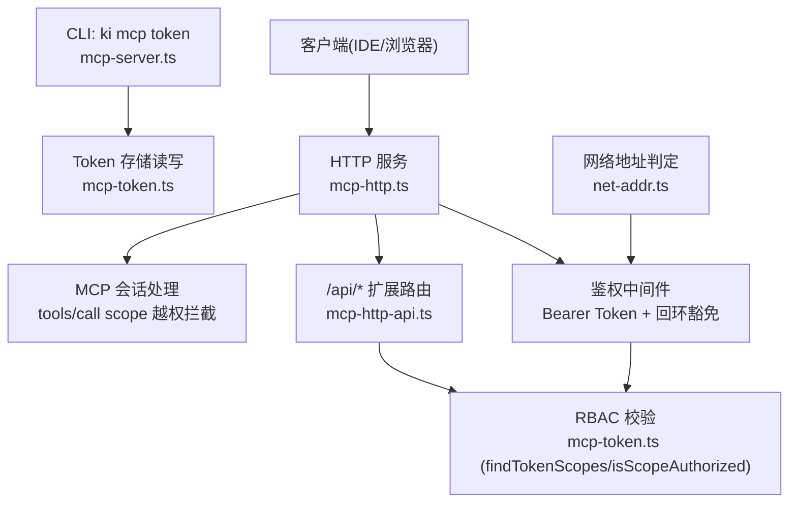
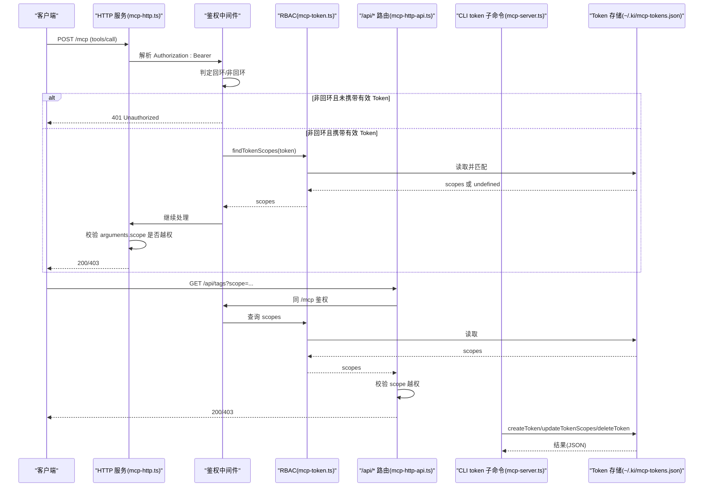
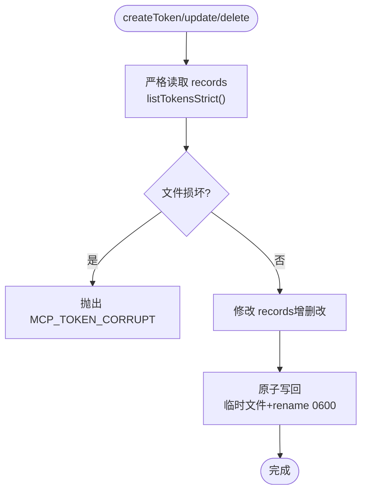
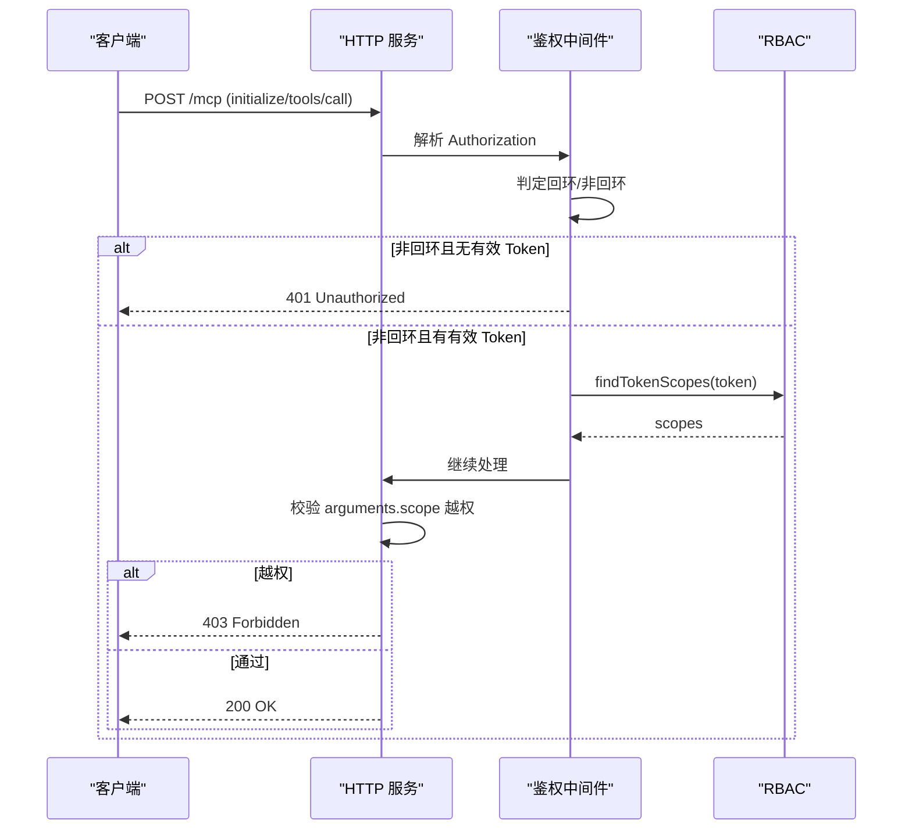
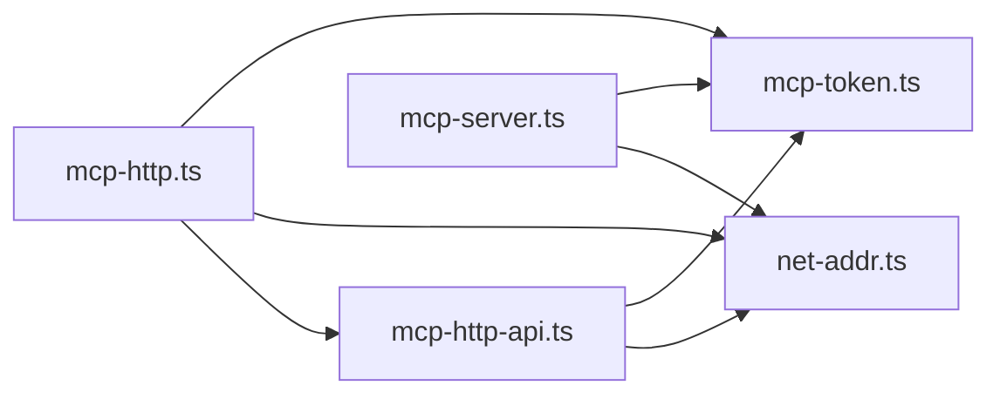

# 安全认证机制

<cite>
**本文引用的文件**
- [src/lib/mcp-token.ts](file://src/lib/mcp-token.ts)
- [src/lib/mcp-http.ts](file://src/lib/mcp-http.ts)
- [src/lib/mcp-http-api.ts](file://src/lib/mcp-http-api.ts)
- [src/lib/net-addr.ts](file://src/lib/net-addr.ts)
- [src/scope.ts](file://src/scope.ts)
- [src/lib/scope.ts](file://src/lib/scope.ts)
- [src/mcp-server.ts](file://src/mcp-server.ts)
- [docs/mcp-http.md](file://docs/mcp-http.md)
- [test/mcp-token.test.ts](file://test/mcp-token.test.ts)
</cite>

## 目录
1. [简介](#简介)
2. [项目结构](#项目结构)
3. [核心组件](#核心组件)
4. [架构总览](#架构总览)
5. [详细组件分析](#详细组件分析)
6. [依赖关系分析](#依赖关系分析)
7. [性能与安全考量](#性能与安全考量)
8. [故障排查指南](#故障排查指南)
9. [结论](#结论)
10. [附录：命令速查](#附录命令速查)

## 简介
本文件系统性说明 ki MCP 的安全认证机制，覆盖 Token 生成与管理、scope 授权与访问控制、HTTP 模式鉴权策略（回环免鉴权与非回环强制鉴权）、多 Token 存储管理、Token 生命周期管理与安全最佳实践。文档同时提供常见安全风险与防护措施，包括 Token 泄露防护、权限最小化原则与审计日志建议。

## 项目结构
围绕安全认证的关键代码分布在以下模块：
- Token 存储与 RBAC 校验：mcp-token.ts
- HTTP 服务与鉴权中间件：mcp-http.ts
- /api/* 扩展路由的鉴权与 scope 校验：mcp-http-api.ts
- 网络地址判定（回环/非回环）：net-addr.ts
- Scope 工具与 CLI：scope.ts、lib/scope.ts
- CLI 入口与 token 子命令实现：mcp-server.ts
- 用户文档与行为约定：docs/mcp-http.md
- 单元测试验证关键安全特性：test/mcp-token.test.ts

图表来源
- [src/lib/mcp-http.ts:476-509](file://src/lib/mcp-http.ts#L476-L509)
- [src/lib/mcp-token.ts:43-50](file://src/lib/mcp-token.ts#L43-L50)
- [src/lib/net-addr.ts:6-34](file://src/lib/net-addr.ts#L6-L34)
- [src/lib/mcp-http-api.ts:216-272](file://src/lib/mcp-http-api.ts#L216-L272)
- [src/mcp-server.ts:227-351](file://src/mcp-server.ts#L227-L351)

章节来源
- [src/lib/mcp-http.ts:1-120](file://src/lib/mcp-http.ts#L1-L120)
- [src/lib/mcp-token.ts:1-120](file://src/lib/mcp-token.ts#L1-L120)
- [src/lib/net-addr.ts:1-35](file://src/lib/net-addr.ts#L1-L35)
- [src/lib/mcp-http-api.ts:1-120](file://src/lib/mcp-http-api.ts#L1-L120)
- [src/mcp-server.ts:83-120](file://src/mcp-server.ts#L83-L120)
- [docs/mcp-http.md:132-146](file://docs/mcp-http.md#L132-L146)

## 核心组件
- 多 Token 存储与 RBAC：
  - 存储位置：~/.ki/mcp-tokens.json（0600），每条记录包含短 ID、Token 明文、授权 scopes、创建时间。
  - 支持 'all' 通配全部 scope；isScopeAuthorized 用于判断请求 scope 是否在授权集合内。
  - 常量时间比较防时序侧信道攻击。
- HTTP 鉴权中间件：
  - 按绑定地址决定鉴权开关：回环地址免鉴权，非回环地址强制 Bearer Token。
  - 支持全权临时 Token（--token/KI_MCP_TOKEN）与多 Token 存储两种来源，优先级明确。
  - tools/call 的 arguments.scope 缺省为 'default'，参与越权校验；枚举工具白名单跳过单点校验，由工具层按授权集合过滤输出。
- /api/* 扩展路由鉴权：
  - 与 /mcp 一致的鉴权规则；对带 scope 的只读接口（tags/doc/list）进行 query/body scope 越权校验。
- 网络地址判定：
  - isLoopbackHost/isLoopbackAddr 统一判定本地回环来源，确保鉴权策略一致。
- CLI token 子命令：
  - generate/list/update/delete 完整生命周期管理；generate 必须显式指定 --scope；list 按需回显明文；update/delete 使用严格读取防止损坏文件被静默覆盖。

章节来源
- [src/lib/mcp-token.ts:20-58](file://src/lib/mcp-token.ts#L20-L58)
- [src/lib/mcp-token.ts:97-176](file://src/lib/mcp-token.ts#L97-L176)
- [src/lib/mcp-token.ts:178-264](file://src/lib/mcp-token.ts#L178-L264)
- [src/lib/mcp-http.ts:476-509](file://src/lib/mcp-http.ts#L476-L509)
- [src/lib/mcp-http-api.ts:216-272](file://src/lib/mcp-http-api.ts#L216-L272)
- [src/lib/net-addr.ts:6-34](file://src/lib/net-addr.ts#L6-L34)
- [src/mcp-server.ts:227-351](file://src/mcp-server.ts#L227-L351)

## 架构总览
下图展示从客户端到服务端鉴权与 RBAC 的端到端流程，以及 Token 管理的 CLI 路径。

图表来源
- [src/lib/mcp-http.ts:476-509](file://src/lib/mcp-http.ts#L476-L509)
- [src/lib/mcp-token.ts:240-259](file://src/lib/mcp-token.ts#L240-L259)
- [src/lib/mcp-http-api.ts:216-272](file://src/lib/mcp-http-api.ts#L216-L272)
- [src/mcp-server.ts:227-351](file://src/mcp-server.ts#L227-L351)

## 详细组件分析

### Token 存储与 RBAC（mcp-token.ts）
- 数据结构与生成：
  - TokenRecord：id（8 位短 ID）、token（32 字节熵 base64url）、scopes（字符串数组）、createdAt（ISO 8601）。
  - generateTokenValue/generateShortId：强随机生成，避免易混淆字符。
- 解析与校验：
  - resolveScopesArg：支持单个、多个逗号分隔、'all'；非法字符抛错。
  - isScopeAuthorized：null 表示免鉴权；['all'] 表示全部；否则精确匹配。
- 持久化与原子写：
  - 写入采用临时文件 + rename 原子操作，目录与文件权限 0700/0600，防止半写损坏。
  - listTokensStrict：损坏时抛错（MCP_TOKEN_CORRUPT），防止静默覆盖导致数据丢失。
- 鉴权查询：
  - findTokenScopes：遍历记录并使用 timingSafeEqual 常量时间比较，返回 scopes 或 undefined。
  - tokenCount：仅统计数量，不回显明文。

图表来源
- [src/lib/mcp-token.ts:97-176](file://src/lib/mcp-token.ts#L97-L176)
- [src/lib/mcp-token.ts:178-238](file://src/lib/mcp-token.ts#L178-L238)

章节来源
- [src/lib/mcp-token.ts:20-58](file://src/lib/mcp-token.ts#L20-L58)
- [src/lib/mcp-token.ts:70-95](file://src/lib/mcp-token.ts#L70-L95)
- [src/lib/mcp-token.ts:97-176](file://src/lib/mcp-token.ts#L97-L176)
- [src/lib/mcp-token.ts:178-264](file://src/lib/mcp-token.ts#L178-L264)
- [test/mcp-token.test.ts:94-178](file://test/mcp-token.test.ts#L94-L178)
- [test/mcp-token.test.ts:222-263](file://test/mcp-token.test.ts#L222-L263)

### HTTP 鉴权与 scope 越权拦截（mcp-http.ts）
- 条件鉴权：
  - 回环地址（127.0.0.1/::1/localhost）免鉴权；非回环地址强制 Bearer Token。
  - 全权临时 Token（--token/KI_MCP_TOKEN）优先于多 Token 存储。
- 鉴权流程：
  - 提取 Authorization: Bearer；若为空或无效，返回 401。
  - 命中后获取 scopes（['all'] 或具体列表），供后续越权校验。
- scope 越权校验：
  - 对 tools/call 的 arguments.scope（缺省 'default'）进行越权检查；越权返回 403。
  - 枚举工具白名单（ki_scope_list、ki_manage_index_list）跳过此校验，交由工具层按授权集合过滤输出。
- 会话与资源保护：
  - 最大并发会话数限制（默认 256），空闲会话回收（默认 30 分钟）。
  - DNS rebinding 保护（可选 allowedHosts）。

图表来源
- [src/lib/mcp-http.ts:476-509](file://src/lib/mcp-http.ts#L476-L509)
- [src/lib/mcp-http.ts:523-561](file://src/lib/mcp-http.ts#L523-L561)
- [src/lib/net-addr.ts:6-34](file://src/lib/net-addr.ts#L6-L34)

章节来源
- [src/lib/mcp-http.ts:37-85](file://src/lib/mcp-http.ts#L37-L85)
- [src/lib/mcp-http.ts:476-509](file://src/lib/mcp-http.ts#L476-L509)
- [src/lib/mcp-http.ts:523-561](file://src/lib/mcp-http.ts#L523-L561)
- [docs/mcp-http.md:132-146](file://docs/mcp-http.md#L132-L146)

### /api/* 扩展路由鉴权（mcp-http-api.ts）
- 鉴权规则与 /mcp 一致：非回环强制 Bearer Token，回环免鉴权。
- scope 越权校验：
  - 对 tags/doc/list 等带 scope 的只读接口，校验 query/body scope 是否在授权范围内。
  - 越权拒绝并记录日志（脱敏响应体，不暴露具体 scope 名）。
- 其他能力：
  - /api/health：健康报告（含 zvec 探活）。
  - /api/import/*：上传与导入（受控目录、大小限制、扩展名白名单）。

章节来源
- [src/lib/mcp-http-api.ts:216-272](file://src/lib/mcp-http-api.ts#L216-L272)
- [src/lib/mcp-http-api.ts:290-369](file://src/lib/mcp-http-api.ts#L290-L369)
- [src/lib/mcp-http-api.ts:371-506](file://src/lib/mcp-http-api.ts#L371-L506)

### CLI token 子命令（mcp-server.ts）
- generate：必须显式指定 --scope；生成强随机 Token + 短 ID，落盘 0600。
- list：列出所有 Token（含明文与授权 scope），损坏文件时报错（MCP_TOKEN_CORRUPT）。
- update <id> --scope <...>：按短 ID 修改授权 scope；id 不存在报错（TOKEN_NOT_FOUND）。
- delete <id>：删除 Token，立即失效；id 不存在报错（TOKEN_NOT_FOUND）。

章节来源
- [src/mcp-server.ts:227-351](file://src/mcp-server.ts#L227-L351)
- [docs/cli.md:962-969](file://docs/cli.md#L962-L969)

### Scope 工具与路径（scope.ts、lib/scope.ts）
- validateScope：校验 scope 参数合法性（字母、数字、连字符、下划线），拒绝路径穿越。
- getKbDir/getGroupIndexPath/getRelationsCachePath：构造 KB 目录与索引路径。
- listAllScopes：列举已初始化的 scope（KB 目录层 + config.scopes）。
- 与向量引擎交互（scope.ts CLI）：list/delete/clear 操作，结合向量服务可用性。

章节来源
- [src/lib/scope.ts:11-43](file://src/lib/scope.ts#L11-L43)
- [src/lib/scope.ts:45-77](file://src/lib/scope.ts#L45-L77)
- [src/lib/scope.ts:169-198](file://src/lib/scope.ts#L169-L198)
- [src/scope.ts:32-54](file://src/scope.ts#L32-L54)
- [src/scope.ts:94-134](file://src/scope.ts#L94-L134)
- [src/scope.ts:147-223](file://src/scope.ts#L147-L223)

## 依赖关系分析
- mcp-http.ts 依赖：
  - mcp-token.ts：findTokenScopes、ALL_SCOPES、tokenCount。
  - net-addr.ts：isLoopbackHost/isLoopbackAddr。
  - mcp-http-api.ts：延迟加载 /api/* 路由。
- mcp-http-api.ts 依赖：
  - mcp-token.ts：findTokenScopes、ALL_SCOPES。
  - net-addr.ts：isLoopbackAddr。
  - lib/config.js、lib/scope.js：配置与路径解析。
- mcp-server.ts 依赖：
  - mcp-token.ts：createToken、listTokensStrict、updateTokenScopes、deleteToken、resolveScopesArg。
  - net-addr.ts：isLoopbackHost。

图表来源
- [src/lib/mcp-http.ts:24-28](file://src/lib/mcp-http.ts#L24-L28)
- [src/lib/mcp-http-api.ts:23-29](file://src/lib/mcp-http-api.ts#L23-L29)
- [src/mcp-server.ts:200-225](file://src/mcp-server.ts#L200-L225)

章节来源
- [src/lib/mcp-http.ts:24-28](file://src/lib/mcp-http.ts#L24-L28)
- [src/lib/mcp-http-api.ts:23-29](file://src/lib/mcp-http-api.ts#L23-L29)
- [src/mcp-server.ts:200-225](file://src/mcp-server.ts#L200-L225)

## 性能与安全考量
- 性能：
  - 会话上限与空闲回收：默认 256 会话、30 分钟空闲超时，防止内存泄漏。
  - 批量请求校验：逐个 tools/call 校验 scope，避免 batch 绕过。
  - 常量时间比较：Token 比较使用 timingSafeEqual，防时序侧信道。
- 安全：
  - 回环免鉴权、非回环强制鉴权：降低本机开发风险，生产远程暴露需 TLS 反代。
  - 权限最小化：generate 必须显式指定 --scope；支持 'all' 但应谨慎使用。
  - 文件权限：Token 存储 0600，目录 0700；原子写防止半写损坏。
  - 审计日志：鉴权失败与 scope 越权拦截记录 stderr，便于排障。
  - 枚举工具过滤：ki_scope_list/ki_manage_index_list 按授权集合过滤输出，防止泄露 scope 结构。

章节来源
- [src/lib/mcp-http.ts:47-54](file://src/lib/mcp-http.ts#L47-L54)
- [src/lib/mcp-http.ts:118-139](file://src/lib/mcp-http.ts#L118-L139)
- [src/lib/mcp-token.ts:240-259](file://src/lib/mcp-token.ts#L240-L259)
- [src/lib/mcp-token.ts:150-176](file://src/lib/mcp-token.ts#L150-L176)
- [docs/mcp-http.md:132-146](file://docs/mcp-http.md#L132-L146)

## 故障排查指南
- 401 Unauthorized：
  - 非回环绑定未携带 Authorization: Bearer 或 Token 无效。
  - 核对客户端 Authorization 与 ki mcp token list 输出完全一致（整段复制）。
  - 服务端 stderr 有失败原因日志。
- 403 Forbidden：
  - Token 有效但请求 scope 不在授权范围。
  - 用 ki mcp token update <id> --scope <...> 扩大授权；确认客户端请求 scope 正确。
  - 枚举工具无参调用不受此校验限制，出现 403 说明请求的是带 scope 参数的工具或 /api 接口。
- 文件损坏（MCP_TOKEN_CORRUPT）：
  - Token 存储文件损坏时，list/update/delete 拒绝操作以防数据丢失。
  - 人工检查 ~/.ki/mcp-tokens.json 并修复。
- 端口占用/启动失败：
  - EADDRINUSE：端口被占用且探活未命中健康实例，更换端口或排查占用进程。
  - EACCES：<1024 端口需提权，改用高位端口。
  - EADDRNOTAVAIL/ENOTFOUND：地址不可用或主机无法解析。

章节来源
- [src/lib/mcp-http.ts:476-509](file://src/lib/mcp-http.ts#L476-L509)
- [src/lib/mcp-http.ts:523-561](file://src/lib/mcp-http.ts#L523-L561)
- [src/lib/mcp-token.ts:132-147](file://src/lib/mcp-token.ts#L132-L147)
- [src/lib/mcp-http.ts:644-665](file://src/lib/mcp-http.ts#L644-L665)
- [docs/mcp-http.md:224-233](file://docs/mcp-http.md#L224-L233)

## 结论
ki MCP 的安全认证机制以“条件鉴权 + RBAC”为核心，通过回环免鉴权与非回环强制鉴权平衡易用性与安全性；多 Token 存储与 scope 授权实现细粒度权限控制；原子写与权限约束保障存储安全；完善的日志与错误码便于排障。建议在生产环境使用 TLS 反代、最小权限 Token 与定期审计，确保长期安全。

## 附录：命令速查
- ki mcp token generate --scope <scope>：生成强随机 Token + 短 ID，落盘 0600。
- ki mcp token list：列出所有 Token（含明文与授权 scope）。
- ki mcp token update <id> --scope <scope>：按短 ID 修改授权 scope。
- ki mcp token delete <id>：删除 Token，立即失效。

章节来源
- [src/mcp-server.ts:227-351](file://src/mcp-server.ts#L227-L351)
- [docs/cli.md:962-969](file://docs/cli.md#L962-L969)