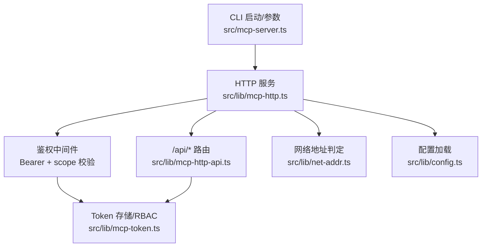
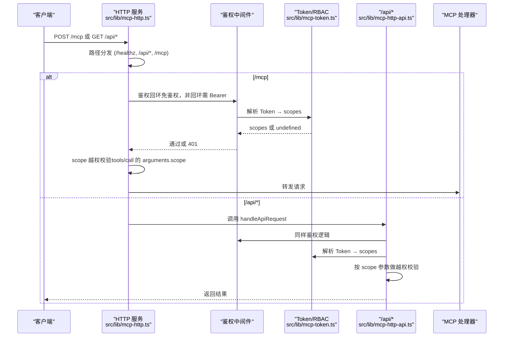
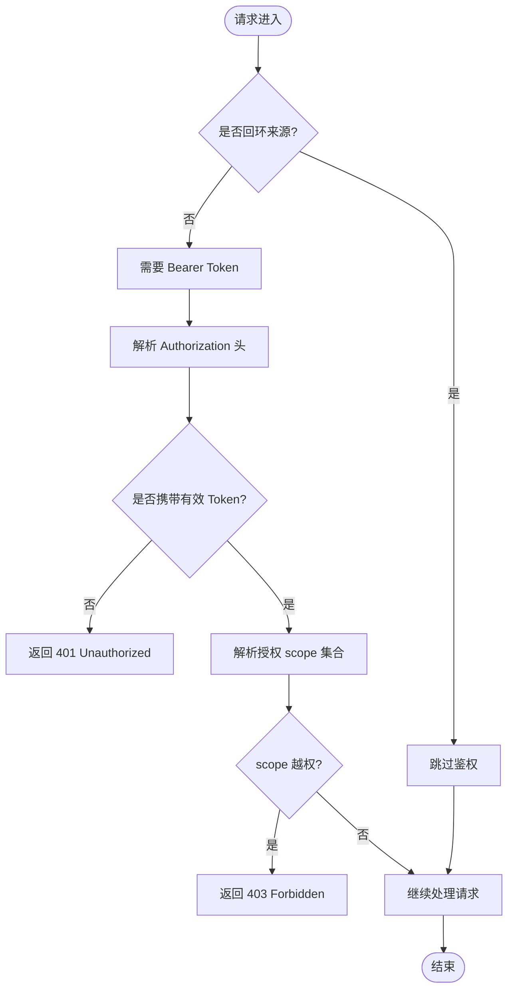
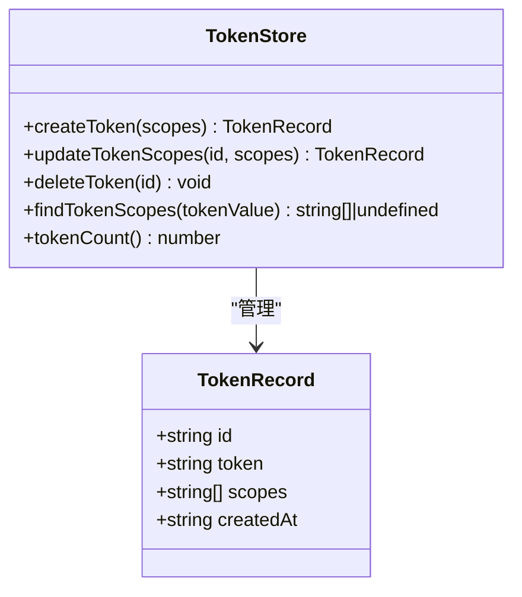
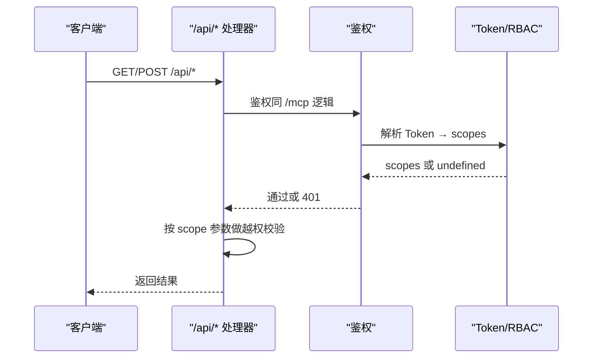
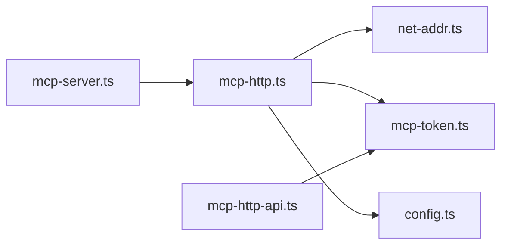

# 安全配置

<cite>
**本文引用的文件**
- [src/lib/mcp-http.ts](file://src/lib/mcp-http.ts)
- [src/lib/mcp-token.ts](file://src/lib/mcp-token.ts)
- [src/lib/mcp-http-api.ts](file://src/lib/mcp-http-api.ts)
- [src/lib/config.ts](file://src/lib/config.ts)
- [src/lib/net-addr.ts](file://src/lib/net-addr.ts)
- [src/mcp-server.ts](file://src/mcp-server.ts)
- [docs/mcp-http.md](file://docs/mcp-http.md)
- [docs/configuration.md](file://docs/configuration.md)
</cite>

## 目录
1. [简介](#简介)
2. [项目结构](#项目结构)
3. [核心组件](#核心组件)
4. [架构总览](#架构总览)
5. [详细组件分析](#详细组件分析)
6. [依赖关系分析](#依赖关系分析)
7. [性能与安全考量](#性能与安全考量)
8. [故障排查指南](#故障排查指南)
9. [结论](#结论)
10. [附录：部署场景安全模板](#附录部署场景安全模板)

## 简介
本文件聚焦于 ki mcp HTTP 模式的安全配置与鉴权机制，覆盖以下要点：
- 回环地址（localhost/127.0.0.1）免鉴权与非回环地址强制鉴权的策略与实现
- 鉴权中间件的实现原理、请求拦截流程与响应处理机制
- 环境变量与配置项：KI_MCP_TOKEN、mcp.http.host/port/allowedHosts 等
- 安全最佳实践：网络绑定、防火墙、日志审计
- 不同部署场景的安全配置模板：开发、生产、容器化

## 项目结构
围绕安全与鉴权的核心代码集中在以下模块：
- HTTP 服务与鉴权中间件：src/lib/mcp-http.ts
- 多 Token 存储与 RBAC 授权：src/lib/mcp-token.ts
- /api/* 扩展接口鉴权：src/lib/mcp-http-api.ts
- 配置加载与默认值：src/lib/config.ts
- 网络地址判定（回环判断）：src/lib/net-addr.ts
- CLI 参数解析与启动入口：src/mcp-server.ts
- 用户文档：docs/mcp-http.md、docs/configuration.md



**图表来源**
- [src/lib/mcp-http.ts:363-521](file://src/lib/mcp-http.ts#L363-L521)
- [src/lib/mcp-token.ts:240-259](file://src/lib/mcp-token.ts#L240-L259)
- [src/lib/mcp-http-api.ts:216-272](file://src/lib/mcp-http-api.ts#L216-L272)
- [src/lib/net-addr.ts:6-34](file://src/lib/net-addr.ts#L6-L34)
- [src/lib/config.ts:105-136](file://src/lib/config.ts#L105-L136)
- [src/mcp-server.ts:119-172](file://src/mcp-server.ts#L119-L172)

**章节来源**
- [src/lib/mcp-http.ts:363-521](file://src/lib/mcp-http.ts#L363-L521)
- [src/lib/mcp-token.ts:240-259](file://src/lib/mcp-token.ts#L240-L259)
- [src/lib/mcp-http-api.ts:216-272](file://src/lib/mcp-http-api.ts#L216-L272)
- [src/lib/net-addr.ts:6-34](file://src/lib/net-addr.ts#L6-L34)
- [src/lib/config.ts:105-136](file://src/lib/config.ts#L105-L136)
- [src/mcp-server.ts:119-172](file://src/mcp-server.ts#L119-L172)

## 核心组件
- 条件鉴权开关：根据监听地址是否为回环决定是否需要 Bearer Token。回环地址（127.0.0.1/localhost/::1）免鉴权；非回环地址（如 0.0.0.0/外网 IP）强制鉴权。
- 鉴权中间件：在 /mcp 与 /api/* 入口处统一校验 Authorization: Bearer，支持全权临时 Token（--token/KI_MCP_TOKEN）与多 Token 存储（~/.ki/mcp-tokens.json）。
- RBAC scope 越权校验：对 tools/call 的 arguments.scope（缺省为 'default'）进行授权集合校验；无 scope 参数的枚举工具由工具层按授权过滤输出。
- 配置与环境变量：
  - KI_MCP_TOKEN：进程级全权临时 Token，优先级最高，不写入配置文件。
  - mcp.http.host/port/allowedHosts：仅作为传输默认值，可通过 CLI 覆盖。
- 安全增强：DNS rebinding 保护（allowedHosts）、会话上限与空闲回收、常量时间比较防时序攻击、落盘权限控制（0600）。

**章节来源**
- [src/lib/mcp-http.ts:41-45](file://src/lib/mcp-http.ts#L41-L45)
- [src/lib/mcp-http.ts:476-509](file://src/lib/mcp-http.ts#L476-L509)
- [src/lib/mcp-http.ts:543-561](file://src/lib/mcp-http.ts#L543-L561)
- [src/lib/mcp-token.ts:150-176](file://src/lib/mcp-token.ts#L150-L176)
- [src/lib/config.ts:105-136](file://src/lib/config.ts#L105-L136)
- [src/mcp-server.ts:164-172](file://src/mcp-server.ts#L164-L172)

## 架构总览
下图展示了从请求进入 HTTP 服务到鉴权、RBAC 校验、再到 MCP 或 /api/* 处理的完整链路。



**图表来源**
- [src/lib/mcp-http.ts:431-521](file://src/lib/mcp-http.ts#L431-L521)
- [src/lib/mcp-http-api.ts:216-272](file://src/lib/mcp-http-api.ts#L216-L272)
- [src/lib/mcp-token.ts:240-259](file://src/lib/mcp-token.ts#L240-L259)

## 详细组件分析

### 鉴权中间件与请求拦截流程
- 回环判定：使用 isLoopbackHost/isLoopbackAddr 判断监听地址与请求来源是否本地回环。
- 鉴权触发：当 authEnabled=true（非回环绑定时），要求 Authorization: Bearer <token>。
- Token 匹配：优先匹配全权临时 Token（--token/KI_MCP_TOKEN），否则查多 Token 存储并获取授权 scope 集合。
- 越权拦截：对 tools/call 的 arguments.scope（缺省 'default'）进行授权集合校验；越权返回 403。
- 日志与可观测性：鉴权失败限流记录 stderr，并在 /healthz 中暴露累计失败次数。



**图表来源**
- [src/lib/mcp-http.ts:476-509](file://src/lib/mcp-http.ts#L476-L509)
- [src/lib/mcp-http.ts:543-561](file://src/lib/mcp-http.ts#L543-L561)
- [src/lib/net-addr.ts:6-34](file://src/lib/net-addr.ts#L6-L34)

**章节来源**
- [src/lib/mcp-http.ts:476-509](file://src/lib/mcp-http.ts#L476-L509)
- [src/lib/mcp-http.ts:543-561](file://src/lib/mcp-http.ts#L543-L561)
- [src/lib/net-addr.ts:6-34](file://src/lib/net-addr.ts#L6-L34)

### 多 Token 存储与 RBAC 授权
- 存储位置：~/.ki/mcp-tokens.json，权限 0600，原子写（临时文件 + rename）防止半写损坏。
- 生成与管理：ki mcp token generate/list/update/delete，必须显式指定 --scope（单个/多个/all）。
- 查找与比较：findTokenScopes 遍历记录并使用常量时间比较避免时序侧信道泄露。
- 授权语义：['all'] 表示全部 scope；具体列表则逐项匹配；null 表示免鉴权（不限）。



**图表来源**
- [src/lib/mcp-token.ts:25-35](file://src/lib/mcp-token.ts#L25-L35)
- [src/lib/mcp-token.ts:183-201](file://src/lib/mcp-token.ts#L183-L201)
- [src/lib/mcp-token.ts:240-259](file://src/lib/mcp-token.ts#L240-L259)

**章节来源**
- [src/lib/mcp-token.ts:150-176](file://src/lib/mcp-token.ts#L150-L176)
- [src/lib/mcp-token.ts:183-201](file://src/lib/mcp-token.ts#L183-L201)
- [src/lib/mcp-token.ts:240-259](file://src/lib/mcp-token.ts#L240-L259)

### /api/* 扩展接口的鉴权与越权校验
- 鉴权规则与 /mcp 一致：非回环绑定强制 Bearer Token。
- 越权校验：对 query/body 中的 scope 参数进行授权集合校验（tags/doc/list/import/upload/run）。
- 健康检查：/api/health 提供健康报告（含 zvec 探活，超时保护）。



**图表来源**
- [src/lib/mcp-http-api.ts:216-272](file://src/lib/mcp-http-api.ts#L216-L272)
- [src/lib/mcp-http-api.ts:373-450](file://src/lib/mcp-http-api.ts#L373-L450)
- [src/lib/mcp-http-api.ts:454-506](file://src/lib/mcp-http-api.ts#L454-L506)

**章节来源**
- [src/lib/mcp-http-api.ts:216-272](file://src/lib/mcp-http-api.ts#L216-L272)
- [src/lib/mcp-http-api.ts:373-450](file://src/lib/mcp-http-api.ts#L373-L450)
- [src/lib/mcp-http-api.ts:454-506](file://src/lib/mcp-http-api.ts#L454-L506)

### 配置与环境变量
- KI_MCP_TOKEN：进程级全权临时 Token，优先级高于多 Token 存储，不写入配置文件。
- mcp.http.host/port/allowedHosts：仅作为传输默认值，CLI 参数优先。
- 配置文件优先级：--config > KI_CONFIG_PATH > ~/.ki/config.yaml/yml/json > 内置默认。
- 安全建议：apiKey 使用环境变量引用，避免明文落盘。

**章节来源**
- [src/mcp-server.ts:164-172](file://src/mcp-server.ts#L164-L172)
- [src/lib/config.ts:105-136](file://src/lib/config.ts#L105-L136)
- [docs/configuration.md:166-179](file://docs/configuration.md#L166-L179)

## 依赖关系分析
- mcp-http.ts 依赖 net-addr.ts 进行回环地址判定，依赖 mcp-token.ts 进行 Token 与 scope 解析。
- mcp-http-api.ts 复用相同的鉴权逻辑，并通过 resolveTokenScopes 注入测试或自定义实现。
- config.ts 提供 mcp.http 默认值，CLI 参数优先覆盖。
- mcp-server.ts 负责参数解析与启动流程，包含 --daemon、--status 等能力。



**图表来源**
- [src/lib/mcp-http.ts:83-85](file://src/lib/mcp-http.ts#L83-L85)
- [src/lib/mcp-http.ts:25-28](file://src/lib/mcp-http.ts#L25-L28)
- [src/lib/mcp-http-api.ts:23-29](file://src/lib/mcp-http-api.ts#L23-L29)
- [src/lib/config.ts:105-136](file://src/lib/config.ts#L105-L136)
- [src/mcp-server.ts:119-172](file://src/mcp-server.ts#L119-L172)

**章节来源**
- [src/lib/mcp-http.ts:83-85](file://src/lib/mcp-http.ts#L83-L85)
- [src/lib/mcp-http-api.ts:23-29](file://src/lib/mcp-http-api.ts#L23-L29)
- [src/lib/config.ts:105-136](file://src/lib/config.ts#L105-L136)
- [src/mcp-server.ts:119-172](file://src/mcp-server.ts#L119-L172)

## 性能与安全考量
- 会话上限与空闲回收：默认最大 256 并发会话，30 分钟空闲回收，防止内存泄漏。
- 常量时间比较：Token 比较使用 timingSafeEqual，避免时序侧信道。
- 请求体大小限制：16MB 上限，防止滥用。
- DNS rebinding 保护：通过 allowedHosts 限定 Host 头，缓解域名重绑定攻击。
- 幂等单例：重复启动会探活复用已有实例，避免多进程争抢向量库锁。
- 优雅退出：SIGINT/SIGTERM 触发关闭会话、释放锁、删除 lock 文件，兜底超时强制退出。

**章节来源**
- [src/lib/mcp-http.ts:47-57](file://src/lib/mcp-http.ts#L47-L57)
- [src/lib/mcp-http.ts:194-200](file://src/lib/mcp-http.ts#L194-L200)
- [src/lib/mcp-http.ts:166-192](file://src/lib/mcp-http.ts#L166-L192)
- [src/lib/mcp-http.ts:583-588](file://src/lib/mcp-http.ts#L583-L588)
- [src/lib/mcp-http.ts:711-723](file://src/lib/mcp-http.ts#L711-L723)
- [src/lib/mcp-http.ts:769-798](file://src/lib/mcp-http.ts#L769-L798)

## 故障排查指南
- 401 Unauthorized：未携带 Authorization 头或 Token 无效。核对客户端 Bearer 与 ki mcp token list 输出完全一致。
- 403 Forbidden：Token 有效但请求 scope 不在授权范围内。扩大该 Token 的授权或确认客户端请求的 scope 正确。
- 端口占用：EADDRINUSE 提示端口被占用且未探活到健康实例，更换端口或排查占用进程。
- 权限不足：EACCES 提示低端口需提权，建议使用高位端口。
- 地址不可用：EADDRNOTAVAIL 提示本机不存在该地址，本机访问用 127.0.0.1，对外监听用 0.0.0.0。
- 无法解析主机：ENOTFOUND 提示 host 无法解析，检查 --host 是否为合法 IP 或可解析的主机名。

**章节来源**
- [src/lib/mcp-http.ts:644-665](file://src/lib/mcp-http.ts#L644-L665)
- [docs/mcp-http.md:224-233](file://docs/mcp-http.md#L224-L233)

## 结论
ki mcp HTTP 模式采用“回环免鉴权、非回环强制鉴权”的条件鉴权策略，结合多 Token 存储与 RBAC scope 越权校验，提供了细粒度、可扩展的安全模型。通过环境变量与配置文件的分层设计，既满足开发便捷性，又保障生产安全性。建议在远程暴露时前置 TLS 反向代理、收敛来源 IP、启用 DNS rebinding 保护，并配合完善的日志审计与监控。

## 附录：部署场景安全模板

### 开发环境
- 监听地址：127.0.0.1（回环，免鉴权）
- 端口：7423（默认）
- Token：可选，回环绑定时即使传入也会被忽略
- 前端页面：--web（可选）
- 示例命令：
  - ki mcp --http
  - ki mcp --http --web

**章节来源**
- [docs/mcp-http.md:15-22](file://docs/mcp-http.md#L15-L22)
- [docs/mcp-http.md:41-53](file://docs/mcp-http.md#L41-L53)

### 生产环境
- 监听地址：0.0.0.0（非回环，强制鉴权）
- 端口：选择高位端口（避免提权）
- Token：使用 ki mcp token generate --scope <scope> 托管，或通过 KI_MCP_TOKEN 设置全权临时 Token
- DNS rebinding 保护：配置 allowedHosts 白名单
- 前置 TLS 反向代理：Nginx/Caddy 终结 TLS，后端处理明文
- 示例配置（config.yaml）：
  ```yaml
  mcp:
    http:
      host: 0.0.0.0
      port: 7423
      allowedHosts:
        - ide.example.com
  ```

**章节来源**
- [docs/mcp-http.md:132-145](file://docs/mcp-http.md#L132-L145)
- [docs/mcp-http.md:243-248](file://docs/mcp-http.md#L243-L248)
- [docs/mcp-http.md:249-260](file://docs/mcp-http.md#L249-L260)
- [docs/configuration.md:166-179](file://docs/configuration.md#L166-L179)

### 容器化部署
- 监听地址：0.0.0.0（容器内暴露给宿主机或集群网络）
- 端口：映射到宿主端口（如 7423）
- Token：通过环境变量注入 KI_MCP_TOKEN，或使用多 Token 存储
- 网络策略：仅允许必要来源 IP/端口访问
- 健康检查：/healthz 用于存活探针
- 示例命令：
  - ki mcp --http --host 0.0.0.0 --port 7423
  - ki mcp --http --host 0.0.0.0 --port 7423 --allowed-hosts app.internal

**章节来源**
- [docs/mcp-http.md:19-22](file://docs/mcp-http.md#L19-L22)
- [docs/mcp-http.md:243-248](file://docs/mcp-http.md#L243-L248)