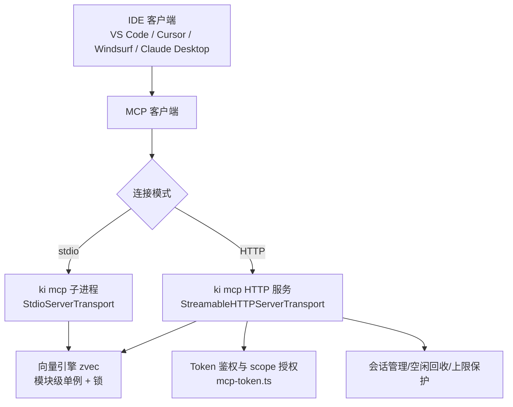
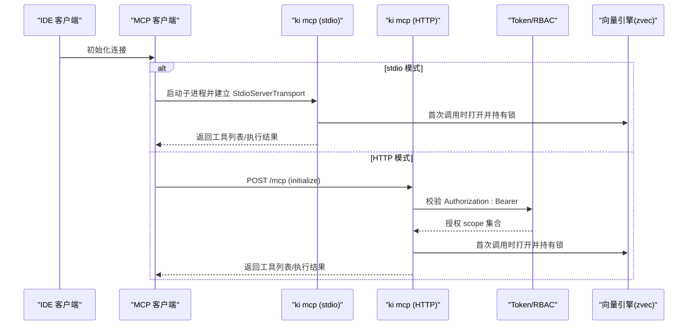
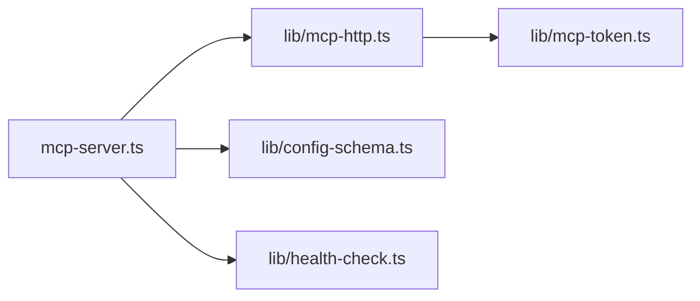

# IDE 配置指南

<cite>
**本文引用的文件**
- [README.md](file://README.md)
- [docs/mcp-http.md](file://docs/mcp-http.md)
- [docs/cli.md](file://docs/cli.md)
- [src/mcp-server.ts](file://src/mcp-server.ts)
- [src/lib/mcp-http.ts](file://src/lib/mcp-http.ts)
- [src/lib/mcp-token.ts](file://src/lib/mcp-token.ts)
- [src/lib/config-schema.ts](file://src/lib/config-schema.ts)
- [src/lib/health-check.ts](file://src/lib/health-check.ts)
</cite>

## 目录
1. [简介](#简介)
2. [项目结构](#项目结构)
3. [核心组件](#核心组件)
4. [架构总览](#架构总览)
5. [详细组件分析](#详细组件分析)
6. [依赖关系分析](#依赖关系分析)
7. [性能与连接池建议](#性能与连接池建议)
8. [故障排查与日志](#故障排查与日志)
9. [结论](#结论)
10. [附录：各 IDE 配置示例](#附录各-ide-配置示例)

## 简介
本指南面向在 VS Code、Cursor、Windsurf、Claude Desktop 等主流开发工具中接入 MCP 客户端，使用 kisearch 提供的知识索引能力。文档覆盖两种接入模式：
- stdio 模式：每个 IDE 启动独立的 ki mcp 子进程，适合单机单实例场景。
- HTTP 模式：通过一个常驻的 ki mcp HTTP 服务作为向量库唯一持锁者，多 IDE 共享同一进程，避免锁冲突，支持远程跨机访问与 Token 鉴权。

同时提供连接参数、认证 Token、超时与重试、多实例管理、连接状态验证、日志与常见问题排查、以及最佳实践与性能优化建议。

## 项目结构
kisearch 通过 CLI 命令暴露 MCP 能力，并内置 HTTP 共享单例服务。关键路径如下：
- 入口与模式选择：mcp-server.ts
- HTTP 传输与会话管理、鉴权、静态页面：lib/mcp-http.ts
- Token 管理与 scope 授权（RBAC）：lib/mcp-token.ts
- 配置字段校验：lib/config-schema.ts
- 健康检查与诊断：lib/health-check.ts
- 用户文档与快速开始：README.md、docs/mcp-http.md、docs/cli.md

图表来源
- [src/mcp-server.ts:54-71](file://src/mcp-server.ts#L54-L71)
- [src/lib/mcp-http.ts:363-641](file://src/lib/mcp-http.ts#L363-L641)
- [src/lib/mcp-token.ts:245-259](file://src/lib/mcp-token.ts#L245-L259)

章节来源
- [README.md:105-193](file://README.md#L105-L193)
- [docs/mcp-http.md:1-10](file://docs/mcp-http.md#L1-L10)

## 核心组件
- MCP Server 构建与工具注册：统一工厂创建 McpServer 并注册 11 个工具，供 stdio 与 HTTP 复用。
- HTTP 共享单例：幂等启动、探活复用、写 lock 文件、会话上限与空闲回收、条件鉴权（回环免鉴权，非回环强制 Token）。
- Token 与 RBAC：多 Token 存储、scope 授权集合、常量时间比较、越权拦截。
- 配置校验：字段名、类型、取值、废弃字段告警、一次性报告。
- 健康检查：配置文件、目录、embedding 连通性/密钥/维度、zvec collection 存在性。

章节来源
- [src/mcp-server.ts:54-71](file://src/mcp-server.ts#L54-L71)
- [src/lib/mcp-http.ts:363-641](file://src/lib/mcp-http.ts#L363-L641)
- [src/lib/mcp-token.ts:245-259](file://src/lib/mcp-token.ts#L245-L259)
- [src/lib/config-schema.ts:125-166](file://src/lib/config-schema.ts#L125-L166)
- [src/lib/health-check.ts:150-240](file://src/lib/health-check.ts#L150-L240)

## 架构总览
下图展示 IDE 到 MCP 的端到端流程，包括 stdio 与 HTTP 两条路径，以及 Token 鉴权与会话管理。

图表来源
- [src/mcp-server.ts:687-734](file://src/mcp-server.ts#L687-L734)
- [src/lib/mcp-http.ts:476-511](file://src/lib/mcp-http.ts#L476-L511)
- [src/lib/mcp-token.ts:245-259](file://src/lib/mcp-token.ts#L245-L259)

## 详细组件分析

### 连接模式与参数
- stdio 模式
  - 适用：单机、简单配置；每个 IDE 独立子进程。
  - 关键参数：command、args、env（如 embedding API Key）。
  - 注意：多个 stdio 实例可并存，但会共享向量库锁，错开使用互不影响，同时使用会短暂等待。
- HTTP 模式
  - 适用：多 IDE 共享、远程跨机访问、集中鉴权。
  - 关键参数：url、headers（Authorization: Bearer <token>）、可选 allowedHosts。
  - 默认端口：7423；默认主机：127.0.0.1（回环免鉴权）。
  - 后台常驻：--daemon/-d；重启：ki mcp restart；状态查看：ki mcp --status。

章节来源
- [README.md:240-274](file://README.md#L240-L274)
- [docs/cli.md:916-948](file://docs/cli.md#L916-L948)
- [docs/mcp-http.md:41-68](file://docs/mcp-http.md#L41-L68)

### 认证 Token 与 scope 授权
- Token 来源优先级：CLI --token/KI_MCP_TOKEN（全权临时） > 多 Token 存储（~/.ki/mcp-tokens.json）。
- 条件鉴权：回环绑定免鉴权；非回环绑定强制 Bearer Token。
- scope 授权：每个 Token 绑定一个或多个 scope（all 表示全部），tools/call 请求中的 arguments.scope 必须被授权，否则返回 403。
- 枚举工具按授权过滤：ki_scope_list、ki_manage_index_list 无参调用不受此校验限制，但输出会被按授权 scope 过滤。

章节来源
- [docs/mcp-http.md:132-146](file://docs/mcp-http.md#L132-L146)
- [src/lib/mcp-token.ts:245-259](file://src/lib/mcp-token.ts#L245-L259)
- [src/lib/mcp-http.ts:476-511](file://src/lib/mcp-http.ts#L476-L511)

### 会话模型与连接池
- 会话模型：每个 initialize 新建 transport + McpServer，共享模块级单例 engine（单进程单锁）。
- 会话上限：默认最多 256 并发会话，超出返回 503。
- 空闲回收：默认 30 分钟无活动会话自动关闭，防止残留占用。
- 连接池：HTTP 模式下由服务端维护会话表；stdio 模式由进程生命周期管理。

章节来源
- [docs/mcp-http.md:234-242](file://docs/mcp-http.md#L234-L242)
- [src/lib/mcp-http.ts:363-641](file://src/lib/mcp-http.ts#L363-L641)

### 错误处理与重试机制
- 启动守卫：stdio 与 HTTP 启动前进行预检，失败则 fail-loud。
- 鉴权失败：服务端记录失败次数并在 /healthz 暴露，便于排查。
- 嵌入向量请求：支持指数退避与 Retry-After 优先，4xx（非 429）不重试直接抛错。
- 优雅退出：SIGINT/SIGTERM 触发关闭所有会话、释放向量锁、删除 lock 文件，带 5 秒兜底超时。

章节来源
- [docs/mcp-http.md:147-169](file://docs/mcp-http.md#L147-L169)
- [src/lib/mcp-http.ts:377-391](file://src/lib/mcp-http.ts#L377-L391)
- [src/zvec-engine/embedding/siliconflow.ts:104-128](file://src/zvec-engine/embedding/siliconflow.ts#L104-L128)
- [src/lib/mcp-http.ts:769-798](file://src/lib/mcp-http.ts#L769-L798)

### 多实例连接管理
- stdio 多实例：不再拒绝多实例并存，靠向量库空闲释放锁 + 撞锁重试错开共享。
- HTTP 单例：幂等启动，已有健康实例则复用退出；写 lock 文件供排查。
- 一键关闭：ki mcp stop 关闭本机所有实例并清理残留 lock。

章节来源
- [docs/mcp-http.md:158-189](file://docs/mcp-http.md#L158-L189)
- [docs/mcp-http.md:147-157](file://docs/mcp-http.md#L147-L157)

### 连接状态验证与日志
- 健康检查：ki doctor 或 ki mcp --status 可查看配置、目录、embedding、collection、scopes 等状态。
- HTTP 探活：curl http://<host>:<port>/healthz 返回 ok/name/pid/version/host/port/authFailures。
- 日志位置：服务端 stderr 输出鉴权失败、越权拦截、启动提示等；IDE 侧日志需结合各自工具链查看。

章节来源
- [src/lib/health-check.ts:150-240](file://src/lib/health-check.ts#L150-L240)
- [docs/mcp-http.md:105-131](file://docs/mcp-http.md#L105-L131)

## 依赖关系分析
- mcp-server.ts 负责模式选择与工具注册，依赖 lib/mcp-http.ts 提供 HTTP 服务。
- lib/mcp-http.ts 实现会话管理、鉴权、静态页面与扩展路由，依赖 lib/mcp-token.ts 做 RBAC。
- lib/config-schema.ts 为配置加载后的字段级校验，确保配置合法。
- lib/health-check.ts 提供统一的健康诊断逻辑，供 CLI 与 MCP 启动预检共用。

图表来源
- [src/mcp-server.ts:24-48](file://src/mcp-server.ts#L24-L48)
- [src/lib/mcp-http.ts:17-35](file://src/lib/mcp-http.ts#L17-L35)
- [src/lib/config-schema.ts:125-166](file://src/lib/config-schema.ts#L125-L166)
- [src/lib/health-check.ts:17-21](file://src/lib/health-check.ts#L17-L21)

章节来源
- [src/mcp-server.ts:24-48](file://src/mcp-server.ts#L24-L48)
- [src/lib/mcp-http.ts:17-35](file://src/lib/mcp-http.ts#L17-L35)

## 性能与连接池建议
- 推荐 HTTP 单例：多 IDE 共享持锁进程，避免锁冲突与降级。
- 会话上限与空闲回收：默认 256 会话、30 分钟空闲回收，可根据 IDE 数量调整。
- 嵌入向量请求：启用指数退避与 Retry-After，避免瞬时拥塞导致失败。
- 资源隔离：不同 Token 绑定不同 scope，实现租户/项目数据隔离。
- 前端页面：--web 提供可视化界面，便于导入与检索验证。

章节来源
- [docs/mcp-http.md:234-242](file://docs/mcp-http.md#L234-L242)
- [src/zvec-engine/embedding/siliconflow.ts:104-128](file://src/zvec-engine/embedding/siliconflow.ts#L104-L128)
- [docs/mcp-http.md:72-103](file://docs/mcp-http.md#L72-L103)

## 故障排查与日志
- 常见错误：
  - 鉴权失败（401）：核对 Authorization: Bearer 与 token list 输出一致。
  - 越权拒绝（403）：确认 Token 授权 scope 包含请求 scope。
  - 端口占用（EADDRINUSE）：更换端口或排查占用进程。
  - 配置字段非法：按错误清单修正，避免静默落默认值。
- 排查步骤：
  1. 使用 ki mcp --status 查看实例全貌与健康状态。
  2. 检查服务端 stderr 日志（鉴权失败、越权拦截、启动提示）。
  3. 使用 curl /healthz 验证服务是否就绪。
  4. 使用 ki doctor 检查配置、目录、embedding 连通性与维度匹配。
- 恢复建议：
  - 迁移到 HTTP 单例：先改 IDE 配置为 URL 型，再 ki mcp stop，最后 ki mcp --http。
  - 清理残留 lock：ki mcp stop 或手动删除 ~/.ki/mcp-*.lock。

章节来源
- [docs/mcp-http.md:224-233](file://docs/mcp-http.md#L224-L233)
- [src/lib/health-check.ts:150-240](file://src/lib/health-check.ts#L150-L240)
- [docs/error-handling.md:39-52](file://docs/error-handling.md#L39-L52)

## 结论
通过 stdio 与 HTTP 两种模式，kisearch 为 IDE 提供了灵活可靠的 MCP 接入方式。推荐在生产或多 IDE 场景下使用 HTTP 单例，配合 Token 鉴权与 scope 授权，实现安全、稳定、可扩展的知识索引服务。结合健康检查与日志排查，可有效保障连接质量与服务可用性。

## 附录：各 IDE 配置示例

### VS Code
- stdio 模式
  - 配置项：command、args、env（SILICONFLOW_API_KEY）。
  - 适用：单机、简单场景。
- HTTP 模式
  - 配置项：url、headers（Authorization: Bearer <token>）。
  - 适用：多 IDE 共享、远程访问。

章节来源
- [README.md:240-274](file://README.md#L240-L274)

### Cursor
- stdio 模式
  - 配置项：command、args、env。
- HTTP 模式
  - 配置项：url、headers。

章节来源
- [README.md:240-274](file://README.md#L240-L274)

### Windsurf
- stdio 模式
  - 配置项：command、args、env。
- HTTP 模式
  - 配置项：url、headers。

章节来源
- [README.md:240-274](file://README.md#L240-L274)

### Claude Desktop
- stdio 模式
  - 配置项：command、args、env。
- HTTP 模式
  - 配置项：url、headers。

章节来源
- [README.md:240-274](file://README.md#L240-L274)