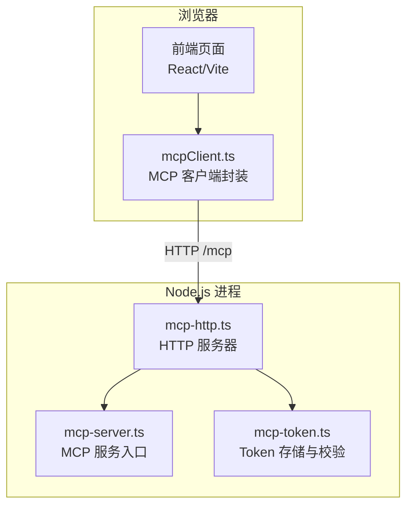
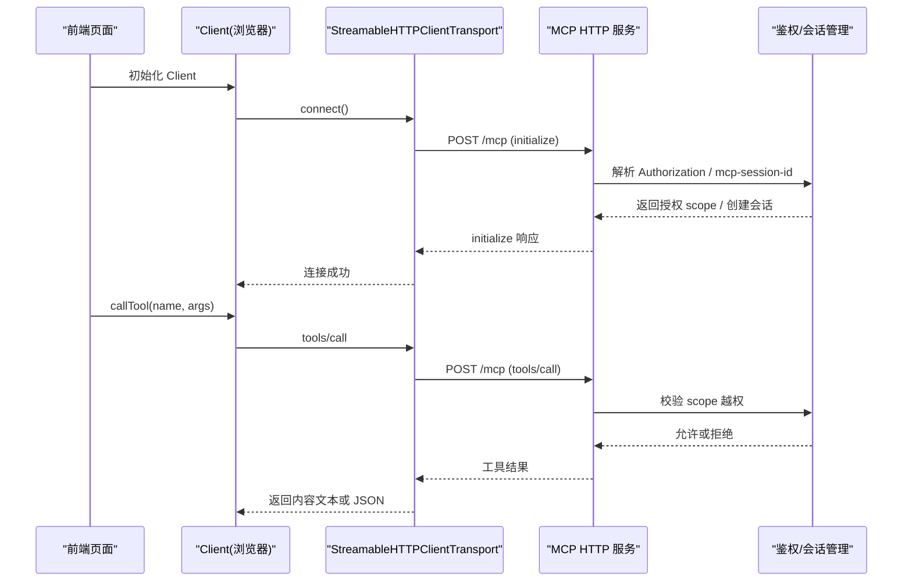
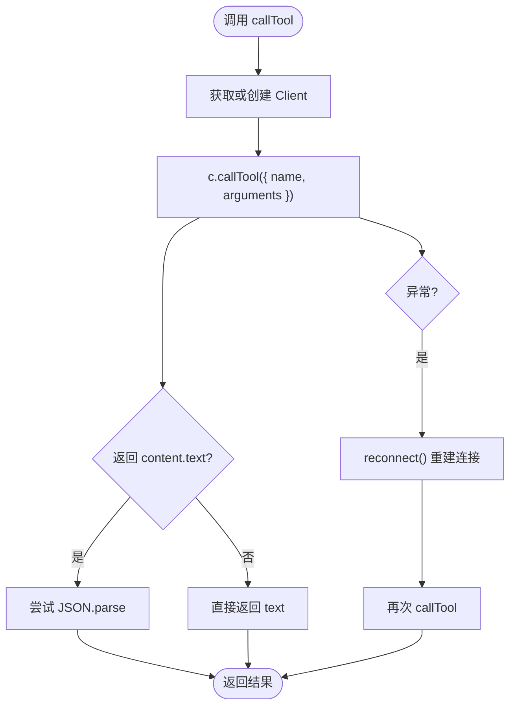
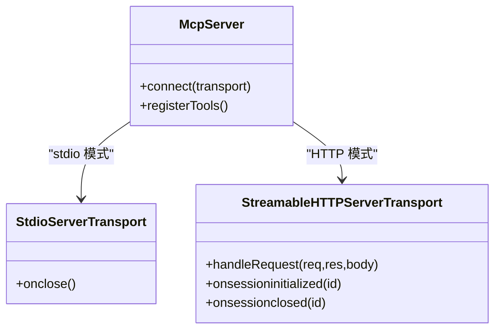
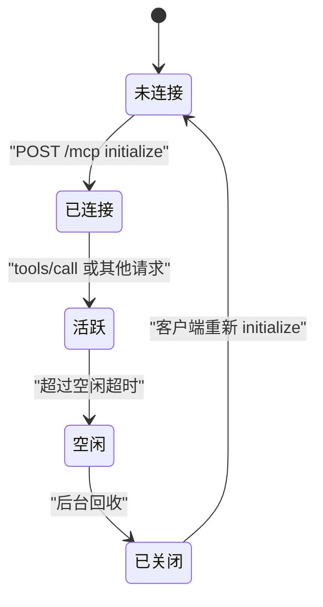
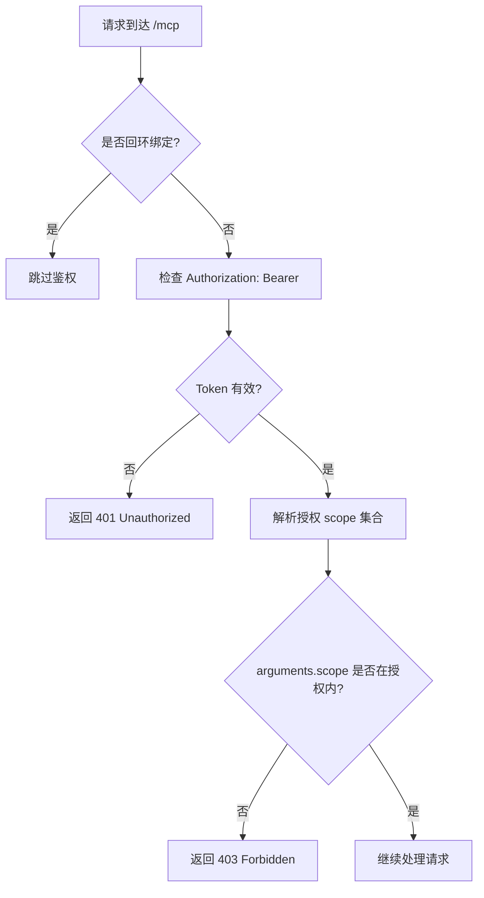
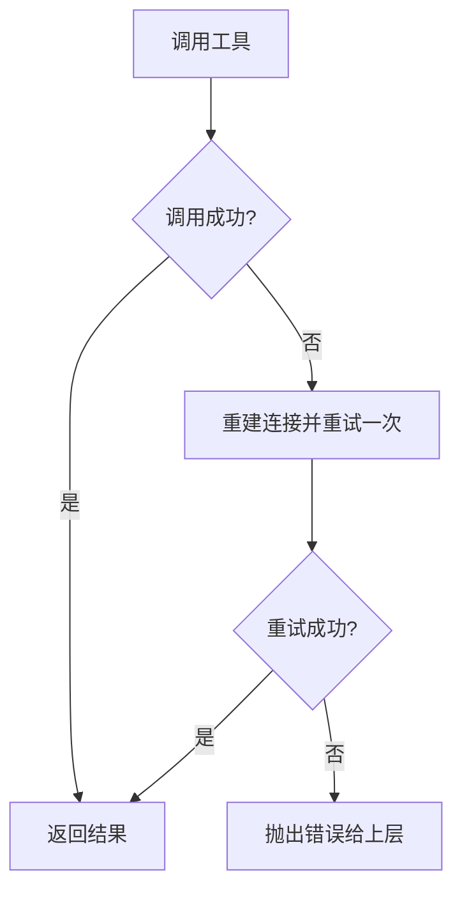
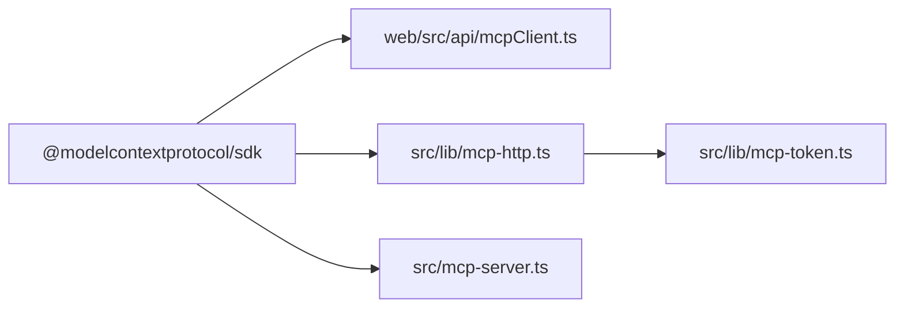

# JavaScript/TypeScript SDK 使用指南

<cite>
**本文引用的文件**
- [web/src/api/mcpClient.ts](file://web/src/api/mcpClient.ts)
- [src/lib/mcp-http.ts](file://src/lib/mcp-http.ts)
- [src/mcp-server.ts](file://src/mcp-server.ts)
- [package.json](file://package.json)
- [docs/mcp-http.md](file://docs/mcp-http.md)
- [web/src/api/httpApi.ts](file://web/src/api/httpApi.ts)
- [src/lib/mcp-token.ts](file://src/lib/mcp-token.ts)
</cite>

## 目录
1. [简介](#简介)
2. [项目结构](#项目结构)
3. [核心组件](#核心组件)
4. [架构总览](#架构总览)
5. [详细组件分析](#详细组件分析)
6. [依赖关系分析](#依赖关系分析)
7. [性能与可用性](#性能与可用性)
8. [故障排查](#故障排查)
9. [结论](#结论)
10. [附录：类型定义与调用模式](#附录类型定义与调用模式)

## 简介
本指南面向在浏览器和 Node.js 环境中集成 @modelcontextprotocol/sdk 的开发者，基于仓库中已实现的 MCP HTTP 服务端与前端客户端封装，说明如何完成客户端初始化、连接建立（stdio 与 HTTP）、工具调用、会话管理、Token 认证与错误重试等完整流程。重点包括：
- StreamableHTTPClientTransport 的使用方式
- 浏览器环境与 Node.js 环境的差异
- 会话管理与空闲回收
- Token 认证与 scope 授权
- 错误处理与自动重连策略
- 前端 Web 应用集成的最佳实践

## 项目结构
本项目同时包含 MCP 服务端与前端客户端封装：
- 服务端：提供 MCP HTTP 服务（StreamableHTTPServerTransport），实现鉴权、会话管理、静态页面托管与扩展 API。
- 前端客户端：封装 MCP SDK 的 Client 与 StreamableHTTPClientTransport，暴露业务工具调用方法，并内置会话失效后的自动重连逻辑。

图表来源
- [web/src/api/mcpClient.ts:8-64](file://web/src/api/mcpClient.ts#L8-L64)
- [src/lib/mcp-http.ts:363-642](file://src/lib/mcp-http.ts#L363-L642)
- [src/mcp-server.ts:54-71](file://src/mcp-server.ts#L54-L71)
- [src/lib/mcp-token.ts:245-259](file://src/lib/mcp-token.ts#L245-L259)

章节来源
- [web/src/api/mcpClient.ts:1-179](file://web/src/api/mcpClient.ts#L1-L179)
- [src/lib/mcp-http.ts:1-845](file://src/lib/mcp-http.ts#L1-L845)
- [src/mcp-server.ts:1-741](file://src/mcp-server.ts#L1-L741)
- [docs/mcp-http.md:1-273](file://docs/mcp-http.md#L1-L273)

## 核心组件
- MCP 客户端封装（浏览器）：通过 StreamableHTTPClientTransport 连接到 ki mcp --http 的 /mcp 端点，封装 callTool 并提供业务工具方法（搜索、模块信息、存储、同步等）。
- MCP HTTP 服务端：基于 StreamableHTTPServerTransport 提供 MCP 协议服务，实现鉴权、会话管理、静态页面托管与扩展 API。
- Token 管理：支持多 Token + scope 授权，非回环绑定强制 Bearer Token，枚举工具按授权过滤输出。

章节来源
- [web/src/api/mcpClient.ts:48-109](file://web/src/api/mcpClient.ts#L48-L109)
- [src/lib/mcp-http.ts:363-642](file://src/lib/mcp-http.ts#L363-L642)
- [src/lib/mcp-token.ts:1-265](file://src/lib/mcp-token.ts#L1-L265)

## 架构总览
下图展示了浏览器前端通过 MCP SDK 与服务端通信的整体流程，包括初始化、工具调用、鉴权与会话生命周期。

图表来源
- [web/src/api/mcpClient.ts:53-109](file://web/src/api/mcpClient.ts#L53-L109)
- [src/lib/mcp-http.ts:476-612](file://src/lib/mcp-http.ts#L476-L612)
- [src/lib/mcp-token.ts:245-259](file://src/lib/mcp-token.ts#L245-L259)

## 详细组件分析

### 浏览器环境：MCP 客户端封装与工具调用
- 单例 Client：避免重复连接，首次连接时创建 StreamableHTTPClientTransport 并 connect。
- 自动重连：callTool 捕获异常后重建连接并重试一次，适用于服务重启或会话被回收的场景。
- 工具封装：提供 kiScopeList、kiSearch、kiGetModuleInfo、kiStore、kiSyncRelation 等方法，统一参数映射与结果解析。

图表来源
- [web/src/api/mcpClient.ts:53-109](file://web/src/api/mcpClient.ts#L53-L109)

章节来源
- [web/src/api/mcpClient.ts:48-179](file://web/src/api/mcpClient.ts#L48-L179)

### Node.js 环境：stdio 与 HTTP 传输
- stdio 传输：适用于 IDE 本地子进程场景，通过 StdioServerTransport 与 MCP Server 通信。
- HTTP 传输：适用于远程或多 IDE 共享场景，通过 StreamableHTTPServerTransport 提供 /mcp 端点，支持鉴权与会话管理。

图表来源
- [src/mcp-server.ts:54-71](file://src/mcp-server.ts#L54-L71)
- [src/lib/mcp-http.ts:566-612](file://src/lib/mcp-http.ts#L566-L612)

章节来源
- [src/mcp-server.ts:687-734](file://src/mcp-server.ts#L687-L734)
- [src/lib/mcp-http.ts:363-642](file://src/lib/mcp-http.ts#L363-L642)

### 会话管理
- 每个 initialize 新建一个 transport + McpServer，并通过 mcp-session-id 标识会话。
- 会话上限保护：默认最多 256 个并发会话，超出返回 503。
- 空闲回收：默认 30 分钟无活动会话会被后台定时清扫关闭，客户端需重新 initialize。

图表来源
- [src/lib/mcp-http.ts:566-612](file://src/lib/mcp-http.ts#L566-L612)
- [docs/mcp-http.md:234-242](file://docs/mcp-http.md#L234-L242)

章节来源
- [src/lib/mcp-http.ts:566-612](file://src/lib/mcp-http.ts#L566-L612)
- [docs/mcp-http.md:234-242](file://docs/mcp-http.md#L234-L242)

### Token 认证与 scope 授权
- 条件鉴权：回环地址免鉴权；非回环地址强制 Bearer Token。
- Token 来源优先级：命令行 --token > 环境变量 KI_MCP_TOKEN > 多 Token 存储。
- scope 越权校验：拦截 tools/call 的 arguments.scope（缺省 default），不在授权范围内返回 403。
- 枚举工具例外：ki_scope_list、ki_manage_index_list 无参调用由工具层按授权集合过滤输出。

图表来源
- [src/lib/mcp-http.ts:476-561](file://src/lib/mcp-http.ts#L476-L561)
- [src/lib/mcp-token.ts:245-259](file://src/lib/mcp-token.ts#L245-L259)

章节来源
- [src/lib/mcp-http.ts:476-561](file://src/lib/mcp-http.ts#L476-L561)
- [src/lib/mcp-token.ts:1-265](file://src/lib/mcp-token.ts#L1-L265)
- [docs/mcp-http.md:132-146](file://docs/mcp-http.md#L132-L146)

### 错误处理与重试机制
- 客户端侧：callTool 捕获异常后重建连接并重试一次，适用于服务重启或会话被回收。
- 服务端侧：鉴权失败返回 401；scope 越权返回 403；会话超限返回 503；无效 session ID 返回 400。
- 优雅退出：SIGINT/SIGTERM 触发关闭所有会话、释放向量库锁、关闭 HTTP 服务。

图表来源
- [web/src/api/mcpClient.ts:83-109](file://web/src/api/mcpClient.ts#L83-L109)
- [src/lib/mcp-http.ts:566-612](file://src/lib/mcp-http.ts#L566-L612)

章节来源
- [web/src/api/mcpClient.ts:83-109](file://web/src/api/mcpClient.ts#L83-L109)
- [src/lib/mcp-http.ts:566-612](file://src/lib/mcp-http.ts#L566-L612)

### 前端 Web 应用集成最佳实践
- 同源访问：通过 ki mcp --http --web 提供静态页面与 /mcp 端点，无需 CORS。
- 开发模式：Vite 代理转发到 7423，生产模式直接同源访问。
- 会话失效处理：前端封装了 reconnect 逻辑，建议在上层 UI 提示用户刷新或重试。
- 安全建议：生产环境前置 TLS 反向代理，限制来源 IP，使用最小权限 scope。

章节来源
- [web/src/api/httpApi.ts:1-189](file://web/src/api/httpApi.ts#L1-L189)
- [docs/mcp-http.md:72-103](file://docs/mcp-http.md#L72-L103)
- [docs/mcp-http.md:243-248](file://docs/mcp-http.md#L243-L248)

## 依赖关系分析
- 包依赖：@modelcontextprotocol/sdk ^1.29.0，用于 MCP 协议客户端与服务端实现。
- 模块耦合：
  - 前端 mcpClient.ts 依赖 SDK 的 Client 与 StreamableHTTPClientTransport。
  - 服务端 mcp-http.ts 依赖 SDK 的 StreamableHTTPServerTransport 与 McpServer。
  - Token 管理独立于传输层，供鉴权与授权使用。

图表来源
- [package.json:42-48](file://package.json#L42-L48)
- [web/src/api/mcpClient.ts:8-9](file://web/src/api/mcpClient.ts#L8-L9)
- [src/lib/mcp-http.ts:22-28](file://src/lib/mcp-http.ts#L22-L28)
- [src/mcp-server.ts:5-23](file://src/mcp-server.ts#L5-L23)

章节来源
- [package.json:1-68](file://package.json#L1-L68)

## 性能与可用性
- 会话上限：默认 256 并发会话，防止内存耗尽。
- 空闲回收：默认 30 分钟无活动会话回收，减少资源占用。
- 优雅退出：5 秒兜底超时，确保进程正常释放锁与连接。
- 静态页面：SPA fallback 支持深链直达，路径穿越防护。

章节来源
- [src/lib/mcp-http.ts:47-57](file://src/lib/mcp-http.ts#L47-L57)
- [src/lib/mcp-http.ts:400-411](file://src/lib/mcp-http.ts#L400-L411)
- [src/lib/mcp-http.ts:769-798](file://src/lib/mcp-http.ts#L769-L798)
- [src/lib/mcp-http.ts:276-317](file://src/lib/mcp-http.ts#L276-L317)

## 故障排查
- 401 Unauthorized：检查 Authorization: Bearer 头是否正确，确认 Token 有效且来源一致。
- 403 Forbidden：检查请求的 scope 是否在 Token 授权范围内，必要时更新 Token 授权。
- 503 Too many sessions：减少并发会话或调整 maxSessions。
- 400 Bad Request：检查 mcp-session-id 是否有效，或是否为 initialize 请求。
- 启动预检失败：运行 ki doctor 检查配置与环境。

章节来源
- [src/lib/mcp-http.ts:476-561](file://src/lib/mcp-http.ts#L476-L561)
- [src/lib/mcp-http.ts:566-612](file://src/lib/mcp-http.ts#L566-L612)
- [docs/mcp-http.md:224-233](file://docs/mcp-http.md#L224-L233)

## 结论
通过本指南，你可以在浏览器和 Node.js 环境中快速集成 @modelcontextprotocol/sdk，使用 StreamableHTTPClientTransport 连接 ki mcp --http 服务，完成工具调用、会话管理、Token 认证与错误处理。推荐在生产环境使用 HTTP 单例模式，结合最小权限 scope 与 TLS 反向代理，确保安全与稳定性。

## 附录：类型定义与调用模式
- 客户端类型：ScopeInfo、SearchHit、SearchResult、ModuleInfoResult、StoreResult。
- 工具调用模式：callTool<T>(name, args) 返回解析后的 JSON 或原始文本。
- 业务工具：kiScopeList、kiSearch、kiGetModuleInfo、kiStore、kiSyncRelation。

章节来源
- [web/src/api/mcpClient.ts:11-46](file://web/src/api/mcpClient.ts#L11-L46)
- [web/src/api/mcpClient.ts:111-179](file://web/src/api/mcpClient.ts#L111-L179)