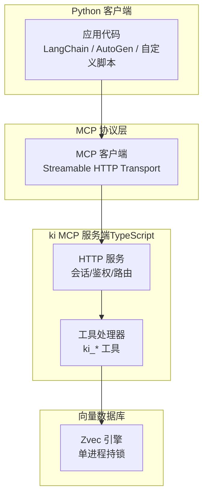
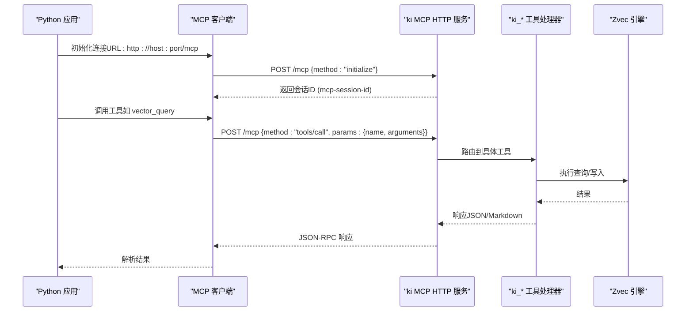
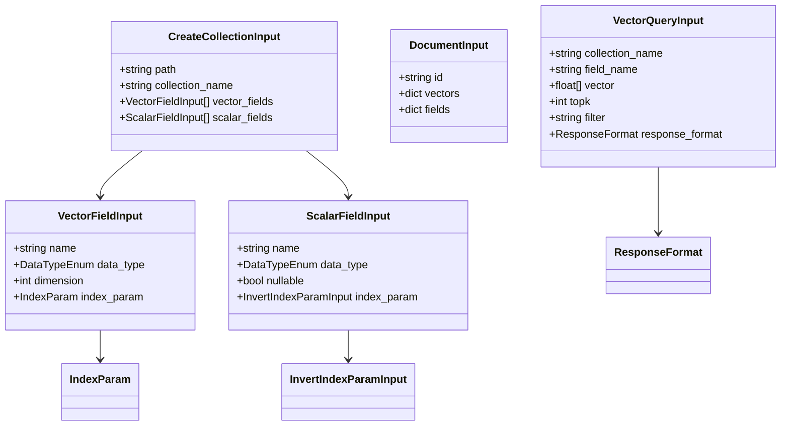
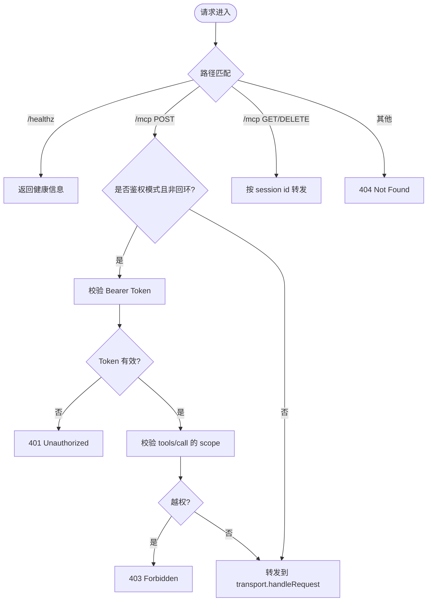
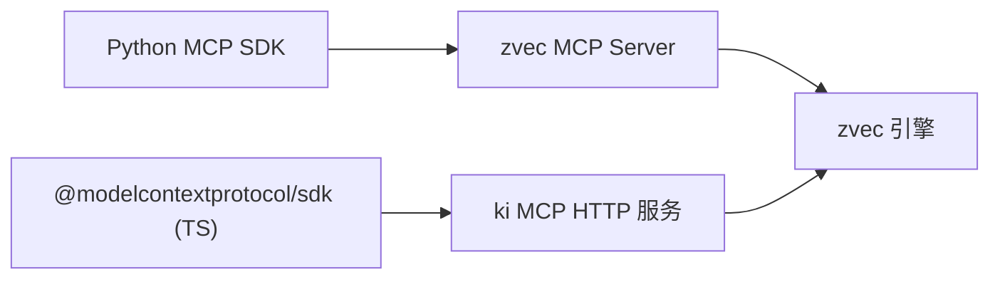

# Python SDK

<cite>
**本文引用的文件**
- [zvec-mcp-server/README.md](file://zvec-mcp-server/README.md)
- [pyproject.toml](file://zvec-mcp-server/pyproject.toml)
- [server.py](file://zvec-mcp-server/src/zvec_mcp/server.py)
- [schemas.py](file://zvec-mcp-server/src/zvec_mcp/schemas.py)
- [types.py](file://zvec-mcp-server/src/zvec_mcp/types.py)
- [utils.py](file://zvec-mcp-server/src/zvec_mcp/utils.py)
- [mcp-http.ts](file://src/lib/mcp-http.ts)
- [mcp-token.ts](file://src/lib/mcp-token.ts)
- [cli.md](file://docs/cli.md)
- [mcp-http.md](file://docs/mcp-http.md)
- [test_server.py](file://zvec-mcp-server/tests/test_server.py)
</cite>

## 目录
1. [简介](#简介)
2. [项目结构](#项目结构)
3. [核心组件](#核心组件)
4. [架构总览](#架构总览)
5. [详细组件分析](#详细组件分析)
6. [依赖关系分析](#依赖关系分析)
7. [性能与最佳实践](#性能与最佳实践)
8. [故障排查指南](#故障排查指南)
9. [结论](#结论)
10. [附录](#附录)

## 简介
本指南面向在 Python 生态中使用 MCP（Model Context Protocol）客户端与 ki MCP 服务器通信的开发者。内容涵盖：
- 安装与配置、连接建立（HTTP 共享单例模式）
- 同步与异步调用、批量操作、流式处理
- 认证机制、Token 管理与错误处理策略
- 与 LangChain、AutoGen 等 AI Agent 框架的集成思路
- 性能优化建议与最佳实践

说明：仓库中提供了 Python 侧的 zvec MCP Server（Python 实现），以及 ki MCP 的 HTTP 服务端（TypeScript）。Python 客户端可通过标准 MCP 协议（Streamable HTTP）与 ki MCP 服务通信；同时也可通过 Python 包直接调用 zvec MCP Server 暴露的工具。

## 项目结构
- Python 端 zvec MCP Server
  - 入口与包定义：__init__.py、pyproject.toml
  - 工具与服务实现：server.py
  - 输入模型与类型：schemas.py、types.py
  - 工具函数与缓存：utils.py
- ki MCP HTTP 服务端（TypeScript）
  - HTTP 传输与会话管理、鉴权、单例：mcp-http.ts
  - 多 Token 存储与 scope 授权：mcp-token.ts
  - CLI 文档与使用方式：docs/cli.md、docs/mcp-http.md

图表来源
- [mcp-http.ts:413-641](file://src/lib/mcp-http.ts#L413-L641)
- [mcp-token.ts:20-50](file://src/lib/mcp-token.ts#L20-L50)

章节来源
- [mcp-http.ts:1-120](file://src/lib/mcp-http.ts#L1-L120)
- [mcp-token.ts:1-50](file://src/lib/mcp-token.ts#L1-L50)

## 核心组件
- Python zvec MCP Server
  - 提供 17 个工具，覆盖集合管理、文档 CRUD、向量检索、索引管理、AI 嵌入生成等能力
  - 使用 FastMCP 注册资源与工具，Pydantic v2 校验输入，统一错误格式化
- ki MCP HTTP 服务端
  - Streamable HTTP 传输，维护会话生命周期（initialize/SSE/DELETE）
  - 条件鉴权：回环免鉴权，非回环强制 Bearer Token；支持多 Token + scope 授权
  - 幂等单例：探活健康实例后复用退出，避免多进程持锁冲突

章节来源
- [server.py:1-50](file://zvec-mcp-server/src/zvec_mcp/server.py#L1-L50)
- [schemas.py:1-50](file://zvec-mcp-server/src/zvec_mcp/schemas.py#L1-L50)
- [mcp-http.ts:413-641](file://src/lib/mcp-http.ts#L413-L641)
- [mcp-token.ts:20-50](file://src/lib/mcp-token.ts#L20-L50)

## 架构总览
下图展示 Python 客户端如何通过 MCP 协议与 ki MCP 服务交互，并访问底层 Zvec 向量库。

图表来源
- [mcp-http.ts:413-641](file://src/lib/mcp-http.ts#L413-L641)
- [server.py:707-760](file://zvec-mcp-server/src/zvec_mcp/server.py#L707-L760)

章节来源
- [mcp-http.ts:413-641](file://src/lib/mcp-http.ts#L413-L641)
- [server.py:707-760](file://zvec-mcp-server/src/zvec_mcp/server.py#L707-L760)

## 详细组件分析

### Python zvec MCP Server 工具集
- 集合管理：创建/打开/获取信息/销毁集合
- 文档操作：插入/更新/删除/获取文档
- 向量检索：单向量相似度搜索、多向量融合重排
- 索引管理：创建/删除索引、优化集合
- AI 嵌入：基于 OpenAI 的稠密向量嵌入生成与语义搜索

图表来源
- [schemas.py:135-187](file://zvec-mcp-server/src/zvec_mcp/schemas.py#L135-L187)
- [schemas.py:189-256](file://zvec-mcp-server/src/zvec_mcp/schemas.py#L189-L256)
- [schemas.py:258-273](file://zvec-mcp-server/src/zvec_mcp/schemas.py#L258-L273)
- [types.py:6-54](file://zvec-mcp-server/src/zvec_mcp/types.py#L6-L54)

章节来源
- [schemas.py:135-273](file://zvec-mcp-server/src/zvec_mcp/schemas.py#L135-L273)
- [types.py:6-54](file://zvec-mcp-server/src/zvec_mcp/types.py#L6-L54)

### ki MCP HTTP 服务端（鉴权与会话）
- 会话模型：每个 initialize 新建 transport + McpServer，mcp-session-id 标识会话
- 鉴权：回环免鉴权；非回环需 Authorization: Bearer；常量时间比较防时序攻击
- 会话治理：上限保护（默认 256）、空闲回收（默认 30 分钟）
- 健康检查：/healthz 返回运行状态与鉴权失败计数

图表来源
- [mcp-http.ts:413-641](file://src/lib/mcp-http.ts#L413-L641)
- [mcp-token.ts:240-259](file://src/lib/mcp-token.ts#L240-L259)

章节来源
- [mcp-http.ts:413-641](file://src/lib/mcp-http.ts#L413-L641)
- [mcp-token.ts:240-259](file://src/lib/mcp-token.ts#L240-L259)

### 错误处理与输出格式
- 统一错误格式化：根据异常消息分类提示（未找到/已存在/无效参数）
- 输出格式：JSON（程序化消费）或 Markdown（人类可读）
- 资源接口：列出当前会话中的集合、查看集合详情

章节来源
- [utils.py:131-147](file://zvec-mcp-server/src/zvec_mcp/utils.py#L131-L147)
- [server.py:53-81](file://zvec-mcp-server/src/zvec_mcp/server.py#L53-L81)
- [server.py:84-140](file://zvec-mcp-server/src/zvec_mcp/server.py#L84-L140)

## 依赖关系分析
- Python 包依赖
  - mcp>=1.1.2（MCP SDK）
  - zvec（向量数据库）
  - pydantic>=2.0.0（输入校验）
  - openai>=2.24.0（可选，用于稠密嵌入）
- TypeScript 服务端依赖
  - @modelcontextprotocol/sdk（StreamableHTTPServerTransport）
  - Node.js http 模块（内建 HTTP 服务）

图表来源
- [pyproject.toml:25-30](file://zvec-mcp-server/pyproject.toml#L25-L30)
- [mcp-http.ts:17-28](file://src/lib/mcp-http.ts#L17-L28)

章节来源
- [pyproject.toml:25-30](file://zvec-mcp-server/pyproject.toml#L25-L30)
- [mcp-http.ts:17-28](file://src/lib/mcp-http.ts#L17-L28)

## 性能与最佳实践
- 连接与会话
  - 使用 HTTP 共享单例模式，避免多进程持锁冲突
  - 合理设置会话上限与空闲回收，防止内存泄漏
- 批量操作
  - 使用批量插入/更新接口，减少网络往返
  - 控制单次批量大小，避免过大请求体导致超时
- 流式处理
  - 利用 SSE 下行通道接收增量结果（适用于长耗时任务）
- 认证与安全
  - 远程暴露时启用 Bearer Token，配合 TLS 反向代理
  - 使用最小权限 scope，定期轮换 Token
- 索引与查询
  - 为高频查询字段创建合适索引（HNSW/IVF/FLAT）
  - 调整 topk/topn 与重排策略以平衡精度与延迟

[本节为通用指导，不直接分析具体文件]

## 故障排查指南
- 鉴权失败
  - 检查 Authorization: Bearer 是否与托管 Token 一致
  - 查看服务端 stderr 日志与 /healthz 的 authFailures 计数
- 会话问题
  - 确认 initialize 成功并获得 mcp-session-id
  - 若收到 503，可能是会话数超限，等待空闲回收或关闭闲置连接
- 工具调用失败
  - 核对工具参数是否符合 schemas 定义
  - 查看错误消息分类（未找到/已存在/无效参数）

章节来源
- [mcp-http.ts:476-509](file://src/lib/mcp-http.ts#L476-L509)
- [mcp-http.ts:543-560](file://src/lib/mcp-http.ts#L543-L560)
- [utils.py:131-147](file://zvec-mcp-server/src/zvec_mcp/utils.py#L131-L147)

## 结论
通过 MCP 协议，Python 客户端可以安全、高效地与 ki MCP 服务通信，并利用其提供的丰富工具进行知识检索与管理。结合 HTTP 共享单例、强随机 Token 与 scope 授权，可在生产环境中获得稳定可靠的体验。遵循本文的性能优化与最佳实践，可进一步提升系统吞吐与稳定性。

[本节为总结性内容，不直接分析具体文件]

## 附录

### 安装与配置
- 安装 Python 包
  - 使用 uv 或 pip 安装 zvec-mcp-server
  - 配置环境变量（如 OPENAI_API_KEY）以启用嵌入功能
- 启动 ki MCP HTTP 服务
  - 本机：ki mcp --http（回环免鉴权）
  - 远程：ki mcp --http --host 0.0.0.0 --token <t>

章节来源
- [zvec-mcp-server/README.md:25-71](file://zvec-mcp-server/README.md#L25-L71)
- [docs/cli.md:916-929](file://docs/cli.md#L916-L929)

### 连接建立（HTTP 共享单例）
- 客户端连接 URL：http://host:port/mcp
- 首次 initialize 获取 mcp-session-id，后续请求携带该 ID
- 非回环地址需添加 Authorization: Bearer <token>

章节来源
- [docs/cli.md:1013-1026](file://docs/cli.md#L1013-L1026)
- [mcp-http.md:234-247](file://docs/mcp-http.md#L234-L247)

### 同步与异步调用模式
- 同步调用：适合简单脚本与批处理任务
- 异步调用：适合高并发场景与长耗时任务
- 参考测试用例中的异步调用示例

章节来源
- [test_server.py:127-178](file://zvec-mcp-server/tests/test_server.py#L127-L178)

### 批量操作与流式处理
- 批量操作：使用批量插入/更新接口，提升吞吐
- 流式处理：利用 SSE 下行通道接收增量结果

章节来源
- [server.py:470-517](file://zvec-mcp-server/src/zvec_mcp/server.py#L470-L517)
- [mcp-http.ts:563-626](file://src/lib/mcp-http.ts#L563-L626)

### 认证机制与 Token 管理
- 托管 Token：强随机、最小权限 scope、原子写回
- 鉴权流程：Bearer Token → 查找授权 scope → 校验工具 scope
- 命令：generate/list/update/delete

章节来源
- [mcp-token.ts:20-50](file://src/lib/mcp-token.ts#L20-L50)
- [mcp-token.ts:178-201](file://src/lib/mcp-token.ts#L178-L201)
- [docs/cli.md:962-969](file://docs/cli.md#L962-L969)

### 与 AI Agent 框架集成
- LangChain：通过 MCP 客户端封装工具，注入到 Agent 工具链
- AutoGen：将 MCP 工具作为外部能力接入 Agent 工作流
- 关键步骤：初始化连接、鉴权、调用工具、处理结果

章节来源
- [mcp-http.ts:413-641](file://src/lib/mcp-http.ts#L413-L641)
- [server.py:707-760](file://zvec-mcp-server/src/zvec_mcp/server.py#L707-L760)