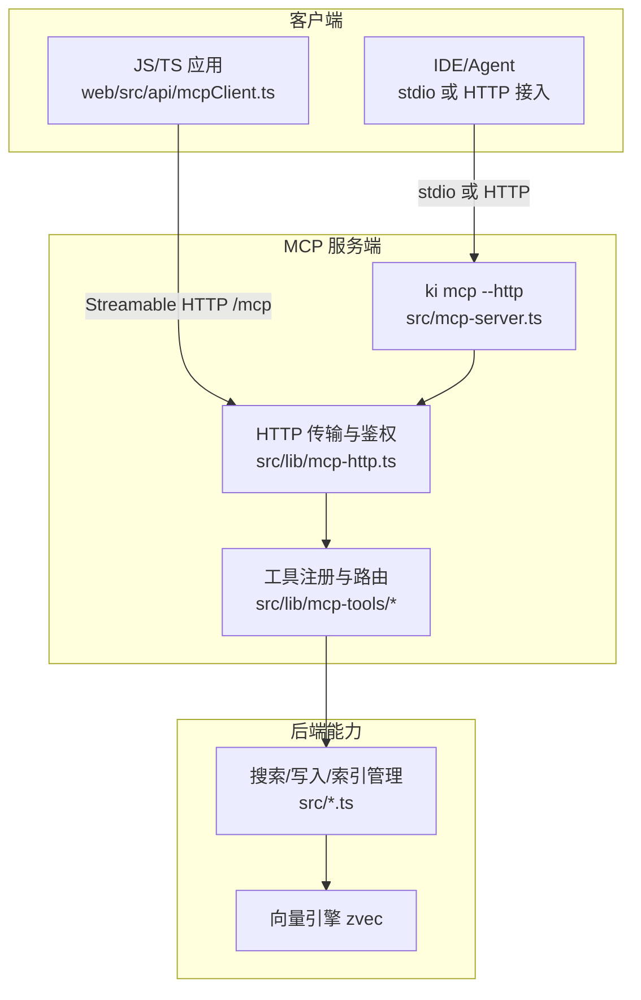
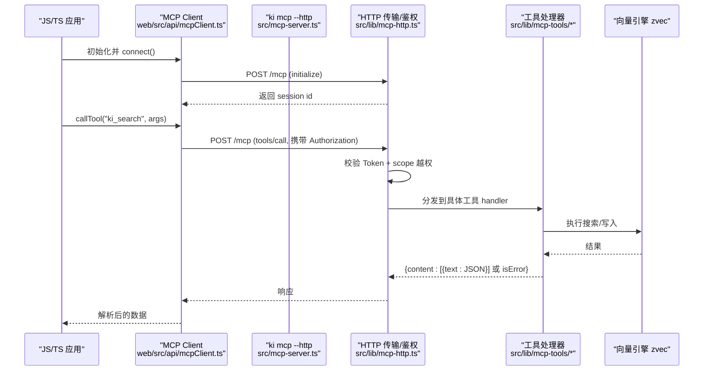
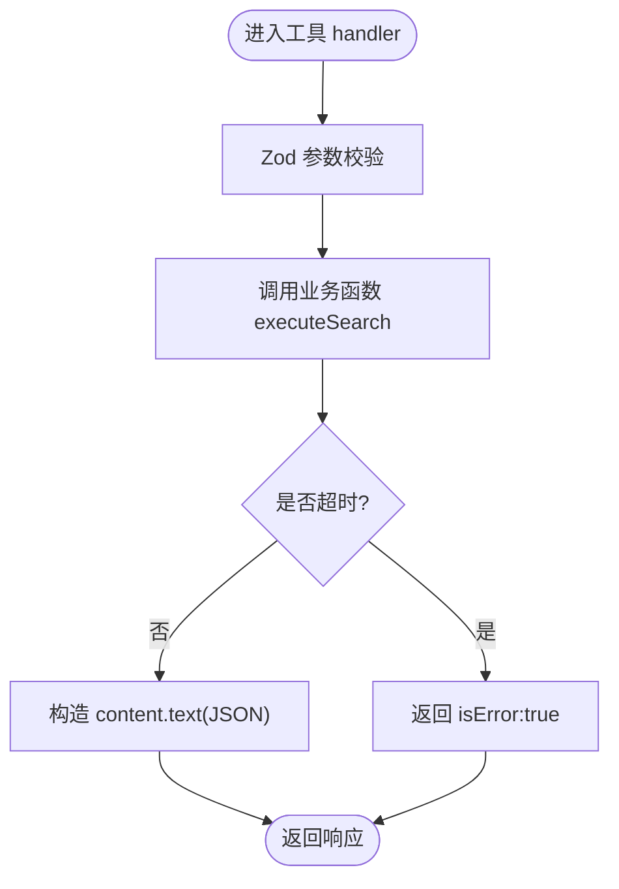
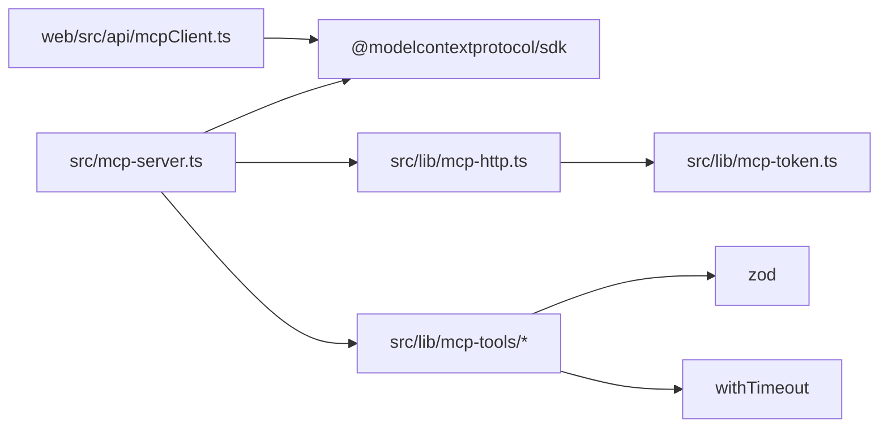

# SDK 使用指南

<cite>
**本文引用的文件**
- [README.md](file://README.md)
- [mcp-http.md](file://docs/mcp-http.md)
- [mcp-server.ts](file://src/mcp-server.ts)
- [mcp-http.ts](file://src/lib/mcp-http.ts)
- [mcp-token.ts](file://src/lib/mcp-token.ts)
- [mcpClient.ts](file://web/src/api/mcpClient.ts)
- [search.ts](file://src/lib/mcp-tools/search.ts)
- [sync-relation.ts](file://src/lib/mcp-tools/sync-relation.ts)
- [bulk-sync-relation.ts](file://src/lib/mcp-tools/bulk-sync-relation.ts)
</cite>

## 目录
1. [简介](#简介)
2. [项目结构](#项目结构)
3. [核心组件](#核心组件)
4. [架构总览](#架构总览)
5. [详细组件分析](#详细组件分析)
6. [依赖关系分析](#依赖关系分析)
7. [性能与并发](#性能与并发)
8. [故障排查](#故障排查)
9. [结论](#结论)
10. [附录：API 参考与示例](#附录api-参考与示例)

## 简介
本指南面向希望在 JavaScript/TypeScript、Python 等语言中集成 MCP 客户端的开发者，覆盖从客户端初始化、连接建立、工具调用到错误处理的完整流程。文档基于仓库内已实现的 MCP HTTP 共享单例模式与前端 MCP 客户端封装，提供同步/异步调用模式、批量操作、流式处理（SSE）以及连接池与会话管理、请求限流和并发控制的最佳实践。同时包含认证机制（Bearer Token + RBAC scope 授权）、Token 管理与安全配置说明，并给出完整的 API 参考与使用示例路径，帮助快速集成到现有项目中。

## 项目结构
本项目通过 ki mcp 暴露 11 个 MCP 工具，支持 stdio 与 HTTP 两种传输方式；HTTP 模式采用 Streamable HTTP 协议，具备鉴权、会话管理、空闲回收与静态页面服务。前端通过 @modelcontextprotocol/sdk 的 Client + StreamableHTTPClientTransport 直接调用 /mcp 端点。

图表来源
- [mcpClient.ts:8-10](file://web/src/api/mcpClient.ts#L8-L10)
- [mcp-server.ts:54-71](file://src/mcp-server.ts#L54-L71)
- [mcp-http.ts:363-641](file://src/lib/mcp-http.ts#L363-L641)

章节来源
- [README.md:220-294](file://README.md#L220-L294)
- [mcp-http.md:1-10](file://docs/mcp-http.md#L1-L10)

## 核心组件
- MCP 服务端构建与工具注册：统一入口负责创建 McpServer 并注册全部工具，供 stdio 与 HTTP 复用。
- HTTP 传输与鉴权：实现 Streamable HTTP 传输、会话生命周期、空闲回收、RBAC scope 越权校验、静态页面与扩展 API。
- Token 与 RBAC：多 Token 存储、scope 授权集合、常量时间比较、权限校验与枚举工具输出过滤。
- 前端 MCP 客户端封装：单例 Client、自动重连、callTool 包装与业务方法封装。
- 工具层：搜索、写入、批量写入、索引管理等工具，均带超时保护与结构化返回。

章节来源
- [mcp-server.ts:54-71](file://src/mcp-server.ts#L54-L71)
- [mcp-http.ts:363-641](file://src/lib/mcp-http.ts#L363-L641)
- [mcp-token.ts:20-50](file://src/lib/mcp-token.ts#L20-L50)
- [mcpClient.ts:53-109](file://web/src/api/mcpClient.ts#L53-L109)
- [search.ts:6-49](file://src/lib/mcp-tools/search.ts#L6-L49)
- [sync-relation.ts:6-43](file://src/lib/mcp-tools/sync-relation.ts#L6-L43)
- [bulk-sync-relation.ts:6-42](file://src/lib/mcp-tools/bulk-sync-relation.ts#L6-L42)

## 架构总览
下图展示了客户端与服务端的交互、鉴权与会话管理、工具调用链路。

图表来源
- [mcpClient.ts:53-109](file://web/src/api/mcpClient.ts#L53-L109)
- [mcp-http.ts:476-611](file://src/lib/mcp-http.ts#L476-L611)
- [mcp-server.ts:54-71](file://src/mcp-server.ts#L54-L71)
- [search.ts:6-49](file://src/lib/mcp-tools/search.ts#L6-L49)

## 详细组件分析

### 客户端初始化与连接（JS/TS）
- 使用 @modelcontextprotocol/sdk 的 Client 与 StreamableHTTPClientTransport 连接到 /mcp。
- 首次 connect 会发送 initialize，服务端分配 mcp-session-id，后续请求需携带该会话头。
- 封装了自动重连逻辑：当会话失效时重建 Client 并重试一次。

最佳实践
- 将 Client 作为模块级单例复用，避免重复握手。
- 在浏览器环境确保同源访问（--web 提供静态页面），无需 CORS。
- 非回环访问需在请求头携带 Authorization: Bearer <token>。

章节来源
- [mcpClient.ts:8-10](file://web/src/api/mcpClient.ts#L8-L10)
- [mcpClient.ts:53-109](file://web/src/api/mcpClient.ts#L53-L109)
- [mcp-http.md:24-39](file://docs/mcp-http.md#L24-L39)

### 连接建立与会话管理（HTTP 模式）
- 每个 initialize 新建一个 transport + McpServer，共享 vector-client 的模块级单例 engine。
- 会话上限默认 256，空闲 30 分钟无活动自动回收，防止内存泄漏。
- GET/DELETE 用于 SSE 下行与关闭会话；POST 用于 tools/call。

章节来源
- [mcp-http.ts:47-57](file://src/lib/mcp-http.ts#L47-L57)
- [mcp-http.ts:563-611](file://src/lib/mcp-http.ts#L563-L611)
- [mcp-http.md:234-242](file://docs/mcp-http.md#L234-L242)

### 工具调用流程（以搜索为例）
- 工具注册：server.tool(name, desc, schema, handler)。
- 参数校验：Zod schema 定义必填/可选字段及默认值。
- 超时保护：withTimeout 包裹业务函数，避免长时间阻塞。
- 返回格式：成功返回 content.text(JSON 字符串)，失败返回 isError:true。

图表来源
- [search.ts:6-49](file://src/lib/mcp-tools/search.ts#L6-L49)

章节来源
- [search.ts:6-49](file://src/lib/mcp-tools/search.ts#L6-L49)

### 批量写入与流式处理
- 批量写入：ki_bulk_sync_relation 一次 embedding + 一次向量写入，适合多条 Relation 同时写入，显著优于多次并发调用。
- 流式处理：HTTP 模式下支持 SSE 下行（GET /mcp）与 DELETE 关闭会话，客户端可订阅事件流。

章节来源
- [bulk-sync-relation.ts:6-42](file://src/lib/mcp-tools/bulk-sync-relation.ts#L6-L42)
- [mcp-http.md:234-242](file://docs/mcp-http.md#L234-L242)

### 认证机制与 Token 管理
- 条件鉴权：回环绑定免鉴权；非回环强制 Bearer Token。
- Token 来源优先级：命令行/环境变量全权临时 Token > 多 Token 存储（~/.ki/mcp-tokens.json）。
- RBAC scope 授权：每个 Token 绑定授权 scope 集合（单个/多个/all），拦截 tools/call 的 arguments.scope 进行越权校验。
- 枚举工具按授权过滤：ki_scope_list、ki_manage_index_list 在无参调用时由工具层按授权集合过滤输出，避免泄露未授权 scope。

章节来源
- [mcp-http.ts:476-509](file://src/lib/mcp-http.ts#L476-L509)
- [mcp-http.ts:543-561](file://src/lib/mcp-http.ts#L543-L561)
- [mcp-token.ts:20-50](file://src/lib/mcp-token.ts#L20-L50)
- [mcp-http.md:132-145](file://docs/mcp-http.md#L132-L145)

### 错误处理与恢复
- 工具层异常：handler 内 try-catch 捕获，返回 isError:true 与错误信息，不导致进程崩溃。
- 协议层错误：SDK 自动返回 error response。
- 外部依赖超时：向量兜底依赖的外部 API 超时会静默降级，对 Agent 透明。
- 启动预检：ki mcp 启动前健康检查，存在致命错误拒绝启动。

章节来源
- [search.ts:18-49](file://src/lib/mcp-tools/search.ts#L18-L49)
- [sync-relation.ts:18-43](file://src/lib/mcp-tools/sync-relation.ts#L18-L43)
- [bulk-sync-relation.ts:20-42](file://src/lib/mcp-tools/bulk-sync-relation.ts#L20-L42)
- [README.md:238-239](file://README.md#L238-L239)

## 依赖关系分析
- 前端客户端依赖 @modelcontextprotocol/sdk 的 Client 与 StreamableHTTPClientTransport。
- 服务端依赖 @modelcontextprotocol/sdk 的 McpServer 与 StreamableHTTPServerTransport。
- 工具层依赖 zod 做参数校验，依赖 withTimeout 做超时保护。
- 鉴权依赖 mcp-token.ts 的多 Token 存储与 scope 授权集合。

图表来源
- [mcpClient.ts:8-10](file://web/src/api/mcpClient.ts#L8-L10)
- [mcp-server.ts:54-71](file://src/mcp-server.ts#L54-L71)
- [mcp-http.ts:363-641](file://src/lib/mcp-http.ts#L363-L641)
- [mcp-token.ts:20-50](file://src/lib/mcp-token.ts#L20-L50)
- [search.ts:1-4](file://src/lib/mcp-tools/search.ts#L1-L4)

章节来源
- [mcpClient.ts:8-10](file://web/src/api/mcpClient.ts#L8-L10)
- [mcp-server.ts:54-71](file://src/mcp-server.ts#L54-L71)
- [mcp-http.ts:363-641](file://src/lib/mcp-http.ts#L363-L641)
- [mcp-token.ts:20-50](file://src/lib/mcp-token.ts#L20-L50)

## 性能与并发
- 会话上限与空闲回收：默认最大并发会话 256，空闲 30 分钟回收，避免内存增长。
- 批量写入优先：ki_bulk_sync_relation 一次 embedding + 一次向量写入，比多次并发调用快 N 倍。
- 超时保护：工具层统一 withTimeout，避免长尾请求拖垮服务。
- 撞锁与重试：向量库同一时刻仅一个进程持锁；HTTP 单例作为唯一持锁者，消除多 IDE 锁冲突。

章节来源
- [mcp-http.ts:47-57](file://src/lib/mcp-http.ts#L47-L57)
- [bulk-sync-relation.ts:6-42](file://src/lib/mcp-tools/bulk-sync-relation.ts#L6-L42)
- [mcp-http.md:1-10](file://docs/mcp-http.md#L1-L10)

## 故障排查
- 鉴权失败（401）：确认 Authorization: Bearer 与 ki mcp token list 输出完全一致；服务端 stderr 有失败原因日志。
- 越权拒绝（403）：Token 有效但请求 scope 不在授权范围；用 ki mcp token update 扩大授权或修正客户端 scope。
- 会话超限（503）：超过最大会话数；关闭闲置连接或提升 maxSessions。
- 端口占用/权限问题：EADDRINUSE/EACCES 等错误提示，更换端口或提权。
- 向量库锁冲突：确保所有 IDE 使用同一 URL 连接 HTTP 单例，不要混用 stdio command。

章节来源
- [mcp-http.md:224-233](file://docs/mcp-http.md#L224-L233)
- [mcp-http.ts:644-665](file://src/lib/mcp-http.ts#L644-L665)

## 结论
通过 MCP HTTP 共享单例模式与前端 MCP 客户端封装，开发者可以在 JS/TS 环境中快速集成知识检索与写入能力。结合 Token 与 RBAC scope 授权，可实现安全的跨机访问与多租户隔离。批量写入、超时保护与会话管理提供了生产可用的性能与稳定性保障。建议在生产环境前置 TLS 反向代理，严格管理 Token 生命周期，并结合 ki mcp --status 进行运行态诊断。

## 附录：API 参考与示例

### MCP 工具清单与用途
- ki_query_group：查询 Group 树 + Relations + 词云（索引直查）
- ki_get_module_info：读取本地 KB Markdown 原文（索引直查）
- ki_manage_index_create：创建 Group 节点
- ki_manage_index_list：列出所有 scope
- ki_sync_relation：写入 Relation（向量 + KB 双写，vector=false 非向量化）
- ki_bulk_sync_relation：批量写入 Relation（一次 embed + 一次向量写入）
- ki_delete_relation：删除 Relation（四层清理）
- ki_search：语义检索，输出 group/relation 定位字段
- ki_store：向量化存储单条知识
- ki_bulk_store：批量向量化存储知识
- ki_scope_list：列出 scope 及其 KB/向量状态
- ki_tag_list：列出 scope 下 tag 及文档数

章节来源
- [README.md:276-294](file://README.md#L276-L294)

### 客户端初始化与调用示例（JS/TS）
- 初始化与连接：使用 StreamableHTTPClientTransport 连接 /mcp，调用 client.connect()。
- 调用工具：client.callTool({ name, arguments })，解析 content[0].text 为 JSON。
- 自动重连：封装 reconnect() 在会话失效后重建 Client 并重试。

章节来源
- [mcpClient.ts:53-109](file://web/src/api/mcpClient.ts#L53-L109)

### 批量写入示例
- 使用 ki_bulk_sync_relation 传入 items 数组（单次最多 50 条），设置 vector=true/false 控制是否写入向量层。

章节来源
- [bulk-sync-relation.ts:6-42](file://src/lib/mcp-tools/bulk-sync-relation.ts#L6-L42)

### 流式处理（SSE）
- GET /mcp：接收服务端推送的事件流。
- DELETE /mcp：关闭指定会话。

章节来源
- [mcp-http.md:234-242](file://docs/mcp-http.md#L234-L242)

### 认证与安全配置
- 回环绑定免鉴权；非回环强制 Bearer Token。
- Token 生成与管理：ki mcp token generate/list/update/delete。
- RBAC scope 授权：每个 Token 绑定授权 scope 集合，拦截 tools/call 的 arguments.scope。

章节来源
- [mcp-http.md:132-145](file://docs/mcp-http.md#L132-L145)
- [mcp-token.ts:20-50](file://src/lib/mcp-token.ts#L20-L50)