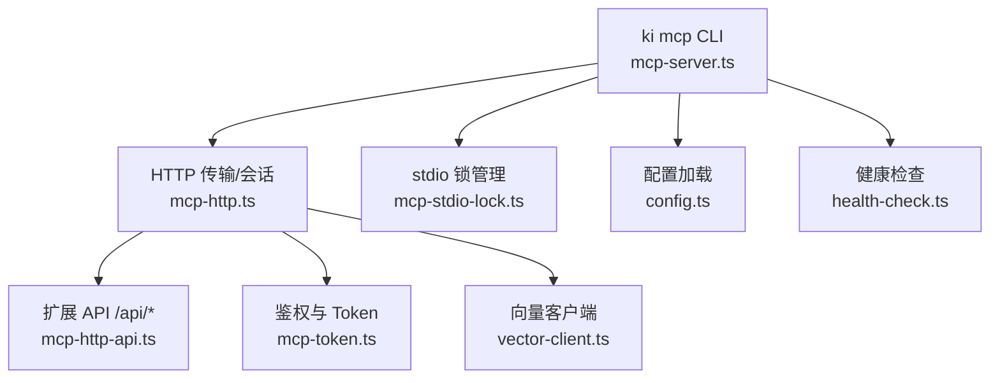
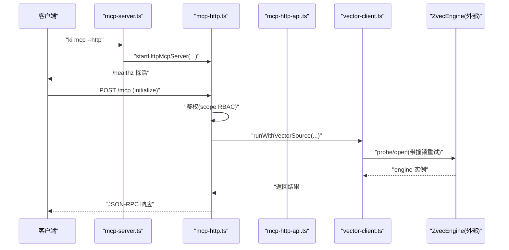
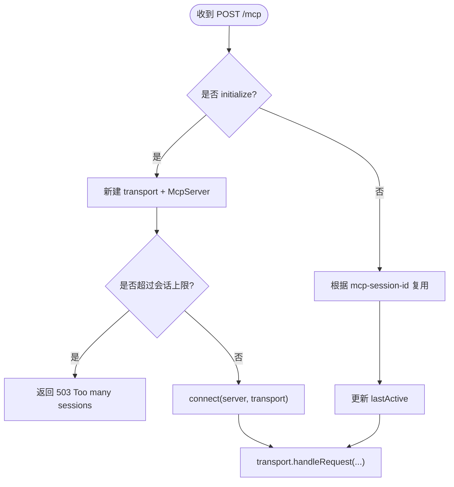
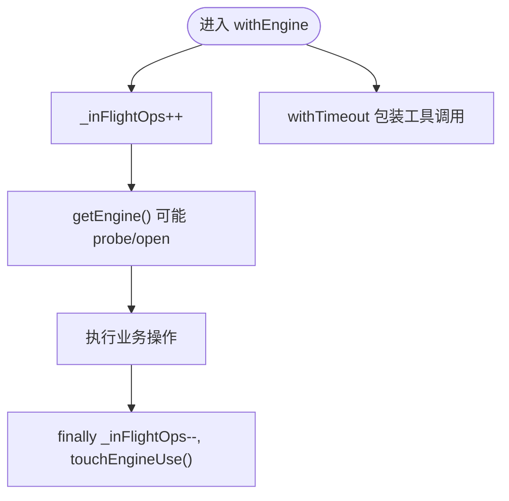
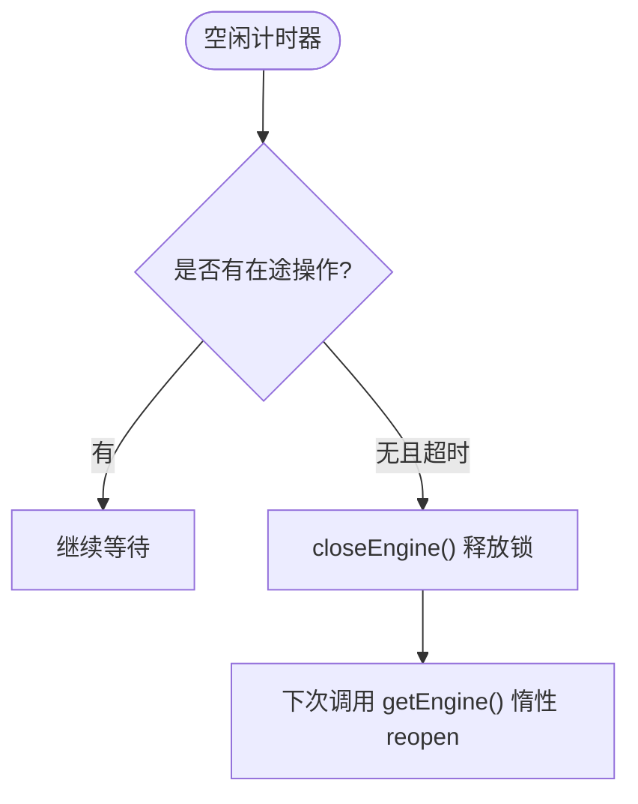
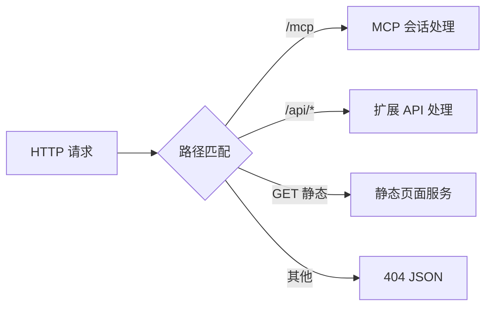
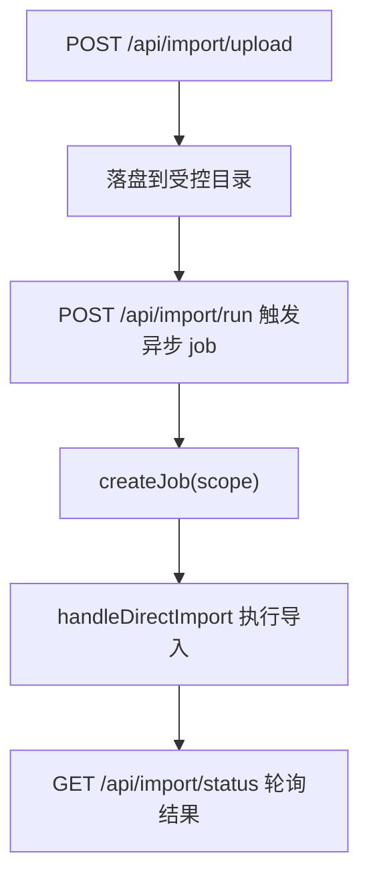
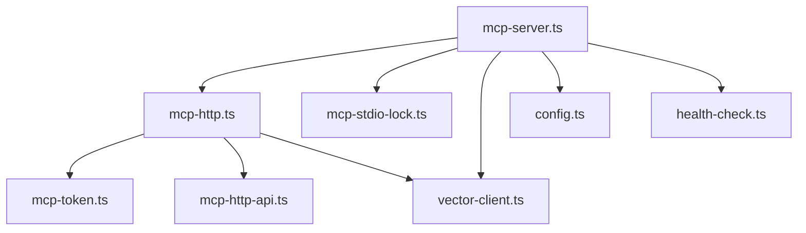
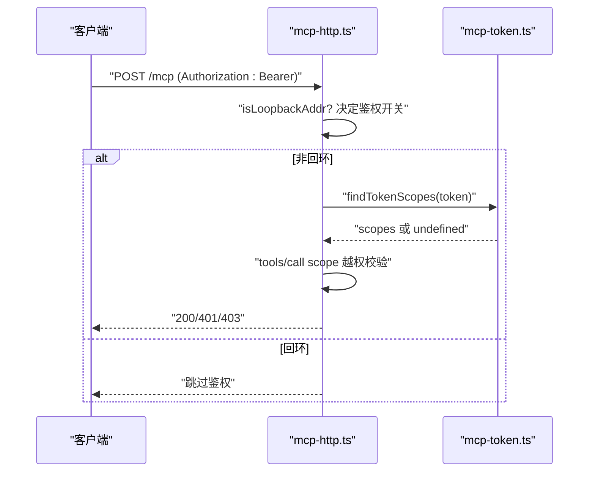

# 高级用法

<cite>
**本文引用的文件**
- [mcp-server.ts](file://src/mcp-server.ts)
- [mcp-http.ts](file://src/lib/mcp-http.ts)
- [mcp-http-api.ts](file://src/lib/mcp-http-api.ts)
- [mcp-token.ts](file://src/lib/mcp-token.ts)
- [mcp-stdio-lock.ts](file://src/lib/mcp-stdio-lock.ts)
- [vector-client.ts](file://src/lib/vector-client.ts)
- [config.ts](file://src/lib/config.ts)
- [health-check.ts](file://src/lib/health-check.ts)
- [util.ts](file://src/lib/mcp-tools/util.ts)
- [mcp-http.md](file://docs/mcp-http.md)
</cite>

## 目录
1. [简介](#简介)
2. [项目结构](#项目结构)
3. [核心组件](#核心组件)
4. [架构总览](#架构总览)
5. [详细组件分析](#详细组件分析)
6. [依赖关系分析](#依赖关系分析)
7. [性能与资源优化](#性能与资源优化)
8. [生产部署与监控](#生产部署与监控)
9. [安全加固与访问控制](#安全加固与访问控制)
10. [故障排除指南](#故障排除指南)
11. [结论](#结论)

## 简介
本指南面向在生产环境运行 ki MCP SDK 的高级用户，聚焦以下主题：
- 高级连接管理：HTTP 共享单例、会话生命周期、空闲回收、多实例共存策略
- 并发控制与请求限流：会话上限、工具超时、向量库撞锁重试、串行化打开
- 错误恢复策略：空闲释放锁、worker 不可用自愈、健康检查与启动预检
- 连接池与会话复用：MCP 会话与 vector engine 单例的协作模式
- 自定义传输层与扩展点：/api/* 扩展路由、静态页面服务、鉴权中间件
- 生产部署配置：端口/地址/鉴权/Host 白名单、后台常驻与重启
- 监控指标与诊断：/healthz、鉴权失败计数、导入 job 状态
- 性能调优：内存与网络优化建议、embedding 维度与超时
- 安全加固：Token 托管、scope RBAC、路径穿越防护、DNS rebinding 保护
- 故障排除：常见报错、定位方法、恢复步骤

## 项目结构
ki 的 MCP 能力由“进程入口 + HTTP 传输 + 工具注册 + 向量客户端 + 配置与健康检查”组成。关键模块职责如下：
- mcp-server.ts：CLI 分发、stdio/HTTP 模式选择、守护进程与重启、启动守卫与预检
- mcp-http.ts：Streamable HTTP 传输、会话管理、鉴权、静态页面、/healthz
- mcp-http-api.ts：/api/* 扩展接口（健康、文档列表、导入上传/执行/状态）
- mcp-token.ts：多 Token 存储与 scope 授权（RBAC）
- mcp-stdio-lock.ts：stdio 多实例 lock 登记与清理
- vector-client.ts：向量引擎封装、撞锁重试、空闲释放锁、在途保护与自愈
- config.ts：配置加载、默认值、scope 解析、embedding 配置
- health-check.ts：启动前健康检查（配置、目录、embedding、collection）

图表来源
- [mcp-server.ts:492-734](file://src/mcp-server.ts#L492-L734)
- [mcp-http.ts:363-642](file://src/lib/mcp-http.ts#L363-L642)
- [mcp-http-api.ts:216-272](file://src/lib/mcp-http-api.ts#L216-L272)
- [mcp-token.ts:245-259](file://src/lib/mcp-token.ts#L245-L259)
- [vector-client.ts:111-124](file://src/lib/vector-client.ts#L111-L124)
- [config.ts:156-183](file://src/lib/config.ts#L156-L183)
- [health-check.ts:150-240](file://src/lib/health-check.ts#L150-L240)

章节来源
- [mcp-server.ts:492-734](file://src/mcp-server.ts#L492-L734)
- [mcp-http.ts:363-642](file://src/lib/mcp-http.ts#L363-L642)
- [mcp-http-api.ts:216-272](file://src/lib/mcp-http-api.ts#L216-L272)
- [mcp-token.ts:245-259](file://src/lib/mcp-token.ts#L245-L259)
- [mcp-stdio-lock.ts:104-144](file://src/lib/mcp-stdio-lock.ts#L104-L144)
- [vector-client.ts:111-124](file://src/lib/vector-client.ts#L111-L124)
- [config.ts:156-183](file://src/lib/config.ts#L156-L183)
- [health-check.ts:150-240](file://src/lib/health-check.ts#L150-L240)

## 核心组件
- 进程入口与模式切换：支持 stdio 与 HTTP；HTTP 为多 IDE 共享单例，避免向量库锁冲突
- HTTP 传输与会话：每个 initialize 新建 transport + McpServer，共享 vector engine 单例
- 鉴权与 RBAC：回环免鉴权，非回环强制 Bearer Token；按 Token 授权 scope 集合校验
- 扩展 API：/api/* 提供健康、文档列表、导入上传/执行/状态等能力
- 向量客户端：engine 单例、撞锁重试、空闲释放锁、在途保护、worker 不可用自愈
- 配置与健康检查：YAML/JSON 配置、字段校验、embedding 连通性检查、collection 存在性

章节来源
- [mcp-server.ts:492-734](file://src/mcp-server.ts#L492-L734)
- [mcp-http.ts:363-642](file://src/lib/mcp-http.ts#L363-L642)
- [mcp-http-api.ts:216-272](file://src/lib/mcp-http-api.ts#L216-L272)
- [vector-client.ts:111-124](file://src/lib/vector-client.ts#L111-L124)
- [config.ts:156-183](file://src/lib/config.ts#L156-L183)
- [health-check.ts:150-240](file://src/lib/health-check.ts#L150-L240)

## 架构总览
ki MCP 以“单进程 HTTP 服务”作为向量库唯一持锁者，所有客户端通过 Streamable HTTP 接入；stdio 模式保留为兜底，但需避免与 HTTP 单例并存导致锁争抢。

图表来源
- [mcp-server.ts:687-699](file://src/mcp-server.ts#L687-L699)
- [mcp-http.ts:431-612](file://src/lib/mcp-http.ts#L431-L612)
- [vector-client.ts:111-124](file://src/lib/vector-client.ts#L111-L124)

章节来源
- [mcp-server.ts:687-699](file://src/mcp-server.ts#L687-L699)
- [mcp-http.ts:431-612](file://src/lib/mcp-http.ts#L431-L612)
- [vector-client.ts:111-124](file://src/lib/vector-client.ts#L111-L124)

## 详细组件分析

### 高级连接管理与会话复用
- HTTP 共享单例：同一 host:port 仅一个健康实例被复用，重复启动直接退出并提示已存在
- 会话模型：每个 initialize 创建独立 transport + McpServer，共享 vector engine 单例
- 会话上限与空闲回收：默认最大 256 会话，30 分钟无活动自动回收，防止内存泄漏
- stdio 与 HTTP 互斥：检测到对方存活时拒绝启动，引导迁移 URL 接入

图表来源
- [mcp-http.ts:523-612](file://src/lib/mcp-http.ts#L523-L612)

章节来源
- [mcp-http.ts:431-612](file://src/lib/mcp-http.ts#L431-L612)
- [mcp-server.ts:595-658](file://src/mcp-server.ts#L595-L658)

### 并发控制与请求限流
- 会话上限：防止 initialize 风暴耗尽内存
- 工具超时：READ/WRITE/BULK 三类预设超时，避免长驻进程被阻塞
- 向量库撞锁重试：检测 locked 后等待并重试，最多 N 次
- 引擎操作串行化：open/create/close 串行队列，避免原生竞态永久阻塞

图表来源
- [vector-client.ts:409-427](file://src/lib/vector-client.ts#L409-L427)
- [vector-client.ts:212-236](file://src/lib/vector-client.ts#L212-L236)
- [util.ts:24-42](file://src/lib/mcp-tools/util.ts#L24-L42)

章节来源
- [vector-client.ts:111-124](file://src/lib/vector-client.ts#L111-L124)
- [vector-client.ts:212-236](file://src/lib/vector-client.ts#L212-L236)
- [vector-client.ts:409-427](file://src/lib/vector-client.ts#L409-L427)
- [util.ts:24-42](file://src/lib/mcp-tools/util.ts#L24-L42)

### 错误恢复策略
- 空闲释放锁：常驻 MCP 启用空闲释放，空闲超时后 closeEngine 释放 LOCK，让其他实例错开使用
- worker 不可用自愈：捕获 WorkerUnavailableError，重置 engine 并重试一次
- 启动预检：配置、目录、embedding、collection 健康检查，失败则拒绝启动

图表来源
- [vector-client.ts:184-201](file://src/lib/vector-client.ts#L184-L201)
- [vector-client.ts:366-382](file://src/lib/vector-client.ts#L366-L382)
- [health-check.ts:150-240](file://src/lib/health-check.ts#L150-L240)

章节来源
- [vector-client.ts:184-201](file://src/lib/vector-client.ts#L184-L201)
- [vector-client.ts:366-382](file://src/lib/vector-client.ts#L366-L382)
- [health-check.ts:150-240](file://src/lib/health-check.ts#L150-L240)

### 自定义传输层实现与扩展机制
- 传输层：基于 Node http.Server + StreamableHTTPServerTransport，不引入 express
- 扩展路由：/api/* 延迟加载处理器，提供健康、文档列表、导入上传/执行/状态
- 静态页面：--web 提供前端 SPA，含路径穿越防护与 fallback
- 鉴权中间件：按绑定地址条件生效，远程来源需 Bearer Token，支持 Host 头白名单

图表来源
- [mcp-http.ts:413-474](file://src/lib/mcp-http.ts#L413-L474)
- [mcp-http-api.ts:216-272](file://src/lib/mcp-http-api.ts#L216-L272)

章节来源
- [mcp-http.ts:413-474](file://src/lib/mcp-http.ts#L413-L474)
- [mcp-http-api.ts:216-272](file://src/lib/mcp-http-api.ts#L216-L272)

### 插件扩展机制（导入作业与缓存）
- 导入作业：内存 Map 管理，TTL 清理，限制最大作业数，支持进度轮询
- 文档列表缓存：按 scope 缓存 relations-cache 构建结果，按 mtime 失效
- 上传受控目录：~/.ki/import-uploads/<uploadId>/，严格校验扩展名与大小

图表来源
- [mcp-http-api.ts:67-86](file://src/lib/mcp-http-api.ts#L67-L86)
- [mcp-http-api.ts:373-506](file://src/lib/mcp-http-api.ts#L373-L506)
- [mcp-http-api.ts:518-564](file://src/lib/mcp-http-api.ts#L518-L564)

章节来源
- [mcp-http-api.ts:67-86](file://src/lib/mcp-http-api.ts#L67-L86)
- [mcp-http-api.ts:373-506](file://src/lib/mcp-http-api.ts#L373-L506)
- [mcp-http-api.ts:518-564](file://src/lib/mcp-http-api.ts#L518-L564)

## 依赖关系分析
- mcp-server.ts 依赖 mcp-http.ts（HTTP 单例）、mcp-stdio-lock.ts（stdio 锁）、vector-client.ts（engine）、config.ts（配置）、health-check.ts（预检）
- mcp-http.ts 依赖 mcp-token.ts（RBAC）、mcp-http-api.ts（扩展 API）、vector-client.ts（向量源标注）
- vector-client.ts 依赖 dist/zvec-engine（底层引擎），并通过 AsyncLocalStorage 标注来源

图表来源
- [mcp-server.ts:492-734](file://src/mcp-server.ts#L492-L734)
- [mcp-http.ts:363-642](file://src/lib/mcp-http.ts#L363-L642)
- [vector-client.ts:94-104](file://src/lib/vector-client.ts#L94-L104)

章节来源
- [mcp-server.ts:492-734](file://src/mcp-server.ts#L492-L734)
- [mcp-http.ts:363-642](file://src/lib/mcp-http.ts#L363-L642)
- [vector-client.ts:94-104](file://src/lib/vector-client.ts#L94-L104)

## 性能与资源优化
- 会话上限与空闲回收：默认 256 会话、30 分钟空闲回收，避免内存增长
- 工具超时：READ/WRITE/BULK 分级超时，避免长任务阻塞后续请求
- 向量库撞锁重试：短间隔重试，减少瞬时拥塞导致的失败
- 引擎操作串行化：open/create/close 串行化，避免原生竞态
- embedding 维度与超时：确保 dimension 与模型一致，健康检查包含连通性与密钥校验
- 内存与网络：上传大小限制、请求体上限、SPA fallback 减少无效请求

章节来源
- [mcp-http.ts:47-54](file://src/lib/mcp-http.ts#L47-L54)
- [util.ts:34-42](file://src/lib/mcp-tools/util.ts#L34-L42)
- [vector-client.ts:157-160](file://src/lib/vector-client.ts#L157-L160)
- [vector-client.ts:212-236](file://src/lib/vector-client.ts#L212-L236)
- [health-check.ts:54-144](file://src/lib/health-check.ts#L54-L144)

## 生产部署与监控
- 监听地址与端口：默认 127.0.0.1:7423；对外暴露需显式 host 并开启鉴权
- 后台常驻：--daemon/-d 脱离终端；restart 幂等重启并沿用上次配置
- 健康检查：/healthz 返回 ok/name/pid/version/authFailures；ki mcp --status 输出实例全貌
- 导入作业：/api/import/* 提供上传、执行、状态查询，便于前端或自动化流程
- 日志与可观测：鉴权失败限频日志、越权拦截日志、撞锁来源标注

章节来源
- [mcp-server.ts:137-212](file://src/mcp-server.ts#L137-L212)
- [mcp-http.ts:711-767](file://src/lib/mcp-http.ts#L711-L767)
- [mcp-http.ts:202-249](file://src/lib/mcp-http.ts#L202-L249)
- [mcp-http-api.ts:276-288](file://src/lib/mcp-http-api.ts#L276-L288)
- [mcp-http-api.ts:452-506](file://src/lib/mcp-http-api.ts#L452-L506)

## 安全加固与访问控制
- 鉴权策略：回环绑定免鉴权；非回环强制 Bearer Token；支持临时全权 Token 或多 Token 存储
- RBAC：按 Token 授权 scope 集合校验 tools/call 与 /api/* 的 scope 参数
- DNS rebinding 保护：allowedHosts 白名单限制 Host 头
- 路径穿越防护：静态文件服务 normalize 路径，拒绝越界访问
- Token 管理：生成/列出/更新/删除 Token，原子写回与损坏保护

图表来源
- [mcp-http.ts:476-509](file://src/lib/mcp-http.ts#L476-L509)
- [mcp-token.ts:245-259](file://src/lib/mcp-token.ts#L245-L259)
- [mcp-http-api.ts:222-258](file://src/lib/mcp-http-api.ts#L222-L258)

章节来源
- [mcp-http.ts:476-509](file://src/lib/mcp-http.ts#L476-L509)
- [mcp-token.ts:245-259](file://src/lib/mcp-token.ts#L245-L259)
- [mcp-http-api.ts:222-258](file://src/lib/mcp-http-api.ts#L222-L258)

## 故障排除指南
- 端口占用：EADDRINUSE 且未探测到健康实例 → 更换端口或排查占用进程
- 权限不足：EACCES 绑定低端口 → 改用高位端口
- 地址不可用：EADDRNOTAVAIL/ENOTFOUND → 修正 host 或解析
- 鉴权失败：401 → 核对 Authorization 与 token list；服务端 stderr 记录原因
- 越权拒绝：403 → 确认 scope 是否在授权范围；必要时更新 Token scope
- 向量库被占用：LOCKED → 等待空闲释放或停止冲突进程；必要时重建
- 启动预检失败：检查配置文件、embedding apiKey、目录权限

章节来源
- [mcp-http.ts:644-665](file://src/lib/mcp-http.ts#L644-L665)
- [mcp-server.ts:660-678](file://src/mcp-server.ts#L660-L678)
- [health-check.ts:150-240](file://src/lib/health-check.ts#L150-L240)
- [vector-client.ts:440-494](file://src/lib/vector-client.ts#L440-L494)

## 结论
ki MCP SDK 通过 HTTP 共享单例、严格的会话与资源管控、健壮的向量库撞锁重试与空闲释放锁、完善的鉴权与 RBAC、以及可扩展的 /api/* 接口，提供了生产级的高可用与高安全能力。结合健康检查、监控指标与故障排除指南，可在复杂环境中稳定运行并快速定位问题。