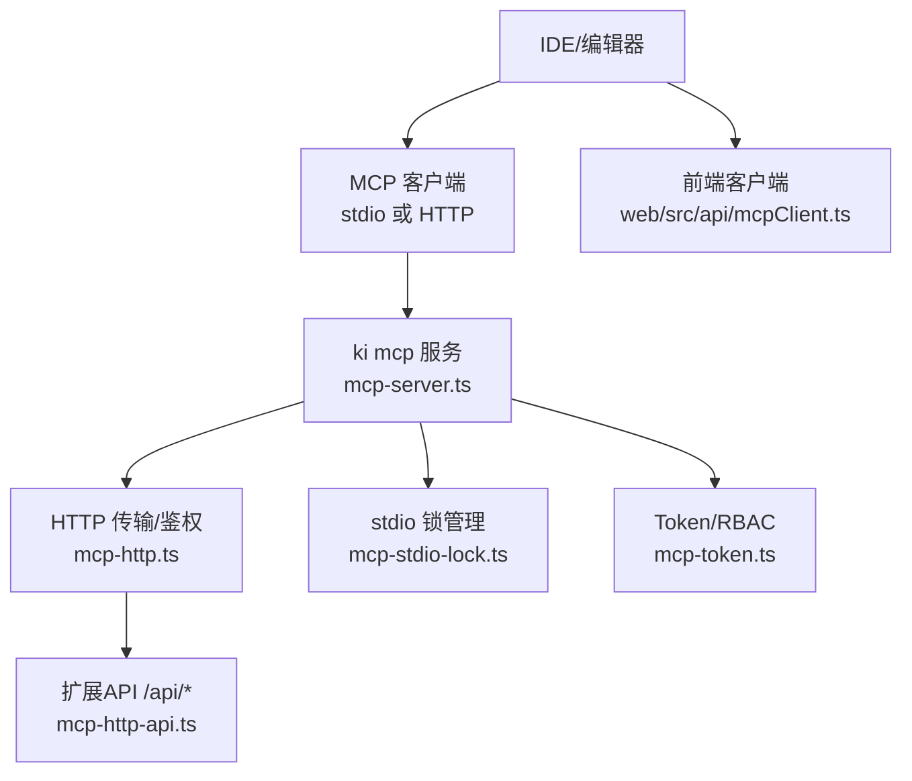
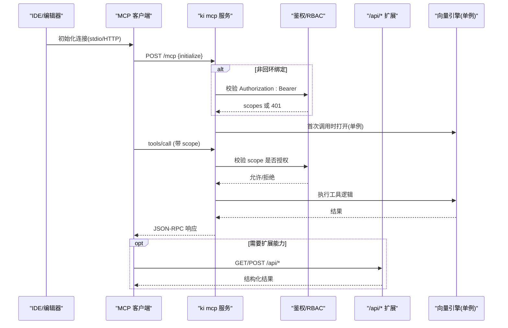
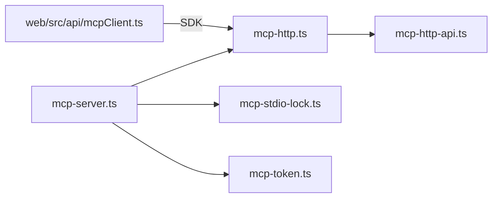

# 客户端集成指南

<cite>
**本文引用的文件**
- [src/mcp-server.ts](file://src/mcp-server.ts)
- [src/lib/mcp-http.ts](file://src/lib/mcp-http.ts)
- [src/lib/mcp-stdio-lock.ts](file://src/lib/mcp-stdio-lock.ts)
- [src/lib/mcp-token.ts](file://src/lib/mcp-token.ts)
- [src/lib/mcp-http-api.ts](file://src/lib/mcp-http-api.ts)
- [docs/mcp-http.md](file://docs/mcp-http.md)
- [web/src/api/mcpClient.ts](file://web/src/api/mcpClient.ts)
- [test/mcp-http.test.ts](file://test/mcp-http.test.ts)
</cite>

## 目录
1. [简介](#简介)
2. [项目结构](#项目结构)
3. [核心组件](#核心组件)
4. [架构总览](#架构总览)
5. [详细组件分析](#详细组件分析)
6. [依赖关系分析](#依赖关系分析)
7. [性能与高可用](#性能与高可用)
8. [IDE/编辑器接入指南](#ide编辑器接入指南)
9. [连接参数、认证与安全](#连接参数认证与安全)
10. [多实例、负载均衡与高可用](#多实例负载均衡与高可用)
11. [连接池、重试与超时配置](#连接池重试与超时配置)
12. [集成测试与调试](#集成测试与调试)
13. [常见问题排查](#常见问题排查)
14. [结论](#结论)

## 简介
本指南面向需要在 IDE/编辑器中接入 MCP 服务的开发者，覆盖 stdio 模式与 HTTP 模式的配置方法、连接参数与认证设置；提供 JavaScript/TypeScript 客户端使用示例；说明连接管理、错误重试、超时、多实例与高可用策略；并给出集成测试方法与调试排障建议。

## 项目结构
- MCP 服务端入口：负责启动 stdio 或 HTTP 传输、注册工具、鉴权与会话管理。
- HTTP 传输层：实现 Streamable HTTP 会话、鉴权中间件、静态页面与扩展 API。
- 进程锁与守护：stdio 多实例登记、HTTP 单例守护与幂等复用。
- Token 与 RBAC：多 Token 存储、scope 授权与越权拦截。
- 前端客户端：浏览器端通过 MCP SDK 调用工具，封装常用能力。

图表来源
- [src/mcp-server.ts:49-71](file://src/mcp-server.ts#L49-L71)
- [src/lib/mcp-http.ts:363-642](file://src/lib/mcp-http.ts#L363-L642)
- [src/lib/mcp-stdio-lock.ts:100-154](file://src/lib/mcp-stdio-lock.ts#L100-L154)
- [src/lib/mcp-token.ts:240-265](file://src/lib/mcp-token.ts#L240-L265)
- [src/lib/mcp-http-api.ts:216-272](file://src/lib/mcp-http-api.ts#L216-L272)
- [web/src/api/mcpClient.ts:53-109](file://web/src/api/mcpClient.ts#L53-L109)

章节来源
- [src/mcp-server.ts:49-71](file://src/mcp-server.ts#L49-L71)
- [docs/mcp-http.md:1-70](file://docs/mcp-http.md#L1-L70)

## 核心组件
- MCP Server 构建器：统一注册全部工具（搜索、模块信息、索引管理、存储、关系同步等），供 stdio 与 HTTP 复用。
- HTTP 传输与会话：每个 initialize 新建 transport + McpServer，共享向量引擎单例；支持会话上限与空闲回收。
- 鉴权与 RBAC：回环免鉴权，非回环强制 Bearer Token；按 scope 集合校验 tools/call 请求。
- 进程锁与守护：stdio 每实例独立 lock；HTTP 单例幂等复用；异常退出清理 lock。
- 扩展 API：/api/* 提供健康检查、文档列表、导入上传与任务状态查询。

章节来源
- [src/mcp-server.ts:49-71](file://src/mcp-server.ts#L49-L71)
- [src/lib/mcp-http.ts:363-642](file://src/lib/mcp-http.ts#L363-L642)
- [src/lib/mcp-token.ts:240-265](file://src/lib/mcp-token.ts#L240-L265)
- [src/lib/mcp-stdio-lock.ts:100-154](file://src/lib/mcp-stdio-lock.ts#L100-L154)
- [src/lib/mcp-http-api.ts:216-272](file://src/lib/mcp-http-api.ts#L216-L272)

## 架构总览
下图展示 IDE/编辑器通过 stdio 或 HTTP 接入 ki mcp 的完整链路，包括鉴权、会话、RBAC 与扩展 API。

图表来源
- [src/mcp-server.ts:492-734](file://src/mcp-server.ts#L492-L734)
- [src/lib/mcp-http.ts:431-612](file://src/lib/mcp-http.ts#L431-L612)
- [src/lib/mcp-token.ts:240-265](file://src/lib/mcp-token.ts#L240-L265)
- [src/lib/mcp-http-api.ts:216-272](file://src/lib/mcp-http-api.ts#L216-L272)

## 详细组件分析

### MCP Server 构建与工具注册
- 构建器集中注册所有工具，确保 stdio 与 HTTP 行为一致。
- 支持传入 authScopes，用于枚举类工具的输出过滤。

章节来源
- [src/mcp-server.ts:49-71](file://src/mcp-server.ts#L49-L71)

### HTTP 传输与会话管理
- 每个 initialize 创建新 transport 与 McpServer，共享向量引擎单例。
- 会话上限保护（默认 256）、空闲回收（默认 30 分钟）。
- 支持 DNS rebinding 防护（allowedHosts）。

章节来源
- [src/lib/mcp-http.ts:363-642](file://src/lib/mcp-http.ts#L363-L642)

### 鉴权与 RBAC
- 回环地址免鉴权；非回环地址强制 Bearer Token。
- 支持全权临时 Token 与多 Token 存储；按 scope 集合校验 tools/call。
- 越权返回 403，且响应体脱敏（不泄露 scope 名）。

章节来源
- [src/lib/mcp-http.ts:476-561](file://src/lib/mcp-http.ts#L476-L561)
- [src/lib/mcp-token.ts:240-265](file://src/lib/mcp-token.ts#L240-L265)

### stdio 多实例锁与冲突检测
- 每实例独立 lock 文件，支持多实例并存与“错开共享”。
- 启动守卫检测 HTTP 单例与 stdio 冲突，避免争抢向量库锁。

章节来源
- [src/lib/mcp-stdio-lock.ts:100-154](file://src/lib/mcp-stdio-lock.ts#L100-L154)
- [src/mcp-server.ts:620-658](file://src/mcp-server.ts#L620-L658)

### 扩展 API
- /api/health、/api/doc/list、/api/import/* 等接口，与 MCP 会话隔离但共享鉴权规则。

章节来源
- [src/lib/mcp-http-api.ts:216-272](file://src/lib/mcp-http-api.ts#L216-L272)

## 依赖关系分析
- mcp-server.ts 依赖 mcp-http.ts（HTTP 模式）、mcp-stdio-lock.ts（stdio 锁）、mcp-token.ts（鉴权）与工具注册模块。
- mcp-http.ts 依赖 mcp-http-api.ts（延迟加载）、mcp-token.ts（RBAC）与网络地址判定。
- web/src/api/mcpClient.ts 依赖 @modelcontextprotocol/sdk 的客户端与传输。

图表来源
- [src/mcp-server.ts:49-71](file://src/mcp-server.ts#L49-L71)
- [src/lib/mcp-http.ts:31-35](file://src/lib/mcp-http.ts#L31-L35)
- [web/src/api/mcpClient.ts:8-9](file://web/src/api/mcpClient.ts#L8-L9)

章节来源
- [src/mcp-server.ts:49-71](file://src/mcp-server.ts#L49-L71)
- [src/lib/mcp-http.ts:31-35](file://src/lib/mcp-http.ts#L31-L35)
- [web/src/api/mcpClient.ts:8-9](file://web/src/api/mcpClient.ts#L8-L9)

## 性能与高可用
- 会话上限与空闲回收：防止会话无界增长与内存泄漏。
- 向量引擎单例：减少锁竞争，提升吞吐。
- 优雅退出：关闭会话、释放引擎、删除 lock，避免残留持锁进程。
- 健康检查：/healthz 免鉴权探活，便于幂等单例与运维监控。

章节来源
- [src/lib/mcp-http.ts:47-57](file://src/lib/mcp-http.ts#L47-L57)
- [src/lib/mcp-http.ts:769-798](file://src/lib/mcp-http.ts#L769-L798)
- [docs/mcp-http.md:147-157](file://docs/mcp-http.md#L147-L157)

## IDE/编辑器接入指南

### 通用原则
- 本地开发推荐 stdio 模式（简单、无需鉴权）。
- 多 IDE/远程访问推荐 HTTP 模式（单例共享、避免锁冲突）。
- 所有 IDE 必须使用完全一致的 URL（host/port 一致），否则各自拉起进程会退化为锁冲突场景。

章节来源
- [docs/mcp-http.md:24-40](file://docs/mcp-http.md#L24-L40)

### VS Code（以 MCP 插件为例）
- stdio 模式：在 MCP 配置中使用 command/args 指向 ki mcp，并通过环境变量注入所需密钥（如 SILICONFLOW_API_KEY）。
- HTTP 模式：使用 url 型条目指向 http://<host>:<port>/mcp；回环绑定可省略 headers，非回环需添加 Authorization: Bearer <token>。

章节来源
- [docs/mcp-http.md:24-40](file://docs/mcp-http.md#L24-L40)
- [.module-experts/MCP服务专家/C2-使用流程.md:3-28](file://.module-experts/MCP服务专家/C2-使用流程.md#L3-L28)

### Cursor
- 同 VS Code：优先使用 URL 型接入（http://<host>:<port>/mcp），回环免鉴权，非回环需 Bearer Token。
- 若使用 stdio，请确保仅一个 IDE 使用 stdio，其余改用 URL 以避免锁冲突。

章节来源
- [docs/mcp-http.md:24-40](file://docs/mcp-http.md#L24-L40)

### Windsurf
- 同 VS Code：URL 型接入更稳定；如需 stdio，遵循“单 IDE stdio”的原则。

章节来源
- [docs/mcp-http.md:24-40](file://docs/mcp-http.md#L24-L40)

### Qoder/Claude Desktop（参考 zvec-mcp-server 配置方式）
- 可在对应 IDE 的 MCP 配置文件中添加 ki mcp 的 stdio 或 HTTP 条目，参照仓库中的示例格式。

章节来源
- [zvec-mcp-server/README.md:73-115](file://zvec-mcp-server/README.md#L73-L115)

## 连接参数、认证与安全

### 连接参数
- stdio：command/args 指向 ki mcp，适合本地单 IDE。
- HTTP：url 指向 http://<host>:<port>/mcp；默认端口 7423，默认主机 127.0.0.1。
- 可选：allowedHosts（DNS rebinding 防护）、web（同时提供前端静态页面）。

章节来源
- [docs/mcp-http.md:41-58](file://docs/mcp-http.md#L41-L58)
- [src/lib/mcp-http.ts:37-51](file://src/lib/mcp-http.ts#L37-L51)

### 认证设置
- 回环绑定：免鉴权，可省略 Authorization。
- 非回环绑定：强制 Bearer Token；支持全权临时 Token（--token/KI_MCP_TOKEN）或多 Token 存储（~/.ki/mcp-tokens.json）。
- scope 越权：tools/call 的 arguments.scope 必须在 Token 授权范围内，否则 403。

章节来源
- [docs/mcp-http.md:132-146](file://docs/mcp-http.md#L132-L146)
- [src/lib/mcp-http.ts:476-561](file://src/lib/mcp-http.ts#L476-L561)
- [src/lib/mcp-token.ts:240-265](file://src/lib/mcp-token.ts#L240-L265)

### 安全建议
- 生产环境前置 TLS 反向代理（Nginx/Caddy）。
- 限制来源 IP 与 Host 头白名单。
- 使用最小权限 scope 的托管 Token，并定期审计。

章节来源
- [docs/mcp-http.md:243-248](file://docs/mcp-http.md#L243-L248)

## 多实例、负载均衡与高可用
- 多实例：stdio 允许多实例并存，靠向量库空闲释放锁与撞锁重试错开共享；HTTP 单例为唯一持锁者，避免并发等待。
- 负载均衡：建议在网关/反代层做负载均衡（如 Nginx/Caddy），将流量分发到多个 ki mcp 实例。
- 高可用：结合服务发现与健康检查（/healthz），实现故障切换与滚动升级。

章节来源
- [docs/mcp-http.md:9-10](file://docs/mcp-http.md#L9-L10)
- [docs/mcp-http.md:147-157](file://docs/mcp-http.md#L147-L157)
- [docs/mcp-http.md:243-248](file://docs/mcp-http.md#L243-L248)

## 连接池、重试与超时配置

### 连接池管理
- 服务端：会话 Map 管理 transport，空闲回收定时器清理过期会话。
- 客户端：浏览器端使用单例 Client，会话失效自动重建并重试一次。

章节来源
- [src/lib/mcp-http.ts:373-411](file://src/lib/mcp-http.ts#L373-L411)
- [web/src/api/mcpClient.ts:53-109](file://web/src/api/mcpClient.ts#L53-L109)

### 错误重试机制
- 客户端：callTool 捕获异常后重建会话并重试一次。
- 服务端：撞锁场景下，向量库 probe/open 自动重试（见文档描述）。

章节来源
- [web/src/api/mcpClient.ts:83-109](file://web/src/api/mcpClient.ts#L83-L109)
- [docs/mcp-http.md:9-10](file://docs/mcp-http.md#L9-L10)

### 超时配置
- 健康检查：/api/health 超时 10 秒。
- 会话空闲回收：默认 30 分钟。
- 会话上限：默认 256。

章节来源
- [src/lib/mcp-http-api.ts:41-42](file://src/lib/mcp-http-api.ts#L41-L42)
- [src/lib/mcp-http.ts:47-51](file://src/lib/mcp-http.ts#L47-L51)

## 集成测试与调试

### 集成测试
- 单元测试覆盖：鉴权、会话隔离、探活、listen 错误描述等。
- 运行方式：npx jiti test/mcp-http.test.ts。

章节来源
- [test/mcp-http.test.ts:1-200](file://test/mcp-http.test.ts#L1-L200)

### 调试技巧
- 使用 ki mcp --status 查看实例全貌（running、healthz、lock、stdioInstances、managedTokens.count）。
- 使用 curl http://<host>:<port>/healthz 快速探活。
- 查看服务端 stderr 日志（鉴权失败、越权拦截、启动预检报告）。

章节来源
- [docs/mcp-http.md:105-131](file://docs/mcp-http.md#L105-L131)
- [docs/mcp-http.md:224-233](file://docs/mcp-http.md#L224-L233)

## 常见问题排查

### 无法连接或 401
- 确认 URL 一致（host/port 完全相同）。
- 非回环绑定需携带 Authorization: Bearer <token>。
- 核对 Token 明文与托管存储一致（整段复制，勿手抄）。

章节来源
- [docs/mcp-http.md:24-40](file://docs/mcp-http.md#L24-L40)
- [docs/mcp-http.md:224-233](file://docs/mcp-http.md#L224-L233)

### 403 越权拒绝
- 检查 tools/call 的 arguments.scope 是否在 Token 授权范围内。
- 枚举工具（ki_scope_list、ki_manage_index_list）无参调用不受此校验限制。

章节来源
- [docs/mcp-http.md:132-146](file://docs/mcp-http.md#L132-L146)
- [src/lib/mcp-http.ts:101-139](file://src/lib/mcp-http.ts#L101-L139)

### 端口被占用
- 使用 ki mcp --status 确认是否有健康实例。
- 若无健康实例，可能是非 ki 进程占用，更换端口或排查占用进程。

章节来源
- [docs/mcp-http.md:224-233](file://docs/mcp-http.md#L224-L233)

### stdio 与 HTTP 冲突
- 已有健康 HTTP 单例时，stdio 启动会被拒绝，提示迁移为 URL 型接入。
- 使用 ki mcp stop 关闭所有实例并清理 lock。

章节来源
- [docs/mcp-http.md:158-169](file://docs/mcp-http.md#L158-L169)
- [docs/mcp-http.md:170-189](file://docs/mcp-http.md#L170-L189)

## 结论
通过 stdio 与 HTTP 双模式、严格的鉴权与 RBAC、幂等单例守护与优雅退出，ki mcp 为 IDE/编辑器提供了稳定、安全、可扩展的知识检索与服务化能力。建议在生产环境采用 HTTP 单例+反代+TLS 的部署方案，并结合健康检查与监控实现高可用。