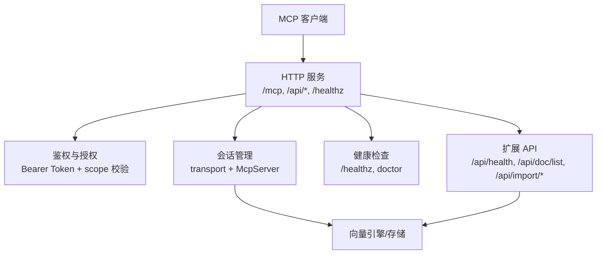
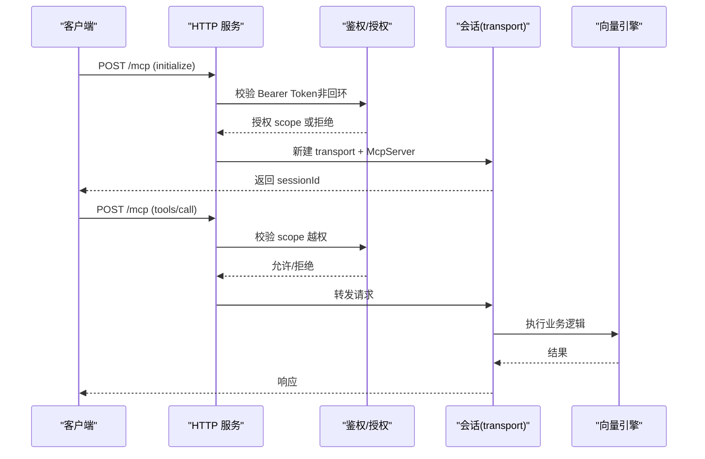
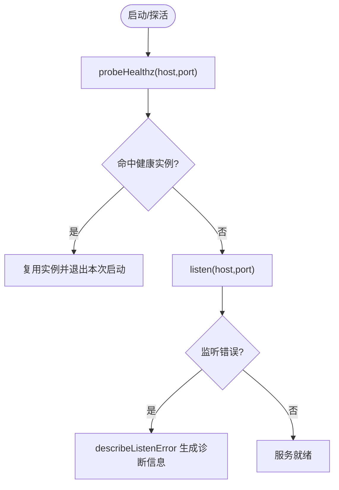
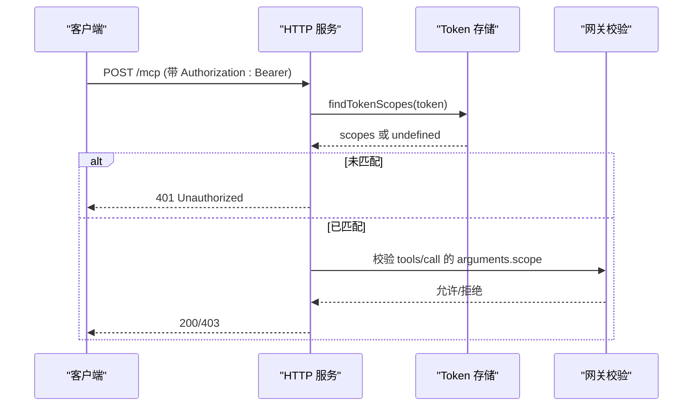
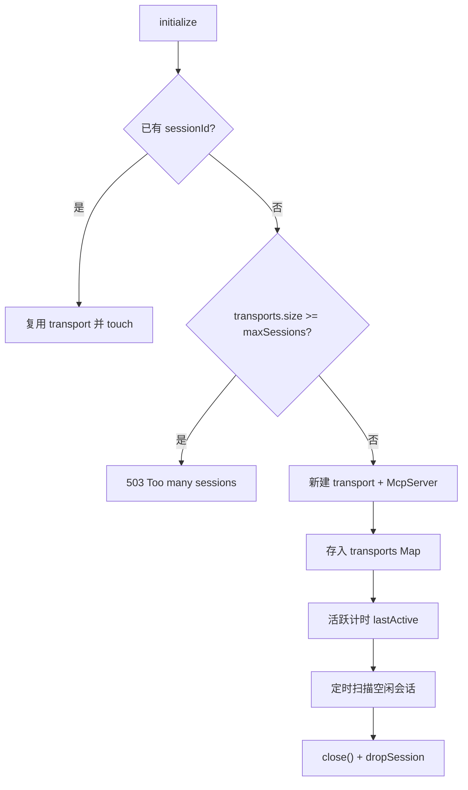
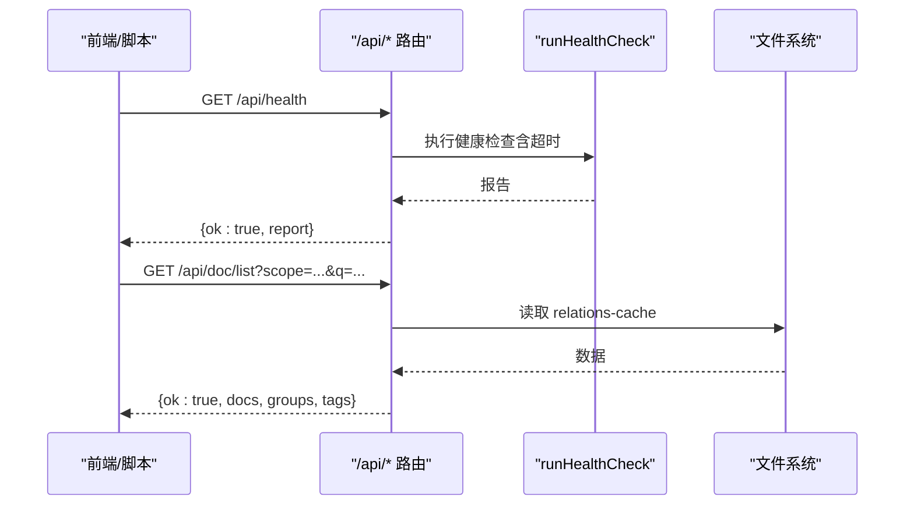
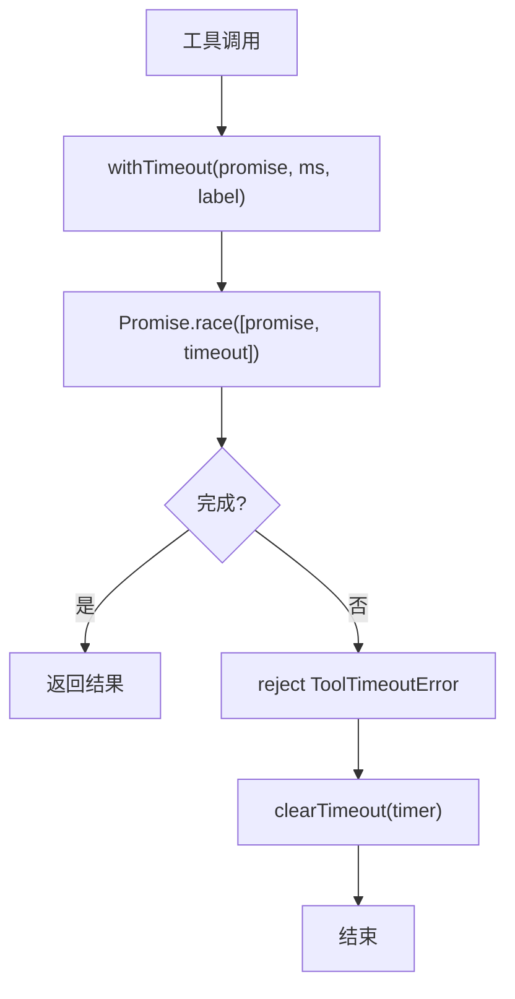
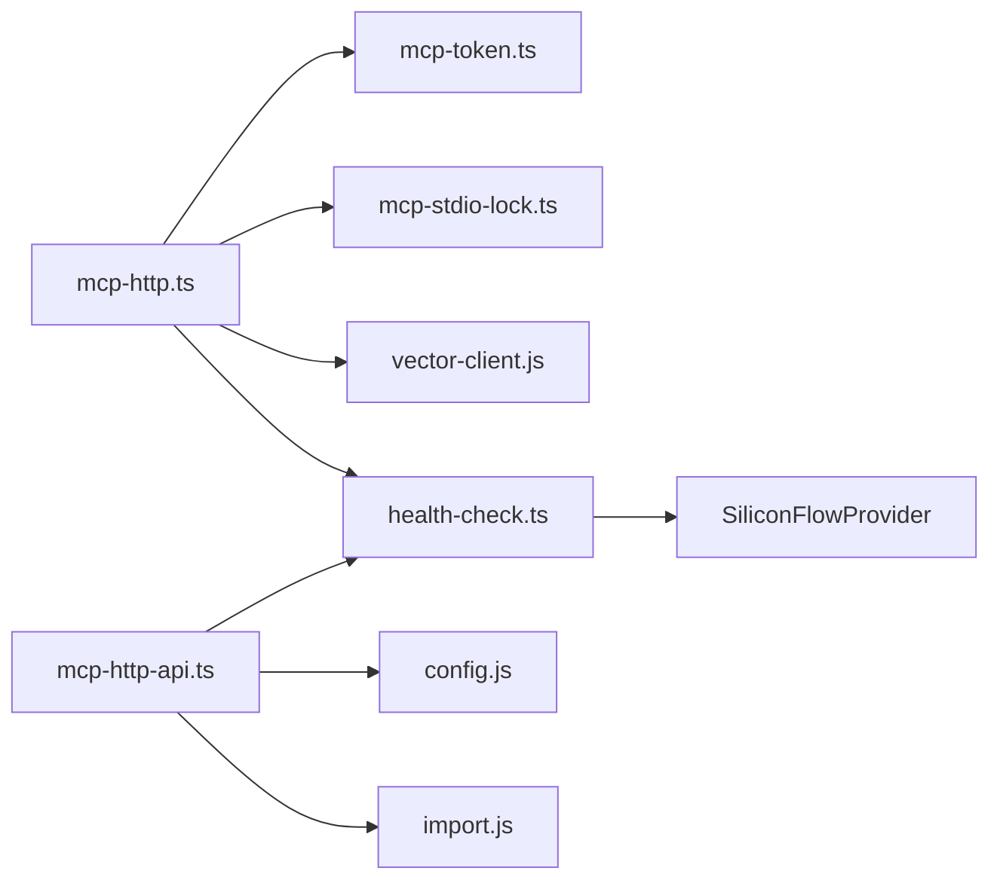

# 调试与故障排除

<cite>
**本文引用的文件**
- [mcp-http.ts](file://src/lib/mcp-http.ts)
- [mcp-http-api.ts](file://src/lib/mcp-http-api.ts)
- [health-check.ts](file://src/lib/health-check.ts)
- [mcp-token.ts](file://src/lib/mcp-token.ts)
- [mcp-stdio-lock.ts](file://src/lib/mcp-stdio-lock.ts)
- [util.ts](file://src/lib/mcp-tools/util.ts)
- [error-handling.md](file://docs/error-handling.md)
- [mcp-http.test.ts](file://test/mcp-http.test.ts)
- [mcp-comprehensive-test.mjs](file://.e2e-run/mcp-comprehensive-test.mjs)
</cite>

## 目录
1. [简介](#简介)
2. [项目结构](#项目结构)
3. [核心组件](#核心组件)
4. [架构总览](#架构总览)
5. [详细组件分析](#详细组件分析)
6. [依赖关系分析](#依赖关系分析)
7. [性能与资源监控](#性能与资源监控)
8. [常见问题与排障步骤](#常见问题与排障步骤)
9. [结论](#结论)
10. [附录：常用命令与工具](#附录：常用命令与工具)

## 简介
本指南面向使用 MCP 客户端连接 ki mcp 服务的用户与运维人员，聚焦以下目标：
- 快速定位网络连通性、认证失败、协议错误等连接问题
- 提供可执行的诊断流程、日志采集方法与性能观测手段
- 给出常见问题的根因分析与恢复策略，包括连接超时、鉴权失败、权限不足、会话泄漏等
- 说明如何启用更详细的日志、捕获错误信息并定位问题根源
- 提供性能瓶颈分析、内存泄漏检测和资源占用监控建议

## 项目结构
MCP HTTP 服务由单一进程承载，通过 StreamableHTTPServerTransport 暴露 /mcp 接口；同时提供 /api/* 扩展能力（健康报告、文档列表、导入任务等）。鉴权按绑定地址条件生效：回环免鉴权，非回环强制 Bearer Token。启动前执行健康检查，运行中维护会话生命周期与空闲回收，并提供幂等单例复用。

图表来源
- [mcp-http.ts:363-641](file://src/lib/mcp-http.ts#L363-L641)
- [mcp-http-api.ts:216-272](file://src/lib/mcp-http-api.ts#L216-L272)
- [health-check.ts:150-240](file://src/lib/health-check.ts#L150-L240)

章节来源
- [mcp-http.ts:1-15](file://src/lib/mcp-http.ts#L1-L15)
- [mcp-http-api.ts:1-16](file://src/lib/mcp-http-api.ts#L1-L16)
- [health-check.ts:1-15](file://src/lib/health-check.ts#L1-L15)

## 核心组件
- MCP HTTP 传输与会话：基于 StreamableHTTPServerTransport，每个 initialize 创建独立 transport 与 McpServer，支持 GET/POST/DELETE 会话控制，空闲回收与上限保护。
- 鉴权与授权：非回环绑定强制 Bearer Token；Token 匹配使用常量时间比较；按 Token 解析授权 scope 集合，拦截越权 tools/call 请求。
- 健康检查：/healthz 返回实例信息；/api/health 调用 runHealthCheck 输出配置、embedding、zvec 等健康项。
- 扩展 API：/api/health、/api/doc/list、/api/import/upload/run/status 等，具备鉴权与 scope 校验。
- 锁与多实例：stdio 模式多实例 lock 文件；HTTP 模式写 lock 文件便于状态查询与停止。
- 工具超时防护：withTimeout 为工具处理器设置超时，避免长驻进程被阻塞。

章节来源
- [mcp-http.ts:363-641](file://src/lib/mcp-http.ts#L363-L641)
- [mcp-http.ts:644-705](file://src/lib/mcp-http.ts#L644-L705)
- [mcp-http-api.ts:216-272](file://src/lib/mcp-http-api.ts#L216-L272)
- [mcp-token.ts:245-259](file://src/lib/mcp-token.ts#L245-L259)
- [mcp-stdio-lock.ts:118-144](file://src/lib/mcp-stdio-lock.ts#L118-L144)
- [util.ts:24-42](file://src/lib/mcp-tools/util.ts#L24-L42)

## 架构总览
下图展示从客户端到服务端的关键路径：鉴权、会话建立、工具调用、健康检查与扩展 API。

图表来源
- [mcp-http.ts:476-612](file://src/lib/mcp-http.ts#L476-L612)
- [mcp-http-api.ts:222-258](file://src/lib/mcp-http-api.ts#L222-L258)

## 详细组件分析

### 连接与健康检查
- /healthz 免鉴权，返回实例名、pid、版本、监听地址及鉴权失败计数，用于幂等单例判定与运维排查。
- fetchHealthz/probeHealthz 实现探活，支持超时与异常处理，供 startHttpMcpServer 在启动时探测已有实例。
- describeListenError 将底层 listen 错误翻译为用户友好的诊断信息（端口占用、权限不足、地址不可用等）。

图表来源
- [mcp-http.ts:214-249](file://src/lib/mcp-http.ts#L214-L249)
- [mcp-http.ts:644-665](file://src/lib/mcp-http.ts#L644-L665)
- [mcp-http.ts:711-752](file://src/lib/mcp-http.ts#L711-L752)

章节来源
- [mcp-http.ts:214-249](file://src/lib/mcp-http.ts#L214-L249)
- [mcp-http.ts:644-665](file://src/lib/mcp-http.ts#L644-L665)
- [mcp-http.ts:711-752](file://src/lib/mcp-http.ts#L711-L752)

### 鉴权与授权（RBAC）
- 非回环绑定强制 Bearer Token；Token 匹配使用 crypto.timingSafeEqual，防止时序侧信道。
- 按 Token 明文查找授权 scope 集合；全权临时 Token 直接授权全部 scope。
- tools/call 的 scope 参数统一在网关层校验，越权返回 403，并在 stderr 记录原因（不含敏感 scope 名）。
- 对无 scope 参数的枚举类工具（如 ki_scope_list）豁免网关层校验，交由工具层按 authScopes 过滤输出。

图表来源
- [mcp-http.ts:476-561](file://src/lib/mcp-http.ts#L476-L561)
- [mcp-token.ts:245-259](file://src/lib/mcp-token.ts#L245-L259)

章节来源
- [mcp-http.ts:476-561](file://src/lib/mcp-http.ts#L476-L561)
- [mcp-token.ts:245-259](file://src/lib/mcp-token.ts#L245-L259)

### 会话管理与空闲回收
- 每个 initialize 创建新的 transport 与 McpServer，sessionId 由 SDK 生成。
- 会话上限保护：超过 maxSessions 返回 503，防止 Map 无界增长。
- 空闲回收定时器定期关闭长时间不活跃的会话，释放资源。
- DELETE /mcp 可显式关闭会话；异常断开时 onsessionclosed 清理。

图表来源
- [mcp-http.ts:563-612](file://src/lib/mcp-http.ts#L563-L612)
- [mcp-http.ts:400-411](file://src/lib/mcp-http.ts#L400-L411)

章节来源
- [mcp-http.ts:563-612](file://src/lib/mcp-http.ts#L563-L612)
- [mcp-http.ts:400-411](file://src/lib/mcp-http.ts#L400-L411)

### 扩展 API（/api/*）
- /api/health：调用 runHealthCheck，返回结构化健康报告（配置、embedding、zvec 等），带超时保护。
- /api/doc/list：读取 relations-cache，聚合 Group 路径与文档列表，支持 q/tag/group/limit 过滤。
- /api/import/upload/run/status：上传受控目录、异步导入、轮询进度，具备鉴权与 scope 校验。

图表来源
- [mcp-http-api.ts:260-288](file://src/lib/mcp-http-api.ts#L260-L288)
- [mcp-http-api.ts:306-369](file://src/lib/mcp-http-api.ts#L306-L369)
- [health-check.ts:150-240](file://src/lib/health-check.ts#L150-L240)

章节来源
- [mcp-http-api.ts:216-272](file://src/lib/mcp-http-api.ts#L216-L272)
- [mcp-http-api.ts:260-369](file://src/lib/mcp-http-api.ts#L260-L369)
- [health-check.ts:150-240](file://src/lib/health-check.ts#L150-L240)

### 工具超时与稳定性
- withTimeout 为工具处理器包裹 Promise.race，超时后以 ToolTimeoutError 返回，避免请求无限挂起。
- 预设 READ/WRITE/BULK 超时阈值，区分只读、写入与批量场景。
- 定时器 unref 不阻止进程退出，finally 清理定时器，防止句柄泄漏。

图表来源
- [util.ts:24-42](file://src/lib/mcp-tools/util.ts#L24-L42)

章节来源
- [util.ts:24-42](file://src/lib/mcp-tools/util.ts#L24-L42)

## 依赖关系分析
- mcp-http.ts 依赖：
  - 网络与 HTTP：node:http
  - 安全：crypto.timingSafeEqual
  - 文件系统：fs/os/path（lock 文件、静态页面）
  - MCP SDK：StreamableHTTPServerTransport、McpServer
  - 模块：version-guard、mcp-token、mcp-stdio-lock、vector-client、constants
- mcp-http-api.ts 依赖：
  - 配置加载：config.js
  - 健康检查：health-check.ts
  - 范围与缓存：scope.js
  - 导入逻辑：import.js
  - 标签：tag.js
- health-check.ts 依赖：
  - 向量嵌入：SiliconFlowProvider（维度、密钥、URL 连通性）
  - 文件系统：检查 dataDir/backupDir/vectorDir 存在性与可写

图表来源
- [mcp-http.ts:17-28](file://src/lib/mcp-http.ts#L17-L28)
- [mcp-http-api.ts:18-29](file://src/lib/mcp-http-api.ts#L18-L29)
- [health-check.ts:17-21](file://src/lib/health-check.ts#L17-L21)

章节来源
- [mcp-http.ts:17-28](file://src/lib/mcp-http.ts#L17-L28)
- [mcp-http-api.ts:18-29](file://src/lib/mcp-http-api.ts#L18-L29)
- [health-check.ts:17-21](file://src/lib/health-check.ts#L17-L21)

## 性能与资源监控
- 会话上限与空闲回收：默认最大并发会话数 256，空闲超时 30 分钟，定时器周期 60 秒，unref 不阻塞进程退出。
- 请求体大小限制：/mcp 与 /api/* 均限制请求体上限（例如 16MB），防止滥用。
- 工具超时：READ 30s、WRITE 60s、BULK 300s，避免长驻进程被外部依赖阻塞。
- 健康检查超时：/api/health 对 runHealthCheck 设置超时（默认 10s），避免卡死。
- 资源释放：优雅退出关闭所有会话、断开连接、释放向量引擎锁、删除 lock 文件。

章节来源
- [mcp-http.ts:47-57](file://src/lib/mcp-http.ts#L47-L57)
- [mcp-http.ts:166-192](file://src/lib/mcp-http.ts#L166-L192)
- [util.ts:34-42](file://src/lib/mcp-tools/util.ts#L34-L42)
- [mcp-http-api.ts:33-42](file://src/lib/mcp-http-api.ts#L33-L42)
- [mcp-http.ts:769-798](file://src/lib/mcp-http.ts#L769-L798)

## 常见问题与排障步骤

### 网络连通性问题
- 现象：客户端无法连接 /mcp 或 /api/*，或 /healthz 不可达。
- 排查步骤：
  - 确认服务是否启动：访问 http://host:port/healthz，期望返回 ok=true 且 name=kisearch。
  - 若端口占用但无健康实例：可能是非 ki 进程占用或残留实例，更换端口或排查占用进程。
  - 若地址不可用：本机访问用 127.0.0.1，对外监听用 0.0.0.0；ENOTFOUND 需检查主机名解析。
  - 若权限不足：低端口需要提升权限，改用高位端口。
- 参考：
  - describeListenError 的错误分类与提示
  - probeHealthz/fetchHealthz 的超时与异常处理

章节来源
- [mcp-http.ts:644-665](file://src/lib/mcp-http.ts#L644-L665)
- [mcp-http.ts:214-249](file://src/lib/mcp-http.ts#L214-L249)

### 认证失败（401）
- 现象：非回环绑定时，缺少或错误的 Authorization: Bearer 头导致 401。
- 排查步骤：
  - 核对客户端 Token 与服务端托管 Token 完全一致（整段复制，勿手抄）。
  - 查看服务端 stderr 中的鉴权失败日志（限流打印，避免刷屏）。
  - 使用 /healthz 观察 authFailures 计数是否增长。
  - 确认 Token 是否在 ~/.ki/mcp-tokens.json 中存在且未被损坏。
- 参考：
  - 鉴权流程与 tokenMatches 常量时间比较
  - findTokenScopes 的查找逻辑
  - logAuthFailure 的 stderr 输出格式

章节来源
- [mcp-http.ts:476-509](file://src/lib/mcp-http.ts#L476-L509)
- [mcp-token.ts:245-259](file://src/lib/mcp-token.ts#L245-L259)

### 权限不足（403）
- 现象：tools/call 的 arguments.scope 不在该 Token 授权范围内。
- 排查步骤：
  - 检查 Token 的 scopes 集合是否包含目标 scope 或 'all'。
  - 注意无参枚举工具（如 ki_scope_list）由工具层按 authScopes 过滤，不受网关层越权拦截影响。
  - 查看服务端 stderr 中的 scope 越权拦截日志（响应体脱敏，不含具体 scope 名）。
- 参考：
  - findScopeViolation 的越权校验逻辑
  - SCOPE_LESS_TOOLS 白名单机制

章节来源
- [mcp-http.ts:112-139](file://src/lib/mcp-http.ts#L112-L139)
- [mcp-http.ts:543-561](file://src/lib/mcp-http.ts#L543-L561)

### 连接超时与工具慢调用
- 现象：工具调用长时间无响应或超时。
- 排查步骤：
  - 确认工具类型与对应超时阈值（READ/WRITE/BULK）。
  - 检查下游依赖（向量库锁、embedding 服务）是否响应正常。
  - 查看健康检查报告中的 embedding 连通性、密钥有效性、维度匹配情况。
  - 必要时调整业务逻辑或增加重试与降级策略。
- 参考：
  - withTimeout 的超时错误与清理逻辑
  - runHealthCheck 的 embedding 三合一检查

章节来源
- [util.ts:24-42](file://src/lib/mcp-tools/util.ts#L24-L42)
- [health-check.ts:54-144](file://src/lib/health-check.ts#L54-L144)

### 会话泄漏与资源占用
- 现象：active sessions 过多，内存增长或服务不可用。
- 排查步骤：
  - 确认客户端是否正确发送 DELETE 关闭会话。
  - 检查空闲回收是否触发（lastActive 更新与 sweep 定时器）。
  - 观察 /healthz 的 authFailures 与实例状态。
  - 必要时重启服务以释放资源。
- 参考：
  - 会话上限保护与空闲回收
  - 优雅退出的资源释放流程

章节来源
- [mcp-http.ts:563-612](file://src/lib/mcp-http.ts#L563-L612)
- [mcp-http.ts:400-411](file://src/lib/mcp-http.ts#L400-L411)
- [mcp-http.ts:769-798](file://src/lib/mcp-http.ts#L769-L798)

### stdio 与 HTTP 模式冲突
- 现象：多个 IDE 各自拉起 stdio 进程导致锁冲突或工具不可见。
- 排查步骤：
  - 优先使用 HTTP 共享单例模式（URL 型接入），避免多实例争抢向量库锁。
  - 使用 ki mcp stop 或 --status 查看并关闭多余实例。
  - 检查 stdio lock 文件是否存在陈旧锁（pid 已死则自动清理）。
- 参考：
  - stdio 多实例 lock 机制
  - printHttpStatus 的状态输出

章节来源
- [mcp-stdio-lock.ts:118-144](file://src/lib/mcp-stdio-lock.ts#L118-L144)
- [mcp-http.ts:667-705](file://src/lib/mcp-http.ts#L667-L705)

### 配置文件与数据文件问题
- 现象：命令启动失败、导入失败、索引异常。
- 排查步骤：
  - 执行 ki doctor 或访问 /api/health 获取结构化健康报告。
  - 检查 dataDir/backupDir/vectorDir 是否存在且可写。
  - 修复配置字段错误（名称、类型、取值），重新运行。
- 参考：
  - error-handling.md 的分类与恢复建议
  - runHealthCheck 的配置与目录检查

章节来源
- [docs/error-handling.md:1-167](file://docs/error-handling.md#L1-L167)
- [health-check.ts:150-240](file://src/lib/health-check.ts#L150-L240)

## 结论
通过统一的 HTTP 单例、严格的鉴权与授权、健壮的会话管理与空闲回收、以及完善的健康检查与错误诊断，ki mcp 提供了稳定可靠的 MCP 服务能力。针对连接、认证、权限、超时、会话泄漏等常见问题，可按本文提供的步骤快速定位与恢复。建议在部署与使用中结合健康检查、日志采集与性能监控，持续优化系统稳定性与可观测性。

## 附录：常用命令与工具
- 健康检查
  - 访问 /healthz：http://host:port/healthz
  - 访问 /api/health：http://host:port/api/health（需鉴权时携带 Bearer Token）
- 连接测试
  - 使用 e2e 综合测试脚本验证基本功能、性能与稳定性
  - 参考 .e2e-run/mcp-comprehensive-test.mjs 的请求构造与响应解析
- 日志分析
  - 关注服务端 stderr 中的鉴权失败与 scope 越权拦截日志
  - 使用 /healthz 的 authFailures 计数辅助判断客户端 Token 配置
- 性能监控
  - 观察会话数量与空闲回收行为
  - 检查工具超时与下游依赖响应时间
  - 使用 /api/health 的报告评估 embedding 与 zvec 健康状态

章节来源
- [mcp-http.ts:437-448](file://src/lib/mcp-http.ts#L437-L448)
- [mcp-http-api.ts:260-288](file://src/lib/mcp-http-api.ts#L260-L288)
- [.e2e-run/mcp-comprehensive-test.mjs:1-41](file://.e2e-run/mcp-comprehensive-test.mjs#L1-L41)
- [mcp-http.test.ts:1-200](file://test/mcp-http.test.ts#L1-L200)