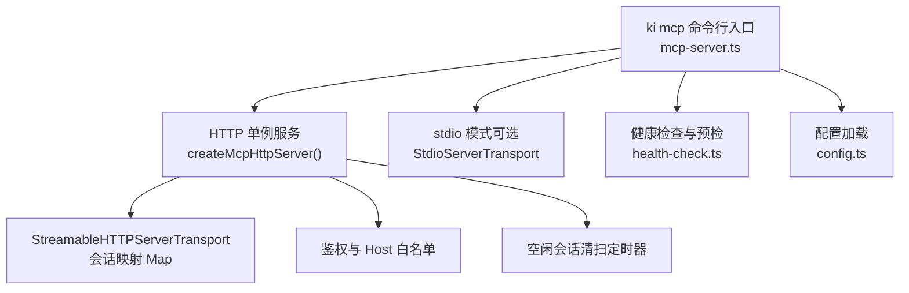
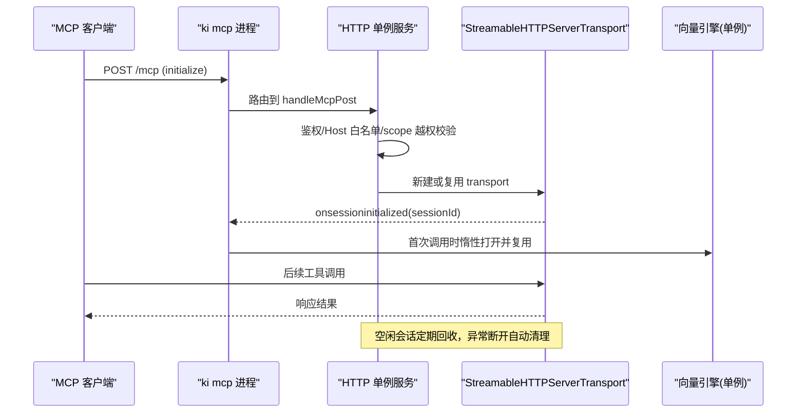
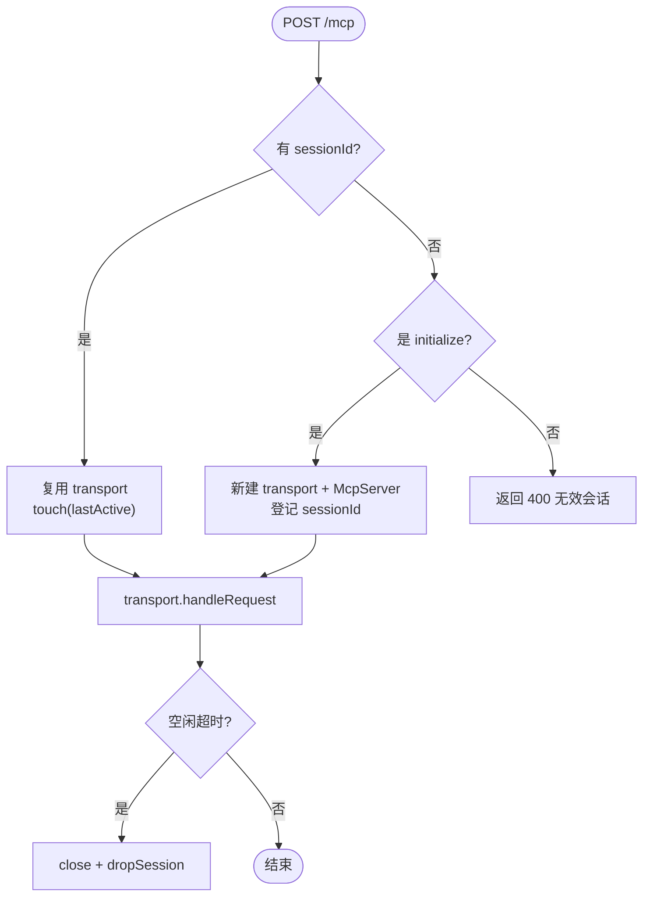
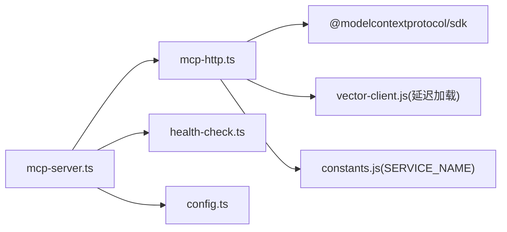

# 连接管理

<cite>
**本文引用的文件**
- [src/lib/mcp-http.ts](file://src/lib/mcp-http.ts)
- [src/mcp-server.ts](file://src/mcp-server.ts)
- [src/lib/config.ts](file://src/lib/config.ts)
- [src/lib/health-check.ts](file://src/lib/health-check.ts)
- [docs/mcp-http.md](file://docs/mcp-http.md)
- [docs/cli.md](file://docs/cli.md)
</cite>

## 目录
1. [简介](#简介)
2. [项目结构](#项目结构)
3. [核心组件](#核心组件)
4. [架构总览](#架构总览)
5. [详细组件分析](#详细组件分析)
6. [依赖关系分析](#依赖关系分析)
7. [性能与容量规划](#性能与容量规划)
8. [故障排查指南](#故障排查指南)
9. [结论](#结论)
10. [附录](#附录)

## 简介
本指南聚焦 MCP 客户端的连接生命周期管理，覆盖连接建立、维护、重连与断开处理；记录连接池配置、负载均衡与高可用策略；说明多实例连接管理、会话隔离与资源清理机制；包含连接超时、重试策略与故障转移方案；提供连接监控、性能调优与容量规划指导；并给出代理服务器、SSL/TLS 加密与网络优化建议，以及生产部署与运维监控方案。

## 项目结构
MCP 连接相关能力主要分布在以下模块：
- HTTP 传输与会话管理：mcp-http.ts
- 进程入口与模式切换（stdio/HTTP）、守护与重启：mcp-server.ts
- 配置加载与默认值：config.ts
- 启动预检与健康检查：health-check.ts
- 用户文档：mcp-http.md、cli.md

图表来源
- [src/mcp-server.ts:492-734](file://src/mcp-server.ts#L492-L734)
- [src/lib/mcp-http.ts:363-642](file://src/lib/mcp-http.ts#L363-L642)
- [src/lib/health-check.ts:150-240](file://src/lib/health-check.ts#L150-L240)
- [src/lib/config.ts:156-183](file://src/lib/config.ts#L156-L183)

章节来源
- [src/mcp-server.ts:492-734](file://src/mcp-server.ts#L492-L734)
- [src/lib/mcp-http.ts:363-642](file://src/lib/mcp-http.ts#L363-L642)
- [src/lib/health-check.ts:150-240](file://src/lib/health-check.ts#L150-L240)
- [src/lib/config.ts:156-183](file://src/lib/config.ts#L156-L183)

## 核心组件
- HTTP 单例服务：以 StreamableHTTPServerTransport 承载 MCP 协议，按会话创建 McpServer，共享模块级向量引擎单例。
- 会话管理：Map<sessionId, transport> + lastActive 时间戳，定时回收空闲会话，防止内存泄漏。
- 鉴权与访问控制：回环绑定免鉴权，非回环强制 Bearer Token；支持 DNS rebinding 保护（allowedHosts）。
- 健康检查：/healthz 暴露 pid、版本、host/port、鉴权失败计数等；启动前执行 health check 校验 embedding 连通性、密钥与维度匹配。
- 守护与重启：幂等复用已有健康实例；支持后台常驻（daemon）与一键重启（restart），优雅关闭释放锁与连接。

章节来源
- [src/lib/mcp-http.ts:363-642](file://src/lib/mcp-http.ts#L363-L642)
- [src/lib/mcp-http.ts:711-800](file://src/lib/mcp-http.ts#L711-L800)
- [src/mcp-server.ts:595-734](file://src/mcp-server.ts#L595-L734)
- [src/lib/health-check.ts:150-240](file://src/lib/health-check.ts#L150-L240)

## 架构总览
MCP 客户端通过 HTTP 或 stdio 两种传输接入。HTTP 模式下为单进程单例，所有 IDE 共享同一持锁进程，避免向量库锁冲突；stdio 模式适合单机单 IDE。

图表来源
- [src/lib/mcp-http.ts:431-612](file://src/lib/mcp-http.ts#L431-L612)
- [src/mcp-server.ts:687-734](file://src/mcp-server.ts#L687-L734)

## 详细组件分析

### 连接生命周期管理
- 连接建立
  - 客户端 POST /mcp 携带 initialize 请求，服务端根据是否携带 sessionId 决定新建或复用 transport。
  - 新会话创建 McpServer 并 connect transport，登记 sessionId 与 lastActive。
- 连接维护
  - 每次请求更新 lastActive；定时器周期性扫描，超过空闲阈值则 close 并 dropSession。
  - 支持 GET/DELETE 会话操作，DELETE 显式关闭会话。
- 重连与恢复
  - 客户端异常断开未发 DELETE 的残留会话由空闲回收机制清理，不会无限堆积。
  - 若需重连，客户端重新 initialize 即可获取新的 sessionId。
- 断开处理
  - 会话关闭回调 dropSession；进程退出时 closeAllSessions 关闭所有 transport，并关闭 http server，释放向量引擎锁。

图表来源
- [src/lib/mcp-http.ts:523-612](file://src/lib/mcp-http.ts#L523-L612)
- [src/lib/mcp-http.ts:628-642](file://src/lib/mcp-http.ts#L628-L642)

章节来源
- [src/lib/mcp-http.ts:523-612](file://src/lib/mcp-http.ts#L523-L612)
- [src/lib/mcp-http.ts:628-642](file://src/lib/mcp-http.ts#L628-L642)

### 连接池与会话隔离
- 连接池
  - 使用 Map<sessionId, transport> 作为轻量连接池，限制最大并发会话数（默认 256），超限返回 503。
- 会话隔离
  - 每个会话独立 transport 与 McpServer，但共享模块级向量引擎单例；scope 越权校验在入口处统一拦截，避免跨会话泄露权限。
- 资源清理
  - 空闲回收定时器（60s 周期）清理超时会话；进程退出时关闭所有会话与连接，释放向量锁。

章节来源
- [src/lib/mcp-http.ts:47-57](file://src/lib/mcp-http.ts#L47-L57)
- [src/lib/mcp-http.ts:571-582](file://src/lib/mcp-http.ts#L571-L582)
- [src/lib/mcp-http.ts:400-411](file://src/lib/mcp-http.ts#L400-L411)

### 负载均衡与高可用
- 负载均衡
  - 当前实现为单进程单例，无内置多后端负载均衡；可通过反向代理（如 Nginx）对多个 ki mcp HTTP 实例进行负载均衡。
- 高可用
  - 幂等启动：若目标 host:port 已有健康实例，直接复用退出，避免重复监听端口。
  - 健康检查：/healthz 暴露服务状态，供外部探针探测存活与指标。
  - 守护与重启：支持 --daemon 后台常驻与 restart 一键重启，保障服务可用性。

章节来源
- [src/lib/mcp-http.ts:711-723](file://src/lib/mcp-http.ts#L711-L723)
- [docs/mcp-http.md:191-214](file://docs/mcp-http.md#L191-L214)
- [docs/cli.md:952-960](file://docs/cli.md#L952-L960)

### 多实例连接管理与冲突处理
- stdio 多实例
  - 允许多个 stdio 实例共存，通过向量库空闲释放锁与撞锁重试错开共享；启动时提示其他存活实例 pid。
- HTTP 单例
  - 启动前检测是否存在健康 HTTP 实例，命中则复用退出；若存在 stdio 实例会拒绝启动 HTTP，引导迁移 URL 接入。
- 停止与清理
  - ki mcp stop 定位真实服务进程（lock + healthz 兜底），发送 SIGTERM 优雅退出，超时 SIGKILL 兜底，清理残留 lock。

章节来源
- [src/mcp-server.ts:609-658](file://src/mcp-server.ts#L609-L658)
- [docs/mcp-http.md:178-190](file://docs/mcp-http.md#L178-L190)
- [docs/cli.md:952-960](file://docs/cli.md#L952-L960)

### 连接超时、重试与故障转移
- 连接超时
  - /healthz 探活默认超时 1500ms；embedding 健康检查超时 8000ms 且重试 1 次，容忍瞬时抖动。
- 重试策略
  - 健康检查对 embedding 请求设置 retries=1；其他连接层未内置指数退避，建议在客户端或代理层实现。
- 故障转移
  - 单实例场景下故障转移由上层代理负责；多实例场景可结合服务发现与负载均衡实现自动切换。

章节来源
- [src/lib/mcp-http.ts:214-249](file://src/lib/mcp-http.ts#L214-L249)
- [src/lib/health-check.ts:92-144](file://src/lib/health-check.ts#L92-L144)

### 代理服务器、SSL/TLS 与网络优化
- 代理服务器
  - 可在前端部署 Nginx/HAProxy 等反向代理，将 /mcp 与 /api 转发至 ki mcp HTTP 服务；启用 keepalive 提升吞吐。
- SSL/TLS 加密
  - 建议在代理层终止 TLS，后端使用内网明文通信；如需端到端加密，可在 Node HTTP 层配置 TLS 证书。
- 网络优化
  - 合理设置代理层超时与缓冲；启用 gzip/brotli 压缩；对静态页面启用缓存；限制请求体大小（已内置 16MB 上限）。

章节来源
- [src/lib/mcp-http.ts:166-192](file://src/lib/mcp-http.ts#L166-L192)
- [src/lib/mcp-http.ts:276-317](file://src/lib/mcp-http.ts#L276-L317)

### 生产环境部署与运维监控
- 部署建议
  - 使用 --http --daemon 后台常驻；通过 systemd 或容器编排管理进程生命周期；配置 --token 与非回环地址开启鉴权。
  - 使用 --allowed-hosts 限制 Host 头，防范 DNS rebinding。
- 运维监控
  - 定期 curl /healthz 获取 ok/name/pid/version/host/port/authFailures；结合日志与指标平台采集鉴权失败次数。
  - 使用 ki mcp --status 查看实例全貌（HTTP lock、stdio 实例、托管 Token 数量）。

章节来源
- [src/lib/mcp-http.ts:438-447](file://src/lib/mcp-http.ts#L438-L447)
- [src/lib/mcp-http.ts:667-705](file://src/lib/mcp-http.ts#L667-L705)
- [docs/mcp-http.md:191-214](file://docs/mcp-http.md#L191-L214)

## 依赖关系分析

图表来源
- [src/mcp-server.ts:1-35](file://src/mcp-server.ts#L1-L35)
- [src/lib/mcp-http.ts:17-28](file://src/lib/mcp-http.ts#L17-L28)

章节来源
- [src/mcp-server.ts:1-35](file://src/mcp-server.ts#L1-L35)
- [src/lib/mcp-http.ts:17-28](file://src/lib/mcp-http.ts#L17-L28)

## 性能与容量规划
- 会话上限
  - 默认最大并发会话 256，可根据业务峰值调整 maxSessions；超限返回 503，客户端应重试或降级。
- 空闲回收
  - 默认空闲超时 30 分钟，清扫间隔 60 秒；可根据客户端活跃度调整 sessionIdleMs 与 SESSION_SWEEP_INTERVAL_MS。
- 鉴权失败限流
  - 鉴权失败日志限流 5 秒一次，避免重试风暴刷屏；/healthz 暴露 authFailures 便于观测。
- 向量引擎
  - 单进程单例 engine，惰性打开并跨请求复用；空闲后自动释放锁，允许多实例错开共享。

章节来源
- [src/lib/mcp-http.ts:47-57](file://src/lib/mcp-http.ts#L47-L57)
- [src/lib/mcp-http.ts:377-391](file://src/lib/mcp-http.ts#L377-L391)
- [src/mcp-server.ts:683-685](file://src/mcp-server.ts#L683-L685)

## 故障排查指南
- 鉴权失败
  - 现象：客户端收到 401 与 WWW-Authenticate: Bearer；服务端 stderr 输出鉴权失败原因与次数。
  - 排查：核对 Authorization: Bearer 与 ki mcp token list 输出一致；检查 allowedHosts 白名单。
- 会话堆积
  - 现象：内存增长或 503 Too many sessions。
  - 排查：检查客户端是否正确发送 DELETE；调整 maxSessions 与 sessionIdleMs；观察空闲回收日志。
- 端口占用
  - 现象：EADDRINUSE 错误。
  - 排查：使用 /healthz 探活确认是否有健康实例；更换端口或清理残留实例。
- 启动预检失败
  - 现象：embedding 连通性/密钥/维度不匹配。
  - 排查：检查 baseURL、apiKey、dimension；参考 health check 报告逐项修复。

章节来源
- [src/lib/mcp-http.ts:476-509](file://src/lib/mcp-http.ts#L476-L509)
- [src/lib/mcp-http.ts:644-665](file://src/lib/mcp-http.ts#L644-L665)
- [src/lib/health-check.ts:54-144](file://src/lib/health-check.ts#L54-L144)

## 结论
本实现通过 HTTP 单例模式与严格的会话治理，解决了多 IDE 锁冲突问题，并提供健壮的鉴权、健康检查与守护能力。配合反向代理与监控，可满足生产环境的稳定性与可观测性需求。建议在生产中启用鉴权与 Host 白名单，合理配置会话上限与空闲回收策略，并通过 /healthz 与日志持续观测运行状态。

## 附录
- CLI 命令参考
  - ki mcp --http：启动 HTTP 单例（默认回环免鉴权）
  - ki mcp --http --daemon：后台常驻
  - ki mcp restart：一键重启 HTTP 单例
  - ki mcp stop：关闭本机所有实例并清理 lock
  - ki mcp --status：查看实例全貌

章节来源
- [docs/cli.md:909-960](file://docs/cli.md#L909-L960)
- [docs/mcp-http.md:191-214](file://docs/mcp-http.md#L191-L214)