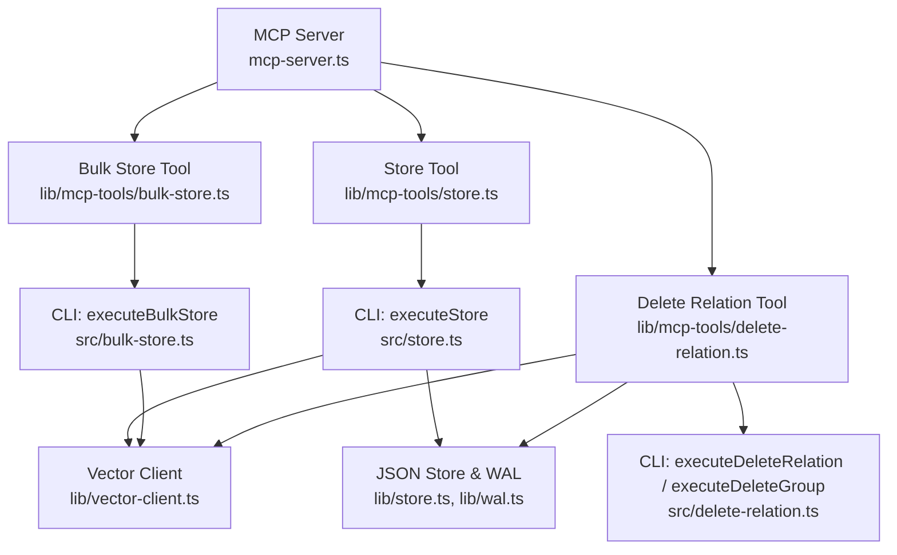
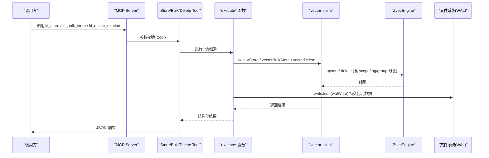
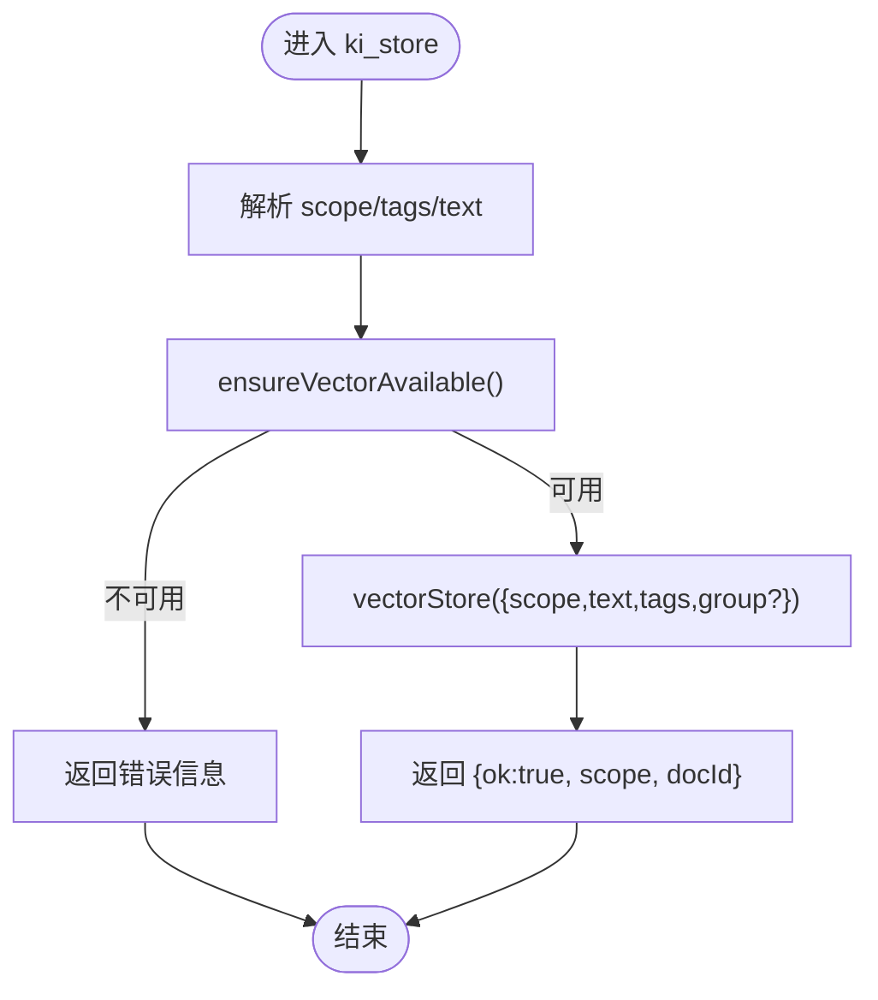
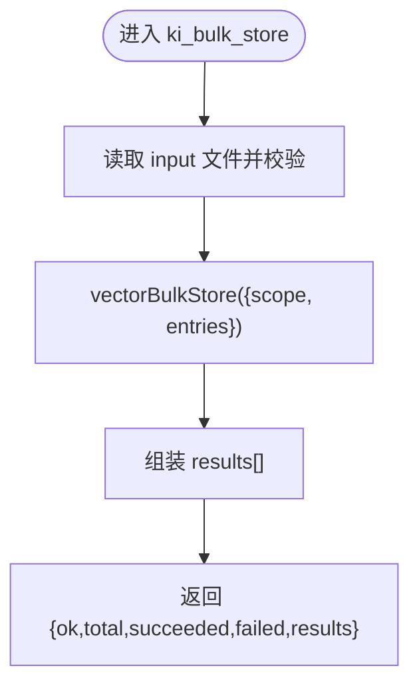
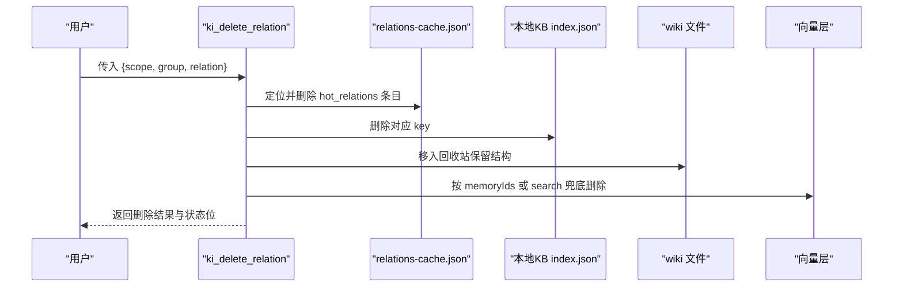
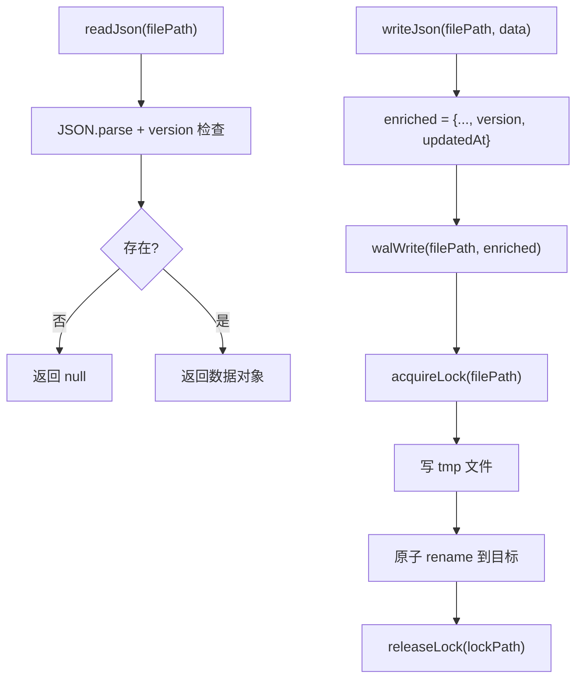
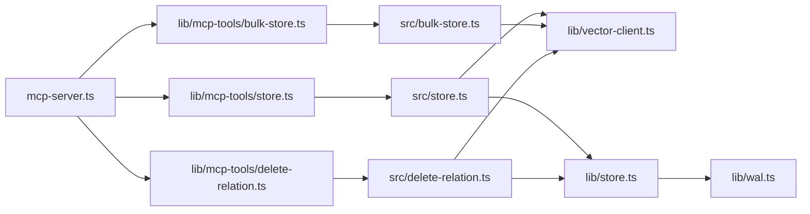

# 存储类工具

<cite>
**本文引用的文件**
- [src/store.ts](file://src/store.ts)
- [src/bulk-store.ts](file://src/bulk-store.ts)
- [src/delete-relation.ts](file://src/delete-relation.ts)
- [src/mcp-server.ts](file://src/mcp-server.ts)
- [src/lib/mcp-tools/store.ts](file://src/lib/mcp-tools/store.ts)
- [src/lib/mcp-tools/bulk-store.ts](file://src/lib/mcp-tools/bulk-store.ts)
- [src/lib/mcp-tools/delete-relation.ts](file://src/lib/mcp-tools/delete-relation.ts)
- [src/lib/vector-client.ts](file://src/lib/vector-client.ts)
- [src/lib/store.ts](file://src/lib/store.ts)
- [src/lib/wal.ts](file://src/lib/wal.ts)
</cite>

## 目录
1. [简介](#简介)
2. [项目结构](#项目结构)
3. [核心组件](#核心组件)
4. [架构总览](#架构总览)
5. [详细组件分析](#详细组件分析)
6. [依赖关系分析](#依赖关系分析)
7. [性能与一致性](#性能与一致性)
8. [故障恢复与排障](#故障恢复与排障)
9. [结论](#结论)
10. [附录：API 参考与示例](#附录api-参考与示例)

## 简介
本文件为“存储类 MCP 工具”的详细 API 文档，覆盖以下能力：
- store 工具：文档存储、更新（幂等 upsert）、删除（通过向量层按 id 删除）
- bulk-store 工具：批量存储
- delete-relation 工具：删除 Relation 及其关联数据（缓存、本地 KB、wiki、向量），支持级联删除 group
- 元数据管理：scope/tag/group 字段作为标量索引；版本与时间戳由 WAL 写入自动维护
- 版本控制机制：JSON 文件 version/updatedAt 字段；向量 docId 基于内容+scope+tag 的哈希，天然幂等
- 事务与并发：WAL 原子写入 + 写锁；向量引擎进程内单例 + 撞锁重试 + 空闲释放锁
- 完整 CRUD 示例、大文档处理、批量删除、数据完整性校验、性能优化建议与故障恢复机制

## 项目结构
存储相关代码主要分布在：
- CLI 入口与业务逻辑：store.ts、bulk-store.ts、delete-relation.ts
- MCP 工具注册：lib/mcp-tools/*
- 向量客户端与底层引擎封装：lib/vector-client.ts
- JSON 持久化与 WAL：lib/store.ts、lib/wal.ts
- MCP 服务启动与工具装配：mcp-server.ts



**图表来源**
- [src/mcp-server.ts:54-70](file://src/mcp-server.ts#L54-L70)
- [src/lib/mcp-tools/store.ts:6-43](file://src/lib/mcp-tools/store.ts#L6-L43)
- [src/lib/mcp-tools/bulk-store.ts:6-41](file://src/lib/mcp-tools/bulk-store.ts#L6-L41)
- [src/lib/mcp-tools/delete-relation.ts:6-37](file://src/lib/mcp-tools/delete-relation.ts#L6-L37)
- [src/store.ts:23-51](file://src/store.ts#L23-L51)
- [src/bulk-store.ts:32-78](file://src/bulk-store.ts#L32-L78)
- [src/delete-relation.ts:83-176](file://src/delete-relation.ts#L83-L176)
- [src/lib/vector-client.ts:540-635](file://src/lib/vector-client.ts#L540-L635)
- [src/lib/store.ts:23-62](file://src/lib/store.ts#L23-L62)
- [src/lib/wal.ts:92-112](file://src/lib/wal.ts#L92-L112)

**章节来源**
- [src/mcp-server.ts:54-70](file://src/mcp-server.ts#L54-L70)

## 核心组件
- 存储工具（ki_store）：将文本以向量形式存入，返回 docId；支持 scope、tags、group 元数据
- 批量存储工具（ki_bulk_store）：从 JSON 文件批量写入，返回每项成功/失败详情
- 删除关系工具（ki_delete_relation）：删除指定 relation 的缓存、KB、wiki、向量；支持 group 级联删除
- 向量客户端（vector-client）：封装 ZvecEngine，提供 upsert/search/delete/list/count 等接口
- JSON 存储与 WAL：readJson/writeJson 带 version/updatedAt；walWrite 原子写入并加跨进程写锁

**章节来源**
- [src/lib/mcp-tools/store.ts:6-43](file://src/lib/mcp-tools/store.ts#L6-L43)
- [src/lib/mcp-tools/bulk-store.ts:6-41](file://src/lib/mcp-tools/bulk-store.ts#L6-L41)
- [src/lib/mcp-tools/delete-relation.ts:6-37](file://src/lib/mcp-tools/delete-relation.ts#L6-L37)
- [src/lib/vector-client.ts:540-635](file://src/lib/vector-client.ts#L540-L635)
- [src/lib/store.ts:23-62](file://src/lib/store.ts#L23-L62)
- [src/lib/wal.ts:92-112](file://src/lib/wal.ts#L92-L112)

## 架构总览
存储类工具在 MCP 层暴露三个工具：ki_store、ki_bulk_store、ki_delete_relation。它们分别调用对应 CLI 执行函数，最终通过 vector-client 与 ZvecEngine 交互完成向量化存储、检索与删除；同时使用 WAL 保证 JSON 元数据的原子性与一致性。



**图表来源**
- [src/mcp-server.ts:54-70](file://src/mcp-server.ts#L54-L70)
- [src/lib/mcp-tools/store.ts:6-43](file://src/lib/mcp-tools/store.ts#L6-L43)
- [src/lib/mcp-tools/bulk-store.ts:6-41](file://src/lib/mcp-tools/bulk-store.ts#L6-L41)
- [src/lib/mcp-tools/delete-relation.ts:6-37](file://src/lib/mcp-tools/delete-relation.ts#L6-L37)
- [src/store.ts:23-51](file://src/store.ts#L23-L51)
- [src/bulk-store.ts:32-78](file://src/bulk-store.ts#L32-L78)
- [src/delete-relation.ts:83-176](file://src/delete-relation.ts#L83-L176)
- [src/lib/vector-client.ts:540-635](file://src/lib/vector-client.ts#L540-L635)
- [src/lib/store.ts:23-62](file://src/lib/store.ts#L23-L62)
- [src/lib/wal.ts:92-112](file://src/lib/wal.ts#L92-L112)

## 详细组件分析

### 存储工具（ki_store）
- 功能：将文本存储到向量索引，返回 docId；支持 scope、tags、group 元数据
- 输入参数：
  - scope：可选，默认 default；strict 模式必须显式且已注册
  - text：待存储文本（最大长度限制见向量客户端）
  - tags：可选，逗号分隔，默认 ki-search
- 输出：
  - ok: true/false
  - 成功时包含 scope、docId
  - 失败时包含 error
- 行为：
  - 解析 scope、校验可用向量服务
  - 调用 vectorStore 进行幂等 upsert（同 text+scope+tag → 同 docId）
  - 返回 docId



**图表来源**
- [src/lib/mcp-tools/store.ts:6-43](file://src/lib/mcp-tools/store.ts#L6-L43)
- [src/store.ts:23-51](file://src/store.ts#L23-L51)
- [src/lib/vector-client.ts:540-569](file://src/lib/vector-client.ts#L540-L569)

**章节来源**
- [src/lib/mcp-tools/store.ts:6-43](file://src/lib/mcp-tools/store.ts#L6-L43)
- [src/store.ts:23-51](file://src/store.ts#L23-L51)
- [src/lib/vector-client.ts:540-569](file://src/lib/vector-client.ts#L540-L569)

### 批量存储工具（ki_bulk_store）
- 功能：从 JSON 文件批量存储文本到向量索引，返回每项结果
- 输入参数：
  - scope：可选，默认 default；strict 模式必须显式且已注册
  - input：批量数据 JSON 文件路径，格式为数组项 {text, tags?}
- 输出：
  - ok: true/false
  - total/succeeded/failed/results[]（每项 index、memoryId?、success、error?）
- 行为：
  - 读取并校验输入文件
  - 调用 vectorBulkStore 批量 upsert
  - 组装逐项结果返回



**图表来源**
- [src/lib/mcp-tools/bulk-store.ts:6-41](file://src/lib/mcp-tools/bulk-store.ts#L6-L41)
- [src/bulk-store.ts:32-78](file://src/bulk-store.ts#L32-L78)
- [src/lib/vector-client.ts:574-617](file://src/lib/vector-client.ts#L574-L617)

**章节来源**
- [src/lib/mcp-tools/bulk-store.ts:6-41](file://src/lib/mcp-tools/bulk-store.ts#L6-L41)
- [src/bulk-store.ts:32-78](file://src/bulk-store.ts#L32-L78)
- [src/lib/vector-client.ts:574-617](file://src/lib/vector-client.ts#L574-L617)

### 删除关系工具（ki_delete_relation）
- 功能：删除指定 relation 的缓存、本地 KB、wiki 文件、向量记忆；支持 group 级联删除
- 输入参数：
  - scope：可选，默认 default；strict 模式必须显式且已注册
  - group：Group 路径（支持模糊匹配）
  - relation：Relation 名称（精确匹配）
- 输出：
  - 单条删除：{ok, scope, result: DeleteResult}
  - 批量删除：{ok, scope, results[], total, failed}
  - Group 级联删除：{ok, scope, result: DeleteGroupResult}
- 行为：
  - 解析 group 路径
  - 从 relations-cache.json 删除条目
  - 从本地 KB index.json 删除 key
  - 将 wiki .md 移入回收站（保留原结构）
  - 向量删除优先按 memoryIds，无则 search 严格匹配兜底删除
  - 持久化 cache 与 group-index



**图表来源**
- [src/lib/mcp-tools/delete-relation.ts:6-37](file://src/lib/mcp-tools/delete-relation.ts#L6-L37)
- [src/delete-relation.ts:83-176](file://src/delete-relation.ts#L83-L176)
- [src/delete-relation.ts:207-310](file://src/delete-relation.ts#L207-L310)
- [src/delete-relation.ts:383-473](file://src/delete-relation.ts#L383-L473)
- [src/delete-relation.ts:487-549](file://src/delete-relation.ts#L487-L549)
- [src/lib/vector-client.ts:624-635](file://src/lib/vector-client.ts#L624-L635)

**章节来源**
- [src/lib/mcp-tools/delete-relation.ts:6-37](file://src/lib/mcp-tools/delete-relation.ts#L6-L37)
- [src/delete-relation.ts:83-176](file://src/delete-relation.ts#L83-L176)
- [src/delete-relation.ts:207-310](file://src/delete-relation.ts#L207-L310)
- [src/delete-relation.ts:383-473](file://src/delete-relation.ts#L383-L473)
- [src/delete-relation.ts:487-549](file://src/delete-relation.ts#L487-L549)
- [src/lib/vector-client.ts:624-635](file://src/lib/vector-client.ts#L624-L635)

### 向量客户端（vector-client）
- 存储：
  - vectorStore：单条 upsert，返回 docId
  - vectorBulkStore：批量 upsert，返回每项结果
- 删除：
  - vectorDelete：按 ids 删除，返回 deleted/errors
- 检索与管理：
  - vectorSearch：语义+FTS+RRF 混合检索，支持 scope/tag 过滤
  - vectorListDocs/vectorFetchDocs：列出/取回文档
  - vectorListScopes/vectorListTags/vectorCountScope：枚举 scope/tag/计数
  - vectorDeleteScope：按 scope/tag 批量删除
- 可用性检测：
  - ensureVectorAvailable：检测向量服务是否可用，区分 LOCKED/CORRUPTED/PROBE_ERROR
- 并发与一致性：
  - 进程内 engine 单例，串行化 open/create/close
  - 撞锁重试（probeWithRetry）
  - 空闲释放锁（enableIdleClose）避免多实例争抢
  - docId = sha256(text+scope+tag) 截 32，幂等 upsert

```mermaid
classDiagram
class VectorClient {
+vectorStore(params) Promise~VectorStoreResult~
+vectorBulkStore(params) Promise~VectorBulkStoreResult~
+vectorDelete(params) Promise~{deleted, errors}~
+vectorSearch(params) Promise~VectorSearchResult[]~
+ensureVectorAvailable(scope?, opts?) Promise~VectorAvailableResult~
+enableIdleClose(idleMs) void
+closeEngine() Promise~void~
}
class ZvecEngine {
+upsert(docs)
+delete(ids)
+hybridSearch(queryText, fts, topk, filter)
+listIds(filter, limit)
+fetch(ids, includeFields)
}
VectorClient --> ZvecEngine : "封装调用"
```

**图表来源**
- [src/lib/vector-client.ts:540-635](file://src/lib/vector-client.ts#L540-L635)
- [src/lib/vector-client.ts:496-533](file://src/lib/vector-client.ts#L496-L533)
- [src/lib/vector-client.ts:440-494](file://src/lib/vector-client.ts#L440-L494)
- [src/lib/vector-client.ts:184-201](file://src/lib/vector-client.ts#L184-L201)
- [src/lib/vector-client.ts:334-382](file://src/lib/vector-client.ts#L334-L382)

**章节来源**
- [src/lib/vector-client.ts:540-635](file://src/lib/vector-client.ts#L540-L635)
- [src/lib/vector-client.ts:496-533](file://src/lib/vector-client.ts#L496-L533)
- [src/lib/vector-client.ts:440-494](file://src/lib/vector-client.ts#L440-L494)
- [src/lib/vector-client.ts:184-201](file://src/lib/vector-client.ts#L184-L201)
- [src/lib/vector-client.ts:334-382](file://src/lib/vector-client.ts#L334-L382)

### JSON 存储与 WAL
- readJson：读取 JSON 并检查 version 兼容性
- writeJson：写入前添加 version/updatedAt，并通过 walWrite 原子落盘
- walWrite：获取跨进程写锁 → 写 .tmp → 原子 rename → 释放锁
- 清理：cleanupTmpFiles 清理残留 .tmp 与陈旧 .lock



**图表来源**
- [src/lib/store.ts:23-62](file://src/lib/store.ts#L23-L62)
- [src/lib/wal.ts:92-112](file://src/lib/wal.ts#L92-L112)
- [src/lib/wal.ts:121-142](file://src/lib/wal.ts#L121-L142)

**章节来源**
- [src/lib/store.ts:23-62](file://src/lib/store.ts#L23-L62)
- [src/lib/wal.ts:92-112](file://src/lib/wal.ts#L92-L112)
- [src/lib/wal.ts:121-142](file://src/lib/wal.ts#L121-L142)

## 依赖关系分析
- MCP 工具注册依赖 mcp-server.ts 统一装配
- store/bulk-store 工具依赖各自 CLI 执行函数
- delete-relation 工具依赖缓存、KB、wiki、向量层的多处操作
- 所有向量操作依赖 vector-client，后者封装 ZvecEngine
- JSON 元数据读写依赖 lib/store.ts 与 WAL 机制



**图表来源**
- [src/mcp-server.ts:54-70](file://src/mcp-server.ts#L54-L70)
- [src/lib/mcp-tools/store.ts:6-43](file://src/lib/mcp-tools/store.ts#L6-L43)
- [src/lib/mcp-tools/bulk-store.ts:6-41](file://src/lib/mcp-tools/bulk-store.ts#L6-L41)
- [src/lib/mcp-tools/delete-relation.ts:6-37](file://src/lib/mcp-tools/delete-relation.ts#L6-L37)
- [src/store.ts:23-51](file://src/store.ts#L23-L51)
- [src/bulk-store.ts:32-78](file://src/bulk-store.ts#L32-L78)
- [src/delete-relation.ts:83-176](file://src/delete-relation.ts#L83-L176)
- [src/lib/vector-client.ts:540-635](file://src/lib/vector-client.ts#L540-L635)
- [src/lib/store.ts:23-62](file://src/lib/store.ts#L23-L62)
- [src/lib/wal.ts:92-112](file://src/lib/wal.ts#L92-L112)

**章节来源**
- [src/mcp-server.ts:54-70](file://src/mcp-server.ts#L54-L70)

## 性能与一致性
- 向量层性能
  - 单条 upsert：适合小批量或实时写入
  - 批量 upsert：推荐大批量导入，减少网络与嵌入开销
  - 检索：hybridSearch（语义+FTS+RRF），支持 tag/scope 过滤
  - 删除：按 ids 批量删除，search 兜底确保一致性
- 并发控制
  - 向量引擎进程内单例，open/create/close 串行化，避免原生竞态
  - 撞锁重试：检测到 locked 等待并重试，最多固定次数
  - 空闲释放锁：常驻 MCP 空闲超时后自动 closeEngine，让其他实例错开共享
- 元数据一致性
  - WAL 原子写入：写 .tmp → rename → 释放锁，防止中断导致损坏
  - 版本与时间戳：writeJson 自动注入 version/updatedAt
  - 旧数据迁移：readGroupIndex 自动迁移 roots→groups，relations-cache 旧 key 重命名/合并
- 大文档处理
  - 文本长度限制：MAX_TEXT_LENGTH 保护（具体阈值见向量客户端常量）
  - 建议：对超大文档分块存储，配合 tags/group 组织
- 事务处理
  - 向量层 upsert/delete 为原子操作；JSON 元数据通过 WAL 保证原子性
  - 多步骤删除（cache/KB/wiki/vector）采用逐步执行与结果聚合，失败不阻断后续清理

[本节为通用性能讨论，不直接分析具体文件]

## 故障恢复与排障
- 向量库被占用
  - 现象：ensureVectorAvailable 返回 code=LOCKED
  - 处置：停止占用进程或等待空闲释放锁；必要时重建向量
- 向量库损坏
  - 现象：ensureVectorAvailable 返回 code=CORRUPTED
  - 处置：执行重建命令恢复向量库
- JSON 文件损坏
  - 现象：readJson 抛出 CORRUPT_JSON
  - 处置：从备份恢复或从模板重新初始化 scope
- 中断残留
  - 现象：.tmp/.lock 残留
  - 处置：cleanupTmpFiles 清理残留临时文件与陈旧锁
- 删除不一致
  - 现象：cache/KB/wiki 已删但向量残留
  - 处置：delete-relation 的 search 兜底删除；group 级联删除会标记 vectorRemoved=false 提示需重建或后续重删

**章节来源**
- [src/lib/vector-client.ts:440-494](file://src/lib/vector-client.ts#L440-L494)
- [src/lib/store.ts:23-49](file://src/lib/store.ts#L23-L49)
- [src/lib/wal.ts:121-142](file://src/lib/wal.ts#L121-L142)
- [src/delete-relation.ts:207-310](file://src/delete-relation.ts#L207-L310)

## 结论
存储类 MCP 工具提供了完整的文档存储、批量存储与关系删除能力，结合 WAL 与向量引擎的并发控制，保证了元数据与向量数据的一致性。通过幂等 docId、版本与时间戳、以及严格的删除流程，系统在大文档、批量操作与高并发场景下具备良好稳定性与可恢复性。

[本节为总结，不直接分析具体文件]

## 附录：API 参考与示例

### ki_store
- 描述：存储文本到向量索引
- 参数：
  - scope：可选，默认 default；strict 模式必填且须注册
  - text：字符串，待存储文本
  - tags：可选，逗号分隔，默认 ki-search
- 返回：
  - ok: boolean
  - 成功：scope, docId
  - 失败：error
- 示例（概念性）：
  - 输入：{scope:"default", text:"示例文档内容", tags:"ki-search"}
  - 输出：{ok:true, scope:"default", docId:"..."}

**章节来源**
- [src/lib/mcp-tools/store.ts:6-43](file://src/lib/mcp-tools/store.ts#L6-L43)
- [src/store.ts:23-51](file://src/store.ts#L23-L51)
- [src/lib/vector-client.ts:540-569](file://src/lib/vector-client.ts#L540-L569)

### ki_bulk_store
- 描述：批量存储文本到向量索引
- 参数：
  - scope：可选，默认 default；strict 模式必填且须注册
  - input：JSON 文件路径，内容为数组项 {text, tags?}
- 返回：
  - ok: boolean
  - total/succeeded/failed/results[]（每项 index、memoryId?、success、error?）
- 示例（概念性）：
  - 输入文件：[{text:"文档A", tags:"ki-search"}, {text:"文档B"}]
  - 输出：{ok:true, total:2, succeeded:2, failed:0, results:[...]}

**章节来源**
- [src/lib/mcp-tools/bulk-store.ts:6-41](file://src/lib/mcp-tools/bulk-store.ts#L6-L41)
- [src/bulk-store.ts:32-78](file://src/bulk-store.ts#L32-L78)
- [src/lib/vector-client.ts:574-617](file://src/lib/vector-client.ts#L574-L617)

### ki_delete_relation
- 描述：删除 Relation 及其关联数据（缓存、KB、wiki、向量）
- 参数：
  - scope：可选，默认 default；strict 模式必填且须注册
  - group：Group 路径（支持模糊匹配）
  - relation：Relation 名称（精确匹配）
- 返回：
  - 单条：{ok, scope, result: DeleteResult}
  - 批量：{ok, scope, results[], total, failed}
  - Group 级联：{ok, scope, result: DeleteGroupResult}
- 示例（概念性）：
  - 输入：{scope:"default", group:"wiki/docs", relation:"配置指南"}
  - 输出：{ok:true, scope:"default", result:{relation:"配置指南", group:"wiki/docs", deleted:true, ...}}

**章节来源**
- [src/lib/mcp-tools/delete-relation.ts:6-37](file://src/lib/mcp-tools/delete-relation.ts#L6-L37)
- [src/delete-relation.ts:83-176](file://src/delete-relation.ts#L83-L176)
- [src/delete-relation.ts:207-310](file://src/delete-relation.ts#L207-L310)
- [src/delete-relation.ts:383-473](file://src/delete-relation.ts#L383-L473)
- [src/delete-relation.ts:487-549](file://src/delete-relation.ts#L487-L549)

### 元数据与版本控制
- 元数据字段：
  - scope：项目隔离标识（STRING，索引）
  - tag：标签（STRING，索引，写入时转小写）
  - group：归属 Group 路径（STRING，索引）
- 版本控制：
  - JSON 文件：version（当前支持版本）、updatedAt（更新时间）
  - 向量 docId：sha256(text+scope+tag) 截 32，幂等 upsert
- 迁移：
  - group-index.json：roots→groups 自动迁移
  - relations-cache.json：旧 key 重命名/合并

**章节来源**
- [src/lib/vector-client.ts:260-262](file://src/lib/vector-client.ts#L260-L262)
- [src/lib/vector-client.ts:291-314](file://src/lib/vector-client.ts#L291-L314)
- [src/lib/store.ts:73-92](file://src/lib/store.ts#L73-L92)
- [src/lib/store.ts:101-159](file://src/lib/store.ts#L101-L159)

### 事务与并发控制
- 向量层：
  - 进程内单例 engine，open/create/close 串行化
  - 撞锁重试（probeWithRetry）
  - 空闲释放锁（enableIdleClose）
- JSON 层：
  - WAL 原子写入（.tmp → rename）
  - 跨进程写锁（.lock）
  - 清理残留（cleanupTmpFiles）

**章节来源**
- [src/lib/vector-client.ts:184-201](file://src/lib/vector-client.ts#L184-L201)
- [src/lib/vector-client.ts:334-382](file://src/lib/vector-client.ts#L334-L382)
- [src/lib/wal.ts:92-112](file://src/lib/wal.ts#L92-L112)
- [src/lib/wal.ts:121-142](file://src/lib/wal.ts#L121-L142)

### 完整 CRUD 示例（概念性）
- Create：
  - 使用 ki_store 存储单条文档，返回 docId
  - 使用 ki_bulk_store 批量导入，返回每项结果
- Read：
  - 使用 vectorSearch 检索，支持 scope/tag 过滤
  - 使用 vectorListDocs/vectorFetchDocs 列出/取回文档
- Update：
  - 再次调用 vectorStore/vectorBulkStore，相同 text+scope+tag 会幂等覆盖
- Delete：
  - 使用 vectorDelete 按 ids 删除
  - 使用 ki_delete_relation 删除 relation 的缓存/KB/wiki/向量
  - 使用 group 级联删除清理整个 group

[本节为概念性示例，不直接分析具体文件]