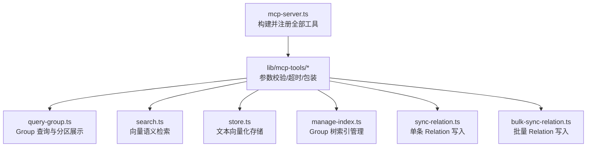
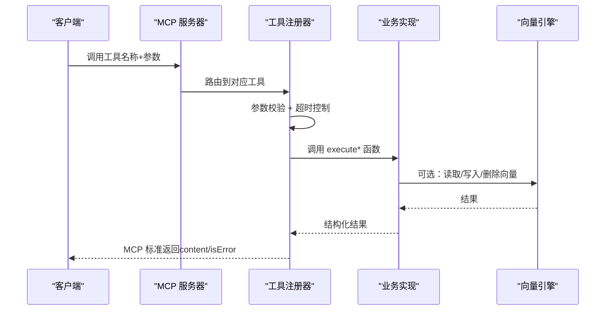
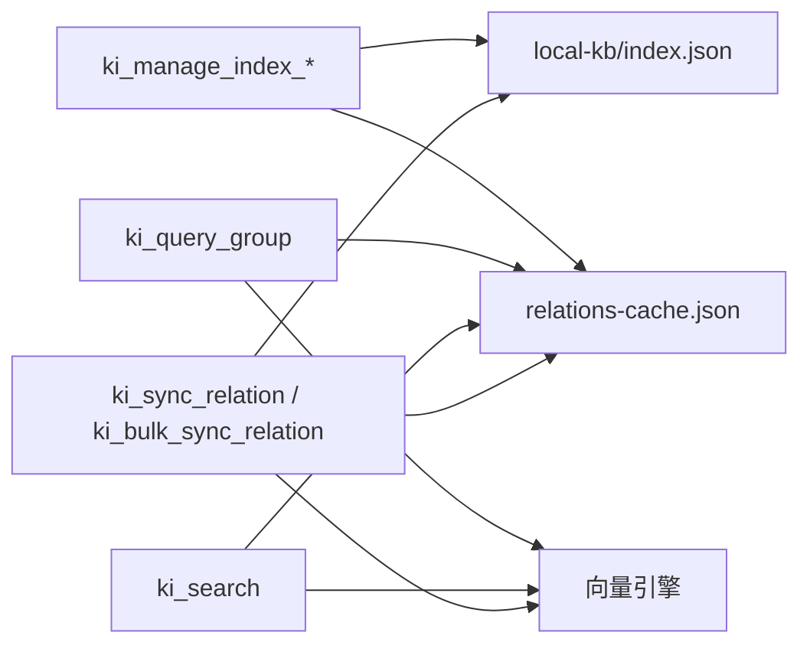

# 工具 API 参考

<cite>
**本文引用的文件**
- [src/mcp-server.ts](file://src/mcp-server.ts)
- [src/lib/mcp-tools/query-group.ts](file://src/lib/mcp-tools/query-group.ts)
- [src/query-group.ts](file://src/query-group.ts)
- [src/lib/mcp-tools/search.ts](file://src/lib/mcp-tools/search.ts)
- [src/search.ts](file://src/search.ts)
- [src/lib/mcp-tools/store.ts](file://src/lib/mcp-tools/store.ts)
- [src/store.ts](file://src/store.ts)
- [src/lib/mcp-tools/manage-index.ts](file://src/lib/mcp-tools/manage-index.ts)
- [src/manage-index.ts](file://src/manage-index.ts)
- [src/lib/mcp-tools/sync-relation.ts](file://src/lib/mcp-tools/sync-relation.ts)
- [src/sync-relation.ts](file://src/sync-relation.ts)
- [src/lib/mcp-tools/bulk-sync-relation.ts](file://src/lib/mcp-tools/bulk-sync-relation.ts)
</cite>

## 目录
1. [简介](#简介)
2. [项目结构](#项目结构)
3. [核心组件](#核心组件)
4. [架构总览](#架构总览)
5. [详细组件分析](#详细组件分析)
6. [依赖关系分析](#依赖关系分析)
7. [性能注意事项](#性能注意事项)
8. [故障排除指南](#故障排除指南)
9. [结论](#结论)
10. [附录：权限、限流与最佳实践](#附录：权限限流与最佳实践)

## 简介
本参考文档面向通过 MCP（Model Context Protocol）接入知识索引系统的开发者，完整记录暴露的 11 个 MCP 工具的接口规范与使用方式。覆盖的功能包括：Group 查询、语义检索、文本存储、索引管理、关系同步与批量同步等。每个工具均提供功能概述、参数定义、响应数据结构、错误码说明、调用示例与最佳实践，并给出工具间的依赖关系与组合使用模式，帮助快速集成与排障。

## 项目结构
MCP 服务由统一的入口构建并注册所有工具，各工具通过独立的注册器封装参数校验、超时控制与结果包装，底层能力由 src 下的业务模块实现（如 query-group、search、store、manage-index、sync-relation）。

**图表来源**
- [src/mcp-server.ts:54-70](file://src/mcp-server.ts#L54-L70)
- [src/lib/mcp-tools/query-group.ts:6-53](file://src/lib/mcp-tools/query-group.ts#L6-L53)
- [src/lib/mcp-tools/search.ts:6-49](file://src/lib/mcp-tools/search.ts#L6-L49)
- [src/lib/mcp-tools/store.ts:6-43](file://src/lib/mcp-tools/store.ts#L6-L43)
- [src/lib/mcp-tools/manage-index.ts:13-112](file://src/lib/mcp-tools/manage-index.ts#L13-L112)
- [src/lib/mcp-tools/sync-relation.ts:6-43](file://src/lib/mcp-tools/sync-relation.ts#L6-L43)
- [src/lib/mcp-tools/bulk-sync-relation.ts:6-42](file://src/lib/mcp-tools/bulk-sync-relation.ts#L6-L42)

**章节来源**
- [src/mcp-server.ts:54-70](file://src/mcp-server.ts#L54-L70)

## 核心组件
- 统一服务器构建：负责创建 McpServer 实例并集中注册所有工具，支持 HTTP 与 stdio 两种传输模式，并在 HTTP 模式下提供鉴权与守护进程能力。
- 工具注册层：每个工具一个注册函数，使用 Zod 进行参数校验，统一超时包装，将业务执行结果转换为 MCP 标准返回格式。
- 业务实现层：各工具对应的 execute* 函数位于 src 下，封装领域逻辑、数据持久化与向量引擎交互。

**章节来源**
- [src/mcp-server.ts:54-70](file://src/mcp-server.ts#L54-L70)
- [src/lib/mcp-tools/util.ts](file://src/lib/mcp-tools/util.ts)

## 架构总览
下图展示了从客户端到 MCP 工具再到业务实现的调用链路，以及工具之间的依赖关系。

**图表来源**
- [src/mcp-server.ts:54-70](file://src/mcp-server.ts#L54-L70)
- [src/lib/mcp-tools/search.ts:6-49](file://src/lib/mcp-tools/search.ts#L6-L49)
- [src/search.ts:70-199](file://src/search.ts#L70-L199)

## 详细组件分析

### 工具一：ki_query_group（Group 查询）
- 功能概述
  - 查询 Group 树与 Relations，支持按热区/常温/冷区/新兴热区/全量模式展示，必要时可回退到向量语义匹配以增强结果。
- 请求参数
  - scope: 字符串，可选，默认 default；strict 模式下必须传入且需在白名单内。
  - groups: 字符串，可选；逗号分隔的 Group 路径列表，支持模糊匹配。
  - group: 字符串，可选；groups 的单数别名（同时传时以 groups 为准）。
  - hot_count: 整数，可选，默认 5；热门展示个数。
  - depth: 整数，可选，范围 1-10，默认 4；索引层级深度。
  - mode: 字符串，可选，默认 hot；展示分区：hot|warm|cold|emerging|full（支持逗号分隔）。
  - auto_fallback: 布尔，可选，默认 true；是否启用语义兜底。
- 响应数据结构
  - 成功：content 为文本，包含格式化后的 Group 视图、Relations 列表与统计信息。
  - 失败：isError=true，content 为错误消息。
- 错误码说明
  - 参数非法：mode 不在允许集合、depth/hot_count 越界等。
  - 数据缺失：group-index.json 不存在。
  - 兜底失败：向量不可用或搜索无命中时静默降级。
- 调用示例
  - 查询指定 Group 的热区 Relations：
    - 工具名：ki_query_group
    - 参数：{ scope: "default", groups: "配置/API", mode: "hot", hot_count: 5 }
  - 全量模式展示索引树与统计：
    - 参数：{ scope: "default", mode: "full", depth: 6 }
- 最佳实践
  - 大库场景建议先用 hot/warm/cold 缩小范围，再按需切换 full。
  - 开启 auto_fallback 可在精确匹配失败时获得语义补充结果。

**章节来源**
- [src/lib/mcp-tools/query-group.ts:6-53](file://src/lib/mcp-tools/query-group.ts#L6-L53)
- [src/query-group.ts:598-746](file://src/query-group.ts#L598-L746)

### 工具二：ki_search（语义检索）
- 功能概述
  - 基于向量引擎对知识库内容进行语义检索，支持标签过滤、相似度阈值、原文召回与多 tag 去重。
- 请求参数
  - scope: 字符串，可选，默认 default。
  - query: 字符串，必填；自然语言查询文本。
  - limit: 整数，可选，默认 10；返回条数上限。
  - threshold: 数字，可选，范围 0-1；相似度阈值。
  - tags: 字符串，可选；过滤标签（不传则搜索全部；多个用逗号分隔，OR 组合）。
  - include_original: 布尔，可选，默认 false；是否返回 local KB 文件级原文。
- 响应数据结构
  - 成功：content 为 JSON 字符串，包含 results 数组，每项含 score、memoryId、group、relation、originalRetrieved、original、deduplicated 等字段。
  - 失败：isError=true，content 为错误详情（可能包含 degraded 标记）。
- 错误码说明
  - 向量服务不可用：返回 degraded=true 的错误提示。
  - 原文不可用：当无法定位本地 KB 时，降级返回向量内容并附带提示。
- 调用示例
  - 基础检索：{ query: "如何部署监控平台", limit: 10, threshold: 0.6 }
  - 带原文召回：{ query: "配置项解析", include_original: true }
- 最佳实践
  - 明确 tags 可提升召回精度；large limit 配合 threshold 过滤低分结果。
  - 多 tag 场景注意同一文档重复命中会被去重，保留最高分条目。

**章节来源**
- [src/lib/mcp-tools/search.ts:6-49](file://src/lib/mcp-tools/search.ts#L6-L49)
- [src/search.ts:70-199](file://src/search.ts#L70-L199)

### 工具三：ki_store（文本存储）
- 功能概述
  - 将文本向量化并存储到向量索引，默认标签为 ki-search，也可自定义标签。
- 请求参数
  - scope: 字符串，可选，默认 default。
  - text: 字符串，必填；待向量化文本。
  - tags: 字符串，可选，默认 ki-search；逗号分隔 tags。
- 响应数据结构
  - 成功：content 为 JSON 字符串，包含 docId。
  - 失败：isError=true，content 为错误详情。
- 错误码说明
  - 向量服务不可用：返回不可用原因。
- 调用示例
  - 存储一段说明：{ text: "安装步骤：先安装依赖，再运行脚本...", tags: "install,setup" }
- 最佳实践
  - 合理拆分文本块以提升检索质量；使用 tags 区分内容类型便于定向检索。

**章节来源**
- [src/lib/mcp-tools/store.ts:6-43](file://src/lib/mcp-tools/store.ts#L6-L43)
- [src/store.ts:23-51](file://src/store.ts#L23-L51)

### 工具四：ki_manage_index_create（创建索引节点）
- 功能概述
  - 在 Group 树中创建新节点，父节点不存在时可自动补全路径。
- 请求参数
  - scope: 字符串，可选，默认 default。
  - name: 字符串，必填；新节点名称（不能包含 /）。
  - parent: 字符串，可选；父节点路径（省略则挂在根层）。
- 响应数据结构
  - 成功：content 为 JSON 字符串，包含 scope、path，可能附带 hint。
  - 失败：isError=true，content 为错误详情（如父节点不存在、节点已存在）。
- 错误码说明
  - 节点名非法：包含 /。
  - 父节点不存在：需修正 parent 或先创建父节点。
  - 节点已存在：同名冲突。
- 调用示例
  - 在根层创建：{ name: "API 文档" }
  - 在子树下创建：{ name: "认证接口", parent: "安全/认证" }
- 最佳实践
  - 使用分层命名避免扁平结构；创建后通过 ki_query_group 验证。

**章节来源**
- [src/lib/mcp-tools/manage-index.ts:13-44](file://src/lib/mcp-tools/manage-index.ts#L13-L44)
- [src/manage-index.ts:82-137](file://src/manage-index.ts#L82-L137)

### 工具五：ki_manage_index_list（列出作用域）
- 功能概述
  - 列出所有 scope（含已注册但未初始化的），并标注 registered/initialized 状态与顶层 Group。
- 请求参数
  - 无。
- 响应数据结构
  - content 为 JSON 字符串，包含 scopes 数组与 total。
  - 在授权模式下仅返回当前会话授权的 scope。
- 错误码说明
  - 读取异常：返回错误详情。
- 调用示例
  - 直接调用：{}
- 最佳实践
  - 结合 ki_manage_index_create 与 ki_query_group 完成初始化与验证。

**章节来源**
- [src/lib/mcp-tools/manage-index.ts:46-71](file://src/lib/mcp-tools/manage-index.ts#L46-L71)
- [src/manage-index.ts:145-166](file://src/manage-index.ts#L145-L166)

### 工具六：ki_manage_index_delete（删除空节点）
- 功能概述
  - 删除 Group 树中的空节点（仅限无子节点、无 relation、无本地 KB 的节点）；非空节点拒绝并引导走 CLI 或逐条清理。
- 请求参数
  - scope: 字符串，可选，默认 default。
  - name: 字符串，必填；要删除的节点名称（不能包含 /）。
  - parent: 字符串，可选；父节点路径（省略则在顶层查找）。
- 响应数据结构
  - 成功：content 为 JSON 字符串，包含 scope、path，可能附带 hint。
  - 失败：isError=true，content 为错误详情（如节点非空、不存在）。
- 错误码说明
  - 节点非空：需先清空 relations 或使用 CLI 级联删除。
  - 节点不存在：检查 parent/name。
- 调用示例
  - 删除空节点：{ name: "测试组", parent: "临时" }
- 最佳实践
  - 删除前先用 ki_query_group 确认该节点无重要数据；必要时先导出或备份。

**章节来源**
- [src/lib/mcp-tools/manage-index.ts:73-112](file://src/lib/mcp-tools/manage-index.ts#L73-L112)
- [src/manage-index.ts:185-298](file://src/manage-index.ts#L185-L298)

### 工具七：ki_sync_relation（单条关系写入）
- 功能概述
  - 写入/更新 Relation 并持久化到本地 KB，自动补建 Group 树；可选择是否写入向量层。
- 请求参数
  - scope: 字符串，可选，默认 default。
  - group: 字符串，必填；Group 路径（支持 / 层级嵌套）。
  - relation: 字符串，必填；Relation 名称。
  - module_info: 字符串，必填；本地 KB Markdown 内容。
  - vector: 布尔，可选，默认 true；是否写入向量层（false=仅写 KB 层）。
  - tags: 字符串，可选；文档内容自定义标签（叠加在默认 ki-search 之上）。
- 响应数据结构
  - 成功：content 为 JSON 字符串，包含 scope、relation、evicted、hint、vectorStored/vectorReason、wikiSynced/wikiFile/wikiReason 等。
  - 失败：isError=true，content 为错误详情。
- 错误码说明
  - 参数非法：group/relation/module_info 为空或非法字符。
  - 向量不可用：返回 reason。
- 调用示例
  - 写入并生成向量：{ group: "安全/认证", relation: "OAuth2 流程", module_info: "..." }
  - 仅写 KB：{ vector: false, ... }
- 最佳实践
  - 合理使用 tags 提高后续检索精度；大批量优先使用批量工具。

**章节来源**
- [src/lib/mcp-tools/sync-relation.ts:6-43](file://src/lib/mcp-tools/sync-relation.ts#L6-L43)
- [src/sync-relation.ts:343-392](file://src/sync-relation.ts#L343-L392)

### 工具八：ki_bulk_sync_relation（批量关系写入）
- 功能概述
  - 批量写入/更新 Relation 并持久化到本地 KB 与向量层；一次 embedding + 一次向量写入，性能优于多次并发单条调用。
- 请求参数
  - scope: 字符串，可选，默认 default。
  - items: 数组，必填，长度 1-50；每项包含 group、relation、module_info、tags（可选）。
  - vector: 布尔，可选，默认 true；是否写入向量层。
- 响应数据结构
  - 成功：content 为 JSON 字符串，包含 total、succeeded、failed、skipped、results、vectorStored、hints 等。
  - 失败：isError=true，content 为错误详情。
- 错误码说明
  - 输入非法：items 为空或字段缺失。
  - 向量不可用：每条 item 会透出 vectorReason。
- 调用示例
  - 批量写入：{ items: [{ group: "A/B", relation: "R1", module_info: "..." }, ...], vector: true }
- 最佳实践
  - 单次不超过 50 条；同批内相同 (group, relation) 会以后者覆盖前者。
  - 关注 results 中 vectorStored/vectorReason，必要时重试或重建向量。

**章节来源**
- [src/lib/mcp-tools/bulk-sync-relation.ts:6-42](file://src/lib/mcp-tools/bulk-sync-relation.ts#L6-L42)
- [src/sync-relation.ts:407-787](file://src/sync-relation.ts#L407-L787)

### 工具九：ki_delete_relation（删除关系）
- 功能概述
  - 删除指定 Group 下的 Relation，并清理相关向量与本地 KB 条目（具体行为由底层实现决定）。
- 请求参数
  - 请参考底层实现与注册器定义（通常包含 scope、group、relation 等）。
- 响应数据结构
  - 成功：content 为 JSON 字符串，包含删除结果。
  - 失败：isError=true，content 为错误详情。
- 错误码说明
  - 参数非法、资源不存在、向量删除失败等。
- 调用示例
  - 删除某 Relation：{ group: "安全/认证", relation: "OAuth2 流程" }
- 最佳实践
  - 删除前建议先备份或导出；批量删除优先使用 CLI 的级联能力。

**章节来源**
- [src/mcp-server.ts:67-67](file://src/mcp-server.ts#L67-L67)

### 工具十：ki_scope_list（列出作用域）
- 功能概述
  - 列出当前可用的 scope，用于环境诊断与权限校验。
- 请求参数
  - 无。
- 响应数据结构
  - content 为 JSON 字符串，包含 scope 列表及元信息。
- 错误码说明
  - 读取异常：返回错误详情。
- 调用示例
  - 直接调用：{}
- 最佳实践
  - 结合 ki_manage_index_list 对比“已注册”与“已初始化”的差异。

**章节来源**
- [src/mcp-server.ts:68-68](file://src/mcp-server.ts#L68-L68)

### 工具十一：ki_tag_list（列出标签）
- 功能概述
  - 列出当前可用的标签集合，辅助检索与写入时的标签选择。
- 请求参数
  - 无。
- 响应数据结构
  - content 为 JSON 字符串，包含标签列表。
- 错误码说明
  - 读取异常：返回错误详情。
- 调用示例
  - 直接调用：{}
- 最佳实践
  - 写入时使用已有标签可提升检索一致性。

**章节来源**
- [src/mcp-server.ts:69-69](file://src/mcp-server.ts#L69-L69)

## 依赖关系分析
- 工具注册依赖
  - mcp-server.ts 集中注册所有工具，确保统一的生命周期管理与共享资源（如向量引擎单例）。
- 工具间依赖
  - ki_sync_relation / ki_bulk_sync_relation 写入后，可通过 ki_search 检索；ki_query_group 可借助向量兜底增强结果。
  - ki_manage_index_* 维护 Group 树结构，是其他工具组织数据的骨架。
- 外部依赖
  - 向量引擎：search、store、sync-relation 系列工具在需要时调用向量服务进行嵌入与检索。
  - 本地存储：relations-cache.json、group-index.json、local-kb/index.json 等。

**图表来源**
- [src/sync-relation.ts:407-787](file://src/sync-relation.ts#L407-L787)
- [src/search.ts:70-199](file://src/search.ts#L70-L199)
- [src/query-group.ts:598-746](file://src/query-group.ts#L598-L746)
- [src/manage-index.ts:82-137](file://src/manage-index.ts#L82-L137)

**章节来源**
- [src/mcp-server.ts:54-70](file://src/mcp-server.ts#L54-L70)

## 性能注意事项
- 批量优先：大量 Relation 写入请使用 ki_bulk_sync_relation，减少 embedding 与向量写入往返。
- 限制与阈值：search 的 limit 与 threshold 控制结果规模与质量，避免过大结果集影响下游处理。
- 向量可用性：向量服务不可用时，写入/检索会降级或失败，建议在调用前检测并确保服务可用。
- 空闲释放：长驻进程会在空闲后释放向量锁，避免多实例争抢导致降级。

[本节为通用指导，无需特定文件引用]

## 故障排除指南
- 向量服务不可用
  - 现象：search/store/sync-relation 返回不可用原因。
  - 处理：检查向量服务状态，必要时重启或重建向量。
- 原文不可用
  - 现象：search 返回 originalRetrieved=false 并附带提示。
  - 处理：确认本地 KB 是否存在对应 relation，或通过 sync-relation 重新写入。
- 节点非空无法删除
  - 现象：ki_manage_index_delete 报错提示非空。
  - 处理：先使用 ki_delete_relation 清空 relations，或使用 CLI 级联删除。
- 参数非法
  - 现象：mode、depth、hot_count 等越界或非法。
  - 处理：根据错误提示修正参数。

**章节来源**
- [src/search.ts:70-199](file://src/search.ts#L70-L199)
- [src/manage-index.ts:185-298](file://src/manage-index.ts#L185-L298)

## 结论
本参考文档系统梳理了 MCP 暴露的 11 个工具，涵盖 Group 查询、语义检索、文本存储、索引管理、关系同步与批量同步等核心能力。通过统一的参数校验、超时控制与结果包装，开发者可以稳定地集成这些工具，并结合权限控制、限流策略与性能优化建议，构建高效的知识索引工作流。

[本节为总结性内容，无需特定文件引用]

## 附录：权限、限流与最佳实践
- 权限控制
  - HTTP 模式绑定非回环地址时必须配置鉴权 Token；回环地址默认免鉴权。
  - manage-index list 在授权模式下仅返回当前会话授权的 scope。
- 限流策略
  - 工具调用通过 withTimeout 统一超时控制，避免长时间阻塞。
  - 批量写入限制单次最多 50 条，防止触发工具超时。
- 最佳实践
  - 写入与检索分离：先通过 sync-relation 写入，再通过 search 检索。
  - 合理使用 tags：写入时添加有意义的标签，检索时精准过滤。
  - 定期维护：使用 manage-index 清理无用节点，保持 Group 树整洁。

**章节来源**
- [src/mcp-server.ts:174-211](file://src/mcp-server.ts#L174-L211)
- [src/lib/mcp-tools/manage-index.ts:54-60](file://src/lib/mcp-tools/manage-index.ts#L54-L60)
- [src/lib/mcp-tools/bulk-sync-relation.ts:12-17](file://src/lib/mcp-tools/bulk-sync-relation.ts#L12-L17)