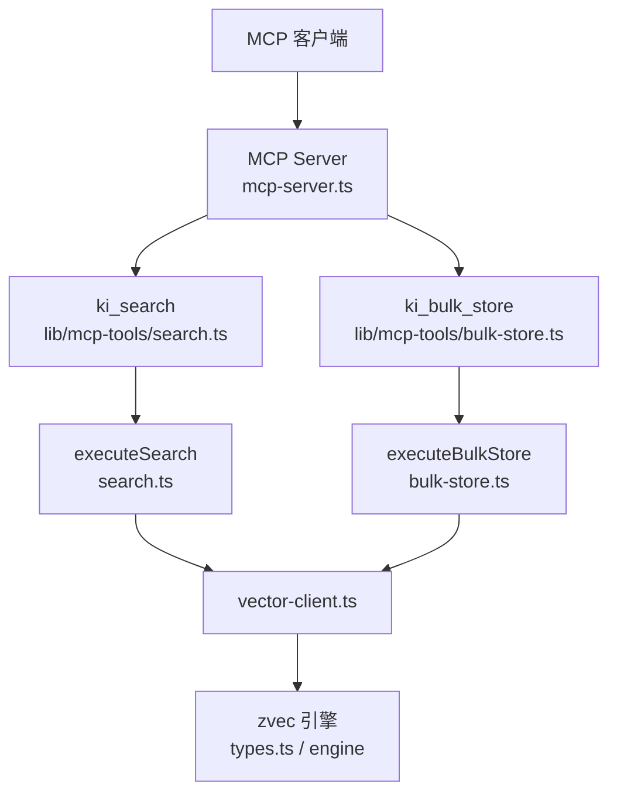
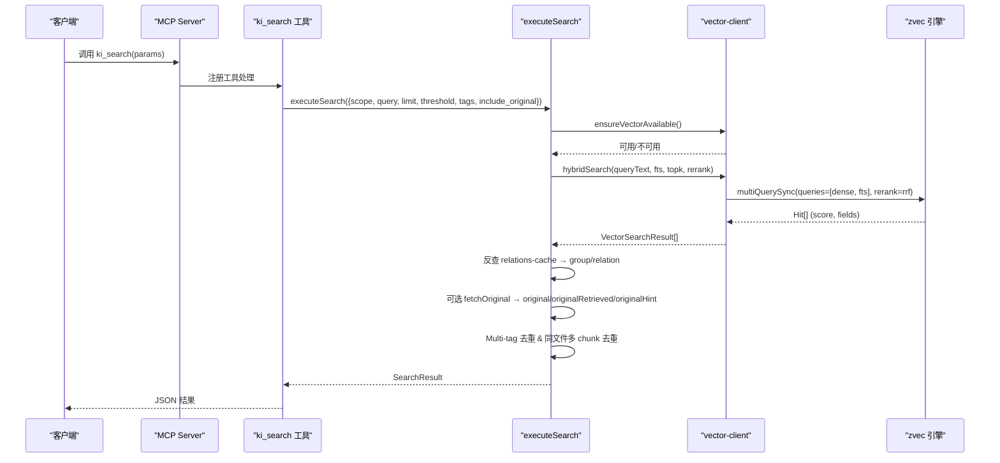
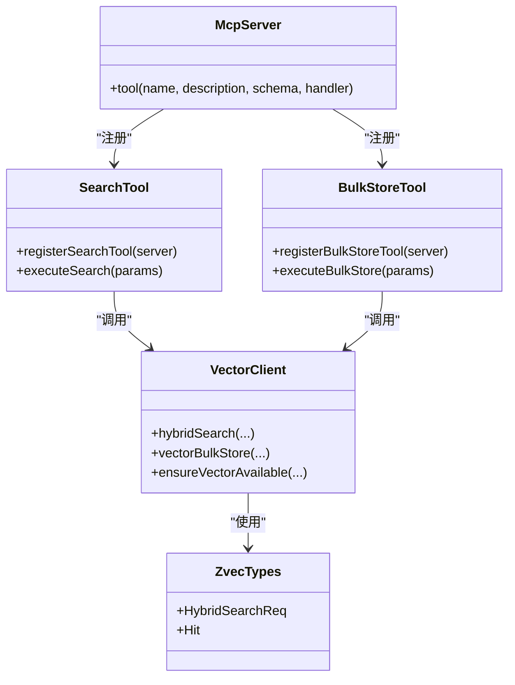

# 搜索类工具

<cite>
**本文引用的文件**
- [src/search.ts](file://src/search.ts)
- [src/bulk-store.ts](file://src/bulk-store.ts)
- [src/mcp-server.ts](file://src/mcp-server.ts)
- [src/lib/mcp-tools/search.ts](file://src/lib/mcp-tools/search.ts)
- [src/lib/mcp-tools/bulk-store.ts](file://src/lib/mcp-tools/bulk-store.ts)
- [src/lib/vector-client.ts](file://src/lib/vector-client.ts)
- [src/zvec-engine/types.ts](file://src/zvec-engine/types.ts)
- [docs/cli.md](file://docs/cli.md)
- [skills/ki-search/SKILL.md](file://skills/ki-search/SKILL.md)
</cite>

## 目录
1. [简介](#简介)
2. [项目结构](#项目结构)
3. [核心组件](#核心组件)
4. [架构总览](#架构总览)
5. [详细组件分析](#详细组件分析)
6. [依赖关系分析](#依赖关系分析)
7. [性能与优化](#性能与优化)
8. [故障排查](#故障排查)
9. [结论](#结论)
10. [附录：API 参考与示例](#附录api-参考与示例)

## 简介
本文件面向使用 MCP 工具的开发者，提供搜索类工具的完整 API 文档，重点覆盖以下能力：
- search 工具：语义检索知识库内容，支持混合检索（向量 + BM25 全文）与 RRF 融合排序。
- bulk-store 工具：批量存储文本到向量索引，便于大规模入库与向量化。

文档将详细说明参数配置、返回数据结构、原文定位信息、排序规则、相关性评分、过滤选项，并提供复杂查询场景的调用示例与最佳实践。

## 项目结构
搜索与批量写入在 MCP 层通过工具注册暴露给客户端；业务逻辑集中在 search.ts 与 bulk-store.ts；底层向量能力由 vector-client.ts 封装 zvec 引擎；类型定义与混合检索接口在 zvec-engine/types.ts；CLI 文档与行为指南在 docs/cli.md 与 skills/ki-search/SKILL.md。

图表来源
- [src/mcp-server.ts:54-70](file://src/mcp-server.ts#L54-L70)
- [src/lib/mcp-tools/search.ts:6-49](file://src/lib/mcp-tools/search.ts#L6-L49)
- [src/lib/mcp-tools/bulk-store.ts:6-41](file://src/lib/mcp-tools/bulk-store.ts#L6-L41)
- [src/search.ts:70-199](file://src/search.ts#L70-L199)
- [src/bulk-store.ts:32-78](file://src/bulk-store.ts#L32-L78)
- [src/lib/vector-client.ts:1-14](file://src/lib/vector-client.ts#L1-L14)
- [src/zvec-engine/types.ts:114-151](file://src/zvec-engine/types.ts#L114-L151)

章节来源
- [src/mcp-server.ts:54-70](file://src/mcp-server.ts#L54-L70)
- [src/lib/mcp-tools/search.ts:6-49](file://src/lib/mcp-tools/search.ts#L6-L49)
- [src/lib/mcp-tools/bulk-store.ts:6-41](file://src/lib/mcp-tools/bulk-store.ts#L6-L41)
- [src/search.ts:70-199](file://src/search.ts#L70-L199)
- [src/bulk-store.ts:32-78](file://src/bulk-store.ts#L32-L78)
- [src/lib/vector-client.ts:1-14](file://src/lib/vector-client.ts#L1-L14)
- [src/zvec-engine/types.ts:114-151](file://src/zvec-engine/types.ts#L114-L151)

## 核心组件
- ki_search（MCP 工具）：对外暴露语义检索能力，参数包括 scope、query、limit、threshold、tags、include_original。内部调用 executeSearch，执行混合检索并附加原文定位与可选原文。
- ki_bulk_store（MCP 工具）：对外暴露批量存储能力，参数包括 scope、input（JSON 数组路径）。内部调用 executeBulkStore，读取输入文件并批量写入向量索引。
- vector-client：封装 zvec 引擎，提供 hybridSearch、批量写入、可用性检测、撞锁重试与空闲释放锁等能力。
- zvec-engine/types：定义混合检索请求、Hit 结构与评分说明（向量 COSINE 归一化、BM25 原值、RRF/加权融合分）。

章节来源
- [src/lib/mcp-tools/search.ts:6-49](file://src/lib/mcp-tools/search.ts#L6-L49)
- [src/lib/mcp-tools/bulk-store.ts:6-41](file://src/lib/mcp-tools/bulk-store.ts#L6-L41)
- [src/lib/vector-client.ts:1-14](file://src/lib/vector-client.ts#L1-L14)
- [src/zvec-engine/types.ts:114-151](file://src/zvec-engine/types.ts#L114-L151)

## 架构总览
搜索流程采用“两路召回 + RRF 融合”的混合检索策略：
- 向量语义路：对 queryText 进行嵌入，按 dense 字段相似度检索。
- 全文 BM25 路：对 content 字段进行 jieba 分词后 BM25 匹配。
- RRF 融合：基于 rankConstant=60 的倒数秩融合，将两路结果合并排序。

批量存储流程：
- 读取 JSON 数组，校验每条 text 与 tags（默认 ki-search）。
- 调用 vectorBulkStore 批量写入，返回每项成功/失败状态与 memoryId。

图表来源
- [src/mcp-server.ts:54-70](file://src/mcp-server.ts#L54-L70)
- [src/lib/mcp-tools/search.ts:6-49](file://src/lib/mcp-tools/search.ts#L6-L49)
- [src/search.ts:70-199](file://src/search.ts#L70-L199)
- [src/lib/vector-client.ts:1-14](file://src/lib/vector-client.ts#L1-L14)
- [src/zvec-engine/types.ts:114-151](file://src/zvec-engine/types.ts#L114-L151)

## 详细组件分析

### ki_search 工具（MCP）
- 名称：ki_search
- 描述：语义检索知识库内容
- 参数
  - scope：string，可选，默认 default。项目隔离标识。
  - query：string，必填。自然语言查询文本。
  - limit：number，可选，默认 10。返回条数上限。
  - threshold：number，可选，范围 0-1。相似度阈值（融合得分），过滤低于此值的命中。
  - tags：string，可选。过滤标签，逗号分隔多个 tag，OR 组合；不传则搜索全部 tag。
  - include_original：boolean，可选，默认 false。是否返回 local KB 文件级原文。
- 返回值：JSON 字符串，包含 ok/scope/results 或错误信息。

实现要点
- 入口：registerSearchTool 注册工具，调用 withTimeout 包装 executeSearch。
- 执行：executeSearch 负责 scope 解析、向量服务可用性检测、混合检索、原文定位与可选原文召回、Multi-tag 去重与同文件多 chunk 去重。
- 原文定位：通过 relations-cache.json 反查 memoryId → {group, relation}；若开启 include_original，尝试从本地 KB 读取文件级原文，失败时降级为向量 content 并提示。

章节来源
- [src/lib/mcp-tools/search.ts:6-49](file://src/lib/mcp-tools/search.ts#L6-L49)
- [src/search.ts:70-199](file://src/search.ts#L70-L199)

#### 搜索结果数据结构
- SearchHit（扩展自 VectorSearchResult）
  - memoryId：string，向量文档 ID（sha256(text+scope) 截 32）。
  - content：string，向量层存储文本（index.json 原始值）。
  - score：number，RRF 融合分（通常为 0.0x 级别，越大越相关）。
  - tag：string，tag 字段（如 ki-search）。
  - group：string，所属 Group 路径（可能缺失）。
  - relation：string，文件级 relation 名（可能缺失）。
  - originalRetrieved：boolean，原文是否成功获取（仅 include_original=true 时存在）。
  - original：string，local KB 文件级原文（未清洗；失败时可能降级为 content）。
  - originalHint：string，原文不可用提示（精简，避免重复引导文案）。
  - deduplicated：boolean，同一文件多 chunk 命中去重标记（仅 include_original=true 时存在）。

章节来源
- [src/search.ts:33-47](file://src/search.ts#L33-L47)
- [src/lib/vector-client.ts:38-45](file://src/lib/vector-client.ts#L38-L45)
- [docs/cli.md:494-523](file://docs/cli.md#L494-L523)

#### 混合检索算法工作原理
- 向量语义路：queryText 经嵌入后在 dense 字段做相似度检索。
- 全文 BM25 路：content 字段启用 jieba 分词，进行 BM25 匹配。
- RRF 融合：rankConstant=60，计算 1/(k + rank + 1) 累加，得到最终排序分数。
- 评分说明
  - 向量路：COSINE 距离归一化为 1/(1+distance)，值域约 [1/3, 1]。
  - 全文路：BM25 原值。
  - 混合路：RRF/加权融合分（KiSearch 使用 RRF）。

章节来源
- [src/lib/vector-client.ts:1-14](file://src/lib/vector-client.ts#L1-L14)
- [src/zvec-engine/types.ts:114-151](file://src/zvec-engine/types.ts#L114-L151)
- [docs/cli.md:469-540](file://docs/cli.md#L469-L540)

#### 排序规则与相关性评分
- 默认排序：按 score 降序（RRF 融合分）。
- 阈值过滤：threshold 用于过滤低分命中；建议区间 0.02~0.03，超过理论上限（约 0.033）会空返回。
- 多 tag 优先级：默认搜索全部 tag 时，按 TAG_PRIORITY 排序（ki-search > ki-relation > ki-path），每个 tag 最多返回 limit 条。
- 去重策略
  - Multi-tag 去重：同一 (group, relation) 保留 score 最高的一条。
  - 同文件多 chunk 去重：同一文件多 chunk 命中时，仅首条携带 original，其余标注 deduplicated。

章节来源
- [src/search.ts:20-29](file://src/search.ts#L20-L29)
- [src/search.ts:94-121](file://src/search.ts#L94-L121)
- [src/search.ts:159-194](file://src/search.ts#L159-L194)
- [docs/cli.md:527-540](file://docs/cli.md#L527-L540)

#### 复杂查询场景与最佳实践
- 精确过滤：使用 --tags 指定 ki-search/ki-relation/ki-path 组合，缩小检索范围。
- 收紧相关性：设置 threshold=0.03，仅保留两路强命中的高度相关结果。
- 原文定位：开启 include_original，结合 group/relation 快速定位 KB 文件；注意多 chunk 命中仅首条携带 original。
- 宽泛查询：当查询含“配置”“API”等宽泛词时，全文路可能召回较多边缘结果，可通过提高 threshold 或限定 tags 改善。

章节来源
- [skills/ki-search/SKILL.md:13-33](file://skills/ki-search/SKILL.md#L13-L33)
- [docs/cli.md:527-540](file://docs/cli.md#L527-L540)
- [src/search.ts:94-121](file://src/search.ts#L94-L121)

### ki_bulk_store 工具（MCP）
- 名称：ki_bulk_store
- 描述：批量存储文本到向量索引
- 参数
  - scope：string，可选，默认 default。项目隔离标识。
  - input：string，必填。批量数据 JSON 文件路径（数组：[{ "text": "...", "tags": "..." }]）。
- 返回值：JSON 字符串，包含 ok/scope/total/succeeded/failed/results 或错误信息。

实现要点
- 入口：registerBulkStoreTool 注册工具，调用 withTimeout 包装 executeBulkStore。
- 执行：validateScope、ensureVectorAvailable、读取并校验 JSON 数组、调用 vectorBulkStore 批量写入。
- 输入格式：每条必须包含 text；tags 可选，默认 ki-search。
- 输出：每项 index、memoryId、success、error。

章节来源
- [src/lib/mcp-tools/bulk-store.ts:6-41](file://src/lib/mcp-tools/bulk-store.ts#L6-L41)
- [src/bulk-store.ts:32-78](file://src/bulk-store.ts#L32-L78)

#### 批量存储使用方法
- 准备 JSON 数组文件，确保每条包含 text；tags 可省略（默认 ki-search）。
- 调用 ki_bulk_store，传入 scope 与 input 路径。
- 检查返回 results 中 success/error，统计 succeeded/failed。

章节来源
- [src/bulk-store.ts:49-74](file://src/bulk-store.ts#L49-L74)

#### 性能优化技巧
- 分批提交：内部以 200 条/批提交，减少单次负载并提升可感知进度。
- 撞锁重试：检测到 locked 时等待对方释放后重试，避免立即失败。
- 空闲释放锁：常驻 MCP 启用空闲超时自动 closeEngine，让其他实例/CLI 错开共享向量库。
- 合理 tags：使用 ki-search/ki-relation/ki-path 控制写入与检索范围，避免无关 tag 干扰。

章节来源
- [src/lib/vector-client.ts:106-124](file://src/lib/vector-client.ts#L106-L124)
- [src/lib/vector-client.ts:166-200](file://src/lib/vector-client.ts#L166-L200)
- [src/lib/batch-vectorize.ts:140-182](file://src/lib/batch-vectorize.ts#L140-L182)

## 依赖关系分析
- MCP Server 注册工具：mcp-server.ts 统一注册 search 与 bulk-store 工具。
- 工具实现：lib/mcp-tools/search.ts 与 lib/mcp-tools/bulk-store.ts 分别封装 executeSearch 与 executeBulkStore，并添加超时保护。
- 业务逻辑：search.ts 与 bulk-store.ts 实现核心流程（检索、原文定位、批量写入）。
- 向量客户端：vector-client.ts 封装 zvec 引擎，提供 hybridSearch、批量写入、可用性检测、撞锁重试与空闲释放锁。
- 引擎类型：zvec-engine/types.ts 定义混合检索请求与 Hit 结构，明确评分与查询类型。

图表来源
- [src/mcp-server.ts:54-70](file://src/mcp-server.ts#L54-L70)
- [src/lib/mcp-tools/search.ts:6-49](file://src/lib/mcp-tools/search.ts#L6-L49)
- [src/lib/mcp-tools/bulk-store.ts:6-41](file://src/lib/mcp-tools/bulk-store.ts#L6-L41)
- [src/lib/vector-client.ts:1-14](file://src/lib/vector-client.ts#L1-L14)
- [src/zvec-engine/types.ts:114-151](file://src/zvec-engine/types.ts#L114-L151)

章节来源
- [src/mcp-server.ts:54-70](file://src/mcp-server.ts#L54-L70)
- [src/lib/mcp-tools/search.ts:6-49](file://src/lib/mcp-tools/search.ts#L6-L49)
- [src/lib/mcp-tools/bulk-store.ts:6-41](file://src/lib/mcp-tools/bulk-store.ts#L6-L41)
- [src/lib/vector-client.ts:1-14](file://src/lib/vector-client.ts#L1-L14)
- [src/zvec-engine/types.ts:114-151](file://src/zvec-engine/types.ts#L114-L151)

## 性能与优化
- 混合检索性能：向量路与全文路并行召回，RRF 融合开销小；topk 与 topn 影响召回规模。
- 阈值调优：threshold 建议 0.02~0.03；过高会导致空返回。
- 原文召回成本：include_original 触发 relations-cache 反查与本地 KB 读取，仅在需要时开启。
- 批量写入吞吐：200 条/批，撞锁重试与空闲释放锁提升并发稳定性。
- 缓存策略：relations-cache 反查带 TTL+mtime 缓存，首次构建 O(N)，后续 O(1)。

章节来源
- [docs/cli.md:527-540](file://docs/cli.md#L527-L540)
- [src/search.ts:123-157](file://src/search.ts#L123-L157)
- [src/lib/vector-client.ts:106-124](file://src/lib/vector-client.ts#L106-L124)
- [src/lib/vector-client.ts:166-200](file://src/lib/vector-client.ts#L166-L200)
- [src/lib/batch-vectorize.ts:140-182](file://src/lib/batch-vectorize.ts#L140-L182)

## 故障排查
- 向量服务不可用：ensureVectorAvailable 返回 available=false 与 reason；检查向量库占用、损坏或进程状态。
- 撞锁与占用：probeWithRetry 检测到 locked 时等待并重试；若持续失败，停止其他 ki mcp/server 进程或重建向量库。
- 原文不可用：fetchOriginal 失败时返回 originalHint；检查本地 KB 是否存在对应 relation 或同步关系。
- 输入校验失败：bulk-store 要求 JSON 数组且每条包含 text；否则返回错误信息。

章节来源
- [src/search.ts:84-92](file://src/search.ts#L84-L92)
- [src/bulk-store.ts:41-71](file://src/bulk-store.ts#L41-L71)
- [src/lib/vector-client.ts:72-87](file://src/lib/vector-client.ts#L72-L87)
- [src/lib/vector-client.ts:106-124](file://src/lib/vector-client.ts#L106-L124)

## 结论
搜索类工具通过 MCP 暴露 ki_search 与 ki_bulk_store，提供强大的混合检索与批量存储能力。search 工具支持语义搜索、BM25 全文、RRF 融合排序与原文定位；bulk-store 工具支持高效批量入库。通过合理的参数配置与优化策略，可在复杂查询场景中取得高相关性与稳定性能。

## 附录：API 参考与示例

### ki_search 参数表
| 参数 | 类型 | 必填 | 默认值 | 说明 |
|------|------|------|--------|------|
| scope | string | 否 | default | 项目隔离标识 |
| query | string | 是 | — | 自然语言查询文本 |
| limit | number | 否 | 10 | 返回条数上限 |
| threshold | number | 否 | — | 相似度阈值（0-1） |
| tags | string | 否 | — | 过滤标签（逗号分隔，OR 组合） |
| include_original | boolean | 否 | false | 是否返回 local KB 文件级原文 |

章节来源
- [src/lib/mcp-tools/search.ts:6-49](file://src/lib/mcp-tools/search.ts#L6-L49)
- [docs/cli.md:1096-1120](file://docs/cli.md#L1096-L1120)

### ki_bulk_store 参数表
| 参数 | 类型 | 必填 | 默认值 | 说明 |
|------|------|------|--------|------|
| scope | string | 否 | default | 项目隔离标识 |
| input | string | 是 | — | 批量数据 JSON 文件路径 |

章节来源
- [src/lib/mcp-tools/bulk-store.ts:6-41](file://src/lib/mcp-tools/bulk-store.ts#L6-L41)
- [docs/cli.md:1114-1120](file://docs/cli.md#L1114-L1120)

### 搜索返回结构示例
- ok：true/false
- scope：string
- results：SearchHit[]
  - memoryId：string
  - content：string
  - score：number
  - tag：string
  - group：string（可选）
  - relation：string（可选）
  - originalRetrieved：boolean（可选）
  - original：string（可选）
  - originalHint：string（可选）
  - deduplicated：boolean（可选）

章节来源
- [src/search.ts:33-47](file://src/search.ts#L33-L47)
- [docs/cli.md:494-523](file://docs/cli.md#L494-L523)

### 复杂查询示例
- 精确过滤与收紧相关性：
  - 调用 ki_search，设置 tags="ki-search,ki-relation"，threshold=0.03，limit=10。
- 原文定位与去重：
  - 开启 include_original=true，结合 group/relation 定位 KB 文件；注意同文件多 chunk 命中仅首条携带 original。
- 批量入库：
  - 准备 JSON 数组文件，调用 ki_bulk_store，检查 succeeded/failed 与 results 中 error。

章节来源
- [skills/ki-search/SKILL.md:13-33](file://skills/ki-search/SKILL.md#L13-L33)
- [docs/cli.md:527-540](file://docs/cli.md#L527-L540)
- [src/bulk-store.ts:49-74](file://src/bulk-store.ts#L49-L74)