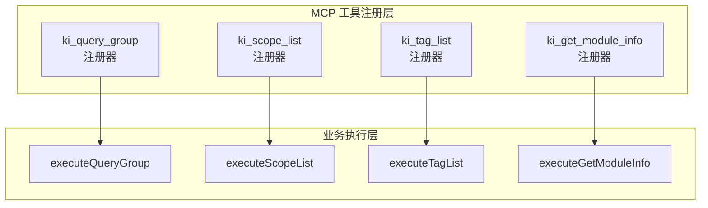
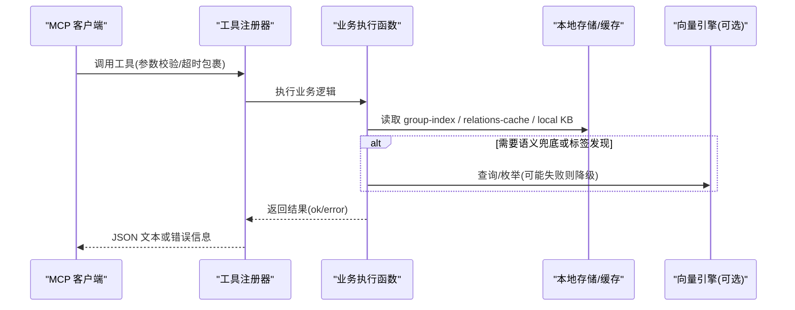
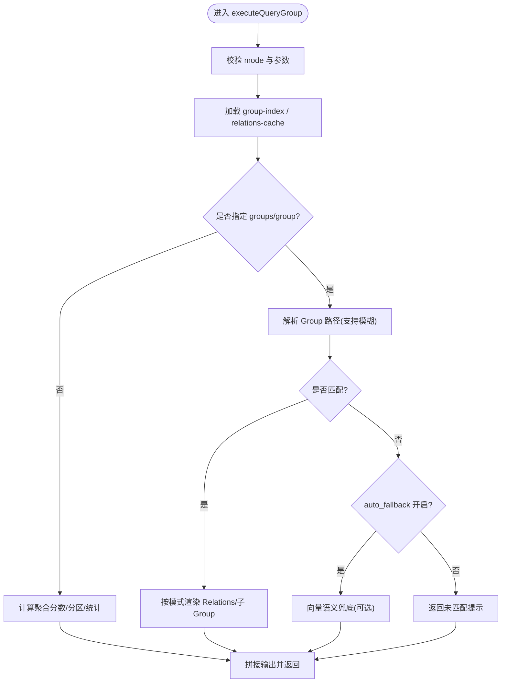
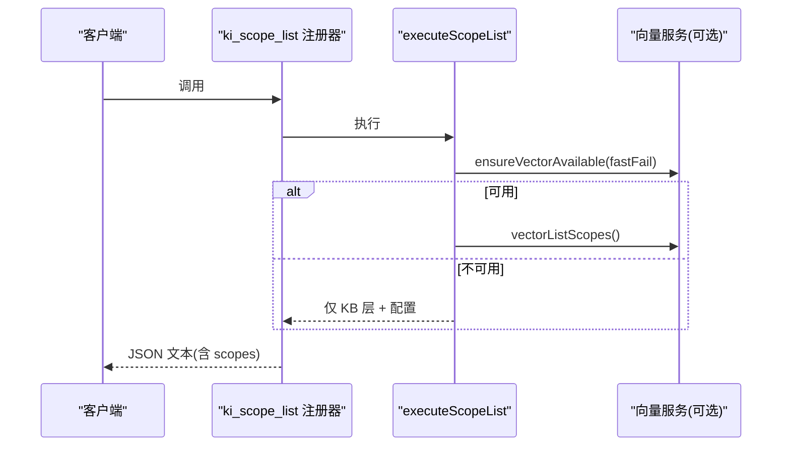
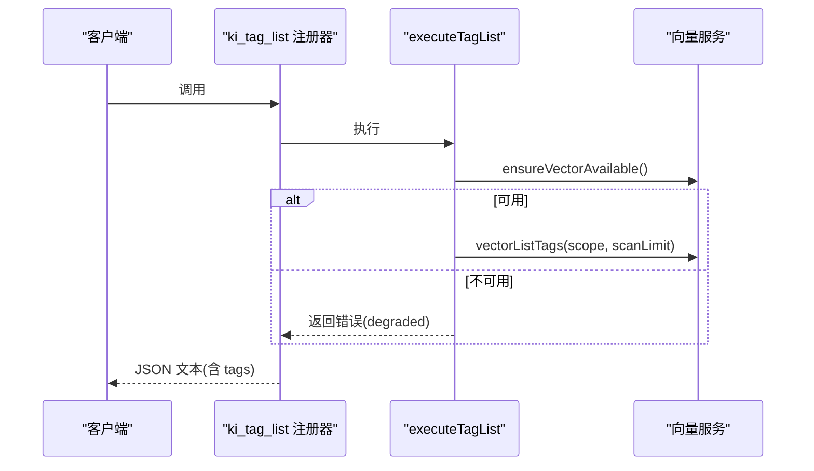
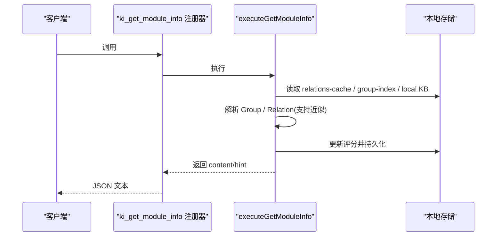
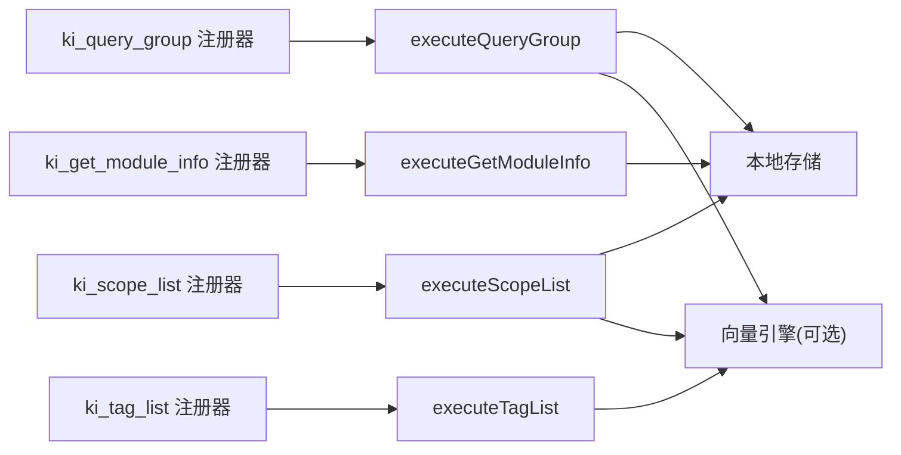

# 查询类工具

<cite>
**本文引用的文件**
- [query-group.ts](file://src/query-group.ts)
- [scope.ts](file://src/scope.ts)
- [tag.ts](file://src/tag.ts)
- [get-module-info.ts](file://src/get-module-info.ts)
- [mcp-query-group.ts](file://src/lib/mcp-tools/query-group.ts)
- [mcp-scope-list.ts](file://src/lib/mcp-tools/scope-list.ts)
- [mcp-tag-list.ts](file://src/lib/mcp-tools/tag-list.ts)
- [mcp-get-module-info.ts](file://src/lib/mcp-tools/get-module-info.ts)
- [mcp-util.ts](file://src/lib/mcp-tools/util.ts)
- [cli.md](file://docs/cli.md)
</cite>

## 目录
1. [简介](#简介)
2. [项目结构](#项目结构)
3. [核心组件](#核心组件)
4. [架构总览](#架构总览)
5. [详细组件分析](#详细组件分析)
6. [依赖关系分析](#依赖关系分析)
7. [性能考虑](#性能考虑)
8. [故障排查指南](#故障排查指南)
9. [结论](#结论)
10. [附录：调用示例与最佳实践](#附录调用示例与最佳实践)

## 简介
本文件面向 MCP（Model Context Protocol）客户端，提供“查询类”工具的完整 API 规范，覆盖以下工具：
- ki_query_group：查询 Group 树、Relations 分区与热门索引，支持按模式过滤与语义兜底。
- ki_scope_list：列出所有 scope（KB 目录层与向量语义层的并集），标注存在性与注册状态。
- ki_tag_list：列出指定 scope 下使用过的 tag（含文档数），用于后续搜索或过滤。
- ki_get_module_info：读取指定 Group 下某个 Relation 的本地 KB Markdown 内容，并更新评分。

这些工具均为只读型（除 get-module-info 会更新评分），遵循零破坏性约束，适合在 IDE/Agent 中安全调用。

## 项目结构
查询类工具由“MCP 工具注册层 + 业务执行层”组成：
- MCP 工具注册层：定义工具名、参数 Schema、超时与错误包装，调用业务执行函数。
- 业务执行层：实现具体查询逻辑，访问本地存储、向量引擎与配置。

图表来源
- [mcp-query-group.ts:6-53](file://src/lib/mcp-tools/query-group.ts#L6-L53)
- [mcp-scope-list.ts:11-41](file://src/lib/mcp-tools/scope-list.ts#L11-L41)
- [mcp-tag-list.ts:6-37](file://src/lib/mcp-tools/tag-list.ts#L6-L37)
- [mcp-get-module-info.ts:6-36](file://src/lib/mcp-tools/get-module-info.ts#L6-L36)
- [query-group.ts:598-746](file://src/query-group.ts#L598-L746)
- [scope.ts:94-134](file://src/scope.ts#L94-L134)
- [tag.ts:34-51](file://src/tag.ts#L34-L51)
- [get-module-info.ts:61-168](file://src/get-module-info.ts#L61-L168)

章节来源
- [cli.md:979-996](file://docs/cli.md#L979-L996)

## 核心组件
- ki_query_group
  - 用途：查询 Group 树与 Relations 分区，支持 hot/warm/cold/emerging/full 等模式；可指定 groups/group 路径进行聚焦展示；支持语义兜底。
  - 关键能力：分组聚合评分、分区、热门 Top N、树渲染、统计信息输出。
- ki_scope_list
  - 用途：列出所有 scope（KB 目录层 + 向量层并集），标注是否存在于各层、是否已注册、KB 文档数。
  - 关键能力：快速探测向量可用性、RBAC 授权过滤（可选）。
- ki_tag_list
  - 用途：发现某 scope 下用过的 tag 及文档数，用于后续搜索或过滤。
  - 关键能力：扫描限制与截断提示（truncated）。
- ki_get_module_info
  - 用途：读取本地 KB 中指定 Group/Relation 对应的 Markdown 原文，并更新使用评分。
  - 关键能力：Group/Relation 解析、近似匹配、评分回写。

章节来源
- [mcp-query-group.ts:6-53](file://src/lib/mcp-tools/query-group.ts#L6-L53)
- [mcp-scope-list.ts:11-41](file://src/lib/mcp-tools/scope-list.ts#L11-L41)
- [mcp-tag-list.ts:6-37](file://src/lib/mcp-tools/tag-list.ts#L6-L37)
- [mcp-get-module-info.ts:6-36](file://src/lib/mcp-tools/get-module-info.ts#L6-L36)
- [query-group.ts:598-746](file://src/query-group.ts#L598-L746)
- [scope.ts:94-134](file://src/scope.ts#L94-L134)
- [tag.ts:34-51](file://src/tag.ts#L34-L51)
- [get-module-info.ts:61-168](file://src/get-module-info.ts#L61-L168)

## 架构总览
下图展示了 MCP 工具到业务执行的调用链路与数据流向。

图表来源
- [mcp-query-group.ts:6-53](file://src/lib/mcp-tools/query-group.ts#L6-L53)
- [mcp-scope-list.ts:11-41](file://src/lib/mcp-tools/scope-list.ts#L11-L41)
- [mcp-tag-list.ts:6-37](file://src/lib/mcp-tools/tag-list.ts#L6-L37)
- [mcp-get-module-info.ts:6-36](file://src/lib/mcp-tools/get-module-info.ts#L6-L36)
- [query-group.ts:611-746](file://src/query-group.ts#L611-L746)
- [scope.ts:94-134](file://src/scope.ts#L94-L134)
- [tag.ts:34-51](file://src/tag.ts#L34-L51)
- [get-module-info.ts:61-168](file://src/get-module-info.ts#L61-L168)

## 详细组件分析

### ki_query_group
- 功能：查询 Group 树与 Relations 分区，支持多模式展示与语义兜底。
- 请求参数
  - scope: string，可选，默认 default；strict 模式下必须传入且需白名单。
  - groups: string，可选，逗号分隔的 Group 路径列表（支持模糊匹配）。
  - group: string，可选，groups 的单数别名（同时传时以 groups 为准）。
  - hot_count: number，可选，默认 5；热门展示个数。
  - depth: number，可选，默认 4，范围 1-10；索引层级深度。
  - mode: string，可选，默认 hot；展示分区：hot|warm|cold|emerging|full（支持逗号分隔）。
  - auto_fallback: boolean，可选，默认 true；是否启用语义兜底。
- 响应结构
  - 成功：content 为文本，内容为结构化输出字符串（包含 scope、分区、Top N、统计信息等）。
  - 失败：isError=true，content 为错误消息。
- 参数验证规则
  - mode 仅允许 hot|warm|cold|emerging|full；空值将报错。
  - depth 限制 1-10；超出或非法将回退或告警。
  - groups/group 支持前导/尾随斜杠清理与模糊匹配。
- 数据过滤选项
  - 通过 mode 选择分区；full 模式递归展示子 Group Relations。
  - 可通过 groups/group 精确/模糊定位目标 Group。
- 错误处理
  - 未找到 group-index.json：返回错误。
  - 未命中 Group：给出 hint，并在开启 auto_fallback 时尝试通用语义搜索。
  - 向量不可用：自动降级为仅 KB 层视图。
- 性能优化建议
  - 合理设置 depth 与 hot_count，避免全量树渲染。
  - 使用 mode 过滤减少输出规模。
  - 关闭 auto_fallback 可避免额外向量调用。

图表来源
- [query-group.ts:611-746](file://src/query-group.ts#L611-L746)
- [mcp-query-group.ts:6-53](file://src/lib/mcp-tools/query-group.ts#L6-L53)

章节来源
- [mcp-query-group.ts:6-53](file://src/lib/mcp-tools/query-group.ts#L6-L53)
- [query-group.ts:598-746](file://src/query-group.ts#L598-L746)

### ki_scope_list
- 功能：列出所有 scope（KB 目录层 + 向量语义层并集），标注存在性与注册状态、KB 文档数。
- 请求参数：无。
- 响应结构
  - ok: true
    - scopeMode: 'default' | 'strict'
    - vectorAvailable: boolean
    - vectorReason?: string
    - count: number
    - scopes: Array<{ scope, kb, vector, registered, wikiCount }>
  - 失败：isError=true，content 为错误消息。
- 行为说明
  - 快速探测向量可用性，若不可用则仅返回 KB 层与配置中的 scope。
  - 支持 RBAC 授权过滤（注册器层根据 authScopes 过滤可见 scope）。
- 错误处理
  - 向量服务不可用时返回 vectorAvailable=false 与原因。
- 性能优化建议
  - 该接口设计为轻量枚举，优先走 fastFail 策略，避免阻塞。

图表来源
- [mcp-scope-list.ts:11-41](file://src/lib/mcp-tools/scope-list.ts#L11-L41)
- [scope.ts:94-134](file://src/scope.ts#L94-L134)

章节来源
- [mcp-scope-list.ts:11-41](file://src/lib/mcp-tools/scope-list.ts#L11-L41)
- [scope.ts:94-134](file://src/scope.ts#L94-L134)

### ki_tag_list
- 功能：列出指定 scope 下用过的 tag（含文档数），用于后续搜索或过滤。
- 请求参数
  - scope: string，可选，默认 default。
- 响应结构
  - ok: true
    - scope: string
    - count: number
    - scanned: number
    - truncated: boolean
    - tags: Array<VectorTagInfo>
  - 失败：isError=true，content 为错误消息。
- 行为说明
  - 依赖向量引擎；不可用时返回 degraded=true 的错误。
  - 受 scanLimit 限制，超限时 truncated=true 表示结果为近似。
- 错误处理
  - 向量服务不可用：返回错误并标记 degraded。
- 性能优化建议
  - 合理设置 scanLimit，避免全量扫描导致延迟。

图表来源
- [mcp-tag-list.ts:6-37](file://src/lib/mcp-tools/tag-list.ts#L6-L37)
- [tag.ts:34-51](file://src/tag.ts#L34-L51)

章节来源
- [mcp-tag-list.ts:6-37](file://src/lib/mcp-tools/tag-list.ts#L6-L37)
- [tag.ts:34-51](file://src/tag.ts#L34-L51)

### ki_get_module_info
- 功能：读取指定 Group 下某个 Relation 的本地 KB Markdown 内容，并更新使用评分。
- 请求参数
  - scope: string，可选，默认 default；strict 模式下必须传入且需白名单。
  - group: string，必填；Group 路径（支持向量语义兜底）。
  - relation: string，必填；Relation 名称（精确匹配，支持近似匹配提示）。
- 响应结构
  - ok: true
    - scope: string
    - content: string（Markdown 原文）
    - hint?: string（提示信息）
  - 失败：isError=true，content 为错误消息。
- 行为说明
  - 先解析 Group，再查找 Relation；若精确不匹配，尝试近似匹配并给出提示。
  - 成功后更新评分（recordUse + calculateScore）并持久化。
- 错误处理
  - relations-cache.json 不存在：提示先写入关系。
  - Group/Relation 未匹配：返回错误与可用 Relation 列表提示。
  - 本地 KB 缺失：给出修复指引。
- 性能优化建议
  - 仅在必要时开启近似匹配；尽量提供精确 relation 名称。

图表来源
- [mcp-get-module-info.ts:6-36](file://src/lib/mcp-tools/get-module-info.ts#L6-L36)
- [get-module-info.ts:61-168](file://src/get-module-info.ts#L61-L168)

章节来源
- [mcp-get-module-info.ts:6-36](file://src/lib/mcp-tools/get-module-info.ts#L6-L36)
- [get-module-info.ts:61-168](file://src/get-module-info.ts#L61-L168)

## 依赖关系分析
- 工具注册层依赖业务执行层：每个 MCP 工具注册器调用对应 executeXxx 函数。
- 业务执行层依赖：
  - 本地存储：group-index.json、relations-cache.json、local KB index.json。
  - 向量引擎（可选）：vector-search、vector-list-tags、ensureVectorAvailable。
  - 配置与范围：loadConfig、resolveScope、validateScope。
- 超时与错误：统一通过 withTimeout 与 TOOL_TIMEOUT 控制，避免长驻进程阻塞。

图表来源
- [mcp-query-group.ts:6-53](file://src/lib/mcp-tools/query-group.ts#L6-L53)
- [mcp-scope-list.ts:11-41](file://src/lib/mcp-tools/scope-list.ts#L11-L41)
- [mcp-tag-list.ts:6-37](file://src/lib/mcp-tools/tag-list.ts#L6-L37)
- [mcp-get-module-info.ts:6-36](file://src/lib/mcp-tools/get-module-info.ts#L6-L36)
- [query-group.ts:611-746](file://src/query-group.ts#L611-L746)
- [scope.ts:94-134](file://src/scope.ts#L94-L134)
- [tag.ts:34-51](file://src/tag.ts#L34-L51)
- [get-module-info.ts:61-168](file://src/get-module-info.ts#L61-L168)

章节来源
- [mcp-util.ts:1-43](file://src/lib/mcp-tools/util.ts#L1-L43)

## 性能考虑
- 超时保护：所有工具均通过 withTimeout 包裹，READ 默认 30s，WRITE 默认 60s，BULK 默认 300s。
- 向量可用性快速降级：scope list 使用 fastFail 策略，避免等待锁。
- 输出裁剪：query-group 支持 depth、hot_count、mode 控制输出规模。
- 扫描限制：tag list 支持 scanLimit，超限返回 truncated 提示。
- 语义兜底开关：query-group 的 auto_fallback 可关闭以避免额外向量调用。

章节来源
- [mcp-util.ts:1-43](file://src/lib/mcp-tools/util.ts#L1-L43)
- [scope.ts:94-134](file://src/scope.ts#L94-L134)
- [query-group.ts:611-746](file://src/query-group.ts#L611-L746)
- [tag.ts:34-51](file://src/tag.ts#L34-L51)

## 故障排查指南
- 向量服务不可用
  - 现象：ki_scope_list 返回 vectorAvailable=false；ki_tag_list 返回 degraded=true。
  - 处理：检查向量服务状态与锁占用；重试或稍后调用。
- Group/Relation 未匹配
  - 现象：ki_query_group 或 ki_get_module_info 返回未匹配提示。
  - 处理：确认 group/relation 名称；开启 auto_fallback 或使用近似匹配提示；检查 relations-cache 是否已写入。
- 本地 KB 缺失
  - 现象：ki_get_module_info 报本地 KB 文件不存在或未找到内容。
  - 处理：重新执行 sync-relation 或 scan-kb import；检查备份恢复完整性。
- 超时错误
  - 现象：返回 ToolTimeoutError。
  - 处理：降低并发、增大超时或检查后端服务；避免全量模式与过深 depth。

章节来源
- [mcp-util.ts:1-43](file://src/lib/mcp-tools/util.ts#L1-L43)
- [scope.ts:94-134](file://src/scope.ts#L94-L134)
- [tag.ts:34-51](file://src/tag.ts#L34-L51)
- [get-module-info.ts:61-168](file://src/get-module-info.ts#L61-L168)

## 结论
查询类工具提供了对 Group、Scope、Tag 与 Module 内容的稳定只读访问能力，具备完善的参数校验、错误处理与性能保护机制。推荐在生产环境中结合 mode、depth、hot_count 与 scanLimit 等参数进行精细化控制，以获得最佳体验。

## 附录：调用示例与最佳实践
- 获取分组信息（ki_query_group）
  - 场景：查看某 Group 的 Relations 与热门索引。
  - 建议：指定 groups/group；设置 mode=hot 或 full；合理 depth 与 hot_count。
  - 参考路径：[mcp-query-group.ts:6-53](file://src/lib/mcp-tools/query-group.ts#L6-L53)、[query-group.ts:611-746](file://src/query-group.ts#L611-L746)
- 列出作用域（ki_scope_list）
  - 场景：了解当前环境有哪些 scope，以及它们存在于哪一层。
  - 建议：无需参数；关注 vectorAvailable 与 registered 字段。
  - 参考路径：[mcp-scope-list.ts:11-41](file://src/lib/mcp-tools/scope-list.ts#L11-L41)、[scope.ts:94-134](file://src/scope.ts#L94-L134)
- 查询标签列表（ki_tag_list）
  - 场景：为后续搜索或过滤准备可用 tag。
  - 建议：设置合理的 scanLimit；注意 truncated 标志。
  - 参考路径：[mcp-tag-list.ts:6-37](file://src/lib/mcp-tools/tag-list.ts#L6-L37)、[tag.ts:34-51](file://src/tag.ts#L34-L51)
- 获取模块信息（ki_get_module_info）
  - 场景：读取特定 Group/Relation 的 Markdown 原文。
  - 建议：提供精确 relation；如不确定可使用近似匹配提示；确保 relations-cache 已写入。
  - 参考路径：[mcp-get-module-info.ts:6-36](file://src/lib/mcp-tools/get-module-info.ts#L6-L36)、[get-module-info.ts:61-168](file://src/get-module-info.ts#L61-L168)

章节来源
- [cli.md:979-996](file://docs/cli.md#L979-L996)