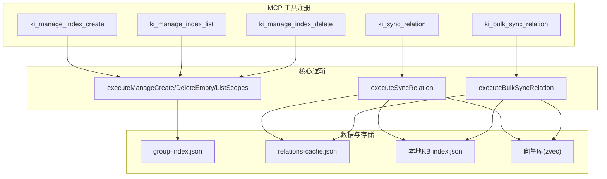
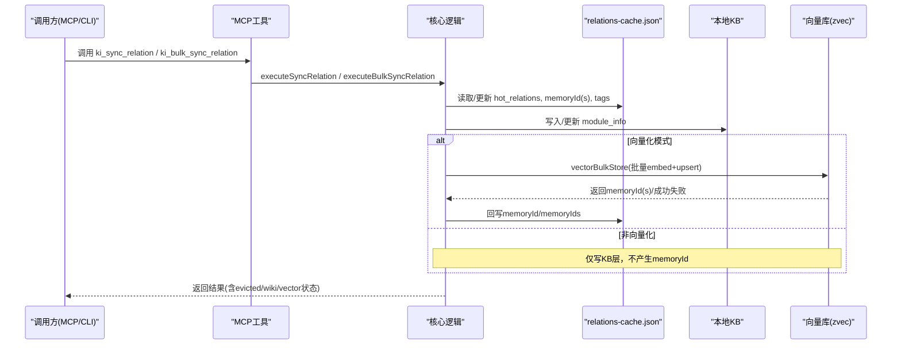
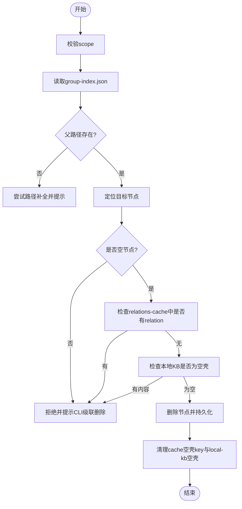
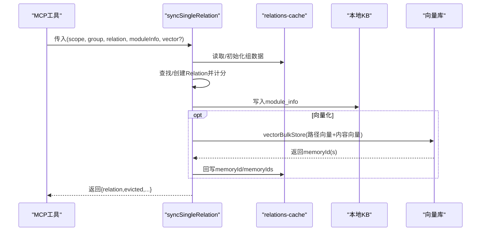
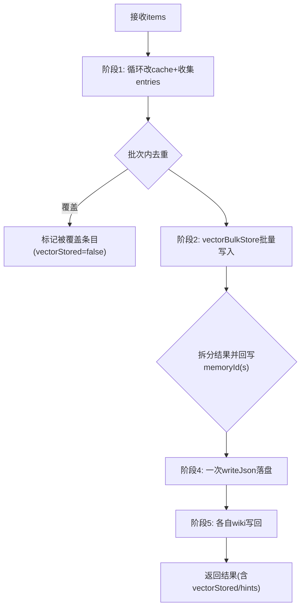
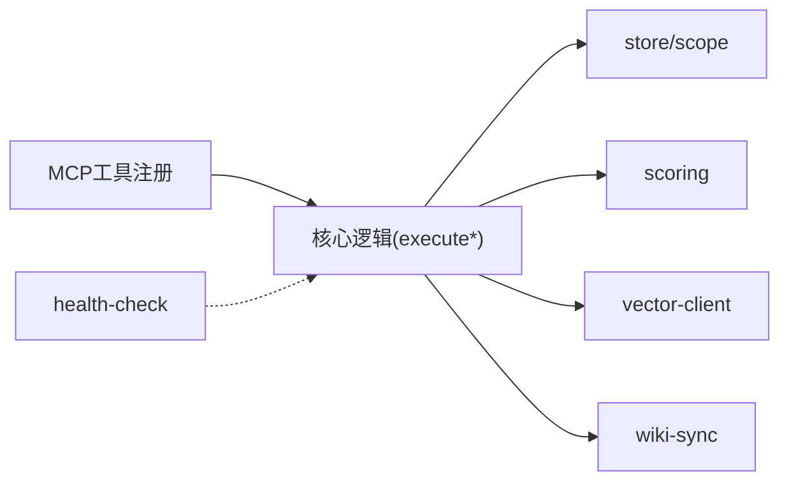

# 索引管理类工具

<cite>
**本文引用的文件**
- [manage-index.ts](file://src/manage-index.ts)
- [sync-relation.ts](file://src/sync-relation.ts)
- [mcp-tools/manage-index.ts](file://src/lib/mcp-tools/manage-index.ts)
- [mcp-tools/sync-relation.ts](file://src/lib/mcp-tools/sync-relation.ts)
- [mcp-tools/bulk-sync-relation.ts](file://src/lib/mcp-tools/bulk-sync-relation.ts)
- [vector-client.ts](file://src/lib/vector-client.ts)
- [scoring.ts](file://src/lib/scoring.ts)
- [constants.ts](file://src/lib/constants.ts)
- [health-check.ts](file://src/lib/health-check.ts)
- [backup-restore.md](file://docs/backup-restore.md)
- [manage-index.md](file://docs/manage-index.md)
</cite>

## 目录
1. [简介](#简介)
2. [项目结构](#项目结构)
3. [核心组件](#核心组件)
4. [架构总览](#架构总览)
5. [详细组件分析](#详细组件分析)
6. [依赖关系分析](#依赖关系分析)
7. [性能考虑](#性能考虑)
8. [故障排除指南](#故障排除指南)
9. [结论](#结论)
10. [附录](#附录)

## 简介
本文件面向“索引管理类 MCP 工具”的 API 与使用实践，聚焦以下目标：
- 详细说明 manage-index 工具的索引创建、删除（空节点）与 scope 列表能力，以及级联清理策略。
- 说明 sync-relation 与 bulk-sync-relation 的关系同步机制：单条/批量写入、向量化与非向量化模式、增量/全量语义、冲突与去重策略。
- 解释索引生命周期管理、监控指标与健康检查要点。
- 提供大规模知识库场景下的维护最佳实践：定期优化、空间清理、备份恢复。
- 给出常见故障定位与排障方法。

## 项目结构
围绕索引管理的代码主要分布在以下位置：
- CLI 与核心逻辑：src/manage-index.ts、src/sync-relation.ts
- MCP 工具注册层：src/lib/mcp-tools/*
- 向量存储与客户端：src/lib/vector-client.ts
- 评分与分区常量：src/lib/scoring.ts、src/lib/constants.ts
- 健康检查：src/lib/health-check.ts
- 文档与示例：docs/manage-index.md、docs/backup-restore.md

图表来源
- [mcp-tools/manage-index.ts:13-112](file://src/lib/mcp-tools/manage-index.ts#L13-L112)
- [mcp-tools/sync-relation.ts:6-43](file://src/lib/mcp-tools/sync-relation.ts#L6-L43)
- [mcp-tools/bulk-sync-relation.ts:6-42](file://src/lib/mcp-tools/bulk-sync-relation.ts#L6-L42)
- [manage-index.ts:82-166](file://src/manage-index.ts#L82-L166)
- [sync-relation.ts:129-221](file://src/sync-relation.ts#L129-L221)
- [sync-relation.ts:407-787](file://src/sync-relation.ts#L407-L787)

章节来源
- [manage-index.ts:1-646](file://src/manage-index.ts#L1-L646)
- [sync-relation.ts:1-800](file://src/sync-relation.ts#L1-L800)
- [mcp-tools/manage-index.ts:1-113](file://src/lib/mcp-tools/manage-index.ts#L1-L113)
- [mcp-tools/sync-relation.ts:1-44](file://src/lib/mcp-tools/sync-relation.ts#L1-L44)
- [mcp-tools/bulk-sync-relation.ts:1-43](file://src/lib/mcp-tools/bulk-sync-relation.ts#L1-L43)

## 核心组件
- 索引管理（manage-index）
  - 创建 Group 节点：支持父路径解析与自动补全，重复名称保护。
  - 删除空节点：仅限无子节点、无 relation、无本地 KB 的空壳节点；非空需走 CLI 级联删除。
  - 列出 scopes：返回已初始化与已注册的 scope 集合，并附带顶层 Group 信息。
- 关系同步（sync-relation / bulk-sync-relation）
  - 单条写入：校验、评分更新、淘汰、落盘 KB、可选向量化。
  - 批量写入：一次 embedding + 一次向量 upsert，批次内同 group+relation 去重覆盖，回写 memoryId/memoryIds，Wiki 写回容错。
- 向量客户端（vector-client）
  - 统一封装 zvec engine，提供批量存储、删除、可用性探测与撞锁重试。
- 评分与分区（scoring + constants）
  - 基于 useCount 与时间衰减计算 score，支持冷热分区与新兴热区保留。
- 健康检查（health-check）
  - 配置、目录、embedding 连通性/密钥/维度、zvec collection 状态诊断。

章节来源
- [manage-index.ts:82-166](file://src/manage-index.ts#L82-L166)
- [sync-relation.ts:129-221](file://src/sync-relation.ts#L129-L221)
- [sync-relation.ts:407-787](file://src/sync-relation.ts#L407-L787)
- [vector-client.ts:1-200](file://src/lib/vector-client.ts#L1-L200)
- [scoring.ts:1-200](file://src/lib/scoring.ts#L1-L200)
- [constants.ts:1-98](file://src/lib/constants.ts#L1-L98)
- [health-check.ts:1-261](file://src/lib/health-check.ts#L1-L261)

## 架构总览
索引管理链路分为三层：Group 树索引、Relations 缓存、本地 KB；向量层作为可选项增强检索召回。

图表来源
- [mcp-tools/sync-relation.ts:6-43](file://src/lib/mcp-tools/sync-relation.ts#L6-L43)
- [mcp-tools/bulk-sync-relation.ts:6-42](file://src/lib/mcp-tools/bulk-sync-relation.ts#L6-L42)
- [sync-relation.ts:407-787](file://src/sync-relation.ts#L407-L787)
- [vector-client.ts:1-200](file://src/lib/vector-client.ts#L1-L200)

## 详细组件分析

### 组件A：索引管理（manage-index）
- 能力边界
  - create：在 Group 树中创建新节点，支持父路径解析与自动补全，同名保护。
  - delete：MCP 仅允许删除“空节点”（无子节点、无 relation、无本地 KB），非空需 CLI 级联删除。
  - list-scopes：列出所有 scope（含未初始化但已注册），并显示顶层 Group。
- 级联清理（CLI 删除时）
  - 清理 relations-cache 中以该 groupPath 为前缀的所有 key。
  - 删除 local-kb 对应 index.json。
  - 收集 memoryId 批量 vectorDelete，统计成功/跳过/错误。
- 安全与提示
  - 父路径不存在时给出可用子节点提示。
  - 删除非空节点时提示 children 列表与 CLI 用法。

图表来源
- [manage-index.ts:185-298](file://src/manage-index.ts#L185-L298)
- [manage-index.ts:320-411](file://src/manage-index.ts#L320-L411)

章节来源
- [manage-index.ts:82-166](file://src/manage-index.ts#L82-L166)
- [manage-index.ts:185-298](file://src/manage-index.ts#L185-L298)
- [manage-index.ts:320-411](file://src/manage-index.ts#L320-L411)
- [manage-index.ts:415-646](file://src/manage-index.ts#L415-L646)
- [mcp-tools/manage-index.ts:13-112](file://src/lib/mcp-tools/manage-index.ts#L13-L112)

### 组件B：关系同步（sync-relation）
- 单条写入流程
  - 确保 Group 路径完整（缺失自动补建）。
  - 查找或新建 Relation，记录使用次数与分数，必要时淘汰最低分条目。
  - 写入本地 KB（按 group 隔离）。
  - 可选向量化：生成 ki-relation 路径向量与 ki-search 内容向量，回写 memoryId。
- 冲突与幂等
  - 相同 relation text 视为更新：刷新 lastUsedTime 与 score。
  - Wiki 写回失败不影响主流程，仅透出 reason。

图表来源
- [sync-relation.ts:129-221](file://src/sync-relation.ts#L129-L221)
- [vector-client.ts:1-200](file://src/lib/vector-client.ts#L1-L200)

章节来源
- [sync-relation.ts:129-221](file://src/sync-relation.ts#L129-L221)
- [mcp-tools/sync-relation.ts:6-43](file://src/lib/mcp-tools/sync-relation.ts#L6-L43)

### 组件C：批量关系同步（bulk-sync-relation）
- 设计目标
  - 一次 embedding HTTP + 一次 worker upsert，显著降低网络与序列化开销。
  - 批次内同 (group, relation) 去重覆盖，避免孤儿向量与误删。
- 关键步骤
  - 阶段1：循环执行单条逻辑（内存改 cache + 收集 entries）。
  - 阶段1.5：同批去重，剔除被覆盖的 entry。
  - 阶段2：批量向量写入（vectorBulkStore）。
  - 阶段3：拆分结果，回写 memoryId/memoryIds，聚合删除 stale 旧向量。
  - 阶段4：一次 writeJson 落盘 cache。
  - 阶段5：各自 wiki 写回（互不冲突）。
- 输出字段
  - total/succeeded/failed/skipped/results/vectorStored/hints 等，便于上层判断整体成功与部分失败原因。

图表来源
- [sync-relation.ts:407-787](file://src/sync-relation.ts#L407-L787)
- [mcp-tools/bulk-sync-relation.ts:6-42](file://src/lib/mcp-tools/bulk-sync-relation.ts#L6-L42)

章节来源
- [sync-relation.ts:407-787](file://src/sync-relation.ts#L407-L787)
- [mcp-tools/bulk-sync-relation.ts:1-43](file://src/lib/mcp-tools/bulk-sync-relation.ts#L1-L43)

### 组件D：向量客户端与撞锁处理
- 功能
  - 提供 ensureVectorAvailable、vectorBulkStore、vectorDelete 等接口。
  - 撞锁重试：检测到 locked 时等待对方释放后重试，最多重试若干次。
  - 空闲释放锁：常驻 MCP 启用 idle close，避免多实例争用。
- 重要行为
  - doc id = sha256(text + scope) 截断，保证幂等 upsert。
  - tag 统一小写，scope/tag/group 作为过滤字段。

章节来源
- [vector-client.ts:1-200](file://src/lib/vector-client.ts#L1-L200)

### 组件E：评分与分区
- 评分
  - 基于 useCount 与 lastUsedTime 的时间衰减计算 score。
  - recordUse 防刷（5分钟间隔）与上限限制。
- 分区
  - hybridPartition：新兴热区保留席位 + 历史热门按评分填充 + 常温/冷区比例分配。
  - 支持 maxHotCount/maxWarmCount 等上限截断。

章节来源
- [scoring.ts:1-200](file://src/lib/scoring.ts#L1-L200)
- [constants.ts:1-98](file://src/lib/constants.ts#L1-L98)

## 依赖关系分析
- MCP 工具注册层依赖核心逻辑函数（execute*），并通过 withTimeout 控制超时。
- 核心逻辑依赖：
  - store/scope：读写 group-index.json、relations-cache.json、本地 KB。
  - scoring：评分与分区。
  - vector-client：向量存储与删除。
  - wiki-sync：可选写回外部 Wiki。
- 健康检查独立于写入链路，用于启动预检与诊断。

图表来源
- [mcp-tools/manage-index.ts:13-112](file://src/lib/mcp-tools/manage-index.ts#L13-L112)
- [mcp-tools/sync-relation.ts:6-43](file://src/lib/mcp-tools/sync-relation.ts#L6-L43)
- [mcp-tools/bulk-sync-relation.ts:6-42](file://src/lib/mcp-tools/bulk-sync-relation.ts#L6-L42)
- [health-check.ts:1-261](file://src/lib/health-check.ts#L1-L261)

章节来源
- [mcp-tools/manage-index.ts:13-112](file://src/lib/mcp-tools/manage-index.ts#L13-L112)
- [mcp-tools/sync-relation.ts:6-43](file://src/lib/mcp-tools/sync-relation.ts#L6-L43)
- [mcp-tools/bulk-sync-relation.ts:6-42](file://src/lib/mcp-tools/bulk-sync-relation.ts#L6-L42)
- [health-check.ts:1-261](file://src/lib/health-check.ts#L1-L261)

## 性能考虑
- 批量优先
  - 批量写入通过一次 embedding + 一次 upsert 提升吞吐，减少网络往返与锁竞争。
- 去重与合并
  - 批次内同 (group, relation) 去重覆盖，避免冗余向量与误删。
- 向量服务不可用降级
  - 向量服务不可用时，仍完成 KB 层写入，并在结果中标注 vectorReason。
- 撞锁与空闲释放
  - 撞锁重试避免立即失败；常驻 MCP 空闲释放锁，让 CLI 短命令能错开使用。
- 评分与淘汰
  - 合理设置 halfLifeHours、maxHotCount 等参数，平衡热度与容量。

[本节为通用指导，无需具体文件引用]

## 故障排除指南
- 向量库被占用
  - 现象：probe/open 报 locked。
  - 处置：停止其他 ki mcp/server 进程；确认无并发写入；等待锁释放；如异常退出残留，执行 restore --rebuild-vector。
- 向量服务不可用
  - 现象：vectorStored=false 且 vectorReason 提示不可用。
  - 处置：检查 embedding 配置与网络；稍后重试；必要时先只写 KB 层。
- 删除非空节点
  - 现象：MCP 拒绝删除并提示 CLI 用法。
  - 处置：使用 CLI 级联删除（带二次确认），或先用 ki_delete_relation 清空 relation。
- Wiki 写回失败
  - 现象：wikiSynced=false 且有 reason。
  - 处置：检查 wiki 目录权限与 sourceDir 配置；不影响主流程。
- 健康检查告警
  - 现象：配置文件/目录/embedding/zvec 状态异常。
  - 处置：根据 health-check 报告逐项修复。

章节来源
- [vector-client.ts:72-124](file://src/lib/vector-client.ts#L72-L124)
- [sync-relation.ts:407-787](file://src/sync-relation.ts#L407-L787)
- [manage-index.ts:185-298](file://src/manage-index.ts#L185-L298)
- [health-check.ts:150-240](file://src/lib/health-check.ts#L150-L240)

## 结论
- manage-index 提供安全的 Group 树管理能力，MCP 侧仅开放空节点删除，破坏性操作回归 CLI。
- sync-relation/bulk-sync-relation 提供高吞吐、幂等的关系同步，支持向量化与非向量化两种模式，具备批次内去重与稳健的错误处理。
- 向量层通过撞锁重试与空闲释放锁实现多实例共享；健康检查帮助快速定位配置与环境问题。
- 结合备份恢复与定期重建向量，可在大规模知识库场景中保持稳定性与可恢复性。

[本节为总结，无需具体文件引用]

## 附录

### API 参考速览（MCP 工具）
- ki_manage_index_create
  - 作用：创建 Group 节点（父路径自动补全，同名保护）。
  - 参数：scope（可选）、name（必填）、parent（可选）。
  - 返回：ok/path/hint 等。
- ki_manage_index_list
  - 作用：列出所有 scope（含未初始化但已注册），带 registered/initialized 标注。
  - 返回：scopes[]/total。
- ki_manage_index_delete
  - 作用：删除空节点（无子节点、无 relation、无本地 KB）。
  - 参数：scope（可选）、name（必填）、parent（可选）。
  - 返回：ok/path/hint 或错误提示。
- ki_sync_relation
  - 作用：写入/更新 Relation + 本地 KB（自动补建 Group 树），可选向量化。
  - 参数：scope（可选）、group（必填）、relation（必填）、module_info（必填）、vector（默认true）、tags（可选）。
  - 返回：ok/relation/evicted/vectorStored/vectorReason/wikiSynced 等。
- ki_bulk_sync_relation
  - 作用：批量写入/更新 Relation + 本地 KB + 向量层（一次 embed + 一次 upsert）。
  - 参数：scope（可选）、items[]（必填，每项含 group/relation/module_info/tags）、vector（默认true）。
  - 返回：ok/total/succeeded/failed/skipped/results/vectorStored/hints。

章节来源
- [mcp-tools/manage-index.ts:13-112](file://src/lib/mcp-tools/manage-index.ts#L13-L112)
- [mcp-tools/sync-relation.ts:6-43](file://src/lib/mcp-tools/sync-relation.ts#L6-L43)
- [mcp-tools/bulk-sync-relation.ts:6-42](file://src/lib/mcp-tools/bulk-sync-relation.ts#L6-L42)

### 索引生命周期与维护最佳实践
- 构建策略
  - 首次构建：导入源数据后执行批量同步，开启向量化以获得语义检索能力。
  - 增量更新：高频写入使用 bulk-sync-relation，减少网络与锁竞争。
- 定期优化
  - 调整评分与分区参数（halfLifeHours、maxHotCount 等）以匹配业务访问模式。
  - 对热点 Group 进行局部重建向量，避免全量重建成本。
- 空间清理
  - 删除废弃 Group 时使用 CLI 级联删除，清理 relations-cache、本地 KB 与向量。
  - 定期巡检 relations-cache 中孤立条目与本地 KB 空壳。
- 备份恢复
  - 使用 ki backup/restore 进行快照备份与还原；恢复后可按需重建向量。
  - 手动备份 kb/ 目录，注意原子写入特性与一致性。

章节来源
- [manage-index.md:1-356](file://docs/manage-index.md#L1-L356)
- [backup-restore.md:1-200](file://docs/backup-restore.md#L1-L200)
- [sync-relation.ts:407-787](file://src/sync-relation.ts#L407-L787)
- [manage-index.ts:320-411](file://src/manage-index.ts#L320-L411)

### 大规模知识库场景建议
- 分批写入：单次 items 不超过 50 条，避免工具超时。
- 标签策略：合理使用自定义 tags，将不同领域内容映射到独立 tag 向量，提高召回精度。
- 监控与诊断：启动前运行健康检查；出现向量锁冲突时观察日志来源，定位调用方。
- 恢复预案：建立定时快照；向量损坏时通过 restore --rebuild-vector 恢复。

[本节为通用指导，无需具体文件引用]