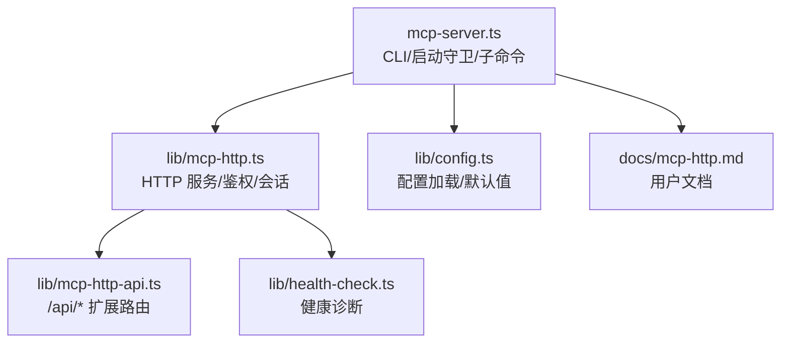
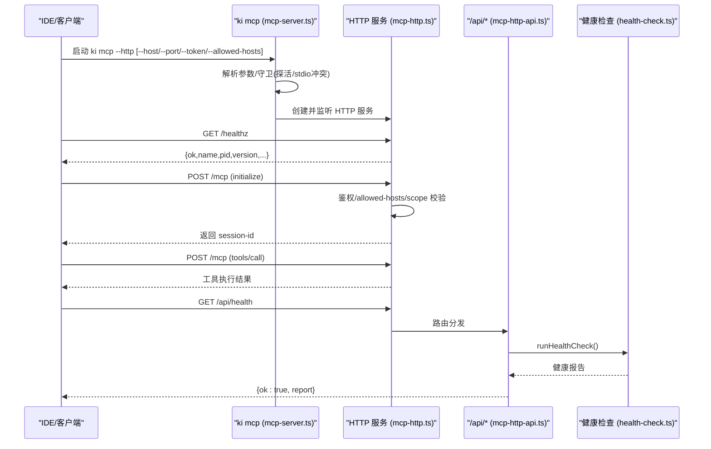
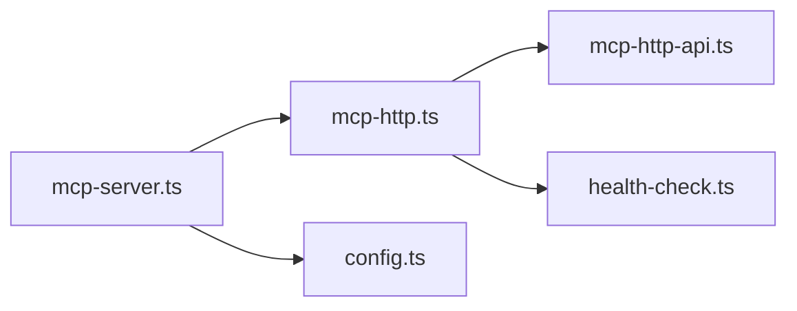

# HTTP 模式部署

<cite>
**本文引用的文件**
- [src/lib/mcp-http.ts](file://src/lib/mcp-http.ts)
- [src/lib/mcp-http-api.ts](file://src/lib/mcp-http-api.ts)
- [src/lib/health-check.ts](file://src/lib/health-check.ts)
- [src/mcp-server.ts](file://src/mcp-server.ts)
- [src/lib/config.ts](file://src/lib/config.ts)
- [docs/mcp-http.md](file://docs/mcp-http.md)
- [test/mcp-http.test.ts](file://test/mcp-http.test.ts)
</cite>

## 目录
1. [简介](#简介)
2. [项目结构](#项目结构)
3. [核心组件](#核心组件)
4. [架构总览](#架构总览)
5. [详细组件分析](#详细组件分析)
6. [依赖关系分析](#依赖关系分析)
7. [性能与容量规划](#性能与容量规划)
8. [监控与健康检查](#监控与健康检查)
9. [故障排查与恢复](#故障排查与恢复)
10. [结论](#结论)
11. [附录：部署场景配置示例](#附录部署场景配置示例)

## 简介
本文件面向“MCP 服务器 HTTP 模式”的部署与运维，聚焦以下目标：
- 解释 HTTP 共享单例模式的架构设计与启动守卫机制
- 说明主机绑定、端口、安全认证（Token）与访问控制（allowed-hosts）的配置方法
- 提供后台常驻（daemon 模式）、进程管理与健康检查接口的实践指南
- 覆盖本地开发、多 IDE 共享、生产环境等典型部署场景
- 给出实例复用逻辑、冲突检测、性能优化建议、监控指标与故障恢复策略

## 项目结构
HTTP 模式的核心由以下模块协作完成：
- mcp-server.ts：命令行入口、参数解析、启动守卫、子命令（stop/restart/token）、HTTP 模式调度
- lib/mcp-http.ts：HTTP 服务构建、鉴权中间件、会话管理、空闲回收、优雅退出、/healthz 探活
- lib/mcp-http-api.ts：/api/* 扩展路由（导入、文档列表、健康报告等），复用同一鉴权体系
- lib/health-check.ts：健康诊断（配置、目录、embedding、collection 等）
- lib/config.ts：配置文件加载与默认值（含 mcp.http 默认 host/port/allowedHosts）
- docs/mcp-http.md：用户级文档（快速开始、参数、守护、重启、会话模型、远程安全建议等）

图表来源
- [src/mcp-server.ts:492-734](file://src/mcp-server.ts#L492-L734)
- [src/lib/mcp-http.ts:363-642](file://src/lib/mcp-http.ts#L363-L642)
- [src/lib/mcp-http-api.ts:216-272](file://src/lib/mcp-http-api.ts#L216-L272)
- [src/lib/health-check.ts:150-240](file://src/lib/health-check.ts#L150-L240)
- [src/lib/config.ts:105-136](file://src/lib/config.ts#L105-L136)
- [docs/mcp-http.md:1-273](file://docs/mcp-http.md#L1-L273)

章节来源
- [src/mcp-server.ts:492-734](file://src/mcp-server.ts#L492-L734)
- [src/lib/mcp-http.ts:363-642](file://src/lib/mcp-http.ts#L363-L642)
- [src/lib/mcp-http-api.ts:216-272](file://src/lib/mcp-http-api.ts#L216-L272)
- [src/lib/health-check.ts:150-240](file://src/lib/health-check.ts#L150-L240)
- [src/lib/config.ts:105-136](file://src/lib/config.ts#L105-L136)
- [docs/mcp-http.md:1-273](file://docs/mcp-http.md#L1-L273)

## 核心组件
- 启动守卫与幂等单例
  - 启动前探测 /healthz，命中健康实例则复用并退出，避免重复持锁
  - 检测 stdio 实例 lock，防止 HTTP 与 stdio 争抢向量库锁
- HTTP 服务与会话
  - 基于 StreamableHTTPServerTransport，每个 initialize 新建 transport + McpServer
  - 会话上限保护（默认 256）、空闲回收（默认 30 分钟）
- 鉴权与访问控制
  - 回环地址免鉴权；非回环强制 Bearer Token
  - 支持 allowed-hosts 白名单缓解 DNS rebinding
  - scope 越权拦截（tools/call 与 /api/* 接口）
- 扩展 API
  - /api/health、/api/doc/list、/api/import/* 等，复用同一鉴权与 scope 校验
- 健康检查
  - 配置、目录、embedding、collection 等只读检查，供 doctor 与 /api/health 使用
- 优雅退出
  - 关闭会话、释放向量锁、关闭 HTTP 服务、清理 lock 文件，带超时兜底

章节来源
- [src/lib/mcp-http.ts:214-249](file://src/lib/mcp-http.ts#L214-L249)
- [src/lib/mcp-http.ts:363-642](file://src/lib/mcp-http.ts#L363-L642)
- [src/lib/mcp-http-api.ts:216-272](file://src/lib/mcp-http-api.ts#L216-L272)
- [src/lib/health-check.ts:150-240](file://src/lib/health-check.ts#L150-L240)
- [src/mcp-server.ts:597-699](file://src/mcp-server.ts#L597-L699)

## 架构总览
HTTP 模式以“单进程、多会话”的方式运行，所有客户端通过 URL 接入同一 MCP 服务，从而避免向量库锁冲突。

图表来源
- [src/mcp-server.ts:597-699](file://src/mcp-server.ts#L597-L699)
- [src/lib/mcp-http.ts:363-642](file://src/lib/mcp-http.ts#L363-L642)
- [src/lib/mcp-http-api.ts:216-272](file://src/lib/mcp-http-api.ts#L216-L272)
- [src/lib/health-check.ts:150-240](file://src/lib/health-check.ts#L150-L240)

## 详细组件分析

### 启动参数与配置选项
- 关键参数
  - --http：启用 HTTP 模式
  - --host：监听地址（默认 127.0.0.1，回环免鉴权）
  - --port：监听端口（默认 7423）
  - --token：全权临时 Token（进程级，优先级高于多 Token 存储；也可用环境变量 KI_MCP_TOKEN）
  - --allowed-hosts：DNS rebinding 保护 Host 头白名单
  - --web：同时提供前端静态页面（web/dist）
  - --no-web：显式关闭前端页面（restart 时覆盖上次 --web 延续）
  - --daemon/-d：仅 HTTP 模式后台常驻
  - --status：只读诊断（读取 lock + 探活，不启动服务）
- 配置文件默认值（不含 token）
  - mcp.http.host / port / allowedHosts 可在配置中预置，CLI 优先

章节来源
- [src/mcp-server.ts:84-107](file://src/mcp-server.ts#L84-L107)
- [src/mcp-server.ts:138-212](file://src/mcp-server.ts#L138-L212)
- [src/lib/config.ts:105-136](file://src/lib/config.ts#L105-L136)
- [docs/mcp-http.md:41-69](file://docs/mcp-http.md#L41-L69)

### 安全认证与访问控制
- 条件鉴权
  - 回环地址（127.0.0.1/localhost/::1）：免鉴权
  - 非回环地址（0.0.0.0/外网 IP）：强制 Bearer Token
- Token 来源优先级
  - --token/KI_MCP_TOKEN（全权临时 Token）> 多 Token 存储（~/.ki/mcp-tokens.json）
- Scope 越权校验
  - tools/call 的 arguments.scope 缺省为 default，参与校验
  - 枚举类无参工具（ki_scope_list、ki_manage_index_list）放行给工具层按授权集合过滤
  - /api/* 接口同样按 scope 参数做越权校验
- DNS rebinding 防护
  - 通过 allowed-hosts 限定 Host 头，降低风险

章节来源
- [src/lib/mcp-http.ts:476-509](file://src/lib/mcp-http.ts#L476-L509)
- [src/lib/mcp-http.ts:543-561](file://src/lib/mcp-http.ts#L543-L561)
- [src/lib/mcp-http-api.ts:222-258](file://src/lib/mcp-http-api.ts#L222-L258)
- [docs/mcp-http.md:132-146](file://docs/mcp-http.md#L132-L146)

### 启动守卫、实例复用与冲突检测
- 幂等单例
  - 启动前先探活 /healthz，命中健康 kisearch 实例则复用并退出
- stdio 冲突检测
  - 若存在存活的 stdio 实例，拒绝启动 HTTP（避免争抢向量库锁）
- 监听错误提示
  - EADDRINUSE/EACCES/EADDRNOTAVAIL/ENOTFOUND 等错误给出可诊断信息

章节来源
- [src/lib/mcp-http.ts:214-249](file://src/lib/mcp-http.ts#L214-L249)
- [src/lib/mcp-http.ts:644-665](file://src/lib/mcp-http.ts#L644-L665)
- [src/mcp-server.ts:597-658](file://src/mcp-server.ts#L597-L658)

### 会话模型与资源回收
- 每个 initialize 新建 transport + McpServer，共享 vector-client 单例 engine
- 会话上限：默认 256，超出返回 503
- 空闲回收：默认 30 分钟无活动自动关闭，防止残留会话耗尽内存
- 会话 ID 复用：POST /mcp 携带 mcp-session-id 则复用

章节来源
- [src/lib/mcp-http.ts:373-411](file://src/lib/mcp-http.ts#L373-L411)
- [src/lib/mcp-http.ts:563-612](file://src/lib/mcp-http.ts#L563-L612)
- [docs/mcp-http.md:234-242](file://docs/mcp-http.md#L234-L242)

### 扩展 API（/api/*）
- /api/health：健康报告（runHealthCheck，10s 超时）
- /api/doc/list：Group 路径+文档列表（支持 q 模糊搜索，分页上限 500，缓存）
- /api/import/upload：上传文件到受控目录，返回 uploadId
- /api/import/run：触发导入（异步 job，返回 jobId）
- /api/import/status：查询导入进度/结果

章节来源
- [src/lib/mcp-http-api.ts:31-43](file://src/lib/mcp-http-api.ts#L31-L43)
- [src/lib/mcp-http-api.ts:216-272](file://src/lib/mcp-http-api.ts#L216-L272)
- [src/lib/mcp-http-api.ts:276-369](file://src/lib/mcp-http-api.ts#L276-L369)
- [src/lib/mcp-http-api.ts:371-564](file://src/lib/mcp-http-api.ts#L371-L564)

### 健康检查
- 检查项：配置文件、字段告警、dataDir/backupDir/vectorDir、apiKey、embedding 连通性/密钥/维度、zvec collection、scopes.default
- 超时与重试：embedding 请求 8s 超时、重试 1 次，容忍瞬时抖动
- 输出：结构化报告，供 /api/health 与 doctor 共用

章节来源
- [src/lib/health-check.ts:1-15](file://src/lib/health-check.ts#L1-L15)
- [src/lib/health-check.ts:54-144](file://src/lib/health-check.ts#L54-L144)
- [src/lib/health-check.ts:150-240](file://src/lib/health-check.ts#L150-L240)

### 优雅退出与守护进程
- 优雅退出：关闭会话、释放向量锁、关闭 HTTP、删除 lock 文件，带 5 秒兜底超时
- 守护进程：--daemon 脱离终端，SSH 断开后仍存活；restart 仅 HTTP 模式，后台常驻重启

章节来源
- [src/lib/mcp-http.ts:769-800](file://src/lib/mcp-http.ts#L769-L800)
- [src/mcp-server.ts:391-490](file://src/mcp-server.ts#L391-L490)
- [docs/mcp-http.md:191-223](file://docs/mcp-http.md#L191-L223)

## 依赖关系分析
- 启动流程依赖
  - mcp-server.ts 负责参数解析、守卫、子命令，最终调用 startHttpMcpServer
  - mcp-http.ts 构建 HTTP 服务，注册 /healthz、/api/*、/mcp 路由
  - mcp-http-api.ts 实现扩展 API，复用鉴权与 scope 校验
  - health-check.ts 提供健康诊断能力
  - config.ts 提供 mcp.http 默认值与配置加载

图表来源
- [src/mcp-server.ts:492-734](file://src/mcp-server.ts#L492-L734)
- [src/lib/mcp-http.ts:363-642](file://src/lib/mcp-http.ts#L363-L642)
- [src/lib/mcp-http-api.ts:216-272](file://src/lib/mcp-http-api.ts#L216-L272)
- [src/lib/health-check.ts:150-240](file://src/lib/health-check.ts#L150-L240)
- [src/lib/config.ts:105-136](file://src/lib/config.ts#L105-L136)

章节来源
- [src/mcp-server.ts:492-734](file://src/mcp-server.ts#L492-L734)
- [src/lib/mcp-http.ts:363-642](file://src/lib/mcp-http.ts#L363-L642)
- [src/lib/mcp-http-api.ts:216-272](file://src/lib/mcp-http-api.ts#L216-L272)
- [src/lib/health-check.ts:150-240](file://src/lib/health-check.ts#L150-L240)
- [src/lib/config.ts:105-136](file://src/lib/config.ts#L105-L136)

## 性能与容量规划
- 会话上限与空闲回收
  - 默认最大并发会话 256，空闲 30 分钟回收，避免内存泄漏
- 请求体大小限制
  - JSON 请求体上限 16MB，防止滥用
- 导入任务队列
  - 内存 Map 管理 job，最多 50 个，过期 1 小时清理
- 文档列表缓存
  - 基于 relations-cache 的 mtime/size 缓存，减少重复扫描
- 健康检查超时
  - embedding 健康检查 8s 超时、重试 1 次，避免阻塞启动

章节来源
- [src/lib/mcp-http.ts:47-57](file://src/lib/mcp-http.ts#L47-L57)
- [src/lib/mcp-http.ts:166-192](file://src/lib/mcp-http.ts#L166-L192)
- [src/lib/mcp-http-api.ts:49-86](file://src/lib/mcp-http-api.ts#L49-L86)
- [src/lib/mcp-http-api.ts:154-199](file://src/lib/mcp-http-api.ts#L154-L199)
- [src/lib/health-check.ts:54-144](file://src/lib/health-check.ts#L54-L144)

## 监控与健康检查
- /healthz（免鉴权）
  - 返回 ok/name/pid/version/host/port/authFailures（非回环模式下）
- /api/health
  - 返回完整健康报告（配置、目录、embedding、collection 等）
- 状态诊断
  - ki mcp --status：读取 lock + 探活，输出 JSON（含 stdioInstances、managedTokens.count）
- 鉴权失败计数
  - /healthz 中的 authFailures 便于发现客户端 Token 配置错误

章节来源
- [src/lib/mcp-http.ts:202-249](file://src/lib/mcp-http.ts#L202-L249)
- [src/lib/mcp-http-api.ts:276-288](file://src/lib/mcp-http-api.ts#L276-L288)
- [src/lib/mcp-http.ts:667-705](file://src/lib/mcp-http.ts#L667-L705)
- [docs/mcp-http.md:105-131](file://docs/mcp-http.md#L105-L131)

## 故障排查与恢复
- 常见错误
  - 端口占用（EADDRINUSE）：探活未命中健康实例，需更换端口或排查占用进程
  - 权限不足（EACCES）：<1024 端口需提权，建议使用高位端口
  - 地址不可用（EADDRNOTAVAIL）：本机不存在该地址
  - 无法解析主机（ENOTFOUND）：检查 host 是否为合法 IP 或可解析主机名
- 鉴权问题
  - 401：Token 无效或缺失，核对 Authorization: Bearer 与托管 Token 明文一致
  - 403：scope 越权，确认 Token 授权范围或客户端请求 scope
- 进程与锁
  - 一键关闭：ki mcp stop（定位真实服务进程，发 SIGTERM，超时 SIGKILL，清理 lock）
  - 守护进程：--daemon 后台常驻；restart 仅 HTTP 模式，后台常驻重启
- 优雅退出
  - 收到 SIGINT/SIGTERM 后关闭会话、释放向量锁、关闭 HTTP、删除 lock 文件，带 5 秒兜底超时

章节来源
- [src/lib/mcp-http.ts:644-665](file://src/lib/mcp-http.ts#L644-L665)
- [src/lib/mcp-http.ts:769-800](file://src/lib/mcp-http.ts#L769-L800)
- [docs/mcp-http.md:170-233](file://docs/mcp-http.md#L170-L233)

## 结论
HTTP 模式通过“单进程、多会话”的设计，从根本上解决了多 IDE 共享向量库时的锁冲突问题。其启动守卫、鉴权与访问控制、会话回收、健康检查与优雅退出等机制，为本地开发、多 IDE 共享与生产部署提供了稳定可靠的基线。结合合理的性能调优与监控策略，可在不同规模环境中稳定运行。

## 附录：部署场景配置示例

### 本地开发环境
- 目标：本机免鉴权、零网络暴露
- 启动：ki mcp --http
- 说明：默认 host=127.0.0.1，无需 Token；IDE 配置 url=http://127.0.0.1:7423/mcp

章节来源
- [docs/mcp-http.md:11-39](file://docs/mcp-http.md#L11-L39)
- [src/mcp-server.ts:84-107](file://src/mcp-server.ts#L84-L107)

### 多 IDE 共享
- 目标：多台 IDE 共享同一持锁进程
- 启动：ki mcp --http --host 0.0.0.0 --port 7423（需 Token）
- 说明：非回环绑定强制鉴权；所有 IDE 必须使用完全一致的 URL；避免混用 stdio

章节来源
- [docs/mcp-http.md:19-39](file://docs/mcp-http.md#L19-L39)
- [src/mcp-server.ts:186-212](file://src/mcp-server.ts#L186-L212)

### 生产环境部署
- 目标：远程暴露、安全加固、后台常驻
- 启动：ki mcp --http --host 0.0.0.0 --port 7423 --token <t> --allowed-hosts ide.example.com --daemon
- 说明：前置 TLS 反向代理；防火墙收敛来源 IP；Token 推荐托管；定期查看 /healthz 与 /api/health

章节来源
- [docs/mcp-http.md:243-248](file://docs/mcp-http.md#L243-L248)
- [src/lib/mcp-http.ts:476-509](file://src/lib/mcp-http.ts#L476-L509)
- [src/lib/mcp-http-api.ts:276-288](file://src/lib/mcp-http-api.ts#L276-L288)