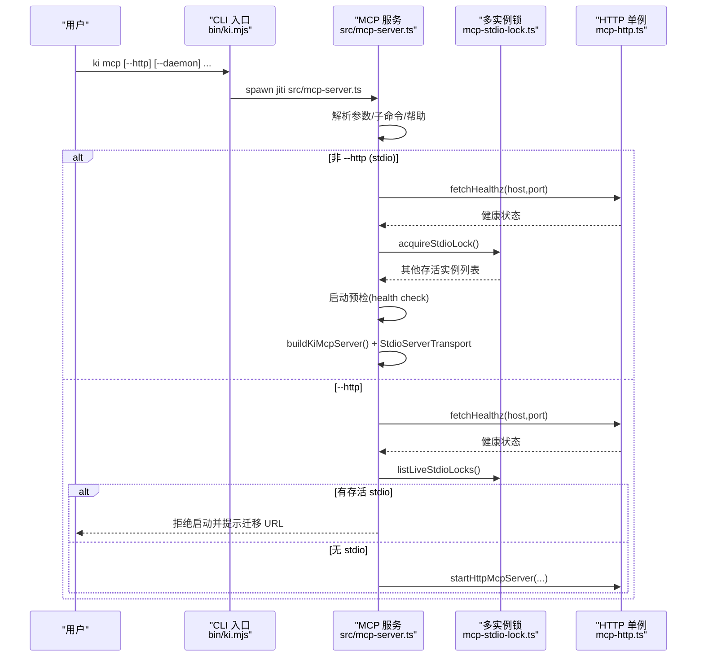
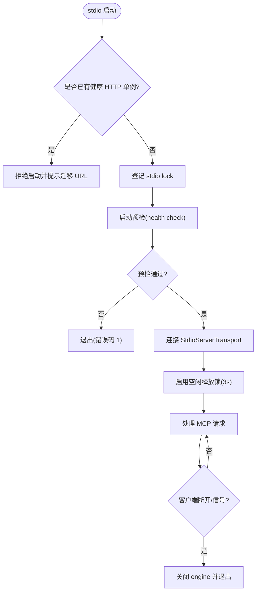
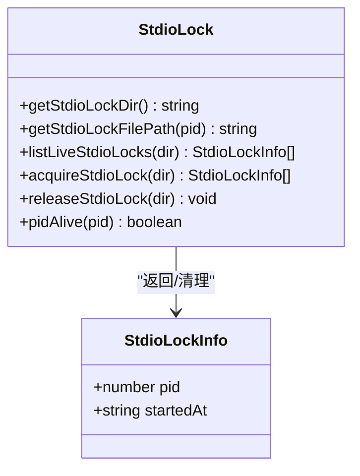
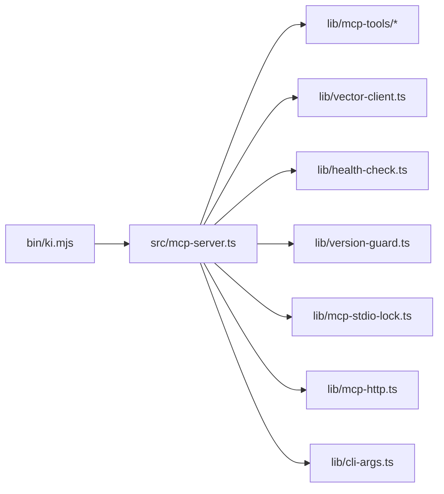
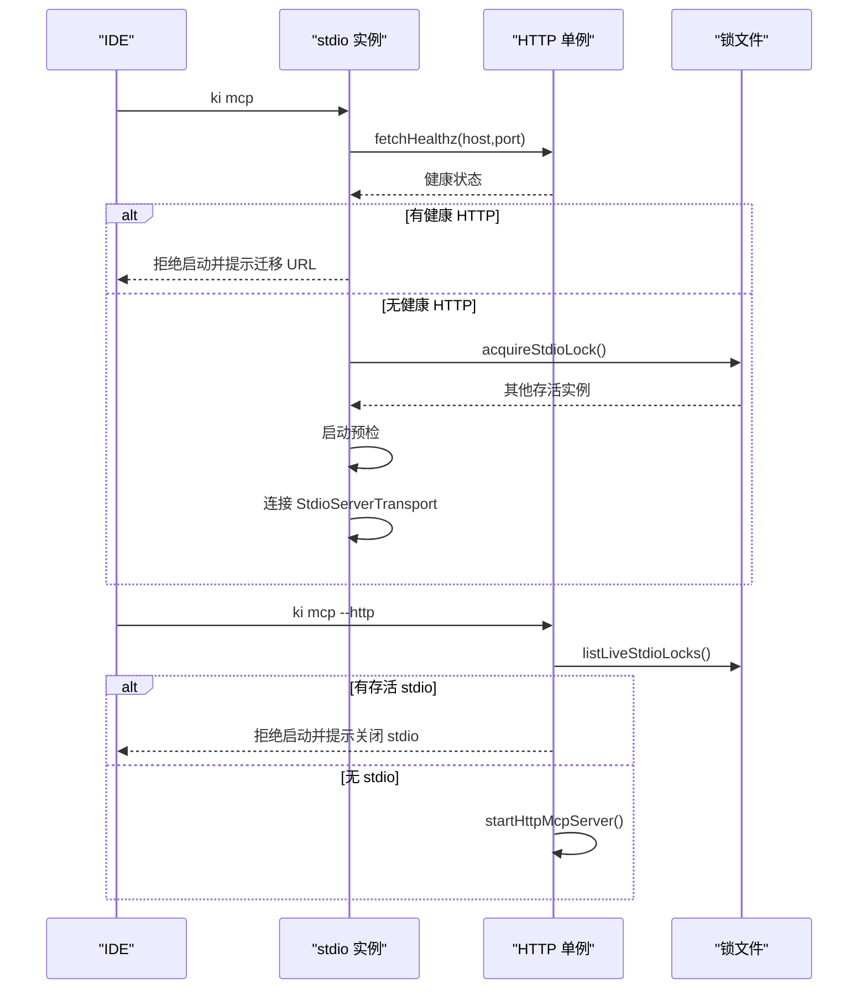

# STDIO 模式部署

<cite>
**本文引用的文件**
- [src/mcp-server.ts](file://src/mcp-server.ts)
- [src/lib/mcp-stdio-lock.ts](file://src/lib/mcp-stdio-lock.ts)
- [src/lib/cli-args.ts](file://src/lib/cli-args.ts)
- [bin/ki.mjs](file://bin/ki.mjs)
- [src/lib/mcp-http.ts](file://src/lib/mcp-http.ts)
- [docs/mcp-http.md](file://docs/mcp-http.md)
- [docs/cli.md](file://docs/cli.md)
</cite>

## 目录
1. [简介](#简介)
2. [项目结构](#项目结构)
3. [核心组件](#核心组件)
4. [架构总览](#架构总览)
5. [详细组件分析](#详细组件分析)
6. [依赖关系分析](#依赖关系分析)
7. [性能与并发特性](#性能与并发特性)
8. [IDE 集成配置示例](#ide-集成配置示例)
9. [命令行参数与启动流程](#命令行参数与启动流程)
10. [冲突检测、锁管理与进程间协调](#冲突检测锁管理与进程间协调)
11. [常见问题排查](#常见问题排查)
12. [结论](#结论)

## 简介
本文件面向在本地或服务器部署 MCP 服务器的用户，聚焦 stdio 模式的启动方式、工作原理、适用场景，以及与 HTTP 共享单例模式的冲突检测、锁文件管理和进程间协调机制。文档同时给出 IDE 集成配置示例、命令行参数用法和完整启动流程，并提供常见部署问题的排查方法（端口冲突、锁文件残留、进程异常退出等）。

## 项目结构
- CLI 入口：bin/ki.mjs 负责命令分发与守护进程拉起
- MCP 服务：src/mcp-server.ts 实现 stdio/HTTP 双模式启动、守卫、预检、工具注册
- 多实例锁管理：src/lib/mcp-stdio-lock.ts 提供每实例独立 lock 文件、存活探测、陈旧锁清理
- HTTP 共享单例：src/lib/mcp-http.ts 提供 Streamable HTTP 传输、鉴权、单例守护
- 公共校验：src/lib/cli-args.ts 提供未知参数检测、统一错误输出、整数解析
- 文档：docs/mcp-http.md、docs/cli.md 提供使用说明与命令参考

**图表来源**
- [bin/ki.mjs:28-49](file://bin/ki.mjs#L28-L49)
- [src/mcp-server.ts:49-71](file://src/mcp-server.ts#L49-L71)
- [src/lib/mcp-stdio-lock.ts:20-33](file://src/lib/mcp-stdio-lock.ts#L20-L33)
- [src/lib/mcp-http.ts:37-62](file://src/lib/mcp-http.ts#L37-L62)
- [src/lib/cli-args.ts:10-18](file://src/lib/cli-args.ts#L10-L18)

**章节来源**
- [bin/ki.mjs:28-49](file://bin/ki.mjs#L28-L49)
- [src/mcp-server.ts:49-71](file://src/mcp-server.ts#L49-L71)

## 核心组件
- MCP 服务构建器：buildKiMcpServer 注册全部工具，供 stdio 与 HTTP 复用
- 启动守卫：stdio 模式拒绝与 HTTP 单例并存；HTTP 模式拒绝与 stdio 并存
- 多实例锁：每个 stdio 实例登记独立 lock 文件，支持 stop/restart/status 定位
- 空闲释放锁：常驻进程空闲超时后自动 closeEngine 释放向量库锁，支持错开共享
- 参数校验：未知参数检测、统一 JSON 错误输出、整数参数范围校验

**章节来源**
- [src/mcp-server.ts:49-71](file://src/mcp-server.ts#L49-L71)
- [src/mcp-server.ts:597-658](file://src/mcp-server.ts#L597-L658)
- [src/lib/mcp-stdio-lock.ts:100-144](file://src/lib/mcp-stdio-lock.ts#L100-L144)
- [src/lib/cli-args.ts:77-106](file://src/lib/cli-args.ts#L77-L106)

## 架构总览
下图展示 stdio 模式与 HTTP 共享单例的启动路径、冲突检测与锁管理机制。

**图表来源**
- [bin/ki.mjs:154-198](file://bin/ki.mjs#L154-L198)
- [src/mcp-server.ts:492-658](file://src/mcp-server.ts#L492-L658)
- [src/lib/mcp-http.ts:147-156](file://src/lib/mcp-http.ts#L147-L156)
- [src/lib/mcp-stdio-lock.ts:100-144](file://src/lib/mcp-stdio-lock.ts#L100-L144)

## 详细组件分析

### stdio 模式启动与运行
- 默认行为：ki mcp 进入 stdio 模式，通过 StdioServerTransport 与客户端通信
- 启动守卫：
  - 若检测到健康 HTTP 单例，拒绝启动并提示改为 URL 型接入
  - 登记自身 stdio lock（~/.ki/mcp-stdio-<pid>.lock），返回其他存活实例仅提示不阻断
- 预检：执行健康检查，失败则拒绝启动并输出诊断信息
- 长驻优化：启用向量库空闲释放锁（VECTOR_IDLE_CLOSE_MS=3000ms），空闲后自动 closeEngine 释放 LOCK，支持多实例错开共享
- 优雅退出：SIGINT/SIGTERM/transport.onclose 触发关闭流程，释放 engine 并退出

**图表来源**
- [src/mcp-server.ts:620-658](file://src/mcp-server.ts#L620-L658)
- [src/mcp-server.ts:660-733](file://src/mcp-server.ts#L660-L733)

**章节来源**
- [src/mcp-server.ts:620-733](file://src/mcp-server.ts#L620-L733)

### 多实例锁管理
- 每实例独立 lock 文件：~/.ki/mcp-stdio-<pid>.lock，文件名即 pid，天然支持多实例登记
- 存活探测：signal 0 探测，EPERM 视为存活；读取时自动清理陈旧锁
- 登记与释放：acquireStdioLock 原子独占写入，releaseStdioLock 删除自身文件
- 用途：stop/restart/status 定位多实例；HTTP 启动前检测 stdio 冲突

**图表来源**
- [src/lib/mcp-stdio-lock.ts:20-33](file://src/lib/mcp-stdio-lock.ts#L20-L33)
- [src/lib/mcp-stdio-lock.ts:100-144](file://src/lib/mcp-stdio-lock.ts#L100-L144)

**章节来源**
- [src/lib/mcp-stdio-lock.ts:20-33](file://src/lib/mcp-stdio-lock.ts#L20-L33)
- [src/lib/mcp-stdio-lock.ts:100-144](file://src/lib/mcp-stdio-lock.ts#L100-L144)

### HTTP 共享单例与冲突检测
- 探活复用：重复执行 ki mcp --http 会探活 /healthz，命中健康实例则复用退出
- stdio 冲突：HTTP 启动前检测存活 stdio 实例，拒绝启动并提示迁移 URL
- 鉴权策略：回环绑定免鉴权，非回环绑定强制 Token（--token/KI_MCP_TOKEN/多 Token 存储）
- 单例守护：监听成功后写 lock 文件（~/.ki/mcp-http.lock），退出时清理

**章节来源**
- [src/lib/mcp-http.ts:147-156](file://src/lib/mcp-http.ts#L147-L156)
- [src/mcp-server.ts:600-619](file://src/mcp-server.ts#L600-L619)

### 参数校验与错误契约
- 未知参数检测：detectUnknownFlags 发现未知 --flag 并输出帮助与 JSON 错误
- 统一错误输出：failJson 输出 { ok:false, error, code? } 并 exit(1)
- 整数参数解析：parseIntArg 支持 min/max 校验与警告回退

**章节来源**
- [src/lib/cli-args.ts:77-106](file://src/lib/cli-args.ts#L77-L106)
- [src/lib/cli-args.ts:117-134](file://src/lib/cli-args.ts#L117-L134)

## 依赖关系分析
- CLI 入口依赖命令映射，将 ki mcp 转发到 src/mcp-server.ts
- MCP 服务依赖：
  - 工具注册模块（lib/mcp-tools/*）
  - 向量客户端（vector-client）用于惰性打开与空闲释放
  - 健康检查（health-check）用于启动预检
  - 版本守卫（version-guard）用于升级提示
  - 多实例锁（mcp-stdio-lock）用于进程管理
  - HTTP 单例（mcp-http）用于共享模式
  - 参数校验（cli-args）用于健壮性

**图表来源**
- [bin/ki.mjs:28-49](file://bin/ki.mjs#L28-L49)
- [src/mcp-server.ts:5-35](file://src/mcp-server.ts#L5-L35)

**章节来源**
- [bin/ki.mjs:28-49](file://bin/ki.mjs#L28-L49)
- [src/mcp-server.ts:5-35](file://src/mcp-server.ts#L5-L35)

## 性能与并发特性
- 惰性打开：engine 在首次向量调用时打开，跨请求复用，避免 per-call 开销
- 空闲释放锁：常驻进程空闲超时（3s）后自动 closeEngine 释放 LOCK，降低资源占用
- 撞锁重试：probeWithRetry 检测到 locked 时等待 2s 重试最多 3 次（总等待 6s）
- 多实例错开共享：多个 stdio 实例可共享同一向量库，错开使用时互不影响，同时使用短暂等待
- 会话限制：HTTP 模式限制最大并发会话数（DEFAULT_MAX_SESSIONS=256）与空闲超时（30min）

**章节来源**
- [src/mcp-server.ts:683-685](file://src/mcp-server.ts#L683-L685)
- [docs/mcp-http.md:9](file://docs/mcp-http.md#L9)
- [src/lib/mcp-http.ts:47-54](file://src/lib/mcp-http.ts#L47-L54)

## IDE 集成配置示例
- stdio 模式：适用于单客户端单进程场景，IDE 通过 command 启动 ki mcp
- HTTP 模式：适用于多 IDE 共享同一持锁进程，IDE 通过 url 接入 http://host:port/mcp

注意：
- 多个 IDE 共享同一持锁进程以避免向量库锁冲突，请使用 ki mcp --http
- 所有 IDE 必须使用完全一致的连接 URL，避免各自拉起独立进程导致锁冲突
- 不要再保留任何 IDE 的 stdio command: ki mcp 配置，混用会与 HTTP 单例争抢向量库锁

**章节来源**
- [docs/mcp-http.md:5-9](file://docs/mcp-http.md#L5-L9)
- [docs/mcp-http.md:24-39](file://docs/mcp-http.md#L24-L39)

## 命令行参数与启动流程
- 基本命令：
  - ki mcp：stdio 模式（默认）
  - ki mcp --http：HTTP 共享单例（默认 127.0.0.1:7423，回环免鉴权）
  - ki mcp --http --daemon：后台常驻运行
  - ki mcp restart：重启 HTTP 单例（仅 HTTP 模式）
  - ki mcp --status：查看 HTTP 单例运行状态（只读）
  - ki mcp stop：关闭本机所有 ki mcp 实例并清理 lock
- 参数优先级：CLI > 配置文件 > 默认值
- 启动流程：
  1. 解析参数与子命令
  2. 启动守卫（stdio/HTTP 冲突检测）
  3. 启动预检（health check）
  4. 启动传输（stdio 或 HTTP）
  5. 注册工具并处理请求

**章节来源**
- [docs/cli.md:916-931](file://docs/cli.md#L916-L931)
- [src/mcp-server.ts:83-107](file://src/mcp-server.ts#L83-L107)
- [src/mcp-server.ts:492-658](file://src/mcp-server.ts#L492-L658)

## 冲突检测、锁管理与进程间协调
- stdio 与 HTTP 冲突检测：
  - stdio 启动时检测健康 HTTP 单例 → 拒绝启动并提示迁移 URL
  - HTTP 启动时检测存活 stdio 实例 → 拒绝启动并提示关闭 stdio
- 锁文件管理：
  - stdio：~/.ki/mcp-stdio-<pid>.lock（每实例独立）
  - HTTP：~/.ki/mcp-http.lock（单例）
  - 陈旧锁自动清理：读取时进行 pid 存活校验，已死进程锁自动删除
- 进程间协调：
  - 空闲释放锁：常驻进程空闲超时后自动 closeEngine 释放 LOCK
  - 撞锁重试：probeWithRetry 检测 locked 时等待并重试
  - 一键关闭：ki mcp stop 定位并关闭所有实例，清理残留 lock

**图表来源**
- [src/mcp-server.ts:620-658](file://src/mcp-server.ts#L620-L658)
- [src/lib/mcp-stdio-lock.ts:100-144](file://src/lib/mcp-stdio-lock.ts#L100-L144)
- [src/lib/mcp-http.ts:147-156](file://src/lib/mcp-http.ts#L147-L156)

**章节来源**
- [src/mcp-server.ts:620-658](file://src/mcp-server.ts#L620-L658)
- [src/lib/mcp-stdio-lock.ts:100-144](file://src/lib/mcp-stdio-lock.ts#L100-L144)
- [src/lib/mcp-http.ts:147-156](file://src/lib/mcp-http.ts#L147-L156)

## 常见问题排查
- 端口冲突：
  - 现象：EADDRINUSE 错误
  - 解决：更换端口或停止占用进程；使用 ki mcp --status 确认当前实例
- 锁文件残留：
  - 现象：ki mcp stop 无法定位进程；--status 显示陈旧 lock
  - 解决：手动删除 ~/.ki/mcp-stdio-*.lock 或 ~/.ki/mcp-http.lock；下次启动会自动清理
- 进程异常退出：
  - 现象：进程被 kill -9 导致锁未释放
  - 解决：使用 ki mcp stop 清理残留 lock；检查是否有 IDE 自动重启 stdio 实例
- 鉴权问题：
  - 现象：非回环绑定缺少 Token 导致启动失败
  - 解决：生成 Token（ki mcp token generate --scope <...>）或设置环境变量 KI_MCP_TOKEN
- 多实例冲突：
  - 现象：多个 IDE 使用 stdio 导致向量库锁冲突
  - 解决：迁移为 HTTP 单例模式（ki mcp --http），IDE 改用 URL 型接入

**章节来源**
- [docs/mcp-http.md:170-189](file://docs/mcp-http.md#L170-L189)
- [src/lib/mcp-stdio-lock.ts:78-98](file://src/lib/mcp-stdio-lock.ts#L78-L98)
- [src/mcp-server.ts:190-202](file://src/mcp-server.ts#L190-L202)

## 结论
stdio 模式适用于单客户端单进程场景，具备完善的启动守卫、预检机制和多实例锁管理。通过空闲释放锁和撞锁重试，多个 stdio 实例可错开共享同一向量库。对于多 IDE 共享场景，推荐使用 HTTP 共享单例模式以彻底消除锁冲突。部署时应遵循冲突检测机制，合理使用锁文件和进程管理命令，确保系统稳定运行。