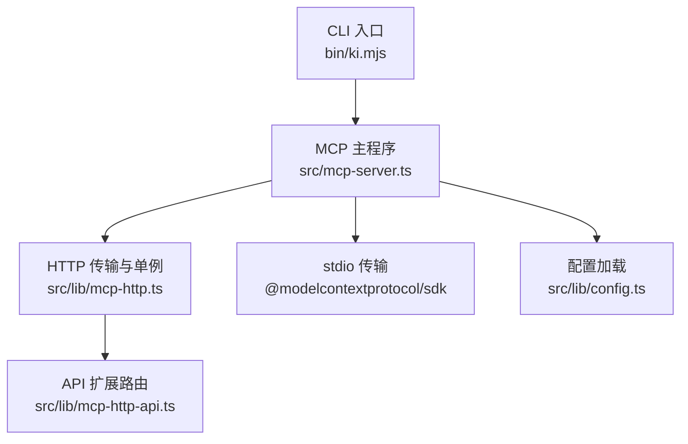
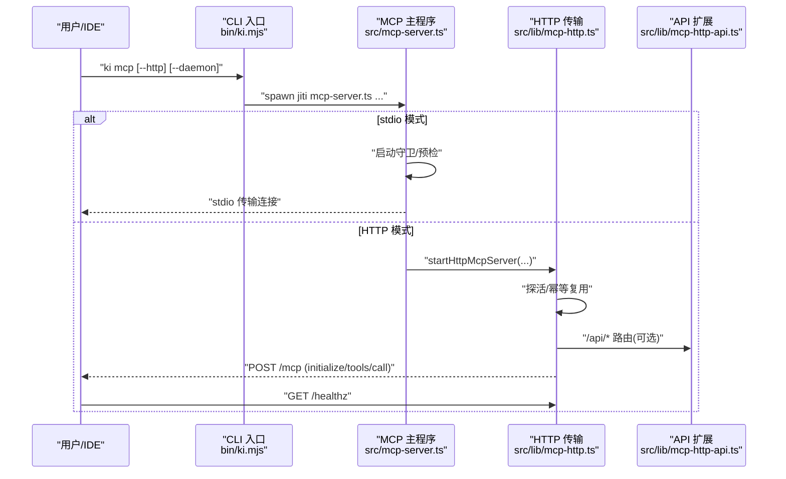
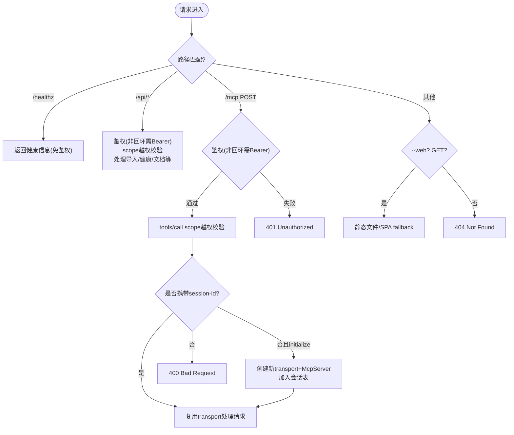
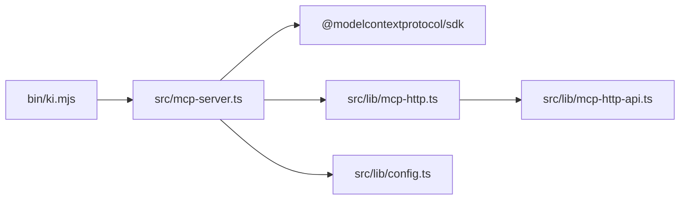

# 服务器部署与配置

<cite>
**本文引用的文件**
- [src/mcp-server.ts](file://src/mcp-server.ts)
- [src/lib/mcp-http.ts](file://src/lib/mcp-http.ts)
- [src/lib/mcp-http-api.ts](file://src/lib/mcp-http-api.ts)
- [bin/ki.mjs](file://bin/ki.mjs)
- [docs/mcp-http.md](file://docs/mcp-http.md)
- [docs/configuration.md](file://docs/configuration.md)
- [src/lib/config.ts](file://src/lib/config.ts)
</cite>

## 目录
1. [简介](#简介)
2. [项目结构](#项目结构)
3. [核心组件](#核心组件)
4. [架构总览](#架构总览)
5. [详细组件分析](#详细组件分析)
6. [依赖关系分析](#依赖关系分析)
7. [性能考虑](#性能考虑)
8. [故障排查指南](#故障排查指南)
9. [结论](#结论)
10. [附录](#附录)

## 简介
本文件面向 MCP 服务器的部署与配置，覆盖以下目标：
- stdio 模式与 HTTP 模式的启动方式、参数与环境要求
- HTTP 共享单例模式的部署方案（端口、主机绑定、安全）
- 后台常驻运行（daemon 模式）、进程管理与健康检查
- 不同场景的配置示例（本地开发、多 IDE 共享、生产环境）
- 配置文件结构、环境变量与命令行参数用法
- 常见部署问题排查与性能优化建议

## 项目结构
MCP 服务由 CLI 入口分发到具体实现：
- CLI 入口：bin/ki.mjs 负责命令路由、版本/帮助输出、子进程执行与 daemon 模式控制
- MCP 服务端：src/mcp-server.ts 解析参数、守卫冲突检测、预检、启动 stdio 或 HTTP
- HTTP 传输与单例：src/lib/mcp-http.ts 提供 Streamable HTTP 传输、鉴权、会话管理、/healthz、静态页面与 /api/* 扩展
- API 扩展：src/lib/mcp-http-api.ts 提供导入、文档列表、健康报告等扩展接口
- 配置系统：src/lib/config.ts + docs/configuration.md 定义配置查找顺序、字段与默认值（含 mcp.http）

图表来源
- [bin/ki.mjs:28-49](file://bin/ki.mjs#L28-L49)
- [src/mcp-server.ts:492-734](file://src/mcp-server.ts#L492-L734)
- [src/lib/mcp-http.ts:363-800](file://src/lib/mcp-http.ts#L363-L800)
- [src/lib/mcp-http-api.ts:216-272](file://src/lib/mcp-http-api.ts#L216-L272)
- [src/lib/config.ts:156-183](file://src/lib/config.ts#L156-L183)

章节来源
- [bin/ki.mjs:28-49](file://bin/ki.mjs#L28-L49)
- [src/mcp-server.ts:492-734](file://src/mcp-server.ts#L492-L734)
- [src/lib/mcp-http.ts:363-800](file://src/lib/mcp-http.ts#L363-L800)
- [src/lib/mcp-http-api.ts:216-272](file://src/lib/mcp-http-api.ts#L216-L272)
- [src/lib/config.ts:156-183](file://src/lib/config.ts#L156-L183)
- [docs/configuration.md:166-179](file://docs/configuration.md#L166-L179)

## 核心组件
- CLI 入口 ki.mjs：命令映射、全局 --config、daemon 模式子进程隔离与存活探测、信号转发
- MCP 主程序 mcp-server.ts：参数解析、启动守卫（HTTP/stdio 互斥与锁冲突）、预检、构建工具集、启动 stdio 或 HTTP
- HTTP 传输 mcp-http.ts：Streamable HTTP 传输、鉴权（回环免鉴权/非回环强制 Token）、会话上限与空闲回收、/healthz、静态页面、/api/* 扩展
- API 扩展 mcp-http-api.ts：/api/health、/api/doc/list、/api/import/* 等扩展能力
- 配置 config.ts：配置查找优先级、mcp.http 默认值（host/port/allowedHosts），Token 不入配置

章节来源
- [bin/ki.mjs:148-198](file://bin/ki.mjs#L148-L198)
- [src/mcp-server.ts:73-212](file://src/mcp-server.ts#L73-L212)
- [src/lib/mcp-http.ts:37-85](file://src/lib/mcp-http.ts#L37-L85)
- [src/lib/mcp-http-api.ts:31-43](file://src/lib/mcp-http-api.ts#L31-L43)
- [src/lib/config.ts:105-114](file://src/lib/config.ts#L105-L114)

## 架构总览
下图展示从 CLI 到 MCP 服务的完整调用链，包括守护进程、HTTP 单例、鉴权与会话生命周期。

图表来源
- [bin/ki.mjs:155-198](file://bin/ki.mjs#L155-L198)
- [src/mcp-server.ts:492-734](file://src/mcp-server.ts#L492-L734)
- [src/lib/mcp-http.ts:711-800](file://src/lib/mcp-http.ts#L711-L800)
- [src/lib/mcp-http-api.ts:216-272](file://src/lib/mcp-http-api.ts#L216-L272)

## 详细组件分析

### 启动模式与参数
- stdio 模式（默认）
  - 命令：ki mcp
  - 行为：注册全部工具，使用 StdioServerTransport 与客户端通信；支持多实例错开共享向量库（空闲释放锁+撞锁重试）
  - 启动守卫：若检测到已有健康 HTTP 单例，拒绝启动并提示迁移为 URL 接入
- HTTP 模式（共享单例）
  - 命令：ki mcp --http [--host <addr>] [--port <n>] [--token <t>] [--allowed-hosts <a,b>] [--web] [--no-web] [--daemon|-d]
  - 行为：Streamable HTTP 传输，每个 initialize 新建会话，共享模块级 vector-client engine（单进程单锁）
  - 鉴权：回环地址免鉴权；非回环地址强制 Bearer Token（--token/KI_MCP_TOKEN > 多 Token 存储）
  - 会话：最大并发会话数默认 256；空闲超时默认 30 分钟；定期回收
  - 健康：/healthz 返回 ok/name/pid/version/host/port/authFailures
  - 前端：--web 提供 web/dist 静态页面（SPA fallback）
  - 守护：--daemon 后台常驻（脱离终端），父进程立即退出；restart 子命令可后台重启

章节来源
- [src/mcp-server.ts:83-107](file://src/mcp-server.ts#L83-L107)
- [src/mcp-server.ts:137-212](file://src/mcp-server.ts#L137-L212)
- [src/mcp-server.ts:492-734](file://src/mcp-server.ts#L492-L734)
- [src/lib/mcp-http.ts:37-85](file://src/lib/mcp-http.ts#L37-L85)
- [src/lib/mcp-http.ts:413-642](file://src/lib/mcp-http.ts#L413-L642)
- [docs/mcp-http.md:41-68](file://docs/mcp-http.md#L41-L68)

### HTTP 共享单例与鉴权流程

图表来源
- [src/lib/mcp-http.ts:413-642](file://src/lib/mcp-http.ts#L413-L642)
- [src/lib/mcp-http-api.ts:216-272](file://src/lib/mcp-http-api.ts#L216-L272)

章节来源
- [src/lib/mcp-http.ts:413-642](file://src/lib/mcp-http.ts#L413-L642)
- [src/lib/mcp-http-api.ts:216-272](file://src/lib/mcp-http-api.ts#L216-L272)

### 守护进程与进程管理
- 后台常驻（--daemon/-d）
  - 仅 HTTP 模式有效；stdio 模式不支持后台运行（会丢失 stdin/stdout 通道）
  - 父进程通过 spawn npx jiti ... 以 detached + stdio ignore 启动子进程，unref 后立即退出
  - 启动期存活探测：若子进程在预检阶段退出，父进程报错并提示前台运行查看错误
- 一键关闭（stop）
  - 定位所有 ki mcp 实例（stdio lock + http lock + healthz 兜底）
  - 身份校验后发送 SIGTERM 优雅退出，超时 SIGKILL 兜底，清理残留 lock
- 重启（restart）
  - 仅 HTTP 模式；先关闭现有实例，再以守护进程方式后台重启
  - host/port/web 延续上次运行值（lock 文件），未显式指定时补齐；透传其余参数

章节来源
- [bin/ki.mjs:155-198](file://bin/ki.mjs#L155-L198)
- [src/mcp-server.ts:391-490](file://src/mcp-server.ts#L391-L490)
- [docs/mcp-http.md:191-233](file://docs/mcp-http.md#L191-L233)

### 健康检查与状态诊断
- /healthz：返回 ok/name/pid/version/host/port/authFailures，用于幂等单例探活与运维监控
- ki mcp --status：读取 HTTP lock + stdio 多实例 lock + 探活，输出 JSON 报告（含 managedTokens.count）
- /api/health：ki doctor 健康报告（runHealthCheck），带超时保护

章节来源
- [src/lib/mcp-http.ts:202-249](file://src/lib/mcp-http.ts#L202-L249)
- [src/lib/mcp-http.ts:667-705](file://src/lib/mcp-http.ts#L667-L705)
- [src/lib/mcp-http-api.ts:274-288](file://src/lib/mcp-http-api.ts#L274-L288)
- [docs/mcp-http.md:105-131](file://docs/mcp-http.md#L105-L131)

### 配置系统与环境变量
- 配置文件查找优先级：--config > KI_CONFIG_PATH > ~/.ki/config.yaml/yml/json > 内置默认
- mcp.http 默认值：host（127.0.0.1）、port（7423）、allowedHosts（可选）
- 生效优先级：CLI 参数 > mcp.http 配置 > 内置默认
- Token 不写入配置文件，只走 CLI 参数或环境变量（KI_MCP_TOKEN）或多 Token 存储
- 数据/备份/向量目录默认落 ~/.ki

章节来源
- [docs/configuration.md:7-18](file://docs/configuration.md#L7-L18)
- [docs/configuration.md:166-179](file://docs/configuration.md#L166-L179)
- [src/lib/config.ts:156-183](file://src/lib/config.ts#L156-L183)
- [src/lib/config.ts:105-114](file://src/lib/config.ts#L105-L114)

### 部署场景与示例
- 本地开发（stdio）
  - 命令：ki mcp
  - 说明：单客户端单进程；多个 stdio 实例可错开共享向量库（空闲释放锁+撞锁重试）
- 多 IDE 共享（HTTP 单例）
  - 命令：ki mcp --http（默认 127.0.0.1:7423，免鉴权）
  - IDE 配置：url 型条目指向 http://<host>:<port>/mcp；回环绑定时 headers Authorization 可省略
- 生产环境（远程暴露）
  - 命令：ki mcp --http --host 0.0.0.0 --port <端口> --token <全权临时Token> 或使用多 Token 存储
  - 安全：前置 TLS 反向代理（Nginx/Caddy），防火墙收敛来源 IP，启用 allowedHosts 缓解 DNS rebinding
  - 前端：--web 提供可视化页面（需先构建 web/dist）

章节来源
- [docs/mcp-http.md:11-39](file://docs/mcp-http.md#L11-L39)
- [docs/mcp-http.md:41-68](file://docs/mcp-http.md#L41-L68)
- [docs/mcp-http.md:243-248](file://docs/mcp-http.md#L243-L248)
- [docs/configuration.md:166-179](file://docs/configuration.md#L166-L179)

## 依赖关系分析
- CLI 入口依赖命令映射，将 ki mcp 路由到 src/mcp-server.ts
- mcp-server.ts 依赖 @modelcontextprotocol/sdk 的 stdio/streamableHttp 传输
- mcp-http.ts 依赖 Node.js http 内建模块与 MCP SDK 的 StreamableHTTPServerTransport
- mcp-http-api.ts 依赖内部 import/health/scope/tag 等模块，提供扩展能力
- 配置系统统一加载 KiConfig，包含 mcp.http 默认值

图表来源
- [bin/ki.mjs:28-49](file://bin/ki.mjs#L28-L49)
- [src/mcp-server.ts:1-35](file://src/mcp-server.ts#L1-L35)
- [src/lib/mcp-http.ts:17-28](file://src/lib/mcp-http.ts#L17-L28)
- [src/lib/mcp-http-api.ts:18-29](file://src/lib/mcp-http-api.ts#L18-L29)
- [src/lib/config.ts:156-183](file://src/lib/config.ts#L156-L183)

章节来源
- [bin/ki.mjs:28-49](file://bin/ki.mjs#L28-L49)
- [src/mcp-server.ts:1-35](file://src/mcp-server.ts#L1-L35)
- [src/lib/mcp-http.ts:17-28](file://src/lib/mcp-http.ts#L17-L28)
- [src/lib/mcp-http-api.ts:18-29](file://src/lib/mcp-http-api.ts#L18-L29)
- [src/lib/config.ts:156-183](file://src/lib/config.ts#L156-L183)

## 性能考虑
- 会话上限与空闲回收：默认最大 256 并发会话，空闲 30 分钟回收，避免内存无界增长
- 向量库锁：单进程单锁，HTTP 单例作为唯一持锁者，消除多 IDE 锁冲突；stdio 多实例错开共享（空闲释放锁+撞锁重试）
- 请求体限制：MCP 与 API 均限制请求体大小（如 16MB），防止滥用
- 长连接与优雅退出：closeAllConnections 强制断开残留 keep-alive/SSE，确保及时释放资源
- 导入任务：/api/import/run 异步 job，内存 Map 管理，TTL 清理，避免长期驻留

章节来源
- [src/lib/mcp-http.ts:47-57](file://src/lib/mcp-http.ts#L47-L57)
- [src/lib/mcp-http.ts:571-582](file://src/lib/mcp-http.ts#L571-L582)
- [src/lib/mcp-http.ts:769-798](file://src/lib/mcp-http.ts#L769-L798)
- [src/lib/mcp-http-api.ts:49-86](file://src/lib/mcp-http-api.ts#L49-L86)

## 故障排查指南
- 端口被占用
  - 现象：EADDRINUSE，探活未命中健康实例
  - 处理：更换端口或排查占用进程
- 权限不足
  - 现象：EACCES（<1024 端口）
  - 处理：改用高位端口
- 地址不可用/无法解析
  - 现象：EADDRNOTAVAIL/ENOTFOUND
  - 处理：使用本机地址 127.0.0.1 或 0.0.0.0；检查 host 是否为合法 IP/域名
- 鉴权失败（401）
  - 原因：未携带 Authorization: Bearer 或 Token 无效
  - 处理：核对客户端 Token 与 ki mcp token list 输出一致；非回环绑定必须配置 Token
- 越权拒绝（403）
  - 原因：请求 scope 不在授权范围内
  - 处理：扩大 Token 授权范围或确认客户端请求 scope 正确
- 启动预检失败
  - 现象：存在 ❌ 检查项，拒绝启动
  - 处理：运行 ki doctor 排查或重新配置
- 守护进程启动失败
  - 现象：子进程在预检阶段退出
  - 处理：前台运行同样命令查看具体错误

章节来源
- [src/lib/mcp-http.ts:644-665](file://src/lib/mcp-http.ts#L644-L665)
- [src/mcp-server.ts:660-678](file://src/mcp-server.ts#L660-L678)
- [docs/mcp-http.md:224-233](file://docs/mcp-http.md#L224-L233)

## 结论
本部署文档基于代码实现总结了 MCP 服务器的两种启动模式、HTTP 共享单例的安全与运维要点、守护进程与进程管理、健康检查与状态诊断、配置与环境变量、以及常见问题的排查方法。推荐在多 IDE 环境下采用 HTTP 单例模式，结合鉴权与反向代理，实现稳定、安全、可扩展的知识索引服务。

## 附录

### 命令行参数速查
- ki mcp：stdio 模式（默认）
- ki mcp --http：HTTP 共享单例（默认 127.0.0.1:7423，回环免鉴权）
- ki mcp --http --daemon：后台常驻（仅 HTTP）
- ki mcp restart：仅 HTTP 模式，后台重启
- ki mcp --status：只读诊断（读取 lock + 探活）
- ki mcp stop：关闭本机所有 ki mcp 实例并清理 lock
- ki mcp token generate/update/list/delete：多 Token 管理（必须显式 --scope）

章节来源
- [src/mcp-server.ts:83-107](file://src/mcp-server.ts#L83-L107)
- [docs/mcp-http.md:41-68](file://docs/mcp-http.md#L41-L68)

### 配置文件结构（mcp.http）
- mcp.http.host：监听地址（默认 127.0.0.1）
- mcp.http.port：监听端口（默认 7423）
- mcp.http.allowedHosts：DNS rebinding 保护允许的 Host 头（可选）
- 生效优先级：CLI > 配置 > 内置默认
- Token 不入配置文件，只走 CLI 或环境变量

章节来源
- [docs/configuration.md:166-179](file://docs/configuration.md#L166-L179)
- [src/lib/config.ts:105-114](file://src/lib/config.ts#L105-L114)