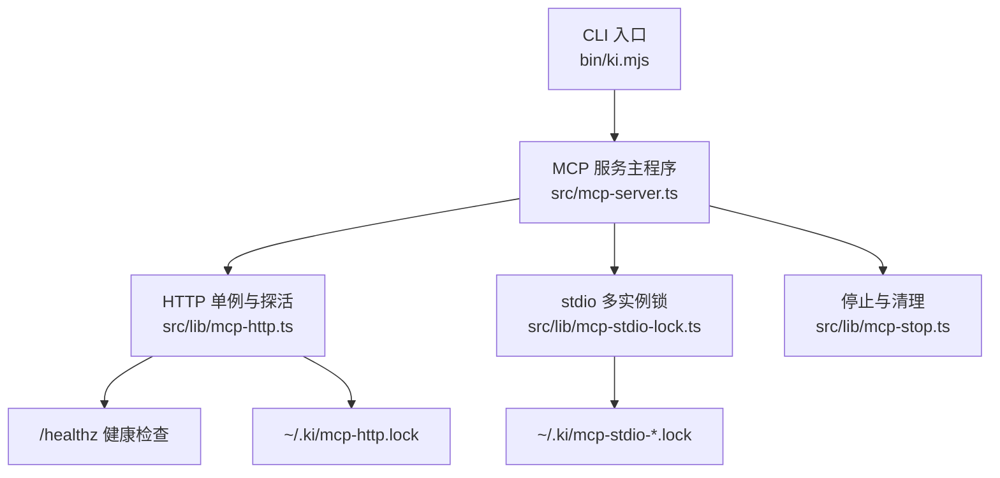
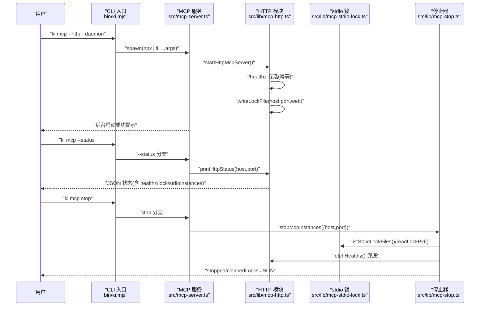
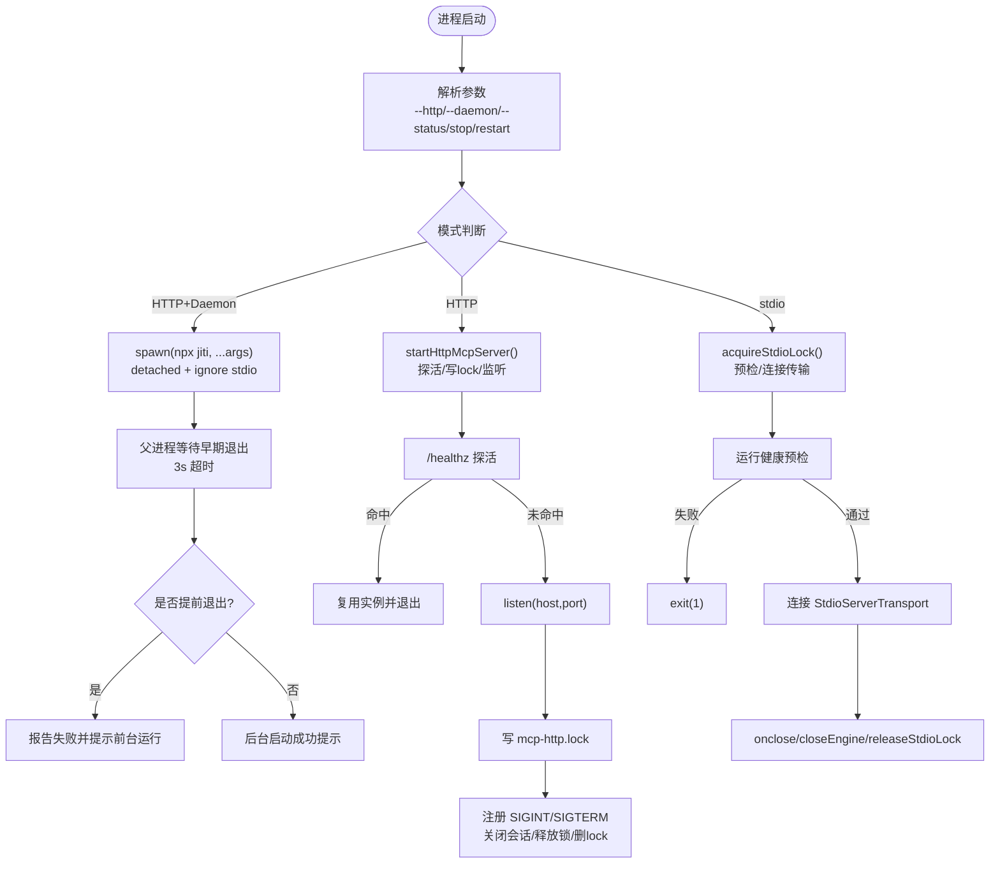
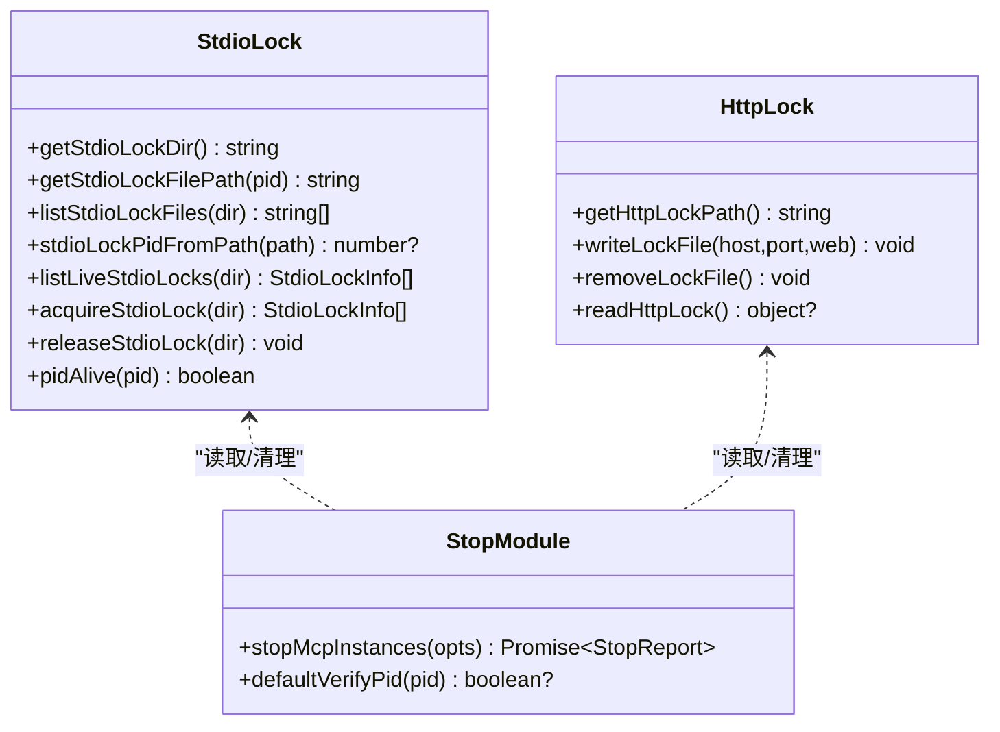
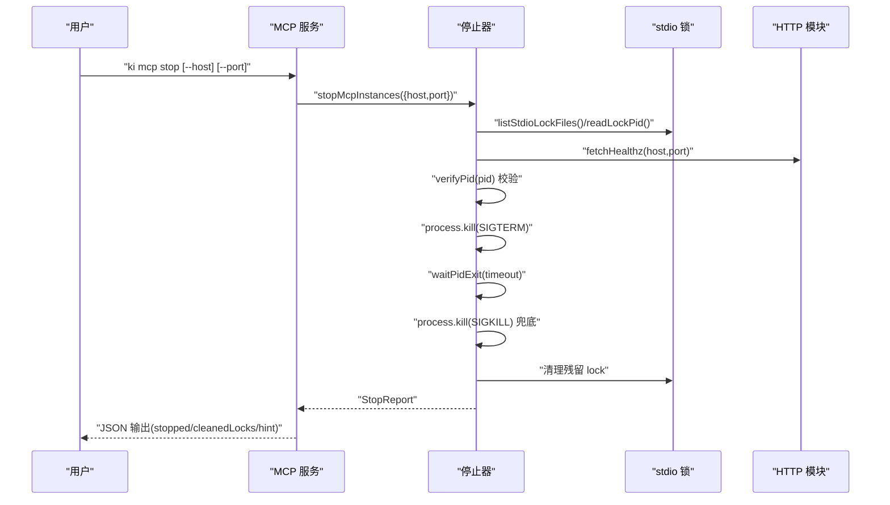
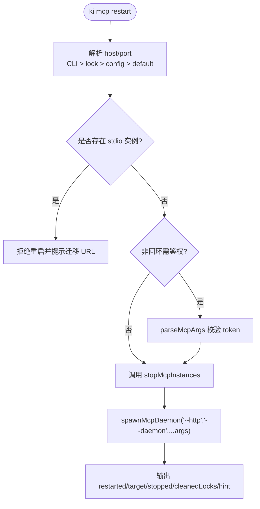
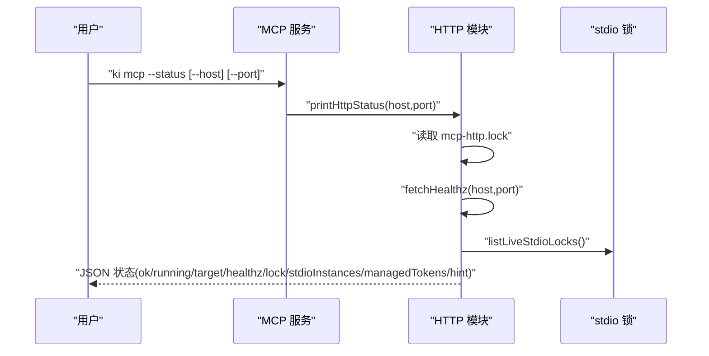
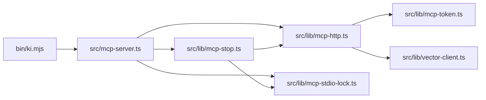

# 进程管理

<cite>
**本文引用的文件**
- [bin/ki.mjs](file://bin/ki.mjs)
- [src/mcp-server.ts](file://src/mcp-server.ts)
- [src/lib/mcp-http.ts](file://src/lib/mcp-http.ts)
- [src/lib/mcp-stop.ts](file://src/lib/mcp-stop.ts)
- [src/lib/mcp-stdio-lock.ts](file://src/lib/mcp-stdio-lock.ts)
</cite>

## 目录
1. [简介](#简介)
2. [项目结构](#项目结构)
3. [核心组件](#核心组件)
4. [架构总览](#架构总览)
5. [详细组件分析](#详细组件分析)
6. [依赖关系分析](#依赖关系分析)
7. [性能与资源特性](#性能与资源特性)
8. [故障排查指南](#故障排查指南)
9. [结论](#结论)
10. [附录：命令速查](#附录命令速查)

## 简介
本文件面向 MCP 服务器进程的运维与开发，聚焦以下目标：
- 说明 ki mcp stop、restart、--status 等命令的用法与输出格式
- 解释守护进程模式的实现原理、进程生命周期管理与资源清理机制
- 记录锁文件管理、PID 跟踪与异常进程清理策略
- 提供进程监控脚本、健康检查接口与日志分析方法
- 说明多实例协调、进程间通信与资源竞争处理策略
- 总结常见进程问题的诊断与解决方法

## 项目结构
MCP 进程管理由 CLI 入口、MCP 服务主程序、HTTP 单例与锁管理模块共同构成：
- CLI 入口负责解析命令并启动子进程（支持守护模式）
- MCP 服务主程序负责参数解析、子命令分发、预检与启动
- HTTP 模块提供 /healthz 探活、会话管理、鉴权与静态页面
- stdio 锁模块提供多实例登记、存活探测与陈旧锁清理
- stop 模块统一关闭本机所有 ki mcp 实例并清理残留锁

图表来源
- [bin/ki.mjs:155-198](file://bin/ki.mjs#L155-L198)
- [src/mcp-server.ts:492-734](file://src/mcp-server.ts#L492-L734)
- [src/lib/mcp-http.ts:60-62](file://src/lib/mcp-http.ts#L60-L62)
- [src/lib/mcp-stdio-lock.ts:21-33](file://src/lib/mcp-stdio-lock.ts#L21-L33)
- [src/lib/mcp-stop.ts:94-176](file://src/lib/mcp-stop.ts#L94-L176)

章节来源
- [bin/ki.mjs:155-198](file://bin/ki.mjs#L155-L198)
- [src/mcp-server.ts:492-734](file://src/mcp-server.ts#L492-L734)

## 核心组件
- CLI 入口（bin/ki.mjs）
  - 解析全局 --config，转发命令到对应脚本
  - 守护模式：使用 detached + ignore stdio，父进程等待早期退出以暴露失败
  - 信号透传：SIGINT/SIGTERM 转发给子进程，确保优雅退出
- MCP 服务主程序（src/mcp-server.ts）
  - 参数解析与子命令分发：stop、token、restart、--status
  - 启动守卫：检测 HTTP 单例复用、stdio 冲突、预检失败拦截
  - 守护进程：通过 npx jiti 拉起后台进程，写入 lock 文件
  - 生命周期：版本自检 banner、空闲释放向量库锁、SIGTERM/SIGINT 钩子
- HTTP 模块（src/lib/mcp-http.ts）
  - /healthz 探活：返回 ok/name/pid/version/host/port/authFailures
  - 会话管理：最大并发、空闲回收、DNS rebinding 保护
  - 鉴权：回环免鉴权，非回环强制 Bearer Token；scope 越权校验
  - 状态输出：printHttpStatus 汇总 HTTP lock、stdio 实例、健康信息
- stdio 锁模块（src/lib/mcp-stdio-lock.ts）
  - 每实例独立 lock 文件：~/.ki/mcp-stdio-<pid>.lock
  - 存活探测：signal 0 探测，EPERM 视为存活
  - 陈旧锁清理：读取时校验 pid，已死则删除
  - 登记/释放：acquire/release 原子写与删除
- 停止模块（src/lib/mcp-stop.ts）
  - 收集目标：stdio lock、http lock、healthz 兜底
  - 安全校验：读 /proc/<pid>/cmdline 确认是 ki mcp 进程
  - 优雅退出：SIGTERM → 超时 SIGKILL → 清理残留 lock

章节来源
- [bin/ki.mjs:155-198](file://bin/ki.mjs#L155-L198)
- [src/mcp-server.ts:492-734](file://src/mcp-server.ts#L492-L734)
- [src/lib/mcp-http.ts:202-249](file://src/lib/mcp-http.ts#L202-L249)
- [src/lib/mcp-stdio-lock.ts:44-111](file://src/lib/mcp-stdio-lock.ts#L44-L111)
- [src/lib/mcp-stop.ts:56-176](file://src/lib/mcp-stop.ts#L56-L176)

## 架构总览
MCP 进程管理采用“CLI 壳 + 服务进程”的多层模型，并通过锁文件与健康检查实现幂等与可观测。

图表来源
- [bin/ki.mjs:155-198](file://bin/ki.mjs#L155-L198)
- [src/mcp-server.ts:492-734](file://src/mcp-server.ts#L492-L734)
- [src/lib/mcp-http.ts:214-249](file://src/lib/mcp-http.ts#L214-L249)
- [src/lib/mcp-stdio-lock.ts:57-111](file://src/lib/mcp-stdio-lock.ts#L57-L111)
- [src/lib/mcp-stop.ts:94-176](file://src/lib/mcp-stop.ts#L94-L176)

## 详细组件分析

### 守护进程模式与生命周期管理
- 启动流程
  - CLI 检测到 --http 且包含 --daemon/-d，则以 detached + ignore stdio 方式 spawn 子进程
  - 父进程在 3 秒内监听子进程 exit，若提前退出则报告失败并给出前台运行建议
  - 子进程进入 MCP 服务主程序，解析参数后进入 HTTP 单例启动或 stdio 模式
- 生命周期
  - HTTP 模式：/healthz 探活命中则复用退出；否则创建 http server，写 lock 文件，注册 SIGINT/SIGTERM 钩子，关闭会话、释放向量库锁、删除 lock 后退出
  - stdio 模式：登记自身 lock，预检失败或客户端断开时释放 engine 与 lock，进程退出
  - 版本自检：长驻进程启动版本 banner，升级后提示重启
  - 空闲释放：启用向量库空闲释放锁，避免多实例争抢导致降级

图表来源
- [bin/ki.mjs:155-198](file://bin/ki.mjs#L155-L198)
- [src/mcp-server.ts:492-734](file://src/mcp-server.ts#L492-L734)
- [src/lib/mcp-http.ts:711-799](file://src/lib/mcp-http.ts#L711-L799)

章节来源
- [bin/ki.mjs:155-198](file://bin/ki.mjs#L155-L198)
- [src/mcp-server.ts:492-734](file://src/mcp-server.ts#L492-L734)
- [src/lib/mcp-http.ts:711-799](file://src/lib/mcp-http.ts#L711-L799)

### 进程锁文件管理、PID 跟踪与异常清理
- stdio 锁
  - 路径：~/.ki/mcp-stdio-<pid>.lock，文件名即 pid，内容包含 pid 与 startedAt
  - 获取：acquireStdioLock 原子写（wx），失败不阻塞启动但告警
  - 列出：listLiveStdioLocks 遍历目录，过滤当前进程，自动清理陈旧锁
  - 释放：releaseStdioLock 删除自身文件
- HTTP 锁
  - 路径：~/.ki/mcp-http.lock，内容包含 pid/host/port/startedAt/web
  - 写入：startHttpMcpServer 成功后写 lock
  - 读取：readHttpLock 用于 restart/status 继承上次运行值
- 异常清理
  - 陈旧锁：读取时校验 pid 存活，已死则删除
  - 停止流程：按 lock/healthz 定位真实服务进程，发送 SIGTERM，超时 SIGKILL，再清理残留 lock

图表来源
- [src/lib/mcp-stdio-lock.ts:21-154](file://src/lib/mcp-stdio-lock.ts#L21-L154)
- [src/lib/mcp-http.ts:59-62](file://src/lib/mcp-http.ts#L59-L62)
- [src/lib/mcp-stop.ts:56-176](file://src/lib/mcp-stop.ts#L56-L176)

章节来源
- [src/lib/mcp-stdio-lock.ts:21-154](file://src/lib/mcp-stdio-lock.ts#L21-L154)
- [src/lib/mcp-http.ts:59-62](file://src/lib/mcp-http.ts#L59-L62)
- [src/lib/mcp-stop.ts:56-176](file://src/lib/mcp-stop.ts#L56-L176)

### 命令：ki mcp stop
- 功能：一键关闭本机所有 ki mcp 实例（stdio + HTTP）并清理 lock
- 行为
  - 收集目标：遍历 stdio lock 文件、读取 http lock、healthz 兜底
  - 身份校验：默认读 /proc/<pid>/cmdline 确认是 ki mcp 进程
  - 优雅退出：SIGTERM → 等待超时 → SIGKILL 兜底
  - 清理残留：对已死或损坏 lock 进行删除
- 输出格式
  - stopped: 数组，每项包含 pid、kind(stdio/http)、result(terminated/killed/skipped)、reason(可选)
  - cleanedLocks: 被清理的 lock 文件路径列表
  - hint: 无实例时的提示文本

图表来源
- [src/lib/mcp-stop.ts:94-176](file://src/lib/mcp-stop.ts#L94-L176)
- [src/lib/mcp-stdio-lock.ts:57-111](file://src/lib/mcp-stdio-lock.ts#L57-L111)
- [src/lib/mcp-http.ts:214-249](file://src/lib/mcp-http.ts#L214-L249)

章节来源
- [src/lib/mcp-stop.ts:94-176](file://src/lib/mcp-stop.ts#L94-L176)

### 命令：ki mcp restart
- 功能：停止现有 HTTP 单例后，以守护进程方式后台重启（仅 HTTP 模式）
- 行为
  - host/port 解析优先级：CLI > lock(上次运行值) > 配置 > 默认
  - 守卫①：存在存活的 stdio 实例时拒绝重启，引导迁移 URL 接入
  - 守卫②：非回环绑定需鉴权，提前校验 token 合法性
  - 停止：复用 stopMcpInstances 进行优雅退出与清理
  - 启动：强制 --http --daemon，补齐 host/port/web（web 沿用上次运行值），透传其余参数
- 输出格式
  - restarted: true
  - target: {host, port}
  - stopped: 停止结果数组
  - cleanedLocks: 清理的 lock 路径
  - hint: 无实例时提示直接后台启动（幂等）

图表来源
- [src/mcp-server.ts:410-490](file://src/mcp-server.ts#L410-L490)
- [src/lib/mcp-stop.ts:94-176](file://src/lib/mcp-stop.ts#L94-L176)

章节来源
- [src/mcp-server.ts:410-490](file://src/mcp-server.ts#L410-L490)

### 命令：ki mcp --status
- 功能：只读诊断，查看 HTTP 单例运行状态（不启动服务）
- 行为
  - 读取 HTTP lock，结合 healthz 探活判定 running
  - 列出 stdio 实例（排除当前进程）
  - 报告多 Token 存储数量（不含明文）
- 输出格式
  - ok: true
  - running: 是否健康
  - target: {host, port}
  - healthz: 健康信息或 null
  - lock: lock 文件或 null
  - stdioInstances: 存活 stdio 实例列表
  - managedTokens: {count}
  - hint: 健康/鉴权失败/stdio 实例/未探测到实例等提示

图表来源
- [src/lib/mcp-http.ts:667-705](file://src/lib/mcp-http.ts#L667-L705)
- [src/mcp-server.ts:542-558](file://src/mcp-server.ts#L542-L558)

章节来源
- [src/lib/mcp-http.ts:667-705](file://src/lib/mcp-http.ts#L667-L705)
- [src/mcp-server.ts:542-558](file://src/mcp-server.ts#L542-L558)

### 多实例协调与资源竞争处理
- stdio 多实例
  - 每个实例独立 lock 文件，支持多实例登记与并发启动互不干扰
  - 共享向量库：空闲自动释放锁，撞锁重试错开使用，互不影响
- HTTP 单例
  - 启动前探活 /healthz，命中则复用退出，避免重复持锁
  - 与 stdio 互斥：stdio 模式下若检测到 HTTP 单例，拒绝启动；HTTP 模式下若检测到 stdio 实例，拒绝启动
- 资源竞争
  - 向量库锁：通过空闲释放与重试机制缓解
  - 端口占用：describeListenError 提供可诊断信息（EADDRINUSE/EACCES 等）

章节来源
- [src/lib/mcp-stdio-lock.ts:1-14](file://src/lib/mcp-stdio-lock.ts#L1-L14)
- [src/mcp-server.ts:597-658](file://src/mcp-server.ts#L597-L658)
- [src/lib/mcp-http.ts:644-665](file://src/lib/mcp-http.ts#L644-L665)

### 进程监控脚本与健康检查接口
- 健康检查接口
  - GET /healthz：返回 ok/name/pid/version/host/port/authFailures
  - 用途：幂等单例判定、运维排查、ki mcp --status 数据来源
- 监控脚本建议
  - 定时 curl http://<host>:<port>/healthz，解析 ok 与 authFailures
  - 轮询 ~/.ki/mcp-http.lock 与 ~/.ki/mcp-stdio-*.lock 文件，结合 pidAlive 判定存活
  - 当 authFailures 增长时，检查客户端 Authorization: Bearer 配置与服务端 stderr 日志

章节来源
- [src/lib/mcp-http.ts:202-249](file://src/lib/mcp-http.ts#L202-L249)
- [src/lib/mcp-http.ts:667-705](file://src/lib/mcp-http.ts#L667-L705)

### 日志分析方法
- 服务端 stderr
  - 鉴权失败：记录次数与原因（缺少 Bearer、Token 无效）
  - scope 越权：记录请求来源与违规 scope
  - 启动警告：stdio lock 写入失败、前端构建产物缺失等
- 客户端侧
  - 观察 IDE 工具调用失败（如 tools/call 返回 401/403）
  - 核对 Authorization: Bearer 与服务端 ki mcp token list 输出一致

章节来源
- [src/lib/mcp-http.ts:377-391](file://src/lib/mcp-http.ts#L377-L391)
- [src/lib/mcp-http.ts:543-560](file://src/lib/mcp-http.ts#L543-L560)
- [src/lib/mcp-stdio-lock.ts:136-140](file://src/lib/mcp-stdio-lock.ts#L136-L140)

## 依赖关系分析

图表来源
- [bin/ki.mjs:155-198](file://bin/ki.mjs#L155-L198)
- [src/mcp-server.ts:492-734](file://src/mcp-server.ts#L492-L734)
- [src/lib/mcp-http.ts:214-249](file://src/lib/mcp-http.ts#L214-L249)
- [src/lib/mcp-stdio-lock.ts:57-111](file://src/lib/mcp-stdio-lock.ts#L57-L111)
- [src/lib/mcp-stop.ts:94-176](file://src/lib/mcp-stop.ts#L94-L176)

章节来源
- [bin/ki.mjs:155-198](file://bin/ki.mjs#L155-L198)
- [src/mcp-server.ts:492-734](file://src/mcp-server.ts#L492-L734)

## 性能与资源特性
- 会话上限与空闲回收：防止会话无界增长耗尽内存，定期回收空闲会话
- 向量库空闲释放锁：常驻进程空闲超时后自动 closeEngine 释放 LOCK，提升多实例共享能力
- 优雅退出超时：HTTP 模式设置 SHUTDOWN_TIMEOUT_MS，兜底强制退出避免残留进程持锁
- 请求体大小限制：16MB 上限，防止滥用

章节来源
- [src/lib/mcp-http.ts:47-57](file://src/lib/mcp-http.ts#L47-L57)
- [src/lib/mcp-http.ts:166-192](file://src/lib/mcp-http.ts#L166-L192)
- [src/lib/mcp-http.ts:769-799](file://src/lib/mcp-http.ts#L769-L799)
- [src/mcp-server.ts:680-685](file://src/mcp-server.ts#L680-L685)

## 故障排查指南
- 守护进程启动失败
  - 现象：父进程打印“已在后台启动”，但子进程早期退出
  - 原因：token 缺失/参数非法/端口冲突等 fail-loud
  - 解决：前台运行同样命令查看具体错误；使用 ki mcp --status 验证
- 端口占用
  - 现象：EADDRINUSE
  - 解决：更换端口或排查占用进程；使用 describeListenError 提示
- 鉴权失败
  - 现象：/healthz.authFailures 增长，客户端 401
  - 解决：核对 Authorization: Bearer 与服务端 ki mcp token list 输出一致；检查远程绑定是否开启鉴权
- stdio 与 HTTP 冲突
  - 现象：stdio 模式拒绝启动或 HTTP 模式拒绝启动
  - 解决：将 IDE 配置迁移为 URL 型接入；使用 ki mcp stop 关闭冲突实例
- 陈旧锁残留
  - 现象：ki mcp stop 无法定位实例
  - 解决：手动检查 ~/.ki 下 lock 文件，结合 ps 确认 pid；stop 会尝试清理

章节来源
- [bin/ki.mjs:170-198](file://bin/ki.mjs#L170-L198)
- [src/lib/mcp-http.ts:644-665](file://src/lib/mcp-http.ts#L644-L665)
- [src/lib/mcp-http.ts:377-391](file://src/lib/mcp-http.ts#L377-L391)
- [src/mcp-server.ts:597-658](file://src/mcp-server.ts#L597-L658)
- [src/lib/mcp-stop.ts:155-176](file://src/lib/mcp-stop.ts#L155-L176)

## 结论
本进程管理体系通过 CLI 壳、服务主程序、HTTP 单例与锁管理模块协同工作，实现了：
- 安全的守护进程启动与早期失败暴露
- 幂等的 HTTP 单例复用与多实例协调
- 健壮的停止流程（SIGTERM→SIGKILL→清理残留）
- 可观测的健康检查与鉴权失败追踪
- 清晰的命令输出与诊断提示

建议在生产环境中：
- 使用 ki mcp --http --daemon 启动 HTTP 单例，IDE 通过 URL 接入
- 定期巡检 /healthz 与 lock 文件，关注 authFailures
- 遇到冲突时优先迁移至 URL 接入，避免 stdio 与 HTTP 并存

## 附录：命令速查
- ki mcp
  - 默认 stdio 模式（单客户端单进程）
  - --http：HTTP 共享单例（默认回环 127.0.0.1，本机免鉴权）
  - --http --daemon：HTTP 模式后台常驻运行
- ki mcp --status
  - 查看 HTTP 单例运行状态（只读，不启动服务）
  - 输出包含 running/target/healthz/lock/stdioInstances/managedTokens/hint
- ki mcp stop
  - 关闭本机所有 ki mcp 实例并清理 lock
  - 输出包含 stopped/cleanedLocks/hint
- ki mcp restart
  - 停止现有 HTTP 单例后后台重启（仅 HTTP 模式）
  - 输出包含 restarted/target/stopped/cleanedLocks/hint
- ki mcp token
  - generate/list/update/delete：授权 Token 全生命周期管理

章节来源
- [src/mcp-server.ts:84-107](file://src/mcp-server.ts#L84-L107)
- [src/lib/mcp-http.ts:667-705](file://src/lib/mcp-http.ts#L667-L705)
- [src/lib/mcp-stop.ts:94-176](file://src/lib/mcp-stop.ts#L94-L176)
- [src/mcp-server.ts:410-490](file://src/mcp-server.ts#L410-L490)