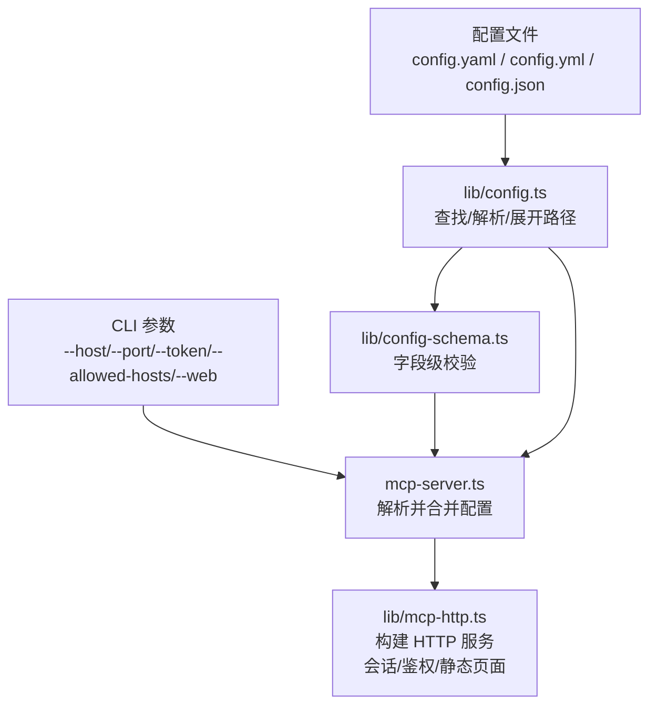
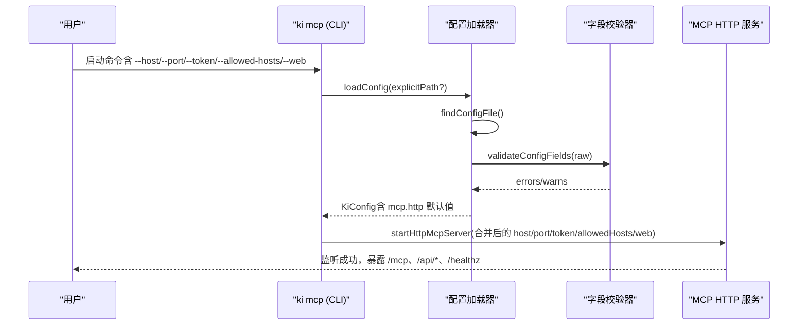
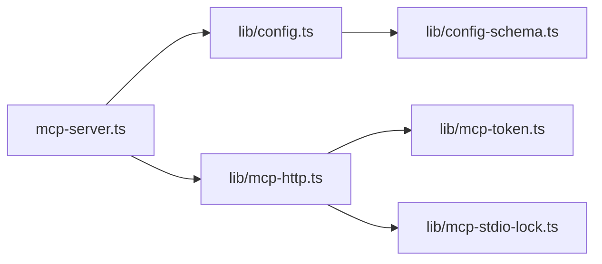

# 配置管理

<cite>
**本文引用的文件**
- [src/lib/config.ts](file://src/lib/config.ts)
- [src/lib/config-schema.ts](file://src/lib/config-schema.ts)
- [docs/configuration.md](file://docs/configuration.md)
- [docs/mcp-http.md](file://docs/mcp-http.md)
- [src/lib/mcp-http.ts](file://src/lib/mcp-http.ts)
- [src/mcp-server.ts](file://src/mcp-server.ts)
- [src/lib/cli-args.ts](file://src/lib/cli-args.ts)
- [.e2e-run/ki-config.yaml](file://.e2e-run/ki-config.yaml)
- [.e2e-run/ki-config.json](file://.e2e-run/ki-config.json)
</cite>

## 目录
1. [简介](#简介)
2. [项目结构](#项目结构)
3. [核心组件](#核心组件)
4. [架构总览](#架构总览)
5. [详细组件分析](#详细组件分析)
6. [依赖关系分析](#依赖关系分析)
7. [性能与可靠性](#性能与可靠性)
8. [故障排查指南](#故障排查指南)
9. [结论](#结论)
10. [附录：示例与最佳实践](#附录示例与最佳实践)

## 简介
本文件面向 MCP 服务器（ki mcp）的配置管理，覆盖配置文件结构、环境变量替换、命令行参数优先级、mcp.http 配置段选项与作用、配置校验机制、错误处理、以及“热重载”行为说明。同时提供开发、测试、生产环境的典型配置示例与安全建议。

## 项目结构
MCP 服务器配置由以下模块协同完成：
- 配置加载与解析：src/lib/config.ts
- 字段级校验：src/lib/config-schema.ts
- MCP HTTP 服务与默认值：src/lib/mcp-http.ts
- CLI 参数解析与优先级合并：src/mcp-server.ts、src/lib/cli-args.ts
- 文档与示例：docs/configuration.md、docs/mcp-http.md
- 示例配置：.e2e-run/ki-config.yaml、.e2e-run/ki-config.json

图表来源
- [src/mcp-server.ts:137-172](file://src/mcp-server.ts#L137-L172)
- [src/lib/config.ts:156-183](file://src/lib/config.ts#L156-L183)
- [src/lib/config-schema.ts:323-339](file://src/lib/config-schema.ts#L323-L339)
- [src/lib/mcp-http.ts:363-430](file://src/lib/mcp-http.ts#L363-L430)

章节来源
- [src/lib/config.ts:1-21](file://src/lib/config.ts#L1-L21)
- [docs/configuration.md:7-18](file://docs/configuration.md#L7-L18)

## 核心组件
- 配置加载器（loadConfig/findConfigFile/parseAndExpand）：负责按优先级查找配置文件、解析 YAML/JSON、展开路径、合并默认值、执行字段校验。
- 字段校验器（validateConfigFields）：在语法解析后对字段名、类型、取值进行严格校验，失败时 fail-loud。
- MCP HTTP 服务（createMcpHttpServer/startHttpMcpServer）：实现 Streamable HTTP 传输、会话管理、鉴权、DNS rebinding 保护、静态页面服务。
- CLI 参数解析（parseMcpArgs/detectUnknownFlags/parseIntArg）：解析命令参数，并与配置文件默认值合并，形成最终运行参数。

章节来源
- [src/lib/config.ts:156-183](file://src/lib/config.ts#L156-L183)
- [src/lib/config-schema.ts:323-339](file://src/lib/config-schema.ts#L323-L339)
- [src/lib/mcp-http.ts:363-430](file://src/lib/mcp-http.ts#L363-L430)
- [src/lib/cli-args.ts:77-106](file://src/lib/cli-args.ts#L77-L106)

## 架构总览
配置生效的完整链路如下：

图表来源
- [src/mcp-server.ts:137-172](file://src/mcp-server.ts#L137-L172)
- [src/lib/config.ts:193-213](file://src/lib/config.ts#L193-L213)
- [src/lib/config-schema.ts:323-339](file://src/lib/config-schema.ts#L323-L339)
- [src/lib/mcp-http.ts:711-767](file://src/lib/mcp-http.ts#L711-L767)

## 详细组件分析

### 配置文件加载顺序与环境变量
- 查找顺序（找到即用，后项不生效）：
  1) --config <path> 命令行参数
  2) 环境变量 KI_CONFIG_PATH 显式指定路径
  3) $HOME/.ki/config.yaml
  4) $HOME/.ki/config.yml
  5) $HOME/.ki/config.json
  6) 内置默认值
- 路径展开规则：$HOME / ~ → os.homedir()；相对路径相对于配置文件所在目录展开。
- 进程内缓存：loadConfig 会缓存结果，避免重复读取；可通过 resetConfigCache 清除（测试用）。

章节来源
- [docs/configuration.md:7-18](file://docs/configuration.md#L7-L18)
- [src/lib/config.ts:156-183](file://src/lib/config.ts#L156-L183)
- [src/lib/config.ts:193-213](file://src/lib/config.ts#L193-L213)
- [src/lib/config.ts:217-226](file://src/lib/config.ts#L217-L226)

### mcp.http 配置段选项与默认值
- host：监听地址。默认 127.0.0.1（回环免鉴权；对外监听改 0.0.0.0）。
- port：监听端口。默认 7423（1-65535）。
- allowedHosts：DNS rebinding 保护允许的 Host 头数组（可选）。
- web：通过 CLI 的 --web/--no-web 控制是否提供前端静态页面与 /api/* 扩展路由（不在配置文件中设置）。
- token：仅通过 CLI 参数或环境变量传入，绝不写入配置文件。

优先级规则（生效顺序从高到低）：
- CLI 参数（--host/--port/--token/--allowed-hosts/--web/--no-web）
- 配置文件 mcp.http.*（仅 host/port/allowedHosts）
- 内置默认值（host=127.0.0.1，port=7423）

章节来源
- [docs/configuration.md:166-178](file://docs/configuration.md#L166-L178)
- [docs/mcp-http.md:41-55](file://docs/mcp-http.md#L41-L55)
- [src/lib/config.ts:105-114](file://src/lib/config.ts#L105-L114)
- [src/lib/mcp-http.ts:37-45](file://src/lib/mcp-http.ts#L37-L45)
- [src/mcp-server.ts:137-172](file://src/mcp-server.ts#L137-L172)

### 环境变量替换机制
- embedding.apiKey 支持两种写法：
  - 明文密钥：apiKey: sk-xxx
  - 环境变量引用：apiKey: ${VAR_NAME}，运行时从同名环境变量读取
- 若引用了环境变量但未设置，则视为未配置（KI 层 fail-loud，不做隐式回退）。
- 其他字段不支持自动环境变量替换（除 apiKey 外）。

章节来源
- [src/lib/config.ts:228-248](file://src/lib/config.ts#L228-L248)
- [docs/configuration.md:69-91](file://docs/configuration.md#L69-L91)

### 配置继承与合并规则
- 顶层 dataDir/backupDir/vectorDir：未显式配置时使用统一默认路径（~/.ki/kb、~/.ki/backup、~/.ki/vector）。
- embedding：与内置默认合并，允许部分覆盖。
- scopeMode：仅接受 'strict'，其余（含缺省/非法值）归为 'default'。
- scopes.<scope>.clean/import/wikiSync：按子对象合并，布尔型字段默认 true（如 clean.enabled、wikiSync.enabled/autoBackfill），可显式 false 关闭。
- mcp.http：仅解析 host/port/allowedHosts 作为传输默认值；token 不入配置。

章节来源
- [src/lib/config.ts:280-330](file://src/lib/config.ts#L280-L330)
- [src/lib/config.ts:389-399](file://src/lib/config.ts#L389-L399)
- [docs/configuration.md:132-165](file://docs/configuration.md#L132-L165)

### 配置验证机制与错误处理
- 校验时机：YAML/JSON 语法解析成功后、宽容归一化之前调用 validateConfigFields。
- 校验范围：字段名白名单、类型检查、取值范围（端口 1-65535、baseURL http(s) 前缀等）、枚举值（scopeMode）。
- 错误策略：fail-loud，一次性列出全部问题（最多 10 条，超出提示“另有 N 处”），错误前缀 CONFIG_FIELD_INVALID。
- 告警策略：废弃字段、空字符串、YAML 裸写 null 的 scope 条目等仅告警，不阻断加载。
- 常见错误与修复：
  - 拼错字段名：根据 Levenshtein 建议修正
  - 类型不符：修正为期望类型
  - 取值非法：修正为合法范围
  - 只写键名未赋值：补充值或使用默认值

章节来源
- [src/lib/config-schema.ts:1-15](file://src/lib/config-schema.ts#L1-L15)
- [src/lib/config-schema.ts:125-166](file://src/lib/config-schema.ts#L125-L166)
- [src/lib/config-schema.ts:323-339](file://src/lib/config-schema.ts#L323-L339)
- [docs/configuration.md:234-262](file://docs/configuration.md#L234-L262)

### 配置热重载能力
- 当前实现：配置在命令启动时加载并缓存，修改配置文件后需重启 ki 命令以生效。
- 对于 ki mcp --http：若已在运行，修改配置后需重启服务以加载新配置。
- 无进程内热重载机制（如文件监听 + 信号触发重载）。

章节来源
- [docs/configuration.md:279-290](file://docs/configuration.md#L279-L290)
- [src/lib/config.ts:147-183](file://src/lib/config.ts#L147-L183)

### 安全与鉴权
- 条件鉴权：回环绑定（127.0.0.1/localhost/::1）免鉴权；非回环绑定强制 Bearer Token。
- Token 来源优先级：--token/KI_MCP_TOKEN（全权临时）> 多 Token 存储 ~/.ki/mcp-tokens.json；绝不写入配置文件。
- DNS rebinding 保护：通过 allowedHosts 限定允许的 Host 头。
- scope 越权校验：拦截 tools/call 的 arguments.scope（缺省 default），越权返回 403。

章节来源
- [docs/mcp-http.md:132-146](file://docs/mcp-http.md#L132-L146)
- [src/lib/mcp-http.ts:476-509](file://src/lib/mcp-http.ts#L476-L509)
- [docs/configuration.md:166-178](file://docs/configuration.md#L166-L178)

## 依赖关系分析

图表来源
- [src/lib/config.ts:23-28](file://src/lib/config.ts#L23-L28)
- [src/mcp-server.ts:137-172](file://src/mcp-server.ts#L137-L172)
- [src/lib/mcp-http.ts:24-28](file://src/lib/mcp-http.ts#L24-L28)

章节来源
- [src/lib/config.ts:23-28](file://src/lib/config.ts#L23-L28)
- [src/mcp-server.ts:137-172](file://src/mcp-server.ts#L137-L172)
- [src/lib/mcp-http.ts:24-28](file://src/lib/mcp-http.ts#L24-L28)

## 性能与可靠性
- 配置加载缓存：进程内缓存 KiConfig，避免重复 I/O。
- 会话上限与空闲回收：默认最大并发会话 256，空闲 30 分钟回收，防止内存泄漏。
- 优雅退出：SIGINT/SIGTERM 触发关闭会话、释放向量库锁、关闭 HTTP 服务、删除 lock 文件，带 5 秒兜底超时。
- 探活与单例：启动前先探活 /healthz，命中健康实例则复用退出，避免多实例冲突。

章节来源
- [src/lib/config.ts:147-183](file://src/lib/config.ts#L147-L183)
- [src/lib/mcp-http.ts:47-57](file://src/lib/mcp-http.ts#L47-L57)
- [src/lib/mcp-http.ts:711-767](file://src/lib/mcp-http.ts#L711-L767)
- [docs/mcp-http.md:147-157](file://docs/mcp-http.md#L147-L157)

## 故障排查指南
- 配置加载失败：
  - 检查 CONFIG_FIELD_INVALID 错误清单，逐项修正字段名/类型/取值
  - 使用 ki doctor 查看残余告警
- 端口占用：
  - 描述性错误提示 EADDRINUSE/EACCES/EADDRNOTAVAIL/ENOTFOUND，按提示更换端口或修正主机名
- 鉴权失败（401）：
  - 核对客户端 Authorization: Bearer 与服务端托管 Token 完全一致
  - 非回环绑定必须携带 Token
- 越权拒绝（403）：
  - 确认请求 scope 在 Token 授权范围内；必要时扩大授权 scope
- 状态自查：
  - 使用 ki mcp --status 输出 JSON，包含 running、healthz、lock、managedTokens.count 等信息

章节来源
- [docs/configuration.md:234-262](file://docs/configuration.md#L234-L262)
- [src/lib/mcp-http.ts:644-665](file://src/lib/mcp-http.ts#L644-L665)
- [docs/mcp-http.md:105-131](file://docs/mcp-http.md#L105-L131)

## 结论
本系统通过严格的配置校验、清晰的优先级规则与安全的鉴权机制，确保 MCP 服务器在不同环境下稳定运行。mcp.http 配置段仅提供传输默认值，敏感信息（token）始终通过 CLI/环境变量注入。建议在开发与生产环境中分别采用最小权限与隔离路径的最佳实践，并通过 ki mcp --status 持续监控实例状态。

## 附录：示例与最佳实践

### 配置文件示例
- 开发环境（本地回环、免鉴权、启用前端）：
  - 参考 docs/configuration.md 中的完整示例，设置 mcp.http.host=127.0.0.1，port=7423，allowedHosts 可省略
  - 启动时加 --web 提供前端页面
- 测试环境（E2E 隔离）：
  - 使用 .e2e-run/ki-config.yaml 或 .e2e-run/ki-config.json，指向独立数据/备份/向量目录
- 生产环境（远程访问、强制鉴权）：
  - 设置 mcp.http.host=0.0.0.0，port 自定义，allowedHosts 限定可信域名
  - 通过 ki mcp token generate --scope 生成托管 Token，启动时通过 --token 或 KI_MCP_TOKEN 注入

章节来源
- [docs/configuration.md:182-230](file://docs/configuration.md#L182-L230)
- [.e2e-run/ki-config.yaml:1-18](file://.e2e-run/ki-config.yaml#L1-L18)
- [.e2e-run/ki-config.json:1-17](file://.e2e-run/ki-config.json#L1-L17)
- [docs/mcp-http.md:19-22](file://docs/mcp-http.md#L19-L22)

### 环境变量与 CLI 优先级
- 环境变量：
  - KI_CONFIG_PATH：显式指定配置文件路径
  - KI_MCP_TOKEN：全权临时 Token（优先于托管 Token）
  - embedding.apiKey：支持 ${VAR_NAME} 引用
- CLI 参数优先级高于配置文件默认值（--host/--port/--token/--allowed-hosts/--web/--no-web）

章节来源
- [docs/configuration.md:7-18](file://docs/configuration.md#L7-L18)
- [docs/mcp-http.md:41-55](file://docs/mcp-http.md#L41-L55)
- [src/mcp-server.ts:164-172](file://src/mcp-server.ts#L164-L172)

### 安全建议
- 生产环境前置 TLS 反向代理（Nginx/Caddy），HTTP 服务仅处理明文
- 配合防火墙/安全组收敛来源 IP，使用 allowedHosts 缓解 DNS rebinding
- 使用托管 Token（ki mcp token generate --scope）并按 scope 最小授权
- 定期审计 Token 列表，发现泄露立即吊销或删除

章节来源
- [docs/mcp-http.md:243-248](file://docs/mcp-http.md#L243-L248)
- [docs/configuration.md:89-91](file://docs/configuration.md#L89-L91)