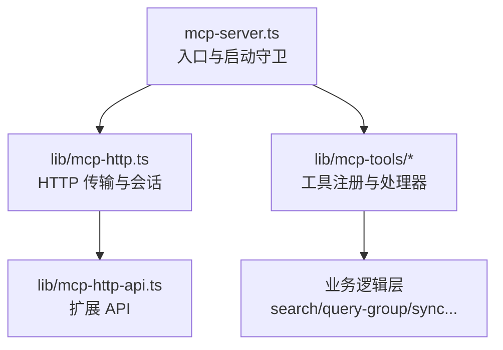
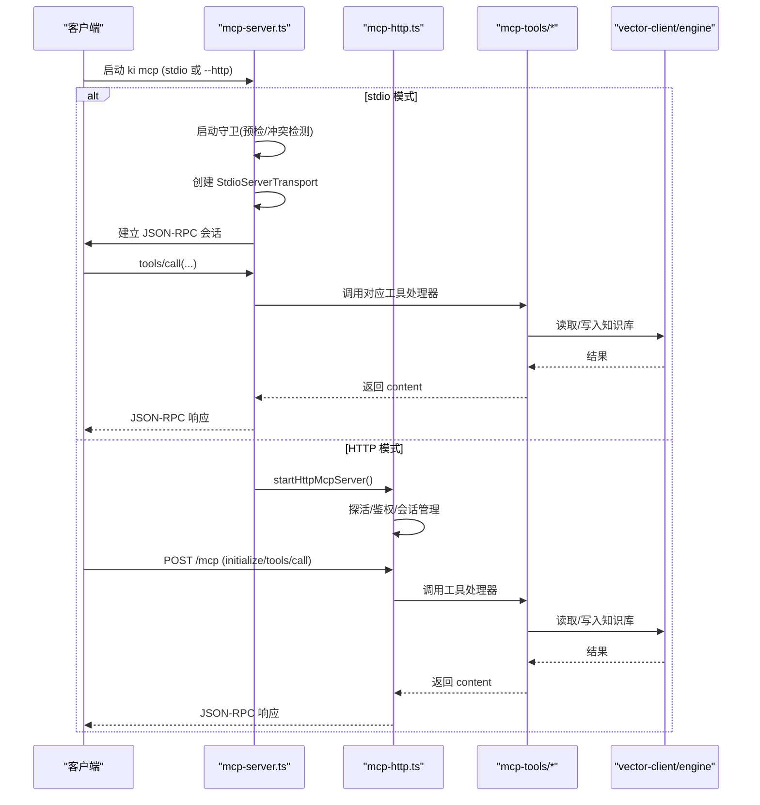
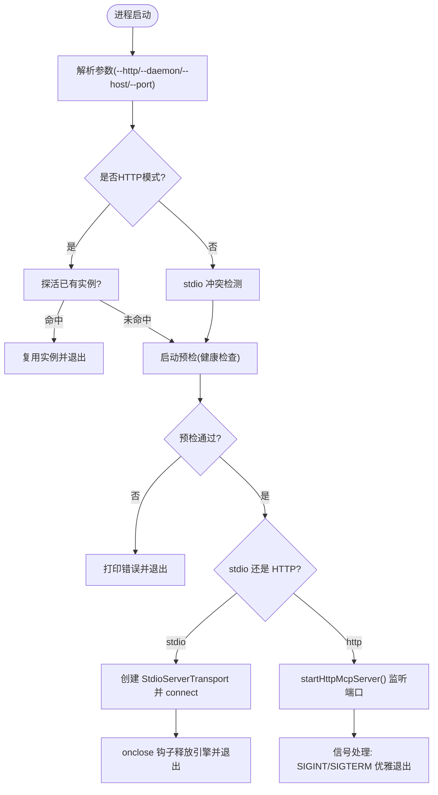
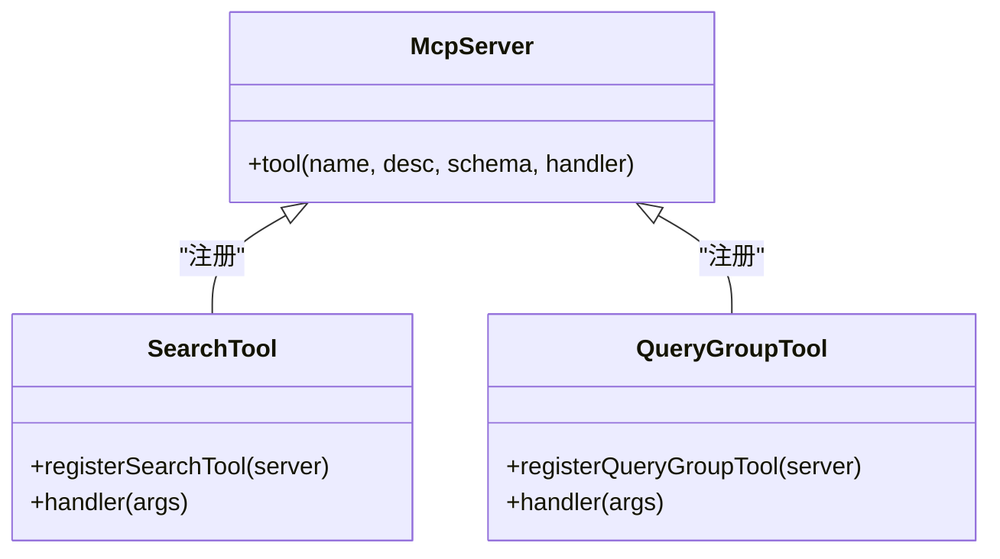
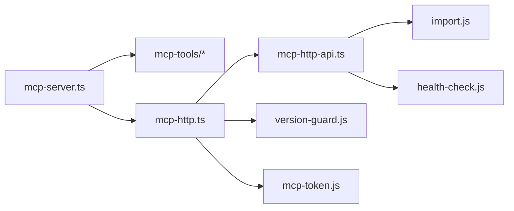

# MCP协议基础

<cite>
**本文引用的文件**
- [src/mcp-server.ts](file://src/mcp-server.ts)
- [src/lib/mcp-http.ts](file://src/lib/mcp-http.ts)
- [src/lib/mcp-http-api.ts](file://src/lib/mcp-http-api.ts)
- [docs/mcp-http.md](file://docs/mcp-http.md)
- [src/lib/mcp-tools/search.ts](file://src/lib/mcp-tools/search.ts)
- [src/lib/mcp-tools/query-group.ts](file://src/lib/mcp-tools/query-group.ts)
- [.requirements/2026-06-14-ki-mcp-server/design/S01_框架_DESIGN.md](file://.requirements/2026-06-14-ki-mcp-server/design/S01_框架_DESIGN.md)
- [.requirements/2026-06-14-ki-mcp-server/design/S02_只读工具_DESIGN.md](file://.requirements/2026-06-14-ki-mcp-server/design/S02_只读工具_DESIGN.md)
- [.requirements/2026-06-14-ki-mcp-server/design/S03_写入工具_DESIGN.md](file://.requirements/2026-06-14-ki-mcp-server/design/S03_写入工具_DESIGN.md)
</cite>

## 目录
1. [简介](#简介)
2. [项目结构](#项目结构)
3. [核心组件](#核心组件)
4. [架构总览](#架构总览)
5. [详细组件分析](#详细组件分析)
6. [依赖关系分析](#依赖关系分析)
7. [性能与并发特性](#性能与并发特性)
8. [故障排查指南](#故障排查指南)
9. [结论](#结论)
10. [附录：客户端交互示例](#附录客户端交互示例)

## 简介
本文件面向希望理解并集成 Model Context Protocol（MCP）的开发者，基于仓库中的实现，系统阐述以下主题：
- MCP 的核心概念、消息格式与通信机制
- stdio 模式与 HTTP 模式的技术差异、适用场景与性能特点
- MCP 服务器的启动流程、生命周期管理与资源管理策略
- 工具注册机制、参数传递与返回值处理
- 协议版本兼容性、错误处理与调试方法
- 简单客户端实现思路，帮助快速与 MCP 服务器交互

## 项目结构
仓库中与 MCP 相关的核心代码集中在 src 与 docs 下：
- mcp-server.ts：MCP 服务入口，负责命令解析、启动守卫、stdio/HTTP 两种传输模式的切换、健康检查与守护进程管理
- lib/mcp-http.ts：Streamable HTTP 传输层、鉴权与会话管理、静态页面与 /api/* 扩展路由
- lib/mcp-http-api.ts：/api/* 扩展接口（导入、文档列表、健康等），与 MCP 会话隔离但复用鉴权策略
- lib/mcp-tools/*：按功能划分的工具注册与处理器（如搜索、查询 Group、同步关系等）
- docs/mcp-http.md：HTTP 共享单例模式的使用说明、命令行参数、安全建议与运维指引

图表来源
- [src/mcp-server.ts:49-71](file://src/mcp-server.ts#L49-L71)
- [src/lib/mcp-http.ts:344-607](file://src/lib/mcp-http.ts#L344-L607)
- [src/lib/mcp-http-api.ts:216-272](file://src/lib/mcp-http-api.ts#L216-L272)

章节来源
- [src/mcp-server.ts:49-71](file://src/mcp-server.ts#L49-L71)
- [src/lib/mcp-http.ts:344-607](file://src/lib/mcp-http.ts#L344-L607)
- [src/lib/mcp-http-api.ts:216-272](file://src/lib/mcp-http-api.ts#L216-L272)
- [docs/mcp-http.md:1-273](file://docs/mcp-http.md#L1-L273)

## 核心组件
- MCP Server 构建与工具注册：通过工厂函数创建 McpServer 实例，集中注册所有工具（搜索、Group 查询、索引管理等）
- 传输层：支持 stdio（默认）与 Streamable HTTP（多 IDE 共享单例）两种模式
- 鉴权与会话：HTTP 模式下按绑定地址条件启用鉴权；每个 initialize 新建 transport + server，维护会话上限与空闲回收
- 扩展 API：/api/* 提供健康报告、文档列表、导入任务等能力，与 MCP 会话隔离但复用鉴权策略
- 生命周期：优雅退出、向量库锁释放、守护进程重启、幂等单例守护

章节来源
- [src/mcp-server.ts:49-71](file://src/mcp-server.ts#L49-L71)
- [src/lib/mcp-http.ts:344-607](file://src/lib/mcp-http.ts#L344-L607)
- [src/lib/mcp-http-api.ts:216-272](file://src/lib/mcp-http-api.ts#L216-L272)

## 架构总览
下图展示 MCP 服务端在两种传输模式下的整体架构与关键交互点。

图表来源
- [src/mcp-server.ts:492-734](file://src/mcp-server.ts#L492-L734)
- [src/lib/mcp-http.ts:344-607](file://src/lib/mcp-http.ts#L344-L607)

## 详细组件分析

### MCP 服务器启动与生命周期
- 启动守卫：在启动预检之前进行幂等复用与冲突检测，避免多进程争抢向量库锁
- 预检：执行健康检查，失败则拒绝启动；警告项继续启动
- 长驻进程：启用空闲释放锁，超时后自动关闭引擎释放 LOCK，允许多实例错开共享
- 优雅退出：SIGINT/SIGTERM 时关闭会话、断开连接、释放引擎、关闭 HTTP 服务、清理 lock 文件

图表来源
- [src/mcp-server.ts:492-734](file://src/mcp-server.ts#L492-L734)
- [src/lib/mcp-http.ts:676-766](file://src/lib/mcp-http.ts#L676-L766)

章节来源
- [src/mcp-server.ts:492-734](file://src/mcp-server.ts#L492-L734)
- [src/lib/mcp-http.ts:676-766](file://src/lib/mcp-http.ts#L676-L766)

### stdio 模式与 HTTP 模式对比
- stdio 模式
  - 默认模式，适合单客户端单进程场景
  - 通过 StdioServerTransport 读写 stdin/stdout
  - 多个 stdio 实例可共存，靠向量库空闲释放锁与撞锁重试错开使用
- HTTP 模式
  - 通过 StreamableHTTPServerTransport 提供 HTTP 传输
  - 多 IDE 共享同一持锁进程，彻底消除锁冲突
  - 支持鉴权（非回环绑定强制 Bearer Token）、DNS rebinding 保护、静态页面与 /api/* 扩展
  - 会话上限与空闲回收，防止资源耗尽

章节来源
- [docs/mcp-http.md:1-273](file://docs/mcp-http.md#L1-L273)
- [src/lib/mcp-http.ts:344-607](file://src/lib/mcp-http.ts#L344-L607)

### 工具注册机制、参数传递与返回值
- 工具注册：每个工具一个 registerXxxTool(server) 函数，封装 Zod schema、描述与处理器
- 参数传递：Zod 定义 inputSchema，运行时生成 JSON Schema；处理器接收已校验的参数对象
- 返回值：统一返回 { content: [{ type: 'text', text: ... }] }；异常通过 isError: true 返回文本错误
- 典型工具：
  - ki_search：语义检索，支持 scope、query、limit、threshold、tags、include_original
  - ki_query_group：查询 Group 树与 Relations，支持 mode、depth、hot_count、auto_fallback

图表来源
- [src/lib/mcp-tools/search.ts:6-49](file://src/lib/mcp-tools/search.ts#L6-L49)
- [src/lib/mcp-tools/query-group.ts:6-54](file://src/lib/mcp-tools/query-group.ts#L6-L54)
- [.requirements/2026-06-14-ki-mcp-server/design/S01_框架_DESIGN.md:85-122](file://.requirements/2026-06-14-ki-mcp-server/design/S01_框架_DESIGN.md#L85-L122)

章节来源
- [src/lib/mcp-tools/search.ts:6-49](file://src/lib/mcp-tools/search.ts#L6-L49)
- [src/lib/mcp-tools/query-group.ts:6-54](file://src/lib/mcp-tools/query-group.ts#L6-L54)
- [.requirements/2026-06-14-ki-mcp-server/design/S01_框架_DESIGN.md:85-122](file://.requirements/2026-06-14-ki-mcp-server/design/S01_框架_DESIGN.md#L85-L122)

### 鉴权与会话模型
- 鉴权策略：
  - 回环绑定免鉴权；非回环绑定强制 Bearer Token
  - 全权临时 Token（--token/KI_MCP_TOKEN）优先级高于多 Token 存储
  - 常量时间比较 Token，防时序攻击
- 会话模型：
  - 每个 initialize 新建 transport + server，mcp-session-id 标识会话
  - 会话上限默认 256，超出返回 503
  - 空闲 30 分钟无活动回收，避免内存泄漏
- 越权拦截：
  - tools/call 请求中 arguments.scope 缺省为 'default'，参与授权校验
  - 白名单工具（无 scope 参数的枚举工具）由工具层按授权集合过滤输出

章节来源
- [src/lib/mcp-http.ts:454-526](file://src/lib/mcp-http.ts#L454-L526)
- [docs/mcp-http.md:132-146](file://docs/mcp-http.md#L132-L146)

### 扩展 API（/api/*）
- 健康报告：GET /api/health，返回 runHealthCheck 结果（含 zvec 探活，10s 超时）
- 文档列表：GET /api/doc/list，支持 q、group、tag、limit 过滤与缓存
- 导入任务：POST /api/import/upload、/api/import/run、GET /api/import/status，异步 job 状态轮询
- 鉴权：与 /mcp 一致，非回环绑定需 Bearer Token；scope 越权校验同样生效

章节来源
- [src/lib/mcp-http-api.ts:216-272](file://src/lib/mcp-http-api.ts#L216-L272)
- [docs/mcp-http.md:72-104](file://docs/mcp-http.md#L72-L104)

## 依赖关系分析
- mcp-server.ts 依赖：
  - @modelcontextprotocol/sdk（McpServer、StdioServerTransport、StreamableHTTPServerTransport）
  - 工具注册模块（mcp-tools/*）
  - 配置与健康检查（config.js、health-check.js）
  - HTTP 传输与鉴权（mcp-http.ts、mcp-token.js、net-addr.js）
- mcp-http.ts 依赖：
  - Node http 模块、crypto、fs、os、path
  - 版本守卫（version-guard.js）
  - 多 Token 存储（mcp-token.js）
  - 扩展 API（mcp-http-api.ts）
- mcp-http-api.ts 依赖：
  - 配置与范围解析（config.js）
  - 健康检查（health-check.js）
  - 导入逻辑（import.js）
  - 标签列表（tag.js）

图表来源
- [src/mcp-server.ts:49-71](file://src/mcp-server.ts#L49-L71)
- [src/lib/mcp-http.ts:344-607](file://src/lib/mcp-http.ts#L344-L607)
- [src/lib/mcp-http-api.ts:216-272](file://src/lib/mcp-http-api.ts#L216-L272)

章节来源
- [src/mcp-server.ts:49-71](file://src/mcp-server.ts#L49-L71)
- [src/lib/mcp-http.ts:344-607](file://src/lib/mcp-http.ts#L344-L607)
- [src/lib/mcp-http-api.ts:216-272](file://src/lib/mcp-http-api.ts#L216-L272)

## 性能与并发特性
- 会话上限保护：默认 256 个并发会话，防止内存耗尽
- 空闲回收：默认 30 分钟无活动会话自动关闭，降低资源占用
- 向量库锁共享：常驻进程空闲超时（3s）后自动释放锁，多实例错开使用互不影响
- 批量与超时：工具处理器支持超时控制（withTimeout），避免长时间阻塞
- 静态页面与 API：/api/* 与 MCP 会话隔离，减少相互影响

章节来源
- [src/lib/mcp-http.ts:46-56](file://src/lib/mcp-http.ts#L46-L56)
- [src/lib/mcp-http.ts:381-392](file://src/lib/mcp-http.ts#L381-L392)
- [docs/mcp-http.md:9-10](file://docs/mcp-http.md#L9-L10)
- [src/lib/mcp-tools/search.ts:18-31](file://src/lib/mcp-tools/search.ts#L18-L31)

## 故障排查指南
- 启动预检失败：查看 stderr 输出，运行 ki doctor 排查配置问题
- 端口占用：EADDRINUSE 提示端口被占用且未探活到健康实例，更换端口或排查占用进程
- 权限不足：EACCES 提示低端口需提权，改用高位端口
- 地址不可用：EADDRNOTAVAIL 提示本机不存在该地址，使用 127.0.0.1 或 0.0.0.0
- 鉴权失败（401）：核对 Authorization: Bearer 与 ki mcp token list 输出完全一致；服务端 stderr 有失败原因日志
- 越权拒绝（403）：Token 有效但请求 scope 不在授权内；扩大授权或确认请求 scope 正确
- 会话残留：客户端异常断开导致会话未关闭，等待空闲回收或手动重建会话
- 一键关闭：ki mcp stop 关闭所有实例并清理 lock，适用于迁移或恢复干净状态

章节来源
- [src/lib/mcp-http.ts:609-630](file://src/lib/mcp-http.ts#L609-L630)
- [docs/mcp-http.md:224-233](file://docs/mcp-http.md#L224-L233)

## 结论
本实现提供了完整的 MCP 服务端能力，支持 stdio 与 HTTP 两种传输模式，具备健壮的启动守卫、鉴权与会话管理、扩展 API 与优雅退出机制。通过 HTTP 共享单例模式，从根本上解决了多 IDE 锁冲突问题；通过工具注册与参数校验，确保了可扩展性与安全性。开发者可基于此快速集成 MCP 客户端，实现与知识库的交互。

## 附录：客户端交互示例
- stdio 模式
  - 使用 MCP SDK 的 StdioClientTransport 连接本地进程
  - 发送 initialize 建立会话，随后调用 tools/call 执行工具
- HTTP 模式
  - 使用 StreamableHTTPClientTransport 连接 http://<host>:<port>/mcp
  - 回环绑定免鉴权；非回环绑定需在请求头携带 Authorization: Bearer <token>
  - 每次请求携带 mcp-session-id 以复用会话
- 简单步骤
  - 初始化：client.connect() 发送 initialize，获取 mcp-session-id
  - 列出工具：client.listTools()
  - 调用工具：client.tool('ki_search', { query: '...', limit: 10 })
  - 关闭会话：DELETE /mcp 或 client.close()

章节来源
- [.requirements/2026-06-14-ki-mcp-server/design/S01_框架_DESIGN.md:1-90](file://.requirements/2026-06-14-ki-mcp-server/design/S01_框架_DESIGN.md#L1-L90)
- [docs/mcp-http.md:24-39](file://docs/mcp-http.md#L24-L39)