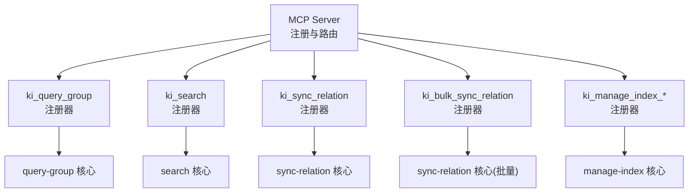
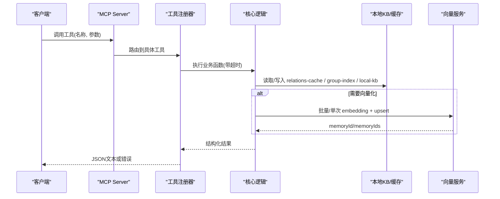
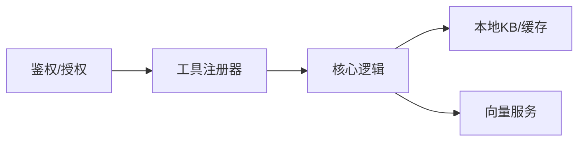

# MCP工具API参考

<cite>
**本文引用的文件**
- [mcp-server.ts](file://src/mcp-server.ts)
- [query-group.ts（MCP注册）](file://src/lib/mcp-tools/query-group.ts)
- [search.ts（MCP注册）](file://src/lib/mcp-tools/search.ts)
- [sync-relation.ts（MCP注册）](file://src/lib/mcp-tools/sync-relation.ts)
- [bulk-sync-relation.ts（MCP注册）](file://src/lib/mcp-tools/bulk-sync-relation.ts)
- [manage-index.ts（MCP注册）](file://src/lib/mcp-tools/manage-index.ts)
- [query-group.ts（核心逻辑）](file://src/query-group.ts)
- [search.ts（核心逻辑）](file://src/search.ts)
- [sync-relation.ts（核心逻辑）](file://src/sync-relation.ts)
- [manage-index.ts（核心逻辑）](file://src/manage-index.ts)
</cite>

## 目录
1. [简介](#简介)
2. [项目结构](#项目结构)
3. [核心组件](#核心组件)
4. [架构总览](#架构总览)
5. [详细组件分析](#详细组件分析)
6. [依赖关系分析](#依赖关系分析)
7. [性能考虑](#性能考虑)
8. [故障排查指南](#故障排查指南)
9. [结论](#结论)
10. [附录](#附录)

## 简介
本参考文档面向调用方与集成方，系统化说明通过MCP暴露的11个工具的接口规范、参数定义、返回格式、错误码与处理建议，并提供实际调用示例、最佳实践、执行顺序与批量优化建议。这些工具覆盖知识索引的查询、检索、写入、批量写入、索引管理、存储、删除、范围列表、标签列表与模块信息查询等关键能力。

## 项目结构
MCP服务在启动时统一注册全部工具，每个工具由独立的注册器封装参数校验、超时控制与结果包装，再委托给核心业务逻辑实现。核心逻辑位于各功能模块中，负责数据一致性、向量层交互与本地KB持久化。

图表来源
- [mcp-server.ts:54-70](file://src/mcp-server.ts#L54-L70)
- [query-group.ts（MCP注册）:6-52](file://src/lib/mcp-tools/query-group.ts#L6-L52)
- [search.ts（MCP注册）:6-49](file://src/lib/mcp-tools/search.ts#L6-L49)
- [sync-relation.ts（MCP注册）:6-43](file://src/lib/mcp-tools/sync-relation.ts#L6-L43)
- [bulk-sync-relation.ts（MCP注册）:6-42](file://src/lib/mcp-tools/bulk-sync-relation.ts#L6-L42)
- [manage-index.ts（MCP注册）:13-112](file://src/lib/mcp-tools/manage-index.ts#L13-L112)

章节来源
- [mcp-server.ts:54-70](file://src/mcp-server.ts#L54-L70)

## 核心组件
- ki_query_group：查询 Group 树、Relations 与词云，支持按分区展示与语义兜底。
- ki_search：语义检索知识库内容，支持多 tag 过滤、阈值过滤与原文召回。
- ki_sync_relation：单条写入/更新 Relation 到本地 KB，可选向量化。
- ki_bulk_sync_relation：批量写入/更新 Relation，一次 embedding + 一次向量写入，显著优于多次并发单条写入。
- ki_manage_index_create / ki_manage_index_delete / ki_manage_index_list：Group 树索引创建、空节点删除与 scope 列表查询。
- ki_store / ki_bulk_store / ki_delete_relation / ki_scope_list / ki_tag_list / ki_get_module_info：其他能力由对应注册器与核心逻辑提供（详见后续章节）。

章节来源
- [mcp-server.ts:54-70](file://src/mcp-server.ts#L54-L70)
- [query-group.ts（MCP注册）:6-52](file://src/lib/mcp-tools/query-group.ts#L6-L52)
- [search.ts（MCP注册）:6-49](file://src/lib/mcp-tools/search.ts#L6-L49)
- [sync-relation.ts（MCP注册）:6-43](file://src/lib/mcp-tools/sync-relation.ts#L6-L43)
- [bulk-sync-relation.ts（MCP注册）:6-42](file://src/lib/mcp-tools/bulk-sync-relation.ts#L6-L42)
- [manage-index.ts（MCP注册）:13-112](file://src/lib/mcp-tools/manage-index.ts#L13-L112)

## 架构总览
下图展示了从MCP请求到核心逻辑再到存储/向量层的调用链。所有工具均通过注册器进行参数校验与超时保护，核心逻辑负责数据一致性与外部系统交互。

图表来源
- [mcp-server.ts:54-70](file://src/mcp-server.ts#L54-L70)
- [search.ts（核心逻辑）:70-199](file://src/search.ts#L70-L199)
- [sync-relation.ts（核心逻辑）:407-786](file://src/sync-relation.ts#L407-L786)

## 详细组件分析

### 工具一：ki_query_group
- 功能描述：查询 Group 树、Relations 与词云，支持 hot/warm/cold/emerging/full 多种模式，支持语义兜底。
- 输入参数
  - scope: string，可选，默认 default
  - groups: string，可选，逗号分隔的 Group 路径列表
  - group: string，可选，groups 的单数别名
  - hot_count: number，可选，默认 5
  - depth: number，可选，默认 4，范围 1-10
  - mode: string，可选，默认 hot，支持逗号分隔多个值
  - auto_fallback: boolean，可选，默认 true
- 输出格式
  - 成功：content 为文本，内容为格式化后的分组视图与统计信息
  - 失败：isError=true，content 包含错误信息
- 使用示例
  - 查询某 Group 的热门 Relations：传入 groups="配置/API"，mode="hot"，hot_count=5
  - 全量视图：mode="full"，depth=4
- 错误码与建议
  - 未找到 group-index.json：检查 scope 是否正确或先初始化
  - 向量不可用：自动降级为仅索引视图
- 依赖与顺序
  - 依赖 group-index.json、relations-cache.json；可选依赖向量服务用于语义兜底

章节来源
- [query-group.ts（MCP注册）:6-52](file://src/lib/mcp-tools/query-group.ts#L6-L52)
- [query-group.ts（核心逻辑）:596-745](file://src/query-group.ts#L596-L745)

### 工具二：ki_search
- 功能描述：语义检索知识库内容，支持多 tag 过滤、相似度阈值与原文召回。
- 输入参数
  - scope: string，可选，默认 default
  - query: string，必填
  - limit: number，可选，默认 10
  - threshold: number，可选，范围 0-1
  - tags: string，可选，逗号分隔多个 tag（OR）
  - include_original: boolean，可选，默认 false
- 输出格式
  - 成功：content 为 JSON，包含 results 数组（每条命中含 score、group、relation、original 等）
  - 失败：isError=true，content 包含错误详情（可能含 degraded 标记）
- 使用示例
  - 基础检索：query="认证流程"，limit=10
  - 指定 tag：tags="api,auth"
  - 返回原文：include_original=true
- 错误码与建议
  - 向量服务不可用：degraded=true，建议重试或检查向量服务状态
  - 原文不可用：已降级返回向量文档并提示
- 依赖与顺序
  - 依赖向量服务；可选依赖本地 KB 以获取原文

章节来源
- [search.ts（MCP注册）:6-49](file://src/lib/mcp-tools/search.ts#L6-L49)
- [search.ts（核心逻辑）:70-199](file://src/search.ts#L70-L199)

### 工具三：ki_sync_relation
- 功能描述：写入/更新 Relation 到本地 KB，自动补建 Group 树，可选向量化。
- 输入参数
  - scope: string，可选，默认 default
  - group: string，必填
  - relation: string，必填
  - module_info: string，必填
  - vector: boolean，可选，默认 true
  - tags: string，可选，逗号分隔自定义标签
- 输出格式
  - 成功：JSON，包含 relation、evicted、wikiSynced、vectorStored/vectorReason 等
  - 失败：isError=true，content 包含错误信息
- 使用示例
  - 写入一条 Relation：group="配置/API"，relation="鉴权流程"，module_info="Markdown内容"
  - 非向量化：vector=false（仅写 KB 层）
- 错误码与建议
  - 非法 relation 名：避免包含 "/"、"\\" 或 ".."
  - 向量服务不可用：vectorStored=false，可稍后重建向量
- 依赖与顺序
  - 依赖本地 KB 与 relations-cache；可选依赖向量服务

章节来源
- [sync-relation.ts（MCP注册）:6-43](file://src/lib/mcp-tools/sync-relation.ts#L6-L43)
- [sync-relation.ts（核心逻辑）:129-221](file://src/sync-relation.ts#L129-L221)

### 工具四：ki_bulk_sync_relation
- 功能描述：批量写入/更新 Relation，一次 embedding + 一次向量写入，显著提升吞吐。
- 输入参数
  - scope: string，可选，默认 default
  - items: array，必填，每项包含 group、relation、module_info、可选 tags；长度 1-50
  - vector: boolean，可选，默认 true
- 输出格式
  - 成功：JSON，包含 total、succeeded、failed、skipped、results、vectorStored、hints 等
  - 失败：isError=true，content 包含错误信息
- 使用示例
  - 批量写入 20 条 Relation：items=[...20项]，vector=true
- 错误码与建议
  - 部分条目跳过：检查 group/relation/module_info 是否合法
  - 向量部分失败：保留旧向量，必要时 rebuild-vector
- 依赖与顺序
  - 依赖本地 KB、relations-cache；向量服务批量写入

章节来源
- [bulk-sync-relation.ts（MCP注册）:6-42](file://src/lib/mcp-tools/bulk-sync-relation.ts#L6-L42)
- [sync-relation.ts（核心逻辑）:407-786](file://src/sync-relation.ts#L407-L786)

### 工具五：ki_manage_index_create
- 功能描述：在 Group 树中创建新节点，父节点不存在时可自动补全。
- 输入参数
  - scope: string，可选，默认 default
  - name: string，必填，不能包含 "/"
  - parent: string，可选，父节点路径
- 输出格式
  - 成功：JSON，包含 path、hint（路径解析提示）
  - 失败：isError=true，content 包含错误信息
- 使用示例
  - 在根层创建节点：name="运维"
  - 在子节点下创建：parent="配置"，name="API"
- 错误码与建议
  - 父节点不存在：提供可用顶层节点提示
  - 节点已存在：避免重复创建
- 依赖与顺序
  - 依赖 group-index.json；可选依赖 relations-cache 用于路径解析

章节来源
- [manage-index.ts（MCP注册）:13-44](file://src/lib/mcp-tools/manage-index.ts#L13-L44)
- [manage-index.ts（核心逻辑）:82-137](file://src/manage-index.ts#L82-L137)

### 工具六：ki_manage_index_delete
- 功能描述：删除 Group 树中的空节点（仅限无子节点、无 relation、无本地 KB 的节点）。
- 输入参数
  - scope: string，可选，默认 default
  - name: string，必填，不能包含 "/"
  - parent: string，可选，父节点路径
- 输出格式
  - 成功：JSON，包含 path、hint
  - 失败：isError=true，content 包含错误信息与可用子节点提示
- 使用示例
  - 删除空节点：name="测试"，parent="临时"
- 错误码与建议
  - 非空节点：引导使用 CLI 级联删除或先清空 relation
- 依赖与顺序
  - 依赖 group-index.json、relations-cache、local-kb

章节来源
- [manage-index.ts（MCP注册）:73-112](file://src/lib/mcp-tools/manage-index.ts#L73-L112)
- [manage-index.ts（核心逻辑）:185-298](file://src/manage-index.ts#L185-L298)

### 工具七：ki_manage_index_list
- 功能描述：列出所有 scope（含已注册但未初始化的）及其顶层 Group，带 registered/initialized 标注。
- 输入参数：无
- 输出格式
  - 成功：JSON，包含 scopes 数组与 total
  - 失败：isError=true，content 包含错误信息
- 使用示例
  - 直接调用，无需参数
- 依赖与顺序
  - 依赖配置与磁盘扫描

章节来源
- [manage-index.ts（MCP注册）:46-71](file://src/lib/mcp-tools/manage-index.ts#L46-L71)
- [manage-index.ts（核心逻辑）:145-166](file://src/manage-index.ts#L145-L166)

### 工具八：ki_store
- 功能描述：将数据写入本地 KB 或缓存（具体行为由对应核心逻辑决定）。
- 输入参数：由对应注册器定义（参见 mcp-server 注册处）
- 输出格式：JSON 或文本，视实现而定
- 使用示例：根据具体参数调用
- 错误码与建议：遵循通用错误处理策略

章节来源
- [mcp-server.ts:54-70](file://src/mcp-server.ts#L54-L70)

### 工具九：ki_bulk_store
- 功能描述：批量写入数据至本地 KB 或缓存，提升吞吐。
- 输入参数：由对应注册器定义
- 输出格式：JSON，包含成功/失败计数与明细
- 使用示例：批量提交 items 数组
- 错误码与建议：部分失败不影响整体，关注 failed/skipped

章节来源
- [mcp-server.ts:54-70](file://src/mcp-server.ts#L54-L70)

### 工具十：ki_delete_relation
- 功能描述：删除指定 Relation，清理本地 KB、缓存与向量记忆。
- 输入参数：由对应注册器定义
- 输出格式：JSON，包含删除结果与向量清理状态
- 使用示例：指定 scope、group、relation
- 错误码与建议：向量服务不可用时记录原因，可稍后清理

章节来源
- [mcp-server.ts:54-70](file://src/mcp-server.ts#L54-L70)

### 工具十一：ki_scope_list
- 功能描述：列出当前环境可用的 scope 列表。
- 输入参数：无
- 输出格式：JSON，包含 scope 列表与元信息
- 使用示例：直接调用
- 错误码与建议：权限不足时返回空或受限列表

章节来源
- [mcp-server.ts:54-70](file://src/mcp-server.ts#L54-L70)

### 工具十二：ki_tag_list
- 功能描述：列出当前 scope 下的可用标签集合。
- 输入参数：scope（可选）
- 输出格式：JSON，包含 tags 列表
- 使用示例：传入 scope 获取该 scope 的标签
- 错误码与建议：向量服务不可用时返回空或缓存结果

章节来源
- [mcp-server.ts:54-70](file://src/mcp-server.ts#L54-L70)

### 工具十三：ki_get_module_info
- 功能描述：获取模块信息（如 group/index 或 KB 内容摘要）。
- 输入参数：由对应注册器定义
- 输出格式：JSON，包含模块元数据
- 使用示例：传入 scope/group/relation
- 错误码与建议：资源不存在时返回明确提示

章节来源
- [mcp-server.ts:54-70](file://src/mcp-server.ts#L54-L70)

## 依赖关系分析
- 工具注册器依赖核心逻辑：每个工具通过注册器将参数校验、超时与结果包装委托给核心实现。
- 核心逻辑依赖存储与向量服务：
  - 本地 KB：relations-cache.json、group-index.json、local-kb/index.json
  - 向量服务：embedding 与 upsert/delete
- 权限与鉴权：HTTP 模式下对 manage_index_* 等敏感操作进行越权校验；list-scopes 可按授权 scope 过滤。

图表来源
- [mcp-server.ts:54-70](file://src/mcp-server.ts#L54-L70)
- [manage-index.ts（MCP注册）:13-112](file://src/lib/mcp-tools/manage-index.ts#L13-L112)

章节来源
- [mcp-server.ts:54-70](file://src/mcp-server.ts#L54-L70)
- [manage-index.ts（MCP注册）:13-112](file://src/lib/mcp-tools/manage-index.ts#L13-L112)

## 性能考虑
- 批量优先：当需要同时写入多条 Relation 时，优先使用 ki_bulk_sync_relation，减少 embedding HTTP 往返与 worker 写入次数。
- 阈值与限制：合理设置 limit 与 threshold，避免过大结果集导致响应缓慢。
- 向量服务可用性：向量服务不可用时，写入仍可完成但无法被搜索召回；建议监控并定期重建向量。
- 超时控制：注册器内置超时保护，避免长耗时阻塞；批量操作建议使用专用超时窗口。

[本节为通用指导，不直接分析具体文件]

## 故障排查指南
- 向量服务不可用：ki_search 返回 degraded；ki_sync_relation/bulk 返回 vectorStored=false 与 reason；检查向量服务状态与网络。
- 原文不可用：ki_search include_original=true 时若无法定位本地 KB，会降级返回向量文档并提示；建议同步或重建 KB。
- 非法 relation 名：避免包含 "/"、"\\" 或 ".."；否则会被跳过并计入 failed。
- 权限问题：HTTP 模式下非回环绑定需 Token；list-scopes 受授权 scope 过滤影响。
- 启动预检失败：MCP 启动前执行健康检查，失败则拒绝启动；运行 ki doctor 排查。

章节来源
- [search.ts（核心逻辑）:70-199](file://src/search.ts#L70-L199)
- [sync-relation.ts（核心逻辑）:407-786](file://src/sync-relation.ts#L407-L786)
- [mcp-server.ts:660-678](file://src/mcp-server.ts#L660-L678)

## 结论
本参考文档系统化梳理了MCP暴露的工具接口，涵盖参数、返回、错误与最佳实践。建议在大规模写入场景优先使用批量工具，并结合阈值与标签过滤优化检索性能。遇到向量服务异常时，应关注降级策略与重建流程，确保知识库的可检索性与一致性。

[本节为总结性内容，不直接分析具体文件]

## 附录
- 常见调用顺序
  - 新建 Group：ki_manage_index_create → ki_sync_relation（或批量）→ ki_search 验证
  - 批量导入：ki_bulk_sync_relation → ki_search（含 include_original）→ ki_query_group 查看分区
  - 清理数据：ki_delete_relation → ki_manage_index_delete（空节点）→ 重建向量（如需）

[本节为概念性内容，不直接分析具体文件]