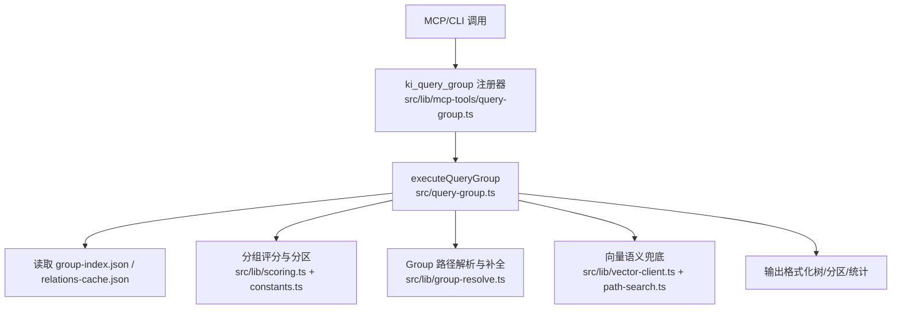
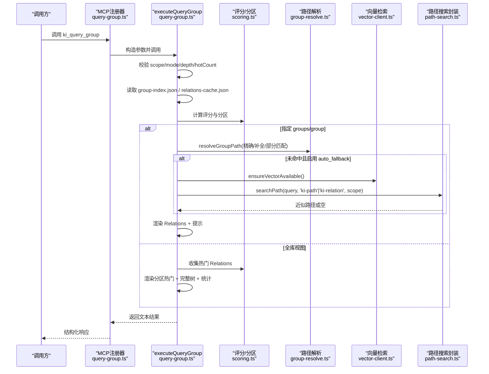
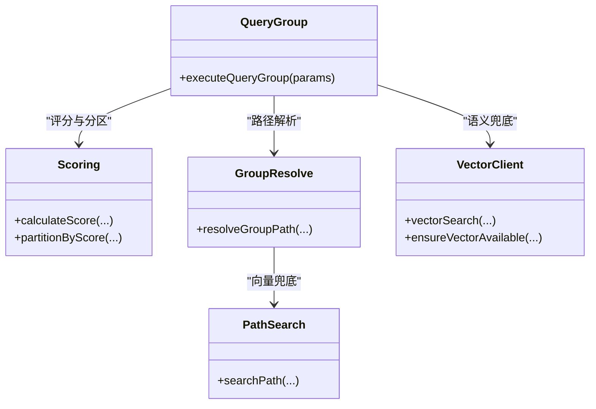

# ki_query_group工具

<cite>
**本文引用的文件**
- [src/query-group.ts](file://src/query-group.ts)
- [src/lib/mcp-tools/query-group.ts](file://src/lib/mcp-tools/query-group.ts)
- [src/lib/vector-client.ts](file://src/lib/vector-client.ts)
- [src/lib/group-resolve.ts](file://src/lib/group-resolve.ts)
- [src/lib/path-search.ts](file://src/lib/path-search.ts)
- [src/lib/scoring.ts](file://src/lib/scoring.ts)
- [src/lib/constants.ts](file://src/lib/constants.ts)
- [test/query-group.test.ts](file://test/query-group.test.ts)
- [docs/cli.md](file://docs/cli.md)
</cite>

## 目录
1. [简介](#简介)
2. [项目结构](#项目结构)
3. [核心组件](#核心组件)
4. [架构总览](#架构总览)
5. [详细组件分析](#详细组件分析)
6. [依赖关系分析](#依赖关系分析)
7. [性能考量](#性能考量)
8. [故障排查指南](#故障排查指南)
9. [结论](#结论)
10. [附录：参数与示例](#附录参数与示例)

## 简介
ki_query_group 是知识索引系统中的只读工具，用于查询 Group 树结构、Relations 关系以及按分区（hot/warm/cold/emerging/full）展示结果。该工具支持向量语义兜底机制：当精确匹配失败时，自动通过向量检索进行模糊匹配并返回近似路径或内容片段，提升容错性与可用性。

## 项目结构
- 入口与业务逻辑：src/query-group.ts
- MCP 工具注册与参数校验：src/lib/mcp-tools/query-group.ts
- 向量检索与引擎封装：src/lib/vector-client.ts
- Group 路径解析与模糊匹配：src/lib/group-resolve.ts、src/lib/path-search.ts
- 评分与冷热分区算法：src/lib/scoring.ts、src/lib/constants.ts
- 测试与文档：test/query-group.test.ts、docs/cli.md

图表来源
- [src/lib/mcp-tools/query-group.ts:6-53](file://src/lib/mcp-tools/query-group.ts#L6-L53)
- [src/query-group.ts:596-746](file://src/query-group.ts#L596-L746)
- [src/lib/scoring.ts:136-209](file://src/lib/scoring.ts#L136-L209)
- [src/lib/group-resolve.ts:117-219](file://src/lib/group-resolve.ts#L117-L219)
- [src/lib/vector-client.ts:477-506](file://src/lib/vector-client.ts#L477-L506)
- [src/lib/path-search.ts:47-87](file://src/lib/path-search.ts#L47-L87)

章节来源
- [src/query-group.ts:1-784](file://src/query-group.ts#L1-L784)
- [src/lib/mcp-tools/query-group.ts:1-54](file://src/lib/mcp-tools/query-group.ts#L1-L54)

## 核心组件
- executeQueryGroup：统一入口，负责参数校验、数据加载、分区计算、模式渲染与错误处理。
- 评分与分区：calculateScore、partitionByScore、DEFAULT_PARTITION_CONFIG。
- Group 路径解析：resolveGroupPath，提供四层查找+向量兜底的策略。
- 向量客户端：vectorSearch、ensureVectorAvailable，提供混合检索（语义+FTS+RRF）。
- 路径搜索封装：searchPath，对 tag 过滤与阈值控制，异常静默降级。

章节来源
- [src/query-group.ts:596-746](file://src/query-group.ts#L596-L746)
- [src/lib/scoring.ts:44-57](file://src/lib/scoring.ts#L44-L57)
- [src/lib/scoring.ts:136-209](file://src/lib/scoring.ts#L136-L209)
- [src/lib/constants.ts:24-50](file://src/lib/constants.ts#L24-L50)
- [src/lib/group-resolve.ts:117-219](file://src/lib/group-resolve.ts#L117-L219)
- [src/lib/vector-client.ts:477-506](file://src/lib/vector-client.ts#L477-L506)
- [src/lib/path-search.ts:47-87](file://src/lib/path-search.ts#L47-L87)

## 架构总览
ki_query_group 的调用链路如下：
- MCP/CLI 传入参数，经 zod 校验后调用 executeQueryGroup。
- 读取 group-index.json 与 relations-cache.json，计算各 Group 聚合评分并按配置分区。
- 若指定 groups/group，则解析路径（含模糊匹配），渲染 Relations 列表；否则渲染多分区热门列表与完整树。
- 当精确匹配失败且启用 auto_fallback，调用 vectorSearch/searchPath 进行语义兜底，返回近似路径或内容片段。

图表来源
- [src/lib/mcp-tools/query-group.ts:6-53](file://src/lib/mcp-tools/query-group.ts#L6-L53)
- [src/query-group.ts:611-746](file://src/query-group.ts#L611-L746)
- [src/lib/scoring.ts:136-209](file://src/lib/scoring.ts#L136-L209)
- [src/lib/group-resolve.ts:117-219](file://src/lib/group-resolve.ts#L117-L219)
- [src/lib/vector-client.ts:420-506](file://src/lib/vector-client.ts#L420-L506)
- [src/lib/path-search.ts:47-87](file://src/lib/path-search.ts#L47-L87)

## 详细组件分析

### 参数定义与行为
- scope：项目隔离标识。用于限定 group-index、relations-cache 及向量检索范围。
- groups/group：Group 路径列表或单数别名。逗号分隔多个路径；同时传 groups 与 group 时以 groups 为准。
- hot_count：热门展示个数，默认 5。
- depth：索引层级深度，1-10，默认 4。
- mode：展示分区模式，支持逗号分隔多值：hot|warm|cold|emerging|full。
- auto_fallback：是否启用语义兜底，默认 true。

章节来源
- [src/lib/mcp-tools/query-group.ts:10-20](file://src/lib/mcp-tools/query-group.ts#L10-L20)
- [src/query-group.ts:508-545](file://src/query-group.ts#L508-L545)
- [docs/cli.md:542-565](file://docs/cli.md#L542-L565)

### 请求示例
- CLI 方式（参考 docs/cli.md 中的命令格式）：
  - 查询某 Group 的 Relations：ki query-group --scope <scope> --groups "<group>"
  - 多 Group 查询：ki query-group --scope <scope> --groups "<g1>,<g2>"
  - 指定分区与数量：ki query-group --scope <scope> --mode hot,warm --hot-count 3
  - 显示完整树：ki query-group --scope <scope> --mode full --depth 2
- MCP 方式（由注册器包装为 JSON-RPC 工具调用，参数同上述字段）

章节来源
- [docs/cli.md:542-565](file://docs/cli.md#L542-L565)
- [src/lib/mcp-tools/query-group.ts:6-53](file://src/lib/mcp-tools/query-group.ts#L6-L53)

### 响应格式说明
- 成功：返回包含 scope 与 output 的结构化对象；output 为人类可读文本，包含分区热门、完整树、统计信息或指定 Group 的 Relations。
- 失败：返回 ok=false 与 error 描述，如 group-index.json 不存在、mode 无效等。

章节来源
- [src/query-group.ts:596-610](file://src/query-group.ts#L596-L610)
- [src/query-group.ts:743-746](file://src/query-group.ts#L743-L746)

### 错误处理策略
- 参数校验：mode 为空或非法值直接返回错误；depth/hotCount 非正整数回退默认值并告警。
- 数据缺失：group-index.json 不存在时返回明确错误。
- 向量兜底失败：网络/服务不可用或检索异常时静默降级，不影响主流程。
- 进程资源：CLI 每次调用结束关闭向量引擎，避免进程无法退出。

章节来源
- [src/query-group.ts:616-623](file://src/query-group.ts#L616-L623)
- [src/query-group.ts:631-633](file://src/query-group.ts#L631-L633)
- [src/query-group.ts:657-672](file://src/query-group.ts#L657-L672)
- [src/query-group.ts:770-773](file://src/query-group.ts#L770-L773)

### 使用最佳实践
- 合理设置 depth：大型 Group 树建议 depth≤4，避免输出过长。
- 按需选择 mode：仅查看热门用 hot；需要冷区诊断用 cold；需要全量浏览用 full。
- 利用 auto_fallback：在路径输入不精确时开启语义兜底，提高命中率。
- 控制 hot_count：根据展示需求调整，避免过多输出影响阅读。

章节来源
- [src/query-group.ts:520-532](file://src/query-group.ts#L520-L532)
- [src/query-group.ts:730-742](file://src/query-group.ts#L730-L742)

## 依赖关系分析
- 评分与分区：依赖 scoring.ts 的 calculateScore 与 partitionByScore，以及 constants.ts 的 DEFAULT_PARTITION_CONFIG。
- 路径解析：依赖 group-resolve.ts 的多层匹配策略，必要时调用 path-search.ts 进行向量语义兜底。
- 向量检索：依赖 vector-client.ts 的 vectorSearch 与 ensureVectorAvailable，底层走 hybridSearch（语义+FTS+RRF）。
- MCP 集成：通过 lib/mcp-tools/query-group.ts 将 executeQueryGroup 暴露为工具，并进行超时与错误包装。

图表来源
- [src/query-group.ts:596-746](file://src/query-group.ts#L596-L746)
- [src/lib/scoring.ts:44-57](file://src/lib/scoring.ts#L44-L57)
- [src/lib/scoring.ts:136-209](file://src/lib/scoring.ts#L136-L209)
- [src/lib/group-resolve.ts:117-219](file://src/lib/group-resolve.ts#L117-L219)
- [src/lib/vector-client.ts:477-506](file://src/lib/vector-client.ts#L477-L506)
- [src/lib/path-search.ts:47-87](file://src/lib/path-search.ts#L47-L87)

章节来源
- [src/query-group.ts:596-746](file://src/query-group.ts#L596-L746)
- [src/lib/scoring.ts:136-209](file://src/lib/scoring.ts#L136-L209)
- [src/lib/group-resolve.ts:117-219](file://src/lib/group-resolve.ts#L117-L219)
- [src/lib/vector-client.ts:477-506](file://src/lib/vector-client.ts#L477-L506)
- [src/lib/path-search.ts:47-87](file://src/lib/path-search.ts#L47-L87)

## 性能考量
- 评分与分区复杂度：partitionByScore 先排序再分配，时间复杂度 O(n log n)，适用于 Group 与 Relation 集合规模适中场景。
- 向量检索开销：hybridSearch 涉及嵌入与 FTS，建议在 auto_fallback 仅在精确匹配失败时触发，减少不必要调用。
- 树渲染深度：depth 越大输出越多，建议结合 mode=full 谨慎使用，避免大输出导致 I/O 压力。
- 引擎生命周期：CLI 每次调用结束后关闭引擎，避免常驻占用；MCP 层可启用空闲释放锁以提升并发能力。

章节来源
- [src/lib/scoring.ts:136-209](file://src/lib/scoring.ts#L136-L209)
- [src/lib/vector-client.ts:477-506](file://src/lib/vector-client.ts#L477-L506)
- [src/query-group.ts:770-773](file://src/query-group.ts#L770-L773)

## 故障排查指南
- 向量库被占用：ensureVectorAvailable 返回 LOCKED 时，需等待其他进程释放或执行重建恢复。
- 向量库损坏：返回 CORRUPTED 时，建议执行 restore/rebuild-vector。
- 路径未匹配：检查 group-index.json 是否存在对应路径；必要时开启 auto_fallback 并使用模糊匹配。
- 模式无效：确认 mode 为 hot|warm|cold|emerging|full 之一，支持逗号分隔。

章节来源
- [src/lib/vector-client.ts:420-467](file://src/lib/vector-client.ts#L420-L467)
- [src/query-group.ts:616-623](file://src/query-group.ts#L616-L623)
- [src/lib/group-resolve.ts:117-219](file://src/lib/group-resolve.ts#L117-L219)

## 结论
ki_query_group 提供了稳定的 Group 树与 Relations 查询能力，并通过评分与分区机制实现热温冷新兴的可视化展示。向量语义兜底增强了容错性，适合在路径输入不精确或索引更新延迟的场景下使用。配合合理的参数配置与性能优化建议，可在大规模知识库中高效获取所需信息。

## 附录：参数与示例

### 参数表
- scope：项目隔离标识（必填）
- groups/group：Group 路径列表或单数别名（可选）
- hot_count：热门展示个数，默认 5（可选）
- depth：索引层级深度，1-10，默认 4（可选）
- mode：展示分区模式，hot|warm|cold|emerging|full，支持逗号分隔（可选，默认 hot）
- auto_fallback：是否启用语义兜底，默认 true（可选）

章节来源
- [src/lib/mcp-tools/query-group.ts:10-20](file://src/lib/mcp-tools/query-group.ts#L10-L20)
- [src/query-group.ts:508-545](file://src/query-group.ts#L508-L545)
- [docs/cli.md:542-565](file://docs/cli.md#L542-L565)

### 请求示例
- 查询单个 Group：
  - ki query-group --scope <scope> --groups "<group>"
- 查询多个 Group：
  - ki query-group --scope <scope> --groups "<g1>,<g2>"
- 指定分区与数量：
  - ki query-group --scope <scope> --mode hot,warm --hot-count 3
- 显示完整树：
  - ki query-group --scope <scope> --mode full --depth 2

章节来源
- [docs/cli.md:542-565](file://docs/cli.md#L542-L565)

### 响应示例
- 成功：
  - { ok: true, scope: "<scope>", output: "..." }
- 失败：
  - { ok: false, error: "错误描述" }

章节来源
- [src/query-group.ts:596-610](file://src/query-group.ts#L596-L610)
- [src/query-group.ts:743-746](file://src/query-group.ts#L743-L746)

### 与向量检索系统的集成方式
- 精确匹配失败时，调用 ensureVectorAvailable 检测可用性。
- 通过 vectorSearch 进行混合检索（语义+FTS+RRF），按 scope 与 tag 过滤。
- 路径搜索封装 searchPath 对 ki-path/ki-relation 标签进行定向检索，异常静默降级。

章节来源
- [src/query-group.ts:657-672](file://src/query-group.ts#L657-L672)
- [src/lib/vector-client.ts:477-506](file://src/lib/vector-client.ts#L477-L506)
- [src/lib/path-search.ts:47-87](file://src/lib/path-search.ts#L47-L87)

### 性能优化建议
- 限制 depth 与 hot_count，避免过大输出。
- 仅在必要时启用 auto_fallback，减少向量检索开销。
- 合理使用 mode，聚焦所需分区，降低计算与 I/O 压力。
- 在 MCP 常驻模式下启用空闲释放锁，提升并发能力。

章节来源
- [src/query-group.ts:520-532](file://src/query-group.ts#L520-L532)
- [src/query-group.ts:730-742](file://src/query-group.ts#L730-L742)
- [src/lib/vector-client.ts:164-181](file://src/lib/vector-client.ts#L164-L181)