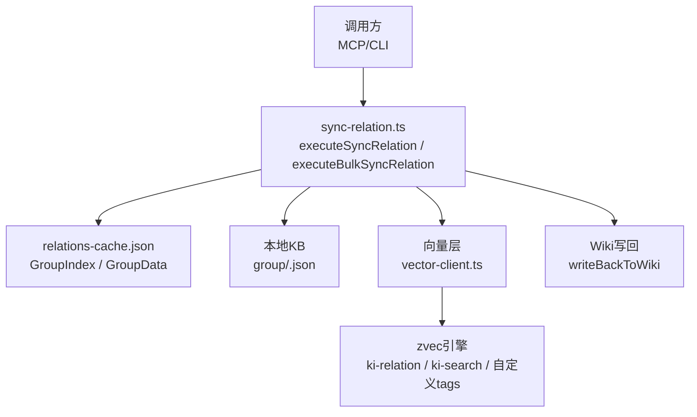
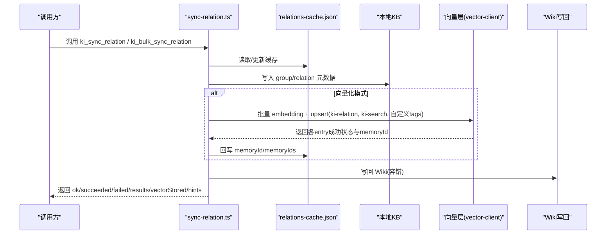
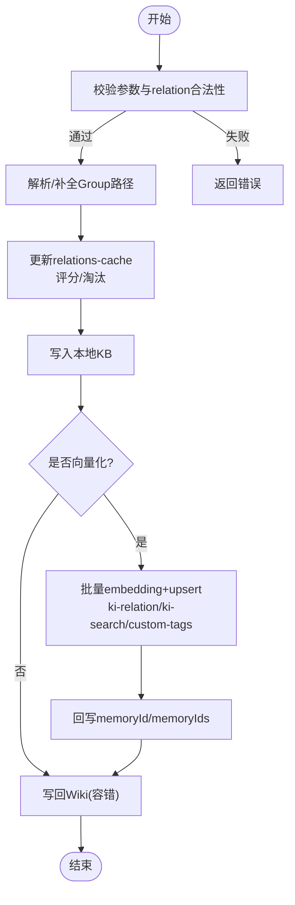
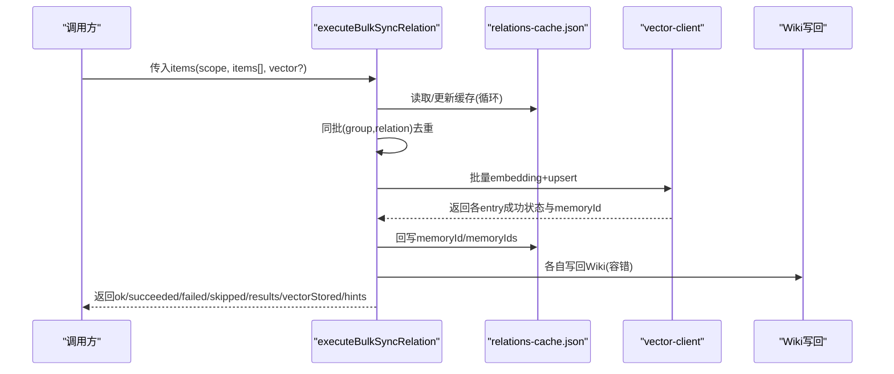
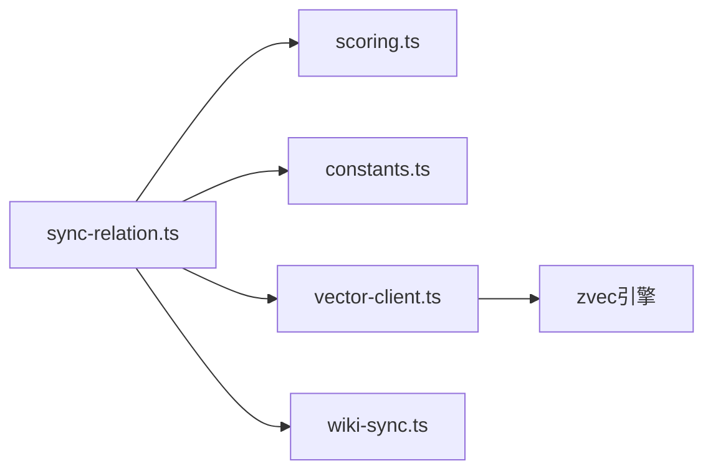

# 关系同步工具

<cite>
**本文引用的文件**
- [src/sync-relation.ts](file://src/sync-relation.ts)
- [src/lib/scoring.ts](file://src/lib/scoring.ts)
- [src/lib/constants.ts](file://src/lib/constants.ts)
- [docs/cli.md](file://docs/cli.md)
- [docs/tags-design.md](file://docs/tags-design.md)
- [.requirements/2026-06-18-向量存储与KB写入并行化优化/design/DESIGN.md](file://.requirements/2026-06-18-向量存储与KB写入并行化优化/design/DESIGN.md)
- [.requirements/vector-fallback/design/DESIGN.md](file://.requirements/vector-fallback/design/DESIGN.md)
- [.requirements/2026-07-17-KiSearch-zvec-node-mcp/design/MIGRATION_STEP_C_MEM_TO_ZVEC.md](file://.requirements/2026-07-17-KiSearch-zvec-node-mcp/design/MIGRATION_STEP_C_MEM_TO_ZVEC.md)
- [.requirements/2026-07-17-KiSearch-zvec-node-mcp/design/REF_S03_VectorAdapter_DESIGN.md](file://.requirements/2026-07-17-KiSearch-zvec-node-mcp/design/REF_S03_VectorAdapter_DESIGN.md)
</cite>

## 目录
1. [简介](#简介)
2. [项目结构](#项目结构)
3. [核心组件](#核心组件)
4. [架构总览](#架构总览)
5. [详细组件分析](#详细组件分析)
6. [依赖关系分析](#依赖关系分析)
7. [性能考虑](#性能考虑)
8. [故障排查指南](#故障排查指南)
9. [结论](#结论)
10. [附录](#附录)

## 简介
本文件面向“关系同步工具”的 API 文档，覆盖两个核心工具：
- ki_sync_relation：单条关系同步（Relation 写入 KB、缓存与可选向量层）
- ki_bulk_sync_relation：批量关系同步（一次 embedding + 一次向量写入，吞吐更高）

文档同时说明 Relation 数据模型字段约定、批量参数配置、错误重试机制、进度跟踪与性能优化建议，并给出数据一致性保证与冲突解决策略。

## 项目结构
关系同步的核心实现集中在以下文件：
- 入口与流程编排：src/sync-relation.ts
- 评分与分区：src/lib/scoring.ts
- 常量与标签解析：src/lib/constants.ts
- CLI 契约与返回结构：docs/cli.md
- 标签体系设计：docs/tags-design.md
- 向量适配与迁移约束：.requirements/* 下的设计文档

图表来源
- [src/sync-relation.ts:129-221](file://src/sync-relation.ts#L129-L221)
- [src/sync-relation.ts:407-787](file://src/sync-relation.ts#L407-L787)
- [docs/cli.md:1046-1070](file://docs/cli.md#L1046-L1070)

章节来源
- [src/sync-relation.ts:1-1080](file://src/sync-relation.ts#L1-L1080)
- [docs/cli.md:1046-1070](file://docs/cli.md#L1046-L1070)

## 核心组件
- 单条同步：executeSyncRelation
  - 校验参数、自动补全 Group 路径、更新 relations-cache、落盘本地 KB、可选写入向量层、写回 Wiki。
- 批量同步：executeBulkSyncRelation
  - 循环处理 items，收集向量 entries，一次批量 embedding + upsert，拆分结果并回写 memoryId/memoryIds，统一持久化 cache，再各自写回 Wiki。
- Relation 数据模型：src/lib/scoring.ts 中的 Relation 接口
  - id、text、score、useCount、lastUsedTime、isImported、memoryId、sourcePath、memoryIds、tags。
- 标签体系：ki-relation（Relation 名称）、ki-search（内容语义）、自定义 tags（叠加在 ki-search 之上）。

章节来源
- [src/sync-relation.ts:343-392](file://src/sync-relation.ts#L343-L392)
- [src/lib/scoring.ts:19-36](file://src/lib/scoring.ts#L19-L36)
- [docs/tags-design.md:50-95](file://docs/tags-design.md#L50-L95)

## 架构总览
下图展示从调用到落盘的完整链路，包括缓存、KB、向量层与 Wiki 写回。

图表来源
- [src/sync-relation.ts:893-999](file://src/sync-relation.ts#L893-L999)
- [src/sync-relation.ts:407-787](file://src/sync-relation.ts#L407-L787)
- [docs/cli.md:1046-1070](file://docs/cli.md#L1046-L1070)

## 详细组件分析

### 单条关系同步：ki_sync_relation
- 输入参数
  - scope：必填，项目隔离标识
  - group：必填，Group 路径（支持层级嵌套）
  - relation：必填，Relation 名称
  - module_info：必填，本地 KB Markdown 内容
  - vector：可选，默认 true；false 仅写 KB 层，不产生 memoryId，不可被搜索召回
  - tags：可选，逗号分隔多个自定义标签，叠加在默认 ki-search 之上
- 处理流程
  - 参数校验与非法 relation 名拒绝（不能包含 /、\、..）
  - 自动补全 Group 路径（若存在歧义或需补全，返回 hint）
  - 更新 relations-cache（hot_relations 列表、评分、淘汰策略）
  - 写入本地 KB（group/relation.json）
  - 可选向量写入（ki-relation 路径向量 + ki-search 内容向量 + 自定义 tag 内容向量），失败不阻塞主流程
  - 写回 Wiki（失败不阻塞）
- 返回结构（节选）
  - ok、scope、relation、evicted、hint、vectorStored、vectorReason、contentTags、wikiSynced、wikiFile、wikiReason

图表来源
- [src/sync-relation.ts:893-999](file://src/sync-relation.ts#L893-L999)
- [src/sync-relation.ts:129-221](file://src/sync-relation.ts#L129-L221)

章节来源
- [src/sync-relation.ts:893-999](file://src/sync-relation.ts#L893-L999)
- [docs/cli.md:1046-1055](file://docs/cli.md#L1046-L1055)

### 批量关系同步：ki_bulk_sync_relation
- 输入参数
  - scope：可选，省略则用 default；strict 模式下必须传且须注册
  - items：必填，数组，每项含 group、relation、module_info、tags（可选）
  - vector：可选，默认 true；false 仅写 KB 层
  - 单次最多 50 条，超出请分批调用
- 处理流程
  - 阶段1：循环 syncSingleRelation 改 cache + 收集向量 entries
  - 阶段1.5：同批重复 (group, relation) 去重，后一条覆盖前一条
  - 阶段2：一次 vectorBulkStore 批量 embed + upsert
  - 阶段3：拆分结果，按 itemIdx 分组，回写 memoryId/memoryIds
  - 阶段4：一次 writeJson 落盘 cache
  - 阶段5：各自 wiki 写回（文件路径不同，天然无冲突）
- 返回结构（节选）
  - ok、scope、total、succeeded、failed、skipped、results[]、vectorStored（顶层）、hints（可选）
  - results[].vectorStored（逐条）：该条主内容向量（ki-search）是否成功写入
  - results[].vectorReason：部分失败原因（如部分内容向量写入失败）
  - results[].wikiSynced/wikiFile/wikiReason：Wiki 写回状态

图表来源
- [src/sync-relation.ts:407-787](file://src/sync-relation.ts#L407-L787)
- [docs/cli.md:1057-1070](file://docs/cli.md#L1057-L1070)

章节来源
- [src/sync-relation.ts:407-787](file://src/sync-relation.ts#L407-L787)
- [docs/cli.md:1057-1070](file://docs/cli.md#L1057-L1070)

### Relation 数据模型
- 字段定义（来自 scoring.ts）
  - id：字符串，自增 rel_xxx
  - text：Relation 名称
  - score：评分，基于 useCount 与 lastUsedTime
  - useCount：使用次数（防刷限制）
  - lastUsedTime：最近使用时间
  - isImported：是否导入标记
  - memoryId：关联到 memory store 的单值 ID（旧链路兼容）
  - sourcePath：原始文件相对路径（用于 diff 关联 memoryId）
  - memoryIds：多值 memoryId 数组（方案 D，导入链路使用）
  - tags：文档级自定义标签（如 ['api','auth']），持久化到 KB 层
- 标签体系
  - ki-relation：Relation 名称索引
  - ki-search：通用语义搜索
  - 自定义 tags：叠加在 ki-search 之上，用于更细粒度的检索过滤

章节来源
- [src/lib/scoring.ts:19-36](file://src/lib/scoring.ts#L19-L36)
- [docs/tags-design.md:50-95](file://docs/tags-design.md#L50-L95)

### 批量操作的参数配置
- 单条
  - scope/group/relation/module_info 为必填；vector 默认 true；tags 可选
- 批量
  - items 数组，每项含 group/relation/module_info/tags；单次最多 50 条；vector 默认 true
- 返回
  - 顶层 vectorStored：所有需向量化的条目全部完整写入成功才为 true
  - 逐条 vectorStored：该条主内容向量（ki-search）是否成功写入
  - hints：Group 路径解析提示（自动补全/歧义/未匹配）

章节来源
- [docs/cli.md:1046-1070](file://docs/cli.md#L1046-L1070)

### 错误重试机制
- 向量服务不可用
  - ensureVectorAvailable 检测，不可用时记录 reason，不阻塞 KB 层
- 向量写入异常
  - 捕获异常，标记 vectorStored=false 与 vectorReason，不影响 KB 层
- 旧 tag 清理失败
  - 仅可能残留孤儿向量，delete 时 search 兜底可清，不中断主流程
- 批量去重覆盖
  - 批次内同 group/relation 的后一条覆盖前一条，避免孤儿向量与误删

章节来源
- [src/sync-relation.ts:607-745](file://src/sync-relation.ts#L607-L745)
- [src/sync-relation.ts:801-891](file://src/sync-relation.ts#L801-L891)

### 进度跟踪
- 批量模式
  - 顶层 vectorStored 表示整体是否全部成功
  - results[].vectorStored 与 vectorReason 提供逐条状态
  - hints 提供 Group 路径解析提示
- 单条模式
  - hint 提供 Group 路径自动补全提示
  - vectorStored/vectorReason 透出向量写入状态
  - wikiSynced/wikiFile/wikiReason 透出 Wiki 写回状态

章节来源
- [src/sync-relation.ts:407-787](file://src/sync-relation.ts#L407-L787)
- [src/sync-relation.ts:893-999](file://src/sync-relation.ts#L893-L999)

### 性能优化建议
- 使用批量接口 ki_bulk_sync_relation，一次 embedding + 一次 worker upsert，显著降低网络与锁竞争开销
- 控制单次批量大小（≤50 条），避免过大批次导致超时或内存压力
- 合理设置 tags，减少不必要的自定义 tag 数量
- 非向量化模式（vector=false）仅写 KB 层，适合离线沉淀或调试
- 利用 Group 路径自动补全与去重，减少无效写入

章节来源
- [docs/cli.md:1057-1070](file://docs/cli.md#L1057-L1070)
- [.requirements/2026-06-18-向量存储与KB写入并行化优化/design/DESIGN.md:29-56](file://.requirements/2026-06-18-向量存储与KB写入并行化优化/design/DESIGN.md#L29-L56)

## 依赖关系分析
- 模块耦合
  - sync-relation.ts 依赖 scoring.ts（Relation 评分/分区）、constants.ts（默认分区配置、标签解析）、vector-client.ts（向量写入）、wiki-sync.ts（Wiki 写回）
- 外部依赖
  - zvec 引擎（向量库），embedding 提供方（siliconflow/openai-compatible）
- 潜在环路与风险
  - 向量服务不可用时的降级策略已内置，避免阻塞主流程
  - 批量去重避免重复写入导致的孤儿向量

图表来源
- [src/sync-relation.ts:1-36](file://src/sync-relation.ts#L1-L36)
- [src/lib/scoring.ts:1-36](file://src/lib/scoring.ts#L1-L36)
- [src/lib/constants.ts:1-98](file://src/lib/constants.ts#L1-L98)

章节来源
- [src/sync-relation.ts:1-36](file://src/sync-relation.ts#L1-L36)
- [src/lib/scoring.ts:1-36](file://src/lib/scoring.ts#L1-L36)
- [src/lib/constants.ts:1-98](file://src/lib/constants.ts#L1-L98)

## 性能考虑
- 批量写入优于多次并发单条写入，减少 HTTP 往返与锁竞争
- 向量服务不可用时的降级与重试策略保障稳定性
- 合理控制批次大小与标签数量，避免过度膨胀
- 使用 Group 路径自动补全与去重，减少无效操作

[本节为通用指导，无需特定文件引用]

## 故障排查指南
- 向量服务不可用
  - 检查 ensureVectorAvailable 返回的 reason，确认 embedding 提供方与网络连通性
- 向量写入部分失败
  - 查看 results[].vectorReason，必要时执行 rebuild-vector 恢复缺失 tag 向量
- Wiki 写回失败
  - 检查 wikiSynced 与 wikiReason，确认目标目录权限与路径合法性
- Group 路径解析异常
  - 关注 hints 提示，修正 group 路径或补全缺失节点

章节来源
- [src/sync-relation.ts:607-745](file://src/sync-relation.ts#L607-L745)
- [src/sync-relation.ts:893-999](file://src/sync-relation.ts#L893-L999)

## 结论
关系同步工具提供了稳定高效的单条与批量写入能力，结合评分与分区机制、向量层与 KB 层双写、Wiki 写回与完善的错误处理，满足知识沉淀与检索需求。建议优先使用批量接口，并结合 tags 与 hints 进行精细化控制与问题定位。

[本节为总结，无需特定文件引用]

## 附录
- 数据一致性保证
  - WAL 持久化：writeJson 原子写入，确保缓存一致性
  - 先写新向量后删旧向量，避免“先删后写”失败导致的数据丢失
  - 批量去重：同批同 group/relation 后一条覆盖前一条，避免孤儿向量
- 冲突解决策略
  - Group 路径自动补全与歧义提示，确保写入目标明确
  - 向量服务不可用或写入失败时，KB 层仍保持可用，后续可通过 rebuild-vector 恢复

章节来源
- [src/sync-relation.ts:407-787](file://src/sync-relation.ts#L407-L787)
- [src/sync-relation.ts:801-891](file://src/sync-relation.ts#L801-L891)