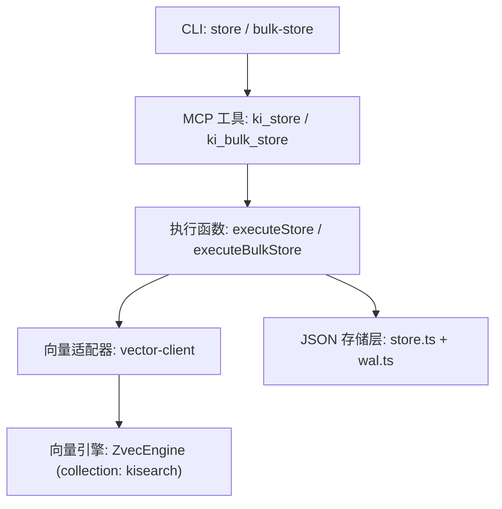
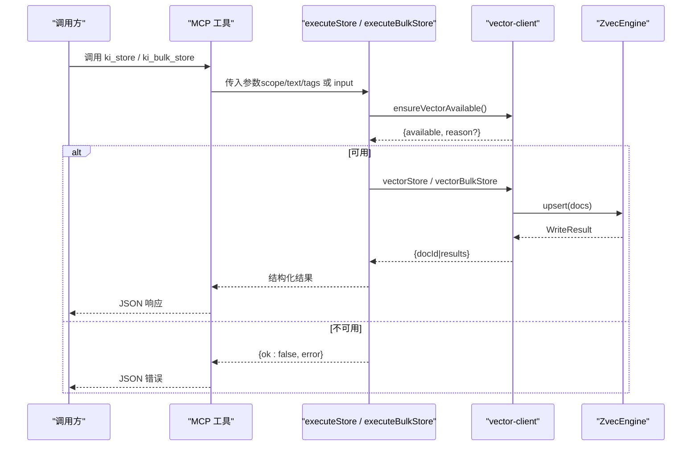
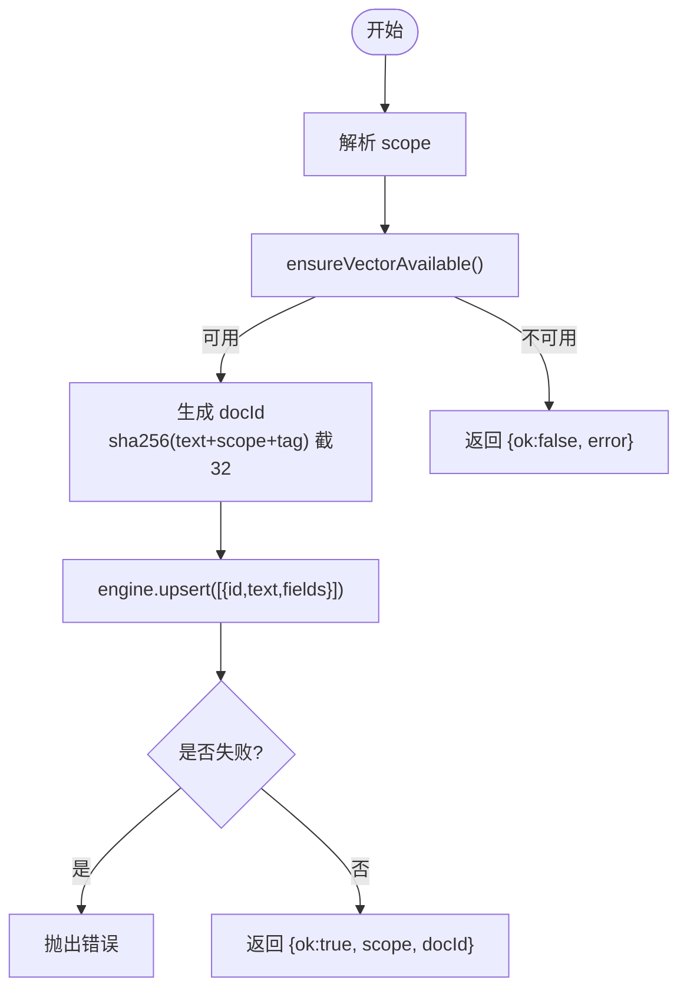
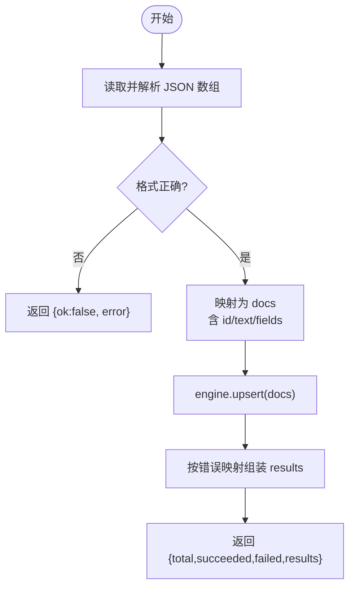
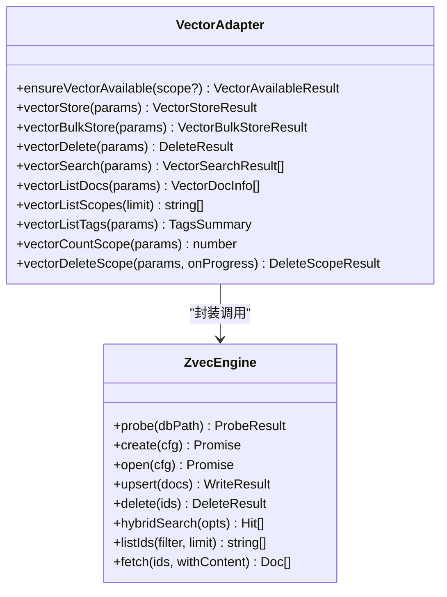
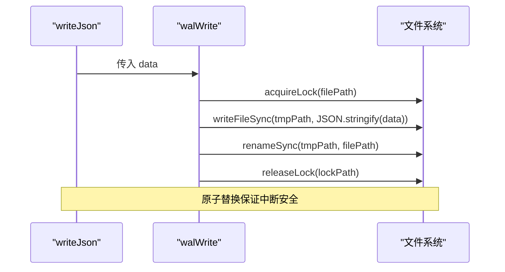
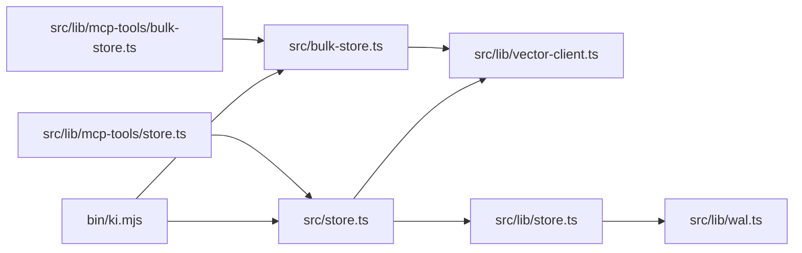

# 存储工具

<cite>
**本文引用的文件**
- [src/store.ts](file://src/store.ts)
- [src/bulk-store.ts](file://src/bulk-store.ts)
- [src/lib/vector-client.ts](file://src/lib/vector-client.ts)
- [src/lib/mcp-tools/store.ts](file://src/lib/mcp-tools/store.ts)
- [src/lib/mcp-tools/bulk-store.ts](file://src/lib/mcp-tools/bulk-store.ts)
- [src/lib/store.ts](file://src/lib/store.ts)
- [src/lib/wal.ts](file://src/lib/wal.ts)
- [bin/ki.mjs](file://bin/ki.mjs)
</cite>

## 目录
1. [简介](#简介)
2. [项目结构](#项目结构)
3. [核心组件](#核心组件)
4. [架构总览](#架构总览)
5. [详细组件分析](#详细组件分析)
6. [依赖关系分析](#依赖关系分析)
7. [性能与优化建议](#性能与优化建议)
8. [故障排查指南](#故障排查指南)
9. [结论](#结论)
10. [附录：API 参考](#附录api-参考)

## 简介
本文件面向 ki_store 与 ki_bulk_store 两个存储工具，提供完整的 API 说明、数据模型、序列化方式、事务与一致性保障、错误处理机制以及性能优化建议。内容基于仓库中 CLI 入口、MCP 工具注册、向量适配器（Vector Adapter）与 WAL 持久化实现进行梳理，确保读者既能快速上手调用，也能深入理解底层行为。

## 项目结构
存储能力由三层组成：
- 命令层：CLI 命令 store 与 bulk-store，负责参数解析、输入校验与结果输出。
- 工具层：MCP 工具 ki_store 与 ki_bulk_store，封装为可被外部系统调用的工具接口。
- 存储适配层：vector-client 统一对接向量引擎（ZvecEngine），完成向量化、索引写入、检索与管理；JSON 元数据通过 WAL 原子写保证一致性。

图表来源
- [src/store.ts:1-91](file://src/store.ts#L1-L91)
- [src/bulk-store.ts:1-110](file://src/bulk-store.ts#L1-L110)
- [src/lib/vector-client.ts:1-150](file://src/lib/vector-client.ts#L1-L150)
- [src/lib/store.ts:1-100](file://src/lib/store.ts#L1-L100)
- [src/lib/wal.ts:1-120](file://src/lib/wal.ts#L1-L120)

章节来源
- [bin/ki.mjs:75-113](file://bin/ki.mjs#L75-L113)

## 核心组件
- ki_store（单条存储）
  - 作用：将文本向量化并写入向量索引，返回文档 ID。
  - 关键参数：scope（项目隔离）、text（待存储文本）、tags（标签，默认 ki-search）。
  - 返回值：{ ok, scope, docId } 或 { ok, error }。
- ki_bulk_store（批量存储）
  - 作用：批量读取 JSON 数组并逐条向量化写入，返回逐项结果。
  - 关键参数：scope、input（JSON 文件路径）。
  - 返回值：{ ok, scope, total, succeeded, failed, results[] } 或 { ok, error }。
- 向量适配器（vector-client）
  - 职责：构建 embedding、创建/打开集合、upsert、搜索、删除、可用性检测、空闲释放锁等。
  - 关键特性：doc id = sha256(text + scope + tag) 截 32；tag 小写归一化；hybridSearch（语义+FTS+RRF）；并发撞锁重试与空闲释放锁。
- JSON 存储层（store.ts + wal.ts）
  - 职责：group-index.json、relations-cache.json 等元数据的读写；WAL 原子写保证一致性与幂等。

章节来源
- [src/store.ts:17-51](file://src/store.ts#L17-L51)
- [src/bulk-store.ts:26-78](file://src/bulk-store.ts#L26-L78)
- [src/lib/vector-client.ts:37-69](file://src/lib/vector-client.ts#L37-L69)
- [src/lib/store.ts:19-62](file://src/lib/store.ts#L19-L62)
- [src/lib/wal.ts:78-112](file://src/lib/wal.ts#L78-L112)

## 架构总览
下图展示了从 MCP 工具到向量引擎的完整调用链，包括超时保护、可用性检测、引擎串行化与空闲释放锁等关键路径。

图表来源
- [src/lib/mcp-tools/store.ts:6-43](file://src/lib/mcp-tools/store.ts#L6-L43)
- [src/lib/mcp-tools/bulk-store.ts:6-41](file://src/lib/mcp-tools/bulk-store.ts#L6-L41)
- [src/lib/vector-client.ts:420-467](file://src/lib/vector-client.ts#L420-L467)
- [src/lib/vector-client.ts:513-590](file://src/lib/vector-client.ts#L513-L590)

## 详细组件分析

### ki_store（单条存储）
- 功能概述
  - 接收文本与可选标签，生成唯一 docId 并 upsert 到向量索引。
  - 支持 scope 隔离与标签过滤。
- 参数说明
  - scope：字符串，项目隔离标识（default 模式可省略，strict 模式必填且须注册）。
  - text：字符串，待存储文本（最大长度限制见下文）。
  - tags：字符串，逗号分隔标签（默认 ki-search）。
- 返回值
  - 成功：{ ok: true, scope, docId }
  - 失败：{ ok: false, error }
- 错误处理
  - 向量服务不可用：返回不可用原因（锁定/损坏/探测异常）。
  - 文本超长：抛出错误（上限 50000 字符）。
  - 其他异常：捕获后以 { ok: false, error } 返回。
- 典型流程
  - 解析 scope → 检查向量可用性 → 构造 docId → upsert → 返回 docId。

图表来源
- [src/store.ts:23-51](file://src/store.ts#L23-L51)
- [src/lib/vector-client.ts:240-242](file://src/lib/vector-client.ts#L240-L242)
- [src/lib/vector-client.ts:513-542](file://src/lib/vector-client.ts#L513-L542)

章节来源
- [src/store.ts:17-51](file://src/store.ts#L17-L51)
- [src/lib/vector-client.ts:513-542](file://src/lib/vector-client.ts#L513-L542)

### ki_bulk_store（批量存储）
- 功能概述
  - 读取 JSON 数组文件，逐条校验并批量 upsert 到向量索引，返回逐项结果。
- 参数说明
  - scope：字符串，项目隔离标识。
  - input：字符串，JSON 文件路径（必须存在且为数组）。
- 数据结构
  - 输入数组元素：{ text: string; tags?: string }
  - 输出项：{ index, memoryId?, success, error? }
- 返回值
  - 成功：{ ok: true, scope, total, succeeded, failed, results[] }
  - 失败：{ ok: false, error }
- 错误处理
  - 输入文件不存在或格式非法：直接返回错误。
  - 单项失败：不阻塞其余条目，在 results 中标记 success: false 与 error。
  - 向量服务不可用：返回不可用原因。
- 典型流程
  - 校验 scope → 读取并解析 JSON → 构造 docs → 批量 upsert → 组装 results。

图表来源
- [src/bulk-store.ts:32-78](file://src/bulk-store.ts#L32-L78)
- [src/lib/vector-client.ts:547-590](file://src/lib/vector-client.ts#L547-L590)

章节来源
- [src/bulk-store.ts:26-78](file://src/bulk-store.ts#L26-L78)
- [src/lib/vector-client.ts:547-590](file://src/lib/vector-client.ts#L547-L590)

### 向量适配器（vector-client）
- 设计要点
  - 单一 collection（kisearch），通过标量字段 scope/tag/group 做隔离与过滤。
  - doc id 由 sha256(text + scope + tag) 截 32 生成，具备幂等 upsert 特性。
  - tag 写入时统一转小写，查询侧也小写匹配，实现忽略大小写。
  - 检索走 hybridSearch（queryText 语义 + fts 关键词 + RRF）。
- 并发与可用性
  - 进程内引擎单例，open/create 串行化，避免原生竞态。
  - 撞锁重试：检测到 locked 时等待对方释放后重试（最多 3 次，间隔 2s）。
  - 空闲释放锁：常驻 MCP 启用 idle close，空闲超时自动释放 LOCK，让其他实例/CLI 错开使用。
- 主要接口
  - ensureVectorAvailable：检测向量服务可用性（包含锁定/损坏/探测异常分类）。
  - vectorStore：单条 upsert。
  - vectorBulkStore：批量 upsert，返回逐项结果。
  - vectorDelete：按 doc id 删除。
  - vectorSearch：混合检索（支持 scope + tag 过滤）。
  - vectorListDocs / vectorFetchDocs / vectorListScopes / vectorListTags / vectorCountScope / vectorDeleteScope：管理面能力。

图表来源
- [src/lib/vector-client.ts:314-365](file://src/lib/vector-client.ts#L314-L365)
- [src/lib/vector-client.ts:420-467](file://src/lib/vector-client.ts#L420-L467)
- [src/lib/vector-client.ts:477-506](file://src/lib/vector-client.ts#L477-L506)
- [src/lib/vector-client.ts:513-590](file://src/lib/vector-client.ts#L513-L590)
- [src/lib/vector-client.ts:643-753](file://src/lib/vector-client.ts#L643-L753)

章节来源
- [src/lib/vector-client.ts:1-150](file://src/lib/vector-client.ts#L1-L150)
- [src/lib/vector-client.ts:240-242](file://src/lib/vector-client.ts#L240-L242)
- [src/lib/vector-client.ts:513-590](file://src/lib/vector-client.ts#L513-L590)

### JSON 存储层与 WAL（元数据持久化）
- 职责
  - readJson/writeJson：读取 JSON 并做版本兼容检查；WAL 写入自动添加 version 与 updatedAt。
  - ensureScopeDir/initScope：确保 scope 目录存在并从模板初始化。
  - WAL 原子写：跨进程写锁 + 临时文件 + 原子 rename，保证中断安全与并发安全。
- 事务与一致性
  - WAL 提供“先写临时再原子替换”的原子性，避免部分写入导致的数据损坏。
  - 读端进行 version 检查，对高版本数据给出警告但不抛错（向前兼容）。
- 清理与恢复
  - cleanupTmpFiles：清理 .tmp 残留与陈旧 .lock，防止干扰后续操作。

图表来源
- [src/lib/store.ts:19-62](file://src/lib/store.ts#L19-L62)
- [src/lib/wal.ts:78-112](file://src/lib/wal.ts#L78-L112)

章节来源
- [src/lib/store.ts:19-62](file://src/lib/store.ts#L19-L62)
- [src/lib/wal.ts:1-143](file://src/lib/wal.ts#L1-L143)

## 依赖关系分析
- CLI 命令依赖
  - bin/ki.mjs 注册 store 与 bulk-store 命令。
  - src/store.ts 与 src/bulk-store.ts 分别实现 executeStore / executeBulkStore。
- MCP 工具依赖
  - src/lib/mcp-tools/store.ts 注册 ki_store，调用 executeStore。
  - src/lib/mcp-tools/bulk-store.ts 注册 ki_bulk_store，调用 executeBulkStore。
- 存储适配层依赖
  - vector-client 封装 ZvecEngine，提供向量存取与管理能力。
  - store.ts 与 wal.ts 提供 JSON 元数据的 WAL 原子写。

图表来源
- [bin/ki.mjs:75-113](file://bin/ki.mjs#L75-L113)
- [src/store.ts:1-91](file://src/store.ts#L1-L91)
- [src/bulk-store.ts:1-110](file://src/bulk-store.ts#L1-L110)
- [src/lib/mcp-tools/store.ts:1-44](file://src/lib/mcp-tools/store.ts#L1-L44)
- [src/lib/mcp-tools/bulk-store.ts:1-42](file://src/lib/mcp-tools/bulk-store.ts#L1-L42)
- [src/lib/vector-client.ts:1-150](file://src/lib/vector-client.ts#L1-L150)
- [src/lib/store.ts:1-100](file://src/lib/store.ts#L1-L100)
- [src/lib/wal.ts:1-120](file://src/lib/wal.ts#L1-L120)

章节来源
- [bin/ki.mjs:75-113](file://bin/ki.mjs#L75-L113)

## 性能与优化建议
- 批量写入策略
  - 推荐分批调用，每批 ≤5 条，降低组织成本与上下文占用，单批失败仅重试该批。
- 并发与锁
  - 向量库为单进程独占锁，多 MCP 实例与 CLI 短命令共享同一向量库时需错开使用；已内置撞锁重试与空闲释放锁。
- 文本长度限制
  - 单条 text 最大 50000 字符，超出会拒绝并报错，调用方应自行控制长度。
- 标签与过滤
  - tag 写入时小写归一化，查询时亦小写匹配；多 tag 以 OR 组合过滤。
- 检索优化
  - 使用 hybridSearch（语义 + FTS + RRF）提升召回质量；可通过 threshold 过滤低分结果。
- 元数据写入
  - 使用 WAL 原子写减少并发冲突与中断风险；定期清理 .tmp 与陈旧 .lock。

[本节为通用指导，无需特定文件引用]

## 故障排查指南
- 向量服务不可用
  - 现象：ensureVectorAvailable 返回 available=false，附带 reason/code（LOCKED/CORRUPTED/PROBE_ERROR）。
  - 处置：若 LOCKED，等待其他进程释放或停止常驻服务；若 CORRUPTED，执行重建命令恢复。
- 向量库被占用
  - 现象：提示向量库被其他进程占用或存在崩溃残留。
  - 处置：停止 ki mcp/server 常驻进程；确认无其他写入；若异常退出，稍后重试；必要时执行重建。
- 输入文件问题
  - 现象：bulk-store 报输入文件不存在或格式非法。
  - 处置：检查文件路径与 JSON 数组格式；确保每条包含 text 字段。
- 文本超长
  - 现象：text 超过 50000 字符限制。
  - 处置：拆分文本或裁剪后再写入。
- 元数据损坏
  - 现象：readJson 解析失败，提示 CORRUPT_JSON。
  - 处置：从备份恢复或从 _template 重新初始化 scope。

章节来源
- [src/lib/vector-client.ts:420-467](file://src/lib/vector-client.ts#L420-L467)
- [src/lib/vector-client.ts:74-86](file://src/lib/vector-client.ts#L74-L86)
- [src/bulk-store.ts:49-71](file://src/bulk-store.ts#L49-L71)
- [src/lib/store.ts:23-49](file://src/lib/store.ts#L23-L49)

## 结论
ki_store 与 ki_bulk_store 提供了稳定、幂等的键值（文本）存储能力，结合向量索引实现语义检索与标签过滤。通过 WAL 原子写与向量引擎的并发保护，系统在多进程与常驻场景下具备良好的健壮性。遵循批量写入策略与文本长度限制，可获得更优的性能与稳定性。

[本节为总结，无需特定文件引用]

## 附录：API 参考

### ki_store（MCP 工具）
- 名称：ki_store
- 描述：存储文本到向量索引
- 参数
  - scope：字符串，可选，默认 default（strict 模式必填且须注册）
  - text：字符串，待存储文本
  - tags：字符串，可选，默认 ki-search（逗号分隔多个）
- 返回
  - 成功：{ ok: true, scope, docId }
  - 失败：{ ok: false, error }

章节来源
- [src/lib/mcp-tools/store.ts:6-43](file://src/lib/mcp-tools/store.ts#L6-L43)
- [src/store.ts:23-51](file://src/store.ts#L23-L51)

### ki_bulk_store（MCP 工具）
- 名称：ki_bulk_store
- 描述：批量存储文本到向量索引
- 参数
  - scope：字符串，可选，默认 default（strict 模式必填且须注册）
  - input：字符串，批量数据 JSON 文件路径
- 返回
  - 成功：{ ok: true, scope, total, succeeded, failed, results[] }
  - 失败：{ ok: false, error }
- 输入格式
  - JSON 数组，每项包含 text（必填）与 tags（可选）

章节来源
- [src/lib/mcp-tools/bulk-store.ts:6-41](file://src/lib/mcp-tools/bulk-store.ts#L6-L41)
- [src/bulk-store.ts:32-78](file://src/bulk-store.ts#L32-L78)

### 向量适配器核心接口（供内部与扩展使用）
- ensureVectorAvailable(scope?)：检测向量服务可用性
- vectorStore(params)：单条 upsert
- vectorBulkStore(params)：批量 upsert
- vectorDelete(params)：按 doc id 删除
- vectorSearch(params)：混合检索（支持 scope + tag 过滤）
- vectorListDocs / vectorListScopes / vectorListTags / vectorCountScope / vectorDeleteScope：管理面能力

章节来源
- [src/lib/vector-client.ts:420-467](file://src/lib/vector-client.ts#L420-L467)
- [src/lib/vector-client.ts:477-506](file://src/lib/vector-client.ts#L477-L506)
- [src/lib/vector-client.ts:513-590](file://src/lib/vector-client.ts#L513-L590)
- [src/lib/vector-client.ts:643-753](file://src/lib/vector-client.ts#L643-L753)

### 数据存储格式与序列化
- 向量文档字段
  - id：doc id（sha256(text + scope + tag) 截 32）
  - text：原文
  - fields：
    - tag：标签（小写）
    - scope：项目隔离标识
    - group：可选，归属 Group 路径
- JSON 元数据
  - 包含 version（当前版本）与 updatedAt（ISO 时间戳）
  - 通过 WAL 原子写保证中断安全与并发安全

章节来源
- [src/lib/vector-client.ts:240-242](file://src/lib/vector-client.ts#L240-L242)
- [src/lib/vector-client.ts:513-542](file://src/lib/vector-client.ts#L513-L542)
- [src/lib/store.ts:19-62](file://src/lib/store.ts#L19-L62)
- [src/lib/wal.ts:78-112](file://src/lib/wal.ts#L78-L112)

### 事务支持与错误处理
- 事务性
  - JSON 元数据：WAL 原子写（临时文件 + 原子 rename）
  - 向量写入：upsert 幂等（同 id 覆盖）
- 错误分类
  - 向量服务不可用：LOCKED / CORRUPTED / PROBE_ERROR
  - 输入校验：文件不存在、格式非法、文本超长
  - 解析错误：CORRUPT_JSON（JSON 损坏）

章节来源
- [src/lib/vector-client.ts:420-467](file://src/lib/vector-client.ts#L420-L467)
- [src/bulk-store.ts:49-71](file://src/bulk-store.ts#L49-L71)
- [src/lib/store.ts:23-49](file://src/lib/store.ts#L23-L49)