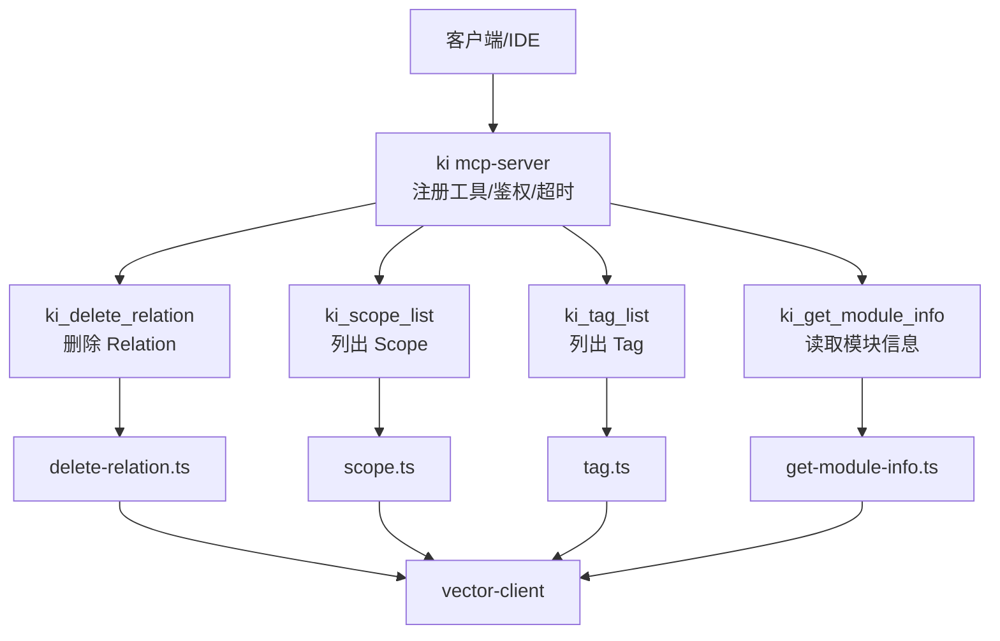
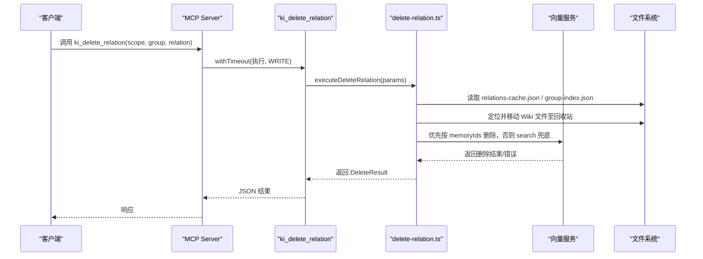
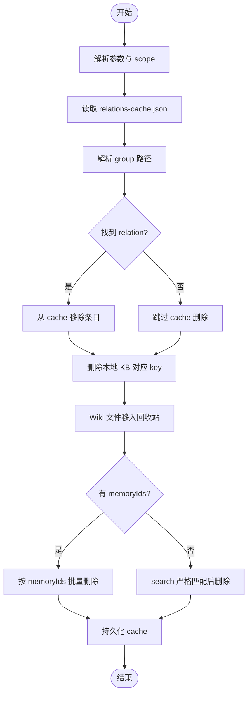
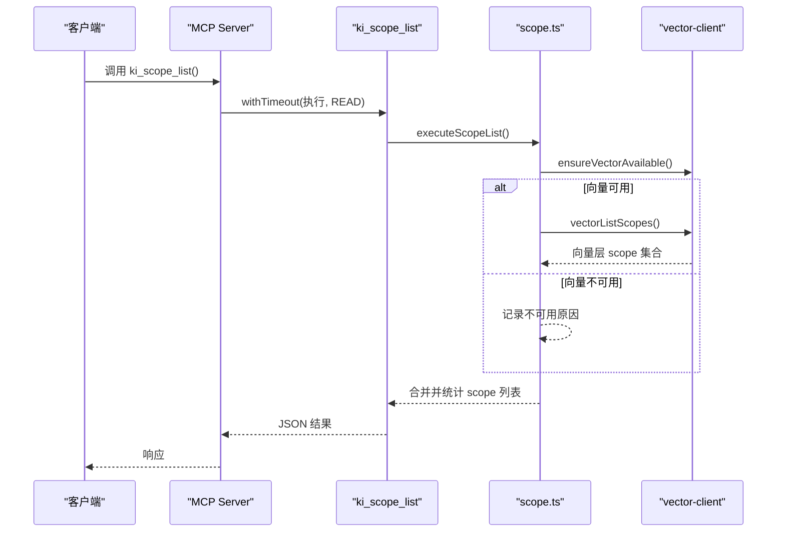
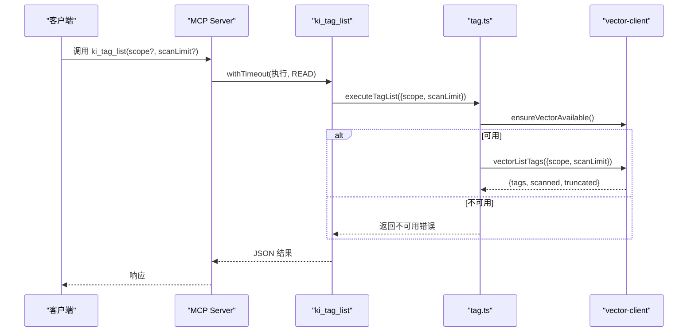
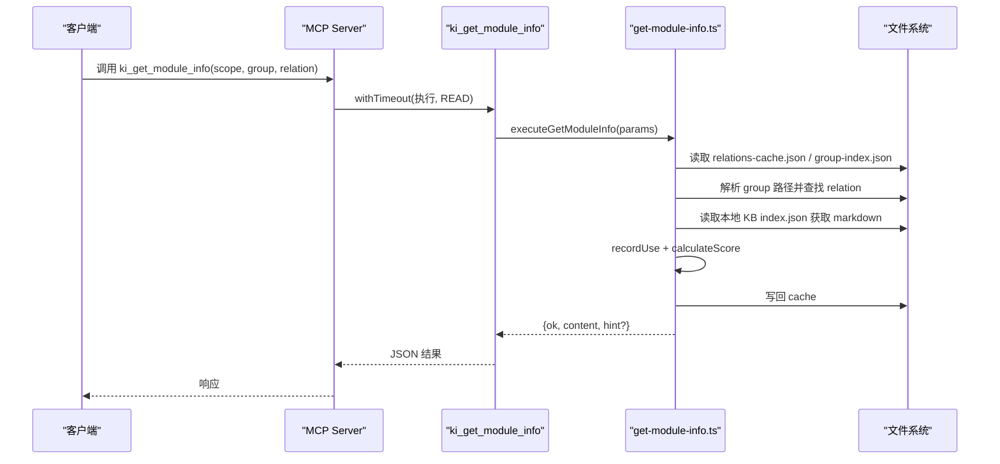
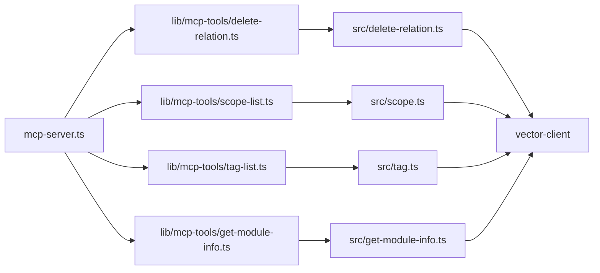

# 数据管理工具

<cite>
**本文引用的文件**
- [delete-relation.ts](file://src/delete-relation.ts)
- [scope.ts](file://src/scope.ts)
- [tag.ts](file://src/tag.ts)
- [get-module-info.ts](file://src/get-module-info.ts)
- [mcp-server.ts](file://src/mcp-server.ts)
- [delete-relation.ts（MCP）](file://src/lib/mcp-tools/delete-relation.ts)
- [scope-list.ts（MCP）](file://src/lib/mcp-tools/scope-list.ts)
- [tag-list.ts（MCP）](file://src/lib/mcp-tools/tag-list.ts)
- [get-module-info.ts（MCP）](file://src/lib/mcp-tools/get-module-info.ts)
- [cli.md](file://docs/cli.md)
</cite>

## 目录
1. [简介](#简介)
2. [项目结构](#项目结构)
3. [核心组件](#核心组件)
4. [架构总览](#架构总览)
5. [详细组件分析](#详细组件分析)
6. [依赖关系分析](#依赖关系分析)
7. [性能与批量优化](#性能与批量优化)
8. [故障排查指南](#故障排查指南)
9. [结论](#结论)
10. [附录：API 参考](#附录api-参考)

## 简介
本文件为数据管理工具的 API 文档，覆盖四个工具：
- ki_delete_relation：删除 Relation 及其关联数据（缓存、本地 KB、Wiki 文件、向量），支持文档级与目录级删除、批量删除。
- ki_scope_list：列出所有 scope（KB 目录层与向量语义层的并集），标注存在性与注册状态。
- ki_tag_list：列出指定 scope 下使用过的 tag（只读），用于后续搜索或过滤。
- ki_get_module_info：读取指定 Group 下某个 Relation 的本地 KB Markdown 内容，并更新评分。

文档同时说明参数规范、数据清理策略、权限控制与审计日志、数据一致性保证以及批量操作优化建议。

## 项目结构
- MCP Server 入口负责注册工具、鉴权、超时与生命周期管理。
- 各工具由独立的 CLI 脚本实现核心逻辑，并通过 MCP 工具封装暴露给上层调用。
- 向量服务通过 vector-client 统一访问；配置与范围解析通过 config/scope 模块完成。

图表来源
- [mcp-server.ts:54-70](file://src/mcp-server.ts#L54-L70)
- [delete-relation.ts（MCP）:6-37](file://src/lib/mcp-tools/delete-relation.ts#L6-L37)
- [scope-list.ts（MCP）:11-41](file://src/lib/mcp-tools/scope-list.ts#L11-L41)
- [tag-list.ts（MCP）:6-37](file://src/lib/mcp-tools/tag-list.ts#L6-L37)
- [get-module-info.ts（MCP）:6-37](file://src/lib/mcp-tools/get-module-info.ts#L6-L37)

章节来源
- [mcp-server.ts:54-70](file://src/mcp-server.ts#L54-L70)

## 核心组件
- 删除关系（ki_delete_relation）：四层联动清理（relations-cache、本地 KB、Wiki、向量），支持精确 memoryId 删除与 search 兜底；提供目录级级联删除与批量删除。
- 作用域列表（ki_scope_list）：合并 KB 目录层与向量层 scope，标注是否注册及文档数。
- 标签列表（ki_tag_list）：扫描向量层 tag 并统计文档数，支持扫描上限与截断提示。
- 模块信息查询（ki_get_module_info）：按 group + relation 读取本地 KB 原文，模糊匹配兜底，更新使用评分。

章节来源
- [delete-relation.ts:73-176](file://src/delete-relation.ts#L73-L176)
- [scope.ts:94-132](file://src/scope.ts#L94-L132)
- [tag.ts:34-51](file://src/tag.ts#L34-L51)
- [get-module-info.ts:61-168](file://src/get-module-info.ts#L61-L168)

## 架构总览
MCP 工具作为统一入口，将请求路由到对应执行函数，再访问存储与向量层。删除流程在失败时尽量回滚或记录原因，确保可观测性。

图表来源
- [delete-relation.ts（MCP）:6-37](file://src/lib/mcp-tools/delete-relation.ts#L6-L37)
- [delete-relation.ts:83-176](file://src/delete-relation.ts#L83-L176)
- [delete-relation.ts:383-473](file://src/delete-relation.ts#L383-L473)

## 详细组件分析

### ki_delete_relation（删除关系）
- 功能：删除单个 Relation 或整个 Group（级联）。
- 参数：
  - scope：可选，默认 default；strict 模式必填且需注册。
  - group：必填，支持模糊匹配。
  - relation：文档级删除必填，精确匹配。
  - input：批量模式输入文件路径（CLI）。
- 行为：
  - 从 relations-cache 中移除条目。
  - 从本地 KB index.json 删除对应 key。
  - 将 Wiki .md 文件移入回收站（保留原目录结构）。
  - 向量删除：优先按 memoryIds 批量删除；无 memoryId 时用 search 严格匹配兜底。
  - 目录级删除：级联清空子 group 的 cache/KB/wiki/向量，并删除 group-index 节点。
- 输出：DeleteRelationOutcome（ok/result 或 error），包含 cacheRemoved/kbRemoved/wikiRemoved/memRemoved/memMethod/reason 等字段。
- 安全约束：目录级删除仅通过 CLI 暴露；MCP 工具仅支持文档级单条删除。

图表来源
- [delete-relation.ts:83-176](file://src/delete-relation.ts#L83-L176)
- [delete-relation.ts:383-473](file://src/delete-relation.ts#L383-L473)

章节来源
- [delete-relation.ts:73-176](file://src/delete-relation.ts#L73-L176)
- [delete-relation.ts:178-310](file://src/delete-relation.ts#L178-L310)
- [delete-relation.ts:558-594](file://src/delete-relation.ts#L558-L594)
- [cli.md:722-754](file://docs/cli.md#L722-L754)

### ki_scope_list（作用域列表）
- 功能：列出所有 scope（KB 目录层与向量层并集），标注每个 scope 存在于哪一层、是否已在配置注册，以及 KB 层文档数。
- 参数：无（MCP 工具无参）。
- 行为：
  - 枚举 KB 层 scope 与向量层 scope。
  - 合并配置中的 scopes。
  - 统计每个 scope 的 wikiCount（relations-cache 的 hot_relations 总数）。
  - 若向量不可用，返回 vectorAvailable=false 与 reason。
- 权限控制：MCP 层可按授权 scope 过滤返回结果，避免未授权 scope 泄露。

图表来源
- [scope-list.ts（MCP）:11-41](file://src/lib/mcp-tools/scope-list.ts#L11-L41)
- [scope.ts:94-132](file://src/scope.ts#L94-L132)

章节来源
- [scope.ts:94-132](file://src/scope.ts#L94-L132)
- [scope-list.ts（MCP）:11-41](file://src/lib/mcp-tools/scope-list.ts#L11-L41)

### ki_tag_list（标签列表）
- 功能：列出指定 scope 下使用过的 tag（含文档数，按数量降序），只读。
- 参数：
  - scope：可选，默认 default。
  - scan-limit：扫描上限（默认 10000），超出则 truncated=true。
- 行为：
  - 检查向量服务可用性。
  - 调用 vectorListTags 获取 tags、scanned、truncated。
  - 返回 ok/count/scanned/truncated/tags。

图表来源
- [tag-list.ts（MCP）:6-37](file://src/lib/mcp-tools/tag-list.ts#L6-L37)
- [tag.ts:34-51](file://src/tag.ts#L34-L51)

章节来源
- [tag.ts:34-51](file://src/tag.ts#L34-L51)
- [tag-list.ts（MCP）:6-37](file://src/lib/mcp-tools/tag-list.ts#L6-L37)

### ki_get_module_info（模块信息查询）
- 功能：读取指定 Group 下某个 Relation 的本地 KB Markdown 内容，并更新使用评分。
- 参数：
  - scope：可选，默认 default；strict 模式必填且需注册。
  - group：必填，支持向量语义兜底。
  - relation：必填，精确匹配。
- 行为：
  - 校验 scope 并初始化目录。
  - 读取 relations-cache.json 与 group-index.json，解析 group 路径。
  - 查找 relation（支持近似匹配兜底）。
  - 读取本地 KB index.json 获取 markdown 内容。
  - 更新使用次数与得分，写回 cache。
  - 返回 content 与 hint（如近似匹配提示）。

图表来源
- [get-module-info.ts（MCP）:6-37](file://src/lib/mcp-tools/get-module-info.ts#L6-L37)
- [get-module-info.ts:61-168](file://src/get-module-info.ts#L61-L168)

章节来源
- [get-module-info.ts:61-168](file://src/get-module-info.ts#L61-L168)
- [get-module-info.ts（MCP）:6-37](file://src/lib/mcp-tools/get-module-info.ts#L6-L37)

## 依赖关系分析
- MCP 工具通过 withTimeout 包装执行，设置 READ/WRITE 超时。
- 删除与查询均依赖 vector-client 进行向量层操作；scope/tag 列表也依赖向量服务。
- 配置与范围解析通过 loadConfig/resolveScope/validateScope 等函数保证一致性。
- 权限控制：ki_scope_list 在 MCP 层按授权 scope 过滤返回结果；HTTP 模式下非回环绑定强制 Token 鉴权。

图表来源
- [mcp-server.ts:54-70](file://src/mcp-server.ts#L54-L70)
- [delete-relation.ts（MCP）:6-37](file://src/lib/mcp-tools/delete-relation.ts#L6-L37)
- [scope-list.ts（MCP）:11-41](file://src/lib/mcp-tools/scope-list.ts#L11-L41)
- [tag-list.ts（MCP）:6-37](file://src/lib/mcp-tools/tag-list.ts#L6-L37)
- [get-module-info.ts（MCP）:6-37](file://src/lib/mcp-tools/get-module-info.ts#L6-L37)

章节来源
- [mcp-server.ts:54-70](file://src/mcp-server.ts#L54-L70)

## 性能与批量优化
- 删除批量：
  - 使用 executeBatchDelete 逐条执行文档级删除，汇总 total/failed，便于重试与审计。
  - 向量删除优先按 memoryIds 批量删除，减少网络往返与开销。
- 目录级删除：
  - 聚合该 group 下全部 memoryIds 一并删除，避免多次 search 开销。
  - 对向量删除失败（除 NOT_FOUND）标记 vectorRemoved=false，避免孤儿向量静默残留。
- 标签列表：
  - 支持 scan-limit 限制扫描范围，超限时 truncated=true 表示结果为近似值。
- 模块信息查询：
  - 使用 recordUse 与 calculateScore 更新评分，避免频繁全量重算。

章节来源
- [delete-relation.ts:558-594](file://src/delete-relation.ts#L558-L594)
- [delete-relation.ts:249-267](file://src/delete-relation.ts#L249-L267)
- [tag.ts:34-51](file://src/tag.ts#L34-L51)
- [get-module-info.ts:149-157](file://src/get-module-info.ts#L149-L157)

## 故障排查指南
- 向量服务不可用：
  - scope list/tag list 会返回 vectorAvailable=false 与 reason；删除流程会跳过向量层并记录 reason。
- 删除失败：
  - 检查 relations-cache.json 是否存在、group 是否解析成功、relation 是否精确匹配。
  - 向量删除失败时查看 result.reason 与 memMethod（memoryId/search/skip/none）。
- 本地 KB 缺失：
  - get-module-info 返回错误与修复提示（重新写入或检查导入完整性）。
- 权限问题：
  - HTTP 模式非回环绑定需 Token；ki_scope_list 会按授权 scope 过滤返回结果。

章节来源
- [scope.ts:94-132](file://src/scope.ts#L94-L132)
- [tag.ts:34-51](file://src/tag.ts#L34-L51)
- [delete-relation.ts:83-176](file://src/delete-relation.ts#L83-L176)
- [get-module-info.ts:124-168](file://src/get-module-info.ts#L124-L168)
- [mcp-server.ts:174-211](file://src/mcp-server.ts#L174-L211)

## 结论
四个数据管理工具覆盖了知识索引的核心维护场景：删除、列举作用域、发现标签、读取模块信息。系统通过四层联动（cache/KB/wiki/vector）保障数据一致性，并提供批量与兜底机制提升鲁棒性。MCP 层提供统一的超时、鉴权与权限控制，适合集成到 IDE 或自动化流程中。

## 附录：API 参考

### ki_delete_relation
- 类型：写
- 参数：
  - scope：可选，默认 default；strict 模式必填且需注册。
  - group：必填，支持模糊匹配。
  - relation：必填，精确匹配。
  - input：批量模式输入文件路径（CLI）。
- 返回：DeleteRelationOutcome（ok/result 或 error），result 包含 deleted/cacheRemoved/kbRemoved/wikiRemoved/memRemoved/memMethod/reason 等。
- 行为要点：
  - 文档级删除：relations-cache → local KB → wiki 移入回收站 → 向量删除（memoryId 优先，search 兜底）。
  - 目录级删除（CLI）：级联删除子 group 的 cache/KB/wiki/向量，并删除 group-index 节点。
  - 批量删除：逐条执行并汇总 total/failed。

章节来源
- [delete-relation.ts:73-176](file://src/delete-relation.ts#L73-L176)
- [delete-relation.ts:178-310](file://src/delete-relation.ts#L178-L310)
- [delete-relation.ts:558-594](file://src/delete-relation.ts#L558-L594)
- [cli.md:722-754](file://docs/cli.md#L722-L754)
- [delete-relation.ts（MCP）:6-37](file://src/lib/mcp-tools/delete-relation.ts#L6-L37)

### ki_scope_list
- 类型：读
- 参数：无（MCP 工具无参）。
- 返回：ScopeListResult（ok/scopeMode/vectorAvailable/vectorReason/count/scopes），scopes 每项包含 scope/kb/vector/registered/wikiCount。
- 行为要点：
  - 合并 KB 目录层与向量层 scope，标注存在性与注册状态。
  - 向量不可用时返回 vectorAvailable=false 与 reason。
  - MCP 层按授权 scope 过滤返回结果。

章节来源
- [scope.ts:94-132](file://src/scope.ts#L94-L132)
- [scope-list.ts（MCP）:11-41](file://src/lib/mcp-tools/scope-list.ts#L11-L41)

### ki_tag_list
- 类型：读
- 参数：
  - scope：可选，默认 default。
  - scan-limit：扫描上限（默认 10000），超出则 truncated=true。
- 返回：TagListResult（ok/scope/count/scanned/truncated/tags）。
- 行为要点：
  - 检查向量服务可用性。
  - 扫描向量层 tag 并统计文档数，按数量降序返回。

章节来源
- [tag.ts:34-51](file://src/tag.ts#L34-L51)
- [tag-list.ts（MCP）:6-37](file://src/lib/mcp-tools/tag-list.ts#L6-L37)

### ki_get_module_info
- 类型：读
- 参数：
  - scope：可选，默认 default；strict 模式必填且需注册。
  - group：必填，支持向量语义兜底。
  - relation：必填，精确匹配。
- 返回：GetModuleInfoResult（ok/scope/content/hint）。
- 行为要点：
  - 读取 relations-cache.json 与 group-index.json，解析 group 路径。
  - 查找 relation（支持近似匹配兜底）。
  - 读取本地 KB index.json 获取 markdown 内容。
  - 更新使用次数与得分，写回 cache。

章节来源
- [get-module-info.ts:61-168](file://src/get-module-info.ts#L61-L168)
- [get-module-info.ts（MCP）:6-37](file://src/lib/mcp-tools/get-module-info.ts#L6-L37)