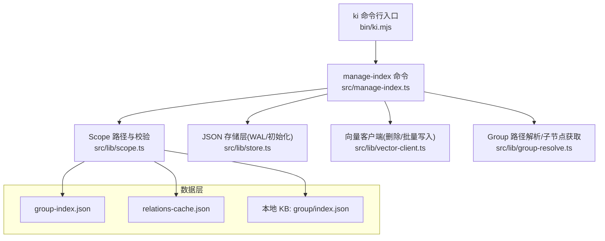
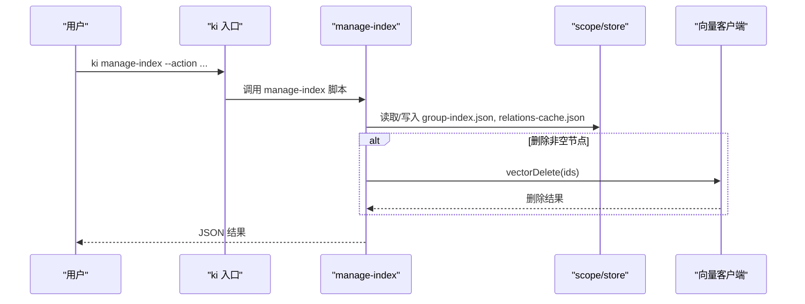
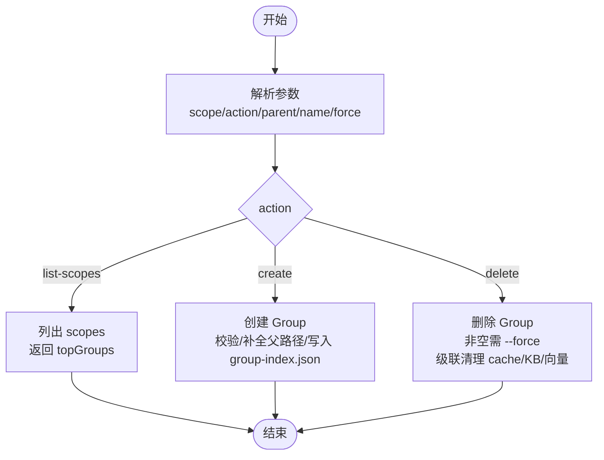
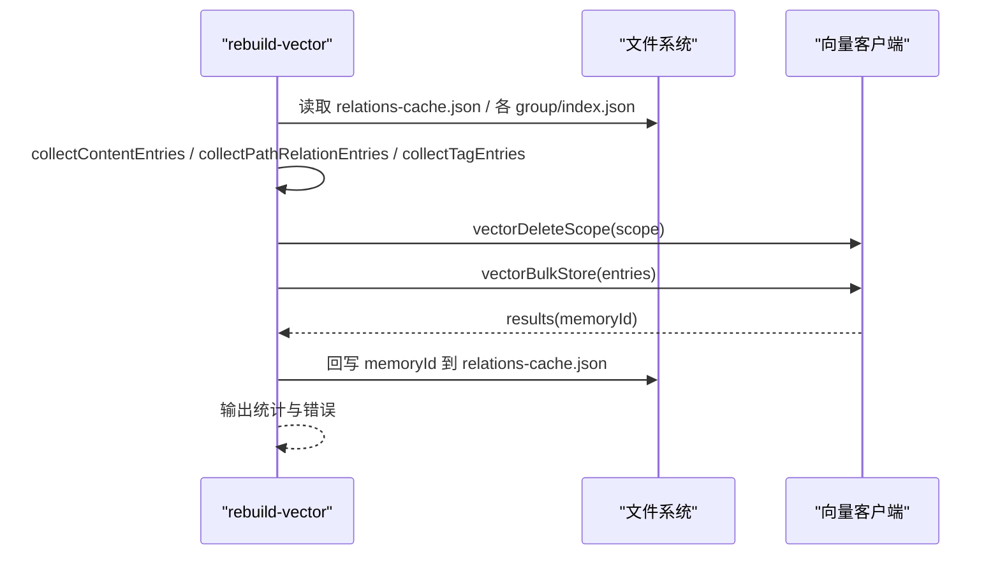
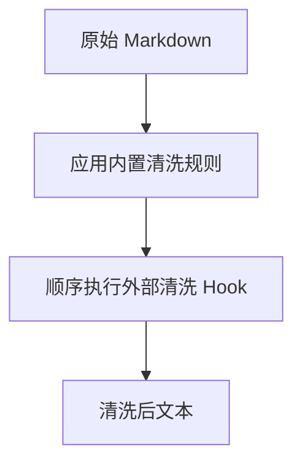
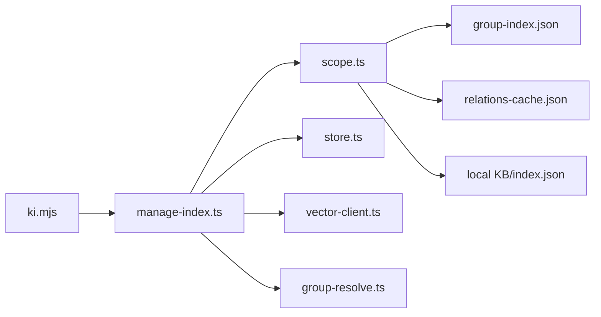

# 索引管理工具

<cite>
**本文引用的文件**
- [src/manage-index.ts](file://src/manage-index.ts)
- [bin/ki.mjs](file://bin/ki.mjs)
- [docs/manage-index.md](file://docs/manage-index.md)
- [docs/cli.md](file://docs/cli.md)
- [docs/verify-index.md](file://docs/verify-index.md)
- [src/lib/scope.ts](file://src/lib/scope.ts)
- [src/lib/store.ts](file://src/lib/store.ts)
- [src/lib/rebuild-vector.ts](file://src/lib/rebuild-vector.ts)
- [src/lib/clean.ts](file://src/lib/clean.ts)
- [src/lib/health-check.ts](file://src/lib/health-check.ts)
</cite>

## 目录
1. [简介](#简介)
2. [项目结构](#项目结构)
3. [核心组件](#核心组件)
4. [架构总览](#架构总览)
5. [详细组件分析](#详细组件分析)
6. [依赖关系分析](#依赖关系分析)
7. [性能与监控](#性能与监控)
8. [故障恢复指南](#故障恢复指南)
9. [结论](#结论)
10. [附录：API 参考](#附录api-参考)

## 简介
本文件为“索引管理工具”的权威 API 文档，聚焦 ki_manage_index 能力，覆盖索引重建、验证、清理与维护操作；说明参数配置（action、scope、force、dry_run）；提供索引状态检查、性能监控与故障恢复方法；并给出索引数据结构、版本兼容性与迁移策略。

## 项目结构
索引管理由 CLI 入口分发到具体命令实现，核心逻辑集中在 manage-index 模块，配合 scope/store 等基础库完成数据读写与一致性保障。

图表来源
- [bin/ki.mjs:29-49](file://bin/ki.mjs#L29-L49)
- [src/manage-index.ts:11-19](file://src/manage-index.ts#L11-L19)
- [src/lib/scope.ts:45-77](file://src/lib/scope.ts#L45-L77)
- [src/lib/store.ts:19-62](file://src/lib/store.ts#L19-L62)

章节来源
- [bin/ki.mjs:29-49](file://bin/ki.mjs#L29-L49)
- [src/manage-index.ts:11-19](file://src/manage-index.ts#L11-L19)

## 核心组件
- CLI 路由：ki 命令统一入口，将 manage-index 转发至对应脚本执行。
- 索引管理：支持 Group 树创建、删除、列出 scope；删除时级联清理 relations-cache、本地 KB、向量记忆。
- Scope/Store：负责 scope 校验、路径构造、group-index.json 与 relations-cache.json 的读取/写入与 WAL 保护。
- 向量重建：从已还原 KB 重建三类向量（内容、关系、路径），并回写 memoryId。
- 清洗：向量化前文本清洗规则与外部 hook 管道。
- 健康检查：配置、目录、embedding 连通性、维度匹配、zvec collection 就绪性诊断。

章节来源
- [bin/ki.mjs:29-49](file://bin/ki.mjs#L29-L49)
- [src/manage-index.ts:413-646](file://src/manage-index.ts#L413-L646)
- [src/lib/scope.ts:26-77](file://src/lib/scope.ts#L26-L77)
- [src/lib/store.ts:19-62](file://src/lib/store.ts#L19-L62)
- [src/lib/rebuild-vector.ts:246-323](file://src/lib/rebuild-vector.ts#L246-L323)
- [src/lib/clean.ts:42-130](file://src/lib/clean.ts#L42-L130)
- [src/lib/health-check.ts:148-213](file://src/lib/health-check.ts#L148-L213)

## 架构总览
索引系统采用三层文件系统 + 向量语义层：
- Layer 1：Group 树索引（group-index.json），层级导航与物理隔离。
- Layer 2：Relations 缓存（relations-cache.json），热门 Relation 列表与评分分区。
- Layer 3：本地 KB（group/index.json），Markdown 模块信息全文。
- 向量层：内容/关系/路径三类向量，支持检索与标签过滤。

图表来源
- [bin/ki.mjs:154-219](file://bin/ki.mjs#L154-L219)
- [src/manage-index.ts:511-615](file://src/manage-index.ts#L511-L615)
- [src/lib/scope.ts:55-77](file://src/lib/scope.ts#L55-L77)
- [src/lib/store.ts:55-62](file://src/lib/store.ts#L55-L62)

## 详细组件分析

### 索引管理命令（manage-index）
- 作用域：Group 树 CRUD、scope 列表查询。
- 关键行为：
  - create：在指定父路径下创建新 Group，自动补全父路径并提示。
  - delete：删除节点；非空需 --force；删除后级联清理 relations-cache、local-kb、向量记忆。
  - list-scopes：列出所有已初始化或已注册的 scope，附带顶层 Group 列表。
- 参数：
  - --scope：项目隔离标识（list-scopes 时可省略）。
  - --action：create | delete | list-scopes。
  - --parent：父节点路径（为空时在顶层操作）。
  - --name：节点名称。
  - --force：强制删除非空节点。

图表来源
- [src/manage-index.ts:413-646](file://src/manage-index.ts#L413-L646)

章节来源
- [src/manage-index.ts:82-137](file://src/manage-index.ts#L82-L137)
- [src/manage-index.ts:145-166](file://src/manage-index.ts#L145-L166)
- [src/manage-index.ts:185-298](file://src/manage-index.ts#L185-L298)
- [src/manage-index.ts:511-615](file://src/manage-index.ts#L511-L615)

### 索引重建（rebuild-vector）
- 目标：从已还原 KB 重建 scope 的三类向量（内容、关系、路径），并回写 memoryId，保证与 KB 一致且幂等可重跑。
- 流程要点：
  - 收集内容条目（遍历 scope 下 index.json，排除元字段）。
  - 收集关系/路径条目（基于 relations-cache.groups）。
  - 收集自定义 tag 条目（按 relation.tags 恢复原文生成内容向量）。
  - 清空旧向量（vectorDeleteScope），再批量写入（vectorBulkStore）。
  - 更新 relations-cache 中 memoryId/memoryIds。

图表来源
- [src/lib/rebuild-vector.ts:76-143](file://src/lib/rebuild-vector.ts#L76-L143)
- [src/lib/rebuild-vector.ts:150-191](file://src/lib/rebuild-vector.ts#L150-L191)
- [src/lib/rebuild-vector.ts:200-233](file://src/lib/rebuild-vector.ts#L200-L233)
- [src/lib/rebuild-vector.ts:246-323](file://src/lib/rebuild-vector.ts#L246-L323)

章节来源
- [src/lib/rebuild-vector.ts:246-323](file://src/lib/rebuild-vector.ts#L246-L323)

### 索引清理（clean）
- 文本清洗：内置规则（BOM/frontmatter/html注释/mermaid/代码块/路径剥离/空行折叠）与外部 hook 管道（超时保护、失败跳过）。
- 用途：向量化输入预处理，确保向量质量与稳定性。

图表来源
- [src/lib/clean.ts:42-130](file://src/lib/clean.ts#L42-L130)
- [src/lib/clean.ts:177-227](file://src/lib/clean.ts#L177-L227)

章节来源
- [src/lib/clean.ts:42-130](file://src/lib/clean.ts#L42-L130)
- [src/lib/clean.ts:177-227](file://src/lib/clean.ts#L177-L227)

### 索引验证（verify）
- 结构验证：完整 Group 树展示。
- Relations 验证：分组内热门/分区展示。
- 本地 KB 验证：按 group+relation 读取原文。
- 语义检索验证：通过搜索确认向量召回。
- 增量更新验证：新增/修改/删除条目一致性。

章节来源
- [docs/verify-index.md:14-133](file://docs/verify-index.md#L14-L133)

## 依赖关系分析
- CLI 入口依赖命令映射，将 manage-index 转发到 src/manage-index.ts。
- manage-index 依赖：
  - scope.ts：scope 校验、路径构造、source 块读写、GroupIndex 迁移。
  - store.ts：JSON 读写（WAL）、scope 初始化、旧格式迁移。
  - vector-client.ts：向量删除/批量写入（通过 ensureVectorAvailable 可用性检查）。
  - group-resolve.ts：Group 路径解析与子节点获取。
- 数据文件：
  - group-index.json：Group 树结构。
  - relations-cache.json：Relation 缓存与评分。
  - local KB：group/index.json 存储模块信息。

图表来源
- [bin/ki.mjs:29-49](file://bin/ki.mjs#L29-L49)
- [src/manage-index.ts:11-19](file://src/manage-index.ts#L11-L19)
- [src/lib/scope.ts:45-77](file://src/lib/scope.ts#L45-L77)
- [src/lib/store.ts:19-62](file://src/lib/store.ts#L19-L62)

章节来源
- [bin/ki.mjs:29-49](file://bin/ki.mjs#L29-L49)
- [src/manage-index.ts:11-19](file://src/manage-index.ts#L11-L19)

## 性能与监控
- 健康检查：
  - 配置文件存在与可解析。
  - dataDir/backupDir/vectorDir 存在且可写。
  - embedding 连通性、密钥有效性、维度匹配（单次最短请求，超时重试）。
  - zvec collection 是否已创建。
  - scopes.default 是否配置。
- 使用方式：运行 ki doctor 或 MCP 启动预检共用同一套只读检查逻辑。

章节来源
- [src/lib/health-check.ts:148-213](file://src/lib/health-check.ts#L148-L213)

## 故障恢复指南
- 常见恢复步骤：
  1) 补齐参数与确认路径。
  2) 注册 scope 并初始化。
  3) 先生成索引（导入/同步）。
  4) 再执行后续操作。
- 向量重建：当向量层与 KB 不一致时，使用 rebuild-vector 从 KB 重建向量并回写 memoryId。
- 清理与修复：
  - 删除 Group 时级联清理 cache/KB/向量。
  - 文本清洗异常时降级返回原文，避免中断。
  - 向量服务不可用时，删除操作会记录原因并跳过计数。

章节来源
- [docs/error-handling.md:130-153](file://docs/error-handling.md#L130-L153)
- [src/lib/rebuild-vector.ts:246-323](file://src/lib/rebuild-vector.ts#L246-L323)
- [src/manage-index.ts:320-411](file://src/manage-index.ts#L320-L411)

## 结论
索引管理工具以清晰的三层文件结构与向量语义层为基础，提供健壮的 Group 树管理、级联清理、向量重建与健康诊断能力。通过严格的 scope 校验、WAL 写入与兼容性迁移，确保数据一致性与可维护性。结合验证与监控手段，可在生产环境中安全高效地维护知识索引。

## 附录：API 参考

### CLI 命令与参数
- 命令：ki manage-index
- 参数：
  - --scope：项目隔离标识（字母、数字、连字符、下划线；禁止路径遍历）。
  - --action：create | delete | list-scopes。
  - --parent：父节点路径（为空时在顶层操作）。
  - --name：节点名称（create/delete 必填）。
  - --force：强制删除非空节点。
  - --no-vector：仅写 KB 层，不向量化（适用于 sync-relation 等场景）。
- 示例与输出见 CLI 文档。

章节来源
- [docs/cli.md:79-188](file://docs/cli.md#L79-L188)
- [docs/manage-index.md:263-276](file://docs/manage-index.md#L263-L276)

### 索引数据结构
- group-index.json：
  - version：当前数据版本。
  - scope：scope 名称。
  - groups：Group 树结构（Record<string, Record<string, unknown>>）。
  - updatedAt：更新时间戳。
  - source：source 块（dir、chunkSize、chunkOverlap）。
- relations-cache.json：
  - version/scope/groups：扁平键结构，key 为完整 groupPath。
  - hot_relations：每条 relation 包含 text、memoryId/memoryIds、keywords 等。
- 本地 KB：group/index.json 存储模块信息（键为 relation 名，值为 Markdown 内容）。

章节来源
- [src/lib/scope.ts:106-112](file://src/lib/scope.ts#L106-L112)
- [src/lib/store.ts:73-92](file://src/lib/store.ts#L73-L92)
- [src/lib/rebuild-vector.ts:59-63](file://src/lib/rebuild-vector.ts#L59-L63)

### 版本兼容性与迁移策略
- 自动迁移：
  - group-index.json：roots → groups 迁移，并写回。
  - relations-cache.json：移除“项目根/”前缀 key，必要时合并去重。
- 版本检查：
  - readJson 读取时进行 version 比较，高版本给出警告。
- 建议：
  - 升级后首次运行会自动迁移；若损坏可从备份恢复或重新初始化 scope。

章节来源
- [src/lib/store.ts:73-92](file://src/lib/store.ts#L73-L92)
- [src/lib/store.ts:97-159](file://src/lib/store.ts#L97-L159)
- [src/lib/store.ts:23-49](file://src/lib/store.ts#L23-L49)

### 索引状态检查与性能监控
- 健康检查项：
  - 配置文件、dataDir/backupDir/vectorDir 存在且可写。
  - apiKey 配置与 embedding 连通性、密钥有效性、维度匹配。
  - zvec collection 是否已创建。
  - scopes.default 是否配置。
- 使用：ki doctor 或 MCP 启动预检。

章节来源
- [src/lib/health-check.ts:148-213](file://src/lib/health-check.ts#L148-L213)

### 故障恢复方法
- 向量不一致：使用 rebuild-vector 从 KB 重建向量并回写 memoryId。
- 删除 Group：级联清理 relations-cache、local-kb、向量记忆；向量不可用时记录原因并跳过。
- 文本清洗异常：降级返回原文，避免中断。

章节来源
- [src/lib/rebuild-vector.ts:246-323](file://src/lib/rebuild-vector.ts#L246-L323)
- [src/manage-index.ts:320-411](file://src/manage-index.ts#L320-L411)
- [src/lib/clean.ts:42-130](file://src/lib/clean.ts#L42-L130)