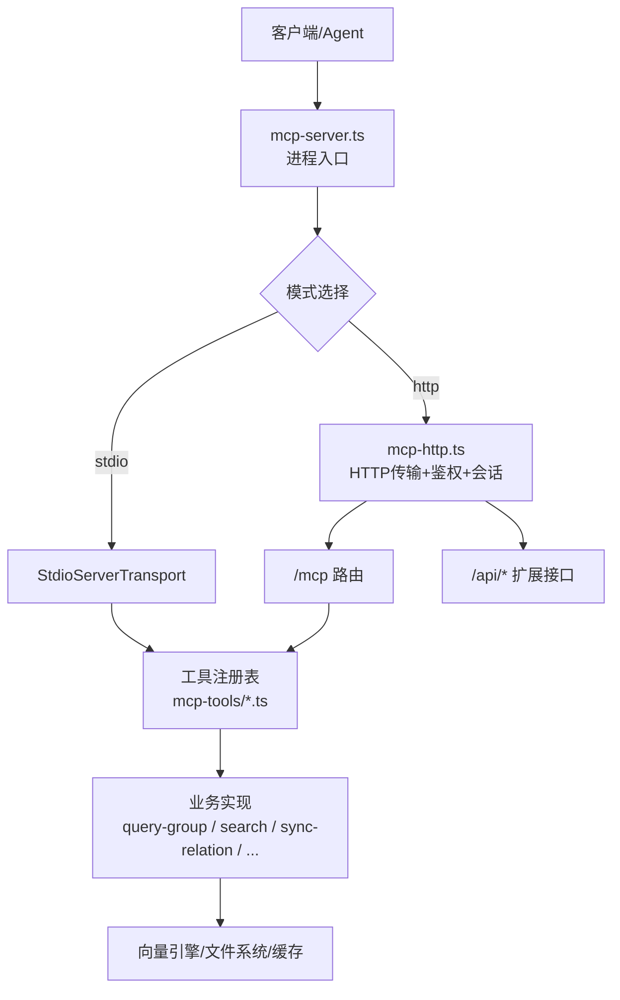
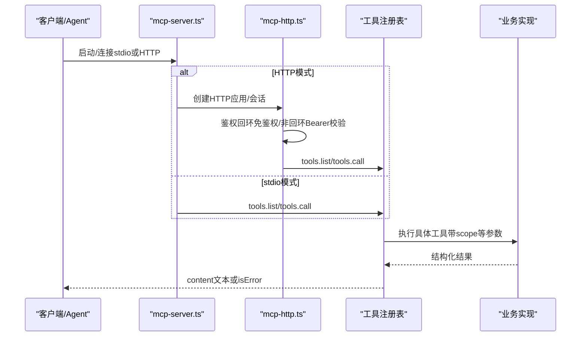
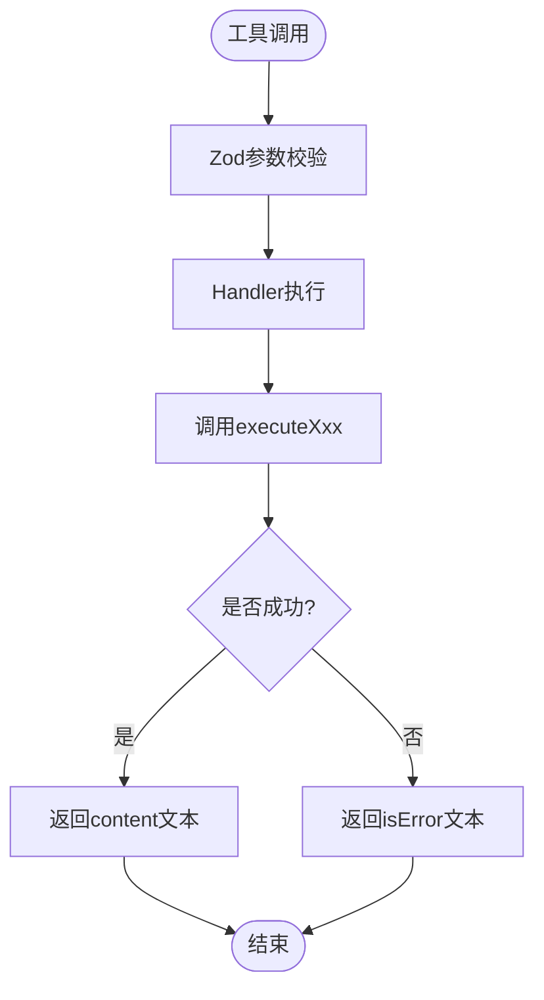
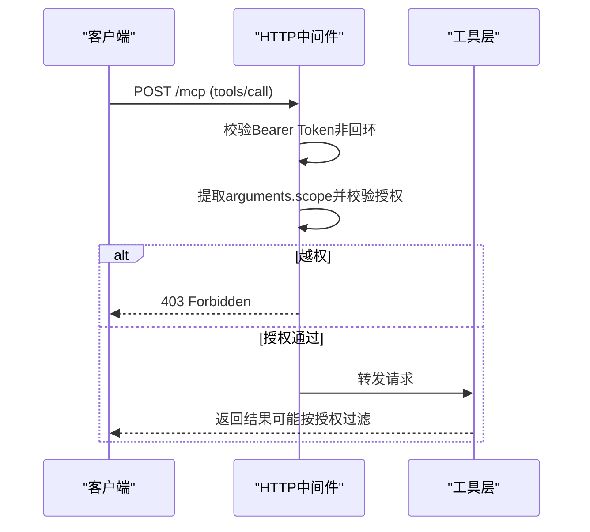
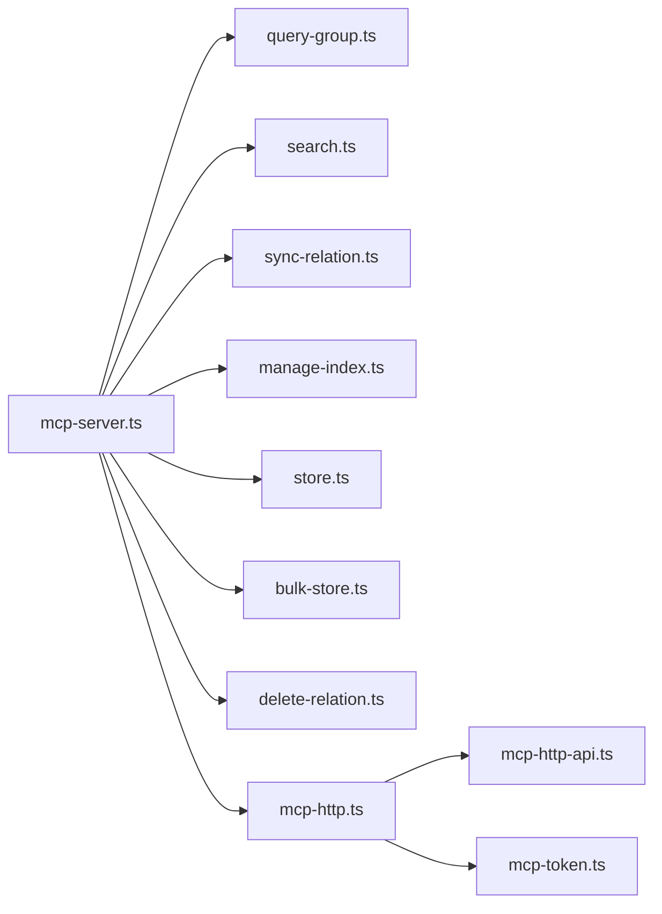

# MCP集成指南

<cite>
**本文引用的文件**
- [src/mcp-server.ts](file://src/mcp-server.ts)
- [src/lib/mcp-http.ts](file://src/lib/mcp-http.ts)
- [src/lib/mcp-http-api.ts](file://src/lib/mcp-http-api.ts)
- [src/lib/mcp-token.ts](file://src/lib/mcp-token.ts)
- [src/lib/mcp-tools/query-group.ts](file://src/lib/mcp-tools/query-group.ts)
- [src/lib/mcp-tools/search.ts](file://src/lib/mcp-tools/search.ts)
- [src/lib/mcp-tools/sync-relation.ts](file://src/lib/mcp-tools/sync-relation.ts)
- [src/lib/mcp-tools/get-module-info.ts](file://src/lib/mcp-tools/get-module-info.ts)
- [src/lib/mcp-tools/manage-index.ts](file://src/lib/mcp-tools/manage-index.ts)
- [src/lib/mcp-tools/store.ts](file://src/lib/mcp-tools/store.ts)
- [src/lib/mcp-tools/bulk-store.ts](file://src/lib/mcp-tools/bulk-store.ts)
- [src/lib/mcp-tools/delete-relation.ts](file://src/lib/mcp-tools/delete-relation.ts)
- [docs/mcp-http.md](file://docs/mcp-http.md)
</cite>

## 目录
1. [简介](#简介)
2. [项目结构](#项目结构)
3. [核心组件](#核心组件)
4. [架构总览](#架构总览)
5. [详细组件分析](#详细组件分析)
6. [依赖关系分析](#依赖关系分析)
7. [性能与容量规划](#性能与容量规划)
8. [故障排查指南](#故障排查指南)
9. [结论](#结论)
10. [附录：工具API参考](#附录工具api参考)

## 简介
本指南面向需要在AI Agent、IDE或后端服务中集成知识索引器MCP能力的读者。文档覆盖：
- MCP协议基础与两种接入模式（stdio与HTTP）的区别、适用场景与选择建议
- 暴露的MCP工具清单与完整API说明（含ki_query_group、ki_search、ki_sync_relation等）
- Token鉴权机制与安全配置（回环免鉴权、非回环强制Bearer Token、RBAC scope授权）
- AI Agent与主流IDE（VS Code、Cursor等）的集成配置示例
- HTTP共享单例模式的部署、管理与运维要点
- 常见问题排查与性能优化建议

## 项目结构
MCP能力由“进程入口 + HTTP传输层 + 工具注册层 + 业务实现”四层构成：
- 进程入口：负责启动、参数解析、守卫检查、健康预检、HTTP/stdio分发
- HTTP传输层：提供Streamable HTTP传输、会话管理、鉴权中间件、静态页面与扩展API
- 工具注册层：按工具维度注册schema与handler，调用底层executeXxx纯函数
- 业务实现：查询、检索、写入、删除、批量存储等具体逻辑

图表来源
- [src/mcp-server.ts:54-70](file://src/mcp-server.ts#L54-L70)
- [src/lib/mcp-http.ts:344-499](file://src/lib/mcp-http.ts#L344-L499)
- [src/lib/mcp-tools/query-group.ts:6-53](file://src/lib/mcp-tools/query-group.ts#L6-L53)

章节来源
- [src/mcp-server.ts:49-70](file://src/mcp-server.ts#L49-L70)
- [src/lib/mcp-http.ts:344-499](file://src/lib/mcp-http.ts#L344-L499)

## 核心组件
- 进程入口（mcp-server.ts）
  - 构建并注册全部MCP工具
  - 解析CLI参数，区分stdio与HTTP模式
  - 启动守卫：检测HTTP单例冲突、stdio多实例共存、预检健康
  - 支持token子命令（generate/list/update/delete）、restart、stop、--status
- HTTP传输层（mcp-http.ts）
  - StreamableHTTPServerTransport会话模型
  - 条件鉴权：回环地址免鉴权；非回环强制Bearer Token
  - RBAC越权拦截：对tools/call的arguments.scope进行校验
  - 会话上限与空闲回收、DNS rebinding保护、静态页面与/api扩展
- 工具注册层（mcp-tools/*.ts）
  - 每个工具一个registerXxxTool函数，定义Zod schema与handler
  - 统一超时封装withTimeout，错误包装为isError响应
- Token与鉴权（mcp-token.ts）
  - 多Token存储（~/.ki/mcp-tokens.json），强随机Token，短ID
  - scope授权集合（'all'或具体列表），常量时间比较防侧信道
  - CLI子命令管理Token生命周期

章节来源
- [src/mcp-server.ts:54-70](file://src/mcp-server.ts#L54-L70)
- [src/lib/mcp-http.ts:454-526](file://src/lib/mcp-http.ts#L454-L526)
- [src/lib/mcp-token.ts:20-50](file://src/lib/mcp-token.ts#L20-L50)

## 架构总览
下图展示从客户端到工具执行的端到端流程，包括鉴权、会话建立、工具路由与返回。

图表来源
- [src/mcp-server.ts:687-733](file://src/mcp-server.ts#L687-L733)
- [src/lib/mcp-http.ts:454-577](file://src/lib/mcp-http.ts#L454-L577)
- [src/lib/mcp-tools/query-group.ts:6-53](file://src/lib/mcp-tools/query-group.ts#L6-L53)

## 详细组件分析

### 接入模式对比：stdio与HTTP
- stdio模式
  - 特点：单客户端单进程，通过stdin/stdout通信
  - 适用：本地IDE直连、简单调试、无需网络暴露
  - 并发：多个stdio实例可错开共享向量库锁（空闲释放+撞锁重试）
- HTTP模式
  - 特点：单进程HTTP服务，所有客户端经URL共享同一持锁进程
  - 适用：多IDE共享、跨机访问、需要鉴权与集中管理
  - 安全：非回环绑定强制Bearer Token，支持RBAC scope授权
  - 运维：幂等单例守护、会话上限与空闲回收、/healthz探活

章节来源
- [docs/mcp-http.md:1-40](file://docs/mcp-http.md#L1-L40)
- [src/mcp-server.ts:687-733](file://src/mcp-server.ts#L687-L733)
- [src/lib/mcp-http.ts:454-577](file://src/lib/mcp-http.ts#L454-L577)

### 工具注册与执行流程
每个工具通过registerXxxTool(server)注册：
- 定义Zod schema（inputSchema）
- 定义描述与默认值
- 在handler中调用executeXxx并包装为content或isError
- 统一使用withTimeout控制超时

图表来源
- [src/lib/mcp-tools/query-group.ts:6-53](file://src/lib/mcp-tools/query-group.ts#L6-L53)
- [src/lib/mcp-tools/search.ts:6-50](file://src/lib/mcp-tools/search.ts#L6-L50)
- [src/lib/mcp-tools/sync-relation.ts:6-44](file://src/lib/mcp-tools/sync-relation.ts#L6-L44)

章节来源
- [src/lib/mcp-tools/query-group.ts:6-53](file://src/lib/mcp-tools/query-group.ts#L6-L53)
- [src/lib/mcp-tools/search.ts:6-50](file://src/lib/mcp-tools/search.ts#L6-L50)
- [src/lib/mcp-tools/sync-relation.ts:6-44](file://src/lib/mcp-tools/sync-relation.ts#L6-L44)

### 鉴权与RBAC流程
- 回环地址（127.0.0.1/localhost/::1）：免鉴权
- 非回环地址：必须携带Authorization: Bearer <token>
- 全权临时Token（--token/KI_MCP_TOKEN）优先级最高，否则读取多Token存储
- 工具层越权拦截：对tools/call的arguments.scope进行RBAC校验，枚举类工具（无scope参数）由工具层按授权过滤输出

图表来源
- [src/lib/mcp-http.ts:454-526](file://src/lib/mcp-http.ts#L454-L526)
- [src/lib/mcp-token.ts:40-50](file://src/lib/mcp-token.ts#L40-L50)

章节来源
- [src/lib/mcp-http.ts:454-526](file://src/lib/mcp-http.ts#L454-L526)
- [src/lib/mcp-token.ts:40-50](file://src/lib/mcp-token.ts#L40-L50)

### HTTP共享单例模式
- 幂等启动：先探活/healthz，命中健康实例则复用退出
- 冲突检测：阻止与stdio实例并存争抢向量库锁
- 会话模型：每个initialize新建transport+server，共享模块级engine
- 资源保护：最大会话数、空闲回收、优雅退出释放锁
- 前端与扩展：--web提供静态页面，/api/*补齐导入与健康等能力

章节来源
- [src/lib/mcp-http.ts:676-766](file://src/lib/mcp-http.ts#L676-L766)
- [docs/mcp-http.md:147-242](file://docs/mcp-http.md#L147-L242)

## 依赖关系分析
- mcp-server.ts依赖：
  - 工具注册：query-group、search、sync-relation、manage-index、store、bulk-store、delete-relation、scope-list、tag-list
  - HTTP传输：startHttpMcpServer、probeHost、DEFAULT_*
  - 鉴权：createToken/updateTokenScopes/deleteToken/listTokensStrict/resolveScopesArg/tokenCount/ALL_SCOPES
  - 健康与版本：runHealthCheck/renderHealthReport/readKiVersion/startVersionGuard
- mcp-http.ts依赖：
  - 会话与传输：StreamableHTTPServerTransport
  - 鉴权：findTokenScopes/isLoopbackHost
  - 扩展API：mcp-http-api.ts（延迟加载）
- 工具层依赖：
  - 各自调用对应executeXxx（如executeQueryGroup、executeSearch、executeSyncRelation等）

图表来源
- [src/mcp-server.ts:54-70](file://src/mcp-server.ts#L54-L70)
- [src/lib/mcp-http.ts:29-34](file://src/lib/mcp-http.ts#L29-L34)
- [src/lib/mcp-http.ts:454-526](file://src/lib/mcp-http.ts#L454-L526)

章节来源
- [src/mcp-server.ts:54-70](file://src/mcp-server.ts#L54-L70)
- [src/lib/mcp-http.ts:29-34](file://src/lib/mcp-http.ts#L29-L34)

## 性能与容量规划
- 向量库锁与并发
  - 单进程单锁：HTTP单例作为唯一持锁者，避免多进程争用
  - stdio多实例：空闲自动释放锁，撞锁时短暂等待重试
- 会话与内存
  - 最大会话数默认256，空闲30分钟回收，防止泄漏
- 超时与降级
  - 工具统一超时封装，读/写/批量分别设置合理阈值
  - 外部向量API超时静默降级，不阻塞主流程
- 建议
  - 生产远程暴露前置TLS反代，限制来源IP
  - 合理设置--port与--allowed-hosts，避免端口占用与重绑攻击
  - 监控/healthz与日志（鉴权失败计数、越权拦截日志）

章节来源
- [src/lib/mcp-http.ts:46-56](file://src/lib/mcp-http.ts#L46-L56)
- [src/lib/mcp-http.ts:536-577](file://src/lib/mcp-http.ts#L536-L577)
- [docs/mcp-http.md:234-247](file://docs/mcp-http.md#L234-L247)

## 故障排查指南
- 启动阶段
  - 端口占用：EADDRINUSE提示更换端口或排查占用进程
  - 权限不足：EACCES改用高位端口或提权
  - 地址不可用：EADDRNOTAVAIL/ENOTFOUND检查host与网络
- 鉴权问题
  - 401 Unauthorized：确认Authorization头与Token一致（整段复制）
  - 403 Forbidden：scope不在授权范围，调整Token授权或修正请求scope
- 会话与连接
  - 503 Too many sessions：减少活跃会话或延长空闲回收间隔
  - 400 Bad Request：缺少session ID或非法请求体
- 工具调用
  - 超时：根据工具类型调整超时或优化下游依赖
  - 空结果：检查scope、group、relation是否存在或已同步

章节来源
- [src/lib/mcp-http.ts:609-630](file://src/lib/mcp-http.ts#L609-L630)
- [src/lib/mcp-http.ts:454-577](file://src/lib/mcp-http.ts#L454-L577)
- [docs/mcp-http.md:224-233](file://docs/mcp-http.md#L224-L233)

## 结论
本指南梳理了MCP集成的关键路径：以stdio满足单机快速接入，以HTTP实现多IDE共享与集中鉴权；通过RBAC与Token管理保障多租户安全；借助会话模型与空闲回收提升稳定性；配合/healthz与诊断命令便于运维排障。建议在多IDE与跨机场景中优先采用HTTP单例模式，并结合TLS反代与防火墙策略强化安全。

## 附录：工具API参考
以下列出11个暴露的MCP工具，包含功能、参数、返回值与使用示例指引。注意：内容以JSON字符串形式返回至content字段，Agent可直接解析。

- ki_query_group
  - 功能：查询Group树、Relations与词云，支持向量语义兜底
  - 参数：
    - scope：string，可选，默认default
    - groups：string，可选，逗号分隔Group路径
    - group：string，可选，groups的单数别名
    - hot_count：number，可选，默认5
    - depth：number，可选，默认4，范围1-10
    - mode：string，可选，默认hot，支持逗号分隔
    - auto_fallback：boolean，可选，默认true
  - 返回：content文本（JSON字符串）或isError
  - 示例：调用时传入scope与groups，获取热门分组与关系摘要
  - 参考路径
    - [src/lib/mcp-tools/query-group.ts:6-53](file://src/lib/mcp-tools/query-group.ts#L6-L53)

- ki_get_module_info
  - 功能：读取指定Group下某个Relation的本地KB Markdown内容
  - 参数：
    - scope：string，可选，默认default
    - group：string，必填，Group路径（支持向量语义兜底）
    - relation：string，必填，Relation名称（精确匹配）
  - 返回：content文本（JSON字符串）或isError
  - 示例：传入group与relation，获取Markdown原文
  - 参考路径
    - [src/lib/mcp-tools/get-module-info.ts:6-38](file://src/lib/mcp-tools/get-module-info.ts#L6-L38)

- ki_sync_relation
  - 功能：写入/更新Relation与本地KB，自动补建Group树
  - 参数：
    - scope：string，可选，默认default
    - group：string，必填，Group路径（支持层级嵌套）
    - relation：string，必填，Relation名称
    - module_info：string，必填，本地KB Markdown内容
    - vector：boolean，可选，默认true，是否写入向量层
    - tags：string，可选，逗号分隔自定义标签
  - 返回：content文本（JSON字符串）或isError
  - 示例：写入新Relation并可选择向量化
  - 参考路径
    - [src/lib/mcp-tools/sync-relation.ts:6-44](file://src/lib/mcp-tools/sync-relation.ts#L6-L44)

- ki_manage_index_create
  - 功能：在Group树中创建新节点（scope不存在则自动创建）
  - 参数：
    - scope：string，可选，默认default
    - name：string，必填，新节点名称（不能包含/）
    - parent：string，可选，父节点路径
  - 返回：content文本（JSON字符串）或isError
  - 示例：创建顶层或子节点
  - 参考路径
    - [src/lib/mcp-tools/manage-index.ts:13-44](file://src/lib/mcp-tools/manage-index.ts#L13-L44)

- ki_manage_index_list
  - 功能：列出所有scope及其顶层Group，标注registered/initialized
  - 参数：无（枚举工具，按授权过滤输出）
  - 返回：content文本（JSON字符串）或isError
  - 示例：查看可用scope与结构
  - 参考路径
    - [src/lib/mcp-tools/manage-index.ts:46-71](file://src/lib/mcp-tools/manage-index.ts#L46-L71)

- ki_manage_index_delete
  - 功能：删除Group树中的空节点（仅限无子节点、无relation、无本地KB）
  - 参数：
    - scope：string，可选，默认default
    - name：string，必填，要删除的节点名称（不能包含/）
    - parent：string，可选，父节点路径
  - 返回：content文本（JSON字符串）或isError
  - 示例：清理误建的测试节点
  - 参考路径
    - [src/lib/mcp-tools/manage-index.ts:73-112](file://src/lib/mcp-tools/manage-index.ts#L73-L112)

- ki_search
  - 功能：语义检索知识库内容
  - 参数：
    - scope：string，可选，默认default
    - query：string，必填，自然语言查询文本
    - limit：number，可选，默认10
    - threshold：number，可选，范围0-1
    - tags：string，可选，逗号分隔标签（OR组合）
    - include_original：boolean，可选，默认false，是否返回local KB原文
  - 返回：content文本（JSON字符串）或isError
  - 示例：按query与tags检索相关文档
  - 参考路径
    - [src/lib/mcp-tools/search.ts:6-50](file://src/lib/mcp-tools/search.ts#L6-L50)

- ki_store
  - 功能：存储文本到向量索引
  - 参数：
    - scope：string，可选，默认default
    - text：string，必填，待向量化文本
    - tags：string，可选，默认ki-search，逗号分隔
  - 返回：content文本（JSON字符串）或isError
  - 示例：将片段加入向量索引以便后续检索
  - 参考路径
    - [src/lib/mcp-tools/store.ts:6-44](file://src/lib/mcp-tools/store.ts#L6-L44)

- ki_bulk_store
  - 功能：批量存储文本到向量索引
  - 参数：
    - scope：string，可选，默认default
    - input：string，必填，批量数据JSON文件路径
  - 返回：content文本（JSON字符串）或isError
  - 示例：批量导入大量片段
  - 参考路径
    - [src/lib/mcp-tools/bulk-store.ts:6-42](file://src/lib/mcp-tools/bulk-store.ts#L6-L42)

- ki_delete_relation
  - 功能：删除Relation及其关联数据（relations-cache、本地KB、wiki文件、向量）
  - 参数：
    - scope：string，可选，默认default
    - group：string，必填，Group路径（支持模糊匹配）
    - relation：string，必填，Relation名称（精确匹配）
  - 返回：content文本（JSON字符串）或isError
  - 示例：清理不再需要的记忆片段或知识条目
  - 参考路径
    - [src/lib/mcp-tools/delete-relation.ts:6-38](file://src/lib/mcp-tools/delete-relation.ts#L6-L38)

- ki_scope_list
  - 功能：列出当前环境可用的scope（枚举工具，按授权过滤）
  - 参数：无
  - 返回：content文本（JSON字符串）或isError
  - 示例：查看可访问的项目隔离标识
  - 参考路径
    - [src/mcp-server.ts:68-69](file://src/mcp-server.ts#L68-L69)

- ki_tag_list
  - 功能：列出当前scope下的标签（枚举工具，按授权过滤）
  - 参数：无
  - 返回：content文本（JSON字符串）或isError
  - 示例：发现可用标签用于过滤搜索
  - 参考路径
    - [src/mcp-server.ts:68-69](file://src/mcp-server.ts#L68-L69)

章节来源
- [src/lib/mcp-tools/query-group.ts:6-53](file://src/lib/mcp-tools/query-group.ts#L6-L53)
- [src/lib/mcp-tools/get-module-info.ts:6-38](file://src/lib/mcp-tools/get-module-info.ts#L6-L38)
- [src/lib/mcp-tools/sync-relation.ts:6-44](file://src/lib/mcp-tools/sync-relation.ts#L6-L44)
- [src/lib/mcp-tools/manage-index.ts:13-112](file://src/lib/mcp-tools/manage-index.ts#L13-L112)
- [src/lib/mcp-tools/search.ts:6-50](file://src/lib/mcp-tools/search.ts#L6-L50)
- [src/lib/mcp-tools/store.ts:6-44](file://src/lib/mcp-tools/store.ts#L6-L44)
- [src/lib/mcp-tools/bulk-store.ts:6-42](file://src/lib/mcp-tools/bulk-store.ts#L6-L42)
- [src/lib/mcp-tools/delete-relation.ts:6-38](file://src/lib/mcp-tools/delete-relation.ts#L6-L38)
- [src/mcp-server.ts:68-69](file://src/mcp-server.ts#L68-L69)

## AI Agent与IDE集成配置示例
- VS Code（以URL型接入为例）
  - 步骤：
    - 启动HTTP单例：ki mcp --http（本机）或ki mcp --http --host 0.0.0.0 --port 7423（远程需Token）
    - 生成Token（远程）：ki mcp token generate --scope team-a
    - 在VS Code的MCP配置中添加URL条目，并设置Authorization头
  - 参考
    - [docs/mcp-http.md:24-39](file://docs/mcp-http.md#L24-L39)

- Cursor（以URL型接入为例）
  - 步骤：
    - 同上，确保所有IDE使用完全一致的URL（host/port一致）
    - 若回环绑定免鉴权，可省略headers；否则添加Authorization: Bearer <token>
  - 参考
    - [docs/mcp-http.md:24-39](file://docs/mcp-http.md#L24-L39)

- 通用注意事项
  - 不要混用stdio与HTTP：已有健康HTTP单例时，stdio会被拒绝并提示迁移URL
  - 使用ki mcp --status确认只有一个持锁进程
  - 远程暴露建议前置TLS反代，并限制来源IP

章节来源
- [docs/mcp-http.md:24-39](file://docs/mcp-http.md#L24-L39)
- [src/mcp-server.ts:620-643](file://src/mcp-server.ts#L620-L643)

## 部署与管理要点
- 启动与守护
  - 前台：ki mcp --http
  - 后台：ki mcp --http --daemon（或-d）
  - 重启：ki mcp restart（沿用上次host/port/web）
  - 关闭：ki mcp stop（一键关闭所有实例并清理lock）
- 状态诊断
  - 只读：ki mcp --status（输出JSON，含running、healthz、lock、stdioInstances、managedTokens.count）
  - 探活：curl http://<host>:<port>/healthz
- 安全配置
  - 回环绑定：免鉴权，适合本机多IDE共享
  - 非回环绑定：强制Bearer Token，推荐ki mcp token generate --scope <...>
  - DNS rebinding保护：--allowed-hosts限定Host头
- 前端与扩展
  - --web提供静态页面（web/dist），浏览器访问根路径
  - /api/*扩展接口：健康报告、文档列表、导入上传/运行/状态

章节来源
- [docs/mcp-http.md:11-67](file://docs/mcp-http.md#L11-L67)
- [docs/mcp-http.md:72-103](file://docs/mcp-http.md#L72-L103)
- [docs/mcp-http.md:105-146](file://docs/mcp-http.md#L105-L146)
- [docs/mcp-http.md:191-233](file://docs/mcp-http.md#L191-L233)