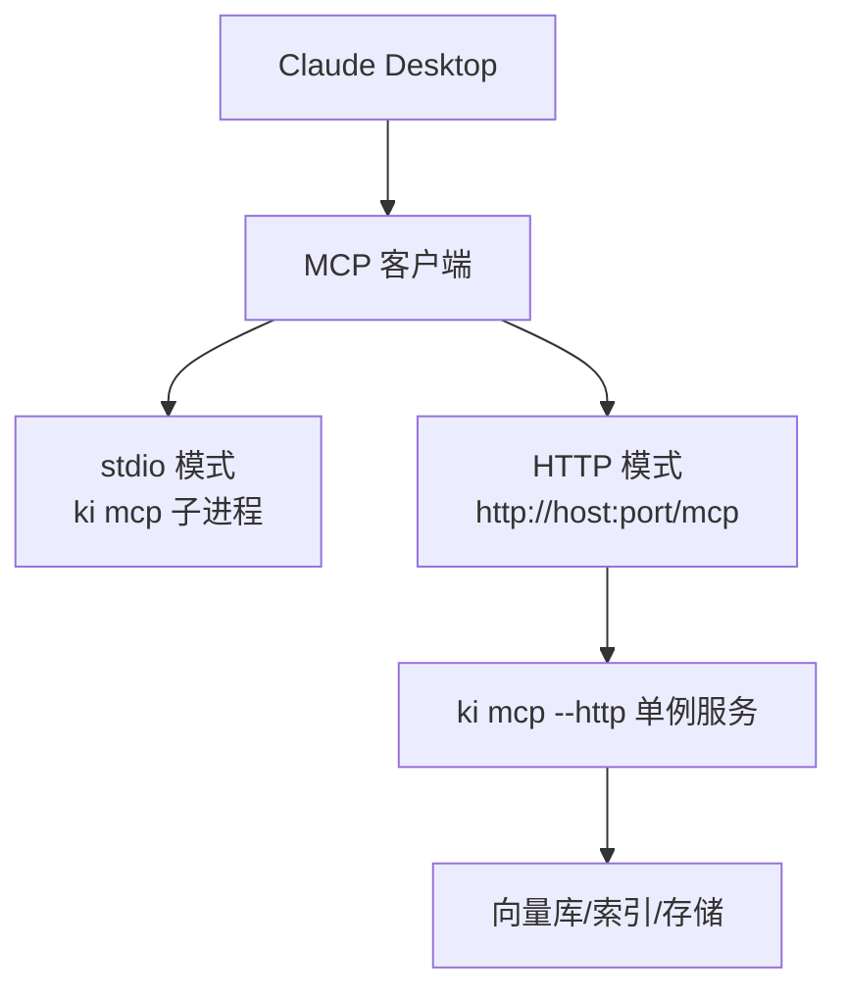
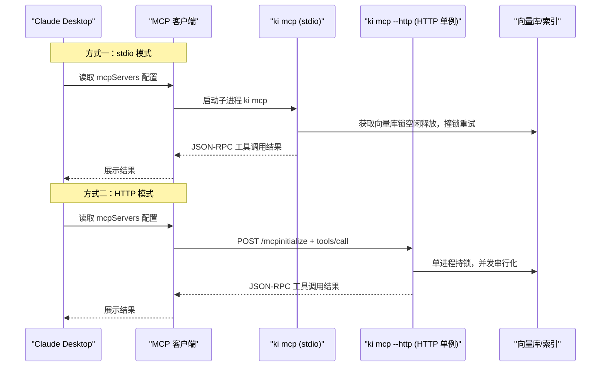
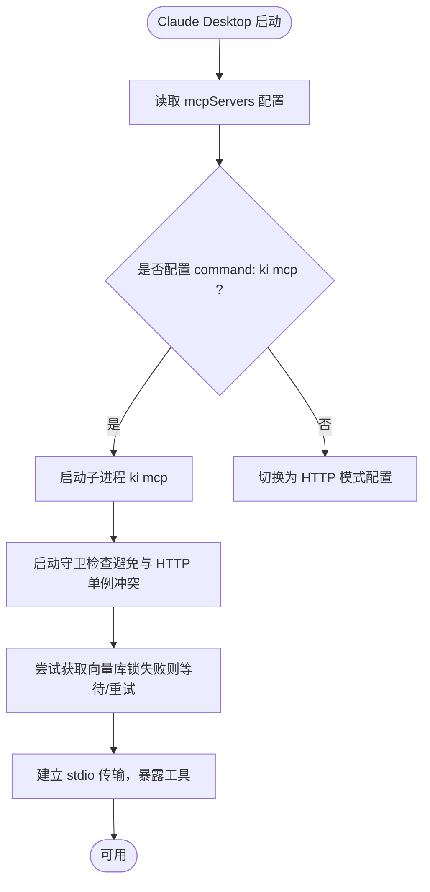
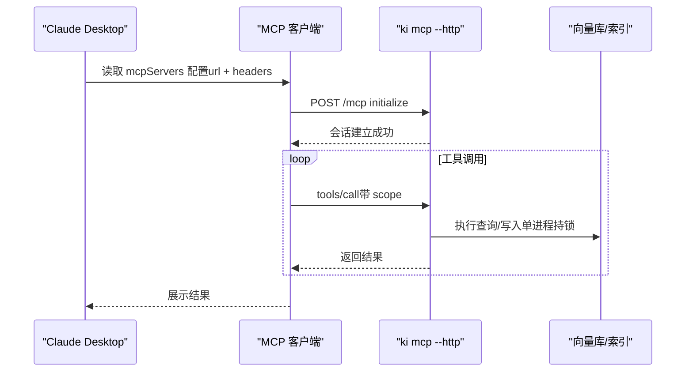
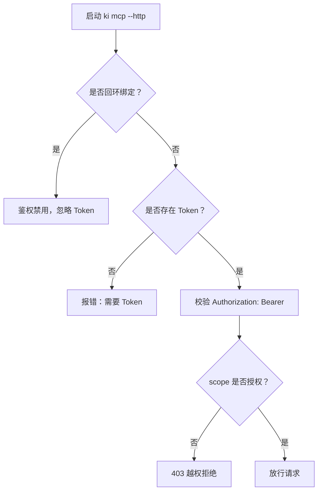
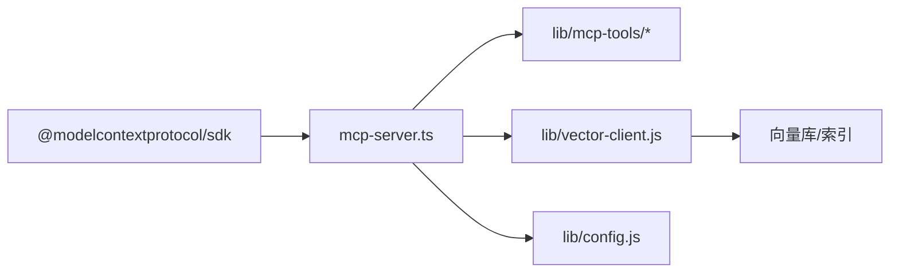

# Claude Desktop集成配置

<cite>
**本文引用的文件**
- [mcp-server.ts](file://src/mcp-server.ts)
- [mcp-http.md](file://docs/mcp-http.md)
- [cli.md](file://docs/cli.md)
- [config.ts](file://src/config.ts)
- [mcp.json（示例）](file://test_data/bk-monitor-wiki/configs/mcps/mcp.json)
</cite>

## 目录
1. [简介](#简介)
2. [项目结构](#项目结构)
3. [核心组件](#核心组件)
4. [架构总览](#架构总览)
5. [详细组件分析](#详细组件分析)
6. [依赖关系分析](#依赖关系分析)
7. [性能与稳定性建议](#性能与稳定性建议)
8. [故障排查指南](#故障排查指南)
9. [结论](#结论)
10. [附录：Claude Desktop配置要点](#附录claude-desktop配置要点)

## 简介
本指南面向在 Claude Desktop 中集成 MCP 客户端的用户，目标是说明如何在 Claude Desktop 中通过 stdio 模式或 HTTP 模式连接 ki 提供的 MCP 服务。文档涵盖：
- 两种模式的配置步骤与差异
- Claude Desktop 的 mcpServers 配置格式与参数说明
- 环境变量与认证 Token 的设置方法
- Windows、macOS、Linux 上的注意事项
- 与 Claude Desktop 集成的功能点与性能优化建议

## 项目结构
仓库中与 MCP 集成相关的关键位置包括：
- MCP 服务端入口与启动逻辑：src/mcp-server.ts
- HTTP 共享单例模式与鉴权说明：docs/mcp-http.md
- CLI 参考与工具清单：docs/cli.md
- 配置文件模板生成：src/config.ts
- MCP 客户端配置示例（含 stdio 与 URL 型条目）：test_data/bk-monitor-wiki/configs/mcps/mcp.json

**图表来源**
- [mcp-server.ts:492-734](file://src/mcp-server.ts#L492-L734)
- [mcp-http.md:1-70](file://docs/mcp-http.md#L1-L70)

**章节来源**
- [mcp-server.ts:492-734](file://src/mcp-server.ts#L492-L734)
- [mcp-http.md:1-70](file://docs/mcp-http.md#L1-L70)

## 核心组件
- MCP 服务端构建与工具注册：统一通过工厂函数创建 McpServer 并注册全部工具，供 stdio 与 HTTP 复用。
- 启动守卫与冲突检测：防止 stdio 与 HTTP 单例争抢向量库锁；多 stdio 实例可错开共享。
- HTTP 共享单例：默认回环地址免鉴权；非回环绑定强制 Token 鉴权。
- Token 管理：支持生成、列出、更新、删除授权 Token，按 scope 最小授权。
- 配置模板：提供 config.yaml 模板，便于初始化数据路径、向量目录、Embedding 提供方等。

**章节来源**
- [mcp-server.ts:49-71](file://src/mcp-server.ts#L49-L71)
- [mcp-server.ts:592-658](file://src/mcp-server.ts#L592-L658)
- [mcp-http.md:133-146](file://docs/mcp-http.md#L133-L146)
- [cli.md:914-927](file://docs/cli.md#L914-L927)
- [config.ts:66-119](file://src/config.ts#L66-L119)

## 架构总览
下图展示了 Claude Desktop 作为 MCP 客户端，通过 stdio 或 HTTP 两种方式接入 ki 的 MCP 服务，并在 HTTP 模式下由单一持锁进程统一管理向量库访问。

**图表来源**
- [mcp-server.ts:687-734](file://src/mcp-server.ts#L687-L734)
- [mcp-http.md:234-242](file://docs/mcp-http.md#L234-L242)

## 详细组件分析

### 组件A：stdio 模式接入（Claude Desktop）
- 适用场景：本地开发、单机使用、无需跨机共享。
- 配置要点：在 Claude Desktop 的 MCP 客户端配置文件中添加 command 型条目，指向 ki 的 mcp 子命令。
- 行为特征：每次连接可能拉起独立子进程；多个 stdio 实例可错开共享向量库锁。

**图表来源**
- [mcp-server.ts:620-658](file://src/mcp-server.ts#L620-L658)
- [cli.md:996-1009](file://docs/cli.md#L996-L1009)

**章节来源**
- [cli.md:996-1009](file://docs/cli.md#L996-L1009)
- [mcp-server.ts:620-658](file://src/mcp-server.ts#L620-L658)

### 组件B：HTTP 模式接入（Claude Desktop）
- 适用场景：多 IDE 共享同一持锁进程、远程跨机访问、集中化管理。
- 配置要点：先启动一次 ki mcp --http（幂等），然后在 Claude Desktop 配置中使用 url 型条目，必要时携带 Authorization 头。
- 鉴权策略：回环地址免鉴权；非回环绑定必须提供 Token（支持临时 Token 或多 Token 存储）。

**图表来源**
- [mcp-http.md:234-242](file://docs/mcp-http.md#L234-L242)
- [mcp-server.ts:687-699](file://src/mcp-server.ts#L687-L699)

**章节来源**
- [mcp-http.md:133-146](file://docs/mcp-http.md#L133-L146)
- [cli.md:1011-1024](file://docs/cli.md#L1011-L1024)

### 组件C：Token 管理与环境变量
- Token 来源优先级：命令行 --token > 环境变量 KI_MCP_TOKEN > 多 Token 存储（~/.ki/mcp-tokens.json）。
- 生成与管理：通过 ki mcp token generate/list/update/delete 完成生命周期管理，必须显式指定 scope。
- 环境变量：可在 Claude Desktop 的 env 字段注入环境变量（如 API Key），但 Token 不建议明文放入配置文件。

**图表来源**
- [mcp-http.md:133-146](file://docs/mcp-http.md#L133-L146)
- [mcp-server.ts:186-212](file://src/mcp-server.ts#L186-L212)

**章节来源**
- [mcp-http.md:59-68](file://docs/mcp-http.md#L59-L68)
- [mcp-server.ts:227-351](file://src/mcp-server.ts#L227-L351)

### 组件D：配置模板与环境变量
- 配置文件模板：可通过 ki config init 生成 ~/.ki/config.yaml，包含 dataDir、backupDir、vectorDir、embedding 等。
- 环境变量：Embedding 提供商密钥推荐通过环境变量引用（如 ${VAR_NAME}），避免明文入库。
- Claude Desktop 环境注入：可在 mcpServers 的 env 字段注入所需环境变量（例如 API Key）。

**章节来源**
- [config.ts:66-119](file://src/config.ts#L66-L119)
- [mcp.json（示例）:1-29](file://test_data/bk-monitor-wiki/configs/mcps/mcp.json#L1-L29)

## 依赖关系分析
- MCP SDK：服务端基于官方 SDK 实现 stdio 与 HTTP 传输。
- 向量库：嵌入式向量库在同一时刻仅一个进程持锁；HTTP 单例模式从根本上避免多进程冲突。
- 配置系统：CLI 参数优先于配置文件默认值；HTTP 默认监听地址与端口可从配置文件预置。

**图表来源**
- [mcp-server.ts:5-23](file://src/mcp-server.ts#L5-L23)
- [mcp-http.md:1-10](file://docs/mcp-http.md#L1-L10)

**章节来源**
- [mcp-server.ts:5-23](file://src/mcp-server.ts#L5-L23)
- [mcp-http.md:1-10](file://docs/mcp-http.md#L1-L10)

## 性能与稳定性建议
- 推荐使用 HTTP 共享单例模式：避免多 IDE 各自拉起 stdio 导致向量库锁冲突，提升整体吞吐与稳定性。
- 合理设置会话上限与空闲回收：默认会话上限与空闲回收机制可防止资源耗尽。
- 控制并发与批量操作：优先使用批量接口（如批量同步/存储）减少往返开销。
- 避免混用 stdio 与 HTTP：若已启用 HTTP 单例，应将 IDE 配置迁移为 URL 型接入，避免争抢锁。
- 使用最小授权 Token：按 scope 精确授权，降低越权风险。

[本节为通用指导，不直接分析具体文件]

## 故障排查指南
- 无法启动或提示冲突：检查是否存在健康 HTTP 单例或其他 stdio 实例；使用 ki mcp --status 查看状态。
- 鉴权失败（401）：确认 Authorization 头与 Token 一致；非回环绑定必须提供 Token。
- 越权拒绝（403）：检查请求的 scope 是否在 Token 授权范围内；必要时扩大 scope。
- 端口占用或监听失败：更换端口或排查占用进程；注意低端口权限问题。
- 前端页面未加载：确保 web/dist 构建产物存在；或使用 --no-web 关闭前端。

**章节来源**
- [mcp-http.md:224-233](file://docs/mcp-http.md#L224-L233)
- [mcp-server.ts:660-678](file://src/mcp-server.ts#L660-L678)

## 结论
- 对于本地单机使用，stdio 模式简单直观；对于多 IDE 或远程场景，HTTP 共享单例模式更稳定高效。
- 鉴权与安全：回环地址免鉴权，非回环绑定强制 Token；推荐通过 ki mcp token 管理最小授权。
- 配置与环境：使用 config.yaml 模板管理基础路径与 Embedding；Claude Desktop 的 env 字段用于注入必要的环境变量。
- 遵循“不混用 stdio 与 HTTP”的原则，确保向量库锁的唯一持锁者，避免降级与冲突。

[本节为总结性内容，不直接分析具体文件]

## 附录：Claude Desktop配置要点
- 配置文件位置与格式：在 Claude Desktop 的 MCP 客户端配置文件中定义 mcpServers，支持 command 型（stdio）与 url 型（HTTP）两种条目。
- stdio 模式配置示例：command 指向 ki，args 为 ["mcp"]。
- HTTP 模式配置示例：url 指向 http://host:port/mcp，headers 中包含 Authorization: Bearer <token>（回环地址可省略）。
- 环境变量注入：在 env 字段注入所需环境变量（如 API Key），避免将敏感信息硬编码到配置中。
- 平台差异：
  - Windows：注意 PATH 与命令解析；WSL 挂载盘上 POSIX 权限语义可能不严格，托管文件保护强度依赖文件系统。
  - macOS/Linux：默认支持良好；确保 ki 命令可执行且路径正确。

**章节来源**
- [cli.md:996-1024](file://docs/cli.md#L996-L1024)
- [mcp.json（示例）:1-29](file://test_data/bk-monitor-wiki/configs/mcps/mcp.json#L1-L29)
- [mcp-http.md:68-69](file://docs/mcp-http.md#L68-L69)