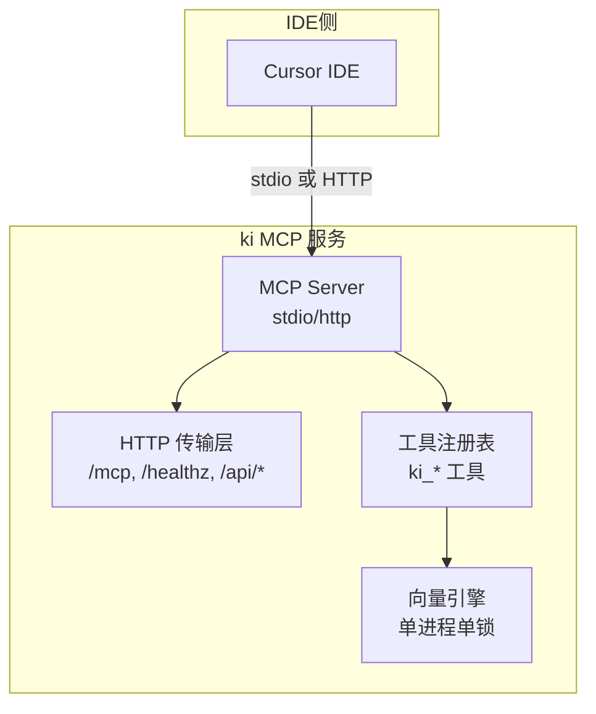
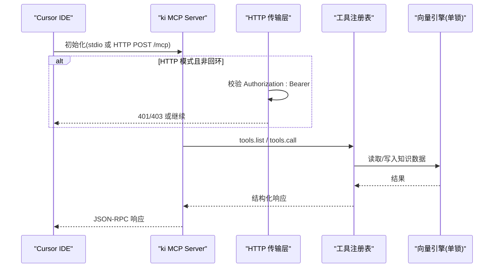
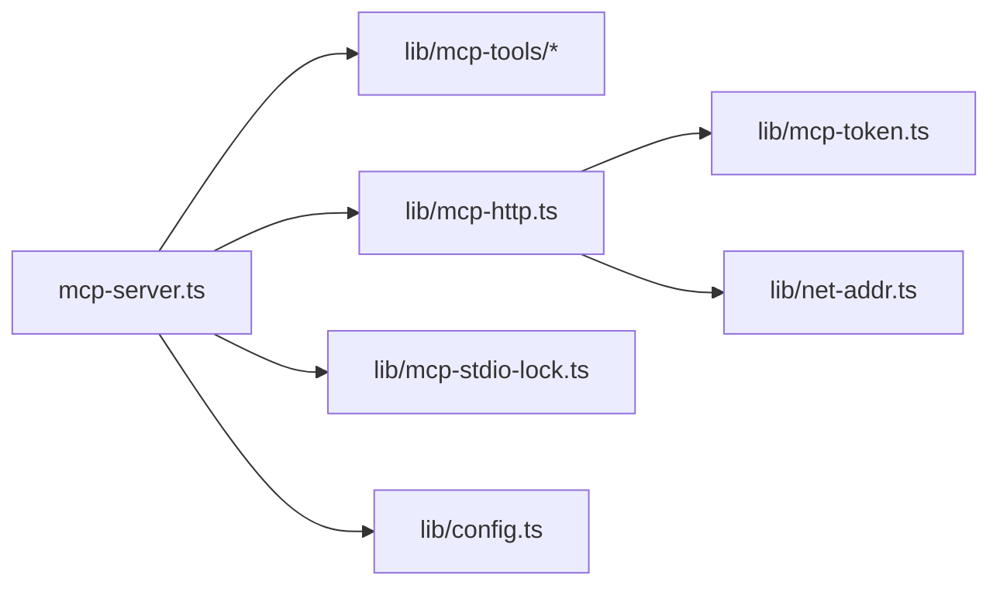

# Cursor集成配置

<cite>
**本文引用的文件**
- [src/mcp-server.ts](file://src/mcp-server.ts)
- [src/lib/mcp-http.ts](file://src/lib/mcp-http.ts)
- [src/lib/mcp-stdio-lock.ts](file://src/lib/mcp-stdio-lock.ts)
- [src/lib/config.ts](file://src/lib/config.ts)
- [docs/mcp-http.md](file://docs/mcp-http.md)
- [test_data/bk-monitor-wiki/configs/mcps/mcp.json](file://test_data/bk-monitor-wiki/configs/mcps/mcp.json)
</cite>

## 目录
1. [简介](#简介)
2. [项目结构](#项目结构)
3. [核心组件](#核心组件)
4. [架构总览](#架构总览)
5. [详细组件分析](#详细组件分析)
6. [依赖关系分析](#依赖关系分析)
7. [性能与稳定性](#性能与稳定性)
8. [故障排查指南](#故障排查指南)
9. [结论](#结论)
10. [附录：Cursor配置示例与最佳实践](#附录cursor配置示例与最佳实践)

## 简介
本指南面向在 Cursor IDE 中集成 MCP（Model Context Protocol）客户端，目标是帮助你在本地或远程环境中，以 stdio 模式或 HTTP 模式连接 ki 的 MCP 服务。文档基于仓库内实现，覆盖以下要点：
- 如何在 Cursor 中配置 MCP 服务器（stdio 与 HTTP 两种模式）
- Cursor 特定的配置文件格式与参数设置
- 多项目环境下如何管理不同的 MCP 配置
- 安全与鉴权（Token、回环/非回环绑定、scope 越权校验）
- 运维与排障（单例守护、状态自查、一键关闭）

## 项目结构
仓库提供了完整的 MCP Server 能力与 HTTP 共享单例模式，支持：
- stdio 传输：适合本机直连、简单场景
- HTTP 传输：适合多 IDE 共享同一持锁进程，避免向量库锁冲突
- Token 鉴权与 scope RBAC：非回环绑定强制鉴权，按 scope 限制工具访问
- 前端页面与扩展 API（可选）：便于可视化与导入等能力

图表来源
- [src/mcp-server.ts:54-71](file://src/mcp-server.ts#L54-L71)
- [src/lib/mcp-http.ts:344-607](file://src/lib/mcp-http.ts#L344-L607)

章节来源
- [src/mcp-server.ts:49-71](file://src/mcp-server.ts#L49-L71)
- [src/lib/mcp-http.ts:1-15](file://src/lib/mcp-http.ts#L1-L15)

## 核心组件
- MCP Server 入口与工具注册：负责启动 stdio 或 HTTP 传输，并注册全部工具（查询、模块信息、同步关系、索引管理等）。
- HTTP 传输与鉴权：提供 Streamable HTTP 传输、会话管理、Token 鉴权、DNS rebinding 保护、空闲会话回收。
- stdio 多实例锁：为每个 stdio 实例登记 lock，供 stop/status/restart 定位与冲突检测。
- 配置加载：支持 YAML/JSON 配置文件，解析 mcp.http 默认值（host/port/allowedHosts），token 不入配置文件。

章节来源
- [src/mcp-server.ts:49-71](file://src/mcp-server.ts#L49-L71)
- [src/lib/mcp-http.ts:36-80](file://src/lib/mcp-http.ts#L36-L80)
- [src/lib/mcp-stdio-lock.ts:1-14](file://src/lib/mcp-stdio-lock.ts#L1-L14)
- [src/lib/config.ts:99-128](file://src/lib/config.ts#L99-L128)

## 架构总览
下图展示了 Cursor 通过 stdio 或 HTTP 接入 ki MCP 服务的整体流程，包括鉴权、会话、工具调用与向量引擎交互。

图表来源
- [src/mcp-server.ts:687-733](file://src/mcp-server.ts#L687-L733)
- [src/lib/mcp-http.ts:454-577](file://src/lib/mcp-http.ts#L454-L577)

## 详细组件分析

### 组件A：MCP Server 启动与模式选择
- 支持 stdio 与 HTTP 两种模式；HTTP 模式可后台常驻（daemon）、重启（restart）、状态查看（status）。
- 启动守卫：
  - HTTP 模式：先探活已有健康实例则复用退出；若检测到存活的 stdio 实例则拒绝启动，避免争抢向量库锁。
  - stdio 模式：若检测到健康 HTTP 单例，提示迁移到 URL 型接入。
- 预检：启动前执行健康检查，失败则拒绝启动。

章节来源
- [src/mcp-server.ts:137-212](file://src/mcp-server.ts#L137-L212)
- [src/mcp-server.ts:595-733](file://src/mcp-server.ts#L595-L733)

### 组件B：HTTP 传输、鉴权与会话管理
- 传输协议：Streamable HTTP，端点 /mcp；健康端点 /healthz；扩展接口 /api/*。
- 鉴权策略：
  - 回环绑定（127.0.0.1/localhost/::1）：免鉴权。
  - 非回环绑定（0.0.0.0/外网IP）：强制 Bearer Token；未提供则拒绝启动。
  - Token 来源优先级：命令行 --token/KI_MCP_TOKEN > 多 Token 存储（~/.ki/mcp-tokens.json）。
- 会话模型：
  - 每个 initialize 新建 transport + McpServer，共享 vector-client 单例 engine。
  - 会话上限与空闲回收：默认最大并发会话数与空闲超时，自动清理残留会话。
- DNS rebinding 保护：可通过 allowedHosts 限定 Host 头。

章节来源
- [src/lib/mcp-http.ts:36-80](file://src/lib/mcp-http.ts#L36-L80)
- [src/lib/mcp-http.ts:454-577](file://src/lib/mcp-http.ts#L454-L577)
- [src/lib/mcp-http.ts:676-766](file://src/lib/mcp-http.ts#L676-L766)

### 组件C：stdio 多实例锁与冲突处理
- 每实例独立 lock 文件（~/.ki/mcp-stdio-<pid>.lock），支持多实例登记与并发启动互不干扰。
- 陈旧锁自动清理：读取时进行 pid 存活校验，死进程锁自动删除。
- 与 HTTP 单例互斥：stdio 模式下若存在健康 HTTP 单例，拒绝启动并引导迁移到 URL 型接入。

章节来源
- [src/lib/mcp-stdio-lock.ts:1-14](file://src/lib/mcp-stdio-lock.ts#L1-L14)
- [src/lib/mcp-stdio-lock.ts:100-154](file://src/lib/mcp-stdio-lock.ts#L100-L154)
- [src/mcp-server.ts:620-658](file://src/mcp-server.ts#L620-L658)

### 组件D：配置加载与默认值
- 配置文件查找优先级：--config > $HOME/.ki/config.yaml/yml/json > 内置默认值。
- mcp.http 默认值：仅 host/port/allowedHosts；token 不从配置文件读取。
- 路径展开：支持 $HOME/~/ 与相对路径解析。

章节来源
- [src/lib/config.ts:4-17](file://src/lib/config.ts#L4-L17)
- [src/lib/config.ts:99-128](file://src/lib/config.ts#L99-L128)
- [src/lib/config.ts:183-205](file://src/lib/config.ts#L183-L205)
- [src/lib/config.ts:291-307](file://src/lib/config.ts#L291-L307)

## 依赖关系分析
- MCP Server 依赖工具注册模块（query-group、get-module-info、sync-relation、manage-index、search、store、delete-relation、scope-list、tag-list）。
- HTTP 传输依赖版本守卫、网络地址判断、Token 存储、stdio lock 探测。
- 配置模块被 MCP 启动守卫与 HTTP 启动共用，确保 host/port/allowedHosts 一致。

图表来源
- [src/mcp-server.ts:5-35](file://src/mcp-server.ts#L5-L35)
- [src/lib/mcp-http.ts:17-27](file://src/lib/mcp-http.ts#L17-L27)

章节来源
- [src/mcp-server.ts:5-35](file://src/mcp-server.ts#L5-L35)
- [src/lib/mcp-http.ts:17-27](file://src/lib/mcp-http.ts#L17-L27)

## 性能与稳定性
- 单进程单锁：HTTP 共享单例作为唯一持锁者，避免多 IDE 锁冲突。
- 会话上限与空闲回收：防止会话无界增长耗尽内存，异常断开的会话会被回收。
- 优雅退出：SIGINT/SIGTERM 触发关闭所有会话、释放向量库锁、关闭 HTTP 服务、清理 lock。
- 启动预检：失败即拒绝启动，避免降级运行。

章节来源
- [src/lib/mcp-http.ts:46-56](file://src/lib/mcp-http.ts#L46-L56)
- [src/lib/mcp-http.ts:381-392](file://src/lib/mcp-http.ts#L381-L392)
- [src/lib/mcp-http.ts:734-766](file://src/lib/mcp-http.ts#L734-L766)
- [src/mcp-server.ts:660-678](file://src/mcp-server.ts#L660-L678)

## 故障排查指南
- 端口占用：EADDRINUSE 表示端口被占用且未探活到健康实例，需更换端口或排查占用进程。
- 权限不足：EACCES 通常因绑定 <1024 端口，建议改用高位端口。
- 地址不可用：EADDRNOTAVAIL 表示本机不存在该地址；ENOTFOUND 表示主机无法解析。
- 鉴权失败（401）：确认 Authorization: Bearer 与托管 Token 完全一致；服务端 stderr 有失败原因日志。
- 越权拒绝（403）：请求的 scope 不在授权范围内；使用 token update 扩大授权或修正请求 scope。
- 状态自查：使用 ki mcp --status 输出 JSON，包含 running、target、healthz、lock、stdioInstances、managedTokens.count。

章节来源
- [src/lib/mcp-http.ts:609-630](file://src/lib/mcp-http.ts#L609-L630)
- [docs/mcp-http.md:105-131](file://docs/mcp-http.md#L105-L131)
- [docs/mcp-http.md:224-233](file://docs/mcp-http.md#L224-L233)

## 结论
- 对于 Cursor 集成，推荐优先使用 HTTP 共享单例模式，避免多 IDE 锁冲突，并通过 Token 鉴权保障安全。
- 本地开发可使用 stdio 模式快速验证；生产环境建议使用 HTTP + 反向代理 TLS。
- 利用 ki mcp 子命令（stop/restart/status/token）进行生命周期管理与排障。

## 附录：Cursor配置示例与最佳实践

### 在 Cursor 中配置 MCP 服务器
- 配置文件位置与格式：Cursor 使用 mcpServers 对象定义多个 MCP 服务器条目。
- 两种接入方式：
  - stdio 模式：command + args 形式，适合本机直连。
  - HTTP 模式：url + headers 形式，适合多 IDE 共享与远程访问。

章节来源
- [test_data/bk-monitor-wiki/configs/mcps/mcp.json:1-29](file://test_data/bk-monitor-wiki/configs/mcps/mcp.json#L1-L29)

### stdio 模式配置要点
- 适用场景：单机、简单调试、无需跨机共享。
- 注意事项：
  - 若已存在健康 HTTP 单例，stdio 启动将被拒绝，需迁移到 URL 型接入。
  - 多 stdio 实例可并存，但会共享向量库（错开使用），同时使用时可能短暂等待。

章节来源
- [src/mcp-server.ts:620-658](file://src/mcp-server.ts#L620-L658)

### HTTP 模式配置要点
- 适用场景：多 IDE 共享、远程跨机访问、生产部署。
- 关键参数：
  - url：MCP 端点，如 http://<host>:7423/mcp
  - headers：Authorization: Bearer <token>（非回环绑定时必须）
  - 回环绑定（127.0.0.1）：免鉴权，可省略 headers
- 启动与服务管理：
  - 首次手动启动：ki mcp --http（幂等，重复运行安全）
  - 后台常驻：ki mcp --http --daemon
  - 重启：ki mcp restart
  - 状态查看：ki mcp --status

章节来源
- [docs/mcp-http.md:11-39](file://docs/mcp-http.md#L11-L39)
- [docs/mcp-http.md:191-223](file://docs/mcp-http.md#L191-L223)
- [docs/mcp-http.md:249-260](file://docs/mcp-http.md#L249-L260)

### 多项目环境下的 MCP 配置管理
- 使用不同 scope 隔离项目：在工具调用中指定 scope，结合 Token 的 scope 授权实现最小权限。
- 多 Token 存储：通过 ki mcp token generate/update/delete 管理多个 Token，分别授权不同 scope。
- 配置文件默认值：可在 ~/.ki/config.yaml 中预置 mcp.http 的 host/port/allowedHosts，CLI 参数优先。

章节来源
- [src/lib/config.ts:99-128](file://src/lib/config.ts#L99-L128)
- [docs/mcp-http.md:59-67](file://docs/mcp-http.md#L59-L67)
- [docs/mcp-http.md:132-145](file://docs/mcp-http.md#L132-L145)

### 安全与最佳实践
- 回环绑定免鉴权，非回环绑定强制鉴权；生产环境建议前置 TLS 反向代理。
- 使用托管 Token 而非明文环境变量或配置文件；怀疑泄露立即 delete 或 update 收敛权限。
- 开启 DNS rebinding 保护（allowedHosts）以减少风险。
- 定期使用 ki mcp --status 确认实例全貌与鉴权失败次数。

章节来源
- [docs/mcp-http.md:243-247](file://docs/mcp-http.md#L243-L247)
- [docs/mcp-http.md:132-145](file://docs/mcp-http.md#L132-L145)