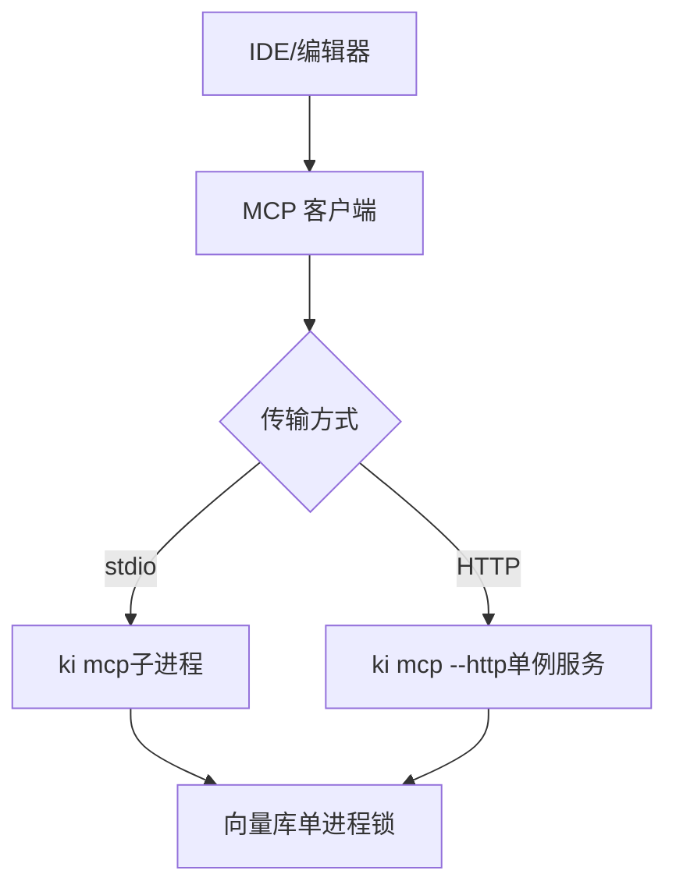
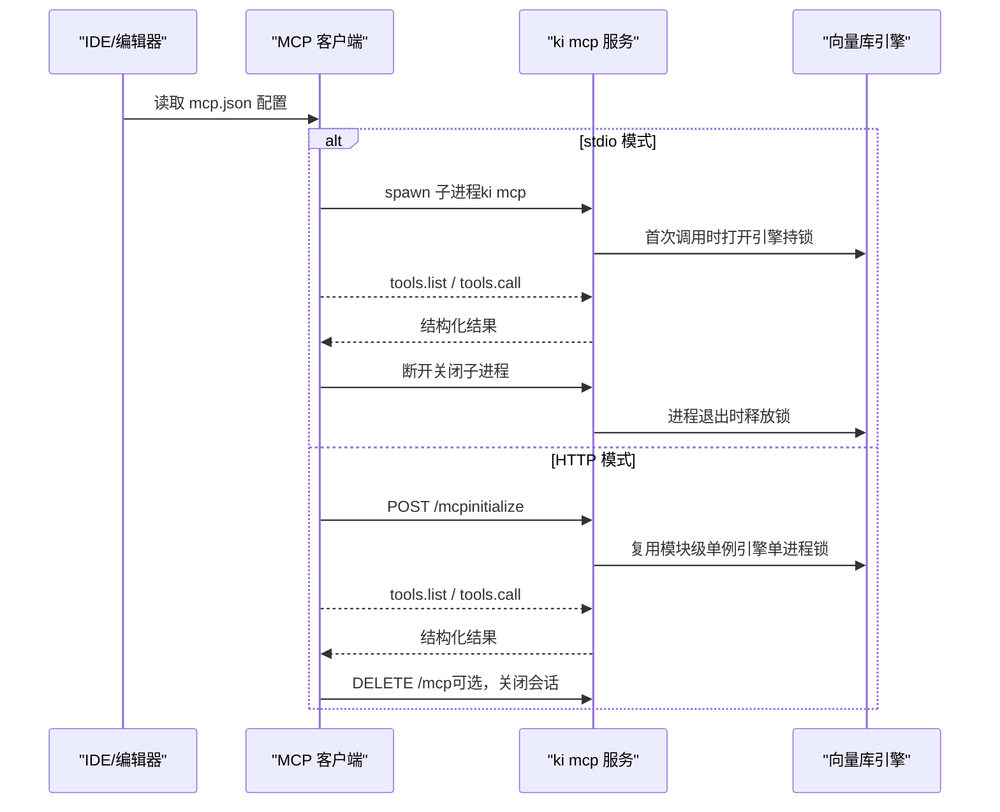
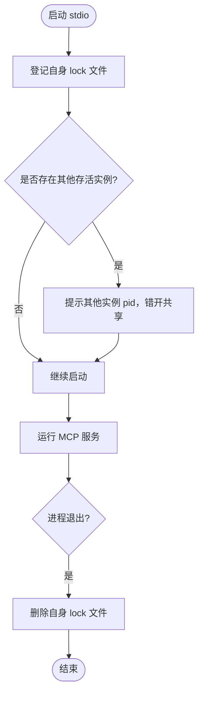
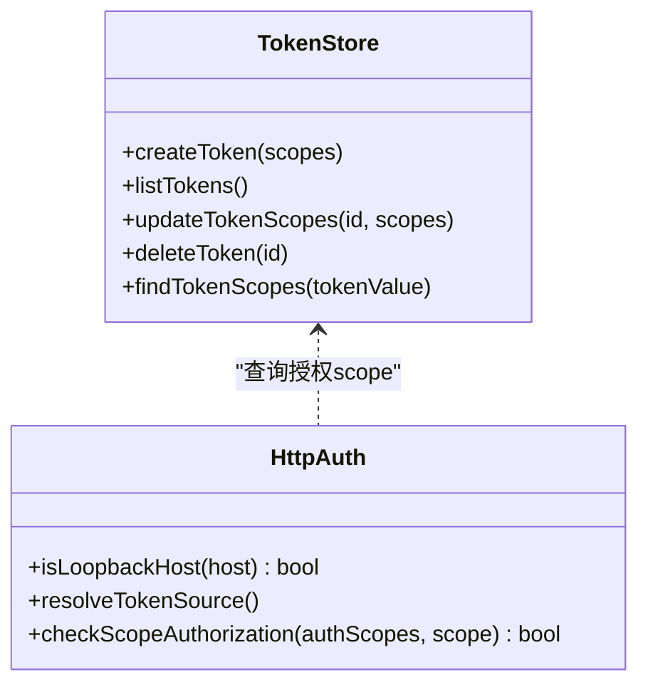
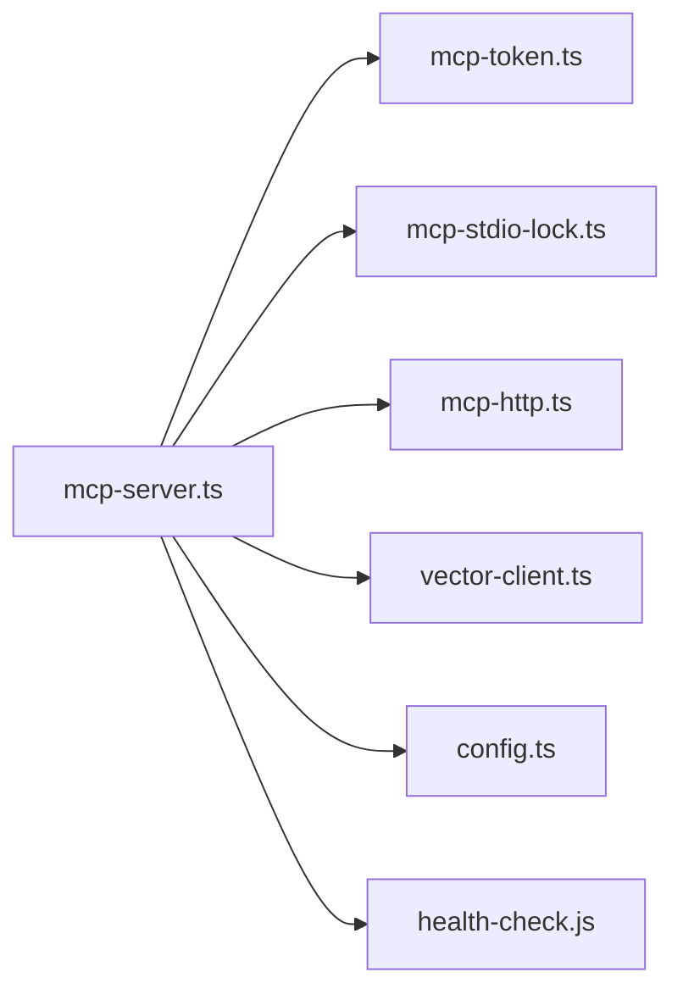
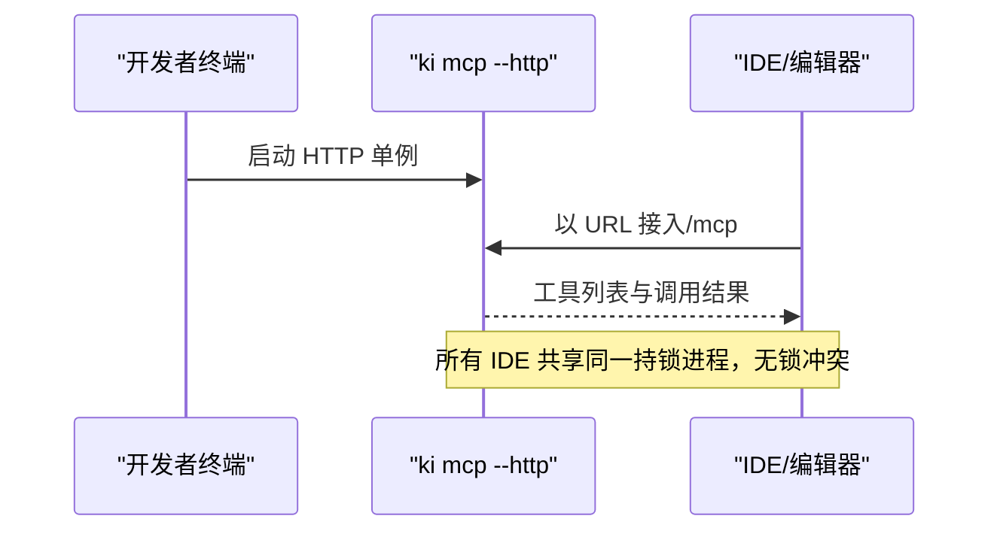

# IDE集成配置

<cite>
**本文引用的文件**
- [src/mcp-server.ts](file://src/mcp-server.ts)
- [src/lib/mcp-stdio-lock.ts](file://src/lib/mcp-stdio-lock.ts)
- [src/lib/mcp-token.ts](file://src/lib/mcp-token.ts)
- [docs/mcp-http.md](file://docs/mcp-http.md)
- [test_data/bk-monitor-wiki/configs/mcps/mcp.json](file://test_data/bk-monitor-wiki/configs/mcps/mcp.json)
- [test_data/bk-monitor-wiki/configs/mcps/opencode.json](file://test_data/bk-monitor-wiki/configs/mcps/opencode.json)
</cite>

## 目录
1. [简介](#简介)
2. [项目结构](#项目结构)
3. [核心组件](#核心组件)
4. [架构总览](#架构总览)
5. [详细组件分析](#详细组件分析)
6. [依赖关系分析](#依赖关系分析)
7. [性能与并发特性](#性能与并发特性)
8. [IDE集成配置指南](#ide集成配置指南)
9. [常见问题排查](#常见问题排查)
10. [结论](#结论)

## 简介
本指南面向在 VS Code、Cursor、Claude Desktop 等主流 IDE/编辑器中集成 ki MCP 客户端，提供 stdio 模式与 HTTP 模式的完整配置步骤、连接参数、认证 Token 设置方法，以及多实例冲突检测与解决方案。重点说明如何通过 HTTP 单例避免多个 IDE 同时启动 stdio 实例导致的向量库锁冲突，并给出常见问题的排查方法与最佳实践。

## 项目结构
ki 的 MCP 能力由服务端入口统一编排，支持两种传输：
- stdio：每个 IDE 进程独立拉起一个子进程，适合本地快速调试。
- HTTP：推荐生产或多 IDE 共享场景，单一持锁进程对外暴露 /mcp 接口，所有 IDE 通过 URL 接入，彻底避免多进程锁冲突。

图表来源
- [src/mcp-server.ts:492-734](file://src/mcp-server.ts#L492-L734)
- [docs/mcp-http.md:1-10](file://docs/mcp-http.md#L1-L10)

章节来源
- [src/mcp-server.ts:492-734](file://src/mcp-server.ts#L492-L734)
- [docs/mcp-http.md:1-10](file://docs/mcp-http.md#L1-L10)

## 核心组件
- MCP Server 入口与路由：负责解析命令、守卫检查、启动 stdio 或 HTTP 服务、注册工具集。
- stdio 多实例锁：为每个 stdio 实例登记独立 lock 文件，供 stop/status/restart 定位与冲突提示。
- HTTP 鉴权与多 Token：支持回环免鉴权与非回环强制鉴权；Token 存储于用户目录，按 scope 授权。
- 向量库空闲释放与撞锁重试：常驻实例空闲超时自动释放锁，其他进程撞锁时短暂等待重试，降低争用影响。

章节来源
- [src/mcp-server.ts:492-734](file://src/mcp-server.ts#L492-L734)
- [src/lib/mcp-stdio-lock.ts:1-154](file://src/lib/mcp-stdio-lock.ts#L1-L154)
- [src/lib/mcp-token.ts:1-265](file://src/lib/mcp-token.ts#L1-L265)
- [docs/mcp-http.md:1-10](file://docs/mcp-http.md#L1-L10)

## 架构总览
下图展示 IDE 通过 stdio 或 HTTP 接入 ki MCP 的端到端流程，包括鉴权、会话与会话上限、向量库锁协调。

图表来源
- [src/mcp-server.ts:492-734](file://src/mcp-server.ts#L492-L734)
- [docs/mcp-http.md:234-242](file://docs/mcp-http.md#L234-L242)

## 详细组件分析

### stdio 多实例锁与冲突处理
- 每个 stdio 实例创建独立 lock 文件（文件名即 pid），用于进程管理（stop/status/restart）。
- 启动时不再拒绝多实例并存，而是提示已存在其他实例；多个 stdio 实例共享向量库，空闲自动释放锁，撞锁时短暂等待重试。
- 异常退出的陈旧锁会在下次启动时自动清理。

图表来源
- [src/lib/mcp-stdio-lock.ts:118-154](file://src/lib/mcp-stdio-lock.ts#L118-L154)
- [src/mcp-server.ts:620-658](file://src/mcp-server.ts#L620-L658)

章节来源
- [src/lib/mcp-stdio-lock.ts:1-154](file://src/lib/mcp-stdio-lock.ts#L1-L154)
- [src/mcp-server.ts:620-658](file://src/mcp-server.ts#L620-L658)

### HTTP 鉴权与多 Token
- 回环地址（127.0.0.1/localhost/::1）免鉴权；非回环地址强制要求 Token。
- Token 来源优先级：命令行 --token > 环境变量 KI_MCP_TOKEN > 多 Token 存储文件。
- 多 Token 存储位于用户目录，权限 0600；支持生成、列出、更新 scope、删除。
- 请求进入后对 tools/call 的 arguments.scope 做越权校验，未授权返回 403。

图表来源
- [src/lib/mcp-token.ts:21-265](file://src/lib/mcp-token.ts#L21-L265)
- [src/mcp-server.ts:137-212](file://src/mcp-server.ts#L137-L212)

章节来源
- [src/lib/mcp-token.ts:1-265](file://src/lib/mcp-token.ts#L1-L265)
- [src/mcp-server.ts:137-212](file://src/mcp-server.ts#L137-L212)
- [docs/mcp-http.md:132-146](file://docs/mcp-http.md#L132-L146)

### 向量库空闲释放与撞锁重试
- 常驻 MCP 实例启用空闲释放锁（默认 3 秒），空闲后自动 closeEngine 释放 LOCK。
- 其他进程在 probe/open 阶段检测到 locked 会等待并重试（最多 3 次，间隔 2 秒），缓解“同时使用”的冲突。
- 该机制使多个 stdio 实例与 CLI 可“错开共享”，但并非真正并发。

章节来源
- [AGENTS.md:1-57](file://AGENTS.md#L1-L57)
- [src/mcp-server.ts:680-686](file://src/mcp-server.ts#L680-L686)

## 依赖关系分析
- mcp-server 依赖 stdio/HTTP 传输、健康检查、版本守卫、向量客户端、配置加载、Token 管理、进程锁管理。
- 多 IDE 接入时，HTTP 单例是唯一持锁者，避免多进程争抢向量库锁。
- stdio 模式下，IDE 各自拉起子进程，需配合空闲释放与撞锁重试策略。

图表来源
- [src/mcp-server.ts:1-48](file://src/mcp-server.ts#L1-L48)

章节来源
- [src/mcp-server.ts:1-48](file://src/mcp-server.ts#L1-L48)

## 性能与并发特性
- 会话模型：每个 initialize 新建会话，共享 vector-client 单例引擎；默认会话上限 256，空闲 30 分钟回收。
- 空闲释放锁：常驻实例空闲 3 秒后释放向量库锁，降低多实例争用。
- 撞锁重试：probeWithRetry 最多等待 6 秒，避免立即失败。
- 建议：多 IDE 场景优先使用 HTTP 单例，减少锁竞争与进程开销。

章节来源
- [docs/mcp-http.md:234-242](file://docs/mcp-http.md#L234-L242)
- [AGENTS.md:1-57](file://AGENTS.md#L1-L57)

## IDE集成配置指南

### 通用前置准备
- 安装并可用 ki CLI。
- 如需远程访问或非回环绑定，请生成并配置 Token。
- 确认向量库路径与权限正常。

章节来源
- [docs/mcp-http.md:13-22](file://docs/mcp-http.md#L13-L22)
- [src/mcp-server.ts:137-212](file://src/mcp-server.ts#L137-L212)

### 方案A：HTTP 单例（推荐，避免多实例锁冲突）
- 启动 HTTP 单例：
  - 本机访问（默认回环，免鉴权）：执行一次即可，重复运行安全。
  - 远程跨机访问（非回环）：先创建授权 Token，再启动服务。
- 各 IDE 在 mcp.json 中以 URL 型条目接入，统一 host/port，避免各自拉起独立进程。
- 若需要前端页面，可加 --web 并在浏览器访问根路径。

图表来源
- [docs/mcp-http.md:13-39](file://docs/mcp-http.md#L13-L39)
- [src/mcp-server.ts:687-699](file://src/mcp-server.ts#L687-L699)

章节来源
- [docs/mcp-http.md:13-39](file://docs/mcp-http.md#L13-L39)
- [src/mcp-server.ts:687-699](file://src/mcp-server.ts#L687-L699)

### 方案B：stdio 模式（本地调试）
- 每个 IDE 通过 command 型配置拉起 ki mcp 子进程。
- 注意：多个 IDE 同时使用 stdio 会共享向量库，空闲自动释放锁，撞锁时短暂等待；如出现锁冲突，建议迁移到 HTTP 单例。
- 可通过 ki mcp stop 一键关闭所有实例并清理 lock。

章节来源
- [src/mcp-server.ts:701-734](file://src/mcp-server.ts#L701-L734)
- [docs/mcp-http.md:158-169](file://docs/mcp-http.md#L158-L169)

### VS Code 配置示例
- 使用标准 MCP 配置文件 mcp.json，定义 mcpServers。
- 示例包含 command 型（stdio）与 url 型（HTTP）两种接入方式，可按需选择。

章节来源
- [test_data/bk-monitor-wiki/configs/mcps/mcp.json:1-29](file://test_data/bk-monitor-wiki/configs/mcps/mcp.json#L1-L29)

### Cursor 配置示例
- 使用 mcp 字段组织服务配置，支持 local/remote 类型。
- 示例展示了 command 型与 url 型接入，便于对比。

章节来源
- [test_data/bk-monitor-wiki/configs/mcps/opencode.json:1-31](file://test_data/bk-monitor-wiki/configs/mcps/opencode.json#L1-L31)

### Claude Desktop 配置示例
- 同样遵循 MCP 协议，可在其支持的配置文件中添加 ki 的 stdio 或 HTTP 条目。
- 若使用 HTTP，确保 Authorization 头携带 Bearer Token（非回环场景）。

章节来源
- [docs/mcp-http.md:24-39](file://docs/mcp-http.md#L24-L39)
- [src/mcp-server.ts:137-212](file://src/mcp-server.ts#L137-L212)

### 连接参数与认证 Token 设置
- 连接参数：
  - stdio：command 与 args，必要时设置环境变量。
  - HTTP：url 与 headers（Authorization: Bearer <token>）。
- Token 设置：
  - 生成 Token：ki mcp token generate --scope <scope>。
  - 查看 Token：ki mcp token list。
  - 修改 scope：ki mcp token update <id> --scope <scope>。
  - 删除 Token：ki mcp token delete <id>。
  - 临时全权 Token：--token 或环境变量 KI_MCP_TOKEN（仅进程级）。

章节来源
- [docs/mcp-http.md:59-68](file://docs/mcp-http.md#L59-L68)
- [src/mcp-server.ts:227-351](file://src/mcp-server.ts#L227-L351)
- [src/lib/mcp-token.ts:178-265](file://src/lib/mcp-token.ts#L178-L265)

### 多实例冲突检测与解决方案
- 冲突来源：多个 IDE 各自拉起 stdio 子进程，导致向量库锁争用。
- 检测方式：
  - 使用 ki mcp --status 查看当前是否只有一个持锁进程。
  - 查看 stdio lock 文件：~/.ki/mcp-stdio-<pid>.lock。
  - 查看 HTTP lock 文件：~/.ki/mcp-http.lock。
- 解决方案：
  - 将 IDE 配置迁移为 URL 型接入，统一连接到 HTTP 单例。
  - 使用 ki mcp stop 一键关闭所有实例并清理 lock。
  - 保留 stdio 模式时，接受空闲释放与撞锁重试，但建议切换到 HTTP 以获得更稳定体验。

章节来源
- [docs/mcp-http.md:105-131](file://docs/mcp-http.md#L105-L131)
- [docs/mcp-http.md:170-189](file://docs/mcp-http.md#L170-L189)
- [src/lib/mcp-stdio-lock.ts:57-111](file://src/lib/mcp-stdio-lock.ts#L57-L111)

## 常见问题排查
- 无法连接 HTTP：
  - 确认 host/port 一致且服务已启动；使用 curl 探活 /healthz。
  - 非回环绑定需配置 Token；回环绑定无需 Token。
- 鉴权失败（401）：
  - 核对 Authorization 头与 Token 明文完全一致；检查 Token 是否被删除或过期。
- 越权拒绝（403）：
  - 检查请求的 scope 是否在 Token 授权范围内；必要时更新 scope。
- stdio 模式锁冲突：
  - 使用 ki mcp --status 查看是否有其他 stdio 实例；迁移到 HTTP 单例。
  - 使用 ki mcp stop 清理残留实例与 lock。
- 端口占用：
  - 若端口被占用且探活失败，更换端口或排查占用进程。

章节来源
- [docs/mcp-http.md:224-233](file://docs/mcp-http.md#L224-L233)
- [src/mcp-server.ts:597-658](file://src/mcp-server.ts#L597-L658)

## 结论
- 多 IDE 场景强烈建议使用 HTTP 单例，避免 stdio 多进程锁冲突。
- 本地调试可使用 stdio，但需理解空闲释放与撞锁重试机制。
- 通过 ki mcp token 管理实现最小权限授权，结合回环/非回环鉴权策略保障安全。
- 使用 ki mcp --status 与 ki mcp stop 进行状态自查与一键清理，提升排障效率。