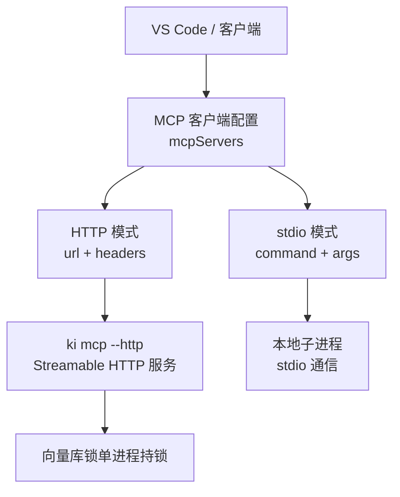
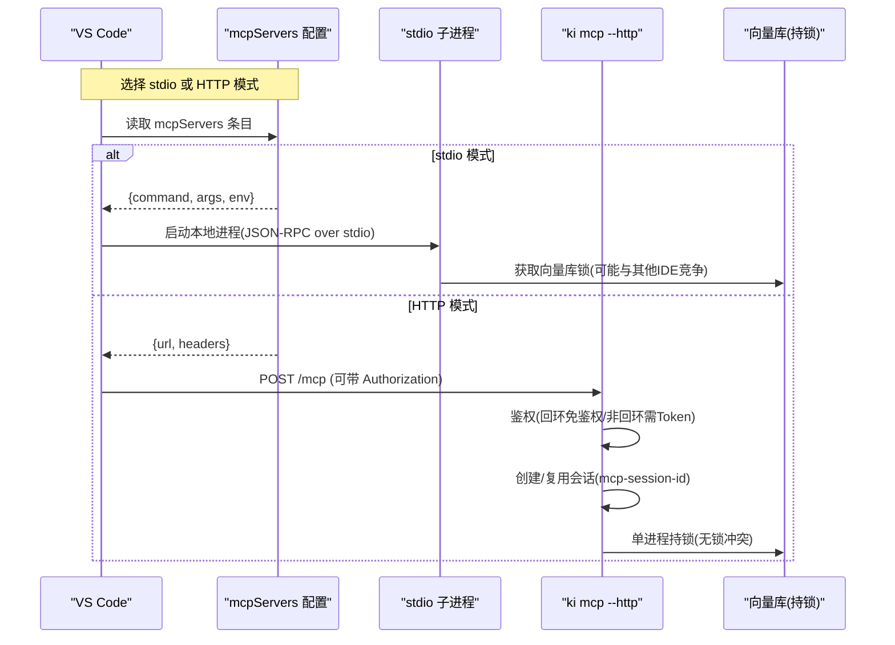
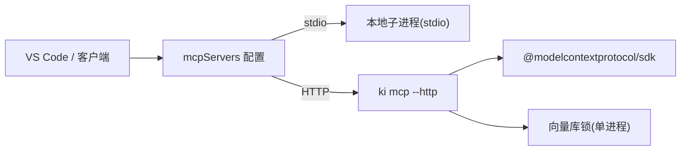

# VS Code集成配置

<cite>
**本文引用的文件**
- [docs/cli.md](file://docs/cli.md)
- [docs/mcp-http.md](file://docs/mcp-http.md)
- [src/lib/mcp-http.ts](file://src/lib/mcp-http.ts)
- [src/lib/mcp-stdio-lock.ts](file://src/lib/mcp-stdio-lock.ts)
- [test_data/bk-monitor-wiki/configs/mcps/mcp.json](file://test_data/bk-monitor-wiki/configs/mcps/mcp.json)
- [test_data/bk-monitor-wiki/configs/mcps/opencode.json](file://test_data/bk-monitor-wiki/configs/mcps/opencode.json)
</cite>

## 目录
1. [简介](#简介)
2. [项目结构](#项目结构)
3. [核心组件](#核心组件)
4. [架构总览](#架构总览)
5. [详细组件分析](#详细组件分析)
6. [依赖关系分析](#依赖关系分析)
7. [性能与并发特性](#性能与并发特性)
8. [故障排查指南](#故障排查指南)
9. [结论](#结论)
10. [附录：配置示例清单](#附录配置示例清单)

## 简介
本指南面向在 VS Code（或兼容 MCP 的 IDE）中集成 ki 的 MCP 客户端，提供两种连接方式的完整步骤与注意事项：
- stdio 模式：通过命令启动本地子进程进行 JSON-RPC 通信。
- HTTP 模式：通过 Streamable HTTP 共享单例服务，避免多 IDE 锁冲突并支持远程跨机访问。

文档涵盖 settings.json 中的 mcpServers 配置项、command/args/url/headers/env 等参数说明，多个服务器实例的配置方法、端口冲突处理，以及常见错误（连接超时、鉴权失败、越权拒绝等）的排查方案。

## 项目结构
与 MCP 客户端集成相关的实现与文档主要分布在以下位置：
- 文档：docs/cli.md、docs/mcp-http.md
- 服务端实现：src/lib/mcp-http.ts（HTTP 传输、鉴权、会话管理、健康检查）、src/lib/mcp-stdio-lock.ts（stdio 多实例 lock）
- 配置示例：test_data/bk-monitor-wiki/configs/mcps/mcp.json、opencode.json

图表来源
- [docs/cli.md:996-1024](file://docs/cli.md#L996-L1024)
- [docs/mcp-http.md:1-40](file://docs/mcp-http.md#L1-L40)
- [src/lib/mcp-http.ts:1-15](file://src/lib/mcp-http.ts#L1-L15)

章节来源
- [docs/cli.md:996-1024](file://docs/cli.md#L996-L1024)
- [docs/mcp-http.md:1-40](file://docs/mcp-http.md#L1-L40)

## 核心组件
- stdio 模式
  - 通过 command 与 args 启动本地进程，使用 stdio 通道进行 JSON-RPC 通信。
  - 适合本机开发、无需网络暴露的场景。
- HTTP 模式
  - 通过 url 指向 Streamable HTTP 端点（默认路径 /mcp），可选 headers 携带 Authorization 等头。
  - 支持回环地址免鉴权与非回环地址强制 Token 鉴权；具备幂等单例、会话上限、空闲回收、健康检查等能力。

章节来源
- [docs/cli.md:996-1024](file://docs/cli.md#L996-L1024)
- [docs/mcp-http.md:11-40](file://docs/mcp-http.md#L11-L40)
- [src/lib/mcp-http.ts:1-15](file://src/lib/mcp-http.ts#L1-L15)

## 架构总览
下图展示 VS Code 作为 MCP 客户端，分别以 stdio 和 HTTP 两种方式接入 ki 的 MCP 服务，以及 HTTP 模式的鉴权与会话管理机制。

图表来源
- [docs/cli.md:996-1024](file://docs/cli.md#L996-L1024)
- [docs/mcp-http.md:132-146](file://docs/mcp-http.md#L132-L146)
- [src/lib/mcp-http.ts:454-487](file://src/lib/mcp-http.ts#L454-L487)

## 详细组件分析

### stdio 模式配置与使用
- 适用场景：本机开发、无需网络暴露、快速验证。
- 关键配置项：
  - command：可执行命令（如 ki）。
  - args：传递给命令的参数数组（如 ["mcp"]）。
  - env（可选）：环境变量键值对，用于注入 API Key 等敏感信息。
- 多实例行为：
  - 多个 stdio 实例不再互斥，但会共享向量库锁并通过“撞锁重试”错开使用；若存在健康的 HTTP 单例，stdio 启动会被拒绝并提示迁移到 URL 型接入。
- 典型配置参考：
  - 见附录中的 stdio 示例（包含 command、args、env）。

章节来源
- [docs/cli.md:996-1024](file://docs/cli.md#L996-L1024)
- [docs/mcp-http.md:158-169](file://docs/mcp-http.md#L158-L169)
- [src/lib/mcp-stdio-lock.ts:1-14](file://src/lib/mcp-stdio-lock.ts#L1-L14)

### HTTP 模式配置与使用
- 适用场景：多 IDE 共享、远程跨机访问、避免锁冲突。
- 关键配置项：
  - url：MCP 端点 URL（例如 http://host:port/mcp）。
  - headers：请求头，通常包含 Authorization: Bearer <token>（回环地址可省略）。
- 鉴权策略：
  - 回环地址（127.0.0.1/localhost/::1）：免鉴权。
  - 非回环地址（0.0.0.0/外网 IP）：强制 Bearer Token，未提供则拒绝。
- 会话与资源保护：
  - 会话上限默认 256，空闲 30 分钟自动回收。
  - 健康检查 /healthz 可用于探活与诊断。
- 典型配置参考：
  - 见附录中的 HTTP 示例（包含 url、headers）。

章节来源
- [docs/cli.md:996-1024](file://docs/cli.md#L996-L1024)
- [docs/mcp-http.md:132-146](file://docs/mcp-http.md#L132-L146)
- [src/lib/mcp-http.ts:454-487](file://src/lib/mcp-http.ts#L454-L487)

### 多服务器实例配置
- 可在同一份 mcpServers 中定义多个条目，每个条目一个 key（名称），对应不同的 command/args/url 与 env/headers。
- 建议：
  - 将不同用途的服务（如 gitnexus、memory、ki、iWiki 官方MCP）分别配置为独立条目。
  - 敏感信息优先使用 env（stdio）或 headers（HTTP）注入，避免明文写入配置文件。
- 参考示例：
  - 见附录中的多服务器示例（同时包含 stdio 与 HTTP 条目）。

章节来源
- [test_data/bk-monitor-wiki/configs/mcps/mcp.json:1-29](file://test_data/bk-monitor-wiki/configs/mcps/mcp.json#L1-L29)
- [test_data/bk-monitor-wiki/configs/mcps/opencode.json:1-31](file://test_data/bk-monitor-wiki/configs/mcps/opencode.json#L1-L31)

### 端口冲突与单例守护
- 默认监听端口：7423（可通过 --port 调整）。
- 幂等单例：
  - 启动时先探活 /healthz，命中健康实例则复用退出，避免重复启动。
  - 写 lock 文件记录 pid/host/port/startAt，便于排查。
- 端口占用处理：
  - 若端口被占用且未探测到健康实例，会给出明确提示（EADDRINUSE），建议更换端口或排查占用进程。
- 一键关闭：
  - 使用 stop 命令关闭所有 ki mcp 实例并清理残留 lock。

章节来源
- [docs/mcp-http.md:147-157](file://docs/mcp-http.md#L147-L157)
- [src/lib/mcp-http.ts:676-732](file://src/lib/mcp-http.ts#L676-L732)
- [docs/mcp-http.md:170-189](file://docs/mcp-http.md#L170-L189)

### 鉴权与越权校验流程
- 鉴权入口：
  - 非回环绑定必须携带 Authorization: Bearer <token>。
  - Token 来源优先级：命令行 --token/环境变量 > 多 Token 存储。
- 越权校验：
  - 拦截 tools/call 的 arguments.scope，校验是否在授权范围内；越权返回 403。
  - 枚举工具（ki_scope_list、ki_manage_index_list）由工具层按授权集合过滤输出，不在此处做单点 scope 校验。
- 安全建议：
  - 生产环境建议前置 TLS 反向代理，限制 Host 头（allowedHosts）缓解 DNS rebinding。

章节来源
- [docs/mcp-http.md:132-146](file://docs/mcp-http.md#L132-L146)
- [src/lib/mcp-http.ts:454-487](file://src/lib/mcp-http.ts#L454-L487)
- [src/lib/mcp-http.ts:508-526](file://src/lib/mcp-http.ts#L508-L526)

## 依赖关系分析
- 客户端依赖：
  - VS Code 或其他 MCP 客户端通过 mcpServers 配置加载并建立连接。
- 服务端依赖：
  - HTTP 模式依赖 @modelcontextprotocol/sdk 的 StreamableHTTPServerTransport。
  - 向量库锁由单进程持有，避免多进程争用。
- 配置与运行时：
  - CLI 参数优先于配置文件默认值；环境变量用于注入敏感信息。

图表来源
- [src/lib/mcp-http.ts:1-15](file://src/lib/mcp-http.ts#L1-L15)
- [docs/mcp-http.md:1-10](file://docs/mcp-http.md#L1-L10)

章节来源
- [src/lib/mcp-http.ts:1-15](file://src/lib/mcp-http.ts#L1-L15)
- [docs/mcp-http.md:1-10](file://docs/mcp-http.md#L1-L10)

## 性能与并发特性
- 会话上限：默认 256 个并发会话，超出返回 503，防止内存耗尽。
- 空闲回收：默认 30 分钟无活动会话将被回收，减少资源占用。
- 批量调用：tools/call 支持 batch 数组，服务端逐个校验 scope 越权。
- 静态页面（可选）：--web 提供前端 SPA，非 /api /mcp 的 GET 404 回退 index.html。

章节来源
- [docs/mcp-http.md:234-242](file://docs/mcp-http.md#L234-L242)
- [src/lib/mcp-http.ts:531-577](file://src/lib/mcp-http.ts#L531-L577)
- [src/lib/mcp-http.ts:257-298](file://src/lib/mcp-http.ts#L257-L298)

## 故障排查指南
- 连接超时
  - 现象：客户端长时间无响应或报超时。
  - 排查：
    - 确认 URL 正确（host/port/path 一致），回环地址可省略 headers。
    - 使用 /healthz 探活确认服务状态。
    - 检查防火墙/代理是否阻断。
- 鉴权失败（401）
  - 现象：返回 Unauthorized。
  - 排查：
    - 核对 Authorization: Bearer 与 token list 输出完全一致（整段复制，勿手抄）。
    - 非回环绑定必须提供 Token；回环绑定下 Token 会被忽略。
    - 查看服务端 stderr 日志定位失败原因。
- 越权拒绝（403）
  - 现象：返回 Forbidden。
  - 排查：
    - 检查请求的 arguments.scope 是否在 Token 授权范围内。
    - 使用 token update 扩大授权范围或修正客户端 scope。
- 端口冲突（EADDRINUSE）
  - 现象：启动失败，提示端口占用。
  - 排查：
    - 使用 --status 查看是否存在健康实例；若无，排查占用进程。
    - 更换端口（--port）或停止冲突进程。
- 多 IDE 锁冲突
  - 现象：部分 IDE 降级（vectorAvailable=false）。
  - 解决：统一切换到 HTTP 单例模式，所有 IDE 使用相同 URL 接入。

章节来源
- [docs/mcp-http.md:132-146](file://docs/mcp-http.md#L132-L146)
- [docs/mcp-http.md:170-189](file://docs/mcp-http.md#L170-L189)
- [src/lib/mcp-http.ts:610-630](file://src/lib/mcp-http.ts#L610-L630)

## 结论
- 推荐在多 IDE 环境下采用 HTTP 单例模式，避免锁冲突并提供远程访问能力。
- stdio 模式适用于本机快速开发与调试。
- 严格遵循鉴权策略与越权校验，确保安全性。
- 利用 /healthz、stop/restart/status 等运维能力进行排障与监控。

## 附录：配置示例清单
以下为可直接参考的配置片段路径（不包含具体代码内容）：
- stdio 模式示例（command、args、env）
  - [示例路径:1-29](file://test_data/bk-monitor-wiki/configs/mcps/mcp.json#L1-L29)
- HTTP 模式示例（url、headers）
  - [示例路径:21-27](file://test_data/bk-monitor-wiki/configs/mcps/mcp.json#L21-L27)
- 另一种格式（type/local/remote）
  - [示例路径:1-31](file://test_data/bk-monitor-wiki/configs/mcps/opencode.json#L1-L31)
- CLI 文档中的标准配置片段
  - [stdio 模式片段:996-1009](file://docs/cli.md#L996-L1009)
  - [HTTP 模式片段:1011-1024](file://docs/cli.md#L1011-L1024)