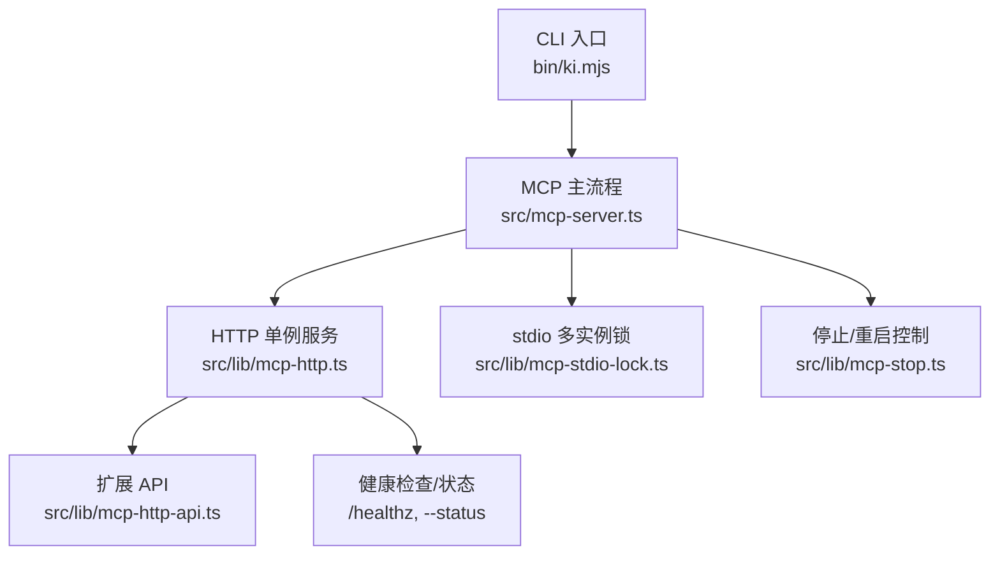
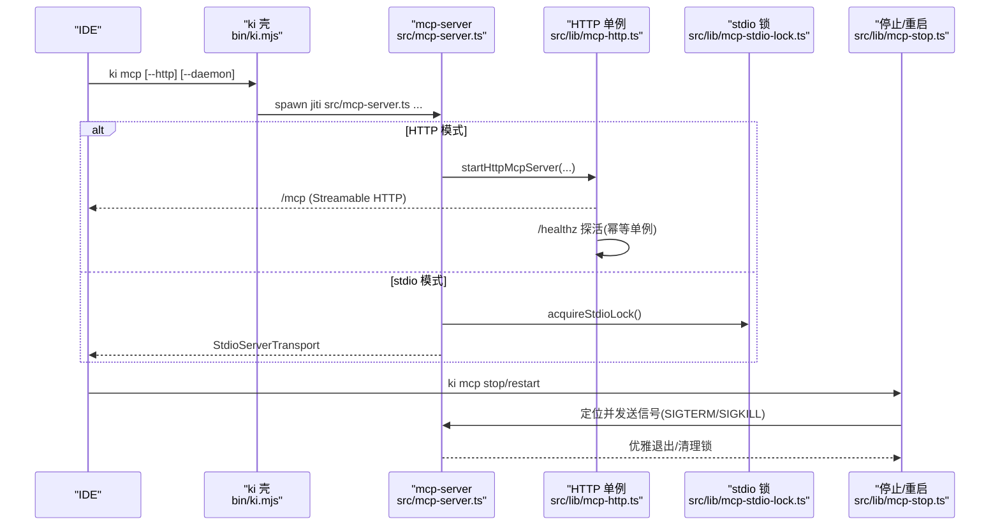
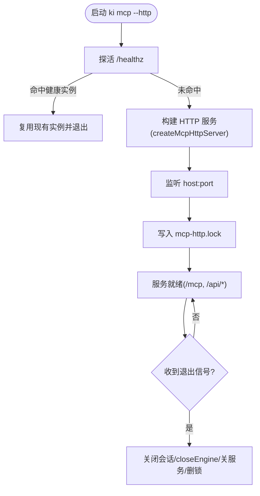
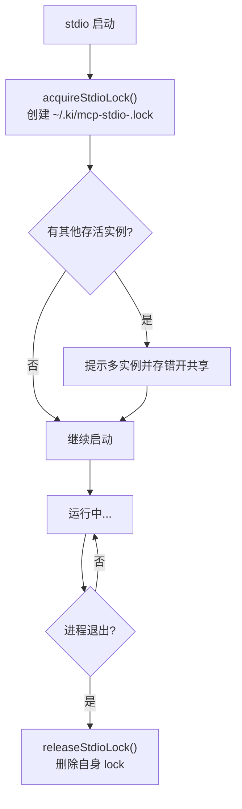
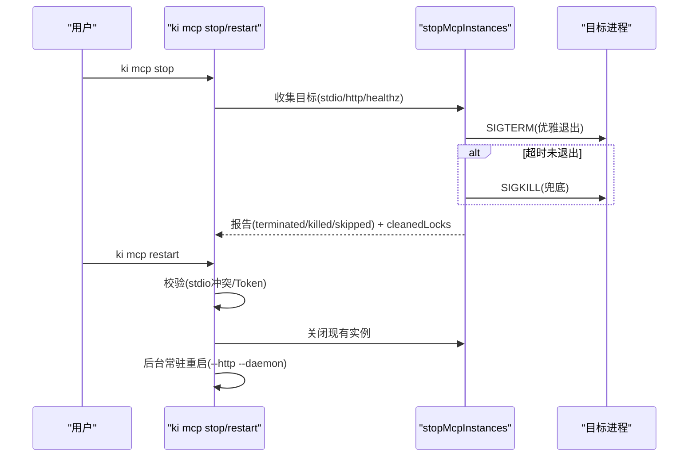
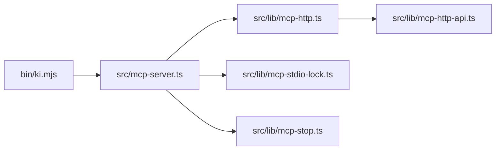

# 多IDE实例管理

<cite>
**本文引用的文件**
- [bin/ki.mjs](file://bin/ki.mjs)
- [src/mcp-server.ts](file://src/mcp-server.ts)
- [src/lib/mcp-http.ts](file://src/lib/mcp-http.ts)
- [src/lib/mcp-stdio-lock.ts](file://src/lib/mcp-stdio-lock.ts)
- [src/lib/mcp-stop.ts](file://src/lib/mcp-stop.ts)
- [src/lib/mcp-http-api.ts](file://src/lib/mcp-http-api.ts)
- [docs/mcp-http.md](file://docs/mcp-http.md)
</cite>

## 目录
1. [简介](#简介)
2. [项目结构](#项目结构)
3. [核心组件](#核心组件)
4. [架构总览](#架构总览)
5. [详细组件分析](#详细组件分析)
6. [依赖关系分析](#依赖关系分析)
7. [性能与资源管理](#性能与资源管理)
8. [故障排查指南](#故障排查指南)
9. [结论](#结论)
10. [附录：常用命令速查](#附录常用命令速查)

## 简介
本指南面向在多 IDE 环境下使用 ki mcp 的用户与运维人员，目标是：
- 避免多个 IDE 同时启动 stdio 实例导致的向量库锁冲突。
- 解释 HTTP 单例模式的优势、适用场景与使用方法（ki mcp --http）。
- 给出端口分配、资源管理与故障恢复的最佳实践。
- 说明如何使用 ki mcp stop 和 restart 管理服务实例。
- 提供监控与诊断方法，帮助识别并解决实例冲突问题。

## 项目结构
围绕“多 IDE 实例管理”的关键代码集中在以下模块：
- CLI 入口：bin/ki.mjs
- MCP 服务主流程：src/mcp-server.ts
- HTTP 单例与鉴权：src/lib/mcp-http.ts
- stdio 多实例锁：src/lib/mcp-stdio-lock.ts
- 停止/重启控制：src/lib/mcp-stop.ts
- /api/* 扩展接口：src/lib/mcp-http-api.ts
- 用户文档：docs/mcp-http.md

图表来源
- [bin/ki.mjs:28-49](file://bin/ki.mjs#L28-L49)
- [src/mcp-server.ts:24-35](file://src/mcp-server.ts#L24-L35)
- [src/lib/mcp-http.ts:17-34](file://src/lib/mcp-http.ts#L17-L34)
- [src/lib/mcp-stdio-lock.ts:16-33](file://src/lib/mcp-stdio-lock.ts#L16-L33)
- [src/lib/mcp-stop.ts:14-18](file://src/lib/mcp-stop.ts#L14-L18)
- [src/lib/mcp-http-api.ts:18-29](file://src/lib/mcp-http-api.ts#L18-L29)

章节来源
- [bin/ki.mjs:28-49](file://bin/ki.mjs#L28-L49)
- [src/mcp-server.ts:24-35](file://src/mcp-server.ts#L24-L35)

## 核心组件
- HTTP 单例服务：以 Streamable HTTP 传输承载 MCP 会话，作为向量库唯一持锁者，所有 IDE 通过 URL 共享同一进程，从根本上消除多进程锁冲突。
- stdio 多实例锁：每个 stdio 实例登记独立 lock 文件（~/.ki/mcp-stdio-<pid>.lock），支持多实例并存、错开共享向量库；异常退出时自动清理陈旧锁。
- 停止/重启控制：统一收集 stdio 与 HTTP 实例目标，先 SIGTERM 优雅退出，超时后 SIGKILL 兜底，并清理残留 lock。
- 状态诊断：--status 输出 JSON，包含运行态、健康信息、锁信息与提示；/healthz 免鉴权探活。
- 扩展 API：/api/* 提供导入、文档列表等能力，与 MCP 会话隔离但复用鉴权策略。

章节来源
- [src/lib/mcp-http.ts:1-15](file://src/lib/mcp-http.ts#L1-L15)
- [src/lib/mcp-stdio-lock.ts:1-14](file://src/lib/mcp-stdio-lock.ts#L1-L14)
- [src/lib/mcp-stop.ts:1-12](file://src/lib/mcp-stop.ts#L1-L12)
- [src/lib/mcp-http.ts:183-230](file://src/lib/mcp-http.ts#L183-L230)
- [src/lib/mcp-http-api.ts:1-16](file://src/lib/mcp-http-api.ts#L1-L16)

## 架构总览
下图展示了多 IDE 环境下的典型交互：IDE 通过 HTTP URL 连接单一 kisearch 进程，该进程持有向量库锁；若使用 stdio，则每个 IDE 拉起独立进程并通过锁文件登记，空闲释放锁 + 撞锁重试实现错开共享。

图表来源
- [bin/ki.mjs:154-198](file://bin/ki.mjs#L154-L198)
- [src/mcp-server.ts:492-734](file://src/mcp-server.ts#L492-L734)
- [src/lib/mcp-http.ts:676-766](file://src/lib/mcp-http.ts#L676-L766)
- [src/lib/mcp-stdio-lock.ts:118-144](file://src/lib/mcp-stdio-lock.ts#L118-L144)
- [src/lib/mcp-stop.ts:94-176](file://src/lib/mcp-stop.ts#L94-L176)

## 详细组件分析

### HTTP 单例模式与鉴权
- 设计要点
  - 单进程持锁：HTTP 服务作为向量库唯一持锁者，所有 IDE 经 URL 共享，避免锁冲突。
  - 幂等启动：先探活 /healthz，命中健康实例则复用退出，不重复启动。
  - 条件鉴权：回环绑定免鉴权；非回环绑定强制 Bearer Token，支持临时全权 Token 或多 Token 存储。
  - 会话模型：每个 initialize 新建 transport + McpServer，共享模块级 engine；会话上限与空闲回收保护内存。
- 关键路径
  - 探活与复用：probeHealthz -> fetchHealthz -> 命中则 exit(0)。
  - 监听与写锁：listen(host,port) -> 写 ~/.ki/mcp-http.lock -> 输出日志。
  - 优雅退出：SIGINT/SIGTERM -> 关闭会话 -> closeEngine -> 关闭 http server -> 删除 lock。

图表来源
- [src/lib/mcp-http.ts:676-766](file://src/lib/mcp-http.ts#L676-L766)
- [src/lib/mcp-http.ts:195-230](file://src/lib/mcp-http.ts#L195-L230)
- [src/lib/mcp-http.ts:344-607](file://src/lib/mcp-http.ts#L344-L607)

章节来源
- [src/lib/mcp-http.ts:1-15](file://src/lib/mcp-http.ts#L1-L15)
- [src/lib/mcp-http.ts:183-230](file://src/lib/mcp-http.ts#L183-L230)
- [src/lib/mcp-http.ts:676-766](file://src/lib/mcp-http.ts#L676-L766)

### stdio 多实例锁与错开共享
- 设计要点
  - 每实例独立 lock 文件：~/.ki/mcp-stdio-<pid>.lock，文件名即 pid，天然支持多实例登记与并发启动互不干扰。
  - 陈旧锁清理：读取时进行 pid 存活校验，已死进程自动清理 lock。
  - 错开共享：常驻实例启用空闲释放锁（enableIdleClose），CLI/stdio 撞锁时 probeWithRetry 等待并重试。
- 关键路径
  - 登记：acquireStdioLock -> 创建自身 lock 文件 -> 返回其他存活实例列表（仅提示，不再拒绝）。
  - 释放：releaseStdioLock -> 删除自身 lock 文件。
  - 探测：listLiveStdioLocks -> 排除自身 + 清理陈旧 -> 供 stop/status/restart 使用。

图表来源
- [src/lib/mcp-stdio-lock.ts:118-144](file://src/lib/mcp-stdio-lock.ts#L118-L144)
- [src/lib/mcp-stdio-lock.ts:104-111](file://src/lib/mcp-stdio-lock.ts#L104-L111)
- [src/lib/mcp-stdio-lock.ts:78-98](file://src/lib/mcp-stdio-lock.ts#L78-L98)

章节来源
- [src/lib/mcp-stdio-lock.ts:1-14](file://src/lib/mcp-stdio-lock.ts#L1-L14)
- [src/lib/mcp-stdio-lock.ts:118-144](file://src/lib/mcp-stdio-lock.ts#L118-L144)

### 停止与重启（stop/restart）
- 停止（ki mcp stop）
  - 定位：遍历 stdio lock 目录 + 读 http lock + healthz 兜底。
  - 安全：杀前读 /proc/<pid>/cmdline 校验目标为 ki mcp 进程，防止 pid 复用误杀。
  - 关闭：SIGTERM 优雅退出，超时 SIGKILL 兜底；最后清理残留 lock。
- 重启（ki mcp restart）
  - 仅 HTTP 模式：先检测并阻止与 stdio 并存（fail-loud + 指引迁移 URL），再执行 stop + 后台常驻重启。
  - 配置保留：host/port 解析优先级 CLI > lock > 配置 > 默认；--web 自动延续（可被 --no-web 覆盖）。

图表来源
- [src/lib/mcp-stop.ts:94-176](file://src/lib/mcp-stop.ts#L94-L176)
- [src/mcp-server.ts:410-490](file://src/mcp-server.ts#L410-L490)

章节来源
- [src/lib/mcp-stop.ts:94-176](file://src/lib/mcp-stop.ts#L94-L176)
- [src/mcp-server.ts:410-490](file://src/mcp-server.ts#L410-L490)

### 扩展 API（/api/*）与前端页面
- /api/* 路由：健康报告、文档列表、导入上传/运行/状态查询等，与 MCP 会话隔离但复用鉴权策略。
- 前端页面：--web 提供静态页面（web/dist），SPA fallback，路径穿越防护。
- 鉴权：非回环绑定强制 Bearer Token；/api/* 对带 scope 的只读接口做越权校验。

章节来源
- [src/lib/mcp-http-api.ts:1-16](file://src/lib/mcp-http-api.ts#L1-L16)
- [src/lib/mcp-http-api.ts:216-272](file://src/lib/mcp-http-api.ts#L216-L272)
- [src/lib/mcp-http.ts:237-298](file://src/lib/mcp-http.ts#L237-L298)

## 依赖关系分析
- CLI 层（bin/ki.mjs）负责命令分发与守护进程化（detached spawn），将参数透传到 mcp-server。
- mcp-server 负责参数解析、启动守卫、预检、HTTP/stdio 模式分流、版本守卫与空闲释放锁。
- mcp-http 提供 HTTP 服务、鉴权、会话管理、/healthz、/api/* 路由与优雅退出。
- mcp-stdio-lock 提供多实例 lock 登记、存活探测与陈旧锁清理。
- mcp-stop 提供统一的停止/重启控制，结合 lock 与 healthz 定位真实服务进程。

图表来源
- [bin/ki.mjs:28-49](file://bin/ki.mjs#L28-L49)
- [src/mcp-server.ts:24-35](file://src/mcp-server.ts#L24-L35)
- [src/lib/mcp-http.ts:17-34](file://src/lib/mcp-http.ts#L17-L34)
- [src/lib/mcp-stdio-lock.ts:16-33](file://src/lib/mcp-stdio-lock.ts#L16-L33)
- [src/lib/mcp-stop.ts:14-18](file://src/lib/mcp-stop.ts#L14-L18)
- [src/lib/mcp-http-api.ts:18-29](file://src/lib/mcp-http-api.ts#L18-L29)

章节来源
- [bin/ki.mjs:28-49](file://bin/ki.mjs#L28-L49)
- [src/mcp-server.ts:24-35](file://src/mcp-server.ts#L24-L35)

## 性能与资源管理
- 会话上限与空闲回收：默认最大并发会话数 256，空闲超时 30 分钟回收，防止内存泄漏。
- 向量库锁空闲释放：常驻实例启用空闲释放锁（VECTOR_IDLE_CLOSE_MS），降低多实例争用时的等待时间。
- 请求体大小限制：/mcp 与 /api/* 均限制请求体大小（如 16MB），防止滥用。
- DNS rebinding 保护：可选 allowedHosts 白名单，缓解远程暴露风险。
- 优雅退出：SIGINT/SIGTERM 触发关闭会话、closeEngine、关闭服务、删除 lock，有 5 秒兜底超时。

章节来源
- [src/lib/mcp-http.ts:46-56](file://src/lib/mcp-http.ts#L46-L56)
- [src/lib/mcp-http.ts:147-173](file://src/lib/mcp-http.ts#L147-L173)
- [src/lib/mcp-http.ts:734-766](file://src/lib/mcp-http.ts#L734-L766)
- [src/mcp-server.ts:36-38](file://src/mcp-server.ts#L36-L38)

## 故障排查指南
- 常见问题
  - 端口占用：EADDRINUSE 且探活失败 → 更换端口或排查占用进程。
  - 权限不足：EACCES（<1024 端口）→ 改用高位端口。
  - 地址不可用：EADDRNOTAVAIL → 本机无该地址；对外监听用 0.0.0.0。
  - 主机无法解析：ENOTFOUND → 检查 --host。
  - 鉴权失败（401）：Token 无效或缺失 → 核对 Authorization: Bearer 与 token list。
  - 越权拒绝（403）：scope 不在授权内 → 更新 Token scope 或确认请求 scope。
- 诊断工具
  - ki mcp --status：输出 JSON，包含 running、healthz、lock、stdioInstances、managedTokens.count 与 hint。
  - curl /healthz：快速验证服务健康与 PID。
  - 查看锁文件：~/.ki/mcp-http.lock 与 ls ~/.ki/mcp-stdio-*.lock。
- 处理步骤
  - 一键关闭：ki mcp stop（SIGTERM → SIGKILL → 清理 lock）。
  - 重启服务：ki mcp restart（仅 HTTP，后台常驻，配置保留）。
  - 迁移到 HTTP：将所有 IDE 配置改为 URL 型接入，移除 stdio command 配置。

章节来源
- [src/lib/mcp-http.ts:609-630](file://src/lib/mcp-http.ts#L609-L630)
- [src/lib/mcp-http.ts:632-670](file://src/lib/mcp-http.ts#L632-L670)
- [src/lib/mcp-stop.ts:94-176](file://src/lib/mcp-stop.ts#L94-L176)
- [docs/mcp-http.md:105-131](file://docs/mcp-http.md#L105-L131)

## 结论
- 在多 IDE 环境中，优先采用 HTTP 单例模式（ki mcp --http）以避免向量库锁冲突。
- stdio 模式允许多实例并存，但需理解“错开共享”机制与潜在短暂等待。
- 使用 ki mcp stop/restart 统一管理实例生命周期，配合 --status 与 /healthz 进行监控与诊断。
- 遵循鉴权策略与最佳实践（回环免鉴权、非回环强制 Token、allowedHosts 白名单），确保安全性与稳定性。

## 附录：常用命令速查
- 启动 HTTP 单例（本机免鉴权）：ki mcp --http
- 后台常驻：ki mcp --http --daemon
- 查看状态：ki mcp --status
- 关闭所有实例：ki mcp stop
- 重启 HTTP 单例：ki mcp restart
- 生成/管理 Token：ki mcp token generate/list/update/delete

章节来源
- [docs/mcp-http.md:11-67](file://docs/mcp-http.md#L11-L67)
- [docs/cli.md:907-958](file://docs/cli.md#L907-L958)