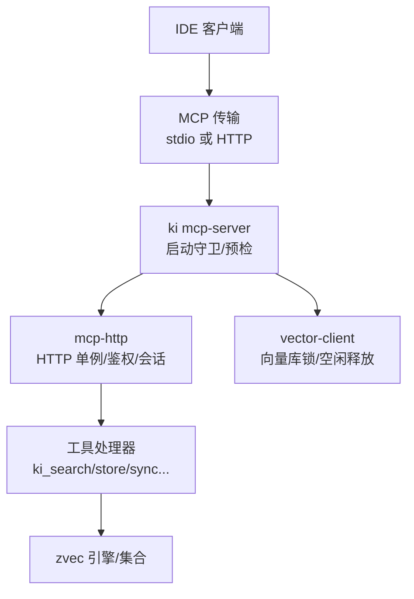
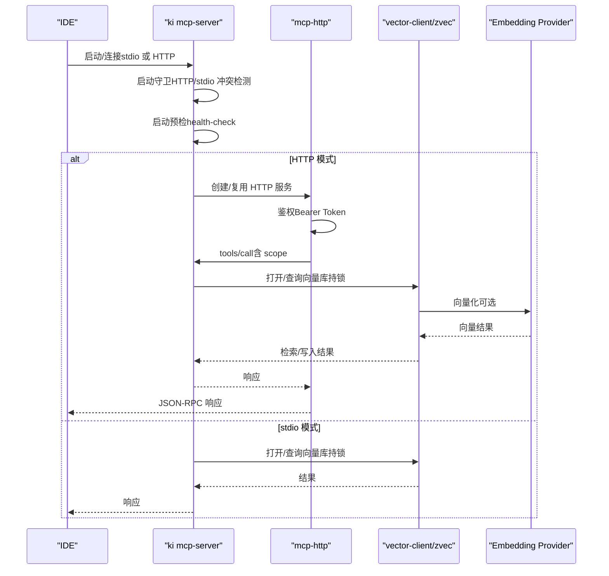
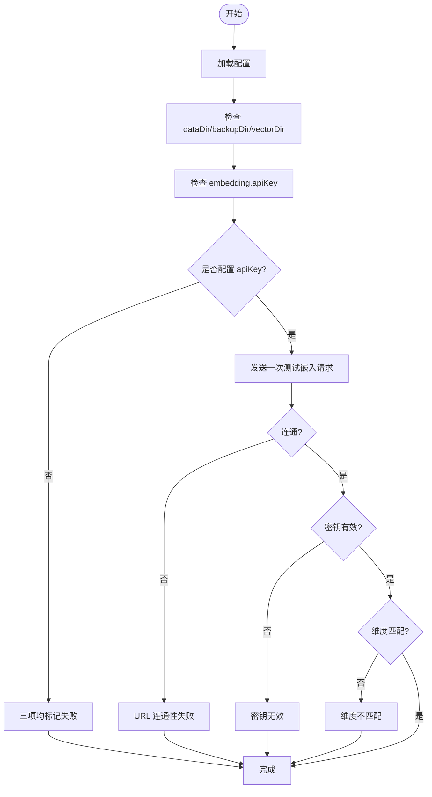
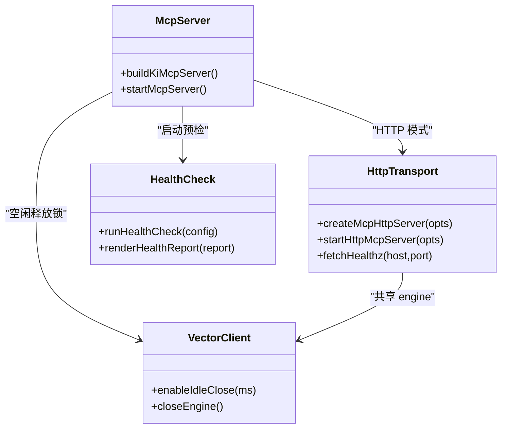
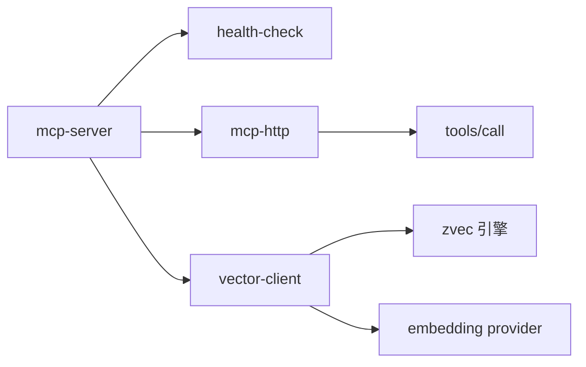

# 常见问题排查

<cite>
**本文引用的文件**
- [src/doctor.ts](file://src/doctor.ts)
- [src/lib/health-check.ts](file://src/lib/health-check.ts)
- [src/config.ts](file://src/config.ts)
- [src/mcp-server.ts](file://src/mcp-server.ts)
- [src/lib/mcp-http.ts](file://src/lib/mcp-http.ts)
- [docs/error-handling.md](file://docs/error-handling.md)
- [docs/mcp-http.md](file://docs/mcp-http.md)
</cite>

## 目录
1. [简介](#简介)
2. [项目结构](#项目结构)
3. [核心组件](#核心组件)
4. [架构总览](#架构总览)
5. [详细组件分析](#详细组件分析)
6. [依赖关系分析](#依赖关系分析)
7. [性能注意事项](#性能注意事项)
8. [故障排查指南](#故障排查指南)
9. [结论](#结论)
10. [附录](#附录)

## 简介
本指南面向 IDE 集成 kisearch（ki）时最常见的连接失败、认证错误、端口冲突、向量库锁冲突等问题，提供系统化的诊断步骤与解决方案。重点说明如何使用 ki doctor 进行健康检查并解读结果，如何查看与分析日志以定位问题根源，以及性能问题的排查与优化建议，并给出与其他工具（如 zvec-studio、zvec-mcp-server）的兼容性处理要点。

## 项目结构
围绕 IDE 集成的关键路径包括：
- 配置与预检：ki doctor 命令与健康检查逻辑
- MCP 服务：stdio 模式与 HTTP 共享单例模式
- 鉴权与会话：Bearer Token、scope 越权校验、会话空闲回收
- 向量库锁：多进程持锁冲突与空闲释放机制
- 日志与可观测性：stderr 输出、/healthz、status 报告

图表来源
- [src/mcp-server.ts:492-734](file://src/mcp-server.ts#L492-L734)
- [src/lib/mcp-http.ts:344-607](file://src/lib/mcp-http.ts#L344-L607)
- [src/lib/health-check.ts:148-213](file://src/lib/health-check.ts#L148-L213)

章节来源
- [src/mcp-server.ts:492-734](file://src/mcp-server.ts#L492-L734)
- [src/lib/mcp-http.ts:344-607](file://src/lib/mcp-http.ts#L344-L607)
- [src/lib/health-check.ts:148-213](file://src/lib/health-check.ts#L148-L213)

## 核心组件
- ki doctor：只读健康检查，覆盖配置文件、目录权限、embedding 连通性/密钥/维度、zvec collection、scopes.default 等，返回 pass/warn/fail 报告，失败退出码为 1。
- ki mcp-server：统一入口，负责参数解析、启动守卫（HTTP/stdio 冲突检测）、启动预检（复用 health-check）、启动 stdio 或 HTTP 服务、版本守护与优雅关闭。
- mcp-http：HTTP 传输、鉴权（回环免鉴权、非回环强制 Bearer）、scope 越权拦截、会话管理（上限与空闲回收）、/healthz、静态页面与 /api/* 扩展路由。
- 配置与模板：config init 生成 YAML 模板，包含 dataDir/backupDir/vectorDir/embedding/scopes 等字段；运行时通过 loadConfig 读取。

章节来源
- [src/doctor.ts:1-55](file://src/doctor.ts#L1-L55)
- [src/lib/health-check.ts:1-234](file://src/lib/health-check.ts#L1-L234)
- [src/mcp-server.ts:492-734](file://src/mcp-server.ts#L492-L734)
- [src/lib/mcp-http.ts:344-607](file://src/lib/mcp-http.ts#L344-L607)
- [src/config.ts:1-204](file://src/config.ts#L1-L204)

## 架构总览
ki 在 IDE 集成中的典型调用链如下：

图表来源
- [src/mcp-server.ts:492-734](file://src/mcp-server.ts#L492-L734)
- [src/lib/mcp-http.ts:344-607](file://src/lib/mcp-http.ts#L344-L607)
- [src/lib/health-check.ts:148-213](file://src/lib/health-check.ts#L148-L213)

## 详细组件分析

### 健康检查与 ki doctor
- 功能：检查配置文件存在且可解析、dataDir/backupDir/vectorDir 存在且可写、embedding.apiKey 是否配置、embedding 连通性/密钥有效性/维度匹配、zvec collection 是否存在、scopes.default 是否配置。
- 行为：所有检查项输出 pass/warn/fail；有 fail 项时退出码为 1；embedding 检查使用一次最短请求验证 URL 可达、密钥有效、维度匹配，超时与重试已内置。
- 使用：独立运行 `ki doctor` 或在 `ki mcp` 启动前作为预检。

图表来源
- [src/lib/health-check.ts:52-142](file://src/lib/health-check.ts#L52-L142)
- [src/lib/health-check.ts:148-213](file://src/lib/health-check.ts#L148-L213)

章节来源
- [src/doctor.ts:1-55](file://src/doctor.ts#L1-L55)
- [src/lib/health-check.ts:1-234](file://src/lib/health-check.ts#L1-L234)

### MCP 服务器与 HTTP 单例
- 启动守卫：
  - HTTP 模式：若已有健康实例则复用退出；若检测到存活的 stdio 实例则拒绝启动，避免争抢向量库锁。
  - stdio 模式：若已有健康 HTTP 单例则拒绝启动，引导迁移到 URL 接入；允许多 stdio 实例并存但会提示其他实例存在（错开共享）。
- 启动预检：复用 health-check，fail 则拒绝启动，warn 继续启动。
- HTTP 服务：
  - 鉴权：回环地址免鉴权；非回环强制 Bearer Token，未提供则拒绝启动。
  - 越权拦截：对 tools/call 的 arguments.scope 做 RBAC 校验，越权返回 403。
  - 会话模型：每个 initialize 新建 transport + McpServer，共享模块级 engine；会话上限默认 256，空闲 30 分钟回收。
  - /healthz：返回 ok/name/pid/version/host/port/authFailures。
  - 静态页面与 /api/*：支持 --web 提供前端与导入/文档列表等扩展接口。

图表来源
- [src/mcp-server.ts:492-734](file://src/mcp-server.ts#L492-L734)
- [src/lib/mcp-http.ts:344-607](file://src/lib/mcp-http.ts#L344-L607)
- [src/lib/health-check.ts:148-213](file://src/lib/health-check.ts#L148-L213)

章节来源
- [src/mcp-server.ts:492-734](file://src/mcp-server.ts#L492-L734)
- [src/lib/mcp-http.ts:344-607](file://src/lib/mcp-http.ts#L344-L607)

### 配置与初始化
- config init：生成 YAML 模板到 .ki/config.yaml，包含 dataDir/backupDir/vectorDir/embedding/scopes 等字段；同时尝试创建默认目录。
- 运行时：loadConfig 读取配置，用于 health-check 与 mcp-server 启动。

章节来源
- [src/config.ts:1-204](file://src/config.ts#L1-L204)

## 依赖关系分析
- 启动链路：mcp-server → health-check → vector-client → zvec 引擎
- HTTP 链路：mcp-http → 鉴权/越权 → tools/call → vector-client → zvec
- 锁与并发：vector-client 维护模块级单例 engine，空闲自动释放锁；stdio/HTTP 共存时通过守卫避免争抢
- 外部依赖：embedding 提供商（SiliconFlow/OpenAI 兼容），网络超时与重试由 health-check 内置

图表来源
- [src/mcp-server.ts:492-734](file://src/mcp-server.ts#L492-L734)
- [src/lib/mcp-http.ts:344-607](file://src/lib/mcp-http.ts#L344-L607)
- [src/lib/health-check.ts:52-142](file://src/lib/health-check.ts#L52-L142)

章节来源
- [src/mcp-server.ts:492-734](file://src/mcp-server.ts#L492-L734)
- [src/lib/mcp-http.ts:344-607](file://src/lib/mcp-http.ts#L344-L607)
- [src/lib/health-check.ts:52-142](file://src/lib/health-check.ts#L52-L142)

## 性能注意事项
- 向量库锁空闲释放：常驻 MCP 空闲超时后自动 closeEngine 释放 LOCK，使 CLI/stdio 能错开共享同一向量库，撞锁时自动重试等待。
- 会话上限与回收：默认最大 256 会话，空闲 30 分钟回收，防止内存泄漏。
- embedding 请求：health-check 使用短文本一次请求，超时 8s、重试 1 次，避免冷启动抖动导致误判。
- 批量操作：bulk_store 部分失败不会阻塞整体流程，失败项记录在 results 中。

章节来源
- [src/mcp-server.ts:680-686](file://src/mcp-server.ts#L680-L686)
- [src/lib/mcp-http.ts:344-392](file://src/lib/mcp-http.ts#L344-L392)
- [src/lib/health-check.ts:8-13](file://src/lib/health-check.ts#L8-L13)

## 故障排查指南

### 一、连接失败
常见现象
- IDE 无法连接到 ki mcp（stdio 或 HTTP）
- 启动时报“未知参数”或帮助信息被打印

诊断步骤
1. 确认模式与参数
   - stdio 模式：默认 `ki mcp`；不要混用 `--daemon`（仅 HTTP 模式）
   - HTTP 模式：`ki mcp --http [--host <addr>] [--port <port>]`
2. 探活与状态
   - 使用 `ki mcp --status` 查看当前实例全貌（running/healthz/lock/stdioInstances）
   - 直接访问 `/healthz`：`curl http://<host>:<port>/healthz`
3. 端口与地址
   - 监听失败错误会被翻译为可读提示（EADDRINUSE/EACCES/EADDRNOTAVAIL/ENOTFOUND）
   - 回环绑定（127.0.0.1/localhost）免鉴权；非回环需 Token

解决方案
- 端口冲突：更换端口（`--port`）或排查占用进程；若探活命中健康实例则复用退出
- 地址不可达：本机访问用 127.0.0.1，对外监听用 0.0.0.0；确保 Host 头在白名单（如启用 allowedHosts）
- 非法参数：参考帮助信息修正参数；注意 `-h/--help` 会直接退出且不进入预检

章节来源
- [src/mcp-server.ts:84-107](file://src/mcp-server.ts#L84-L107)
- [src/mcp-server.ts:492-558](file://src/mcp-server.ts#L492-L558)
- [src/lib/mcp-http.ts:609-630](file://src/lib/mcp-http.ts#L609-L630)
- [docs/mcp-http.md:105-131](file://docs/mcp-http.md#L105-L131)

### 二、认证错误（401/403）
常见现象
- 远程访问返回 401 Unauthorized
- 工具调用返回 403 Forbidden（无权访问该 scope）

诊断步骤
1. 鉴权开关
   - 回环绑定免鉴权；非回环必须提供 Bearer Token
   - 可通过环境变量 KI_MCP_TOKEN 或 `--token` 传入临时全权 Token；或使用 `ki mcp token generate` 托管 Token
2. 检查 Token 与授权
   - 核对客户端 Authorization: Bearer 与 `ki mcp token list` 输出的明文完全一致（整段复制，勿手抄）
   - 越权拦截会记录 stderr 日志，包含来源 IP、被拒 scope 与授权范围
3. 观察健康端点
   - `/healthz` 返回 authFailures 计数，便于判断是否频繁鉴权失败

解决方案
- 401：补全 Authorization 头；确认 Token 有效且来源正确（临时 Token > 多 Token 存储）
- 403：扩大 Token 授权 scope（`ki mcp token update <id> --scope <scope>`）或修正请求中的 scope 参数
- 枚举工具（无 scope 参数）不受此校验限制，出现 403 说明请求的是带 scope 参数的工具或 /api 接口

章节来源
- [src/lib/mcp-http.ts:454-526](file://src/lib/mcp-http.ts#L454-L526)
- [src/mcp-server.ts:174-211](file://src/mcp-server.ts#L174-L211)
- [docs/mcp-http.md:132-146](file://docs/mcp-http.md#L132-L146)

### 三、端口冲突
常见现象
- 启动报端口占用（EADDRINUSE）
- 探活失败但端口被占用

诊断步骤
1. 探活：`curl http://<host>:<port>/healthz` 确认是否为健康 kisearch 实例
2. 若探活失败：可能是非 ki 进程占用，需更换端口或结束占用进程
3. 若探活成功：复用现有实例，无需重复启动

解决方案
- 更换端口：`--port <新端口>`
- 清理残留：`ki mcp stop` 一键关闭所有实例并清理 lock
- 重启：`ki mcp restart`（仅 HTTP 模式）

章节来源
- [src/lib/mcp-http.ts:609-630](file://src/lib/mcp-http.ts#L609-L630)
- [docs/mcp-http.md:147-157](file://docs/mcp-http.md#L147-L157)

### 四、向量库锁冲突
常见现象
- 多个 IDE 各自拉起 stdio 进程，只有一个能拿到锁，其余降级
- 启动守卫提示 stdio 与 HTTP 单例冲突

诊断步骤
1. 使用 `ki mcp --status` 查看 stdioInstances 与 HTTP lock
2. 确认是否混用 stdio 与 HTTP 单例（二者并存会争抢向量库锁）
3. 检查是否有残留陈旧 lock（pid 已死）

解决方案
- 推荐方案：统一使用 HTTP 单例模式（`ki mcp --http`），所有 IDE 通过 URL 接入
- 多 stdio 实例：允许并存但会错开共享（空闲自动释放锁，撞锁时短暂等待）
- 清理：`ki mcp stop` 关闭所有实例并清理 lock

章节来源
- [docs/mcp-http.md:3-10](file://docs/mcp-http.md#L3-L10)
- [src/mcp-server.ts:600-658](file://src/mcp-server.ts#L600-L658)
- [docs/mcp-http.md:158-169](file://docs/mcp-http.md#L158-L169)

### 五、embedding 配置与连通性问题
常见现象
- health-check 报告 URL 连通性失败、密钥无效、维度不匹配
- 向量写入失败或跳过

诊断步骤
1. 运行 `ki doctor`，关注 embedding 三项（URL 连通性/密钥有效性/维度匹配）
2. 检查配置中的 baseURL/model/dimension/apiKey
3. 若密钥缺失：health-check 会跳过检查并标记失败

解决方案
- 补齐 embedding.apiKey（明文或 ${VAR_NAME} 引用）
- 校正 baseURL/model/dimension，确保与提供商实际返回维度一致
- 网络问题：检查 DNS/代理/防火墙；health-check 已内置超时与重试

章节来源
- [src/lib/health-check.ts:52-142](file://src/lib/health-check.ts#L52-L142)
- [src/config.ts:70-118](file://src/config.ts#L70-L118)

### 六、日志查看与分析
- 标准输出：ki doctor 与 mcp-server 启动预检报告输出到 stdout/stderr
- 鉴权失败：服务端 stderr 限流输出失败原因（来源 IP、原因、次数）
- 健康端点：/healthz 返回 ok/name/pid/version/host/port/authFailures
- 状态报告：`ki mcp --status` 输出 JSON，包含 running/healthz/lock/stdioInstances/managedTokens.count/hint

启用与定位
- 启动预检失败：查看 stderr 中的 health-check 报告
- 鉴权失败：查看服务端 stderr 日志与 /healthz.authFailures
- 实例全貌：`ki mcp --status` 结合 lock 文件与探活结果

章节来源
- [src/lib/mcp-http.ts:358-372](file://src/lib/mcp-http.ts#L358-L372)
- [src/lib/mcp-http.ts:183-223](file://src/lib/mcp-http.ts#L183-L223)
- [src/lib/mcp-http.ts:632-670](file://src/lib/mcp-http.ts#L632-L670)

### 七、与其他工具的兼容性
- zvec-studio：独立工具，前端不集成跳转入口；如需可视化请手动启动
- zvec-mcp-server：独立 Python 服务；kisearch 通过 HTTP/stdio 与自身 MCP 交互，避免与外部 zvec 服务混淆
- 向量库锁：任何直接 open ZvecEngine 的命令（如 import-kb/restore）需确保 MCP Server 未运行，否则锁冲突

章节来源
- [docs/mcp-http.md:72-104](file://docs/mcp-http.md#L72-L104)
- [.requirements/2026-07-17-KiSearch-zvec-node-mcp/design/REF_S03_VectorAdapter_DESIGN.md:229-242](file://.requirements/2026-07-17-KiSearch-zvec-node-mcp/design/REF_S03_VectorAdapter_DESIGN.md#L229-L242)

## 结论
通过 ki doctor 的健康检查、ki mcp 的启动守卫与预检、HTTP 单例模式的锁隔离、以及完善的鉴权与会话管理，kisearch 能有效解决 IDE 集成中的连接、认证、端口与锁冲突等常见问题。配合 /healthz、ki mcp --status 与 stderr 日志，可快速定位问题根因并采取相应修复措施。对于性能与稳定性，建议优先采用 HTTP 单例模式，合理设置会话上限与空闲回收，并确保 embedding 配置正确。

## 附录
- 常用命令
  - 健康检查：`ki doctor`
  - 启动 HTTP 单例：`ki mcp --http [--host <addr>] [--port <port>]`
  - 后台常驻：`ki mcp --http --daemon`
  - 状态自查：`ki mcp --status`
  - 一键关闭：`ki mcp stop`
  - 重启：`ki mcp restart`
  - Token 管理：`ki mcp token generate/list/update/delete`
- 参考文档
  - 错误处理汇总：[docs/error-handling.md](file://docs/error-handling.md)
  - MCP HTTP 共享单例模式：[docs/mcp-http.md](file://docs/mcp-http.md)