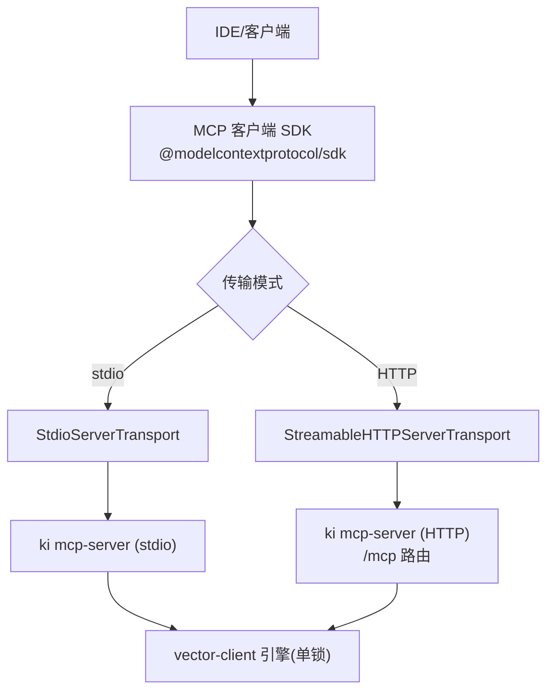
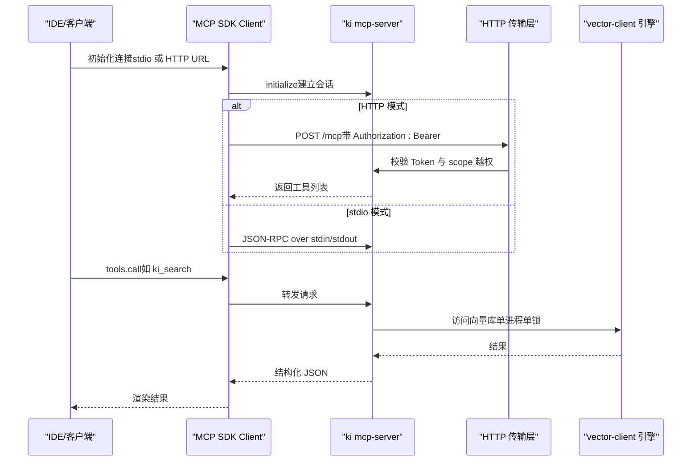
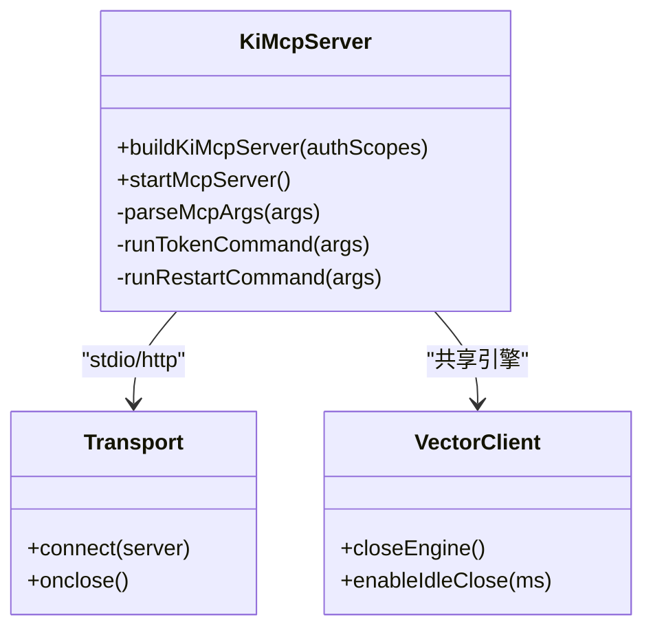
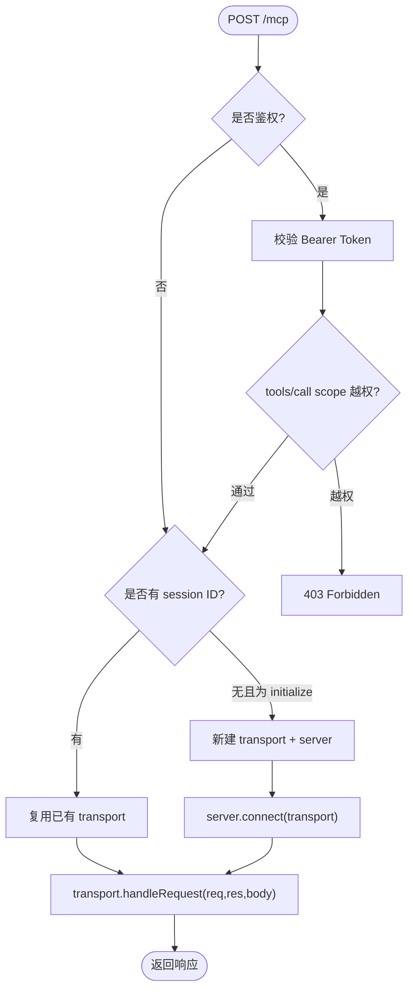
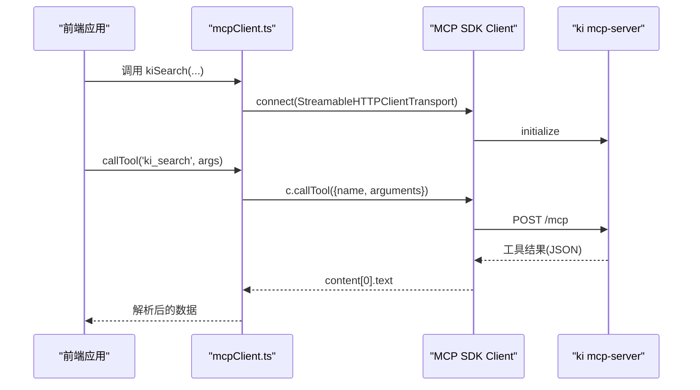
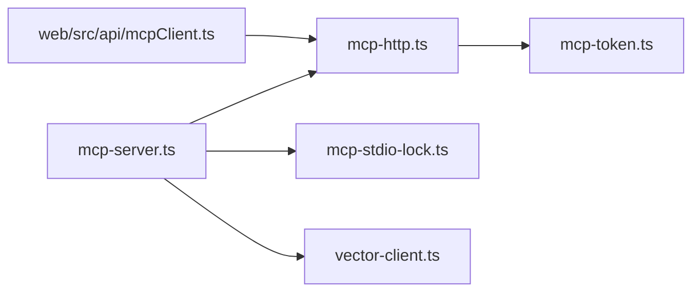

# 客户端集成指南

<cite>
**本文引用的文件**
- [src/mcp-server.ts](file://src/mcp-server.ts)
- [src/lib/mcp-http.ts](file://src/lib/mcp-http.ts)
- [src/lib/mcp-stdio-lock.ts](file://src/lib/mcp-stdio-lock.ts)
- [src/lib/mcp-token.ts](file://src/lib/mcp-token.ts)
- [web/src/api/mcpClient.ts](file://web/src/api/mcpClient.ts)
- [docs/mcp-http.md](file://docs/mcp-http.md)
</cite>

## 目录
1. [简介](#简介)
2. [项目结构](#项目结构)
3. [核心组件](#核心组件)
4. [架构总览](#架构总览)
5. [详细组件分析](#详细组件分析)
6. [依赖关系分析](#依赖关系分析)
7. [性能与容量规划](#性能与容量规划)
8. [故障排查指南](#故障排查指南)
9. [结论](#结论)
10. [附录：端到端集成测试示例](#附录端到端集成测试示例)

## 简介
本指南面向需要在不同环境中集成 MCP 客户端的工程师，覆盖以下目标：
- 在 VS Code、Cursor、Claude Desktop 等主流 IDE 中配置 MCP 客户端（stdio 模式与 HTTP 模式）
- 明确连接参数、认证配置与超时设置
- 提供 JavaScript/Python 等语言的 SDK 使用要点与调用流程
- 说明客户端生命周期管理、错误处理与重连机制
- 汇总常见问题与解决方案，并给出性能调优建议
- 提供完整的端到端集成测试思路与步骤

## 项目结构
本项目实现了 ki 的 MCP Server，支持两种传输模式：
- stdio 模式：默认单进程，适合本地 IDE 通过命令启动
- HTTP 模式：Streamable HTTP，多 IDE 共享同一持锁进程，避免向量库锁冲突

关键路径与职责：
- src/mcp-server.ts：MCP 服务入口，负责参数解析、启动守卫、stdio/HTTP 分发、工具注册、健康检查与版本守护
- src/lib/mcp-http.ts：HTTP 传输实现、鉴权、会话管理、静态页面与 /api/* 扩展路由
- src/lib/mcp-stdio-lock.ts：stdio 模式的多实例 lock 登记与清理
- src/lib/mcp-token.ts：多 Token 存储与 scope 授权（RBAC）
- web/src/api/mcpClient.ts：前端基于 MCP SDK 的 StreamableHTTPClientTransport 封装，演示客户端连接与工具调用
- docs/mcp-http.md：HTTP 模式的完整使用说明、参数、鉴权、状态诊断、优雅退出等

图表来源
- [src/mcp-server.ts:54-71](file://src/mcp-server.ts#L54-L71)
- [src/lib/mcp-http.ts:344-607](file://src/lib/mcp-http.ts#L344-L607)

章节来源
- [src/mcp-server.ts:492-734](file://src/mcp-server.ts#L492-L734)
- [src/lib/mcp-http.ts:344-607](file://src/lib/mcp-http.ts#L344-L607)
- [docs/mcp-http.md:11-57](file://docs/mcp-http.md#L11-L57)

## 核心组件
- MCP Server 构建与工具注册：统一工厂创建 McpServer，注册搜索、索引、存储、关系同步等工具
- HTTP 传输与会话：每个 initialize 新建 transport + server，共享模块级 vector-client engine；会话上限与空闲回收
- 鉴权与 RBAC：回环绑定免鉴权，非回环强制 Bearer Token；按 Token 查授权 scope 集合，拦截 tools/call 越权
- stdio 多实例 lock：每实例独立 lock 文件，供 stop/restart/status 定位与冲突检测
- 前端客户端：浏览器端通过 StreamableHTTPClientTransport 调用 /mcp，封装常用工具方法

章节来源
- [src/mcp-server.ts:54-71](file://src/mcp-server.ts#L54-L71)
- [src/lib/mcp-http.ts:454-591](file://src/lib/mcp-http.ts#L454-L591)
- [src/lib/mcp-token.ts:245-259](file://src/lib/mcp-token.ts#L245-L259)
- [src/lib/mcp-stdio-lock.ts:104-154](file://src/lib/mcp-stdio-lock.ts#L104-L154)
- [web/src/api/mcpClient.ts:53-109](file://web/src/api/mcpClient.ts#L53-L109)

## 架构总览
下图展示从客户端到服务端再到向量引擎的端到端调用链，涵盖鉴权、会话、工具执行与资源释放。

图表来源
- [src/mcp-server.ts:687-734](file://src/mcp-server.ts#L687-L734)
- [src/lib/mcp-http.ts:454-591](file://src/lib/mcp-http.ts#L454-L591)

## 详细组件分析

### 组件A：MCP 服务器与工具注册
- 构建 McpServer 并注册全部工具（查询、模块信息、关系同步、索引管理、搜索、存储等）
- 支持 stdio 与 HTTP 复用同一工厂，HTTP 模式下每个会话新建 server，共享 vector-client 单例
- 启动预检、版本守护、空闲释放锁、优雅退出

图表来源
- [src/mcp-server.ts:54-71](file://src/mcp-server.ts#L54-L71)
- [src/mcp-server.ts:687-734](file://src/mcp-server.ts#L687-L734)

章节来源
- [src/mcp-server.ts:492-734](file://src/mcp-server.ts#L492-L734)

### 组件B：HTTP 传输与会话管理
- 会话模型：每个 initialize 新建 transport + server，mcp-session-id 标识会话
- 会话上限与空闲回收：默认最大并发会话数与空闲超时，后台定时清扫
- 鉴权：回环绑定免鉴权，非回环强制 Bearer Token；scope 越权拦截
- 静态页面与 /api/* 扩展路由：SPA fallback、路径穿越防护、同源调用无需 CORS

图表来源
- [src/lib/mcp-http.ts:454-591](file://src/lib/mcp-http.ts#L454-L591)

章节来源
- [src/lib/mcp-http.ts:344-607](file://src/lib/mcp-http.ts#L344-L607)
- [docs/mcp-http.md:234-242](file://docs/mcp-http.md#L234-L242)

### 组件C：鉴权与 RBAC
- Token 来源优先级：命令行 --token/KI_MCP_TOKEN（全权临时） > 多 Token 存储（~/.ki/mcp-tokens.json）
- 回环绑定禁用鉴权，非回环强制鉴权；鉴权失败记录审计日志与 /healthz 计数
- scope 越权拦截：对 tools/call 的 arguments.scope 做校验，缺省 'default'；枚举工具白名单放行给工具层过滤

章节来源
- [src/lib/mcp-token.ts:245-259](file://src/lib/mcp-token.ts#L245-L259)
- [src/lib/mcp-http.ts:454-526](file://src/lib/mcp-http.ts#L454-L526)
- [docs/mcp-http.md:132-146](file://docs/mcp-http.md#L132-L146)

### 组件D：stdio 多实例 lock
- 每实例独立 lock 文件（~/.ki/mcp-stdio-<pid>.lock），文件名即 pid
- 启动时登记自身 lock，退出时自动清理；陈旧锁自动清理
- 与 HTTP 单例互斥：stdio 启动时若检测到健康 HTTP 单例则拒绝启动，引导迁移 URL 接入

章节来源
- [src/lib/mcp-stdio-lock.ts:104-154](file://src/lib/mcp-stdio-lock.ts#L104-L154)
- [src/mcp-server.ts:620-658](file://src/mcp-server.ts#L620-L658)

### 组件E：前端客户端封装（JavaScript）
- 使用 @modelcontextprotocol/sdk 的 StreamableHTTPClientTransport 连接 /mcp
- 封装 callTool、reconnect、常用工具方法（ki_scope_list、ki_search、ki_get_module_info、ki_store、ki_sync_relation）
- 会话失效自动重建并重试一次

图表来源
- [web/src/api/mcpClient.ts:53-109](file://web/src/api/mcpClient.ts#L53-L109)

章节来源
- [web/src/api/mcpClient.ts:53-175](file://web/src/api/mcpClient.ts#L53-L175)

## 依赖关系分析
- 传输层依赖：stdio 使用 StdioServerTransport，HTTP 使用 StreamableHTTPServerTransport
- 安全依赖：mcp-token 提供 Token 生成、存储、查找与 scope 校验
- 资源依赖：vector-client 作为单进程单锁引擎，所有会话共享
- 前端依赖：@modelcontextprotocol/sdk 的客户端传输，同源调用无需 CORS

图表来源
- [src/mcp-server.ts:492-734](file://src/mcp-server.ts#L492-L734)
- [src/lib/mcp-http.ts:344-607](file://src/lib/mcp-http.ts#L344-L607)
- [src/lib/mcp-token.ts:245-259](file://src/lib/mcp-token.ts#L245-L259)
- [web/src/api/mcpClient.ts:53-109](file://web/src/api/mcpClient.ts#L53-L109)

章节来源
- [src/mcp-server.ts:492-734](file://src/mcp-server.ts#L492-L734)
- [src/lib/mcp-http.ts:344-607](file://src/lib/mcp-http.ts#L344-L607)
- [src/lib/mcp-token.ts:245-259](file://src/lib/mcp-token.ts#L245-L259)
- [web/src/api/mcpClient.ts:53-109](file://web/src/api/mcpClient.ts#L53-L109)

## 性能与容量规划
- 会话上限保护：默认最大并发会话数，超出返回 503，防止内存耗尽
- 空闲会话回收：默认 30 分钟无活动会话自动关闭，减少资源占用
- 向量库锁：单进程单锁，HTTP 单例可彻底避免多进程争抢；stdio 多实例错开共享，撞锁时短暂等待
- 静态页面与 /api/*：SPA fallback、路径穿越防护，避免恶意请求
- 优雅退出：SIGINT/SIGTERM 触发关闭会话、断开长连接、释放引擎锁、删除 lock 文件，5 秒兜底超时

章节来源
- [src/lib/mcp-http.ts:47-56](file://src/lib/mcp-http.ts#L47-L56)
- [src/lib/mcp-http.ts:381-392](file://src/lib/mcp-http.ts#L381-L392)
- [src/lib/mcp-http.ts:734-766](file://src/lib/mcp-http.ts#L734-L766)
- [docs/mcp-http.md:234-242](file://docs/mcp-http.md#L234-L242)

## 故障排查指南
- 端口占用：EADDRINUSE 提示更换端口或排查占用进程
- 权限不足：EACCES 需提升权限或使用高位端口
- 地址不可用：EADDRNOTAVAIL 本机不存在该地址
- 主机无法解析：ENOTFOUND 检查 host 是否为合法 IP 或可解析主机名
- 鉴权失败（401）：核对 Authorization: Bearer 与 token list 输出一致；服务端 stderr 有失败原因
- 越权拒绝（403）：Token 有效但 scope 不在授权内；扩大授权或确认请求 scope 正确
- stdio 与 HTTP 冲突：stdio 启动时若检测到健康 HTTP 单例则拒绝启动，请迁移为 URL 型接入
- 多实例共存：stdio 多实例靠空闲释放锁与撞锁重试错开共享；可用 ki mcp stop 一键关闭

章节来源
- [src/lib/mcp-http.ts:609-630](file://src/lib/mcp-http.ts#L609-L630)
- [docs/mcp-http.md:224-233](file://docs/mcp-http.md#L224-L233)
- [src/mcp-server.ts:620-658](file://src/mcp-server.ts#L620-L658)

## 结论
本指南总结了 ki 的 MCP 客户端集成要点，包括 stdio 与 HTTP 两种模式、鉴权与 RBAC、会话管理与性能优化、常见故障排查与端到端测试思路。推荐在生产环境优先采用 HTTP 单例模式，并通过 Token 与 scope 最小授权保障安全。

## 附录：端到端集成测试示例
以下为端到端集成测试的步骤与要点（不直接粘贴代码，仅给出路径与流程）：
- 启动 HTTP 单例：参考文档中的快速开始与参数说明
- 生成 Token：使用子命令生成强随机 Token 并记录短 ID 与明文
- 配置 IDE：在各 IDE 的 mcp.json 中配置 URL 型条目与 Authorization 头
- 验证健康：通过 /healthz 探活确认服务就绪
- 调用工具：使用 MCP SDK 客户端调用 ki_search、ki_scope_list 等工具，验证返回结构与鉴权行为
- 异常场景：模拟鉴权失败、越权、会话超限、空闲回收等，验证错误码与提示
- 关闭与清理：使用 stop 命令关闭实例并清理 lock

章节来源
- [docs/mcp-http.md:11-57](file://docs/mcp-http.md#L11-L57)
- [web/src/api/mcpClient.ts:53-175](file://web/src/api/mcpClient.ts#L53-L175)
- [src/lib/mcp-token.ts:183-201](file://src/lib/mcp-token.ts#L183-L201)