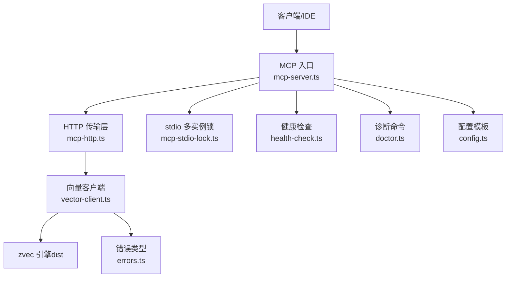
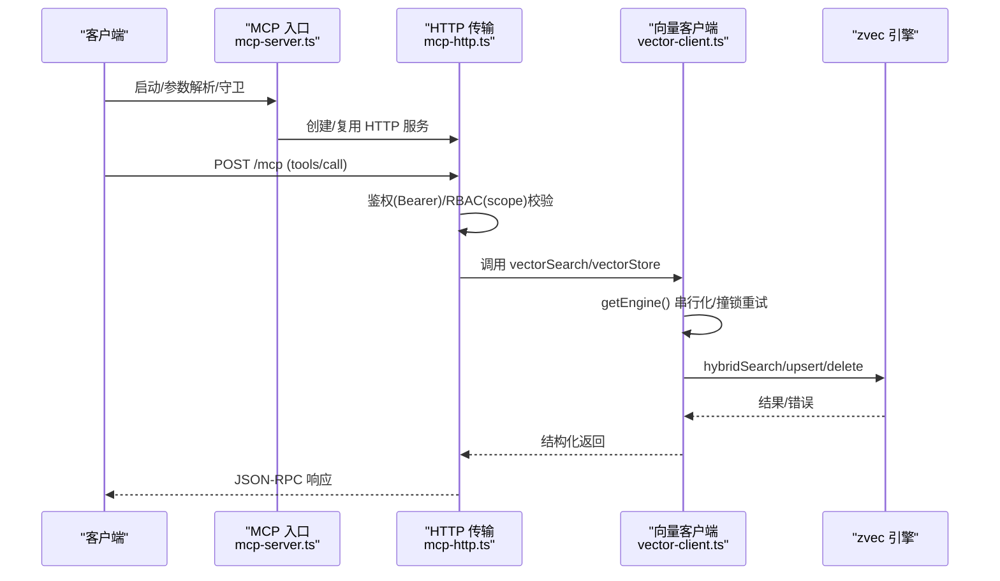
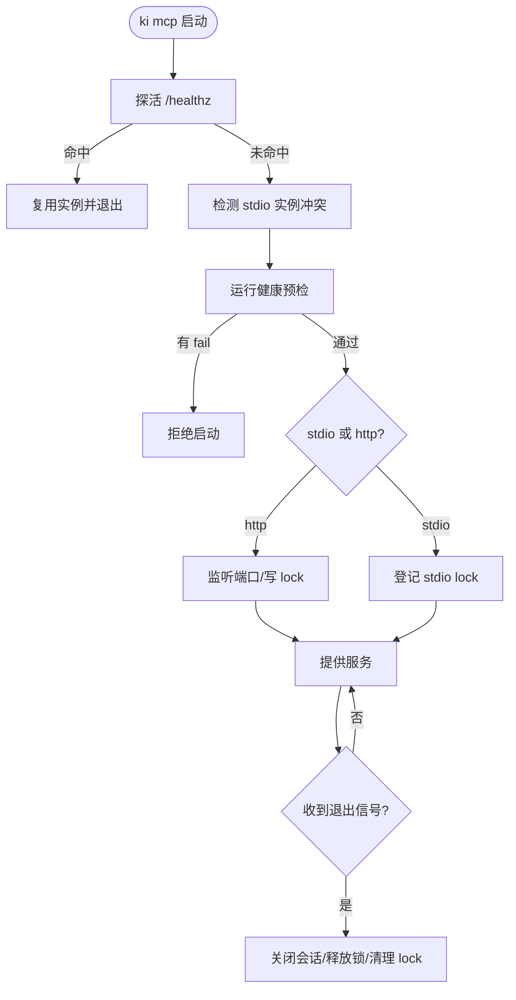
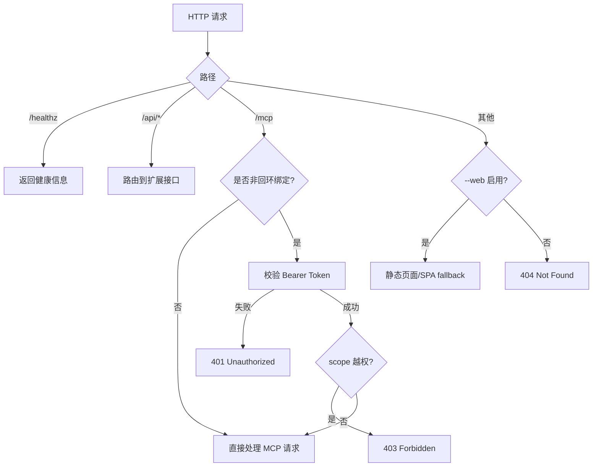
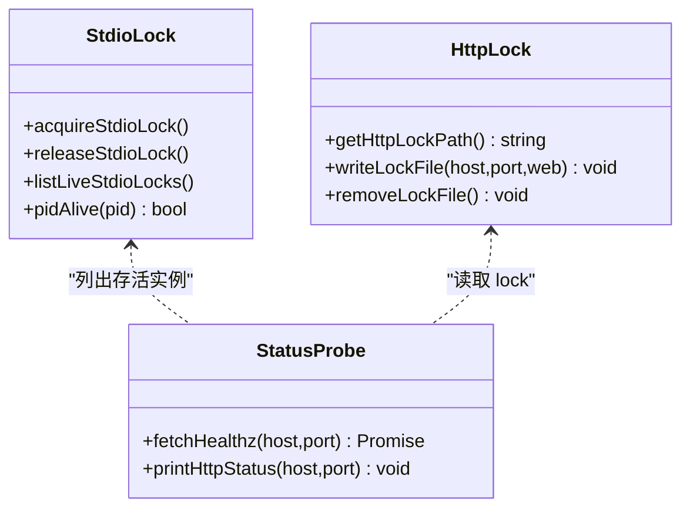
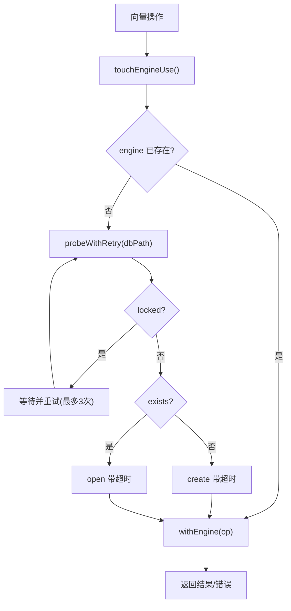
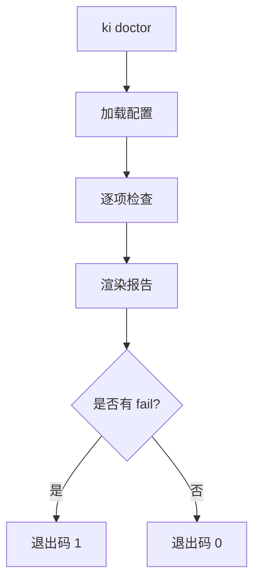
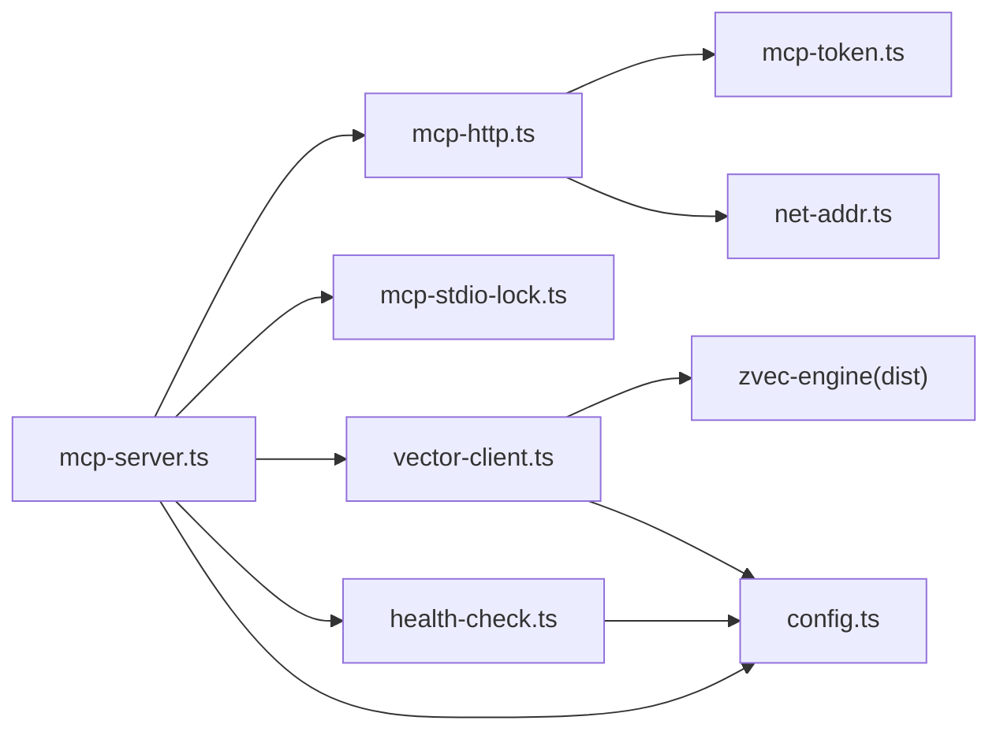

# 故障排查指南

<cite>
**本文引用的文件**
- [README.md](file://README.md)
- [mcp-server.ts](file://src/mcp-server.ts)
- [mcp-http.ts](file://src/lib/mcp-http.ts)
- [mcp-stdio-lock.ts](file://src/lib/mcp-stdio-lock.ts)
- [vector-client.ts](file://src/lib/vector-client.ts)
- [health-check.ts](file://src/lib/health-check.ts)
- [doctor.ts](file://src/doctor.ts)
- [config.ts](file://src/config.ts)
- [errors.ts](file://src/zvec-engine/errors.ts)
- [error-handling.md](file://docs/error-handling.md)
- [mcp-http.md](file://docs/mcp-http.md)
</cite>

## 目录
1. [简介](#简介)
2. [项目结构](#项目结构)
3. [核心组件](#核心组件)
4. [架构总览](#架构总览)
5. [详细组件分析](#详细组件分析)
6. [依赖关系分析](#依赖关系分析)
7. [性能注意事项](#性能注意事项)
8. [故障排查指南](#故障排查指南)
9. [结论](#结论)
10. [附录](#附录)

## 简介
本指南面向客户端集成与运维排障，聚焦 kisearch（ki）在 MCP 接入、向量检索、本地存储与 HTTP 服务中的常见问题：连接失败、认证错误、权限不足、端口占用、文件锁冲突、导入中断与恢复、以及性能瓶颈定位。文档提供可操作的诊断步骤、日志分析方法、常用命令与工具使用方式，并给出优化建议。

## 项目结构
kisearch 的故障面主要分布在以下模块：
- MCP 服务入口与守护：负责 stdio/HTTP 模式启动、鉴权、会话管理、单例守护与重启
- HTTP 传输与静态页面：提供 /healthz、/mcp、/api/* 扩展路由与前端页面
- 进程锁与多实例协调：stdio 多实例 lock、HTTP 单例 lock、健康探活
- 向量客户端与引擎：封装 zvec 引擎，处理撞锁重试、空闲释放锁、可用性与自愈
- 健康检查与诊断：配置、目录、Embedding API、维度匹配、collection 状态
- 错误类型与恢复策略：统一异常体系与恢复指引

**图表来源**
- [mcp-server.ts:49-71](file://src/mcp-server.ts#L49-L71)
- [mcp-http.ts:344-607](file://src/lib/mcp-http.ts#L344-L607)
- [mcp-stdio-lock.ts:118-144](file://src/lib/mcp-stdio-lock.ts#L118-L144)
- [vector-client.ts:314-340](file://src/lib/vector-client.ts#L314-L340)
- [health-check.ts:148-213](file://src/lib/health-check.ts#L148-L213)
- [doctor.ts:18-49](file://src/doctor.ts#L18-L49)
- [config.ts:70-119](file://src/config.ts#L70-L119)
- [errors.ts:17-99](file://src/zvec-engine/errors.ts#L17-L99)

**章节来源**
- [README.md:35-54](file://README.md#L35-L54)
- [mcp-http.md:1-10](file://docs/mcp-http.md#L1-L10)

## 核心组件
- MCP 服务与工具注册：构建 McpServer 并注册查询、写入、搜索、索引管理等工具；支持 stdio 与 HTTP 共享单例
- HTTP 传输与会话：/healthz 探活、/mcp JSON-RPC、/api/* 扩展接口、静态页面 SPA fallback、鉴权与 RBAC
- 进程锁与多实例：stdio 每实例独立 lock 文件，HTTP 单例 lock；存活检测与陈旧锁清理
- 向量客户端：engine 单例、撞锁重试、空闲释放锁、可用性检测、检索/存储/删除/枚举
- 健康检查：配置文件、目录、apiKey、embedding 连通性/密钥/维度、zvec collection、scopes.default
- 诊断命令：ki doctor 一键诊断，输出 pass/warn/fail 报告
- 错误体系：ZvecEngineError 及其子类，跨线程序列化与识别

**章节来源**
- [mcp-server.ts:49-71](file://src/mcp-server.ts#L49-L71)
- [mcp-http.ts:418-451](file://src/lib/mcp-http.ts#L418-L451)
- [mcp-stdio-lock.ts:118-144](file://src/lib/mcp-stdio-lock.ts#L118-L144)
- [vector-client.ts:129-144](file://src/lib/vector-client.ts#L129-L144)
- [health-check.ts:148-213](file://src/lib/health-check.ts#L148-L213)
- [doctor.ts:18-49](file://src/doctor.ts#L18-L49)
- [errors.ts:17-99](file://src/zvec-engine/errors.ts#L17-L99)

## 架构总览
下图展示一次 MCP 请求从客户端到向量检索的关键路径，包含鉴权、RBAC、会话管理与向量层调用。

**图表来源**
- [mcp-server.ts:492-734](file://src/mcp-server.ts#L492-L734)
- [mcp-http.ts:454-577](file://src/lib/mcp-http.ts#L454-L577)
- [vector-client.ts:477-506](file://src/lib/vector-client.ts#L477-L506)

## 详细组件分析

### MCP 服务与守护流程
- 启动守卫：先探活已有健康实例（幂等复用），再检测 stdio 冲突，最后执行健康预检
- 模式选择：stdio 默认；HTTP 共享单例（多 IDE 共用持锁进程）
- 守护与重启：daemon 后台常驻；restart 关闭旧实例后以守护进程重启
- 退出钩子：SIGINT/SIGTERM 优雅退出，关闭会话、释放向量库锁、清理 lock

**图表来源**
- [mcp-server.ts:597-685](file://src/mcp-server.ts#L597-L685)
- [mcp-http.ts:676-766](file://src/lib/mcp-http.ts#L676-L766)
- [mcp-stdio-lock.ts:118-144](file://src/lib/mcp-stdio-lock.ts#L118-L144)

**章节来源**
- [mcp-server.ts:492-734](file://src/mcp-server.ts#L492-L734)
- [mcp-http.md:147-169](file://docs/mcp-http.md#L147-L169)

### HTTP 传输与鉴权
- /healthz：免鉴权，返回 pid/version/host/port/authFailures
- /mcp：JSON-RPC，按绑定地址条件鉴权（回环免鉴权，非回环强制 Bearer）
- RBAC：拦截 tools/call 的 arguments.scope，越权返回 403
- 会话上限与空闲回收：防止会话无界增长与残留
- 静态页面：SPA fallback，路径穿越防护

**图表来源**
- [mcp-http.ts:418-451](file://src/lib/mcp-http.ts#L418-L451)
- [mcp-http.ts:454-577](file://src/lib/mcp-http.ts#L454-L577)

**章节来源**
- [mcp-http.ts:344-607](file://src/lib/mcp-http.ts#L344-L607)
- [mcp-http.md:132-146](file://docs/mcp-http.md#L132-L146)

### 进程锁与多实例协调
- stdio 多实例：每个实例独立 lock 文件（文件名即 pid），存活探测与陈旧锁清理
- HTTP 单例：~/.ki/mcp-http.lock 记录 pid/host/port/web 等
- stop/restart/status：基于 lock + healthz 定位真实服务进程，安全关闭并清理

**图表来源**
- [mcp-stdio-lock.ts:118-144](file://src/lib/mcp-stdio-lock.ts#L118-L144)
- [mcp-http.ts:58-61](file://src/lib/mcp-http.ts#L58-L61)
- [mcp-http.ts:632-670](file://src/lib/mcp-http.ts#L632-L670)

**章节来源**
- [mcp-stdio-lock.ts:1-154](file://src/lib/mcp-stdio-lock.ts#L1-L154)
- [mcp-http.md:170-189](file://docs/mcp-http.md#L170-L189)

### 向量客户端与引擎交互
- 单例 engine：进程内缓存，串行化 probe/open/close，避免原生竞态
- 撞锁重试：检测到 locked 时等待并重试，错开共享向量库
- 空闲释放锁：常驻 MCP 启用 idle close，超时自动释放 LOCK
- 可用性检测：区分 LOCKED/CORRUPTED/PROBE_ERROR，给出恢复引导
- 检索/存储/删除：hybridSearch、upsert、delete 等

**图表来源**
- [vector-client.ts:93-104](file://src/lib/vector-client.ts#L93-L104)
- [vector-client.ts:164-181](file://src/lib/vector-client.ts#L164-L181)
- [vector-client.ts:314-340](file://src/lib/vector-client.ts#L314-L340)
- [vector-client.ts:420-467](file://src/lib/vector-client.ts#L420-L467)

**章节来源**
- [vector-client.ts:129-144](file://src/lib/vector-client.ts#L129-L144)
- [vector-client.ts:389-407](file://src/lib/vector-client.ts#L389-L407)

### 健康检查与诊断
- 健康检查项：配置文件、dataDir/backupDir/vectorDir 可写、apiKey、embedding 连通性/密钥/维度、zvec collection、scopes.default
- 诊断命令：ki doctor 输出 pass/warn/fail，fail>0 则退出码 1
- 启动预检：MCP 启动前执行，fail 拒绝启动，warn 继续

**图表来源**
- [health-check.ts:148-213](file://src/lib/health-check.ts#L148-L213)
- [doctor.ts:18-49](file://src/doctor.ts#L18-L49)

**章节来源**
- [health-check.ts:1-234](file://src/lib/health-check.ts#L1-L234)
- [doctor.ts:1-55](file://src/doctor.ts#L1-L55)

## 依赖关系分析
- mcp-server.ts 依赖 mcp-http.ts、mcp-stdio-lock.ts、vector-client.ts、health-check.ts、config.ts、version-guard.ts、constants.ts、cli-args.ts、mcp-token.ts
- mcp-http.ts 依赖 mcp-token.ts、net-addr.ts、version-guard.ts、mcp-http-api.ts（延迟加载）
- vector-client.ts 依赖 dist/zvec-engine（ZvecEngine、SiliconFlowProvider、CollectionLockedException 等）、config.ts、scope.ts、interrupt.js
- health-check.ts 依赖 config.ts、dist/zvec-engine（SiliconFlowProvider）

**图表来源**
- [mcp-server.ts:1-48](file://src/mcp-server.ts#L1-L48)
- [mcp-http.ts:17-34](file://src/lib/mcp-http.ts#L17-L34)
- [vector-client.ts:16-33](file://src/lib/vector-client.ts#L16-L33)
- [health-check.ts:15-18](file://src/lib/health-check.ts#L15-L18)

**章节来源**
- [mcp-server.ts:1-48](file://src/mcp-server.ts#L1-L48)
- [mcp-http.ts:17-34](file://src/lib/mcp-http.ts#L17-L34)
- [vector-client.ts:16-33](file://src/lib/vector-client.ts#L16-L33)
- [health-check.ts:15-18](file://src/lib/health-check.ts#L15-L18)

## 性能注意事项
- 向量库锁竞争：多 stdio 实例与 CLI 共享向量库，采用撞锁重试与空闲释放锁，减少阻塞
- 会话上限与空闲回收：限制并发会话数，定期回收空闲会话，防止内存泄漏
- Embedding 网络抖动：健康检查与 embedding 请求设置超时与重试，容忍瞬时抖动
- 大库扫描：tag/scope 枚举受 scanLimit 约束，注意 truncated 提示
- 批量写入：优先使用 bulk-store/bulk-sync-relation 提升吞吐

[本节为通用指导，不直接分析具体文件]

## 故障排查指南

### 连接失败
常见现象与原因
- 无法访问 /healthz：服务未启动、端口被占用、host 不一致、防火墙阻断
- 客户端报 400/405：请求方法或 session ID 无效
- 长时间无响应：向量库锁争用、embedding 网络超时

诊断步骤
- 确认服务状态：ki mcp --status 查看 running、healthz、lock、stdioInstances
- 探活测试：curl http://<host>:<port>/healthz 验证健康端点
- 端口占用：若 EADDRINUSE 且未命中健康实例，排查占用进程或更换端口
- 地址一致性：确保所有 IDE 使用完全一致的 URL（host/port 一致）

参考实现
- 探活与状态输出：[mcp-http.ts:195-230](file://src/lib/mcp-http.ts#L195-L230)、[mcp-http.ts:632-670](file://src/lib/mcp-http.ts#L632-L670)
- 监听错误描述：[mcp-http.ts:609-630](file://src/lib/mcp-http.ts#L609-L630)

**章节来源**
- [mcp-http.ts:195-230](file://src/lib/mcp-http.ts#L195-L230)
- [mcp-http.ts:609-670](file://src/lib/mcp-http.ts#L609-L670)
- [mcp-http.md:105-131](file://docs/mcp-http.md#L105-L131)

### 认证错误（401）
常见现象与原因
- 非回环绑定未携带 Authorization: Bearer
- Token 无效或未托管（环境变量/命令行临时 Token 失效）
- 客户端复制 Token 不完整或含多余空格

诊断步骤
- 检查绑定地址：回环绑定免鉴权；非回环必须鉴权
- 核对 Token：ki mcp token list 获取明文，客户端完整粘贴
- 观察服务端日志：stderr 会记录鉴权失败次数与原因
- 临时全权 Token：可通过 KI_MCP_TOKEN 或 --token 传入（进程级）

参考实现
- 鉴权中间件与 401 响应：[mcp-http.ts:454-487](file://src/lib/mcp-http.ts#L454-L487)
- 鉴权失败计数与日志：[mcp-http.ts:358-372](file://src/lib/mcp-http.ts#L358-L372)

**章节来源**
- [mcp-http.ts:454-487](file://src/lib/mcp-http.ts#L454-L487)
- [mcp-http.md:132-146](file://docs/mcp-http.md#L132-L146)

### 权限不足（403）
常见现象与原因
- Token 有效但 scope 不在授权范围内
- 工具调用未传 arguments.scope，缺省为 default，仍参与 RBAC 校验
- 枚举工具（ki_scope_list/ki_manage_index_list）不受此校验限制

诊断步骤
- 核对 Token 授权 scope：ki mcp token update <id> --scope <...> 扩大范围
- 检查客户端请求的 scope 参数是否正确
- 服务端 stderr 会记录被拒的具体 scope 与授权范围

参考实现
- scope 越权拦截与 403 响应：[mcp-http.ts:508-526](file://src/lib/mcp-http.ts#L508-L526)

**章节来源**
- [mcp-http.ts:508-526](file://src/lib/mcp-http.ts#L508-L526)
- [mcp-http.md:132-146](file://docs/mcp-http.md#L132-L146)

### 端口占用与服务冲突
常见现象与原因
- 端口被非 ki 进程占用
- stdio 实例与 HTTP 单例并存导致锁争用
- 历史遗留 lock 文件导致误判

诊断步骤
- 使用 ki mcp --status 查看当前实例与 lock
- 若端口占用且未命中健康实例，更换端口或排查占用进程
- 清理残留 lock：ki mcp stop 一键关闭并清理 lock
- 迁移 IDE 配置为 URL 型接入，避免 stdio 与 HTTP 混用

参考实现
- 端口错误描述：[mcp-http.ts:609-630](file://src/lib/mcp-http.ts#L609-L630)
- 一键关闭与清理：[mcp-http.md:170-189](file://docs/mcp-http.md#L170-L189)

**章节来源**
- [mcp-http.ts:609-630](file://src/lib/mcp-http.ts#L609-L630)
- [mcp-http.md:170-189](file://docs/mcp-http.md#L170-L189)

### 文件锁冲突（向量库）
常见现象与原因
- CollectionLockedException：向量库被其他进程占用或崩溃残留
- 多 stdio 实例同时访问向量库，发生短暂等待
- 导入中断导致 crash residue

诊断步骤
- 检查是否存在 ki mcp/server 常驻进程，必要时停止
- 确认无其他 ki 命令正在写入
- 稍后重试（空闲释放锁机制）
- 如持续报错，重建向量库：ki rebuild-vector 或 restore --rebuild-vector

参考实现
- 撞锁重试与提示：[vector-client.ts:93-104](file://src/lib/vector-client.ts#L93-L104)
- 空闲释放锁：[vector-client.ts:164-181](file://src/lib/vector-client.ts#L164-L181)
- 可用性检测与恢复引导：[vector-client.ts:420-467](file://src/lib/vector-client.ts#L420-L467)

**章节来源**
- [vector-client.ts:93-104](file://src/lib/vector-client.ts#L93-L104)
- [vector-client.ts:164-181](file://src/lib/vector-client.ts#L164-L181)
- [vector-client.ts:420-467](file://src/lib/vector-client.ts#L420-L467)

### 导入中断与恢复
常见现象与原因
- 增量删除失败：不阻塞流程，记录 warning
- relations-cache 中未找到 sourcePath：首次导入未写入 sourcePath
- 向量库损坏：需重建

诊断步骤
- 重新执行导入命令（幂等追加）
- 检查 local KB 文件是否存在，必要时重新写入 module-info
- 若向量库损坏，执行 restore --from-snapshot --rebuild-vector

参考实现
- 增量导入错误处理：[error-handling.md:101-117](file://docs/error-handling.md#L101-L117)
- 数据文件缺失/损坏恢复：[error-handling.md:41-60](file://docs/error-handling.md#L41-L60)

**章节来源**
- [error-handling.md:41-117](file://docs/error-handling.md#L41-L117)

### 配置与环境问题
常见现象与原因
- 未配置 embedding.apiKey：embedding 三合一检查均失败
- 维度不匹配：实际维度与配置不一致
- dataDir/backupDir/vectorDir 不存在或不可写

诊断步骤
- 执行 ki doctor 一键诊断
- 根据报告修复配置或目录权限
- 重新初始化配置：ki config init

参考实现
- 健康检查逻辑：[health-check.ts:52-142](file://src/lib/health-check.ts#L52-L142)
- 配置模板生成：[config.ts:70-119](file://src/config.ts#L70-L119)

**章节来源**
- [health-check.ts:52-142](file://src/lib/health-check.ts#L52-L142)
- [config.ts:70-119](file://src/config.ts#L70-L119)
- [doctor.ts:18-49](file://src/doctor.ts#L18-L49)

### 性能问题排查与优化建议
排查要点
- 向量库锁争用：观察 stderr 中“向量库被其他进程占用”提示，减少并发访问
- 会话堆积：检查 /healthz 的 authFailures 与客户端连接数，调整会话上限与空闲回收
- Embedding 网络耗时：关注健康检查中的 TIMEOUT/NETWORK 错误，优化网络或模型配置
- 大库扫描：tag/scope 枚举受 scanLimit 约束，必要时分批处理

优化建议
- 使用 HTTP 共享单例模式，避免多进程锁冲突
- 批量写入优先使用 bulk-store/bulk-sync-relation
- 合理设置 embedding 超时与重试，避免瞬时抖动影响
- 对热点 scope/tag 进行索引直查，减少语义检索开销

[本节为通用指导，不直接分析具体文件]

### 调试工具与命令使用方法
- 健康诊断：ki doctor
- 服务状态：ki mcp --status
- 启动/重启/停止：ki mcp --http [--daemon]、ki mcp restart、ki mcp stop
- Token 管理：ki mcp token generate/list/update/delete
- 探活：curl http://<host>:<port>/healthz
- 前端页面：ki mcp --http --web，浏览器访问 http://<host>:<port>/

参考实现
- 诊断命令：[doctor.ts:18-49](file://src/doctor.ts#L18-L49)
- 状态输出：[mcp-http.ts:632-670](file://src/lib/mcp-http.ts#L632-L670)
- Token 子命令：[mcp-server.ts:227-351](file://src/mcp-server.ts#L227-L351)

**章节来源**
- [doctor.ts:18-49](file://src/doctor.ts#L18-L49)
- [mcp-http.ts:632-670](file://src/lib/mcp-http.ts#L632-L670)
- [mcp-server.ts:227-351](file://src/mcp-server.ts#L227-L351)

## 结论
kisearch 在 MCP 接入、向量检索与本地存储方面提供了完善的健壮性与可观测性。通过健康检查、进程锁协调、撞锁重试与空闲释放锁、鉴权与 RBAC、会话管理与优雅退出，系统能够在多实例、多 IDE 环境下稳定运行。遇到连接失败、认证错误、权限不足、端口占用、文件锁冲突等问题时，可依据本指南的步骤快速定位与恢复。结合批量写入、会话上限与空闲回收等优化手段，可进一步提升性能与稳定性。

## 附录
- 错误类型参考：ZvecEngineError 及其子类用于统一异常识别与恢复
- 典型工作流与备份恢复：参考 docs 下的相关文档

**章节来源**
- [errors.ts:17-99](file://src/zvec-engine/errors.ts#L17-L99)
- [README.md:324-348](file://README.md#L324-L348)