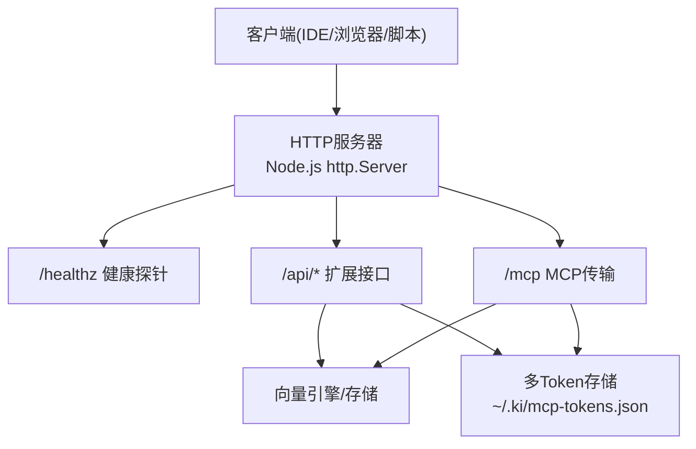
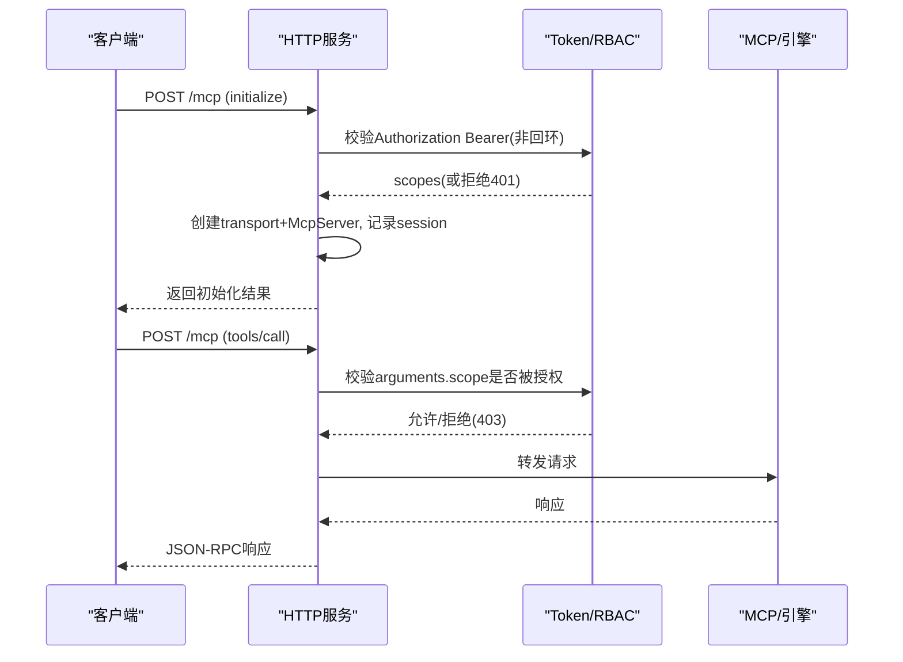
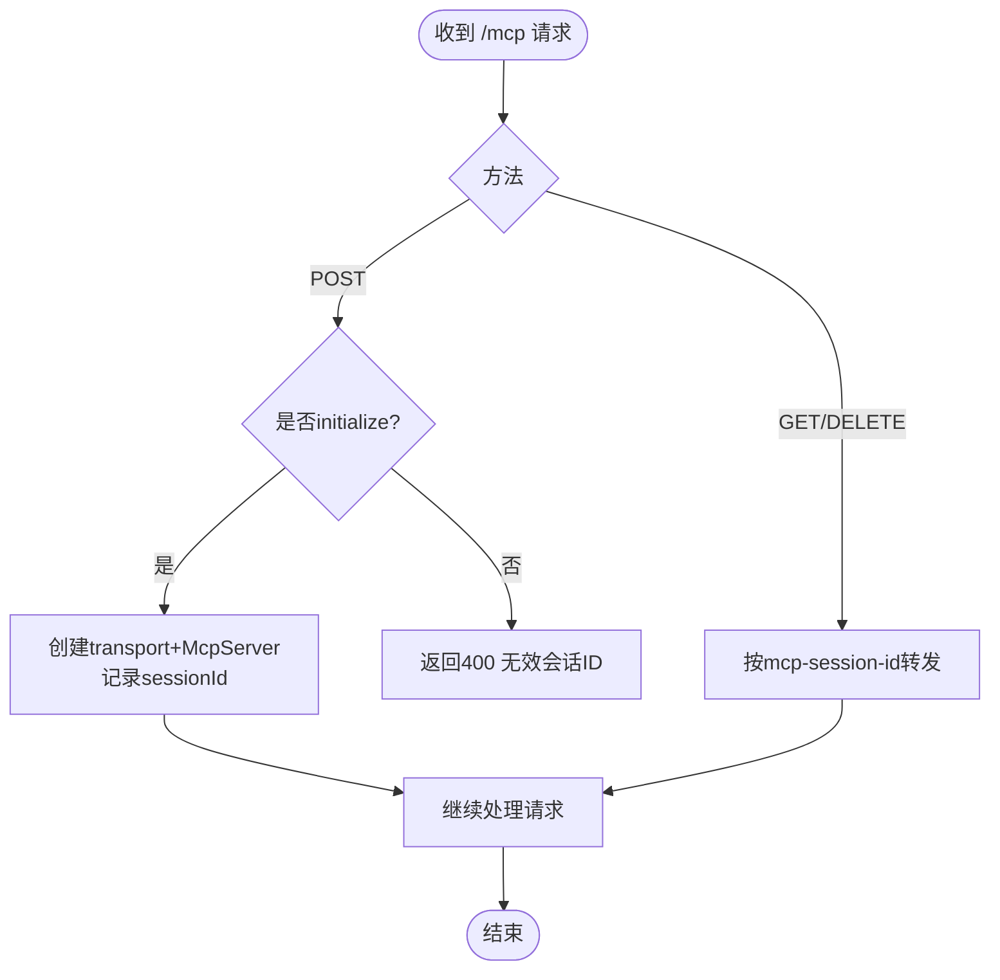
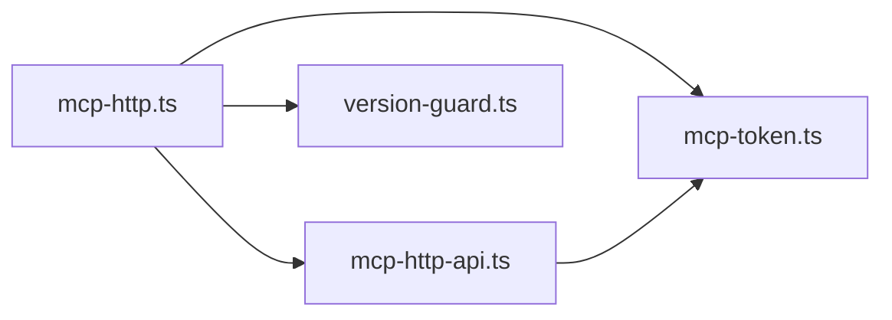

# HTTP API接口

<cite>
**本文引用的文件**
- [mcp-http.ts](file://src/lib/mcp-http.ts)
- [mcp-http-api.ts](file://src/lib/mcp-http-api.ts)
- [mcp-token.ts](file://src/lib/mcp-token.ts)
- [version-guard.ts](file://src/lib/version-guard.ts)
- [mcp-http.md](file://docs/mcp-http.md)
</cite>

## 目录
1. [简介](#简介)
2. [项目结构](#项目结构)
3. [核心组件](#核心组件)
4. [架构总览](#架构总览)
5. [详细组件分析](#详细组件分析)
6. [依赖关系分析](#依赖关系分析)
7. [性能与限制](#性能与限制)
8. [故障排查指南](#故障排查指南)
9. [结论](#结论)
10. [附录：API参考与调用示例](#附录api参考与调用示例)

## 简介
本文件为 ki 的 HTTP 模式 MCP 接口规范文档，覆盖以下范围：
- RESTful 扩展接口 /api/*（健康、文档列表、导入上传/执行/状态）
- MCP Streamable HTTP 传输端点 /mcp（POST/GET/DELETE）
- 认证机制（回环免鉴权；非回环强制 Bearer Token + scope RBAC）
- CORS 策略（同源设计规避跨域）
- 速率限制与会话保护（会话上限、空闲回收、请求体大小限制）
- 安全考虑（路径穿越防护、DNS rebinding 保护、常量时间比较、最小授权 scope）
- 错误码与状态码说明
- API 版本管理与向后兼容建议
- 完整调用示例（curl 与各语言客户端）

## 项目结构
ki 的 HTTP 服务由 Node.js 内建 http.Server 提供，核心路由分为三类：
- /healthz：进程健康探针（免鉴权）
- /api/*：方案 A 扩展接口（导入、健康报告、文档列表等）
- /mcp：MCP Streamable HTTP 传输（POST/GET/DELETE）

图表来源
- [mcp-http.ts:394-499](file://src/lib/mcp-http.ts#L394-L499)
- [mcp-http-api.ts:216-272](file://src/lib/mcp-http-api.ts#L216-L272)

章节来源
- [mcp-http.ts:394-499](file://src/lib/mcp-http.ts#L394-L499)
- [mcp-http-api.ts:216-272](file://src/lib/mcp-http-api.ts#L216-L272)
- [mcp-http.md:72-103](file://docs/mcp-http.md#L72-L103)

## 核心组件
- HTTP 应用构建器：创建并配置 http.Server，统一处理路由、鉴权、会话、静态页面。
- 扩展 API 处理器：实现 /api/* 路由，包含健康检查、标签/文档列表、导入任务管理。
- Token 与RBAC：多 Token 存储、scope 授权集合、越权拦截。
- 版本守护：读取并监控 package.json 版本变化，提示重启。

章节来源
- [mcp-http.ts:344-607](file://src/lib/mcp-http.ts#L344-L607)
- [mcp-http-api.ts:216-272](file://src/lib/mcp-http-api.ts#L216-L272)
- [mcp-token.ts:245-264](file://src/lib/mcp-token.ts#L245-L264)
- [version-guard.ts:17-65](file://src/lib/version-guard.ts#L17-L65)

## 架构总览
ki 的 HTTP 服务采用“单进程单例”模式：同一 host:port 仅一个实例持锁向量库，所有 IDE 通过 URL 共享该实例，避免并发锁冲突。服务支持：
- 条件鉴权：回环地址免鉴权；非回环强制 Bearer Token。
- 会话模型：每个 initialize 新建 transport + McpServer，按 mcp-session-id 复用。
- 扩展接口：/api/* 与 MCP 会话隔离，但鉴权规则一致。
- 前端页面：--web 提供静态 SPA，默认 web/dist，SPA fallback 到 index.html。

图表来源
- [mcp-http.ts:454-577](file://src/lib/mcp-http.ts#L454-L577)
- [mcp-token.ts:47-50](file://src/lib/mcp-token.ts#L47-L50)

章节来源
- [mcp-http.ts:454-577](file://src/lib/mcp-http.ts#L454-L577)
- [mcp-http.md:132-146](file://docs/mcp-http.md#L132-L146)

## 详细组件分析

### 认证与授权（Bearer Token + Scope RBAC）
- 绑定地址决定鉴权开关：
  - 回环地址（127.0.0.1/localhost/::1）：免鉴权。
  - 非回环地址（0.0.0.0/外网IP）：强制 Bearer Token。
- Token 来源优先级：
  - --token/KI_MCP_TOKEN（全权临时 Token，等价 scopes=['all']）
  - 多 Token 存储 ~/.ki/mcp-tokens.json（按明文查找，得到 scopes）
- 越权拦截：
  - MCP tools/call：校验 arguments.scope（缺省 'default'），不在授权范围内返回 403。
  - /api/*：对带 scope 的只读接口（如 tags/doc/list）校验 query scope；导入接口校验 body scope。
- 安全细节：
  - 常量时间比较 tokenMatches。
  - DNS rebinding 保护：可选 allowedHosts 白名单。
  - 枚举工具（无 scope 参数）放行给工具层按授权集合过滤输出。

章节来源
- [mcp-http.ts:454-487](file://src/lib/mcp-http.ts#L454-L487)
- [mcp-http-api.ts:222-258](file://src/lib/mcp-http-api.ts#L222-L258)
- [mcp-token.ts:47-50](file://src/lib/mcp-token.ts#L47-L50)

### 会话模型与生命周期
- 会话创建：POST /mcp 且为 initialize 时新建 transport + McpServer，分配 sessionId。
- 会话复用：后续请求携带 mcp-session-id 复用已有会话。
- 会话关闭：GET/DELETE /mcp 按 session id 转发。
- 会话上限：默认最大 256 个并发会话，超出返回 503。
- 空闲回收：默认 30 分钟无活动自动关闭，防止内存泄漏。

图表来源
- [mcp-http.ts:501-591](file://src/lib/mcp-http.ts#L501-L591)

章节来源
- [mcp-http.ts:501-591](file://src/lib/mcp-http.ts#L501-L591)

### 扩展接口 /api/*
- GET /api/health：健康报告（含 zvec 探活，超时 10s）。
- GET /api/tags：标签列表（支持 scope 查询，受 RBAC 控制）。
- GET /api/doc/list：文档列表（Group 路径+文档名，支持 q/tag/group/limit 过滤，默认分页上限 500）。
- POST /api/import/upload：上传文件至受控目录（~/.ki/import-uploads/<uploadId>/），返回 uploadId。
- POST /api/import/run：触发导入（幂等追加到 group，异步 job，返回 jobId）。
- GET /api/import/status：轮询导入进度/结果（按 jobId）。

注意：
- /api/* 与 MCP 会话隔离，但鉴权规则一致。
- 上传仅接受 base64 内容，不接受服务器路径，防路径注入。
- 导入 job 状态在内存 Map，服务重启后丢失。

章节来源
- [mcp-http-api.ts:216-272](file://src/lib/mcp-http-api.ts#L216-L272)
- [mcp-http-api.ts:276-565](file://src/lib/mcp-http-api.ts#L276-L565)
- [mcp-http.md:92-103](file://docs/mcp-http.md#L92-L103)

### 静态页面与SPA Fallback
- --web 提供静态页面（默认 web/dist），GET 请求访问根路径。
- SPA fallback：非 /api、/mcp 的 GET 请求若文件不存在，返回 index.html。
- 路径穿越防护：解析后的路径必须落在 webDir 内，否则 403。

章节来源
- [mcp-http.ts:257-298](file://src/lib/mcp-http.ts#L257-L298)
- [mcp-http.md:84-91](file://docs/mcp-http.md#L84-L91)

### 健康探针 /healthz
- 免鉴权，返回进程信息、版本号、绑定地址、鉴权失败计数（非回环模式下）。
- 用于单例探活与运维诊断。

章节来源
- [mcp-http.ts:418-429](file://src/lib/mcp-http.ts#L418-L429)
- [mcp-http.ts:195-230](file://src/lib/mcp-http.ts#L195-L230)

## 依赖关系分析
- mcp-http.ts：HTTP 路由、鉴权、会话、静态页面、优雅退出。
- mcp-http-api.ts：/api/* 路由实现，导入任务管理。
- mcp-token.ts：多 Token 存储、scope 授权、RBAC 判定。
- version-guard.ts：版本检测与升级提示。

图表来源
- [mcp-http.ts:29-34](file://src/lib/mcp-http.ts#L29-L34)
- [mcp-http-api.ts:23-29](file://src/lib/mcp-http-api.ts#L23-L29)

章节来源
- [mcp-http.ts:29-34](file://src/lib/mcp-http.ts#L29-L34)
- [mcp-http-api.ts:23-29](file://src/lib/mcp-http-api.ts#L23-L29)

## 性能与限制
- 会话上限：默认 256 个并发会话，超出返回 503。
- 空闲回收：默认 30 分钟无活动自动关闭。
- 请求体大小：16MB 上限，防止滥用。
- 导入 job 内存 Map：最多 50 个，过期清理（1小时）。
- 文档列表缓存：基于 relations-cache 文件 mtime 与 size 缓存。

章节来源
- [mcp-http.ts:46-53](file://src/lib/mcp-http.ts#L46-L53)
- [mcp-http.ts:381-392](file://src/lib/mcp-http.ts#L381-L392)
- [mcp-http.ts:147-173](file://src/lib/mcp-http.ts#L147-L173)
- [mcp-http-api.ts:49-86](file://src/lib/mcp-http-api.ts#L49-L86)
- [mcp-http-api.ts:154-199](file://src/lib/mcp-http-api.ts#L154-L199)

## 故障排查指南
- 401 Unauthorized：未携带 Authorization: Bearer 或 Token 无效。核对客户端 Token 与服务端托管 Token 完全一致。
- 403 Forbidden：请求 scope 不在授权范围内。使用 ki mcp token update 扩大授权或确认请求 scope 正确。
- 503 Service Unavailable：会话数超限。等待空闲会话回收或关闭闲置连接。
- 端口占用：EADDRINUSE。更换端口或排查占用进程。
- 权限不足：EACCES。改用高位端口（>1024）。
- 地址不可用：EADDRNOTAVAIL。本机不存在该地址。
- 主机无法解析：ENOTFOUND。检查 --host 是否为合法 IP 或可解析主机名。
- 鉴权失败日志：服务端 stderr 会记录失败原因与来源地址。

章节来源
- [mcp-http.ts:609-630](file://src/lib/mcp-http.ts#L609-L630)
- [mcp-http.ts:358-372](file://src/lib/mcp-http.ts#L358-L372)
- [mcp-http.md:224-233](file://docs/mcp-http.md#L224-L233)

## 结论
ki 的 HTTP 模式 MCP 服务通过单进程单例、条件鉴权、RBAC 授权、会话保护与扩展接口，提供了稳定、安全、易用的知识索引与导入能力。建议在生产环境前置 TLS 反向代理，结合防火墙与安全组收敛来源 IP，并使用托管 Token 进行最小授权。

## 附录：API参考与调用示例

### 通用约定
- 内容类型：application/json
- 字符编码：UTF-8
- 认证：非回环绑定需 Authorization: Bearer <token>
- 错误格式：{ ok:false, error:string, code?:string }

### 健康探针
- GET /healthz
- 响应：{ ok:true, name:"kisearch", pid:number, version:string, host?:string, port?:number, authFailures?:number }

示例（curl）：
- curl http://127.0.0.1:7423/healthz

章节来源
- [mcp-http.ts:418-429](file://src/lib/mcp-http.ts#L418-L429)

### 扩展接口 /api/*

#### GET /api/health
- 描述：健康报告（含 zvec 探活，超时 10s）
- 响应：{ ok:true, report:any }

示例（curl）：
- curl http://127.0.0.1:7423/api/health

章节来源
- [mcp-http-api.ts:276-288](file://src/lib/mcp-http-api.ts#L276-L288)

#### GET /api/tags
- 描述：标签列表（支持 scope 查询，受 RBAC 控制）
- 查询参数：scope?（缺省 'default'）
- 响应：{ ok:boolean, tags:[{tag:string}], scope:string }

示例（curl）：
- curl "http://127.0.0.1:7423/api/tags?scope=default"

章节来源
- [mcp-http-api.ts:292-304](file://src/lib/mcp-http-api.ts#L292-L304)

#### GET /api/doc/list
- 描述：文档列表（Group 路径+文档名，支持模糊搜索与标签过滤）
- 查询参数：
  - scope?（缺省 'default'）
  - q?（文件名模糊搜索）
  - group?（指定 Group 精确拉取）
  - tag?（自定义标签过滤）
  - limit?（默认 500，搜索场景放宽到 2000）
- 响应：{ ok:boolean, scope:string, docs:[{name:string, group:string, path?:string, tags?:string[]}], total:number, truncated:boolean, groups:[{name:string, count:number}], tags:string[] }

示例（curl）：
- curl "http://127.0.0.1:7423/api/doc/list?q=example&group=wiki/docs&tag=api"

章节来源
- [mcp-http-api.ts:308-369](file://src/lib/mcp-http-api.ts#L308-L369)

#### POST /api/import/upload
- 描述：上传文件至受控目录（~/.ki/import-uploads/<uploadId>/）
- 请求体：{ scope?:string, files:[{name:string, content:string(base64), size?:number}] }
- 响应：{ ok:boolean, uploadId:string, scope:string, files:[{name:string, path:string, size:number}], total:number, errors?:[{name:string, error:string}] }

示例（curl）：
- curl -X POST http://127.0.0.1:7423/api/import/upload \
  -H "Content-Type: application/json" \
  -d '{"scope":"default","files":[{"name":"doc.md","content":"BASE64_CONTENT"}]}'

章节来源
- [mcp-http-api.ts:373-450](file://src/lib/mcp-http-api.ts#L373-L450)

#### POST /api/import/run
- 描述：触发导入（幂等追加到 group，异步 job）
- 请求体：{ scope:string, uploadId:string, group?:string, chunkSize?:number, chunkOverlap?:number, vector?:boolean, tags?:string }
- 响应：{ ok:boolean, jobId:string, scope:string }

示例（curl）：
- curl -X POST http://127.0.0.1:7423/api/import/run \
  -H "Content-Type: application/json" \
  -d '{"scope":"default","uploadId":"<uploadId>","group":"wiki/docs"}'

章节来源
- [mcp-http-api.ts:454-506](file://src/lib/mcp-http-api.ts#L454-L506)

#### GET /api/import/status
- 描述：轮询导入进度/结果
- 查询参数：jobId:string
- 响应：{ ok:boolean, job:{id:string, scope:string, state:'running'|'done'|'failed', phase?:string, progress?:{done:number, total:number}, result?:any, error?:string, startedAt:string, finishedAt?:string} }

示例（curl）：
- curl "http://127.0.0.1:7423/api/import/status?jobId=<jobId>"

章节来源
- [mcp-http-api.ts:543-565](file://src/lib/mcp-http-api.ts#L543-L565)

### MCP 传输 /mcp
- POST /mcp：JSON-RPC 请求（initialize/tools/call 等）
- GET /mcp：SSE 下行（需 mcp-session-id）
- DELETE /mcp：关闭会话（需 mcp-session-id）
- 会话头：mcp-session-id（新建会话后从响应获取）

示例（curl）：
- 初始化：
  - curl -X POST http://127.0.0.1:7423/mcp -H "Content-Type: application/json" -d '{"jsonrpc":"2.0","method":"initialize","params":{},"id":1}'
- 调用工具：
  - curl -X POST http://127.0.0.1:7423/mcp -H "Content-Type: application/json" -H "mcp-session-id:<sessionId>" -d '{"jsonrpc":"2.0","method":"tools/call","params":{"name":"ki_search","arguments":{"query":"example"}},"id":2}'

章节来源
- [mcp-http.ts:489-577](file://src/lib/mcp-http.ts#L489-L577)

### 错误码与状态码
- 200：成功
- 400：请求错误（缺少参数、无效会话ID、非法路径等）
- 401：未认证（非回环绑定缺少或无效 Bearer Token）
- 403：越权（scope 不在授权范围内）
- 404：资源不存在（/api/* 未匹配）
- 500：内部错误（静态文件服务异常、未捕获异常）
- 503：服务不可用（会话数超限）

章节来源
- [mcp-http.ts:418-499](file://src/lib/mcp-http.ts#L418-L499)
- [mcp-http-api.ts:260-272](file://src/lib/mcp-http-api.ts#L260-L272)

### CORS 配置
- 当前实现未设置 CORS 响应头。
- 通过 --web 提供的前端与 /mcp 同源（同一端口），天然规避跨域问题。
- 若外部前端跨源访问，需在反向代理层配置 CORS。

章节来源
- [mcp-http.md:90-91](file://docs/mcp-http.md#L90-L91)

### 速率限制
- 会话上限：默认 256 个并发会话。
- 请求体大小：16MB 上限。
- 导入 job 内存 Map：最多 50 个，过期清理（1小时）。
- 客户端重试风暴：鉴权失败日志限流（5秒间隔）。

章节来源
- [mcp-http.ts:46-53](file://src/lib/mcp-http.ts#L46-L53)
- [mcp-http.ts:147-173](file://src/lib/mcp-http.ts#L147-L173)
- [mcp-http-api.ts:49-86](file://src/lib/mcp-http-api.ts#L49-L86)
- [mcp-http.ts:358-372](file://src/lib/mcp-http.ts#L358-L372)

### 安全考虑
- 条件鉴权：回环免鉴权；非回环强制 Bearer Token。
- RBAC：按 Token 授权 scope 集合校验请求 scope。
- 路径穿越防护：静态文件服务校验路径落在 webDir 内。
- DNS rebinding 保护：可选 allowedHosts 白名单。
- 常量时间比较：tokenMatches 防止时序侧信道。
- 最小授权：推荐按 scope 生成托管 Token。

章节来源
- [mcp-http.ts:454-487](file://src/lib/mcp-http.ts#L454-L487)
- [mcp-http-api.ts:222-258](file://src/lib/mcp-http-api.ts#L222-L258)
- [mcp-http.ts:257-298](file://src/lib/mcp-http.ts#L257-L298)

### API 版本管理与向后兼容
- 版本信息：/healthz 返回 version 字段，便于客户端识别。
- 版本守护：启动时打印版本与 PID，监听 package.json 变化提示重启。
- 向后兼容建议：
  - 新增字段应可选，避免破坏现有客户端。
  - 废弃字段保留一段时间并提供迁移指引。
  - 重大变更通过独立路由版本（如 /api/v2/*）过渡。

章节来源
- [mcp-http.ts:418-429](file://src/lib/mcp-http.ts#L418-L429)
- [version-guard.ts:17-65](file://src/lib/version-guard.ts#L17-L65)

### 编程客户端调用示例
- JavaScript（fetch）：
  - fetch('http://127.0.0.1:7423/api/doc/list', { headers: { 'Authorization': 'Bearer YOUR_TOKEN' } })
- Python（requests）：
  - requests.get('http://127.0.0.1:7423/api/doc/list', headers={'Authorization': 'Bearer YOUR_TOKEN'})
- Go（net/http）：
  - req, _ := http.NewRequest("GET", "http://127.0.0.1:7423/api/doc/list", nil)
  - req.Header.Set("Authorization", "Bearer YOUR_TOKEN")

章节来源
- [mcp-http-api.ts:308-369](file://src/lib/mcp-http-api.ts#L308-L369)