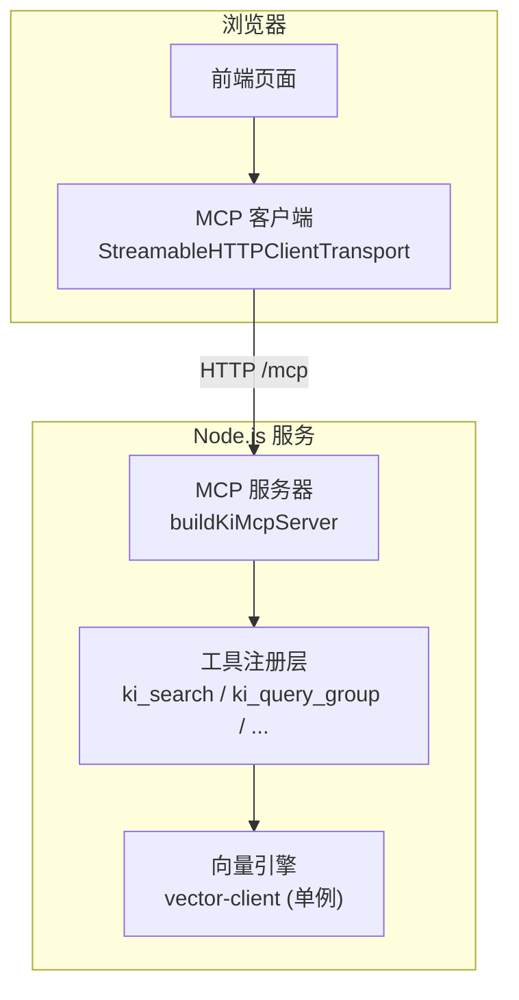
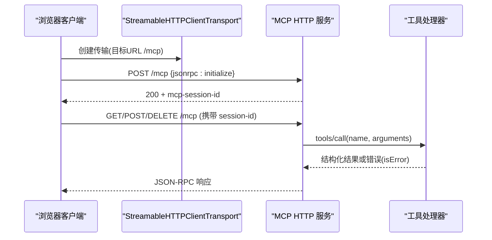
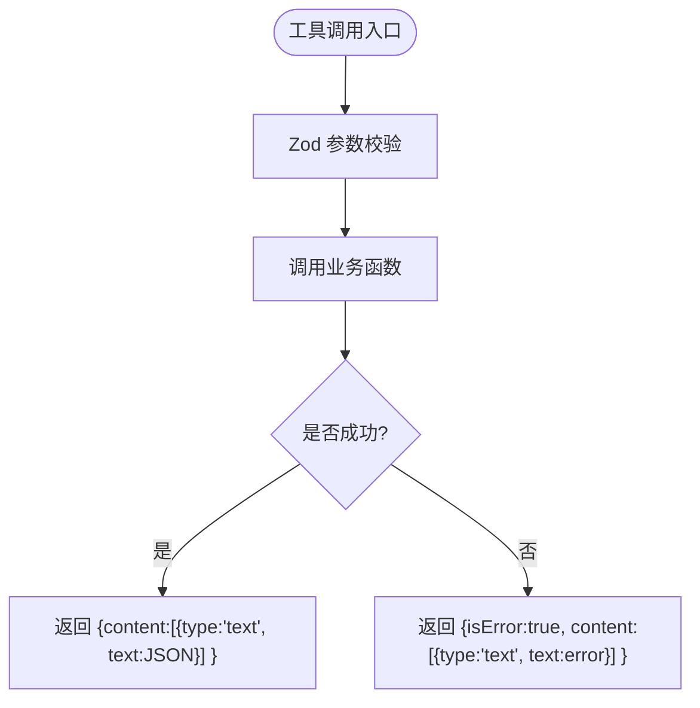
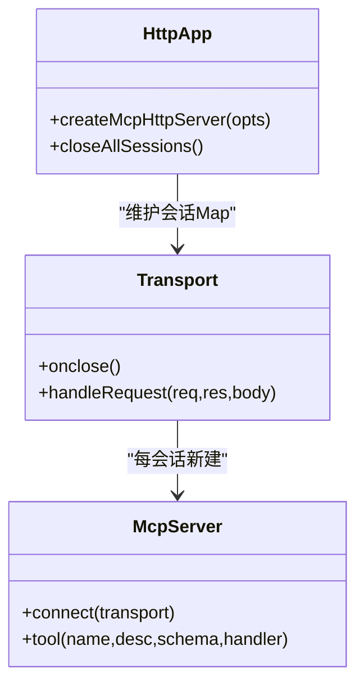
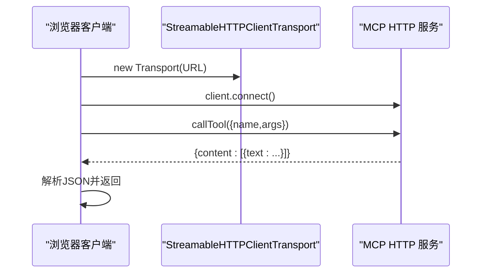
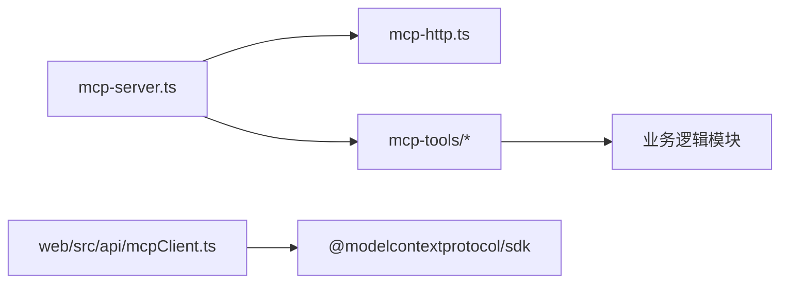

# JavaScript SDK使用

<cite>
**本文引用的文件**
- [src/mcp-server.ts](file://src/mcp-server.ts)
- [src/lib/mcp-http.ts](file://src/lib/mcp-http.ts)
- [web/src/api/mcpClient.ts](file://web/src/api/mcpClient.ts)
- [package.json](file://package.json)
- [src/lib/mcp-tools/search.ts](file://src/lib/mcp-tools/search.ts)
- [src/lib/mcp-tools/query-group.ts](file://src/lib/mcp-tools/query-group.ts)
- [.e2e-run/mcp-comprehensive-test.mjs](file://.e2e-run/mcp-comprehensive-test.mjs)
- [docs/mcp-http.md](file://docs/mcp-http.md)
</cite>

## 目录
1. [简介](#简介)
2. [项目结构](#项目结构)
3. [核心组件](#核心组件)
4. [架构总览](#架构总览)
5. [详细组件分析](#详细组件分析)
6. [依赖关系分析](#依赖关系分析)
7. [性能与并发](#性能与并发)
8. [故障排查](#故障排查)
9. [结论](#结论)
10. [附录：端到端测试与最佳实践](#附录端到端测试与最佳实践)

## 简介
本文档面向在 Node.js 与浏览器环境中直接调用 MCP 工具的开发者，提供从客户端初始化、stdio/HTTP 两种传输方式连接建立、工具调用、错误处理到资源管理的完整指南。同时说明 MCP SDK 的核心概念（server.tool() 注册、Zod schema 定义、Handler 实现），并给出并发调用、超时处理、重试机制等高级特性建议与参考实现路径。

## 项目结构
仓库中 MCP 能力由服务端与客户端两部分组成：
- 服务端：通过 @modelcontextprotocol/sdk 暴露工具，支持 stdio 与 Streamable HTTP 两种传输；提供鉴权、会话管理、静态页面与扩展 API。
- 客户端：浏览器端封装了基于 StreamableHTTPClientTransport 的 MCP 客户端，提供统一 callTool 与常用业务工具方法。

图表来源
- [src/mcp-server.ts:54-70](file://src/mcp-server.ts#L54-L70)
- [src/lib/mcp-http.ts:344-607](file://src/lib/mcp-http.ts#L344-L607)
- [web/src/api/mcpClient.ts:53-109](file://web/src/api/mcpClient.ts#L53-L109)

章节来源
- [src/mcp-server.ts:54-70](file://src/mcp-server.ts#L54-L70)
- [src/lib/mcp-http.ts:344-607](file://src/lib/mcp-http.ts#L344-L607)
- [web/src/api/mcpClient.ts:53-109](file://web/src/api/mcpClient.ts#L53-L109)

## 核心组件
- MCP 服务器构建器：集中注册所有工具，返回可复用的 McpServer 实例工厂，供 stdio 与 HTTP 共享。
- HTTP 传输与单例守护：实现 StreamableHTTPServerTransport，维护会话、鉴权、空闲回收、健康检查与静态页面。
- 浏览器客户端封装：基于 StreamableHTTPClientTransport 建立会话，统一 callTool 与常见工具封装，自动重连。
- 工具注册与处理器：每个工具以 server.tool(name, desc, zodSchema, handler) 形式注册，参数校验由 Zod 完成，异常通过 isError 返回。

章节来源
- [src/mcp-server.ts:54-70](file://src/mcp-server.ts#L54-L70)
- [src/lib/mcp-http.ts:344-607](file://src/lib/mcp-http.ts#L344-L607)
- [web/src/api/mcpClient.ts:53-109](file://web/src/api/mcpClient.ts#L53-L109)
- [src/lib/mcp-tools/search.ts:6-49](file://src/lib/mcp-tools/search.ts#L6-L49)
- [src/lib/mcp-tools/query-group.ts:6-53](file://src/lib/mcp-tools/query-group.ts#L6-L53)

## 架构总览
下图展示了浏览器客户端与服务端之间的交互流程，包括 initialize、tools/call、会话管理与鉴权。

图表来源
- [web/src/api/mcpClient.ts:53-109](file://web/src/api/mcpClient.ts#L53-L109)
- [src/lib/mcp-http.ts:489-577](file://src/lib/mcp-http.ts#L489-L577)
- [src/lib/mcp-tools/search.ts:6-49](file://src/lib/mcp-tools/search.ts#L6-L49)

## 详细组件分析

### 服务端：工具注册与处理器
- 工具注册模式：每个工具通过 server.tool(name, description, zodSchema, handler) 注册。Zod 负责参数校验与生成 JSON Schema；handler 内调用业务逻辑，并以 content[{type:'text', text: JSON.stringify(result)}] 或 isError:true 返回。
- 示例工具：
  - ki_search：语义检索，支持 limit/threshold/tags/include_original 等参数，带超时包装。
  - ki_query_group：查询 Group 树与 Relations，支持多 mode、深度、兜底策略。

图表来源
- [src/lib/mcp-tools/search.ts:6-49](file://src/lib/mcp-tools/search.ts#L6-L49)
- [src/lib/mcp-tools/query-group.ts:6-53](file://src/lib/mcp-tools/query-group.ts#L6-L53)

章节来源
- [src/lib/mcp-tools/search.ts:6-49](file://src/lib/mcp-tools/search.ts#L6-L49)
- [src/lib/mcp-tools/query-group.ts:6-53](file://src/lib/mcp-tools/query-group.ts#L6-L53)

### 服务端：HTTP 传输与会话管理
- 会话模型：每个 initialize 新建一个 transport + McpServer，按 mcp-session-id 复用；支持 GET/POST/DELETE 会话生命周期管理。
- 鉴权：回环绑定免鉴权；非回环强制 Bearer Token，支持临时全权 Token 或多 Token 存储；对 tools/call 进行 scope 越权校验。
- 资源管理：会话上限保护（默认 256）、空闲回收（默认 30 分钟）、优雅退出释放向量库锁。

图表来源
- [src/lib/mcp-http.ts:344-607](file://src/lib/mcp-http.ts#L344-L607)

章节来源
- [src/lib/mcp-http.ts:344-607](file://src/lib/mcp-http.ts#L344-L607)

### 客户端：浏览器端 MCP 客户端
- 初始化：创建 StreamableHTTPClientTransport 指向 /mcp，构造 Client 并 connect。
- 调用工具：callTool(name, args) 统一封装，解析 content[0].text 为 JSON 或直接返回对象；失败时自动重建会话并重试一次。
- 业务封装：提供 kiScopeList、kiSearch、kiGetModuleInfo、kiStore、kiSyncRelation 等方法。

图表来源
- [web/src/api/mcpClient.ts:53-109](file://web/src/api/mcpClient.ts#L53-L109)

章节来源
- [web/src/api/mcpClient.ts:53-109](file://web/src/api/mcpClient.ts#L53-L109)

### 服务端：stdio 模式
- 启动：默认 stdio 模式，使用 StdioServerTransport，适合 IDE 本地集成。
- 资源管理：进程退出或传输关闭时释放向量库锁；长驻进程启用空闲释放锁，避免多实例争抢。

章节来源
- [src/mcp-server.ts:701-733](file://src/mcp-server.ts#L701-L733)

## 依赖关系分析
- 运行时依赖：@modelcontextprotocol/sdk（^1.29.0）用于 MCP 协议通信；zod（^4.4.3）用于参数校验。
- 模块耦合：
  - mcp-server.ts 聚合工具注册，提供 buildKiMcpServer 工厂。
  - mcp-http.ts 实现 HTTP 传输、鉴权、会话、静态页面与扩展 API。
  - web/src/api/mcpClient.ts 作为浏览器端客户端封装。
  - 各工具模块通过 withTimeout 包装业务函数，保证超时控制。

图表来源
- [package.json:42-49](file://package.json#L42-L49)
- [src/mcp-server.ts:54-70](file://src/mcp-server.ts#L54-L70)
- [src/lib/mcp-http.ts:344-607](file://src/lib/mcp-http.ts#L344-L607)
- [web/src/api/mcpClient.ts:53-109](file://web/src/api/mcpClient.ts#L53-L109)

章节来源
- [package.json:42-49](file://package.json#L42-L49)
- [src/mcp-server.ts:54-70](file://src/mcp-server.ts#L54-L70)
- [src/lib/mcp-http.ts:344-607](file://src/lib/mcp-http.ts#L344-L607)
- [web/src/api/mcpClient.ts:53-109](file://web/src/api/mcpClient.ts#L53-L109)

## 性能与并发
- 会话上限与空闲回收：HTTP 模式限制最大并发会话数（默认 256），并定期回收空闲会话（默认 30 分钟）。
- 超时控制：工具处理器通过 withTimeout 包装业务函数，避免长时间阻塞。
- 并发调用：浏览器端可通过 Promise.all 发起多个独立会话的工具调用；服务端按会话串行化执行底层向量操作。
- 压力测试参考：综合测试脚本覆盖基本功能、性能统计、并发与压力场景，便于评估吞吐与时延分布。

章节来源
- [src/lib/mcp-http.ts:344-607](file://src/lib/mcp-http.ts#L344-L607)
- [src/lib/mcp-tools/search.ts:6-49](file://src/lib/mcp-tools/search.ts#L6-L49)
- [.e2e-run/mcp-comprehensive-test.mjs:123-263](file://.e2e-run/mcp-comprehensive-test.mjs#L123-L263)

## 故障排查
- 鉴权失败（401）：非回环绑定需 Authorization: Bearer；Token 无效或缺失会记录失败日志。
- 越权拒绝（403）：tools/call 的 arguments.scope 不在授权范围内；枚举类工具不受此校验但受工具层过滤。
- 端口占用/地址不可用：监听错误会被翻译为可读提示（EADDRINUSE/EACCES/EADDRNOTAVAIL/ENOTFOUND）。
- 会话失效：浏览器客户端在调用失败后自动重建会话并重试一次。
- 状态诊断：使用 ki mcp --status 查看运行实例、lock 与 token 数量；/healthz 获取服务健康信息。

章节来源
- [src/lib/mcp-http.ts:454-487](file://src/lib/mcp-http.ts#L454-L487)
- [src/lib/mcp-http.ts:609-630](file://src/lib/mcp-http.ts#L609-L630)
- [web/src/api/mcpClient.ts:72-109](file://web/src/api/mcpClient.ts#L72-L109)
- [docs/mcp-http.md:132-146](file://docs/mcp-http.md#L132-L146)

## 结论
本项目提供了完整的 MCP 服务端与浏览器客户端实现，支持 stdio 与 HTTP 两种传输，具备完善的鉴权、会话管理、超时控制与资源释放机制。通过统一的工具注册模式与 Zod 参数校验，开发者可以快速扩展新工具；浏览器端封装简化了调用流程并内置重连逻辑。结合性能与并发优化建议，可在生产环境稳定运行。

## 附录：端到端测试与最佳实践

### 快速开始（浏览器端）
- 在同一源下启动 ki mcp --http --web，浏览器访问 http://<host>:<port>/ 即可加载前端页面。
- 前端通过 StreamableHTTPClientTransport 连接 /mcp，调用 ki_search、ki_scope_list 等工具。

章节来源
- [web/src/api/mcpClient.ts:53-109](file://web/src/api/mcpClient.ts#L53-L109)
- [docs/mcp-http.md:72-90](file://docs/mcp-http.md#L72-L90)

### 快速开始（Node.js 端）
- 使用 @modelcontextprotocol/sdk 的 Client 与 StreamableHTTPClientTransport 连接 ki mcp --http 提供的 /mcp。
- 调用 initialize 建立会话，随后使用 tools/call 调用具体工具；注意携带 Authorization 头（非回环）。

章节来源
- [docs/mcp-http.md:15-39](file://docs/mcp-http.md#L15-L39)
- [.e2e-run/mcp-comprehensive-test.mjs:17-44](file://.e2e-run/mcp-comprehensive-test.mjs#L17-L44)

### 工具调用示例（路径引用）
- 搜索工具：ki_search
  - 参数：query、limit、threshold、tags、include_original、scope
  - 返回：结构化 JSON 字符串，客户端解析为对象
  - 参考：[src/lib/mcp-tools/search.ts:6-49](file://src/lib/mcp-tools/search.ts#L6-L49)
- 分组查询工具：ki_query_group
  - 参数：groups/group、hot_count、depth、mode、auto_fallback、scope
  - 返回：结构化 JSON 字符串
  - 参考：[src/lib/mcp-tools/query-group.ts:6-53](file://src/lib/mcp-tools/query-group.ts#L6-L53)

### 并发与重试
- 并发：浏览器端可使用 Promise.all 并行发起多个工具调用；服务端按会话串行化执行。
- 重试：浏览器客户端在调用失败时自动重建会话并重试一次；服务端提供会话上限与空闲回收防止资源泄漏。
- 超时：工具处理器通过 withTimeout 包装业务函数，避免长时间阻塞。

章节来源
- [web/src/api/mcpClient.ts:72-109](file://web/src/api/mcpClient.ts#L72-L109)
- [src/lib/mcp-http.ts:344-607](file://src/lib/mcp-http.ts#L344-L607)
- [src/lib/mcp-tools/search.ts:6-49](file://src/lib/mcp-tools/search.ts#L6-L49)

### 端到端测试脚本
- 综合测试脚本覆盖：initialize、tools/list、各工具调用、性能统计、并发与压力测试、/healthz 健康检查。
- 使用方法：准备 Token 与 BASE_URL，运行脚本输出各项指标与汇总。

章节来源
- [.e2e-run/mcp-comprehensive-test.mjs:1-317](file://.e2e-run/mcp-comprehensive-test.mjs#L1-L317)

### 最佳实践
- 优先使用 HTTP 单例模式（ki mcp --http）以避免多进程锁冲突。
- 非回环绑定必须配置鉴权 Token，并使用最小权限 scope。
- 合理设置会话上限与空闲回收时间，避免内存泄漏。
- 使用 withTimeout 包装耗时操作，确保工具响应可控。
- 通过 /healthz 与 ki mcp --status 监控服务状态与鉴权失败次数。

章节来源
- [docs/mcp-http.md:132-146](file://docs/mcp-http.md#L132-L146)
- [src/lib/mcp-http.ts:418-429](file://src/lib/mcp-http.ts#L418-L429)