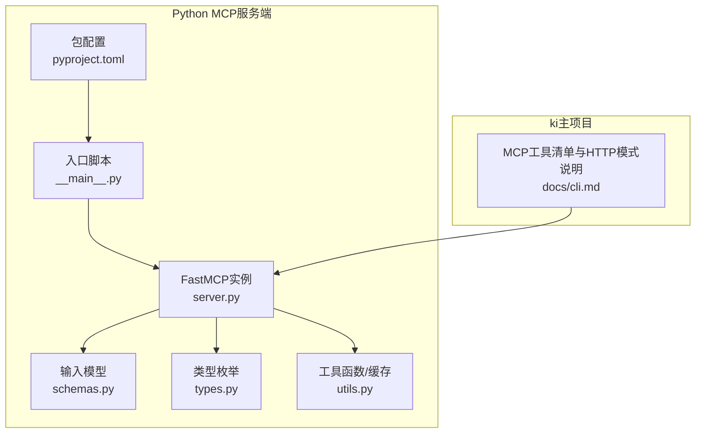
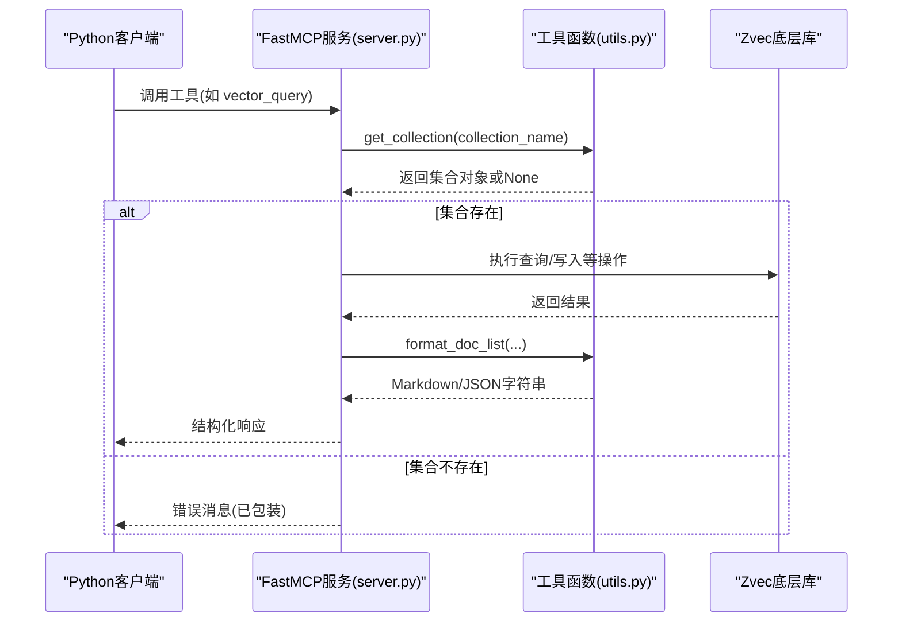
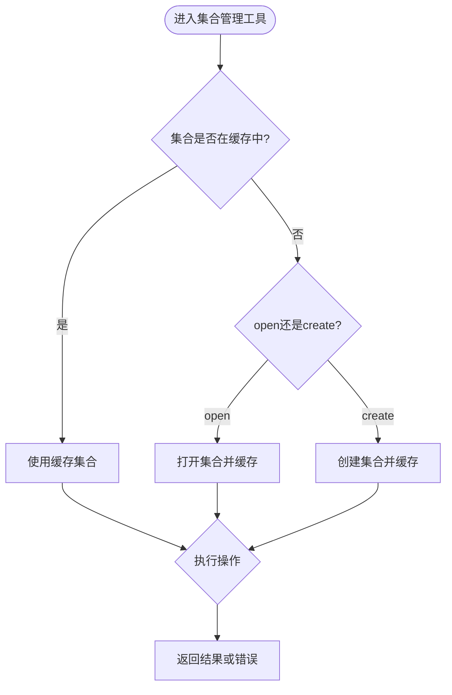
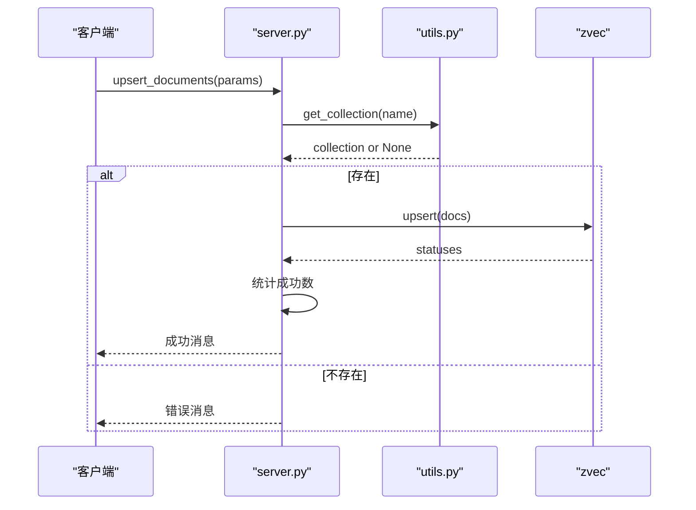
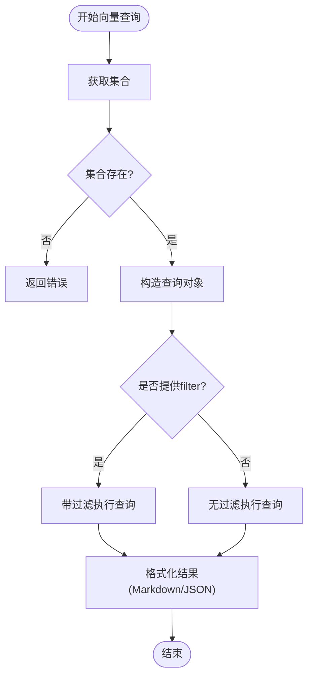
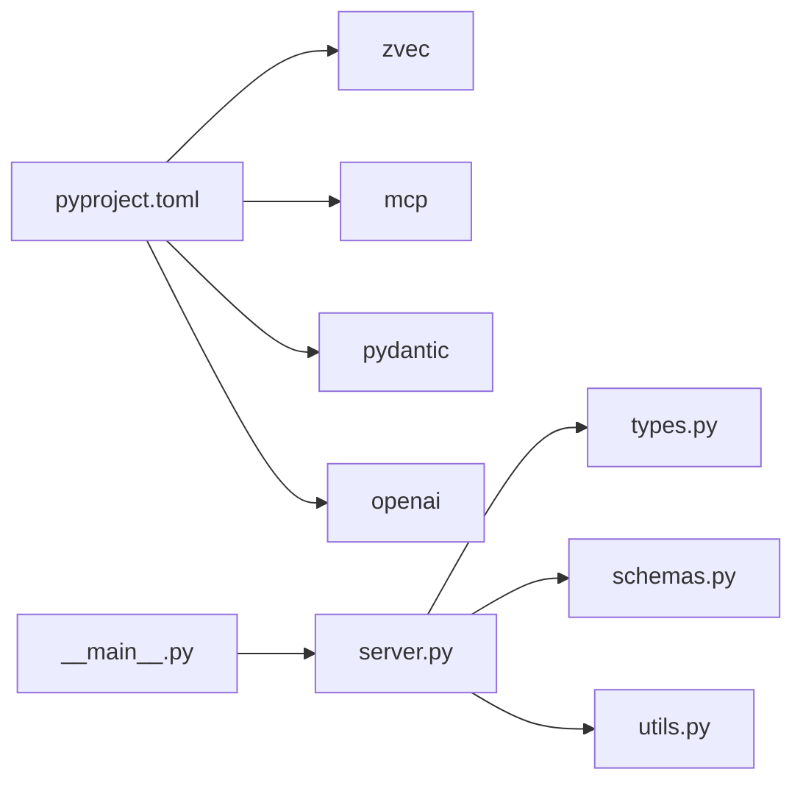

# Python SDK使用

<cite>
**本文引用的文件**
- [server.py](file://zvec-mcp-server/src/zvec_mcp/server.py)
- [schemas.py](file://zvec-mcp-server/src/zvec_mcp/schemas.py)
- [types.py](file://zvec-mcp-server/src/zvec_mcp/types.py)
- [utils.py](file://zvec-mcp-server/src/zvec_mcp/utils.py)
- [__main__.py](file://zvec-mcp-server/src/zvec_mcp/__main__.py)
- [pyproject.toml](file://zvec-mcp-server/pyproject.toml)
- [README.md](file://zvec-mcp-server/README.md)
- [test_server.py](file://zvec-mcp-server/tests/test_server.py)
- [cli.md](file://docs/cli.md)
</cite>

## 目录
1. [简介](#简介)
2. [项目结构](#项目结构)
3. [核心组件](#核心组件)
4. [架构总览](#架构总览)
5. [详细组件分析](#详细组件分析)
6. [依赖关系分析](#依赖关系分析)
7. [性能与扩展性](#性能与扩展性)
8. [故障排查指南](#故障排查指南)
9. [结论](#结论)
10. [附录：Python客户端集成示例与最佳实践](#附录python客户端集成示例与最佳实践)

## 简介
本文件面向希望使用Python客户端调用ki的MCP服务的开发者，提供从安装、连接（stdio与HTTP）、工具调用、参数校验、错误处理到批量操作、流式响应、连接池管理、集成测试与生产部署建议的完整指南。文档同时覆盖异步编程、类型提示与异常处理的最佳实践，帮助你在生产环境中稳定高效地使用MCP服务。

## 项目结构
仓库包含一个独立的Python MCP服务端子项目 zvec-mcp-server，以及ki主项目的MCP能力说明。Python侧通过FastMCP暴露工具，支持集合管理、文档CRUD、向量检索、索引管理与AI嵌入等能力；ki主项目则提供MCP工具清单、HTTP共享单例模式与客户端配置方式。

图表来源
- [server.py:1-50](file://zvec-mcp-server/src/zvec_mcp/server.py#L1-L50)
- [schemas.py:1-120](file://zvec-mcp-server/src/zvec_mcp/schemas.py#L1-L120)
- [types.py:1-54](file://zvec-mcp-server/src/zvec_mcp/types.py#L1-L54)
- [utils.py:1-188](file://zvec-mcp-server/src/zvec_mcp/utils.py#L1-L188)
- [__main__.py:1-7](file://zvec-mcp-server/src/zvec_mcp/__main__.py#L1-L7)
- [pyproject.toml:1-83](file://zvec-mcp-server/pyproject.toml#L1-L83)
- [cli.md:977-1044](file://docs/cli.md#L977-L1044)

章节来源
- [server.py:1-50](file://zvec-mcp-server/src/zvec_mcp/server.py#L1-L50)
- [pyproject.toml:1-83](file://zvec-mcp-server/pyproject.toml#L1-L83)
- [cli.md:977-1044](file://docs/cli.md#L977-L1044)

## 核心组件
- FastMCP服务器：集中注册工具与资源，统一错误处理与输出格式。
- Pydantic输入模型：对工具参数进行严格校验，保证类型安全与可发现性。
- 类型枚举：定义数据类型、度量、量化与响应格式等枚举。
- 工具函数与缓存：集合打开/关闭、格式化输出、错误包装、会话内缓存。
- 入口与打包：命令行入口与依赖声明，便于独立运行与分发。

章节来源
- [server.py:176-800](file://zvec-mcp-server/src/zvec_mcp/server.py#L176-L800)
- [schemas.py:135-484](file://zvec-mcp-server/src/zvec_mcp/schemas.py#L135-L484)
- [types.py:1-54](file://zvec-mcp-server/src/zvec_mcp/types.py#L1-L54)
- [utils.py:131-188](file://zvec-mcp-server/src/zvec_mcp/utils.py#L131-L188)
- [__main__.py:1-7](file://zvec-mcp-server/src/zvec_mcp/__main__.py#L1-L7)
- [pyproject.toml:25-47](file://zvec-mcp-server/pyproject.toml#L25-L47)

## 架构总览
Python MCP服务端基于FastMCP构建，工具通过装饰器注册，输入由Pydantic模型校验，结果以Markdown或JSON返回。ki主项目提供了MCP工具清单与HTTP共享单例模式，便于多IDE共享同一服务进程并通过URL接入。

图表来源
- [server.py:707-760](file://zvec-mcp-server/src/zvec_mcp/server.py#L707-L760)
- [utils.py:70-147](file://zvec-mcp-server/src/zvec_mcp/utils.py#L70-L147)

章节来源
- [server.py:176-800](file://zvec-mcp-server/src/zvec_mcp/server.py#L176-L800)
- [utils.py:70-147](file://zvec-mcp-server/src/zvec_mcp/utils.py#L70-L147)

## 详细组件分析

### 集合管理工具
- create_and_open_collection：创建并打开集合，可选自动建索引。
- open_collection：打开已有集合，支持只读模式。
- get_collection_info：获取集合schema与统计信息，支持Markdown/JSON。
- destroy_collection：销毁集合并从缓存移除。

图表来源
- [server.py:176-320](file://zvec-mcp-server/src/zvec_mcp/server.py#L176-L320)
- [utils.py:150-188](file://zvec-mcp-server/src/zvec_mcp/utils.py#L150-L188)

章节来源
- [server.py:176-320](file://zvec-mcp-server/src/zvec_mcp/server.py#L176-L320)
- [utils.py:150-188](file://zvec-mcp-server/src/zvec_mcp/utils.py#L150-L188)

### 文档CRUD工具
- insert_documents：插入新文档（重复ID失败）。
- upsert_documents：插入或更新文档。
- update_documents：更新现有文档字段。
- delete_documents：按ID删除文档。
- fetch_documents：按ID获取文档，支持Markdown/JSON。

图表来源
- [server.py:520-567](file://zvec-mcp-server/src/zvec_mcp/server.py#L520-L567)
- [utils.py:150-188](file://zvec-mcp-server/src/zvec_mcp/utils.py#L150-L188)

章节来源
- [server.py:470-700](file://zvec-mcp-server/src/zvec_mcp/server.py#L470-L700)

### 向量检索工具
- vector_query：单向量相似度搜索，支持标量过滤。
- multi_vector_query：多向量融合检索，支持加权或RRF重排。

图表来源
- [server.py:707-760](file://zvec-mcp-server/src/zvec_mcp/server.py#L707-L760)
- [utils.py:70-128](file://zvec-mcp-server/src/zvec_mcp/utils.py#L70-L128)

章节来源
- [server.py:707-800](file://zvec-mcp-server/src/zvec_mcp/server.py#L707-L800)

### AI嵌入与语义检索
- generate_dense_embedding：生成稠密向量（OpenAI兼容接口）。
- embedding_write：文本自动嵌入后upsert到集合。
- embedding_search：自然语言查询自动嵌入并检索。

章节来源
- [schemas.py:380-484](file://zvec-mcp-server/src/zvec_mcp/schemas.py#L380-L484)
- [README.md:117-160](file://zvec-mcp-server/README.md#L117-L160)

### 索引管理工具
- create_index：为向量或标量字段创建索引（HNSW/IVF/FLAT/INVERT）。
- drop_index：删除字段索引。
- optimize_collection：优化集合以提升性能。

章节来源
- [server.py:800-1224](file://zvec-mcp-server/src/zvec_mcp/server.py#L800-L1224)

## 依赖关系分析
- 运行时依赖：zvec、mcp、pydantic、openai。
- 开发依赖：pytest、pytest-asyncio、ruff。
- 入口：通过命令脚本暴露 zvec-mcp-server。

图表来源
- [pyproject.toml:25-47](file://zvec-mcp-server/pyproject.toml#L25-L47)
- [__main__.py:1-7](file://zvec-mcp-server/src/zvec_mcp/__main__.py#L1-L7)
- [server.py:1-50](file://zvec-mcp-server/src/zvec_mcp/server.py#L1-L50)

章节来源
- [pyproject.toml:25-47](file://zvec-mcp-server/pyproject.toml#L25-L47)

## 性能与扩展性
- 集合缓存：会话内缓存已打开集合，避免重复打开开销。
- 批量写入：upsert/update/delete支持批量，减少往返次数。
- 索引选择：根据数据规模与查询模式选择合适的索引（HNSW/IVF/FLAT）与量化策略。
- 响应格式：Markdown用于可读性，JSON用于程序化处理。
- 可扩展性：新增工具只需注册装饰器与输入模型，保持高内聚低耦合。

章节来源
- [utils.py:13-188](file://zvec-mcp-server/src/zvec_mcp/utils.py#L13-L188)
- [server.py:470-800](file://zvec-mcp-server/src/zvec_mcp/server.py#L470-L800)

## 故障排查指南
- 常见错误：集合未找到、资源已存在、参数无效。
- 错误包装：统一错误格式，便于客户端识别与提示。
- 调试建议：
  - 检查集合是否已打开并在缓存中。
  - 确认输入模型字段是否符合约束（维度、类型、范围）。
  - 查看工具返回的错误消息，定位具体原因。

章节来源
- [utils.py:131-147](file://zvec-mcp-server/src/zvec_mcp/utils.py#L131-L147)
- [server.py:265-267](file://zvec-mcp-server/src/zvec_mcp/server.py#L265-L267)

## 结论
该Python MCP服务端通过FastMCP与Pydantic提供了类型安全、易用的向量数据库交互能力。结合ki主项目的MCP工具清单与HTTP共享单例模式，可在多种场景下稳定集成。遵循本文的客户端集成与最佳实践，可实现高效的批量操作、可靠的错误处理与良好的生产可用性。

## 附录：Python客户端集成示例与最佳实践

### 安装与服务启动
- 安装服务端包：参考包配置中的依赖与脚本入口。
- 启动服务：通过命令行入口运行服务，或使用IDE集成配置。

章节来源
- [pyproject.toml:46-47](file://zvec-mcp-server/pyproject.toml#L46-L47)
- [README.md:58-71](file://zvec-mcp-server/README.md#L58-L71)

### 连接建立（stdio与HTTP）
- stdio模式：适用于本地Agent或IDE直连，通过标准输入输出通信。
- HTTP模式：ki主项目支持HTTP共享单例，可通过URL接入，回环地址免鉴权，非回环需Bearer Token。

章节来源
- [cli.md:977-1044](file://docs/cli.md#L977-L1044)

### 工具调用与参数校验
- 使用Pydantic模型作为输入参数，确保类型与约束在调用前校验。
- 工具返回Markdown或JSON，根据需求选择格式。

章节来源
- [schemas.py:135-484](file://zvec-mcp-server/src/zvec_mcp/schemas.py#L135-L484)
- [server.py:176-800](file://zvec-mcp-server/src/zvec_mcp/server.py#L176-L800)

### 错误处理与重试
- 捕获工具返回的错误消息，区分“未找到”、“已存在”、“参数无效”等场景。
- 对于网络或服务端临时错误，实现指数退避重试。

章节来源
- [utils.py:131-147](file://zvec-mcp-server/src/zvec_mcp/utils.py#L131-L147)

### 批量操作
- 使用批量写入接口（upsert/update/delete）减少往返次数，提升吞吐。
- 合理设置topk/topn，平衡召回率与延迟。

章节来源
- [server.py:520-658](file://zvec-mcp-server/src/zvec_mcp/server.py#L520-L658)

### 流式响应
- 当前工具以一次性返回为主，如需流式处理，可在客户端层对大结果集进行分页或分块处理。

章节来源
- [server.py:707-760](file://zvec-mcp-server/src/zvec_mcp/server.py#L707-L760)

### 连接池与会话管理
- 服务端维护会话内集合缓存，避免重复打开开销。
- 客户端应复用连接与会话，减少握手成本。

章节来源
- [utils.py:13-188](file://zvec-mcp-server/src/zvec_mcp/utils.py#L13-L188)

### 异步编程与类型提示
- 服务端工具均为异步函数，客户端应使用异步调用。
- 利用Pydantic模型进行类型提示与校验，提高代码可维护性。

章节来源
- [server.py:176-800](file://zvec-mcp-server/src/zvec_mcp/server.py#L176-L800)
- [schemas.py:135-484](file://zvec-mcp-server/src/zvec_mcp/schemas.py#L135-L484)

### 集成测试示例
- 使用pytest与pytest-asyncio编写端到端测试，覆盖集合管理、文档CRUD、向量检索与索引管理。
- 测试夹具提供隔离的集合路径与清理逻辑。

章节来源
- [test_server.py:1-685](file://zvec-mcp-server/tests/test_server.py#L1-L685)

### 生产环境部署建议
- 使用HTTP共享单例模式，绑定回环地址免鉴权，或配置Token与非回环访问控制。
- 监控服务健康状态，定期优化集合与索引。
- 合理配置环境变量（如OpenAI API Key），确保嵌入功能可用。

章节来源
- [cli.md:977-1044](file://docs/cli.md#L977-L1044)
- [README.md:111-116](file://zvec-mcp-server/README.md#L111-L116)