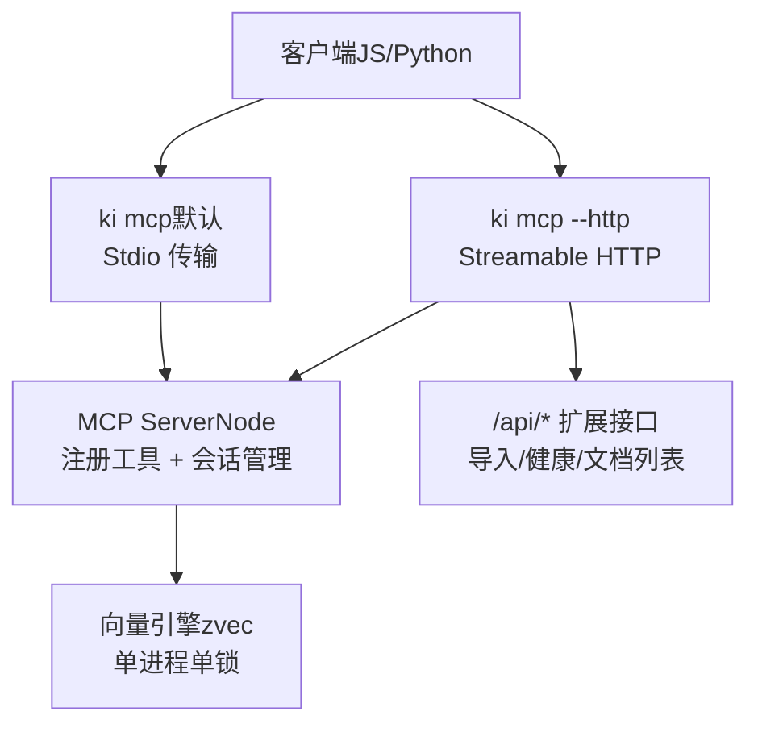
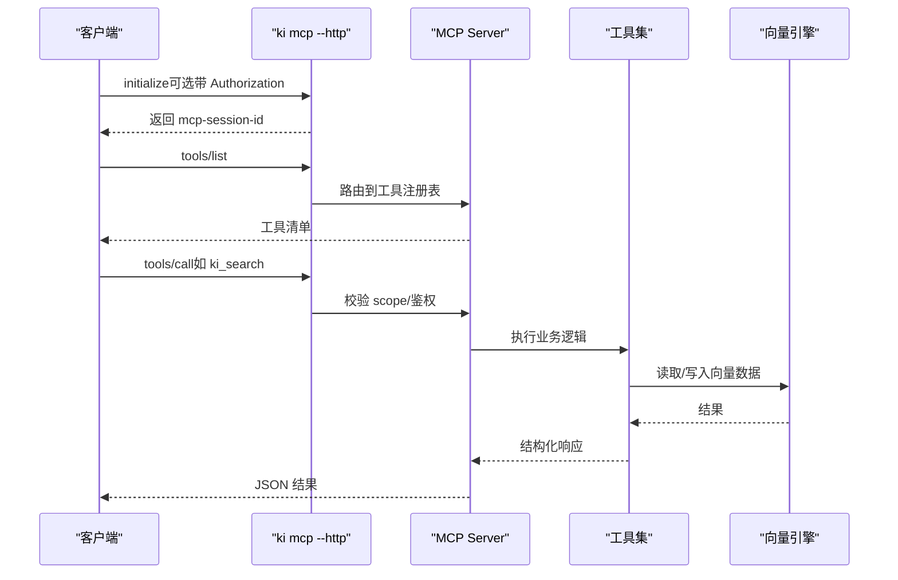
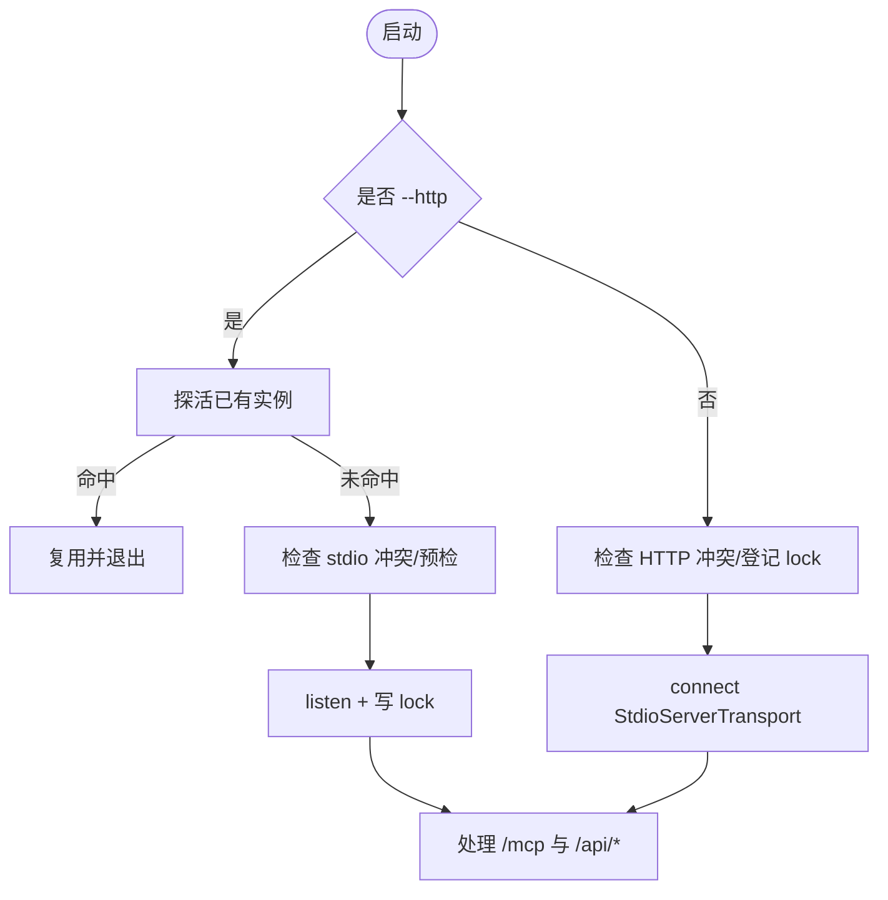
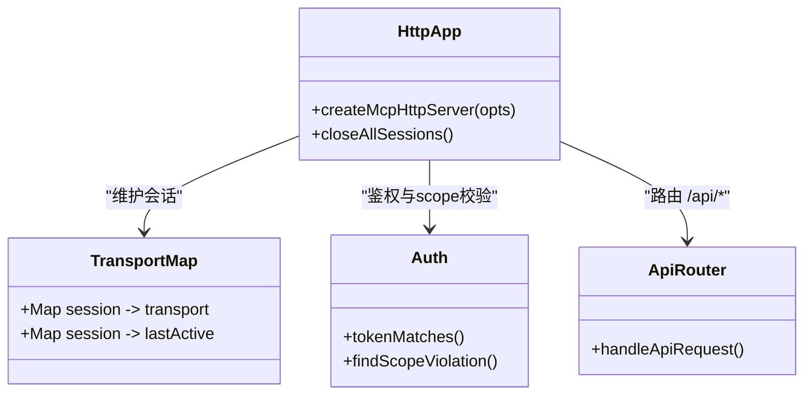
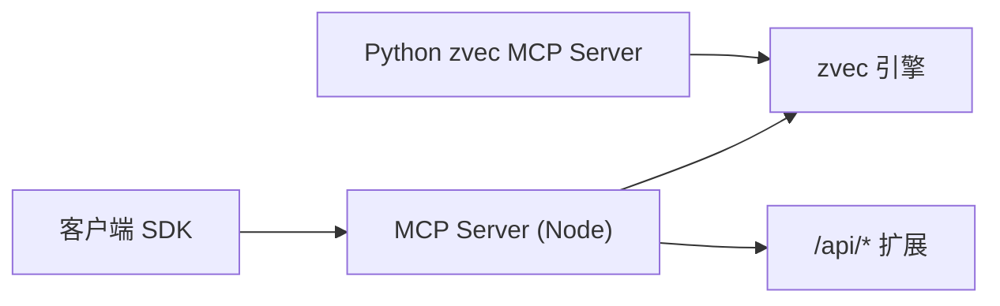

# 编程SDK使用

<cite>
**本文引用的文件**
- [mcp-server.ts](file://src/mcp-server.ts)
- [mcp-http.ts](file://src/lib/mcp-http.ts)
- [mcp-http-api.ts](file://src/lib/mcp-http-api.ts)
- [mcp-stdio-lock.ts](file://src/lib/mcp-stdio-lock.ts)
- [mcp-comprehensive-test.mjs](file://.e2e-run/mcp-comprehensive-test.mjs)
- [mcp-http.md](file://docs/mcp-http.md)
- [cli.md](file://docs/cli.md)
- [server.py](file://zvec-mcp-server/src/zvec_mcp/server.py)
</cite>

## 目录
1. [简介](#简介)
2. [项目结构](#项目结构)
3. [核心组件](#核心组件)
4. [架构总览](#架构总览)
5. [详细组件分析](#详细组件分析)
6. [依赖关系分析](#依赖关系分析)
7. [性能与并发](#性能与并发)
8. [故障排查指南](#故障排查指南)
9. [结论](#结论)
10. [附录：端到端测试与示例](#附录端到端测试与示例)

## 简介
本文档面向希望以 JavaScript/Node.js、Python 等语言直接调用 MCP 工具的开发者，提供从客户端初始化、连接建立、工具调用、错误处理到资源管理的完整实践说明。仓库同时支持两种传输方式：
- stdio：适合单机单 IDE 场景，每个客户端拉起独立子进程。
- HTTP（Streamable HTTP）：推荐的多 IDE 共享模式，单进程持锁向量库，避免多进程锁冲突；支持鉴权、会话管理、空闲回收、静态页面与扩展 API。

此外，仓库还包含一个独立的 Python 侧 zvec MCP Server，演示如何基于 FastMCP 暴露向量数据库能力。

## 项目结构
围绕 MCP 的 SDK 使用，关键代码分布如下：
- Node 服务端入口与启动流程：src/mcp-server.ts
- HTTP 传输与会话、鉴权、静态页面、扩展 API：src/lib/mcp-http.ts、src/lib/mcp-http-api.ts
- stdio 多实例 lock 管理：src/lib/mcp-stdio-lock.ts
- 端到端综合测试脚本（HTTP 直连）：.e2e-run/mcp-comprehensive-test.mjs
- 官方文档与 CLI 参考：docs/mcp-http.md、docs/cli.md
- Python 侧 zvec MCP Server：zvec-mcp-server/src/zvec_mcp/server.py

图表来源
- [mcp-server.ts:492-734](file://src/mcp-server.ts#L492-L734)
- [mcp-http.ts:344-607](file://src/lib/mcp-http.ts#L344-L607)
- [mcp-http-api.ts:216-272](file://src/lib/mcp-http-api.ts#L216-L272)

章节来源
- [mcp-server.ts:492-734](file://src/mcp-server.ts#L492-L734)
- [mcp-http.ts:344-607](file://src/lib/mcp-http.ts#L344-L607)
- [mcp-http-api.ts:216-272](file://src/lib/mcp-http-api.ts#L216-L272)

## 核心组件
- MCP Server 构建与工具注册：统一工厂函数创建 McpServer，并注册搜索、索引、存储、关系同步、范围/标签管理等工具。
- HTTP 传输层：实现 Streamable HTTP，维护会话 Map、空闲回收、鉴权（Bearer Token）、DNS rebinding 保护、静态页面与 /api/* 扩展路由。
- stdio 多实例 lock：每实例独立 lock 文件，支持多实例共存、存活探测、陈旧锁清理、stop/restart/status 定位。
- Python zvec MCP Server：基于 FastMCP 暴露集合/文档/查询等工具，展示 Python 生态下的 MCP 用法。

章节来源
- [mcp-server.ts:49-71](file://src/mcp-server.ts#L49-L71)
- [mcp-http.ts:344-607](file://src/lib/mcp-http.ts#L344-L607)
- [mcp-stdio-lock.ts:104-153](file://src/lib/mcp-stdio-lock.ts#L104-L153)
- [server.py:1-50](file://zvec-mcp-server/src/zvec_mcp/server.py#L1-L50)

## 架构总览
下图展示了客户端通过 stdio 或 HTTP 接入 ki 的 MCP Server，并在服务端统一注册工具，最终访问向量引擎的过程。HTTP 模式下还提供 /api/* 扩展能力与前端静态页面。

图表来源
- [mcp-server.ts:492-734](file://src/mcp-server.ts#L492-L734)
- [mcp-http.ts:412-591](file://src/lib/mcp-http.ts#L412-L591)
- [mcp-http-api.ts:216-272](file://src/lib/mcp-http-api.ts#L216-L272)

## 详细组件分析

### Node 端 MCP Server（stdio 与 HTTP 复用）
- 构建服务器：统一工厂函数创建 McpServer 并注册全部工具，供 stdio 与 HTTP 复用。
- 启动守卫：
  - HTTP 模式：先探活已有健康实例则复用退出；检测 stdio 实例冲突；预检失败拒绝启动。
  - stdio 模式：若存在健康 HTTP 单例则拒绝启动，引导迁移 URL；登记自身 lock 允许多实例错开共享。
- 生命周期：
  - stdio：连接关闭时释放引擎，进程退出。
  - HTTP：优雅退出关闭所有会话、断开长连接、释放向量锁、删除 lock。

图表来源
- [mcp-server.ts:492-734](file://src/mcp-server.ts#L492-L734)

章节来源
- [mcp-server.ts:492-734](file://src/mcp-server.ts#L492-L734)

### HTTP 传输层（会话、鉴权、空闲回收、扩展 API）
- 会话模型：每个 initialize 新建 transport + McpServer，按 mcp-session-id 复用；支持 GET/DELETE 会话控制。
- 鉴权：非回环绑定强制 Bearer Token；常量时间比较；解析授权 scope 集合；越权拦截 tools/call 的 arguments.scope。
- 空闲回收：后台定时扫描，超过空闲阈值关闭会话并清理。
- 扩展 API：/api/health、/api/doc/list、/api/import/* 等，与 MCP 同鉴权策略。

图表来源
- [mcp-http.ts:344-607](file://src/lib/mcp-http.ts#L344-L607)
- [mcp-http-api.ts:216-272](file://src/lib/mcp-http-api.ts#L216-L272)

章节来源
- [mcp-http.ts:344-607](file://src/lib/mcp-http.ts#L344-L607)
- [mcp-http-api.ts:216-272](file://src/lib/mcp-http-api.ts#L216-L272)

### stdio 多实例 lock
- 每实例独立 lock 文件（文件名即 pid），支持多实例并存与存活探测。
- 启动时登记自身 lock，退出时自动清理；陈旧锁在下次启动时自动清理。
- 为 stop/restart/status 提供定位依据，并与 HTTP 模式进行冲突检测。

章节来源
- [mcp-stdio-lock.ts:104-153](file://src/lib/mcp-stdio-lock.ts#L104-L153)

### Python 端 zvec MCP Server
- 基于 FastMCP 暴露集合管理、文档增删改查、向量检索等工具。
- 资源端点列出当前会话已打开的集合及详情。
- 适用于 Python 生态中快速封装向量数据库能力并通过 MCP 对外暴露。

章节来源
- [server.py:1-50](file://zvec-mcp-server/src/zvec_mcp/server.py#L1-L50)
- [server.py:176-800](file://zvec-mcp-server/src/zvec_mcp/server.py#L176-L800)

## 依赖关系分析
- 客户端依赖：
  - JS/Node：@modelcontextprotocol/sdk（StreamableHTTPClientTransport/StdioClientTransport）。
  - Python：mcp.server.fastmcp（用于 zvec MCP Server 暴露能力）。
- 服务端依赖：
  - Node：@modelcontextprotocol/sdk（McpServer、StdioServerTransport、StreamableHTTPServerTransport）。
  - 向量引擎：zvec（嵌入式向量库，单进程单锁）。
- 外部集成：
  - 嵌入服务（如 SiliconFlow）由上层配置驱动，不在 MCP 协议层内。

图表来源
- [mcp-server.ts:492-734](file://src/mcp-server.ts#L492-L734)
- [mcp-http.ts:344-607](file://src/lib/mcp-http.ts#L344-L607)
- [server.py:176-800](file://zvec-mcp-server/src/zvec_mcp/server.py#L176-L800)

章节来源
- [mcp-server.ts:492-734](file://src/mcp-server.ts#L492-L734)
- [mcp-http.ts:344-607](file://src/lib/mcp-http.ts#L344-L607)
- [server.py:176-800](file://zvec-mcp-server/src/zvec_mcp/server.py#L176-L800)

## 性能与并发
- 会话上限与空闲回收：默认最大并发会话数 256，空闲 30 分钟回收，防止内存泄漏。
- 向量锁与撞锁重试：常驻 MCP 启用空闲释放锁（3s），CLI/stdio 可错开共享；撞锁时 probe/open 自动重试。
- 请求体大小限制：JSON 请求体上限 16MB，上传文件单文件 1MB，防止滥用。
- 建议：
  - 高并发场景优先使用 HTTP 单例，减少进程间锁竞争。
  - 合理设置 limit/topk，避免单次查询过大。
  - 批量操作拆分批次，结合后端限流与重试。

章节来源
- [mcp-http.ts:46-53](file://src/lib/mcp-http.ts#L46-L53)
- [mcp-http.ts:147-173](file://src/lib/mcp-http.ts#L147-L173)
- [mcp-http-api.ts:33-42](file://src/lib/mcp-http-api.ts#L33-L42)
- [mcp-server.ts:36-38](file://src/mcp-server.ts#L36-L38)

## 故障排查指南
- 端口占用/权限问题：监听失败会给出明确提示（EADDRINUSE/EACCES 等），建议更换端口或提权。
- 鉴权失败（401）：检查 Authorization: Bearer 是否与托管 Token 一致；非回环绑定必须配置 Token。
- 越权拒绝（403）：检查请求中的 scope 是否在 Token 授权范围内；枚举工具无参调用不受此校验限制。
- 会话异常：确认 mcp-session-id 是否正确回传；空闲回收后需重新 initialize。
- 多实例冲突：使用 ki mcp --status 查看 HTTP/stdio 实例全貌；必要时 ki mcp stop 清理。

章节来源
- [mcp-http.ts:609-630](file://src/lib/mcp-http.ts#L609-L630)
- [mcp-http.ts:454-499](file://src/lib/mcp-http.ts#L454-L499)
- [mcp-http.ts:501-577](file://src/lib/mcp-http.ts#L501-L577)
- [mcp-http.md:132-146](file://docs/mcp-http.md#L132-L146)

## 结论
本仓库提供了完整的 MCP 编程 SDK 使用路径：Node 端支持 stdio 与 HTTP 双传输，具备鉴权、会话管理、空闲回收与扩展 API；Python 端可通过 FastMCP 快速暴露向量能力。生产环境推荐使用 HTTP 单例模式，配合 Token 与 RBAC 实现安全可控的工具调用。

## 附录：端到端测试与示例

### JavaScript/Node.js 客户端（HTTP）
- 初始化：POST /mcp，携带 initialize 消息，接收 mcp-session-id。
- 工具调用：tools/list 获取工具清单；tools/call 调用具体工具（如 ki_search）。
- 鉴权：非回环绑定需在请求头携带 Authorization: Bearer <token>。
- 会话管理：后续请求需带上 mcp-session-id；空闲回收后需重建会话。
- 超时与重试：客户端自行实现超时与重试；服务端对超长请求体有上限保护。
- 参考测试脚本：.e2e-run/mcp-comprehensive-test.mjs 展示了 initialize、tools/list、tools/call、并发与压力测试流程。

章节来源
- [mcp-comprehensive-test.mjs:17-44](file://.e2e-run/mcp-comprehensive-test.mjs#L17-L44)
- [mcp-comprehensive-test.mjs:70-117](file://.e2e-run/mcp-comprehensive-test.mjs#L70-L117)
- [mcp-comprehensive-test.mjs:160-210](file://.e2e-run/mcp-comprehensive-test.mjs#L160-L210)
- [mcp-comprehensive-test.mjs:216-263](file://.e2e-run/mcp-comprehensive-test.mjs#L216-L263)

### Python 客户端（HTTP）
- 可使用 mcp 官方 Python 客户端（FastMCP 生态）连接 ki mcp --http，步骤与 Node 类似：initialize → tools/list → tools/call。
- 注意会话 ID 回传与鉴权头设置。

章节来源
- [mcp-http.md:24-39](file://docs/mcp-http.md#L24-L39)

### Python 端 zvec MCP Server（FastMCP）
- 暴露资源：zvec://collections、zvec://collection/{collection_name}。
- 暴露工具：create_and_open_collection、open_collection、get_collection_info、destroy_collection、insert/upsert/update/delete_documents、fetch_documents、vector_query、multi_vector_query 等。
- 适用场景：在 Python 环境中将向量数据库能力以 MCP 形式对外暴露，便于 Agent 调用。

章节来源
- [server.py:53-140](file://zvec-mcp-server/src/zvec_mcp/server.py#L53-L140)
- [server.py:176-800](file://zvec-mcp-server/src/zvec_mcp/server.py#L176-L800)

### 端到端测试建议
- 基本功能：initialize → tools/list → 各工具调用（ki_scope_list、ki_manage_index_list、ki_tag_list、ki_query_group、ki_search、ki_get_module_info）。
- 性能测试：对常用工具多次测量，统计平均/最小/最大/P95。
- 并发测试：多客户端独立 initialize，并行调用工具，评估成功率与吞吐。
- 压力测试：连续高频请求，观察错误率与延迟分布。
- Healthz：定期轮询 /healthz 确认服务就绪与健康状态。

章节来源
- [mcp-comprehensive-test.mjs:123-154](file://.e2e-run/mcp-comprehensive-test.mjs#L123-L154)
- [mcp-comprehensive-test.mjs:269-277](file://.e2e-run/mcp-comprehensive-test.mjs#L269-L277)
- [mcp-http.md:105-131](file://docs/mcp-http.md#L105-L131)