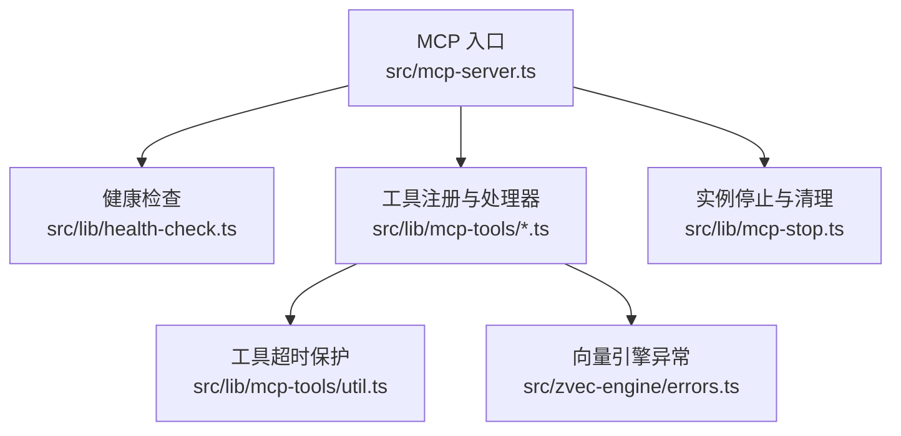
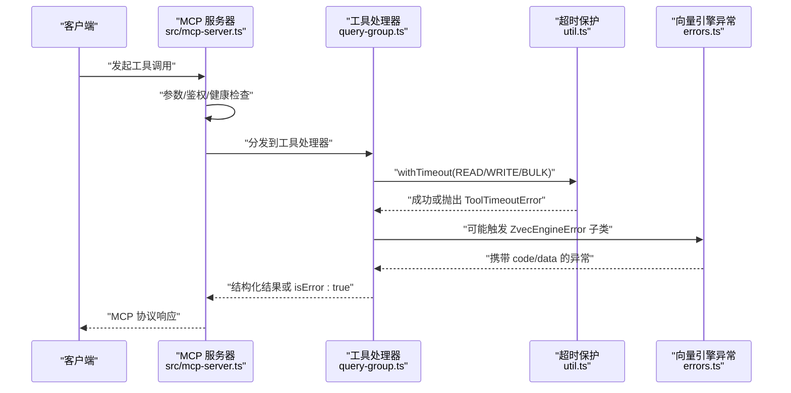
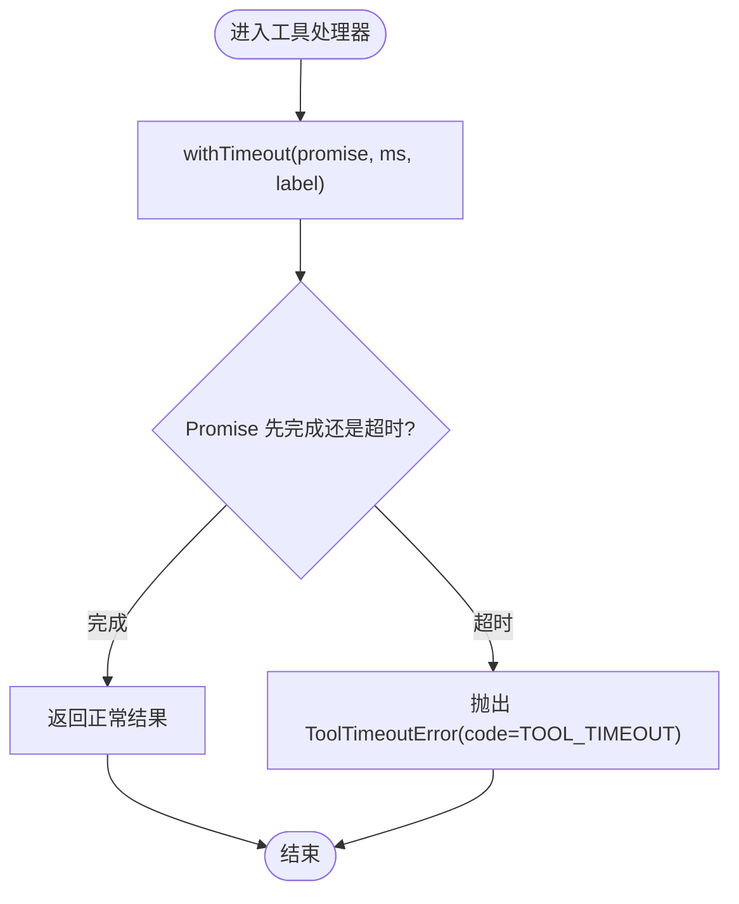
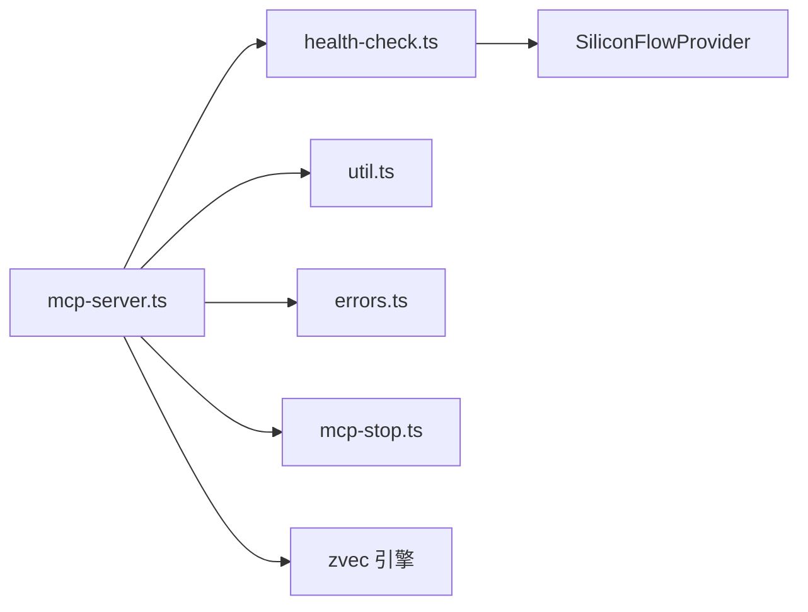

# 错误处理与调试

<cite>
**本文引用的文件**
- [src/mcp-server.ts](file://src/mcp-server.ts)
- [src/lib/health-check.ts](file://src/lib/health-check.ts)
- [src/lib/mcp-tools/util.ts](file://src/lib/mcp-tools/util.ts)
- [src/lib/mcp-tools/query-group.ts](file://src/lib/mcp-tools/query-group.ts)
- [src/zvec-engine/errors.ts](file://src/zvec-engine/errors.ts)
- [src/lib/mcp-stop.ts](file://src/lib/mcp-stop.ts)
- [test/mcp-daemon.test.ts](file://test/mcp-daemon.test.ts)
- [test/zvec-engine-embedding.test.mjs](file://test/zvec-engine-embedding.test.mjs)
- [docs/error-handling.md](file://docs/error-handling.md)
</cite>

## 目录
1. [简介](#简介)
2. [项目结构](#项目结构)
3. [核心组件](#核心组件)
4. [架构总览](#架构总览)
5. [详细组件分析](#详细组件分析)
6. [依赖关系分析](#依赖关系分析)
7. [性能考量](#性能考量)
8. [故障排查指南](#故障排查指南)
9. [结论](#结论)
10. [附录](#附录)

## 简介
本文件面向 MCP 工具调用链的错误处理与调试，覆盖协议层、业务逻辑层与系统级错误的分类处理策略；提供连接失败、超时、权限不足、数据不一致等常见场景的诊断方法与恢复方案；并给出日志级别配置、性能分析与内存泄漏检测等调试技巧，以及生产环境的监控告警与故障排查流程。

## 项目结构
围绕错误处理的关键路径包括：
- MCP 服务启动与守卫：负责参数校验、鉴权、健康检查、实例冲突检测与优雅退出。
- 工具层超时保护：为每个工具处理器设置超时上限，避免长驻进程被阻塞。
- 健康检查：启动前对配置、目录、Embedding 连通性/密钥/维度进行只读诊断。
- 向量引擎异常体系：类型化异常与跨线程序列化支持，便于上层统一捕获与分类。
- 停止与清理：安全关闭实例、清理锁文件，防止僵尸进程与锁残留。

图表来源
- [src/mcp-server.ts:492-734](file://src/mcp-server.ts#L492-L734)
- [src/lib/health-check.ts:148-213](file://src/lib/health-check.ts#L148-L213)
- [src/lib/mcp-tools/util.ts:20-42](file://src/lib/mcp-tools/util.ts#L20-L42)
- [src/zvec-engine/errors.ts:17-99](file://src/zvec-engine/errors.ts#L17-L99)
- [src/lib/mcp-stop.ts:35-68](file://src/lib/mcp-stop.ts#L35-L68)

章节来源
- [src/mcp-server.ts:492-734](file://src/mcp-server.ts#L492-L734)
- [src/lib/health-check.ts:148-213](file://src/lib/health-check.ts#L148-L213)
- [src/lib/mcp-tools/util.ts:20-42](file://src/lib/mcp-tools/util.ts#L20-L42)
- [src/zvec-engine/errors.ts:17-99](file://src/zvec-engine/errors.ts#L17-L99)
- [src/lib/mcp-stop.ts:35-68](file://src/lib/mcp-stop.ts#L35-L68)

## 核心组件
- MCP 服务器入口与守卫
  - 解析参数、鉴权（HTTP 非回环需 Token）、预检健康检查、多实例冲突检测、stdio/HTTP 模式分流、优雅退出。
- 工具超时保护
  - 为工具处理器包裹 withTimeout，区分 READ/WRITE/BULK 超时阈值，避免请求无限挂起。
- 健康检查
  - 启动前检查配置文件、目录可写、apiKey、Embedding 连通性/密钥/维度、collection 存在性、scopes.default。
- 向量引擎异常体系
  - 类型化异常基类与具体子类，支持 code/data 透传，便于上层按错误码分类处理。
- 停止与清理
  - 通过 healthz + lock 定位实例，发送 SIGTERM 并等待优雅退出，必要时 SIGKILL，清理锁文件。

章节来源
- [src/mcp-server.ts:492-734](file://src/mcp-server.ts#L492-L734)
- [src/lib/mcp-tools/util.ts:20-42](file://src/lib/mcp-tools/util.ts#L20-L42)
- [src/lib/health-check.ts:148-213](file://src/lib/health-check.ts#L148-L213)
- [src/zvec-engine/errors.ts:17-99](file://src/zvec-engine/errors.ts#L17-L99)
- [src/lib/mcp-stop.ts:35-68](file://src/lib/mcp-stop.ts#L35-L68)

## 架构总览
下图展示一次 MCP 工具调用的完整错误处理链路：从请求进入、参数校验、健康检查、工具执行、超时保护、异常分类到返回结果或错误响应。

图表来源
- [src/mcp-server.ts:492-734](file://src/mcp-server.ts#L492-L734)
- [src/lib/mcp-tools/query-group.ts:21-51](file://src/lib/mcp-tools/query-group.ts#L21-L51)
- [src/lib/mcp-tools/util.ts:20-42](file://src/lib/mcp-tools/util.ts#L20-L42)
- [src/zvec-engine/errors.ts:17-99](file://src/zvec-engine/errors.ts#L17-L99)

## 详细组件分析

### MCP 服务器启动与守卫
- 职责
  - 解析 CLI 参数，强制 HTTP 非回环绑定必须鉴权；检测已有健康实例复用；阻止 stdio 与 HTTP 单例争抢向量库锁；运行健康检查；启动 stdio/HTTP 传输；注册版本守护与空闲释放锁；优雅退出。
- 关键错误点
  - 未知参数/短 flag 拦截；非回环缺 Token 拒绝启动；stdio 与 HTTP 冲突时明确提示并退出；健康检查失败拒绝启动；启动后异常统一捕获并退出。
- 建议
  - 使用 --status 快速探测目标地址；使用 stop/restart 管理实例生命周期；在 HTTP 模式下优先 URL 接入以避免锁冲突。

章节来源
- [src/mcp-server.ts:492-734](file://src/mcp-server.ts#L492-L734)
- [test/mcp-daemon.test.ts:94-109](file://test/mcp-daemon.test.ts#L94-L109)
- [test/mcp-daemon.test.ts:136-173](file://test/mcp-daemon.test.ts#L136-L173)

### 工具超时保护
- 职责
  - 为工具处理器附加超时上界，避免长驻进程因底层任务卡死导致后续请求阻塞；超时后以可读错误返回，同时清理定时器防止句柄泄漏。
- 超时阈值
  - READ 30s、WRITE 60s、BULK 300s，可按工具类型选择。
- 使用方式
  - 在工具处理器中用 withTimeout 包裹异步执行体，并在 catch 中返回 isError:true 的结构化错误。

图表来源
- [src/lib/mcp-tools/util.ts:20-42](file://src/lib/mcp-tools/util.ts#L20-L42)

章节来源
- [src/lib/mcp-tools/util.ts:1-43](file://src/lib/mcp-tools/util.ts#L1-L43)
- [src/lib/mcp-tools/query-group.ts:21-51](file://src/lib/mcp-tools/query-group.ts#L21-L51)

### 健康检查（启动预检）
- 职责
  - 只读检查：配置文件、dataDir/backupDir/vectorDir 存在且可写、apiKey 已解析、Embedding 连通性/密钥/维度三合一验证、zvec collection 存在性、scopes.default 配置。
- 行为
  - 有 fail 项则拒绝启动；warn 项继续启动；输出可读报告供 doctor 与 mcp stderr 共用。
- 典型问题
  - Embedding 超时/网络不可达/401/403/维度不匹配；未创建 collection；缺少 default scope。

章节来源
- [src/lib/health-check.ts:148-213](file://src/lib/health-check.ts#L148-L213)
- [docs/error-handling.md:1-153](file://docs/error-handling.md#L1-L153)

### 向量引擎异常体系
- 职责
  - 定义类型化异常基类与具体子类，包含 code/data，用于跨线程序列化与上层统一分类处理。
- 主要类别
  - Schema/配置类、集合生命周期类、Embedding 类、Worker 类、关闭超时类等。
- 上层利用
  - 健康检查根据 code/data 拆分连通性/密钥/维度三类报告；测试用例验证超时、429 Retry-After、维度不符等分支。

章节来源
- [src/zvec-engine/errors.ts:17-99](file://src/zvec-engine/errors.ts#L17-L99)
- [test/zvec-engine-embedding.test.mjs:119-224](file://test/zvec-engine-embedding.test.mjs#L119-L224)

### 实例停止与清理
- 职责
  - 通过 healthz + lock 定位实例，发送 SIGTERM 等待优雅退出，必要时 SIGKILL；清理锁文件；返回停止报告。
- 关键点
  - pid 身份校验（Linux /proc/<pid>/cmdline），避免误杀；graceful 超时控制；清理陈旧锁。

章节来源
- [src/lib/mcp-stop.ts:35-68](file://src/lib/mcp-stop.ts#L35-L68)

### 工具处理器示例：ki_query_group
- 职责
  - 查询 Group 树、Relations、词云，支持向量语义兜底；参数由 Zod 校验；执行体包裹超时保护；返回结构化内容或 isError:true。
- 错误处理
  - 工具内部 try-catch 捕获异常，统一以 isError:true 返回；超时由 withTimeout 抛出 ToolTimeoutError。

章节来源
- [src/lib/mcp-tools/query-group.ts:1-54](file://src/lib/mcp-tools/query-group.ts#L1-L54)
- [src/lib/mcp-tools/util.ts:20-42](file://src/lib/mcp-tools/util.ts#L20-L42)

## 依赖关系分析
- 耦合关系
  - mcp-server.ts 依赖 health-check.ts 做启动预检；依赖 util.ts 为工具处理器提供超时保护；依赖 errors.ts 进行异常分类；依赖 mcp-stop.ts 进行实例管理。
- 外部依赖
  - Embedding 提供商（SiliconFlowProvider）用于连通性/密钥/维度检查；向量引擎（zvec）用于集合操作。
- 潜在风险
  - 多实例争抢向量库锁；Embedding 网络抖动；Token 缺失导致非回环绑定无法启动。

图表来源
- [src/mcp-server.ts:492-734](file://src/mcp-server.ts#L492-L734)
- [src/lib/health-check.ts:148-213](file://src/lib/health-check.ts#L148-L213)
- [src/lib/mcp-tools/util.ts:20-42](file://src/lib/mcp-tools/util.ts#L20-L42)
- [src/zvec-engine/errors.ts:17-99](file://src/zvec-engine/errors.ts#L17-L99)
- [src/lib/mcp-stop.ts:35-68](file://src/lib/mcp-stop.ts#L35-L68)

章节来源
- [src/mcp-server.ts:492-734](file://src/mcp-server.ts#L492-L734)
- [src/lib/health-check.ts:148-213](file://src/lib/health-check.ts#L148-L213)
- [src/lib/mcp-tools/util.ts:20-42](file://src/lib/mcp-tools/util.ts#L20-L42)
- [src/zvec-engine/errors.ts:17-99](file://src/zvec-engine/errors.ts#L17-L99)
- [src/lib/mcp-stop.ts:35-68](file://src/lib/mcp-stop.ts#L35-L68)

## 性能考量
- 超时策略
  - 为不同工具设置差异化超时阈值，避免慢请求拖垮服务；超时后及时返回，减少资源占用。
- 健康检查优化
  - Embedding 检查使用最短文本与有限重试，容忍瞬时抖动但限制最大耗时。
- 锁与并发
  - 通过空闲释放锁与冲突检测，避免多实例争抢导致的降级与阻塞。
- 建议
  - 在生产环境结合指标与日志观察超时率、健康检查失败率、锁冲突次数，动态调整超时与重试策略。

[本节为通用指导，无需具体文件分析]

## 故障排查指南
- 常见问题与定位
  - 连接失败：检查 Embedding baseURL 可达性与 DNS；查看健康检查报告的“URL 连通性”项。
  - 超时：关注工具超时阈值是否合理；检查网络抖动与下游服务负载；查看 ToolTimeoutError 出现频率。
  - 权限不足：HTTP 非回环绑定需 Token；确认环境变量或 token 存储有效；参考启动预检中的鉴权提示。
  - 数据不一致：关注向量维度不匹配、集合不存在或损坏；依据 errors.ts 的 code/data 定位根因。
- 恢复步骤
  - 使用 ki mcp --status 探测目标地址；使用 ki mcp stop/restart 管理实例；修复配置后重新运行健康检查。
- 调试技巧
  - 日志级别：将健康检查与错误信息输出至 stderr，便于集中采集；结合 JSON Lines 格式便于解析。
  - 性能分析：记录工具执行耗时分布，识别慢查询与热点策略；关注 429 Retry-After 分支的退避效果。
  - 内存泄漏检测：确保 withTimeout 的定时器在 finally 中清理；进程退出钩子释放 engine 与锁。
- 生产监控与告警
  - 监控健康检查失败率、Embedding 超时/鉴权失败、工具超时率、锁冲突次数；设置阈值告警并联动自动重启或降级。

章节来源
- [src/lib/health-check.ts:148-213](file://src/lib/health-check.ts#L148-L213)
- [src/lib/mcp-tools/util.ts:20-42](file://src/lib/mcp-tools/util.ts#L20-L42)
- [src/zvec-engine/errors.ts:17-99](file://src/zvec-engine/errors.ts#L17-L99)
- [test/zvec-engine-embedding.test.mjs:119-224](file://test/zvec-engine-embedding.test.mjs#L119-L224)
- [docs/error-handling.md:1-153](file://docs/error-handling.md#L1-L153)

## 结论
本仓库在 MCP 工具调用链中建立了分层错误处理机制：协议层通过 MCP SDK 返回结构化错误；业务层通过工具处理器 try-catch 与超时保护保证健壮性；系统层通过健康检查与实例管理保障启动与运行安全。配合类型化异常体系与完善的停止清理流程，可在生产环境中实现可观测、可恢复、可排障的稳定服务。

[本节为总结性内容，无需具体文件分析]

## 附录
- 推荐排障顺序
  - 参数完整性 → scope 正确性与注册 → 输入路径存在性 → 运行时数据文件完整性 → 工作流顺序。
- 常见恢复口诀
  - 参数先补齐、路径先确认、scope 先注册、索引先生成、再做下一步。

章节来源
- [docs/error-handling.md:130-146](file://docs/error-handling.md#L130-L146)