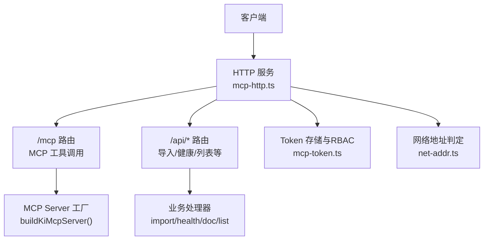
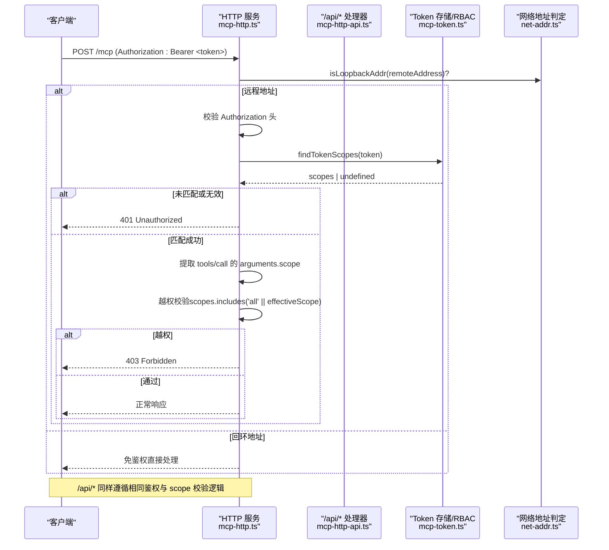
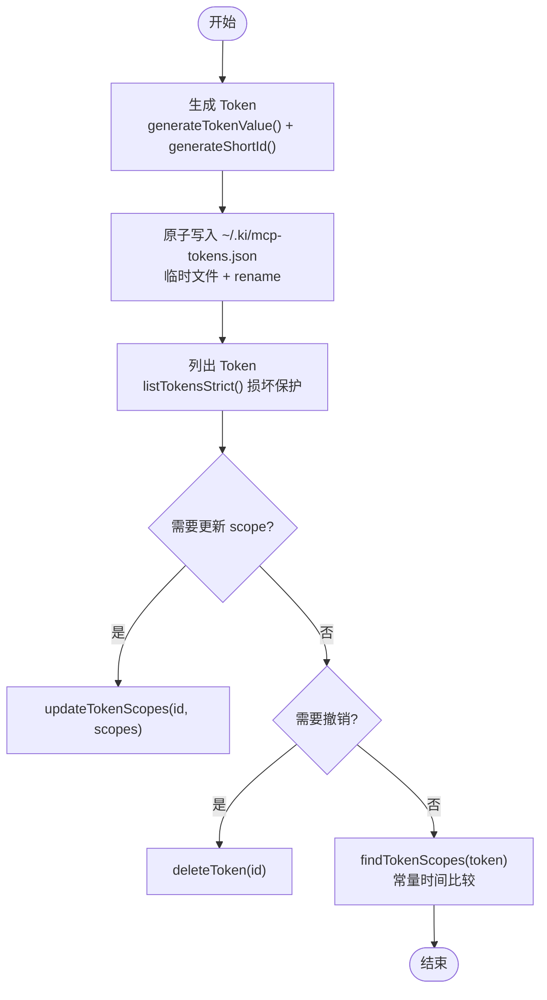
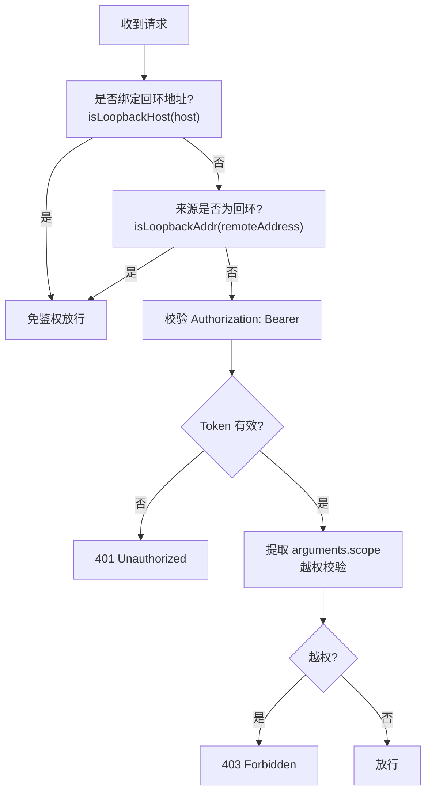
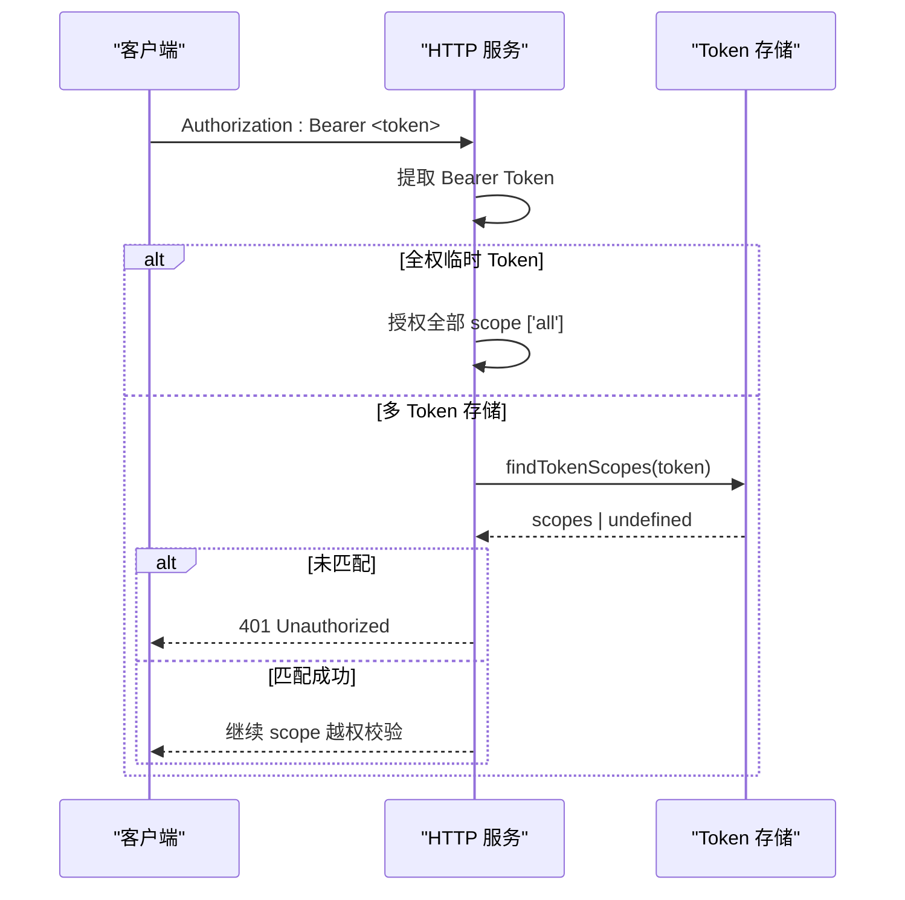
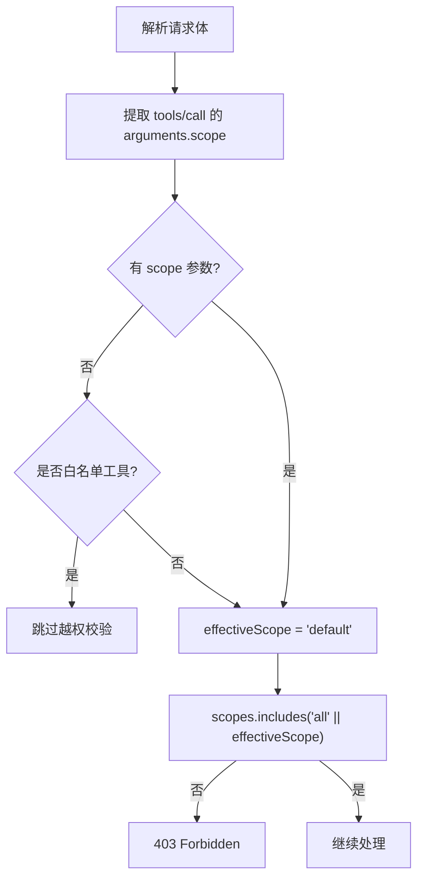
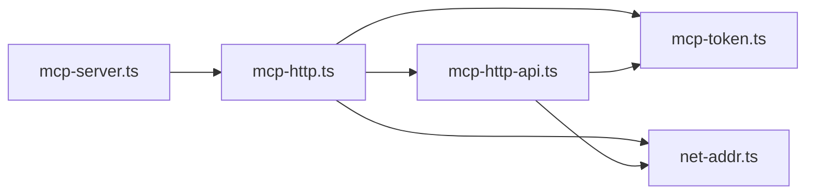

# 认证与安全

<cite>
**本文引用的文件**
- [src/lib/mcp-token.ts](file://src/lib/mcp-token.ts)
- [src/lib/mcp-http.ts](file://src/lib/mcp-http.ts)
- [src/lib/mcp-http-api.ts](file://src/lib/mcp-http-api.ts)
- [src/lib/net-addr.ts](file://src/lib/net-addr.ts)
- [src/mcp-server.ts](file://src/mcp-server.ts)
- [test/mcp-token.test.ts](file://test/mcp-token.test.ts)
- [docs/cli.md](file://docs/cli.md)
</cite>

## 目录
1. [简介](#简介)
2. [项目结构](#项目结构)
3. [核心组件](#核心组件)
4. [架构总览](#架构总览)
5. [详细组件分析](#详细组件分析)
6. [依赖关系分析](#依赖关系分析)
7. [性能与安全性考量](#性能与安全性考量)
8. [故障排查指南](#故障排查指南)
9. [结论](#结论)
10. [附录](#附录)

## 简介
本章节面向 MCP（Model Context Protocol）服务的认证与安全机制，系统性说明 Token 的生成、管理、更新与撤销流程；解释回环地址免鉴权与远程地址强制鉴权的安全策略；明确 Authorization 头部格式与验证过程；并给出安全最佳实践与常见问题排查方法。

## 项目结构
围绕认证与安全的关键代码分布在以下模块：
- Token 存储与 RBAC 授权：mcp-token.ts
- HTTP 传输与鉴权网关：mcp-http.ts
- /api/* 扩展接口鉴权：mcp-http-api.ts
- 网络地址判定（回环/非回环）：net-addr.ts
- CLI 入口与命令分发（含 token 子命令）：mcp-server.ts
- 测试与文档：test/mcp-token.test.ts、docs/cli.md

图表来源
- [src/lib/mcp-http.ts:412-499](file://src/lib/mcp-http.ts#L412-L499)
- [src/lib/mcp-http-api.ts:216-272](file://src/lib/mcp-http-api.ts#L216-L272)
- [src/lib/mcp-token.ts:245-259](file://src/lib/mcp-token.ts#L245-L259)
- [src/lib/net-addr.ts:7-34](file://src/lib/net-addr.ts#L7-L34)

章节来源
- [src/lib/mcp-http.ts:1-115](file://src/lib/mcp-http.ts#L1-L115)
- [src/lib/mcp-http-api.ts:1-50](file://src/lib/mcp-http-api.ts#L1-L50)
- [src/lib/mcp-token.ts:1-50](file://src/lib/mcp-token.ts#L1-L50)
- [src/lib/net-addr.ts:1-35](file://src/lib/net-addr.ts#L1-L35)
- [src/mcp-server.ts:83-107](file://src/mcp-server.ts#L83-L107)

## 核心组件
- Token 存储与 RBAC 授权（mcp-token.ts）
  - 多 Token 存储文件：~/.ki/mcp-tokens.json（权限 0600）
  - Token 记录包含短 ID、明文、授权 scope 集合、创建时间
  - 提供生成、列出、更新、删除、查找授权 scope、计数等能力
  - 使用常量时间比较避免时序侧信道泄露
- HTTP 鉴权网关（mcp-http.ts）
  - 默认绑定 127.0.0.1:7423，回环绑定免鉴权
  - 非回环绑定强制要求 Authorization: Bearer <token>
  - 解析 Token 得到授权 scope 集合，对 tools/call 的 arguments.scope 做越权校验
  - 会话管理与空闲回收、DNS rebinding 保护、健康检查端点
- /api/* 扩展接口鉴权（mcp-http-api.ts）
  - 复用同一鉴权策略：回环免鉴权，远程需 Bearer Token
  - 对 query/body 中的 scope 参数进行越权校验
  - 上传与导入流程受控目录与白名单限制
- 网络地址判定（net-addr.ts）
  - isLoopbackHost：判断服务是否绑定在回环地址
  - isLoopbackAddr：判断请求来源是否为本地回环地址（支持 IPv4/IPv6/映射）
- CLI 入口（mcp-server.ts）
  - ki mcp --http 启动 HTTP 单例
  - ki mcp token generate/update/delete/list 管理 Token
  - 非回环模式强制要求可鉴权（环境变量或托管 Token）

章节来源
- [src/lib/mcp-token.ts:20-50](file://src/lib/mcp-token.ts#L20-L50)
- [src/lib/mcp-http.ts:36-84](file://src/lib/mcp-http.ts#L36-L84)
- [src/lib/mcp-http-api.ts:203-245](file://src/lib/mcp-http-api.ts#L203-L245)
- [src/lib/net-addr.ts:7-34](file://src/lib/net-addr.ts#L7-L34)
- [src/mcp-server.ts:137-212](file://src/mcp-server.ts#L137-L212)

## 架构总览
下图展示从客户端到 MCP 工具调用的完整鉴权与授权链路：

图表来源
- [src/lib/mcp-http.ts:454-499](file://src/lib/mcp-http.ts#L454-L499)
- [src/lib/mcp-http-api.ts:222-258](file://src/lib/mcp-http-api.ts#L222-L258)
- [src/lib/mcp-token.ts:245-259](file://src/lib/mcp-token.ts#L245-L259)
- [src/lib/net-addr.ts:20-34](file://src/lib/net-addr.ts#L20-L34)

## 详细组件分析

### Token 生命周期管理（生成、管理、更新、撤销）
- 生成
  - 使用强随机值生成 Token 明文（32 字节熵，base64url）
  - 生成短 ID（8 位 base62，去除易混淆字符）
  - 写入 ~/.ki/mcp-tokens.json（原子写 + 0600 权限）
  - 必须显式指定 --scope（单个/多个/all），缺省报错
- 列出
  - 严格读取：若文件损坏则抛错（防止静默覆盖丢失数据）
  - 输出包含短 ID、明文、授权 scope、创建时间（用户明确要求时回显）
- 更新
  - 按短 ID 修改授权 scope 集合
  - 不存在时报错（TOKEN_NOT_FOUND）
- 删除
  - 按短 ID 删除 Token，立即失效
  - 不存在时报错（TOKEN_NOT_FOUND）
- 查询授权
  - 遍历所有记录，使用常量时间比较匹配 Token 明文
  - 返回对应记录的 scopes；未命中返回 undefined

图表来源
- [src/lib/mcp-token.ts:55-95](file://src/lib/mcp-token.ts#L55-L95)
- [src/lib/mcp-token.ts:124-176](file://src/lib/mcp-token.ts#L124-L176)
- [src/lib/mcp-token.ts:178-238](file://src/lib/mcp-token.ts#L178-L238)
- [src/lib/mcp-token.ts:240-264](file://src/lib/mcp-token.ts#L240-L264)

章节来源
- [src/lib/mcp-token.ts:55-95](file://src/lib/mcp-token.ts#L55-L95)
- [src/lib/mcp-token.ts:124-176](file://src/lib/mcp-token.ts#L124-L176)
- [src/lib/mcp-token.ts:178-238](file://src/lib/mcp-token.ts#L178-L238)
- [src/lib/mcp-token.ts:240-264](file://src/lib/mcp-token.ts#L240-L264)
- [test/mcp-token.test.ts:43-53](file://test/mcp-token.test.ts#L43-L53)

### 鉴权策略：回环免鉴权 vs 远程强制鉴权
- 绑定地址判定
  - isLoopbackHost(host)：判断服务是否绑定在回环地址（127.0.0.1/::1/localhost/[::1]）
  - 默认绑定 127.0.0.1，开箱即用且免鉴权
- 请求来源判定
  - isLoopbackAddr(addr)：判断请求来源是否为本地回环地址
  - 支持 IPv4、IPv6、IPv4 映射到 IPv6 的场景
- 鉴权开关
  - authEnabled = !isLoopbackHost(host)
  - 远程来源（!isLoopbackAddr(remoteAddress)）且 authEnabled=true 时，必须携带 Authorization: Bearer <token>
- 全权临时 Token
  - --token 或 KI_MCP_TOKEN 传入的进程级 Token，优先级高于多 Token 存储
  - 全权临时 Token 等价于授权全部 scope（['all']）

图表来源
- [src/lib/net-addr.ts:7-34](file://src/lib/net-addr.ts#L7-L34)
- [src/lib/mcp-http.ts:676-688](file://src/lib/mcp-http.ts#L676-L688)
- [src/lib/mcp-http.ts:454-487](file://src/lib/mcp-http.ts#L454-L487)

章节来源
- [src/lib/net-addr.ts:7-34](file://src/lib/net-addr.ts#L7-L34)
- [src/lib/mcp-http.ts:676-688](file://src/lib/mcp-http.ts#L676-L688)
- [src/lib/mcp-http.ts:454-487](file://src/lib/mcp-http.ts#L454-L487)

### Authorization 头部格式与验证过程
- 格式要求
  - Authorization: Bearer <token>
  - 必须为字符串，以 "Bearer " 开头，后接 Token 明文
- 验证过程
  - 提取 Bearer Token
  - 优先匹配全权临时 Token（--token/KI_MCP_TOKEN）
  - 否则查多 Token 存储（findTokenScopes）
  - 使用常量时间比较避免时序攻击
  - 未匹配或无效返回 401 Unauthorized
- 错误日志
  - 服务端 stderr 记录鉴权失败次数与原因
  - /healthz 暴露鉴权失败计数，便于运维排查

图表来源
- [src/lib/mcp-http.ts:458-487](file://src/lib/mcp-http.ts#L458-L487)
- [src/lib/mcp-token.ts:245-259](file://src/lib/mcp-token.ts#L245-L259)

章节来源
- [src/lib/mcp-http.ts:458-487](file://src/lib/mcp-http.ts#L458-L487)
- [src/lib/mcp-token.ts:245-259](file://src/lib/mcp-token.ts#L245-L259)

### Scope 越权校验与工具白名单
- 统一拦截点
  - handleMcpPost 中统一校验 tools/call 的 arguments.scope
  - 所有工具 scope 参数位于 arguments.scope 顶层，缺省 'default'
- 白名单工具
  - SCOPE_LESS_TOOLS：ki_scope_list、ki_manage_index_list
  - 这些工具无 scope 参数，由工具层按 authScopes 过滤输出
- 越权处理
  - 任一 tools/call 越权即拒绝（含 batch 数组全部项）
  - 返回 403 Forbidden，服务端记录越权日志（脱敏响应体）

图表来源
- [src/lib/mcp-http.ts:111-138](file://src/lib/mcp-http.ts#L111-L138)
- [src/lib/mcp-http.ts:501-526](file://src/lib/mcp-http.ts#L501-L526)

章节来源
- [src/lib/mcp-http.ts:111-138](file://src/lib/mcp-http.ts#L111-L138)
- [src/lib/mcp-http.ts:501-526](file://src/lib/mcp-http.ts#L501-L526)

### /api/* 扩展接口鉴权
- 复用同一鉴权策略
  - 回环免鉴权，远程需 Bearer Token
  - 解析 Token 得到授权 scope 集合
- 越权校验
  - GET /api/tags、/api/doc/list：query scope 越权校验
  - POST /api/import/upload、/api/import/run：body scope 越权校验
- 安全限制
  - 上传文件扩展名白名单（.md/.markdown/.mdx）
  - 单文件大小上限（1MB）
  - 受控目录上传（~/.ki/import-uploads/<uploadId>/）

章节来源
- [src/lib/mcp-http-api.ts:216-272](file://src/lib/mcp-http-api.ts#L216-L272)
- [src/lib/mcp-http-api.ts:371-450](file://src/lib/mcp-http-api.ts#L371-L450)
- [src/lib/mcp-http-api.ts:452-506](file://src/lib/mcp-http-api.ts#L452-L506)

## 依赖关系分析
- mcp-http.ts 依赖
  - mcp-token.ts：Token 查找与授权 scope 解析
  - net-addr.ts：网络地址判定
  - mcp-http-api.ts：/api/* 路由处理（延迟加载）
- mcp-http-api.ts 依赖
  - mcp-token.ts：Token 查找与授权 scope 解析
  - net-addr.ts：网络地址判定
- mcp-server.ts 依赖
  - mcp-http.ts：HTTP 服务启动与管理
  - mcp-token.ts：Token 管理命令实现

图表来源
- [src/mcp-server.ts:24-47](file://src/mcp-server.ts#L24-L47)
- [src/lib/mcp-http.ts:24-34](file://src/lib/mcp-http.ts#L24-L34)
- [src/lib/mcp-http-api.ts:18-29](file://src/lib/mcp-http-api.ts#L18-L29)

章节来源
- [src/mcp-server.ts:24-47](file://src/mcp-server.ts#L24-L47)
- [src/lib/mcp-http.ts:24-34](file://src/lib/mcp-http.ts#L24-L34)
- [src/lib/mcp-http-api.ts:18-29](file://src/lib/mcp-http-api.ts#L18-L29)

## 性能与安全性考量
- 性能优化
  - 常量时间比较避免时序攻击（crypto.timingSafeEqual）
  - 原子写 Token 存储文件（临时文件 + rename）
  - 会话空闲回收与最大并发限制
  - 延迟加载 /api/* 处理器避免初始化重依赖链
- 安全加固
  - 回环绑定默认免鉴权，远程绑定强制鉴权
  - Token 明文仅落盘于 0600 权限文件
  - DNS rebinding 保护（allowedHosts）
  - 上传文件扩展名白名单与大小限制
  - 受控目录上传防路径穿越
  - 越权响应体脱敏（不下发具体 scope 名）

章节来源
- [src/lib/mcp-token.ts:149-176](file://src/lib/mcp-token.ts#L149-L176)
- [src/lib/mcp-http.ts:46-56](file://src/lib/mcp-http.ts#L46-L56)
- [src/lib/mcp-http-api.ts:33-42](file://src/lib/mcp-http-api.ts#L33-L42)

## 故障排查指南
- 鉴权失败排查
  - 检查 Authorization: Bearer 头是否正确配置
  - 核对 Token 明文是否与 ki mcp token list 输出完全一致
  - 查看服务端 stderr 日志中的鉴权失败次数与原因
  - 通过 /healthz 查看鉴权失败计数
- 越权问题排查
  - 确认 Token 授权 scope 是否包含请求的 effectiveScope
  - 检查 tools/call 的 arguments.scope 是否正确传递
  - 白名单工具（ki_scope_list、ki_manage_index_list）不受此规则影响
- Token 存储问题
  - 文件损坏时会抛出 MCP_TOKEN_CORRUPT 错误
  - 使用 ki mcp token list 查看当前 Token 状态
  - 必要时重新生成 Token 并更新 IDE 配置

章节来源
- [src/lib/mcp-http.ts:358-372](file://src/lib/mcp-http.ts#L358-L372)
- [src/lib/mcp-http.ts:632-670](file://src/lib/mcp-http.ts#L632-L670)
- [src/lib/mcp-token.ts:132-147](file://src/lib/mcp-token.ts#L132-L147)

## 结论
本系统实现了基于 Token 的多租户 RBAC 授权机制，通过回环地址免鉴权与远程地址强制鉴权的安全策略，确保 MCP 服务在不同部署场景下的安全性。Token 的生成、管理、更新与撤销流程完善，配合常量时间比较、原子写、越权校验等安全措施，提供了健壮的安全保障。建议在生产环境中始终启用远程鉴权，并定期审计 Token 授权范围。

## 附录
- 常用命令参考
  - ki mcp token generate --scope <scope>：生成授权 Token
  - ki mcp token list：列出所有 Token
  - ki mcp token update <id> --scope <scope>：修改授权 scope
  - ki mcp token delete <id>：删除 Token（立即失效）
- 安全最佳实践
  - 使用 HTTPS 传输 Token（生产环境建议）
  - 定期轮换 Token，最小权限原则
  - 监控鉴权失败日志，及时发现异常访问
  - 限制上传文件类型与大小，防止恶意文件上传

章节来源
- [docs/cli.md:960-976](file://docs/cli.md#L960-L976)
- [src/mcp-server.ts:227-351](file://src/mcp-server.ts#L227-L351)