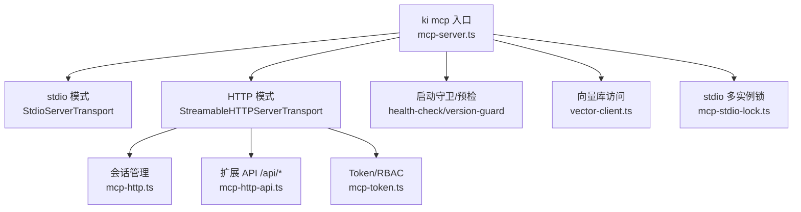
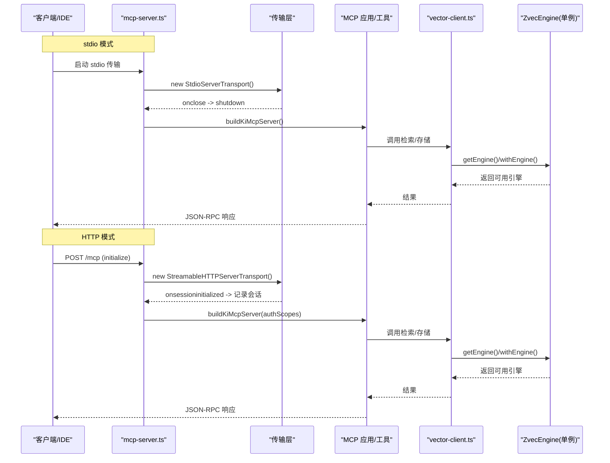
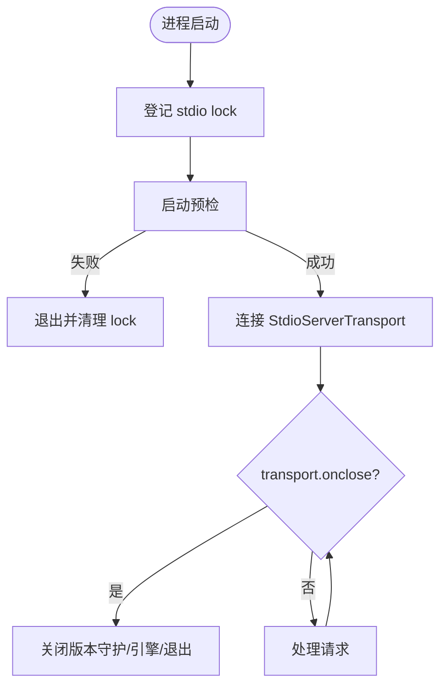
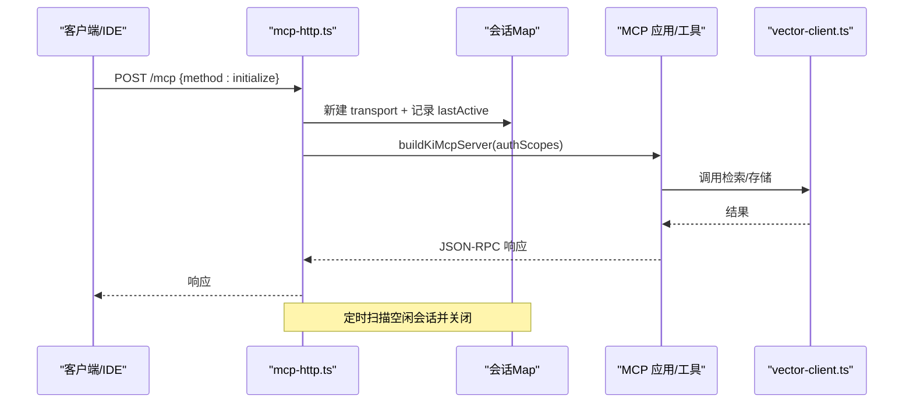
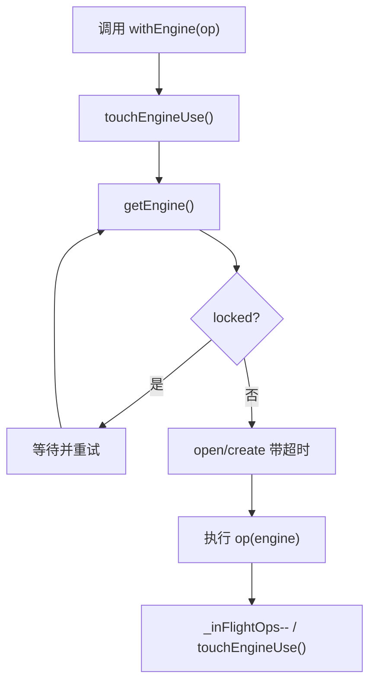
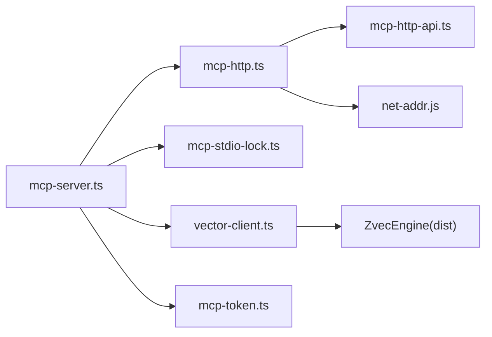

# 连接模式详解

<cite>
**本文引用的文件**
- [mcp-server.ts](file://src/mcp-server.ts)
- [mcp-http.ts](file://src/lib/mcp-http.ts)
- [mcp-http-api.ts](file://src/lib/mcp-http-api.ts)
- [mcp-stdio-lock.ts](file://src/lib/mcp-stdio-lock.ts)
- [vector-client.ts](file://src/lib/vector-client.ts)
- [mcp-token.ts](file://src/lib/mcp-token.ts)
- [mcp-http.md](file://docs/mcp-http.md)
</cite>

## 目录
1. [简介](#简介)
2. [项目结构](#项目结构)
3. [核心组件](#核心组件)
4. [架构总览](#架构总览)
5. [详细组件分析](#详细组件分析)
6. [依赖关系分析](#依赖关系分析)
7. [性能考量](#性能考量)
8. [故障排查指南](#故障排查指南)
9. [结论](#结论)
10. [附录](#附录)

## 简介
本文件面向“连接模式”的深入说明，覆盖两种运行形态：
- stdio 模式：单客户端单进程，通过标准输入/输出与 MCP SDK 通信。
- HTTP 模式：单进程共享服务，基于 Streamable HTTP 传输，支持多 IDE/多客户端复用同一持锁进程，提供鉴权、会话管理、静态页面与扩展 API。

重点包括：
- 进程间通信机制、生命周期管理与资源释放（stdio）。
- REST API 设计、会话管理、负载均衡策略（HTTP）。
- 高级特性：连接池、心跳检测、断线重连的实现原理与使用指南。
- 性能对比分析与选择建议。

## 项目结构
围绕连接模式的核心代码集中在以下模块：
- 入口与调度：mcp-server.ts
- HTTP 传输与会话：mcp-http.ts
- 扩展 API：mcp-http-api.ts
- stdio 多实例锁：mcp-stdio-lock.ts
- 向量引擎封装与空闲释放：vector-client.ts
- Token 与 RBAC：mcp-token.ts
- 用户文档：mcp-http.md

图表来源
- [mcp-server.ts:492-734](file://src/mcp-server.ts#L492-L734)
- [mcp-http.ts:344-607](file://src/lib/mcp-http.ts#L344-L607)
- [mcp-http-api.ts:216-272](file://src/lib/mcp-http-api.ts#L216-L272)
- [vector-client.ts:164-181](file://src/lib/vector-client.ts#L164-L181)
- [mcp-token.ts:245-259](file://src/lib/mcp-token.ts#L245-L259)
- [mcp-stdio-lock.ts:118-144](file://src/lib/mcp-stdio-lock.ts#L118-L144)

章节来源
- [mcp-server.ts:492-734](file://src/mcp-server.ts#L492-L734)
- [mcp-http.ts:344-607](file://src/lib/mcp-http.ts#L344-L607)
- [mcp-http-api.ts:216-272](file://src/lib/mcp-http-api.ts#L216-L272)
- [mcp-stdio-lock.ts:118-144](file://src/lib/mcp-stdio-lock.ts#L118-L144)
- [vector-client.ts:164-181](file://src/lib/vector-client.ts#L164-L181)
- [mcp-token.ts:245-259](file://src/lib/mcp-token.ts#L245-L259)
- [mcp-http.md:1-273](file://docs/mcp-http.md#L1-L273)

## 核心组件
- 入口与模式分发：根据命令行参数决定进入 stdio 或 HTTP 路径，并执行启动守卫与预检。
- stdio 传输：基于 StdioServerTransport，进程级生命周期由 SIGINT/SIGTERM 与 transport.onclose 控制。
- HTTP 传输与会话：每个 initialize 创建独立 transport + McpServer，共享 vector-client 的单例 engine；支持会话上限与空闲回收。
- 扩展 API：/api/* 路由提供健康报告、文档列表、导入上传/执行/状态查询等能力。
- 向量库访问：进程内单例 engine，带撞锁重试、空闲释放锁、在途保护与自愈重试。
- 鉴权与授权：按绑定地址条件启用 Bearer Token，RBAC 校验 scope。
- stdio 多实例锁：每实例独立 lock 文件，支持多实例共存与冲突提示。

章节来源
- [mcp-server.ts:492-734](file://src/mcp-server.ts#L492-L734)
- [mcp-http.ts:344-607](file://src/lib/mcp-http.ts#L344-L607)
- [mcp-http-api.ts:216-272](file://src/lib/mcp-http-api.ts#L216-L272)
- [vector-client.ts:164-181](file://src/lib/vector-client.ts#L164-L181)
- [mcp-token.ts:245-259](file://src/lib/mcp-token.ts#L245-L259)
- [mcp-stdio-lock.ts:118-144](file://src/lib/mcp-stdio-lock.ts#L118-L144)

## 架构总览
下图展示两种模式的请求流与关键组件交互。

图表来源
- [mcp-server.ts:687-734](file://src/mcp-server.ts#L687-L734)
- [mcp-http.ts:501-577](file://src/lib/mcp-http.ts#L501-L577)
- [vector-client.ts:314-340](file://src/lib/vector-client.ts#L314-L340)

## 详细组件分析

### stdio 模式：进程间通信、生命周期与资源释放
- 通信机制
  - 使用 StdioServerTransport，通过 stdin/stdout 进行 JSON-RPC 消息交换。
  - 每个 stdio 实例独立进程，适合单客户端场景。
- 生命周期管理
  - 启动时登记 stdio lock（~/.ki/mcp-stdio-<pid>.lock），供 stop/status/restart 定位。
  - 监听 SIGINT/SIGTERM 与 transport.onclose，触发统一关闭流程。
- 资源释放
  - 关闭流程包含停止版本守护、关闭向量引擎、退出进程。
  - 多实例错开共享：空闲超时后自动释放向量库锁，撞锁方重试等待。

图表来源
- [mcp-server.ts:647-734](file://src/mcp-server.ts#L647-L734)
- [mcp-stdio-lock.ts:118-144](file://src/lib/mcp-stdio-lock.ts#L118-L144)
- [vector-client.ts:164-181](file://src/lib/vector-client.ts#L164-L181)

章节来源
- [mcp-server.ts:647-734](file://src/mcp-server.ts#L647-L734)
- [mcp-stdio-lock.ts:118-144](file://src/lib/mcp-stdio-lock.ts#L118-L144)
- [vector-client.ts:164-181](file://src/lib/vector-client.ts#L164-L181)

### HTTP 模式：REST API、会话管理与负载均衡
- REST API 设计
  - /healthz：免鉴权健康检查，用于幂等单例探活与运维诊断。
  - /api/*：扩展接口（健康报告、文档列表、导入上传/执行/状态），与 MCP 会话隔离。
  - /mcp：MCP Streamable HTTP 传输端点，支持 GET/POST/DELETE 会话操作。
- 会话管理
  - 每个 initialize 新建 transport + McpServer，共享 vector-client 单例 engine。
  - 会话上限默认 256，空闲 30 分钟回收，防止内存泄漏。
  - 支持 DNS rebinding 保护（allowedHosts）。
- 负载均衡策略
  - 单进程单例承载所有会话，天然集中式负载；可通过反向代理（Nginx/Caddy）实现 TLS 终止与外部负载均衡。
  - 多 IDE 必须使用完全一致的 URL 接入，避免重复拉起进程导致锁冲突。

图表来源
- [mcp-http.ts:501-577](file://src/lib/mcp-http.ts#L501-L577)
- [mcp-http.ts:381-392](file://src/lib/mcp-http.ts#L381-L392)
- [mcp-http-api.ts:216-272](file://src/lib/mcp-http-api.ts#L216-L272)

章节来源
- [mcp-http.ts:501-577](file://src/lib/mcp-http.ts#L501-L577)
- [mcp-http.ts:381-392](file://src/lib/mcp-http.ts#L381-L392)
- [mcp-http-api.ts:216-272](file://src/lib/mcp-http-api.ts#L216-L272)

### 鉴权与 RBAC
- 条件鉴权：回环绑定免鉴权，非回环绑定强制 Bearer Token。
- Token 来源优先级：--token/KI_MCP_TOKEN（全权临时）> 多 Token 存储（~/.ki/mcp-tokens.json）。
- scope 越权校验：拦截 tools/call 的 arguments.scope（缺省 'default'），枚举工具走工具层过滤。
- 安全日志：鉴权失败限流输出到 stderr，便于排查。

章节来源
- [mcp-http.ts:454-487](file://src/lib/mcp-http.ts#L454-L487)
- [mcp-token.ts:245-259](file://src/lib/mcp-token.ts#L245-L259)
- [mcp-http.md:132-146](file://docs/mcp-http.md#L132-L146)

### 向量库访问与空闲释放锁
- 进程内单例 engine：getEngine() 惰性打开，open/create 串行化并带超时。
- 撞锁重试：probeWithRetry 检测到 locked 时等待并重试（最多 3 次）。
- 空闲释放锁：enableIdleClose 启用后，空闲超时自动 closeEngine，让其他实例/CLI 错开共享。
- 在途保护：withEngine 包装在途计数，避免空闲释放中断正在执行的 embedding 网络阶段。

图表来源
- [vector-client.ts:93-104](file://src/lib/vector-client.ts#L93-L104)
- [vector-client.ts:164-181](file://src/lib/vector-client.ts#L164-L181)
- [vector-client.ts:314-340](file://src/lib/vector-client.ts#L314-L340)
- [vector-client.ts:389-407](file://src/lib/vector-client.ts#L389-L407)

章节来源
- [vector-client.ts:93-104](file://src/lib/vector-client.ts#L93-L104)
- [vector-client.ts:164-181](file://src/lib/vector-client.ts#L164-L181)
- [vector-client.ts:314-340](file://src/lib/vector-client.ts#L314-L340)
- [vector-client.ts:389-407](file://src/lib/vector-client.ts#L389-L407)

### 高级特性：连接池、心跳检测、断线重连
- 连接池
  - 向量引擎采用进程内单例缓存（_enginePromise），避免频繁 open/close。
  - HTTP 会话 Map 维护活跃 transport，限制最大并发会话数。
- 心跳检测
  - /healthz 提供轻量健康检查，用于幂等单例探活与运维诊断。
  - 服务端统计鉴权失败次数并在 /healthz 暴露，辅助排查。
- 断线重连
  - stdio：transport.onclose 触发关闭流程；多实例靠空闲释放锁与撞锁重试错开共享。
  - HTTP：空闲会话回收（30 分钟），客户端需重新 initialize；SSE/长连接通过 closeAllConnections 强制断开。
  - 向量层：worker 不可用时重置 engine 并重试一次（自愈）。

章节来源
- [mcp-http.ts:195-230](file://src/lib/mcp-http.ts#L195-L230)
- [mcp-http.ts:381-392](file://src/lib/mcp-http.ts#L381-L392)
- [vector-client.ts:368-407](file://src/lib/vector-client.ts#L368-L407)
- [mcp-http.md:234-242](file://docs/mcp-http.md#L234-L242)

## 依赖关系分析
- mcp-server.ts 依赖：
  - mcp-http.ts（HTTP 模式）、mcp-stdio-lock.ts（stdio 锁）、vector-client.ts（向量访问）、mcp-token.ts（鉴权）、health-check/version-guard（预检与版本守护）。
- mcp-http.ts 依赖：
  - mcp-http-api.ts（延迟加载）、mcp-token.ts（RBAC）、net-addr.js（地址判定）。
- vector-client.ts 依赖：
  - ZvecEngine（dist 构建产物）、config/scope/interrupt（配置与上下文）。

图表来源
- [mcp-server.ts:492-734](file://src/mcp-server.ts#L492-L734)
- [mcp-http.ts:344-607](file://src/lib/mcp-http.ts#L344-L607)
- [vector-client.ts:314-340](file://src/lib/vector-client.ts#L314-L340)

章节来源
- [mcp-server.ts:492-734](file://src/mcp-server.ts#L492-L734)
- [mcp-http.ts:344-607](file://src/lib/mcp-http.ts#L344-L607)
- [vector-client.ts:314-340](file://src/lib/vector-client.ts#L314-L340)

## 性能考量
- stdio 模式
  - 优点：低开销、无网络栈、适合本地单客户端。
  - 缺点：多 IDE 场景下存在向量库锁冲突风险；需依赖空闲释放锁与撞锁重试。
- HTTP 模式
  - 优点：单进程共享持锁，彻底消除锁冲突；支持多客户端复用；可扩展反向代理实现负载均衡。
  - 缺点：需要鉴权（非回环）；会话管理需关注上限与空闲回收。
- 向量层优化
  - 单例 engine + 串行化 open/create，避免原生竞态阻塞。
  - 空闲释放锁降低多实例争用；撞锁重试提升可用性。
  - 在途保护确保 idle close 不中断正在进行的 embedding 网络阶段。

选择建议
- 单 IDE/本地调试：stdio 模式更简单直接。
- 多 IDE/跨机协作：HTTP 模式优先，配合反向代理与鉴权。
- 高并发/多租户：HTTP 模式 + RBAC + 反向代理负载均衡。

[本节为通用指导，无需特定文件引用]

## 故障排查指南
- 端口占用
  - EADDRINUSE：探活未命中健康实例，可能是非 ki 进程占用或残留实例；更换端口或排查占用进程。
- 权限问题
  - EACCES：<1024 端口需提权；改用高位端口。
- 地址解析
  - EADDRNOTAVAIL/ENOTFOUND：检查 --host 是否为合法 IP 或可解析主机名。
- 鉴权失败
  - 401：核对 Authorization: Bearer 与 token list 输出一致；服务端 stderr 有失败原因日志。
- 越权拒绝
  - 403：Token 有效但 scope 不在授权范围；用 token update 扩大权限或确认请求 scope 正确。
- 向量库锁定
  - LOCKED：等待对方释放或停止相关进程；必要时重建向量库。

章节来源
- [mcp-http.ts:609-630](file://src/lib/mcp-http.ts#L609-L630)
- [mcp-http.md:224-233](file://docs/mcp-http.md#L224-L233)
- [vector-client.ts:74-86](file://src/lib/vector-client.ts#L74-L86)

## 结论
- stdio 模式适合本地单客户端场景，具备简洁的进程生命周期与资源释放机制。
- HTTP 模式通过单进程共享持锁、会话管理与鉴权，解决多 IDE 锁冲突与远程协作需求。
- 向量层提供连接池（单例 engine）、心跳（/healthz）与断线重连（空闲释放锁 + 撞锁重试 + 自愈重试）等高级特性。
- 生产环境推荐 HTTP 模式 + 反向代理 + RBAC，结合 --status 与 /healthz 进行运维监控。

[本节为总结性内容，无需特定文件引用]

## 附录
- 快速开始与命令参考见 docs/mcp-http.md。
- 配置文件默认值与 CLI 参数优先级见 docs/mcp-http.md。
- 一键关闭与重启流程见 docs/mcp-http.md。

章节来源
- [mcp-http.md:1-273](file://docs/mcp-http.md#L1-L273)