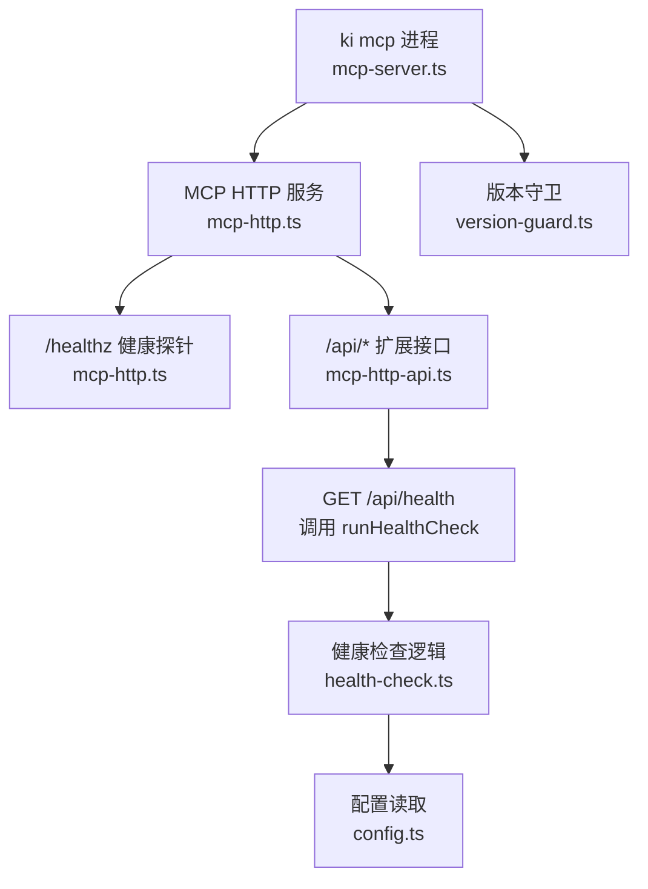
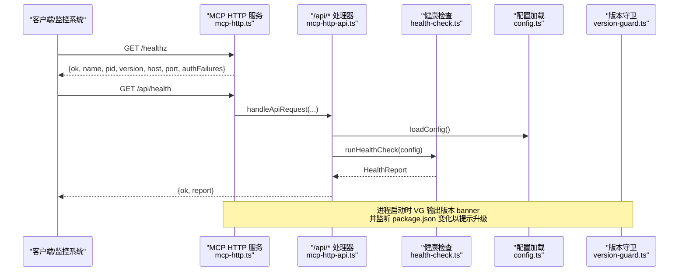
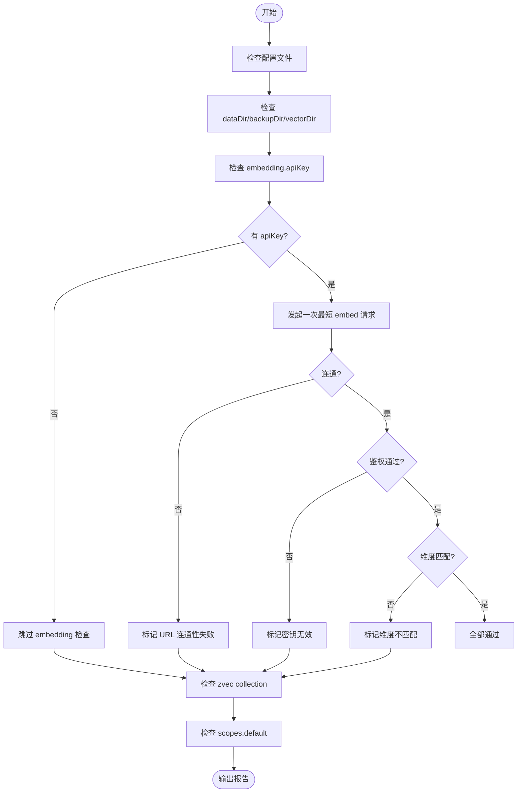
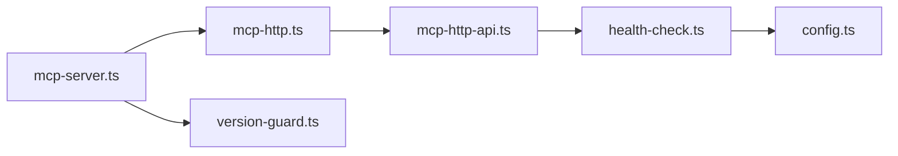

# 健康检查与监控

<cite>
**本文引用的文件**
- [health-check.ts](file://src/lib/health-check.ts)
- [version-guard.ts](file://src/lib/version-guard.ts)
- [mcp-http-api.ts](file://src/lib/mcp-http-api.ts)
- [mcp-http.ts](file://src/lib/mcp-http.ts)
- [config.ts](file://src/lib/config.ts)
- [mcp-server.ts](file://src/mcp-server.ts)
- [mcp-http.md](file://docs/mcp-http.md)
</cite>

## 目录
1. [简介](#简介)
2. [项目结构](#项目结构)
3. [核心组件](#核心组件)
4. [架构总览](#架构总览)
5. [详细组件分析](#详细组件分析)
6. [依赖关系分析](#依赖关系分析)
7. [性能考量](#性能考量)
8. [故障诊断指南](#故障诊断指南)
9. [结论](#结论)
10. [附录](#附录)

## 简介
本文件面向生产环境，系统性说明 ki MCP 服务的健康检查与监控方案。内容覆盖：
- 健康检查端点的设计与实现（服务状态、依赖组件探测、指标收集）
- 版本守卫机制（升级检测与提示）
- HTTP 服务健康接口、监控指标与日志策略
- 生产环境的监控配置、告警规则与故障诊断方法
- 服务可用性、错误率与资源使用的全链路监控方案

## 项目结构
围绕健康与监控的关键代码集中在以下模块：
- 健康检查逻辑：src/lib/health-check.ts
- 版本守卫：src/lib/version-guard.ts
- HTTP 服务与 /healthz：src/lib/mcp-http.ts
- /api/* 扩展接口（含 /api/health）：src/lib/mcp-http-api.ts
- 配置加载（embedding/vectorDir 等）：src/lib/config.ts
- MCP 启动入口（集成 health check 与 version guard）：src/mcp-server.ts
- 用户文档（HTTP 模式、鉴权、单例守护）：docs/mcp-http.md

图表来源
- [mcp-server.ts:1-120](file://src/mcp-server.ts#L1-L120)
- [mcp-http.ts:412-442](file://src/lib/mcp-http.ts#L412-L442)
- [mcp-http-api.ts:260-288](file://src/lib/mcp-http-api.ts#L260-L288)
- [health-check.ts:148-213](file://src/lib/health-check.ts#L148-L213)
- [config.ts:148-175](file://src/lib/config.ts#L148-L175)

章节来源
- [mcp-server.ts:1-120](file://src/mcp-server.ts#L1-L120)
- [mcp-http.ts:412-442](file://src/lib/mcp-http.ts#L412-L442)
- [mcp-http-api.ts:260-288](file://src/lib/mcp-http-api.ts#L260-L288)
- [health-check.ts:148-213](file://src/lib/health-check.ts#L148-L213)
- [config.ts:148-175](file://src/lib/config.ts#L148-L175)
- [mcp-http.md:147-157](file://docs/mcp-http.md#L147-L157)

## 核心组件
- 健康检查器（runHealthCheck）：对配置文件、数据/备份/向量目录、embedding API 连通性、密钥有效性、维度匹配、zvec collection 存在性、scopes.default 进行只读检查，返回结构化报告。
- 版本守卫（startVersionGuard）：启动时打印版本/PID/时间，监听 package.json 变更，检测到升级后输出告警并提示重启。
- HTTP 健康探针（/healthz）：免鉴权，返回服务名、PID、版本、绑定地址与鉴权失败计数，用于单例探活与运维巡检。
- /api/health：返回完整健康报告（包含 embedding 三合一检查），带超时保护。
- 鉴权与 scope 越权拦截：非回环绑定时强制 Bearer Token；工具与 /api 接口按授权 scope 校验，越权记录 stderr 并返回 403。

章节来源
- [health-check.ts:148-213](file://src/lib/health-check.ts#L148-L213)
- [version-guard.ts:31-65](file://src/lib/version-guard.ts#L31-L65)
- [mcp-http.ts:418-428](file://src/lib/mcp-http.ts#L418-L428)
- [mcp-http-api.ts:276-288](file://src/lib/mcp-http-api.ts#L276-L288)
- [mcp-http.ts:454-487](file://src/lib/mcp-http.ts#L454-L487)

## 架构总览
下图展示从请求到健康检查的端到端流程，以及版本守卫在进程生命周期中的作用。

图表来源
- [mcp-http.ts:418-428](file://src/lib/mcp-http.ts#L418-L428)
- [mcp-http-api.ts:276-288](file://src/lib/mcp-http-api.ts#L276-L288)
- [health-check.ts:148-213](file://src/lib/health-check.ts#L148-L213)
- [config.ts:148-175](file://src/lib/config.ts#L148-L175)
- [version-guard.ts:31-65](file://src/lib/version-guard.ts#L31-L65)

## 详细组件分析

### 健康检查器（runHealthCheck）
- 检查项
  - 配置文件是否存在且可解析
  - dataDir、backupDir、vectorDir 存在且可写
  - embedding.apiKey 是否已配置
  - embedding 三合一检查（URL 连通性、密钥有效性、维度匹配），通过一次最短请求完成
  - zvec collection 是否已创建（目录非空判定）
  - scopes.default 是否配置
- 结果结构
  - items：每项包含 name、status（pass/warn/fail）、detail
  - pass/warn/fail：统计计数
- 关键特性
  - 纯只读，不修改任何配置或数据
  - 网络探测具备超时与重试上限，避免常驻服务被瞬时抖动阻塞
  - 对 zvec 仅做目录级探测，避免与常驻 server 的文件锁冲突

图表来源
- [health-check.ts:52-142](file://src/lib/health-check.ts#L52-L142)
- [health-check.ts:148-213](file://src/lib/health-check.ts#L148-L213)

章节来源
- [health-check.ts:52-142](file://src/lib/health-check.ts#L52-L142)
- [health-check.ts:148-213](file://src/lib/health-check.ts#L148-L213)

### 版本守卫（startVersionGuard）
- 启动时读取 package.json 版本并输出 banner（版本、PID、启动时间）
- 监听 package.json 变更，若版本变化则向 stderr 输出升级告警并提示重启
- 适用于长驻 MCP 场景，避免“改了不生效”的静默问题

章节来源
- [version-guard.ts:17-25](file://src/lib/version-guard.ts#L17-L25)
- [version-guard.ts:31-65](file://src/lib/version-guard.ts#L31-L65)

### HTTP 健康探针（/healthz）
- 免鉴权，供单例探活与外部监控
- 返回字段：ok、name、pid、version、host、port、authFailures（非回环鉴权模式下累计鉴权失败次数）
- 用途：进程存活、实例一致性核对、鉴权问题定位

章节来源
- [mcp-http.ts:418-428](file://src/lib/mcp-http.ts#L418-L428)
- [mcp-http.ts:183-229](file://src/lib/mcp-http.ts#L183-L229)

### /api/health 接口
- 调用 runHealthCheck 获取完整健康报告，带 10s 超时保护
- 返回 { ok: true, report }，report 包含 items 与 pass/warn/fail 计数
- 适合接入 Prometheus/Grafana 或其他监控系统进行周期性巡检

章节来源
- [mcp-http-api.ts:276-288](file://src/lib/mcp-http-api.ts#L276-L288)
- [mcp-http-api.ts:31-43](file://src/lib/mcp-http-api.ts#L31-L43)

### 鉴权与 scope 越权拦截
- 非回环绑定强制 Bearer Token；回环绑定免鉴权
- 工具与 /api 接口均进行 scope 越权校验，越权记录 stderr 并返回 403
- /healthz 免鉴权，便于外部系统探活

章节来源
- [mcp-http.ts:454-487](file://src/lib/mcp-http.ts#L454-L487)
- [mcp-http-api.ts:222-258](file://src/lib/mcp-http-api.ts#L222-L258)

## 依赖关系分析
- mcp-server.ts 负责启动 MCP 服务，集成 health check 与 version guard
- mcp-http.ts 提供 HTTP 传输、/healthz、会话管理、鉴权与静态页面
- mcp-http-api.ts 提供 /api/* 扩展接口，其中 /api/health 依赖 health-check.ts
- health-check.ts 依赖 config.ts 获取 embedding/vectorDir 等配置
- version-guard.ts 独立于 HTTP 层，关注进程级版本感知

图表来源
- [mcp-server.ts:1-120](file://src/mcp-server.ts#L1-L120)
- [mcp-http.ts:412-442](file://src/lib/mcp-http.ts#L412-L442)
- [mcp-http-api.ts:260-288](file://src/lib/mcp-http-api.ts#L260-L288)
- [health-check.ts:148-213](file://src/lib/health-check.ts#L148-L213)
- [config.ts:148-175](file://src/lib/config.ts#L148-L175)
- [version-guard.ts:31-65](file://src/lib/version-guard.ts#L31-L65)

章节来源
- [mcp-server.ts:1-120](file://src/mcp-server.ts#L1-L120)
- [mcp-http.ts:412-442](file://src/lib/mcp-http.ts#L412-L442)
- [mcp-http-api.ts:260-288](file://src/lib/mcp-http-api.ts#L260-L288)
- [health-check.ts:148-213](file://src/lib/health-check.ts#L148-L213)
- [config.ts:148-175](file://src/lib/config.ts#L148-L175)
- [version-guard.ts:31-65](file://src/lib/version-guard.ts#L31-L65)

## 性能考量
- 健康检查耗时控制
  - embedding 探测使用短文本与有限超时/重试，避免冷启动或瞬时拥塞导致长时间阻塞
  - /api/health 整体设置 10s 超时，防止慢依赖拖垮健康检查
- 资源占用
  - 会话上限默认 256，空闲会话定期回收，避免内存泄漏
  - 导入 job 内存 Map 设置最大数量与 TTL，防止无界增长
- 并发与锁
  - 向量库由单进程持锁，HTTP 模式消除多 IDE 锁冲突
  - 优雅退出确保释放向量库锁，避免残留进程

章节来源
- [health-check.ts:52-142](file://src/lib/health-check.ts#L52-L142)
- [mcp-http-api.ts:31-43](file://src/lib/mcp-http-api.ts#L31-L43)
- [mcp-http.ts:46-56](file://src/lib/mcp-http.ts#L46-L56)
- [mcp-http.ts:536-547](file://src/lib/mcp-http.ts#L536-L547)
- [mcp-http.ts:734-766](file://src/lib/mcp-http.ts#L734-L766)

## 故障诊断指南
- 常见问题定位
  - /healthz 不可达：检查端口占用、鉴权模式、防火墙与反向代理
  - /api/health 返回 fail：逐项查看 items.detail，重点关注 embedding 连通性、密钥与维度
  - 鉴权失败（401）：核对 Authorization: Bearer 与托管 token 列表一致；服务端 stderr 会记录失败原因与次数
  - 越权拒绝（403）：确认请求 scope 是否在授权集合内；枚举类工具不受此限制
- 日志与指标
  - 鉴权失败计数：/healthz.authFailures 可用于快速判断是否存在 Token 配置错误
  - 服务端 stderr：记录鉴权失败、scope 越权拦截、启动 banner 与升级告警
- 升级检测
  - 版本守卫会在 package.json 版本变化时输出升级提示，需重启 MCP 服务以加载新代码
- 一键诊断
  - 使用 ki mcp --status 输出 JSON，包含 running、healthz、lock、stdioInstances、managedTokens.count 与 hint

章节来源
- [mcp-http.ts:418-428](file://src/lib/mcp-http.ts#L418-L428)
- [mcp-http.ts:454-487](file://src/lib/mcp-http.ts#L454-L487)
- [version-guard.ts:31-65](file://src/lib/version-guard.ts#L31-L65)
- [mcp-http.md:105-131](file://docs/mcp-http.md#L105-L131)

## 结论
本方案通过 /healthz 与 /api/health 提供分层健康检查能力，结合版本守卫与完善的鉴权/越权拦截，满足生产环境的可用性、可观测性与安全性要求。配合外部监控系统周期性采集 /api/health 与 /healthz，可实现服务可用性、错误率与资源使用的持续监控与告警。

## 附录

### 监控指标与采集建议
- 服务可用性
  - 指标：/healthz 可达性、/api/health 响应码与耗时
  - 采集频率：每 30-60 秒
- 错误率
  - 指标：401/403/5xx 比例、/api/health 中 fail 项数量
  - 告警阈值：连续 N 次失败或错误率超过阈值
- 资源使用
  - 指标：进程内存/CPU（由宿主或容器平台采集）、会话数、导入 job 积压
  - 告警阈值：会话数接近上限、job 队列持续增长

### 告警规则示例
- 健康检查失败：/api/health 返回 fail 项 > 0 持续 3 分钟
- 鉴权失败激增：/healthz.authFailures 在短时间内显著上升
- 服务不可用：/healthz 不可达或返回 ok=false
- 版本不一致：版本守卫输出升级告警未处理

### 生产部署要点
- 绑定地址与鉴权
  - 本机访问：默认 127.0.0.1 免鉴权
  - 远程暴露：必须启用鉴权（Bearer Token），建议前置 TLS 反代与安全组收敛来源 IP
- 单例守护
  - 幂等启动：重复执行复用健康实例，避免多进程争抢向量库锁
  - 优雅退出：SIGINT/SIGTERM 触发清理，释放锁并关闭连接
- 前端与扩展接口
  - 可选 --web 提供静态页面与 /api/* 扩展接口，便于可视化与自动化

章节来源
- [mcp-http.md:132-146](file://docs/mcp-http.md#L132-L146)
- [mcp-http.md:147-157](file://docs/mcp-http.md#L147-L157)
- [mcp-http.md:243-248](file://docs/mcp-http.md#L243-L248)
- [mcp-http.ts:676-766](file://src/lib/mcp-http.ts#L676-L766)