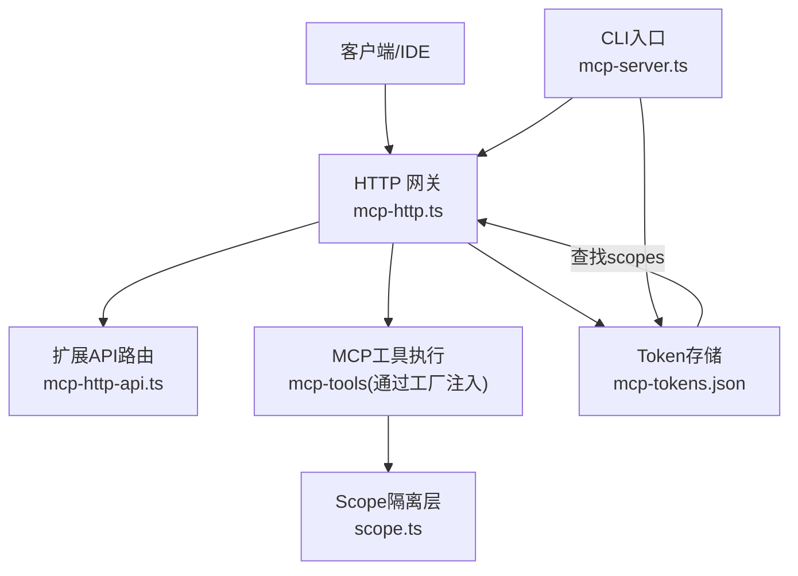
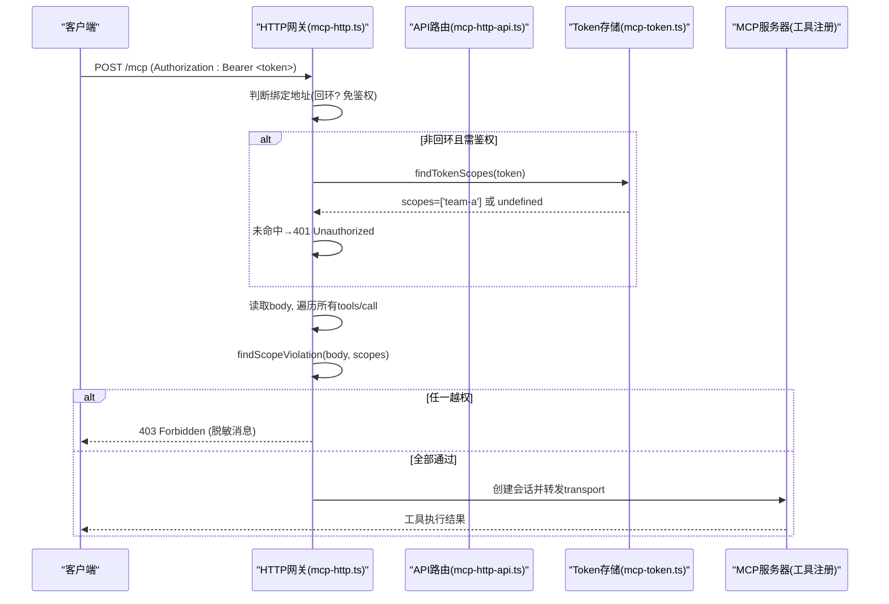
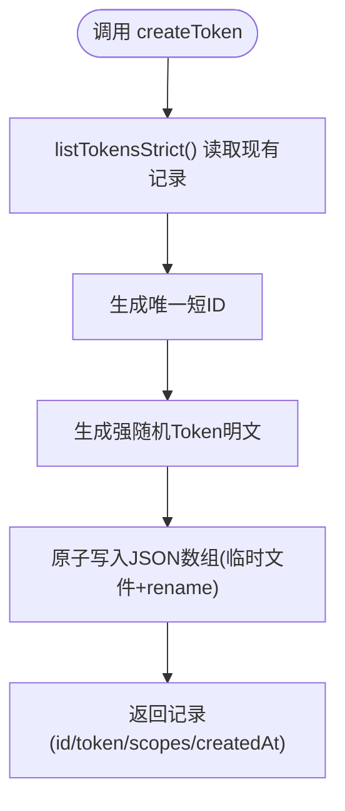
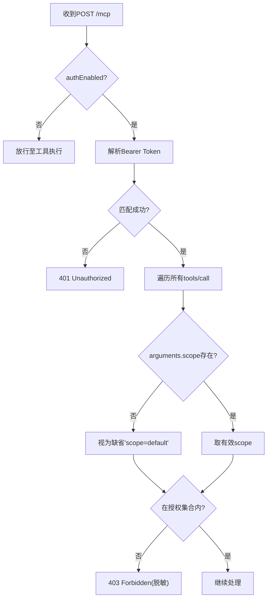
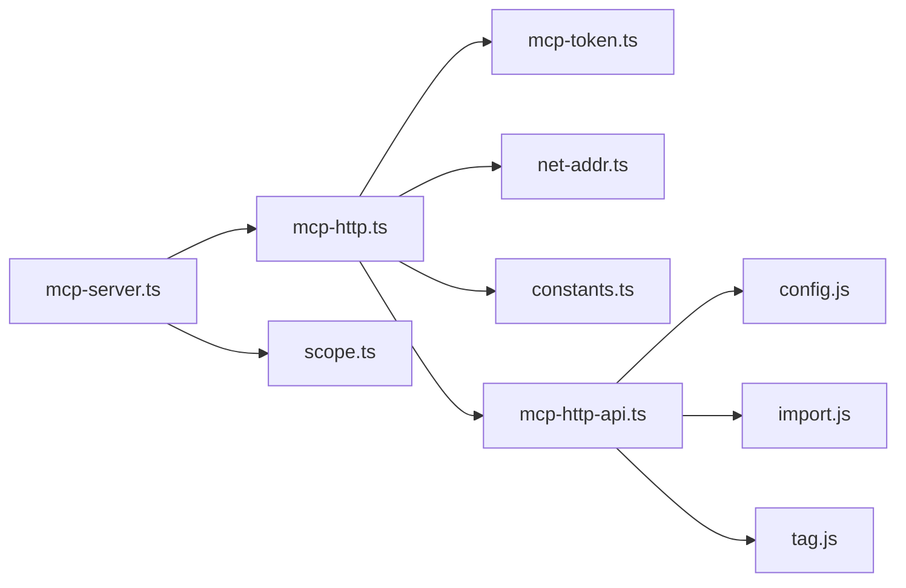

# 安全认证与授权

<cite>
**本文引用的文件**
- [src/lib/mcp-token.ts](file://src/lib/mcp-token.ts)
- [src/lib/mcp-http.ts](file://src/lib/mcp-http.ts)
- [src/lib/mcp-http-api.ts](file://src/lib/mcp-http-api.ts)
- [src/mcp-server.ts](file://src/mcp-server.ts)
- [src/scope.ts](file://src/scope.ts)
- [test/mcp-token.test.ts](file://test/mcp-token.test.ts)
- [docs/cli.md](file://docs/cli.md)
</cite>

## 目录
1. [简介](#简介)
2. [项目结构](#项目结构)
3. [核心组件](#核心组件)
4. [架构总览](#架构总览)
5. [详细组件分析](#详细组件分析)
6. [依赖关系分析](#依赖关系分析)
7. [性能与安全特性](#性能与安全特性)
8. [故障排查指南](#故障排查指南)
9. [结论](#结论)
10. [附录：配置与最佳实践](#附录配置与最佳实践)

## 简介
本文件面向 MCP 服务的安全认证与授权，系统性说明 Token 鉴权机制、Scope 权限控制、回环地址免鉴权与远程地址强制鉴权策略，以及多 Token 存储、权限继承与动态授权的实现与最佳实践。文档同时覆盖安全配置、审计日志与漏洞防护要点，帮助读者在生产环境中正确部署与维护。

## 项目结构
MCP 安全能力由以下模块协同完成：
- Token 生命周期管理（生成、验证、更新、删除）：src/lib/mcp-token.ts
- HTTP 网关与鉴权闸门（Bearer Token 校验、scope 越权拦截、会话管理）：src/lib/mcp-http.ts
- /api/* 扩展接口鉴权与 scope 校验：src/lib/mcp-http-api.ts
- CLI 入口与命令分发（token 子命令、HTTP/stdio 模式启动、守护进程）：src/mcp-server.ts
- Scope 隔离与生命周期（KB/向量层 scope 管理）：src/scope.ts
- 测试与行为契约：test/mcp-token.test.ts
- 用户文档与命令行说明：docs/cli.md

图表来源
- [src/lib/mcp-http.ts:300-500](file://src/lib/mcp-http.ts#L300-L500)
- [src/lib/mcp-http-api.ts:200-270](file://src/lib/mcp-http-api.ts#L200-L270)
- [src/lib/mcp-token.ts:20-50](file://src/lib/mcp-token.ts#L20-L50)
- [src/mcp-server.ts:50-70](file://src/mcp-server.ts#L50-L70)

章节来源
- [src/lib/mcp-http.ts:1-120](file://src/lib/mcp-http.ts#L1-L120)
- [src/lib/mcp-http-api.ts:1-60](file://src/lib/mcp-http-api.ts#L1-L60)
- [src/lib/mcp-token.ts:1-50](file://src/lib/mcp-token.ts#L1-L50)
- [src/mcp-server.ts:1-80](file://src/mcp-server.ts#L1-L80)

## 核心组件
- 多 Token 存储与 RBAC：以 JSON 文件持久化 Token 记录（id、token明文、scopes、createdAt），支持按 Token 明文查 scopes，结合 isScopeAuthorized 判定是否允许访问指定 scope。
- HTTP 鉴权闸门：根据绑定地址决定鉴权开关；非回环绑定强制 Bearer Token；对 tools/call 的 arguments.scope 做越权校验，缺省为 'default'；白名单工具跳过单点 scope 校验，交由工具层按 authScopes 过滤输出。
- /api/* 鉴权：与 /mcp 一致，query/body 中的 scope 参与越权校验，响应体脱敏不泄露 scope 名。
- CLI token 子命令：generate/list/update/delete，强制显式 --scope，失败快速失败（fail-loud）。
- Scope 隔离：提供 scope 列表、清理、删除等能力，配合 KB/向量层数据隔离。

章节来源
- [src/lib/mcp-token.ts:25-50](file://src/lib/mcp-token.ts#L25-L50)
- [src/lib/mcp-http.ts:100-140](file://src/lib/mcp-http.ts#L100-L140)
- [src/lib/mcp-http-api.ts:220-270](file://src/lib/mcp-http-api.ts#L220-L270)
- [src/mcp-server.ts:227-351](file://src/mcp-server.ts#L227-L351)
- [src/scope.ts:56-132](file://src/scope.ts#L56-L132)

## 架构总览
下图展示一次带鉴权的 MCP tools/call 请求从客户端到工具执行的完整流程，包括 Token 解析、授权 scope 集合获取、越权拦截与工具层过滤。

图表来源
- [src/lib/mcp-http.ts:454-526](file://src/lib/mcp-http.ts#L454-L526)
- [src/lib/mcp-token.ts:240-259](file://src/lib/mcp-token.ts#L240-L259)

章节来源
- [src/lib/mcp-http.ts:454-526](file://src/lib/mcp-http.ts#L454-L526)
- [src/lib/mcp-token.ts:240-259](file://src/lib/mcp-token.ts#L240-L259)

## 详细组件分析

### Token 全生命周期管理（生成、验证、更新、删除）
- 生成：createToken 使用强随机值（32字节熵，base64url）生成 token 明文，附带短 id、scopes、createdAt；原子写回 mcp-tokens.json（0600），损坏保护防止覆盖丢失。
- 验证：findTokenScopes 遍历记录并使用常量时间比较匹配 token，返回对应 scopes；未命中返回 undefined。
- 更新：updateTokenScopes 按短 id 修改 scopes，严格读取避免损坏覆盖。
- 删除：deleteToken 按短 id 移除记录，立即失效。
- 统计：tokenCount 仅计数，不回显明文。

图表来源
- [src/lib/mcp-token.ts:178-201](file://src/lib/mcp-token.ts#L178-L201)
- [src/lib/mcp-token.ts:149-176](file://src/lib/mcp-token.ts#L149-L176)

章节来源
- [src/lib/mcp-token.ts:178-201](file://src/lib/mcp-token.ts#L178-L201)
- [src/lib/mcp-token.ts:240-259](file://src/lib/mcp-token.ts#L240-L259)
- [src/lib/mcp-token.ts:203-238](file://src/lib/mcp-token.ts#L203-L238)
- [test/mcp-token.test.ts:94-178](file://test/mcp-token.test.ts#L94-L178)

### Scope 权限控制与越权拦截
- 授权判定：isScopeAuthorized(authScopes, scope) 支持 null（免鉴权）、['all']（通配）、具体 scope 列表。
- HTTP 闸门：findScopeViolation 遍历 body 中所有 tools/call，提取 arguments.scope（缺省 'default'），白名单工具豁免单点 scope 校验，交由工具层按 authScopes 过滤输出。
- /api/* 校验：对 query/body 中的 scope 进行越权校验，拒绝时响应体脱敏（不下发 scope 名）。

图表来源
- [src/lib/mcp-http.ts:100-140](file://src/lib/mcp-http.ts#L100-L140)
- [src/lib/mcp-http.ts:454-526](file://src/lib/mcp-http.ts#L454-L526)
- [src/lib/mcp-http-api.ts:220-270](file://src/lib/mcp-http-api.ts#L220-L270)
- [src/lib/mcp-token.ts:43-50](file://src/lib/mcp-token.ts#L43-L50)

章节来源
- [src/lib/mcp-http.ts:100-140](file://src/lib/mcp-http.ts#L100-L140)
- [src/lib/mcp-http-api.ts:220-270](file://src/lib/mcp-http-api.ts#L220-L270)
- [src/lib/mcp-token.ts:43-50](file://src/lib/mcp-token.ts#L43-L50)

### 回环地址免鉴权与远程地址强制鉴权
- 默认监听 127.0.0.1，本地回环免鉴权，零网络暴露面。
- 非回环绑定（如 0.0.0.0）必须可鉴权：优先使用 --token/KI_MCP_TOKEN（全权临时 Token，进程级），否则要求多 Token 存储中存在至少一个 Token。
- 客户端来源地址判定：resolveClientAddr 默认取 socket.remoteAddress，测试可注入模拟远程来源以验证鉴权路径。

章节来源
- [src/lib/mcp-http.ts:36-45](file://src/lib/mcp-http.ts#L36-L45)
- [src/mcp-server.ts:174-212](file://src/mcp-server.ts#L174-L212)
- [src/lib/mcp-http.ts:320-331](file://src/lib/mcp-http.ts#L320-L331)

### 多 Token 存储机制与权限继承
- 存储位置：~/.ki/mcp-tokens.json（0600），每条记录包含 id、token、scopes、createdAt。
- 权限继承：'all' 表示全部 scope；isScopeAuthorized 将 'all' 视为通配，等价于继承全部权限。
- 动态授权：updateTokenScopes 可按短 id 动态调整 scopes；deleteToken 立即失效。
- 安全加固：原子写 + 损坏保护（MCP_TOKEN_CORRUPT），防止并发崩溃导致半写损坏与静默覆盖。

章节来源
- [src/lib/mcp-token.ts:20-50](file://src/lib/mcp-token.ts#L20-L50)
- [src/lib/mcp-token.ts:149-176](file://src/lib/mcp-token.ts#L149-L176)
- [src/lib/mcp-token.ts:203-238](file://src/lib/mcp-token.ts#L203-L238)
- [test/mcp-token.test.ts:222-240](file://test/mcp-token.test.ts#L222-L240)

### 枚举工具的权限边界与输出过滤
- 白名单工具（无 scope 参数）：ki_scope_list、ki_manage_index_list 不参与单点 scope 校验，但工具层会依据传入的 authScopes 过滤输出，避免泄露未授权 scope。
- 新增无 scope 参数的工具需同步加入白名单，确保统一治理。

章节来源
- [src/lib/mcp-http.ts:100-110](file://src/lib/mcp-http.ts#L100-L110)
- [src/mcp-server.ts:54-71](file://src/mcp-server.ts#L54-L71)

### Scope 隔离与生命周期
- 列出 scope：executeScopeList 汇总 KB 目录层、向量语义层与 config.scopes 的并集，标注存在层与注册状态。
- 删除/清理：executeScopeDelete/executeScopeClear 提供破坏性操作确认（--yes），支持按 tag 清理向量层而不影响 KB。

章节来源
- [src/scope.ts:94-132](file://src/scope.ts#L94-L132)
- [src/scope.ts:145-221](file://src/scope.ts#L145-L221)

## 依赖关系分析
- mcp-http.ts 依赖 mcp-token.ts（findTokenScopes、ALL_SCOPES）、net-addr.ts（回环判定）、constants.ts（服务名）。
- mcp-http-api.ts 依赖 mcp-token.ts、config.js、import.js、tag.js 等。
- mcp-server.ts 聚合 CLI 逻辑，调用 mcp-http.ts 启动 HTTP 服务，注册工具时注入 authScopes。
- scope.ts 依赖 vector-client.js、lib/config.js 等。

图表来源
- [src/mcp-server.ts:5-47](file://src/mcp-server.ts#L5-L47)
- [src/lib/mcp-http.ts:17-27](file://src/lib/mcp-http.ts#L17-L27)
- [src/lib/mcp-http-api.ts:18-30](file://src/lib/mcp-http-api.ts#L18-L30)

章节来源
- [src/mcp-server.ts:5-47](file://src/mcp-server.ts#L5-L47)
- [src/lib/mcp-http.ts:17-27](file://src/lib/mcp-http.ts#L17-L27)
- [src/lib/mcp-http-api.ts:18-30](file://src/lib/mcp-http-api.ts#L18-L30)

## 性能与安全特性
- 常量时间比较：Token 比对使用 timingSafeEqual，防时序侧信道攻击。
- 批量越权防护：findScopeViolation 遍历 batch 全部项，任一越权即拒绝。
- 会话上限与空闲回收：限制最大会话数，定期回收空闲 transport，防止内存泄漏。
- 原子写与损坏保护：writeTokens 使用临时文件+rename，listTokensStrict 区分 ENOENT 与损坏，避免静默失效。
- 脱敏响应：越权响应体不包含 scope 名，仅服务端 stderr 留痕，降低信息泄露风险。
- DNS Rebinding 保护：可选 allowedHosts 白名单，增强浏览器场景安全性。

章节来源
- [src/lib/mcp-http.ts:175-181](file://src/lib/mcp-http.ts#L175-L181)
- [src/lib/mcp-http.ts:117-138](file://src/lib/mcp-http.ts#L117-L138)
- [src/lib/mcp-http.ts:536-547](file://src/lib/mcp-http.ts#L536-L547)
- [src/lib/mcp-token.ts:149-176](file://src/lib/mcp-token.ts#L149-L176)
- [src/lib/mcp-http-api.ts:135-143](file://src/lib/mcp-http-api.ts#L135-L143)

## 故障排查指南
- 鉴权失败：检查 Authorization: Bearer 是否与 ki mcp token list 输出完全一致；服务端 stderr 会记录失败次数与原因（缺失头或无效 Token）。
- 越权拦截：确认 Token 授权 scopes 是否包含请求 scope；若为白名单工具，检查工具层是否按 authScopes 过滤输出。
- 文件损坏：若出现 MCP_TOKEN_CORRUPT，请人工检查 ~/.ki/mcp-tokens.json 内容完整性，勿直接覆盖。
- 端口占用/权限：listen 错误会被翻译为用户友好提示（EADDRINUSE/EACCES 等）。
- 状态自查：ki mcp --status 组合 /healthz 探活与 lock 文件，输出实例全貌与 managedTokens.count。

章节来源
- [src/lib/mcp-http.ts:358-372](file://src/lib/mcp-http.ts#L358-L372)
- [src/lib/mcp-http.ts:609-630](file://src/lib/mcp-http.ts#L609-L630)
- [src/lib/mcp-token.ts:132-147](file://src/lib/mcp-token.ts#L132-L147)
- [src/mcp-server.ts:632-670](file://src/mcp-server.ts#L632-L670)

## 结论
本方案实现了基于多 Token 的细粒度 RBAC 授权，结合 HTTP 网关的统一鉴权闸门与 /api/* 的 scope 校验，确保远程访问强制鉴权、本地回环免鉴权的安全基线。通过原子写、损坏保护、常量时间比较、脱敏响应与 DNS Rebinding 保护等机制，构建了完善的安全防护体系。配合 CLI 的 token 子命令与 scope 生命周期管理，便于运维人员高效管理与排障。

## 附录：配置与最佳实践
- 默认回环绑定：ki mcp --http 默认 127.0.0.1，开箱即用且无需鉴权。
- 远程共享：显式 --host 0.0.0.0 时需配置鉴权（--token/KI_MCP_TOKEN 或多 Token 存储）。
- Token 管理：
  - generate --scope 必须显式指定（单个/多个/all），缺省报错。
  - list 列出所有 Token（含明文与授权 scope），按需回显。
  - update <id> --scope 动态调整权限。
  - delete <id> 立即失效。
- 审计日志：鉴权失败与越权拦截均写服务端 stderr，/healthz 暴露鉴权失败计数。
- 漏洞防护：
  - 禁止明文 Token 写入配置文件。
  - 白名单工具输出受 authScopes 过滤，避免泄露 scope 结构。
  - 请求体大小限制（16MB）与上传扩展名白名单，防止滥用。
  - 路径穿越防护（sanitizeFileName）与 uploadId 受控目录校验。

章节来源
- [docs/cli.md:960-976](file://docs/cli.md#L960-L976)
- [src/mcp-server.ts:227-351](file://src/mcp-server.ts#L227-L351)
- [src/lib/mcp-http-api.ts:33-42](file://src/lib/mcp-http-api.ts#L33-L42)
- [src/lib/mcp-http-api.ts:145-152](file://src/lib/mcp-http-api.ts#L145-L152)