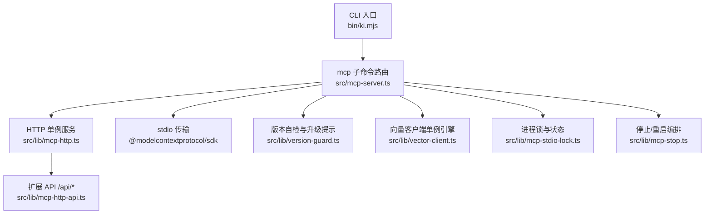
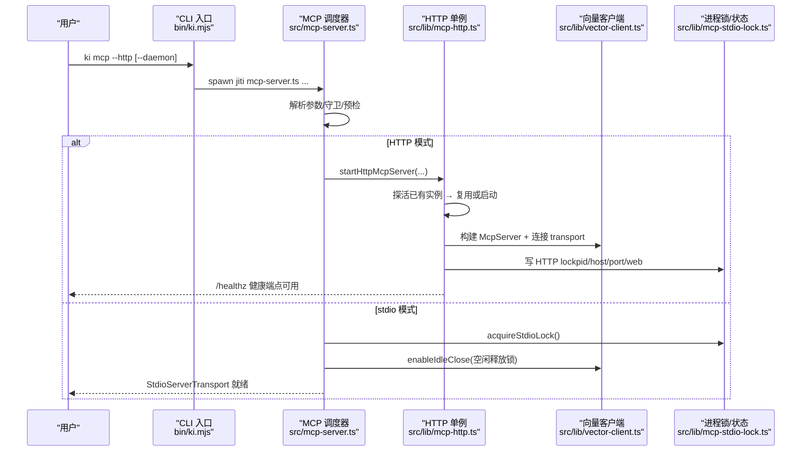
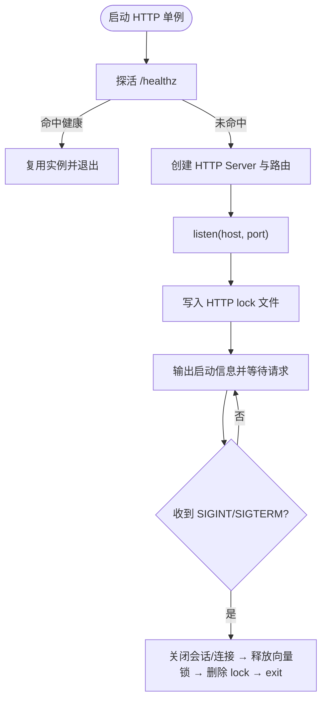
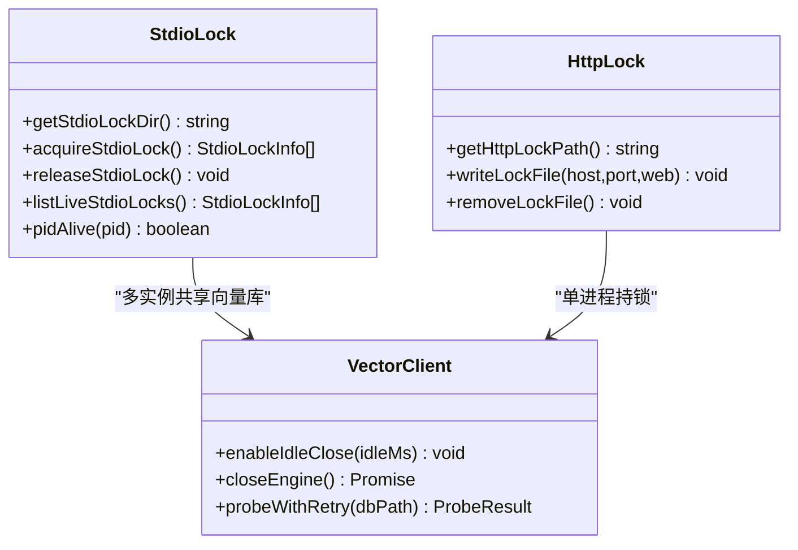
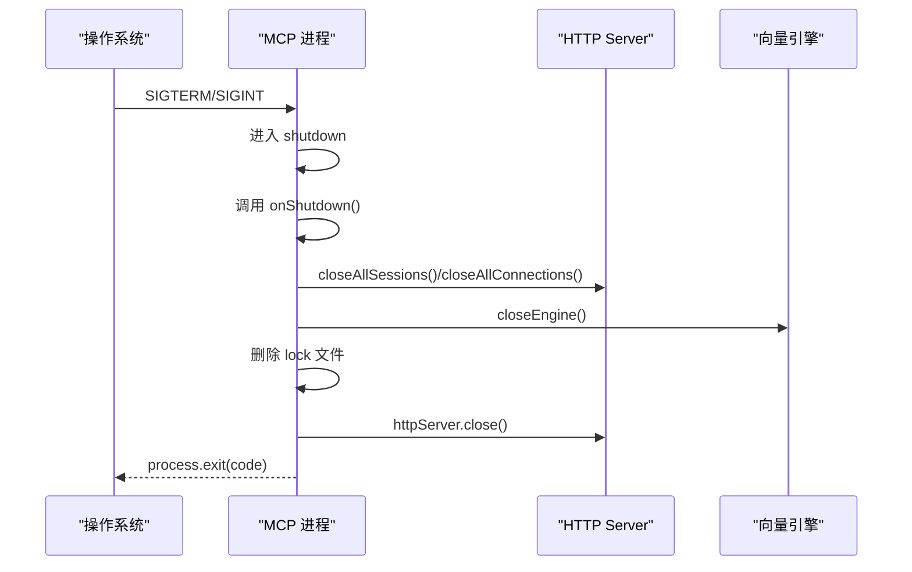
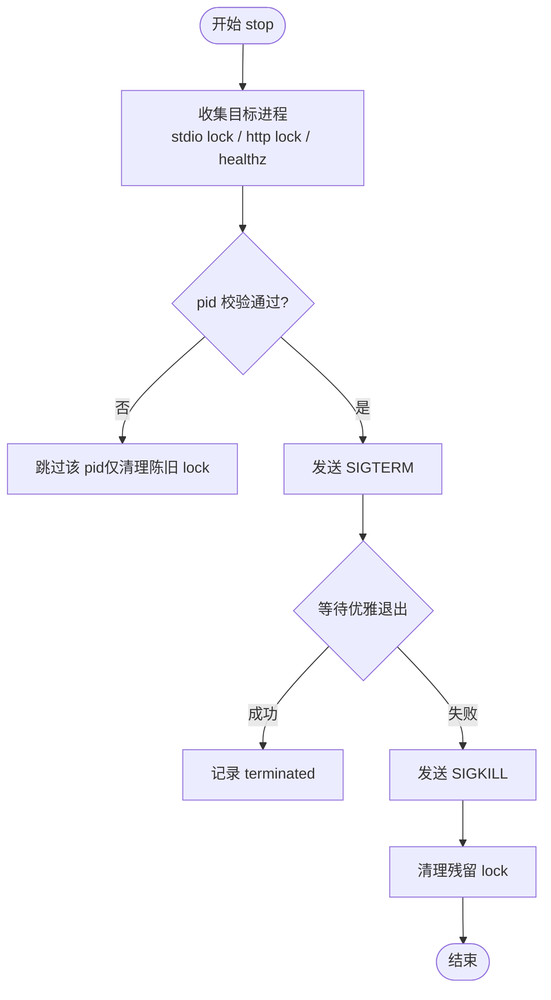
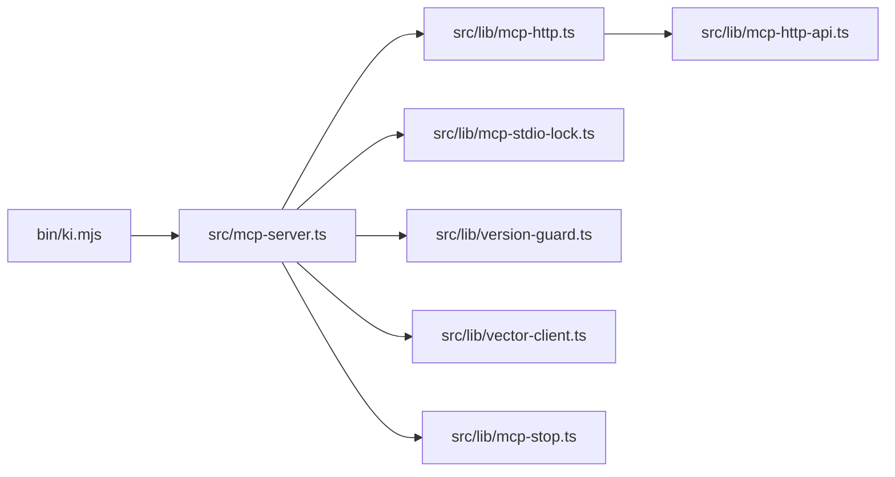

# 进程管理

<cite>
**本文引用的文件**
- [bin/ki.mjs](file://bin/ki.mjs)
- [src/mcp-server.ts](file://src/mcp-server.ts)
- [src/lib/mcp-http.ts](file://src/lib/mcp-http.ts)
- [src/lib/mcp-stop.ts](file://src/lib/mcp-stop.ts)
- [src/lib/mcp-stdio-lock.ts](file://src/lib/mcp-stdio-lock.ts)
- [src/lib/version-guard.ts](file://src/lib/version-guard.ts)
- [src/lib/vector-client.ts](file://src/lib/vector-client.ts)
- [src/lib/mcp-http-api.ts](file://src/lib/mcp-http-api.ts)
</cite>

## 目录
1. [简介](#简介)
2. [项目结构](#项目结构)
3. [核心组件](#核心组件)
4. [架构总览](#架构总览)
5. [详细组件分析](#详细组件分析)
6. [依赖关系分析](#依赖关系分析)
7. [性能与并发特性](#性能与并发特性)
8. [故障排查指南](#故障排查指南)
9. [结论](#结论)
10. [附录：命令速查](#附录：命令速查)

## 简介
本文件面向 ki MCP 服务的进程管理，系统性说明 HTTP 共享单例模式的守护机制、启动守卫、实例冲突检测、优雅退出流程，以及 ki mcp stop/restart/status 等命令的实现原理与使用方法。同时对比 stdio 模式与 HTTP 模式的差异，解释多实例共存时的锁管理机制，并给出进程监控、故障恢复与自动重启的完整方案，涵盖进程间通信、信号处理与资源清理的最佳实践。

## 项目结构
MCP 服务由 CLI 入口分发到具体实现，HTTP 单例与 stdio 两种运行模式共用同一工具注册与向量客户端，但进程模型、生命周期管理与锁策略不同。

图表来源
- [bin/ki.mjs:28-49](file://bin/ki.mjs#L28-L49)
- [src/mcp-server.ts:24-38](file://src/mcp-server.ts#L24-L38)
- [src/lib/mcp-http.ts:17-27](file://src/lib/mcp-http.ts#L17-L27)
- [src/lib/mcp-http-api.ts:18-29](file://src/lib/mcp-http-api.ts#L18-L29)
- [src/lib/version-guard.ts:12-14](file://src/lib/version-guard.ts#L12-L14)
- [src/lib/vector-client.ts:16-33](file://src/lib/vector-client.ts#L16-L33)
- [src/lib/mcp-stdio-lock.ts:16-18](file://src/lib/mcp-stdio-lock.ts#L16-L18)
- [src/lib/mcp-stop.ts:14-18](file://src/lib/mcp-stop.ts#L14-L18)

章节来源
- [bin/ki.mjs:28-49](file://bin/ki.mjs#L28-L49)
- [src/mcp-server.ts:24-38](file://src/mcp-server.ts#L24-L38)

## 核心组件
- CLI 入口与守护启动：负责命令分发、后台常驻（daemon）、信号转发与启动期存活探测。
- MCP 主调度器：解析参数、执行启动守卫（HTTP/stdio 冲突检测）、预检健康检查、选择传输模式并注册工具。
- HTTP 单例服务：Streamable HTTP 传输、会话管理、鉴权与 scope 校验、静态页面托管、健康端点、空闲会话回收、优雅退出。
- 进程锁与状态：stdio 多实例 lock 登记/清理；HTTP lock 文件记录持锁者信息；跨进程探活。
- 停止/重启编排：统一收集目标进程、安全身份校验、SIGTERM→SIGKILL 兜底、残留 lock 清理。
- 版本守卫：长驻进程版本 banner 与升级监听，提示重启。
- 向量客户端：进程内引擎单例、空闲释放锁、撞锁重试、优雅关闭。

章节来源
- [bin/ki.mjs:154-223](file://bin/ki.mjs#L154-L223)
- [src/mcp-server.ts:492-734](file://src/mcp-server.ts#L492-L734)
- [src/lib/mcp-http.ts:340-766](file://src/lib/mcp-http.ts#L340-L766)
- [src/lib/mcp-stdio-lock.ts:20-154](file://src/lib/mcp-stdio-lock.ts#L20-L154)
- [src/lib/mcp-stop.ts:90-177](file://src/lib/mcp-stop.ts#L90-L177)
- [src/lib/version-guard.ts:16-66](file://src/lib/version-guard.ts#L16-L66)
- [src/lib/vector-client.ts:88-200](file://src/lib/vector-client.ts#L88-L200)

## 架构总览
下图展示从 CLI 到 MCP 服务、再到向量库的生命周期与关键交互。

图表来源
- [bin/ki.mjs:154-223](file://bin/ki.mjs#L154-L223)
- [src/mcp-server.ts:592-734](file://src/mcp-server.ts#L592-L734)
- [src/lib/mcp-http.ts:672-766](file://src/lib/mcp-http.ts#L672-L766)
- [src/lib/mcp-stdio-lock.ts:113-154](file://src/lib/mcp-stdio-lock.ts#L113-L154)
- [src/lib/vector-client.ts:164-181](file://src/lib/vector-client.ts#L164-L181)

## 详细组件分析

### HTTP 共享单例守护与启动守卫
- 幂等复用：启动前先探活 /healthz，命中健康 kisearch 实例则直接复用并退出当前进程，避免重复启动。
- 地址归一：将 0.0.0.0/::/localhost 等监听地址归一为 127.0.0.1，确保同机不同写法命中同一实例。
- 鉴权策略：回环绑定默认免鉴权；非回环绑定强制 Bearer Token，支持临时全权 Token 或多 Token 存储按 scope 授权。
- 会话管理：每个 initialize 创建独立 transport 与 McpServer，模块级共享向量引擎单例；限制最大会话数与空闲超时回收。
- 静态页面：可选提供前端静态页面，SPA fallback 仅对 GET 请求生效。
- 优雅退出：SIGINT/SIGTERM 触发关闭所有会话、断开连接、关闭 http server、释放向量锁、删除 lock 文件，并设置超时强制退出防止残留。

图表来源
- [src/lib/mcp-http.ts:672-766](file://src/lib/mcp-http.ts#L672-L766)
- [src/lib/mcp-http.ts:195-230](file://src/lib/mcp-http.ts#L195-L230)
- [src/lib/mcp-http.ts:340-607](file://src/lib/mcp-http.ts#L340-L607)

章节来源
- [src/lib/mcp-http.ts:672-766](file://src/lib/mcp-http.ts#L672-L766)
- [src/lib/mcp-http.ts:195-230](file://src/lib/mcp-http.ts#L195-L230)
- [src/lib/mcp-http.ts:340-607](file://src/lib/mcp-http.ts#L340-L607)

### stdio 模式与 HTTP 模式差异
- 进程模型：stdio 默认单客户端单进程；HTTP 为单进程多会话共享。
- 锁策略：stdio 通过每实例 lock 文件登记多实例，配合向量客户端空闲释放锁实现“错开共享”；HTTP 以单一进程持有向量锁，IDE 通过 URL 共享。
- 冲突检测：
  - stdio 启动时若检测到 HTTP 单例存在，拒绝启动并引导迁移 URL。
  - HTTP 启动时若检测到 stdio 实例存在，拒绝启动以避免争抢向量锁。
- 鉴权：HTTP 非回环绑定需 Bearer Token；stdio 无网络鉴权。
- 可观测性：HTTP 暴露 /healthz 与健康报告；stdio 通过 lock 文件与进程列表定位。

章节来源
- [src/mcp-server.ts:597-658](file://src/mcp-server.ts#L597-L658)
- [src/lib/mcp-stdio-lock.ts:113-154](file://src/lib/mcp-stdio-lock.ts#L113-L154)
- [src/lib/vector-client.ts:88-104](file://src/lib/vector-client.ts#L88-L104)

### 多实例共存与锁管理
- stdio 多实例：每个实例写 ~/.ki/mcp-stdio-<pid>.lock，文件名即 pid；读取时做 pid 存活校验，异常退出自动清理陈旧锁。
- HTTP 单例：写 ~/.ki/mcp-http.lock，包含 pid/host/port/web 等信息，供 status/stop 定位。
- 向量锁共享：多 stdio 实例共享向量库，通过空闲释放锁与撞锁重试实现“错开使用”，互不阻塞。
- 冲突防护：HTTP 与 stdio 互斥启动，避免同时争抢向量锁。

图表来源
- [src/lib/mcp-stdio-lock.ts:20-154](file://src/lib/mcp-stdio-lock.ts#L20-L154)
- [src/lib/mcp-http.ts:58-61](file://src/lib/mcp-http.ts#L58-L61)
- [src/lib/vector-client.ts:88-104](file://src/lib/vector-client.ts#L88-L104)
- [src/lib/vector-client.ts:164-181](file://src/lib/vector-client.ts#L164-L181)

章节来源
- [src/lib/mcp-stdio-lock.ts:20-154](file://src/lib/mcp-stdio-lock.ts#L20-L154)
- [src/lib/mcp-http.ts:58-61](file://src/lib/mcp-http.ts#L58-L61)
- [src/lib/vector-client.ts:88-104](file://src/lib/vector-client.ts#L88-L104)

### 优雅退出流程与信号处理
- HTTP 模式：
  - 监听 SIGINT/SIGTERM，进入 shutdown 流程：调用 onShutdown（停止版本守卫）、关闭所有会话与连接、释放向量锁、删除 lock 文件、关闭 http server，并在超时后强制 exit。
- stdio 模式：
  - 监听 SIGINT/SIGTERM，停止版本守卫、关闭向量引擎、退出进程。
- CLI 层：
  - 父进程将 SIGTERM/SIGINT 转发给子进程，确保子进程的 handler 能执行中断标记与清理逻辑。

图表来源
- [src/lib/mcp-http.ts:734-766](file://src/lib/mcp-http.ts#L734-L766)
- [src/mcp-server.ts:710-734](file://src/mcp-server.ts#L710-L734)
- [bin/ki.mjs:200-218](file://bin/ki.mjs#L200-L218)

章节来源
- [src/lib/mcp-http.ts:734-766](file://src/lib/mcp-http.ts#L734-L766)
- [src/mcp-server.ts:710-734](file://src/mcp-server.ts#L710-L734)
- [bin/ki.mjs:200-218](file://bin/ki.mjs#L200-L218)

### 命令实现原理与使用方法

#### ki mcp stop
- 功能：一键关闭本机所有 ki mcp 实例（stdio + HTTP）并清理 lock。
- 定位来源：遍历 stdio lock 目录、读取 HTTP lock、探活 /healthz（兜底）。
- 安全校验：读 /proc/<pid>/cmdline 确认目标确为 ki mcp 进程，防止 pid 复用误杀。
- 退出策略：先发送 SIGTERM 优雅退出，超时后发送 SIGKILL 兜底，最后清理残留 lock。

图表来源
- [src/lib/mcp-stop.ts:90-177](file://src/lib/mcp-stop.ts#L90-L177)
- [src/lib/mcp-stop.ts:56-64](file://src/lib/mcp-stop.ts#L56-L64)

章节来源
- [src/lib/mcp-stop.ts:90-177](file://src/lib/mcp-stop.ts#L90-L177)

#### ki mcp restart
- 功能：停止现有 HTTP 单例后，以守护进程方式后台重启（仅 HTTP 模式）。
- 参数优先级：host/port 解析顺序为 CLI > lock（上次运行值）> 配置 > 默认。
- 启动守卫：检测 stdio 实例存在时 fail-loud 并引导迁移 URL；非回环模式提前校验 token。
- 后台拉起：通过 npx jiti 启动新进程，忽略 stdio，父进程 unref 后立即退出。

章节来源
- [src/mcp-server.ts:405-490](file://src/mcp-server.ts#L405-L490)
- [src/mcp-server.ts:391-403](file://src/mcp-server.ts#L391-L403)

#### ki mcp --status
- 功能：只读诊断，读取 HTTP lock + stdio lock + 探活，输出实例全貌。
- 目标解析：CLI 显式 > lock（pid 存活的运行值）> 配置 > 默认；陈旧 lock 不参与回退。
- 输出内容：running、target、healthz、lock、stdioInstances、managedTokens 数量与提示。

章节来源
- [src/mcp-server.ts:542-558](file://src/mcp-server.ts#L542-L558)
- [src/lib/mcp-http.ts:632-670](file://src/lib/mcp-http.ts#L632-L670)

### 进程监控、故障恢复与自动重启
- 监控：
  - /healthz 返回 ok/name/pid/version/host/port/authFailures，便于外部监控与告警。
  - /api/health 提供更详细的健康报告（含向量库探针）。
  - ki mcp --status 汇总 HTTP/stdio 实例与 token 数量。
- 故障恢复：
  - 向量库占用：vector-client 提供 probeWithRetry 撞锁重试；空闲释放锁让其他实例错开使用。
  - 进程异常退出：下次启动时 listLiveStdioLocks 会清理陈旧 lock；stop 命令也会清理残留 lock。
- 自动重启：
  - 通过外部进程管理器（systemd/supervisor）或脚本轮询 /healthz 失败时执行 ki mcp restart。
  - 版本守卫在检测到 package.json 变化时提示重启，避免旧代码长期运行。

章节来源
- [src/lib/mcp-http.ts:195-230](file://src/lib/mcp-http.ts#L195-L230)
- [src/lib/mcp-http-api.ts:274-288](file://src/lib/mcp-http-api.ts#L274-L288)
- [src/lib/mcp-stdio-lock.ts:100-111](file://src/lib/mcp-stdio-lock.ts#L100-L111)
- [src/lib/vector-client.ts:88-104](file://src/lib/vector-client.ts#L88-L104)
- [src/lib/version-guard.ts:27-66](file://src/lib/version-guard.ts#L27-L66)

### 进程间通信、信号处理与资源清理最佳实践
- 进程间通信：
  - HTTP 模式：基于 Streamable HTTP 传输，每个会话独立 transport，服务端维护会话 Map 与活跃时间。
  - stdio 模式：基于 @modelcontextprotocol/sdk 的 StdioServerTransport，客户端断开时触发关闭流程。
- 信号处理：
  - 父进程（CLI）转发 SIGTERM/SIGINT 给子进程，确保子进程 handler 能执行中断标记与清理。
  - 子进程统一在 shutdown 中停止版本守卫、关闭会话/连接、释放向量锁、删除 lock 文件。
- 资源清理：
  - 向量引擎：空闲释放锁（常驻模式）+ 进程退出时 closeEngine。
  - HTTP 会话：空闲扫描回收，关闭时 closeAllSessions/closeAllConnections。
  - Lock 文件：启动写、退出删；异常退出由下次启动或 stop 清理。

章节来源
- [src/lib/mcp-http.ts:340-607](file://src/lib/mcp-http.ts#L340-L607)
- [src/mcp-server.ts:710-734](file://src/mcp-server.ts#L710-L734)
- [bin/ki.mjs:200-218](file://bin/ki.mjs#L200-L218)
- [src/lib/vector-client.ts:164-181](file://src/lib/vector-client.ts#L164-L181)

## 依赖关系分析
- CLI 入口依赖 mcp-server 作为子进程执行；mcp-server 依赖 mcp-http、mcp-stdio-lock、version-guard、vector-client、mcp-stop。
- HTTP 服务依赖 mcp-http-api 提供扩展接口；鉴权依赖 mcp-token（通过 findTokenScopes）。
- 向量客户端依赖 zvec-engine 编译产物，提供进程内引擎单例与空闲释放锁。

图表来源
- [bin/ki.mjs:28-49](file://bin/ki.mjs#L28-L49)
- [src/mcp-server.ts:24-38](file://src/mcp-server.ts#L24-L38)
- [src/lib/mcp-http.ts:17-27](file://src/lib/mcp-http.ts#L17-L27)
- [src/lib/mcp-http-api.ts:18-29](file://src/lib/mcp-http-api.ts#L18-L29)

章节来源
- [bin/ki.mjs:28-49](file://bin/ki.mjs#L28-L49)
- [src/mcp-server.ts:24-38](file://src/mcp-server.ts#L24-L38)

## 性能与并发特性
- 会话上限保护：限制最大活跃会话数，防止内存耗尽。
- 空闲会话回收：定期扫描 lastActive，超时会话主动关闭。
- 向量锁空闲释放：常驻 MCP 启用空闲释放锁，避免长时间持锁导致其他实例阻塞。
- 撞锁重试：向量库被占用时等待并重试，提升多实例共享稳定性。
- DNS rebinding 保护：可选开启 allowedHosts 白名单，增强安全性。

章节来源
- [src/lib/mcp-http.ts:46-56](file://src/lib/mcp-http.ts#L46-L56)
- [src/lib/mcp-http.ts:381-392](file://src/lib/mcp-http.ts#L381-L392)
- [src/lib/vector-client.ts:88-104](file://src/lib/vector-client.ts#L88-L104)
- [src/lib/vector-client.ts:164-181](file://src/lib/vector-client.ts#L164-L181)

## 故障排查指南
- 端口占用：describeListenError 将 EADDRINUSE/EACCES/EADDRNOTAVAIL/ENOTFOUND 翻译为用户友好提示。
- 鉴权失败：/healthz 返回 authFailures 计数；stderr 限流打印失败原因，便于快速定位 Token 配置错误。
- 实例冲突：stdio 与 HTTP 互斥启动，提示信息明确引导迁移 URL。
- 残留锁：stop 命令会清理陈旧 lock；下次启动时 listLiveStdioLocks 也会清理。
- 向量库占用：vector-client 提供 lockedHint 与 probeWithRetry，建议先停止相关进程或等待空闲释放。

章节来源
- [src/lib/mcp-http.ts:609-630](file://src/lib/mcp-http.ts#L609-L630)
- [src/lib/mcp-http.ts:358-372](file://src/lib/mcp-http.ts#L358-L372)
- [src/mcp-server.ts:609-643](file://src/mcp-server.ts#L609-L643)
- [src/lib/mcp-stdio-lock.ts:100-111](file://src/lib/mcp-stdio-lock.ts#L100-L111)
- [src/lib/vector-client.ts:71-86](file://src/lib/vector-client.ts#L71-L86)

## 结论
ki MCP 通过 HTTP 共享单例模式从根本上解决了多 IDE 场景下的向量库锁冲突问题，结合严格的启动守卫、安全的进程管理、完善的优雅退出与可观测性，提供了稳定可靠的进程生命周期管理能力。stdio 模式保留轻量直连能力，并通过空闲释放锁与撞锁重试实现多实例共享。stop/restart/status 命令覆盖常见运维场景，配合外部监控可实现自动化故障恢复与自动重启。

## 附录：命令速查
- ki mcp：默认 stdio 模式；ki mcp --http：HTTP 共享单例；ki mcp --http --daemon：后台常驻。
- ki mcp restart：仅 HTTP 模式，stop + 后台重启；ki mcp --status：只读诊断；ki mcp stop：关闭所有实例并清理 lock。
- ki mcp token generate/list/update/delete：Token 生命周期管理。

章节来源
- [src/mcp-server.ts:83-107](file://src/mcp-server.ts#L83-L107)
- [bin/ki.mjs:118-127](file://bin/ki.mjs#L118-L127)