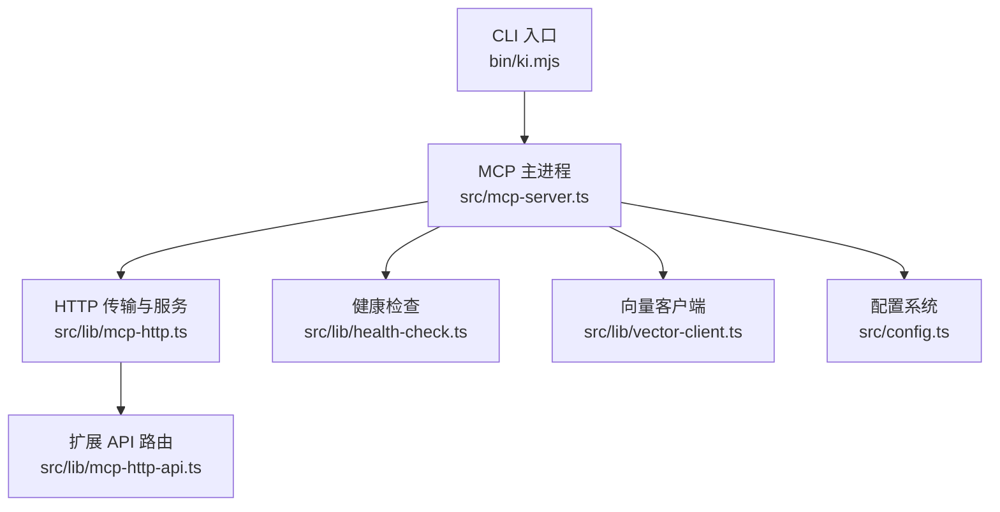
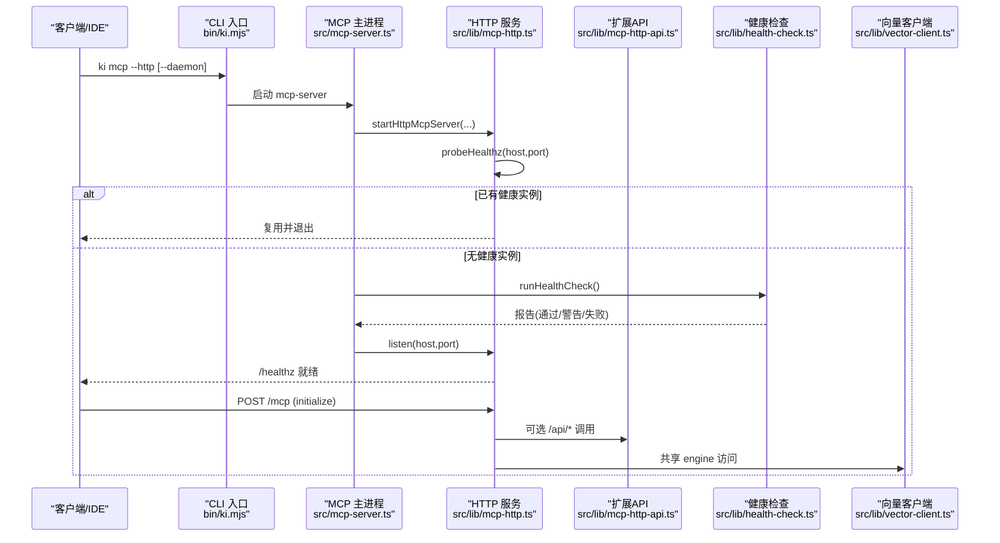
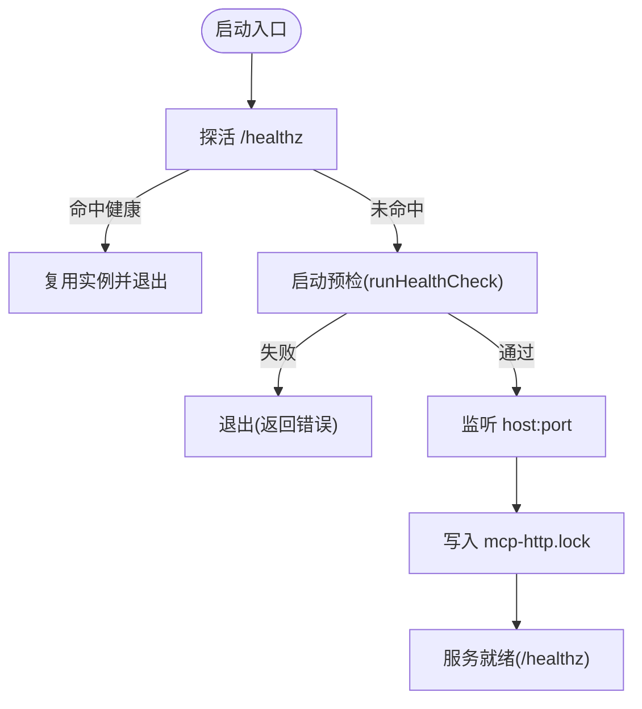
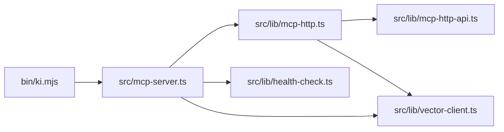

# 部署与管理

<cite>
**本文引用的文件**
- [bin/ki.mjs](file://bin/ki.mjs)
- [src/mcp-server.ts](file://src/mcp-server.ts)
- [src/lib/mcp-http.ts](file://src/lib/mcp-http.ts)
- [src/lib/mcp-http-api.ts](file://src/lib/mcp-http-api.ts)
- [src/lib/health-check.ts](file://src/lib/health-check.ts)
- [src/lib/vector-client.ts](file://src/lib/vector-client.ts)
- [src/config.ts](file://src/config.ts)
- [docs/mcp-http.md](file://docs/mcp-http.md)
- [README.md](file://README.md)
</cite>

## 目录
1. [简介](#简介)
2. [项目结构](#项目结构)
3. [核心组件](#核心组件)
4. [架构总览](#架构总览)
5. [详细组件分析](#详细组件分析)
6. [依赖关系分析](#依赖关系分析)
7. [性能与容量规划](#性能与容量规划)
8. [生产环境部署最佳实践](#生产环境部署最佳实践)
9. [监控、日志与故障诊断](#监控日志与故障诊断)
10. [升级、回滚与灾难恢复](#升级回滚与灾难恢复)
11. [运维脚本与自动化示例](#运维脚本与自动化示例)
12. [结论](#结论)

## 简介
本文件面向生产运维，系统性说明 kisearch MCP 服务的 HTTP 共享单例模式部署与管理策略。内容覆盖进程守护、健康检查与自动重启机制；服务启动参数、配置文件与环境变量；容器化、负载均衡与高可用配置；监控指标、日志收集与故障诊断；以及升级、回滚与灾难恢复策略，并给出可落地的运维脚本与自动化部署示例。

## 项目结构
- CLI 入口：通过 bin/ki.mjs 分发命令，mcp 子命令指向 src/mcp-server.ts。
- HTTP 共享单例：src/lib/mcp-http.ts 提供 StreamableHTTPServerTransport、鉴权与会话管理，暴露 /healthz、/mcp、/api/*。
- 扩展 API：src/lib/mcp-http-api.ts 提供 /api/health、/api/doc/list、导入相关接口等。
- 健康检查：src/lib/health-check.ts 提供 runHealthCheck，用于 ki doctor 与启动预检。
- 向量客户端：src/lib/vector-client.ts 封装 zvec 引擎，提供空闲释放锁、撞锁重试、会话级并发控制。
- 配置体系：src/config.ts 提供配置模板生成与默认路径解析；运行时由 mcp-server 加载。
- 文档：docs/mcp-http.md 详细说明 HTTP 共享单例模式、命令行参数、鉴权与会话模型。

**图表来源**
- [bin/ki.mjs:29-49](file://bin/ki.mjs#L29-L49)
- [src/mcp-server.ts:54-71](file://src/mcp-server.ts#L54-L71)
- [src/lib/mcp-http.ts:344-410](file://src/lib/mcp-http.ts#L344-L410)
- [src/lib/mcp-http-api.ts:216-272](file://src/lib/mcp-http-api.ts#L216-L272)
- [src/lib/health-check.ts:148-213](file://src/lib/health-check.ts#L148-L213)
- [src/lib/vector-client.ts:314-340](file://src/lib/vector-client.ts#L314-L340)
- [src/config.ts:128-177](file://src/config.ts#L128-L177)

**章节来源**
- [bin/ki.mjs:29-49](file://bin/ki.mjs#L29-L49)
- [src/mcp-server.ts:54-71](file://src/mcp-server.ts#L54-L71)
- [src/lib/mcp-http.ts:344-410](file://src/lib/mcp-http.ts#L344-L410)
- [src/lib/mcp-http-api.ts:216-272](file://src/lib/mcp-http-api.ts#L216-L272)
- [src/lib/health-check.ts:148-213](file://src/lib/health-check.ts#L148-L213)
- [src/lib/vector-client.ts:314-340](file://src/lib/vector-client.ts#L314-L340)
- [src/config.ts:128-177](file://src/config.ts#L128-L177)

## 核心组件
- 进程守护与幂等单例：ki mcp --http 启动前探活 /healthz，命中健康实例则复用退出；后台常驻使用 --daemon/-d，脱离终端后仍存活。
- 健康检查与启动预检：启动前执行 runHealthCheck（等价 ki doctor），失败项拒绝启动，警告项继续。
- 鉴权与 RBAC：回环绑定免鉴权，非回环强制 Bearer Token；按 scope 授权校验 tools/call 与 /api/* 请求。
- 会话管理与空闲回收：每个 initialize 新建 transport + McpServer，共享模块级 engine；会话上限保护与空闲回收。
- 向量库锁与错开共享：空闲超时自动释放锁，撞锁方重试等待，避免多进程争抢。
- 状态诊断：ki mcp --status 输出 lock、healthz、stdio 实例与 token 数量等信息。

**章节来源**
- [src/mcp-server.ts:492-734](file://src/mcp-server.ts#L492-L734)
- [src/lib/mcp-http.ts:676-766](file://src/lib/mcp-http.ts#L676-L766)
- [src/lib/health-check.ts:148-213](file://src/lib/health-check.ts#L148-L213)
- [src/lib/vector-client.ts:164-181](file://src/lib/vector-client.ts#L164-L181)
- [docs/mcp-http.md:147-169](file://docs/mcp-http.md#L147-L169)

## 架构总览
HTTP 共享单例模式以单一持锁进程对外提供 MCP 协议能力，所有 IDE/Agent 经 URL 接入，避免多进程锁冲突。服务暴露 /healthz 供探活与运维，/mcp 承载 MCP 会话，/api/* 提供扩展能力（健康报告、文档列表、导入任务）。

**图表来源**
- [bin/ki.mjs:154-198](file://bin/ki.mjs#L154-L198)
- [src/mcp-server.ts:676-734](file://src/mcp-server.ts#L676-L734)
- [src/lib/mcp-http.ts:676-766](file://src/lib/mcp-http.ts#L676-L766)
- [src/lib/mcp-http-api.ts:216-272](file://src/lib/mcp-http-api.ts#L216-L272)
- [src/lib/health-check.ts:148-213](file://src/lib/health-check.ts#L148-L213)
- [src/lib/vector-client.ts:314-340](file://src/lib/vector-client.ts#L314-L340)

## 详细组件分析

### 进程守护与幂等单例
- 启动守卫：先探活 /healthz，命中健康实例则复用退出，避免重复启动与锁冲突。
- 守护进程：--daemon/-d 仅对 HTTP 模式有效，spawn jiti 子进程 detached + stdio 忽略，父进程 unref 后立即退出；带启动期存活探测，早期失败会暴露真实错误码。
- 重启与停止：restart 语义为 stop + daemon 启动；stop 定位所有 ki mcp 实例（stdio + HTTP）并优雅关闭，清理 lock。

**图表来源**
- [src/lib/mcp-http.ts:676-766](file://src/lib/mcp-http.ts#L676-L766)
- [src/mcp-server.ts:592-734](file://src/mcp-server.ts#L592-L734)
- [bin/ki.mjs:154-198](file://bin/ki.mjs#L154-L198)

**章节来源**
- [src/lib/mcp-http.ts:676-766](file://src/lib/mcp-http.ts#L676-L766)
- [src/mcp-server.ts:592-734](file://src/mcp-server.ts#L592-L734)
- [bin/ki.mjs:154-198](file://bin/ki.mjs#L154-L198)

### 健康检查与启动预检
- 统一健康检查：runHealthCheck 检查配置文件、数据/备份/向量目录、apiKey、embedding 连通性/密钥/维度、zvec collection 状态、scopes.default。
- 启动时 stderr 输出报告，存在失败项拒绝启动；仅警告项继续。
- /api/health 提供相同逻辑的 JSON 报告（含超时保护）。

**章节来源**
- [src/lib/health-check.ts:148-213](file://src/lib/health-check.ts#L148-L213)
- [src/lib/mcp-http-api.ts:276-288](file://src/lib/mcp-http-api.ts#L276-L288)
- [src/mcp-server.ts:660-678](file://src/mcp-server.ts#L660-L678)

### 鉴权与 RBAC
- 条件鉴权：回环地址免鉴权；非回环强制 Bearer Token。
- Token 来源优先级：--token/KI_MCP_TOKEN（全权临时）> 多 Token 存储（~/.ki/mcp-tokens.json）。
- scope 越权拦截：tools/call 的 arguments.scope（缺省 default）必须在授权集合内；枚举工具（ki_scope_list、ki_manage_index_list）走工具层过滤。
- /api/* 同样进行 scope 越权校验。

**章节来源**
- [src/lib/mcp-http.ts:454-487](file://src/lib/mcp-http.ts#L454-L487)
- [src/lib/mcp-http.ts:501-577](file://src/lib/mcp-http.ts#L501-L577)
- [src/lib/mcp-http-api.ts:216-272](file://src/lib/mcp-http-api.ts#L216-L272)
- [docs/mcp-http.md:132-146](file://docs/mcp-http.md#L132-L146)

### 会话模型与资源保护
- 每 initialize 新建 transport + McpServer，共享模块级 engine。
- 会话上限保护：默认最大 256 个并发会话，超出返回 503。
- 空闲回收：默认 30 分钟无活动会话被清扫关闭，防止内存泄漏。
- 优雅退出：SIGINT/SIGTERM 触发关闭所有会话、断开长连接、释放向量库锁、删除 lock 文件，带 5 秒兜底超时。

**章节来源**
- [src/lib/mcp-http.ts:344-410](file://src/lib/mcp-http.ts#L344-L410)
- [src/lib/mcp-http.ts:531-577](file://src/lib/mcp-http.ts#L531-L577)
- [src/lib/mcp-http.ts:734-766](file://src/lib/mcp-http.ts#L734-L766)

### 向量库锁与错开共享
- 空闲释放锁：常驻 MCP 启用 enableIdleClose，空闲超时后自动 closeEngine 释放 LOCK，让其他实例/CLI 错开共享。
- 撞锁重试：probe/open 检测到 locked 时等待并重试（最多 3 次，间隔 2s），避免立即失败。
- 在途保护：idle 定时器在有在途操作时不中断，避免竞态导致 worker closed。

**章节来源**
- [src/lib/vector-client.ts:164-181](file://src/lib/vector-client.ts#L164-L181)
- [src/lib/vector-client.ts:93-104](file://src/lib/vector-client.ts#L93-L104)
- [src/lib/vector-client.ts:389-407](file://src/lib/vector-client.ts#L389-L407)

### 扩展 API（方案 A）
- /api/health：健康报告（runHealthCheck，10s 超时）。
- /api/doc/list：Group 路径 + 文档列表（支持 q 模糊搜索，分页上限 500，带缓存）。
- /api/import/upload：上传文件到受控目录（~/.ki/import-uploads/<uploadId>/），返回 uploadId。
- /api/import/run：触发导入（幂等追加，异步 job，返回 jobId）。
- /api/import/status：轮询导入进度/结果（按 jobId）。

**章节来源**
- [src/lib/mcp-http-api.ts:216-272](file://src/lib/mcp-http-api.ts#L216-L272)
- [src/lib/mcp-http-api.ts:276-288](file://src/lib/mcp-http-api.ts#L276-L288)
- [src/lib/mcp-http-api.ts:308-369](file://src/lib/mcp-http-api.ts#L308-L369)
- [src/lib/mcp-http-api.ts:373-450](file://src/lib/mcp-http-api.ts#L373-L450)
- [src/lib/mcp-http-api.ts:454-506](file://src/lib/mcp-http-api.ts#L454-L506)
- [src/lib/mcp-http-api.ts:543-564](file://src/lib/mcp-http-api.ts#L543-L564)

## 依赖关系分析
- CLI 入口将 mcp 命令转发至 mcp-server.ts，后者负责参数解析、守卫、预检与启动。
- mcp-server.ts 调用 mcp-http.ts 构建 HTTP 服务，注册 /healthz、/mcp、/api/*。
- mcp-http.ts 动态延迟加载 mcp-http-api.ts，避免初始化重依赖链。
- health-check.ts 被 mcp-server.ts 与 mcp-http-api.ts 共用，保证一致性。
- vector-client.ts 提供进程内 engine 单例与空闲释放锁，被 MCP 与 CLI 共享。

**图表来源**
- [bin/ki.mjs:29-49](file://bin/ki.mjs#L29-L49)
- [src/mcp-server.ts:54-71](file://src/mcp-server.ts#L54-L71)
- [src/lib/mcp-http.ts:29-34](file://src/lib/mcp-http.ts#L29-L34)
- [src/lib/mcp-http-api.ts:216-272](file://src/lib/mcp-http-api.ts#L216-L272)
- [src/lib/health-check.ts:148-213](file://src/lib/health-check.ts#L148-L213)
- [src/lib/vector-client.ts:314-340](file://src/lib/vector-client.ts#L314-L340)

**章节来源**
- [bin/ki.mjs:29-49](file://bin/ki.mjs#L29-L49)
- [src/mcp-server.ts:54-71](file://src/mcp-server.ts#L54-L71)
- [src/lib/mcp-http.ts:29-34](file://src/lib/mcp-http.ts#L29-L34)
- [src/lib/mcp-http-api.ts:216-272](file://src/lib/mcp-http-api.ts#L216-L272)
- [src/lib/health-check.ts:148-213](file://src/lib/health-check.ts#L148-L213)
- [src/lib/vector-client.ts:314-340](file://src/lib/vector-client.ts#L314-L340)

## 性能与容量规划
- 会话上限：默认 256 并发会话，可根据业务规模调整 DEFAULT_MAX_SESSIONS。
- 空闲回收：默认 30 分钟空闲回收，避免内存泄漏；可按需调整 SESSION_SWEEP_INTERVAL_MS 与 DEFAULT_SESSION_IDLE_MS。
- 向量库空闲释放锁：默认 3s 空闲释放，减少锁竞争；根据负载调优 VECTOR_IDLE_CLOSE_MS。
- 撞锁重试：LOCK_RETRY_INTERVAL_MS=2s，LOCK_RETRY_MAX=3，避免瞬时拥塞导致失败。
- 请求体限制：/mcp 与 /api/* 均限制请求体大小（16MB），防止滥用。

**章节来源**
- [src/lib/mcp-http.ts:46-53](file://src/lib/mcp-http.ts#L46-L53)
- [src/lib/mcp-http.ts:147-173](file://src/lib/mcp-http.ts#L147-L173)
- [src/lib/vector-client.ts:137-140](file://src/lib/vector-client.ts#L137-L140)
- [src/mcp-server.ts:36-37](file://src/mcp-server.ts#L36-L37)

## 生产环境部署最佳实践
- 反向代理与 TLS：建议前置 Nginx/Caddy 终结 TLS，服务仅处理明文；结合防火墙/安全组收敛来源 IP。
- 鉴权最小化：远程暴露必须开启 Bearer Token；推荐用 ki mcp token generate --scope <...> 托管并按 scope 最小授权。
- DNS rebinding 防护：使用 --allowed-hosts 限定 Host 头，降低风险。
- 前端页面：--web 提供静态页面与 /api/*；需提前构建 web/dist。
- 高可用：多实例横向扩展需配合外部负载均衡（如 Nginx 或云 LB），但注意向量库锁为单进程独占，通常以“单实例 + 反代”为主；如需多实例，应确保同一时间只有一个实例持锁（可通过协调器或只读副本策略）。
- 容器化：将服务打包为镜像，挂载 ~/.ki 数据目录；通过环境变量注入 KI_MCP_TOKEN、KI_WEB_DIR 等；使用 initContainer 完成依赖构建（如 web/dist）。

**章节来源**
- [docs/mcp-http.md:243-260](file://docs/mcp-http.md#L243-L260)
- [src/lib/mcp-http.ts:690-700](file://src/lib/mcp-http.ts#L690-L700)
- [src/mcp-server.ts:174-180](file://src/mcp-server.ts#L174-L180)
- [README.md:158-166](file://README.md#L158-L166)

## 监控、日志与故障诊断
- 健康端点：/healthz 返回 ok/name/pid/version/host/port/authFailures；/api/health 返回结构化报告。
- 运行状态：ki mcp --status 输出 running/target/healthz/lock/stdioInstances/managedTokens.count/hint。
- 日志采集：服务端鉴权失败与越权拦截会写 stderr；建议将 stderr 输出接入集中式日志系统。
- 常见故障：
  - 端口占用：EADDRINUSE 提示排查占用进程或更换端口。
  - 权限不足：EACCES 建议使用高位端口。
  - 地址不可用：EADDRNOTAVAIL/ENOTFOUND 检查 host 与网络。
  - 鉴权失败：核对 Authorization: Bearer 与 token list 输出一致。
  - 越权拒绝：确认 scope 授权范围。

**章节来源**
- [src/lib/mcp-http.ts:183-223](file://src/lib/mcp-http.ts#L183-L223)
- [src/lib/mcp-http.ts:609-630](file://src/lib/mcp-http.ts#L609-L630)
- [src/lib/mcp-http.ts:632-670](file://src/lib/mcp-http.ts#L632-L670)
- [src/lib/mcp-http-api.ts:276-288](file://src/lib/mcp-http-api.ts#L276-L288)
- [docs/mcp-http.md:224-233](file://docs/mcp-http.md#L224-L233)

## 升级、回滚与灾难恢复
- 平滑升级：
  - 使用 ki mcp restart 重启 HTTP 单例（保留上次 host/port/web 设置），新进程完成预检后接管。
  - 升级前确保已构建必要产物（如 web/dist、dist/zvec-engine）。
- 回滚策略：
  - 若新版本异常，使用旧版本镜像/二进制再次 restart；利用备份快照快速恢复数据。
- 灾难恢复：
  - 向量库损坏：执行 ki restore <scope> --from-snapshot --rebuild-vector 重建向量库。
  - 数据目录损坏：从备份目录恢复 dataDir/backupDir/vectorDir。
  - 锁残留：kill -9 残留进程后，下次启动会自动清理陈旧 lock；也可手动删除 lock 文件。

**章节来源**
- [src/mcp-server.ts:405-490](file://src/mcp-server.ts#L405-L490)
- [src/lib/vector-client.ts:74-86](file://src/lib/vector-client.ts#L74-L86)
- [docs/mcp-http.md:208-233](file://docs/mcp-http.md#L208-L233)
- [README.md:116-119](file://README.md#L116-L119)

## 运维脚本与自动化示例
以下脚本为生产常用流程示例，可直接集成到 CI/CD 或运维平台。

- 一键安装与初始化
  - 安装 CLI：curl -fsSL https://raw.githubusercontent.com/HACK-WU/kisearch/master/scripts/install-latest.sh | bash
  - 初始化配置：ki config init
  - 健康检查：ki doctor

- 启动与守护
  - 前台启动：ki mcp --http
  - 后台常驻：ki mcp --http --daemon
  - 查看状态：ki mcp --status
  - 停止服务：ki mcp stop

- 导入与验证
  - 导入 Wiki：ki scan-kb import --scope my-project --source ./wiki --group Wiki
  - 构建前端：cd web && npm install && npm run build && cd ..
  - 启动前端：ki mcp --http --web

- 容器化示例（Dockerfile 片段）
  - 基础镜像：node:20-alpine
  - 安装依赖：npm ci
  - 构建产物：npm run build:zvec-engine && cd web && npm ci && npm run build && cd ..
  - 启动命令：ki mcp --http --host 0.0.0.0 --port 7423 --daemon
  - 挂载数据卷：~/.ki:/root/.ki

- Kubernetes 示例（Deployment 片段）
  - 容器：kisearch-mcp
  - 探针：livenessProbe 与 readinessProbe 指向 /healthz
  - 环境变量：KI_MCP_TOKEN、KI_WEB_DIR
  - 存储：PersistentVolume 挂载 ~/.ki
  - 服务：Service 暴露 7423 端口，Ingress 提供 TLS 终止

- 自动化脚本（伪代码）
  - 拉取最新镜像 -> 健康检查 -> 滚动重启 -> 验证 /healthz -> 告警上报

**章节来源**
- [README.md:109-166](file://README.md#L109-L166)
- [docs/mcp-http.md:11-23](file://docs/mcp-http.md#L11-L23)
- [docs/mcp-http.md:76-82](file://docs/mcp-http.md#L76-L82)
- [docs/mcp-http.md:191-223](file://docs/mcp-http.md#L191-L223)

## 结论
kisearch 的 HTTP 共享单例模式通过单一持锁进程解决多 IDE/Agent 的向量库锁冲突问题，并提供健壮的进程守护、健康检查、鉴权与会话管理能力。生产部署建议采用反向代理与 TLS、最小化 scope 授权、合理配置会话上限与空闲回收，并结合监控与日志实现可观测性。升级与回滚通过 restart 与快照恢复实现，灾难恢复具备完善的自愈与重建路径。