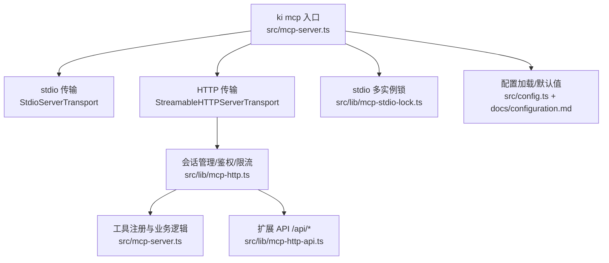
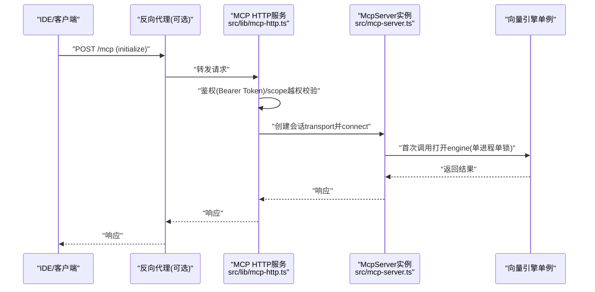
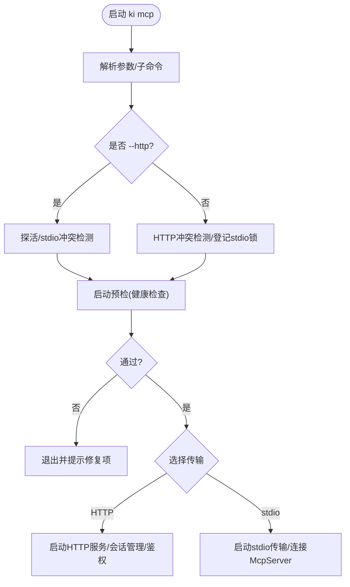
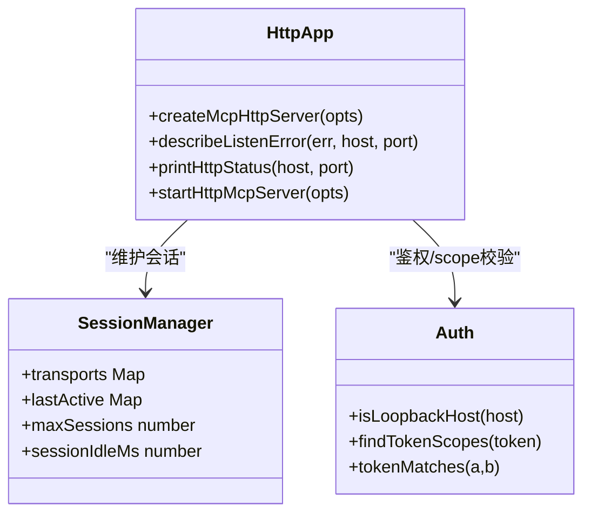
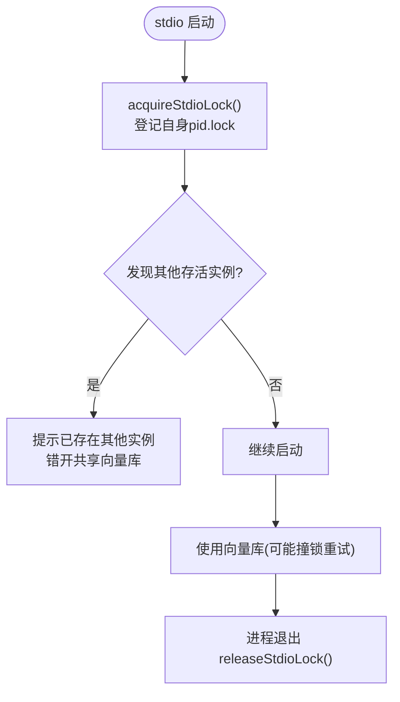
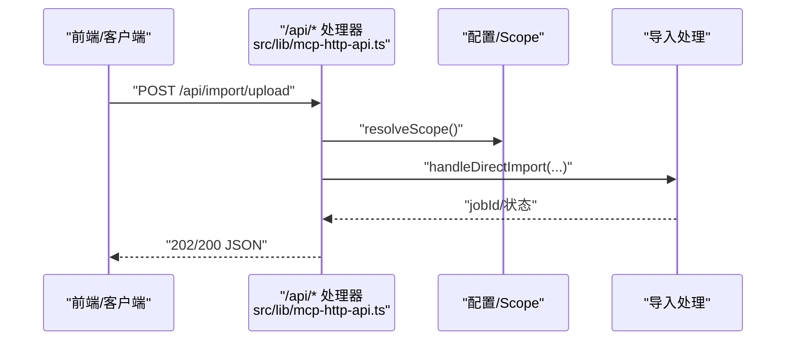
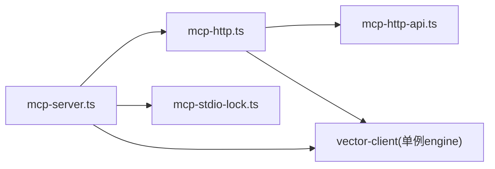

# 部署模式与配置

<cite>
**本文引用的文件**
- [mcp-server.ts](file://src/mcp-server.ts)
- [mcp-http.ts](file://src/lib/mcp-http.ts)
- [mcp-stdio-lock.ts](file://src/lib/mcp-stdio-lock.ts)
- [mcp-http-api.ts](file://src/lib/mcp-http-api.ts)
- [config.ts](file://src/config.ts)
- [configuration.md](file://docs/configuration.md)
- [mcp-http.md](file://docs/mcp-http.md)
</cite>

## 目录
1. [简介](#简介)
2. [项目结构](#项目-结构)
3. [核心组件](#核心组件)
4. [架构总览](#架构总览)
5. [详细组件分析](#详细组件分析)
6. [依赖关系分析](#依赖关系分析)
7. [性能与高可用](#性能与高可用)
8. [部署指南](#部署指南)
9. [故障排查](#故障排查)
10. [结论](#结论)

## 简介
本文件面向生产环境，系统化说明 kisearch MCP 服务的两种部署模式（stdio 与 HTTP）的适用场景、配置差异与安全策略；给出 HTTP 共享单例模式的容器化、负载均衡与高可用实践；明确环境变量、配置文件与命令行参数的优先级；并提供反向代理、SSL 证书与防火墙规则的最佳实践。

## 项目结构
MCP 服务由入口进程统一调度 stdio/HTTP 两种传输，HTTP 模式提供 Streamable HTTP 传输、鉴权与会话管理，并内置 /api/* 扩展路由与前端静态页面能力。

图示来源
- [mcp-server.ts:49-71](file://src/mcp-server.ts#L49-L71)
- [mcp-http.ts:340-410](file://src/lib/mcp-http.ts#L340-L410)
- [mcp-http-api.ts:216-272](file://src/lib/mcp-http-api.ts#L216-L272)
- [mcp-stdio-lock.ts:100-111](file://src/lib/mcp-stdio-lock.ts#L100-L111)
- [configuration.md:7-18](file://docs/configuration.md#L7-L18)

章节来源
- [mcp-server.ts:49-71](file://src/mcp-server.ts#L49-L71)
- [mcp-http.ts:340-410](file://src/lib/mcp-http.ts#L340-L410)
- [mcp-http-api.ts:216-272](file://src/lib/mcp-http-api.ts#L216-L272)
- [mcp-stdio-lock.ts:100-111](file://src/lib/mcp-stdio-lock.ts#L100-L111)
- [configuration.md:7-18](file://docs/configuration.md#L7-L18)

## 核心组件
- 启动与分发：统一解析参数、守卫冲突、预检健康检查后选择 stdio 或 HTTP 模式。
- HTTP 共享单例：幂等探活复用、会话生命周期管理、RBAC scope 校验、DNS rebinding 保护、空闲回收、优雅退出。
- stdio 多实例锁：每实例独立 lock 文件，支持 stop/restart/status 定位与清理。
- 扩展 API：/api/* 提供健康报告、文档列表、导入上传/执行/状态查询。
- 配置体系：YAML/JSON 配置、环境变量、CLI 参数三级优先级。

章节来源
- [mcp-server.ts:492-734](file://src/mcp-server.ts#L492-L734)
- [mcp-http.ts:676-766](file://src/lib/mcp-http.ts#L676-L766)
- [mcp-stdio-lock.ts:118-144](file://src/lib/mcp-stdio-lock.ts#L118-L144)
- [mcp-http-api.ts:216-272](file://src/lib/mcp-http-api.ts#L216-L272)
- [configuration.md:7-18](file://docs/configuration.md#L7-L18)

## 架构总览
下图展示从客户端到服务端的关键调用链与鉴权、会话、向量库锁的关系。

图示来源
- [mcp-http.ts:454-577](file://src/lib/mcp-http.ts#L454-L577)
- [mcp-server.ts:54-71](file://src/mcp-server.ts#L54-L71)

## 详细组件分析

### 启动流程与模式选择
- 参数解析：支持 --http/--host/--port/--token/--allowed-hosts/--web/--no-web/--daemon 以及子命令 token/restart/stop/status。
- 守卫与冲突检测：
  - HTTP 模式：先探活 /healthz，命中健康实例则复用退出；检测存活 stdio 实例并拒绝启动以避免争抢向量库锁。
  - stdio 模式：若存在健康 HTTP 单例则拒绝启动，引导迁移为 URL 接入；登记自身 stdio lock 供运维工具定位。
- 预检与健康检查：启动前运行 doctor 检查，失败直接退出。
- 长驻优化：启用向量库空闲释放锁，避免常驻进程长期持锁导致其他实例等待。

图示来源
- [mcp-server.ts:492-734](file://src/mcp-server.ts#L492-L734)
- [mcp-http.ts:676-766](file://src/lib/mcp-http.ts#L676-L766)

章节来源
- [mcp-server.ts:492-734](file://src/mcp-server.ts#L492-L734)
- [mcp-http.ts:676-766](file://src/lib/mcp-http.ts#L676-L766)

### HTTP 共享单例模式
- 幂等守护：重复执行自动复用健康实例，不重复启动。
- 鉴权策略：回环绑定免鉴权；非回环绑定强制 Bearer Token。Token 来源优先级：命令行 --token > 环境变量 KI_MCP_TOKEN > 多 Token 存储（~/.ki/mcp-tokens.json）。
- RBAC scope 校验：拦截 tools/call 的 arguments.scope（缺省 default），不在授权范围即 403；枚举类无 scope 参数工具走工具层按授权集合过滤输出。
- DNS rebinding 保护：可配置 allowedHosts 白名单。
- 会话模型：每个 initialize 新建 transport + McpServer，共享模块级 vector-client engine；会话上限默认 256，空闲 30 分钟回收。
- 优雅退出：关闭会话、断开长连接、释放向量库锁、删除 lock 文件，超时兜底强制退出。

图示来源
- [mcp-http.ts:340-607](file://src/lib/mcp-http.ts#L340-L607)
- [mcp-http.ts:676-766](file://src/lib/mcp-http.ts#L676-L766)

章节来源
- [mcp-http.ts:340-607](file://src/lib/mcp-http.ts#L340-L607)
- [mcp-http.ts:676-766](file://src/lib/mcp-http.ts#L676-L766)

### stdio 多实例锁
- 每实例独立 lock 文件（文件名即 pid），支持多实例并存与定位。
- 启动时登记自身 lock，退出时自动清理；异常残留会在下次读取时做 pid 存活校验并清理。
- 与 HTTP 单例互斥：检测到存活 HTTP 单例时拒绝 stdio 启动，避免争抢向量库锁。

图示来源
- [mcp-stdio-lock.ts:118-144](file://src/lib/mcp-stdio-lock.ts#L118-L144)
- [mcp-stdio-lock.ts:100-111](file://src/lib/mcp-stdio-lock.ts#L100-L111)

章节来源
- [mcp-stdio-lock.ts:118-144](file://src/lib/mcp-stdio-lock.ts#L118-L144)
- [mcp-stdio-lock.ts:100-111](file://src/lib/mcp-stdio-lock.ts#L100-L111)

### 扩展 API（/api/*）
- 健康报告：/api/health 返回 doctor 检查结果（含 zvec 探活，带超时）。
- 文档列表：/api/doc/list 支持 group/tag/q/limit 筛选与缓存。
- 导入：/api/import/upload 上传文件至受控目录；/api/import/run 触发导入（异步 job）；/api/import/status 查询进度。
- 鉴权与 scope 校验：与 /mcp 一致，远程访问需 Bearer Token，并对带 scope 的请求进行越权拦截。

图示来源
- [mcp-http-api.ts:216-272](file://src/lib/mcp-http-api.ts#L216-L272)
- [mcp-http-api.ts:371-506](file://src/lib/mcp-http-api.ts#L371-L506)

章节来源
- [mcp-http-api.ts:216-272](file://src/lib/mcp-http-api.ts#L216-L272)
- [mcp-http-api.ts:371-506](file://src/lib/mcp-http-api.ts#L371-L506)

### 配置优先级与环境变量
- 配置文件查找顺序：命令行 --config > 环境变量 KI_CONFIG_PATH > $HOME/.ki/config.yaml/yml/json > 内置默认。
- MCP HTTP 默认值：可在配置中设置 mcp.http.host/port/allowedHosts；实际生效顺序 CLI > 配置 > 默认。
- Token 安全：MCP 接入 token 只走命令行或环境变量，绝不写入配置文件。
- 常用环境变量：KI_CONFIG_PATH、KI_WEB_DIR（覆盖前端静态目录）、KI_MCP_TOKEN（全权临时 Token）。

章节来源
- [configuration.md:7-18](file://docs/configuration.md#L7-L18)
- [configuration.md:164-177](file://docs/configuration.md#L164-L177)
- [mcp-http.ts:793-800](file://src/lib/mcp-http.ts#L793-L800)
- [mcp-server.ts:160-211](file://src/mcp-server.ts#L160-L211)

## 依赖关系分析
- mcp-server.ts 负责参数解析、守卫、预检与模式分发，依赖 mcp-http.ts 提供 HTTP 能力，依赖 mcp-stdio-lock.ts 进行 stdio 锁管理。
- mcp-http.ts 实现 HTTP 传输、鉴权、会话、/api/* 路由（延迟加载 mcp-http-api.ts）。
- 向量库通过 vector-client 模块级单例共享，所有会话共用同一 engine，确保单进程单锁。

图示来源
- [mcp-server.ts:492-734](file://src/mcp-server.ts#L492-L734)
- [mcp-http.ts:340-410](file://src/lib/mcp-http.ts#L340-L410)
- [mcp-http-api.ts:216-272](file://src/lib/mcp-http-api.ts#L216-L272)

章节来源
- [mcp-server.ts:492-734](file://src/mcp-server.ts#L492-L734)
- [mcp-http.ts:340-410](file://src/lib/mcp-http.ts#L340-L410)
- [mcp-http-api.ts:216-272](file://src/lib/mcp-http-api.ts#L216-L272)

## 性能与高可用
- 会话上限与空闲回收：默认最大并发会话 256，空闲 30 分钟回收，防止内存泄漏。
- 向量库锁竞争缓解：常驻进程空闲 3 秒后自动释放锁，多实例可“错开共享”，减少同时访问时的等待。
- 优雅退出：SIGINT/SIGTERM 触发关闭会话、断开长连接、释放向量库锁、删除 lock 文件，5 秒兜底强制退出。
- 健康检查：/healthz 免鉴权，用于幂等单例探测与运维监控；/api/health 提供完整健康报告。

章节来源
- [mcp-http.ts:46-56](file://src/lib/mcp-http.ts#L46-L56)
- [mcp-http.ts:381-392](file://src/lib/mcp-http.ts#L381-L392)
- [mcp-http.ts:734-766](file://src/lib/mcp-http.ts#L734-L766)
- [mcp-server.ts:680-686](file://src/mcp-server.ts#L680-L686)

## 部署指南

### 部署模式对比与适用场景
- stdio 模式
  - 适用：单机单 IDE、开发调试、无需网络暴露。
  - 特点：简单直接，但多 IDE 会争抢向量库锁；可通过空闲释放锁“错开共享”。
  - 建议：仅本机使用，避免与 HTTP 单例并存。
- HTTP 模式
  - 适用：多 IDE 共享、跨机访问、生产环境。
  - 特点：单进程持锁、会话隔离、RBAC scope 鉴权、可扩展前端与 API。
  - 建议：生产环境务必前置反向代理并开启 TLS。

章节来源
- [mcp-http.md:3-10](file://docs/mcp-http.md#L3-L10)
- [mcp-http.md:132-146](file://docs/mcp-http.md#L132-L146)

### 环境变量、配置文件与命令行参数优先级
- 配置文件查找：--config > KI_CONFIG_PATH > ~/.ki/config.yaml/yml/json > 内置默认。
- MCP HTTP 默认值：CLI 参数 > mcp.http.* 配置 > 内置默认。
- Token 优先级：--token > KI_MCP_TOKEN > 多 Token 存储（~/.ki/mcp-tokens.json）。
- 注意：Token 不写入配置文件；回环绑定下 Token 不生效。

章节来源
- [configuration.md:7-18](file://docs/configuration.md#L7-L18)
- [configuration.md:164-177](file://docs/configuration.md#L164-L177)
- [mcp-server.ts:160-211](file://src/mcp-server.ts#L160-L211)

### Docker 部署
- 基础镜像：Node.js 运行时（根据构建产物版本选择）。
- 工作目录：将应用代码与 web/dist（如启用 --web）放入容器。
- 端口映射：默认 7423（可配置）。
- 数据持久化：挂载 ~/.ki 目录以保留配置、向量库与锁文件。
- 环境变量：
  - KI_CONFIG_PATH：指定配置文件路径（可选）。
  - KI_WEB_DIR：覆盖前端静态目录（可选）。
  - KI_MCP_TOKEN：全权临时 Token（生产建议使用托管 Token 存储）。
- 启动命令示例：
  - 本地免鉴权：node bin/ki.mjs mcp --http
  - 对外监听并鉴权：node bin/ki.mjs mcp --http --host 0.0.0.0 --port 7423
- 健康检查：curl http://localhost:7423/healthz

章节来源
- [mcp-http.ts:36-44](file://src/lib/mcp-http.ts#L36-L44)
- [mcp-http.ts:793-800](file://src/lib/mcp-http.ts#L793-L800)
- [mcp-http.md:41-57](file://docs/mcp-http.md#L41-L57)

### Kubernetes 编排与高可用
- Pod 设计：单副本承载 MCP HTTP 服务；如需水平扩展，需在反向代理层做会话亲和或基于 URL 的多实例均衡（注意向量库锁限制，推荐单实例 + 反代）。
- Service：暴露 7423 端口（或反代端口）。
- ConfigMap/Secret：注入配置文件与敏感信息（apiKey、Token 等）。
- Liveness/Readiness：
  - livenessProbe：GET /healthz
  - readinessProbe：GET /api/health
- 资源限制：合理设置 CPU/内存，避免 OOM。
- 日志与观测：收集 stderr 输出，配合指标与告警。

章节来源
- [mcp-http.ts:183-223](file://src/lib/mcp-http.ts#L183-L223)
- [mcp-http-api.ts:274-288](file://src/lib/mcp-http-api.ts#L274-L288)

### 反向代理配置（Nginx/Caddy）
- 作用：TLS 终结、Host 头校验、限流、访问控制、缓存静态资源。
- 关键要点：
  - 将 /mcp 与 /api/* 转发至后端 7423。
  - 配置允许的 Host 头（与 --allowed-hosts 配合）。
  - 限制请求体大小与超时时间。
  - 开启 gzip/brotli 压缩静态资源。
- 安全建议：仅允许内网或可信来源访问；生产必须启用 TLS。

章节来源
- [mcp-http.ts:548-553](file://src/lib/mcp-http.ts#L548-L553)
- [mcp-http.md:243-247](file://docs/mcp-http.md#L243-L247)

### SSL 证书设置
- 在反向代理层配置证书（Let’s Encrypt 或企业 CA）。
- 客户端通过 https://<host>/mcp 访问，代理负责解密。
- 证书轮换：使用自动化续期方案（如 certbot）。

章节来源
- [mcp-http.md:243-247](file://docs/mcp-http.md#L243-L247)

### 防火墙与安全组
- 仅开放必要端口（如 443 或反代端口）。
- 限制来源 IP（如仅允许 IDE 所在网段）。
- 结合 --allowed-hosts 与反向代理 Host 白名单双重防护。

章节来源
- [mcp-http.md:243-247](file://docs/mcp-http.md#L243-L247)

### 一键运维命令
- 查看状态：ki mcp --status
- 停止所有实例：ki mcp stop
- 重启 HTTP 单例：ki mcp restart
- 生成/管理 Token：ki mcp token generate/list/update/delete

章节来源
- [mcp-http.md:105-131](file://docs/mcp-http.md#L105-L131)
- [mcp-http.md:170-223](file://docs/mcp-http.md#L170-L223)

## 故障排查
- 端口占用：EADDRINUSE 且未探活到健康实例 → 更换端口或排查占用进程。
- 权限不足：EACCES <1024 端口 → 改用高位端口。
- 地址不可用：EADDRNOTAVAIL → 检查 --host 是否为合法地址。
- 主机名无法解析：ENOTFOUND → 修正 host。
- 鉴权失败（401）：检查 Authorization: Bearer 与 Token 存储一致性；服务端 stderr 有失败原因。
- 越权拒绝（403）：确认请求 scope 在授权范围内；必要时调整 Token scope。
- stdio 与 HTTP 冲突：已有 HTTP 单例时 stdio 会被拒绝；请将 IDE 改为 URL 接入。
- 会话过多：超过 256 会话返回 503；关闭闲置连接或调大 maxSessions。

章节来源
- [mcp-http.ts:609-630](file://src/lib/mcp-http.ts#L609-L630)
- [mcp-http.ts:536-547](file://src/lib/mcp-http.ts#L536-L547)
- [mcp-http.md:224-233](file://docs/mcp-http.md#L224-L233)

## 结论
- 生产环境推荐使用 HTTP 共享单例模式，并通过反向代理提供 TLS 与访问控制。
- 严格遵循配置优先级与 Token 安全策略，避免明文泄露。
- 利用健康检查与一键运维命令提升可观测性与可维护性。
- 在多 IDE 场景下，统一 URL 接入与单实例持锁是避免向量库锁冲突的根本方案。